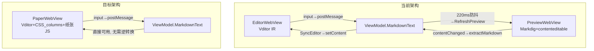

# Vditor-in-Paper 图纸面板架构迁移

## 核心思路

将 Vditor 嵌入纸张容器内，用 CSS `column-count` 实现多栏视觉布局，用覆盖层 JS 实现纸张模拟交互。Vditor 全权管理编辑（光标、撤销、格式化），CSS 负责分栏，JS 负责纸张框架。



**消除的问题**: 双向同步回环、blockToMarkdown有损转换、光标丢失、内容回弹、双WebView内存开销。

------

## Phase 0: 概念验证（Go/No-Go 关卡）

**目标**: 验证 CSS `column-count` 是否与 Vditor 编辑模式兼容。

**实现**: 创建一个独立的 HTML 测试文件，不改动现有代码。

```html
<!-- 纸张容器 -->
<div class="paper" style="width:800px; height:500px; background:white; overflow:hidden; position:relative;">
  <!-- 边距区域 -->
  <div class="paper-inner" style="position:absolute; left:25px; right:10px; top:10px; bottom:10px;">
    <!-- Vditor，content area 应用 CSS columns -->
    <div id="vditor"></div>
  </div>
</div>
```

关键 CSS:

```css
.vditor-ir .vditor-reset,
.vditor--fullscreen .vditor-reset {
  column-count: 2;
  column-gap: 20px;
  column-fill: auto;    /* 先填满第一栏再到第二栏 */
  height: 100%;
  overflow: hidden;      /* 溢出内容被裁剪 = 单页 */
}
```

**必须验证的 5 项**:

| 测试项         | 判定标准                             | 失败影响 |
| -------------- | ------------------------------------ | -------- |
| 光标跨栏移动   | 方向键在栏边界自然跳转               | 致命     |
| 文本选择跨栏   | 鼠标拖选能跨越两栏                   | 致命     |
| 格式化命令     | Bold/Heading/List 在任意栏内正常工作 | 致命     |
| 撤销/重做      | Ctrl+Z/Y 跨栏操作正常                | 严重     |
| 工具栏浮层定位 | 链接/图片编辑弹层位置正确            | 可绕过   |

**如果 Phase 0 失败（任一致命项不通过）**: 执行 Fallback 方案（见末尾）。

------

## Phase 1: 创建 PaperVditorHtmlTemplate

**新文件**: [Html/PaperVditorHtmlTemplate.cs](HyCADTool.MarkdownEditor/Html/PaperVditorHtmlTemplate.cs)

合并 `VditorHtmlTemplate.cs` 的 Vditor 初始化 + `PreviewHtmlRenderer.cs` 的纸张框架，生成一个完整 HTML。

**HTML 结构**:

```
<html>
<head>
  <link Vditor CSS>
  <script Vditor JS>
  <style> 纸张框架 CSS + Vditor column-count 覆写 </style>
</head>
<body>
  <div class="viewport">         ← 滚动/缩放容器
    <div class="pages-flow">     ← 多页流
      <div class="paper-wrap">   ← 纸张外框
        <div class="paper">      ← 纸张（固定尺寸）
          <div class="paper-inner">   ← 边距内区域
            <div id="vditor"></div>   ← Vditor 实例
          </div>
          <div class="margin-guide left/right/top/bottom"></div>
          <div class="paper-resize-right/bottom/corner"></div>
        </div>
      </div>
    </div>
  </div>
  <div class="paper-footer"></div>  ← 栏统计
  <script>
    // Vditor 初始化（无工具栏，由 WPF 侧调用）
    // 纸张交互 JS（边距拖拽、缩放、翻页）
    // 统计计算 JS
  </script>
</body>
</html>
```

**关键决策**:

- Vditor 模式: 使用 `mode: 'ir'`（与编辑面板一致；后续可测试 `wysiwyg` 模式）
- 工具栏: `toolbar: false`（隐藏 Vditor 内置工具栏），所有格式命令通过 `VditorJsHelper` 从 WPF 侧发出
- CSS columns: 在 `.vditor-reset` 上注入 `column-count` / `column-gap` / `column-fill: auto`
- 纸张尺寸: 用占位符 `/*PAPER_WIDTH*/` 等，由 C# 替换（复用现有模式）

**从 PreviewHtmlRenderer.cs 迁移的 JS 模块** (约 1200 行，占当前 4668 行的 ~25%):

- 纸张拖拽调整（`dragMode/paperGeometry/paperMargins`）: ~400 行
- 缩放控制（`wheelZoom/setPaperGeometry`）: ~150 行
- 多页导航（`jumpToPage/scrollToPage/postPageState`）: ~150 行
- 统计计算（见 Phase 3）: ~200 行
- PostHost 通信协议（`postHost/getHost`）: ~50 行

**从 PreviewHtmlRenderer.cs 删除的 JS 模块** (约 2500 行，占 ~55%):

- `contenteditable` 事件绑定: ~200 行
- `normalizeContentEditableDivs`: ~100 行
- `blockToMarkdown`/`inlineToMarkdown`/`extractMarkdown`/`tableToMarkdown`: ~300 行
- `captureCaretBookmark`/`restoreCaretBookmark`: ~200 行
- `distributeBlocksSequential`/`rebuildColumnsFromSource`: ~300 行
- `updateSourceMirrorFromColumns`/`notifyContentChanged`: ~200 行
- `debouncedColumnReflow`/`isColumnOverflow`: ~200 行
- 旧版 Legacy Layout 模式全部代码: ~1000 行

------

## Phase 2: 集成到现有基础设施

### 2.1 修改 PreviewManager

文件: [Services/PreviewManager.cs](HyCADTool.MarkdownEditor/Services/PreviewManager.cs)

- `RefreshPreviewAsync`: 改为调用 `PaperVditorHtmlTemplate.Generate()`
- 增量更新: 不再用 `RenderFlowBodyHtml` + `updateSource`，改为调用 Vditor 的 `setValue(markdown)`
- 移除 `blockToMarkdown` 逆转换相关逻辑
- 保留: 纸张几何同步（`setPaperGeometry`/`setPaperMargins`/`setPaperColumnLayout`）
- 保留: 统计拉取（`getPreviewStats`）
- 保留: 版本号/哈希去重

### 2.2 修改 EditorWindow

文件: [Views/EditorWindow.xaml.cs](HyCADTool.MarkdownEditor/Views/EditorWindow.xaml.cs)

Layout 模式下:

- PreviewWebView 加载 `PaperVditorHtmlTemplate` 生成的 HTML
- Vditor input 回调 → `postMessage({type:'input', value})` → 更新 `ViewModel.MarkdownText`
- **不再需要** `SyncEditorFromPreviewAsync`（图纸面板直接输出 Markdown）
- **不再需要** `_isUpdatingFromPreview` 回环防护
- 格式化命令 → `VditorJsHelper` 调用 Paper WebView 中的 Vditor 实例

### 2.3 工作区模式调整

| 模式      | 变化                                                         |
| --------- | ------------------------------------------------------------ |
| Writing   | 不变（纯 Vditor 编辑，无纸张）                               |
| Layout    | PreviewWebView 加载 PaperVditor HTML（Vditor+纸张），EditorWebView 仍隐藏 |
| Proofread | 左侧 Vditor（编辑），右侧 PaperVditor（纸张预览+可编辑）；需同步 |

Proofread 模式仍需双向同步，但**大幅简化**: 两侧都是 Vditor，只需 `getValue()`/`setValue()` 互传 Markdown，不再有 HTML↔Markdown 有损转换。

### 2.4 VditorJsHelper 复用

文件: [Html/VditorJsHelper.cs](HyCADTool.MarkdownEditor/Html/VditorJsHelper.cs)

当前 `VditorJsHelper` 的 50+ 方法可直接复用于 PaperWebView 中的 Vditor 实例。Layout 模式下 `ViewModel.SetJsHelper()` 指向 PaperWebView 的 Vditor 即可。

------

## Phase 3: 统计回传重建

CSS `column-count` 不暴露"每栏有哪些内容"的 API，需要用位置检测。

**方案**: 用 `getClientRects()` + 栏边界计算

```javascript
function computeColumnStats() {
  var contentArea = document.querySelector('.vditor-reset');
  var rect = contentArea.getBoundingClientRect();
  var colWidth = (rect.width - (COLUMN_COUNT - 1) * COLUMN_GAP) / COLUMN_COUNT;

  var stats = Array.from({length: COLUMN_COUNT}, () => ({chars: 0, paras: 0}));

  // 遍历所有块元素，按水平位置判断属于哪个栏
  var blocks = contentArea.querySelectorAll('h1,h2,h3,h4,h5,h6,p,ul,ol,blockquote,pre,table');
  blocks.forEach(function(block) {
    var blockRect = block.getBoundingClientRect();
    var colIndex = Math.floor((blockRect.left - rect.left) / (colWidth + COLUMN_GAP));
    colIndex = Math.max(0, Math.min(COLUMN_COUNT - 1, colIndex));
    stats[colIndex].chars += block.textContent.length;
    stats[colIndex].paras += 1;
  });

  return stats;
}
```

输出格式保持与现有 `PreviewStats` 兼容，`PreviewManager.SyncFromPreviewAsync` 无需修改。

------

## Phase 4: 多页支持

CSS `column-count` + 固定高度容器 = 单页（溢出被裁剪）。多页支持需额外 JS。

**方案**: 溢出检测 + 虚拟分页

```javascript
// 检测 Vditor 内容是否超出纸张高度
function checkOverflow() {
  var content = document.querySelector('.vditor-reset');
  var isOverflowing = content.scrollHeight > content.clientHeight;
  // 计算总页数 = ceil(scrollHeight / pageContentHeight)
  var totalPages = Math.ceil(content.scrollHeight / content.clientHeight);
  postHost({type: 'pageState', currentPage: currentPageIndex + 1, totalPages: totalPages});
}

// 翻页 = 修改 content 的 scrollTop（或 CSS transform translateY）
function jumpToPage(pageNo) {
  var content = document.querySelector('.vditor-reset');
  content.scrollTop = (pageNo - 1) * content.clientHeight;
  currentPageIndex = pageNo - 1;
  postPageState();
}
```

限制: 这是"滚动分页"而非"真实分页"（内容不会在页面边界精确断开）。对于 CAD 图纸排版，这可能已经足够，因为最终精确分页由 CAD 端的 LayoutEngine 处理。

------

## Phase 5: 架构精简

**可删除的代码**:

| 文件/模块                                                    | 删除量   | 原因                |
| ------------------------------------------------------------ | -------- | ------------------- |
| `PreviewHtmlRenderer.cs` flowCssTemplate 中 contenteditable 相关 CSS | ~50 行   | Vditor 自带样式     |
| `PreviewHtmlRenderer.cs` flowJsTemplate 中 contenteditable/blockToMarkdown/光标管理 | ~2500 行 | Vditor 全权管理     |
| `EditorWindow.xaml.cs` 双向同步逻辑                          | ~200 行  | 单 WebView 无需同步 |
| `MarkdownSyncCoordinator.cs`                                 | 整个文件 | 不再需要同步协调    |
| 问题文档中描述的 4 层防环机制                                | ~100 行  | 根因消除            |

**预计净减少**: ~2800 行代码（从 ~6000 行减到 ~3200 行）

------

## Fallback 方案（如果 Phase 0 失败）

如果 CSS `column-count` + Vditor 不兼容，退回"样式注入"方案:

1. 保持 `contenteditable` 分栏编辑（现有 JS）
2. 将 `flowCssTemplate` 中的 292–306 行 Markdown 样式替换为 Vditor `content-theme` CSS
3. 注入 `highlight.js`（native 主题）到 `flowCssTemplate`
4. 渐进增强 `blockToMarkdown`（补全嵌套列表、代码块语言、删除线等）

工作量: ~6 小时（vs Vditor-in-Paper 的 ~30 小时），收益约 60%（渲染质量对齐，但编辑体验不变）。

------

## 风险矩阵

| 风险                                      | 概率 | 影响 | 缓解                                   |
| ----------------------------------------- | ---- | ---- | -------------------------------------- |
| CSS columns + Vditor 光标/选择不兼容      | 中   | 致命 | Phase 0 PoC 验证；有 Fallback          |
| Vditor 浮层（链接编辑等）定位偏移         | 高   | 中   | 可 CSS 修正，或禁用浮层改用 WPF 对话框 |
| 多页溢出处理不如当前精确                  | 高   | 中   | CAD 端 LayoutEngine 做最终精确分页     |
| Proofread 模式双 Vditor 同步              | 低   | 低   | 两侧都输出 Markdown，同步简单          |
| PaperWebView 中 Vditor + 纸张 JS 内存占用 | 低   | 低   | 单 WebView2 实例，比当前双实例更少     |