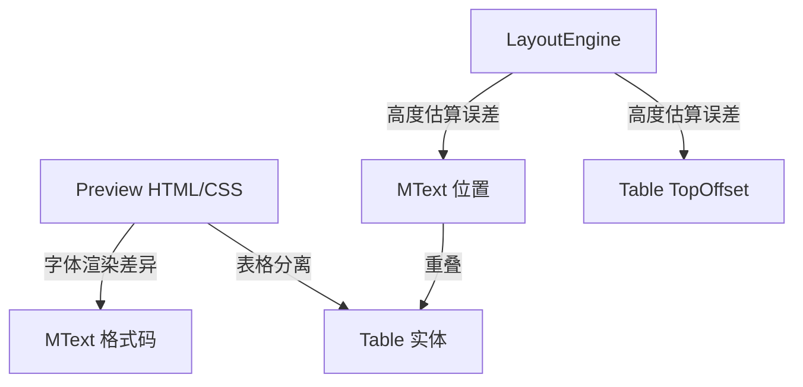

# MText 与图纸面板严格对齐修复

## 问题诊断

当前从预览面板到 AutoCAD 存在以下对齐断裂点：



**RC-1 列数不一致**: `EditorLoader.TryParseEditorResultJson()` 仅拆分 page0 的列索引给 `columnContents`，多页时 `DesignSpecService.BuildAllPageColumnData()` 会重新拆分，但 `area.ColumnCount`（来自 `CalculateArea`）与 `LayoutResult.Pages[p].ColumnBlockIndices.Length` 可能不同步。

**RC-2 表格与文字重叠**: 当前架构是每列一个 MText（删掉表格内容）+ N 个 Table 实体。Table 的 Y 坐标依赖 `TopOffsetMm`（各 block 高度累加），但 MText 实际渲染高度与估算值存在偏差，导致 Table 落点不准。

**RC-3 文字高度/行距不一致**: Preview 的 CSS `line-height` 与 MText 的 `LineSpacingFactor` 语义不同——CSS 按 em，MText 按行高倍数（基于 ascender/descender）。加上字体度量差异，同一段文字在预览和 CAD 中占用的垂直空间不同。

**RC-4 表格过大/过小**: `baseRowHeight = ActualTextHeight * LineSpacingFactor * 1.3` 中 `1.3` 是硬编码倍率，不适配所有字体；多行单元格的行数估算也可能偏差。

**RC-5 列水平位置偏移**: `CalculateArea()` 在有 `LayoutResult.ColumnWidthsMm` 时直接使用，否则回退到字符数驱动的宽度。两种模式可能给出不同列宽。

**RC-6 多页位置错乱**: `pageTopY = insertionPoint.Y - pageIdx * pageHeightScaled` 假设页面垂直堆叠，但 `pageHeightScaled = PageHeightMm * Scale`，若 Scale 参数传递链有断裂，Y 偏移会累积错误。

------

## 修复方案

### Phase 1: 列数与坐标统一（修复 RC-1, RC-5, RC-6）

**目标**: 确保 `MText个数 = 页数 * 列数`，列宽和位置由 `LayoutResult` 单一来源驱动。

**改动文件**:

- `[DesignSpecService.cs](HyCADTool.Refactored/Infrastructure/AutoCAD/Services/DesignSpecService.cs)`
  1. `Insert()` / `Update()` 的列循环从 `area.ColumnCount` 改为从 `pageData.ColumnContents.Length` 驱动：

```csharp
     int pageColCount = pageData.ColumnContents.Length;
     for (int i = 0; i < pageColCount; i++)
     
```

1. 列宽取值：优先从 `LayoutResult.ColumnWidthsMm` 取，长度不匹配时回退 `area.ColumnWidths`
2. 对空列（没有文字和表格）也创建空 MText 占位，确保计数严格 = 页数 x 列数

- `[DesignSpecService.CalculateArea()](HyCADTool.Refactored/Infrastructure/AutoCAD/Services/DesignSpecService.cs)` (line 966-989) 确保 `ColumnWidthsMm` 长度与 `config.ColumnCount` 一致，不一致时用 `GetPageDrivenColumnWidth()` 补齐。

### Phase 2: MText 按表格边界分段插入（修复 RC-2 核心）

**目标**: 消除 MText 与 Table 的重叠。

**当前架构**:

```
栏 = 1个 MText(所有文字, 去掉表格) + N个 Table(估算偏移)
```

**新架构**:

```
栏 = [MText段1] → [Table1] → [MText段2] → [Table2] → [MText段3]
```

每个实体插入后用 `GeometricExtents` 获取实际高度，精确定位下一个实体。

**改动文件**:

- `[DesignSpecService.cs](HyCADTool.Refactored/Infrastructure/AutoCAD/Services/DesignSpecService.cs)` 新增方法 `InsertColumnEntities()`：

```csharp
  private int InsertColumnEntities(
      Transaction tr, BlockTableRecord btr, Database db,
      DesignSpecConfig config,
      int pageIdx, int colIdx,
      string columnMarkdown,
      double textLeftX, double textTopY, double z,
      double textWidth, ObjectId textStyleId,
      string groupId, string markdownSource,
      List<TablePlacement> placements,
      ref bool metadataWritten, ref ObjectId anchorEntityId)
  {
      // 1. 解析 columnMarkdown 为 block 列表
      // 2. 按 block 顺序遍历:
      //    - 非表格 block: 累积到当前 MText 段
      //    - 表格 block: 先刷出当前 MText 段, 获取实际 extents, 再插入 Table
      // 3. 每个实体的 Y 位置 = 上一个实体的 bottom Y
  }
  
```

  插入 MText 后获取实际底边 Y:

```csharp
  btr.AppendEntity(mtext);
  tr.AddNewlyCreatedDBObject(mtext, true);
  mtext.SetDatabaseDefaults();
  var ext = mtext.GeometricExtents;
  double actualBottomY = ext.MinPoint.Y;
  
```

- `[MarkdownToMTextRenderer.cs](HyCADTool.Refactored/Domain/Models/Text/MarkdownToMTextRenderer.cs)` 无需大改，已有 `Convert()` 可对任意 markdown 片段生成 MText。
- 新增辅助方法 `SplitColumnMarkdownByBlocks()`: 将一列的 markdown 按 block 拆分为 `(blockType, markdownSegment)[]`，用于逐段插入。

### Phase 3: 表格尺寸校准（修复 RC-4）

**改动文件**:

- `[DesignSpecService.TryCreateTable()](HyCADTool.Refactored/Infrastructure/AutoCAD/Services/DesignSpecService.cs)` (line 552-629)
  1. **行高**: 去掉硬编码 `1.3` 倍率，改为基于实际字体度量:

```csharp
     double baseRowHeight = config.ActualTextHeight * config.LineSpacingFactor + cellPadding * 2;
     
```

1. **列宽**: 使用 `table.GenerateLayout()` 后的实际宽度校验，若总宽超出 `columnWidth`，按比例缩放
2. **最小行高保护**: 保证每行至少容纳一行文字

### Phase 4: 预览-CAD 文字度量统一（修复 RC-3）

**改动文件**:

- `[PreviewHtmlRenderer.cs](HyCADTool.MarkdownEditor/Html/PreviewHtmlRenderer.cs)` CSS 中的 `line-height` 语义修正：
  - MText `LineSpacingFactor=1.2` 对 `Exactly` 模式表示行距 = TextHeight * 1.2
  - CSS `line-height: 1.2` 表示行距 = fontSize * 1.2
  - 两者在大部分字体下近似一致，但需确保:
    - 标题 H1-H3 的 `margin-top/margin-bottom` 对应 `H*SpaceBefore/After * TextSize * PreviewScale`
    - 段后间距 `PSpaceAfter` 映射到 CSS `margin-bottom`
    - 列表间距 `LiSpaceAfter` 映射到 `li` 的 `margin-bottom`
    - 引用间距映射到 `blockquote` 的 `margin`
  - 现有 token 替换机制已覆盖大部分，需检查并补齐缺失的 CSS 规则 关键检查点（在 JS 的 CSS 模板中，约 line 100-309）:
  - `h1 { margin-top: /*H1_SPACE_BEFORE*/; margin-bottom: /*H1_SPACE_AFTER*/; }` 需要新增 token
  - `p { margin-bottom: /*P_SPACE_AFTER*/; }` 需要新增 token
  - `li { margin-bottom: /*LI_SPACE_AFTER*/; }` 需要新增 token

------

## 改动范围评估

| 文件                         | 改动量               | 风险             |
| ---------------------------- | -------------------- | ---------------- |
| `DesignSpecService.cs`       | 大（重构插入逻辑）   | 中（需回归测试） |
| `PreviewHtmlRenderer.cs`     | 中（CSS token 补齐） | 低               |
| `MarkdownToMTextRenderer.cs` | 小（无结构性改动）   | 低               |
| `DesignSpecConfig.cs`        | 小（可能新增校验）   | 低               |
| `EditorLoader.cs`            | 小（修复多页列数）   | 低               |

## 建议执行顺序

Phase 1 → Phase 2 → Phase 3 → Phase 4，每阶段完成后编译测试。Phase 2 是核心（消除重叠），其他阶段是精度优化。