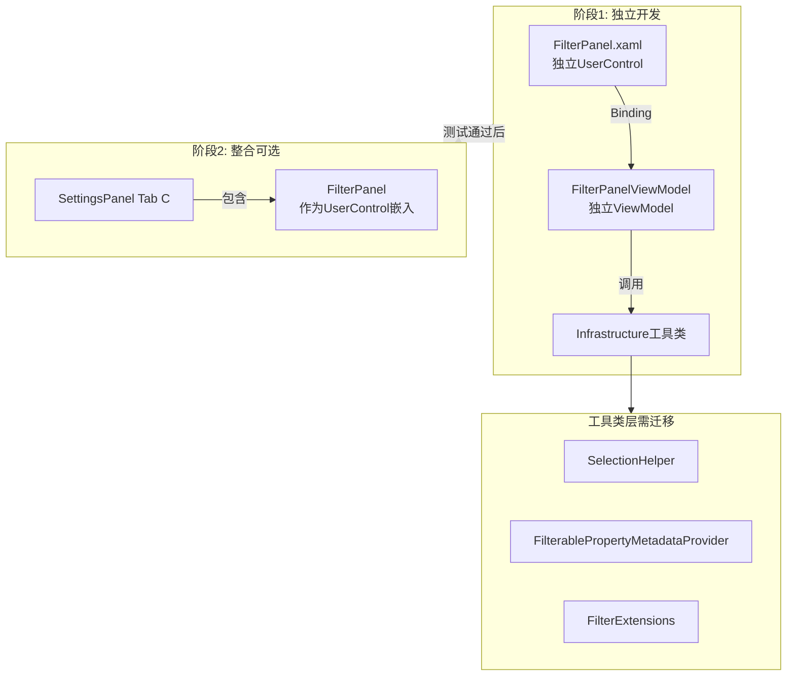

# FilterPanel 独立模块重构

## 背景

FilterPanel 提供图形过滤选择功能，包括：

- 公共属性过滤（类型、图层、颜色、线宽、线型、透明度）
- 属性值过滤（自定义表达式）
- 选择集管理

**架构原则**：保持模块独立性，避免过早耦合

1. 先创建独立的 FilterPanel + FilterPanelViewModel
2. 独立测试通过后，再作为 UserControl 嵌入 SettingsPanel Tab C
3. SettingsPanelViewModel 已经很大（样式+钢筋），不应继续膨胀

从旧项目 `HyCADtool/Views/FilterPanel - 复制.xaml` 迁移到新项目 `HyCADTool.Refactored/Presentation/Views/FilterPanel.xaml`（独立 UserControl）。

## 架构概览



## 实施步骤

### 1. 迁移依赖工具类（Infrastructure 层）

**1.1 创建选择工具类**

在 `[HyCADTool.Refactored/Infrastructure/AutoCAD/Selection/SelectionHelper.cs](e:\BaiduSyncdisk\Code\CSharp\CursorProjects\hy-cad-tool\HyCADTool.Refactored\Infrastructure\AutoCAD\Selection\SelectionHelper.cs)` 中添加：

- `SelectSingleEntity()` 方法（从 `HyCADtool/Tools/SelectTool/SelectEntityTool.cs` 迁移）
- 封装 Editor.GetSelection() 逻辑

**1.2 创建属性元数据提供者**

创建 `[HyCADTool.Refactored/Infrastructure/AutoCAD/Metadata/FilterablePropertyMetadataProvider.cs](e:\BaiduSyncdisk\Code\CSharp\CursorProjects\hy-cad-tool\HyCADTool.Refactored\Infrastructure\AutoCAD\Metadata\FilterablePropertyMetadataProvider.cs)`：

- 从 `HyCADtool/Config/FilterablePropertyMetadataProvider.cs` 迁移
- 提供 `GetMetadataList()` 返回各实体类型的可筛选属性

**1.3 扩展方法集迁移**

创建/扩充 `[HyCADTool.Refactored/Infrastructure/AutoCAD/Extensions/FilterExtensions.cs](e:\BaiduSyncdisk\Code\CSharp\CursorProjects\hy-cad-tool\HyCADTool.Refactored\Infrastructure\AutoCAD\Extensions\FilterExtensions.cs)`：

从 `HyCADtool/Tools/SelectTool/AcTv.cs` 迁移以下方法：

- `GetfilterWithString(string)` - 类型过滤器
- `GetLayerFilter(string)` - 图层过滤器
- `GetTrueColor(Entity)` - 获取实际颜色
- `GetTrueLineWeight(Entity)` - 获取实际线宽
- `GetTrueLinetype(Entity)` - 获取实际线型
- `GetTrueTransparency(Entity)` - 获取实际透明度
- `GetLineWeightFilter(LineWeight)` - 线宽过滤器
- `GetEntitiesWithMatchingColorInputIds()` - 颜色匹配
- `GetEntitiesWithMatchingLinetype()` - 线型匹配
- `GetEntitiesWithMatchingTransparency()` - 透明度匹配
- `FilterEntitiesBy()` - 谓词筛选（3 个重载）
- `GetFilterableProperties(Entity)` - 获取可筛选属性字典

**注意**：部分 GetTrue* 方法在 Refactored 的 Filters 文件夹已有私有实现，需改为 public 扩展方法。

### 2. 创建独立的 FilterPanel.xaml

**新建** `HyCADTool.Refactored/Presentation/Views/FilterPanel.xaml`（UserControl）：

从旧项目 `HyCADtool/Views/FilterPanel - 复制.xaml` 完整迁移 UI 结构：

```xml
<UserControl x:Class="HyCADTool.Refactored.Presentation.Views.FilterPanel"
             xmlns="..."
             Width="280"
             Background="#3b4453">
    <UserControl.Resources>
        <ResourceDictionary>
            <ResourceDictionary.MergedDictionaries>
                <ResourceDictionary Source="pack://application:,,,/HyCADTool.Refactored;component/Presentation/Resources/LibraryResources.xaml" />
            </ResourceDictionary.MergedDictionaries>
        </ResourceDictionary>
    </UserControl.Resources>
    
    <ScrollViewer Style="{StaticResource SmallScrollViewer}" VerticalScrollBarVisibility="Auto">
        <StackPanel Margin="5,10,5,5">
            <!-- 选择单个图形按钮 -->
            <Button Command="{Binding SelectSingleEntityCommand}" Content="选择单个图形得到过滤器" />
            
            <!-- 选中类型显示 -->
            <Grid>
                <TextBlock Text="选中类型" />
                <TextBox Text="{Binding SelectedType}" IsReadOnly="True" />
            </Grid>
            
            <!-- 自行选择按钮 -->
            <Button Command="{Binding SelectCommand}" Content="自行选择" />
            
            <!-- 公共属性过滤器 Expander -->
            <Expander Header="公共属性过滤器" IsExpanded="True">
                <!-- 6 个 CheckBox：类型、图层、颜色、线宽、线型、透明度 -->
            </Expander>
            
            <!-- 属性值过滤器 Expander -->
            <Expander Header="属性值过滤器" IsExpanded="True">
                <!-- 属性列表 ListBox、操作符 ComboBox、表达式管理 -->
            </Expander>
            
            <!-- 重置过滤器按钮 -->
            <Button Command="{Binding ResetCommand}" Content="重置过滤器" />
        </StackPanel>
    </ScrollViewer>
</UserControl>
```

**样式说明**：

- 使用统一颜色方案（`#3b4453` 背景、`#2e3440` 输入框）
- 复用 `LibraryResources.xaml` 的按钮/滚动条样式
- Width 设为 280（与 SettingsPanel 一致）

### 3. 创建独立的 FilterPanelViewModel

**新建** `HyCADTool.Refactored/Presentation/ViewModels/FilterPanelViewModel.cs`：

从旧项目 `HyCADtool/Views/ViewModels/FilterPanelViewModel.cs` 完整迁移：

```csharp
namespace HyCADTool.Refactored.Presentation.ViewModels
{
    public class FilterPanelViewModel : INotifyPropertyChanged
    {
        // ===== 属性 =====
        public string SelectedType { get; set; }
        public string SelectedPropertyValue { get; set; }
        
        // 6 个过滤器 CheckBox
        public bool TypeChecked { get; set; }
        public bool LayerChecked { get; set; }
        public bool ColorChecked { get; set; }
        public bool LineWeightChecked { get; set; }
        public bool LineTypeChecked { get; set; }
        public bool TransparencyChecked { get; set; }
        
        // 集合
        public ObservableCollection<string> PropertyFields { get; } = new();
        public ObservableCollection<string> Operators { get; } = new() { "==", "!=", ">", "<", ">=", "<=" };
        public ObservableCollection<string> ExpressionFilters { get; } = new();
        
        public string SelectedPropertyField { get; set; }
        public string SelectedOperator { get; set; }
        public string InputValue { get; set; }
        public string SelectedExpressionFilter { get; set; }
        
        // ===== 命令 =====
        public ICommand SelectSingleEntityCommand { get; }
        public ICommand SelectCommand { get; }
        public ICommand ResetCommand { get; }
        public ICommand AddExpressionFilterCommand { get; }
        public ICommand RemoveExpressionFilterCommand { get; }
        
        // ===== 私有字段 =====
        private Entity _selectedEntity;
        private ObjectId[] _userSelectedIds = new ObjectId[0];
        
        // ===== 构造函数 =====
        public FilterPanelViewModel() { /* 初始化命令 */ }
        
        // ===== 命令实现 =====
        private void SelectSingleEntity() { /* 调用 SelectionHelper */ }
        private void SelectWithFilters() { /* 应用过滤器 */ }
        private void ResetFilters() { /* 重置状态 */ }
        private void AddExpressionFilter() { /* 添加表达式 */ }
        private void RemoveExpressionFilter() { /* 删除表达式 */ }
        
        // ===== 辅助方法 =====
        private void UpdateSelectedPropertyValue() { /* 更新属性值显示 */ }
        private string ExtractPropertyName(string field) { /* 提取属性名 */ }
        private IEnumerable<ObjectId> FilterEntitiesByExpression(...) { /* 表达式筛选 */ }
        private static bool Compare<T>(T a, T b, string op) { /* 泛型比较 */ }
    }
}
```

**关键点**：

- 完全独立的 ViewModel，不依赖 SettingsPanelViewModel
- 使用新迁移的 Infrastructure 工具类（SelectionHelper、FilterExtensions 等）

### 4. 创建显示命令（测试用）

**修改或新建** 测试命令，用于独立显示 FilterPanel：

选项 A：在 `Test/TestCommand.cs` 中直接显示

```csharp
public void Run()
{
    // 显示独立 FilterPanel 窗口
    var panel = new Presentation.Views.FilterPanel();
    panel.DataContext = new Presentation.ViewModels.FilterPanelViewModel();
    
    var window = new System.Windows.Window
    {
        Title = "过滤器面板（独立测试）",
        Content = panel,
        SizeToContent = System.Windows.SizeToContent.WidthAndHeight,
        ResizeMode = System.Windows.ResizeMode.NoResize
    };
    
    Autodesk.AutoCAD.ApplicationServices.Application.ShowModelessWindow(window);
}
```

选项 B：创建专用的 ShowFilterPanelCommand

用户可通过 `C2 → C1` 打开独立的 FilterPanel 窗口进行测试。

### 5. 处理特殊依赖

**5.1 类型转换**：

旧代码使用 `.ToChinese()` 和 `.ToType()`，Refactored 已有 `TypeNameConverter.cs`，直接使用。

**5.2 过滤器 API**：

旧代码使用 `.Getfilter().SelectWithFilterAll()`，需要在 FilterExtensions 中实现或简化为直接使用 `SelectionFilter`。

**5.3 反射桥接（如果必要）**：

如果某些旧工具类迁移成本过高，可参考钢筋命令的反射方式，在 ViewModel 中通过反射调用旧 HyCADtool.dll 的方法。

## 文件清单

### 新建文件

- `Infrastructure/AutoCAD/Selection/SelectionHelper.cs`
- `Infrastructure/AutoCAD/Metadata/FilterablePropertyMetadataProvider.cs`
- `Infrastructure/AutoCAD/Extensions/FilterExtensions.cs`（或扩充现有）

### 修改文件

- `Presentation/Views/SettingsPanel.xaml` - Tab C UI
- `Presentation/ViewModels/SettingsPanelViewModel.cs` - 属性/命令/逻辑
- `Test/TestCommand.cs` - 测试入口

### 参考文件（旧项目）

- `HyCADtool/Views/FilterPanel - 复制.xaml` - UI 源
- `HyCADtool/Views/ViewModels/FilterPanelViewModel.cs` - ViewModel 源
- `HyCADtool/Tools/SelectTool/SelectEntityTool.cs` - SelectSingleEntity
- `HyCADtool/Tools/SelectTool/AcTv.cs` - 扩展方法集
- `HyCADtool/Config/FilterablePropertyMetadataProvider.cs` - 元数据

## 测试验证

1. `C2` 重载插件
2. `C1` 打开面板，切换到 Tab C
3. 测试流程：
   - 点击"选择单个图形得到过滤器" → 选择一个实体 → 显示类型和属性列表
   - 勾选"类型过滤" + 点击"自行选择" → 选择多个图形 → 筛选出相同类型
   - 添加属性表达式过滤器 → 测试组合筛选
   - 点击"重置过滤器" → 清空状态

## 风险与注意事项

1. **依赖复杂度高**：FilterPanel 依赖大量旧项目的扩展方法，迁移工作量较大
2. **命名空间冲突**：注意旧项目的 `HyCADTool` 和新项目的 `HyCADTool.Refactored` 避免混淆
3. **异常处理**：过滤逻辑中使用 `System.Exception`（遵循 06 规则）
4. **性能考虑**：大量实体筛选时可能耗时，考虑添加进度提示
5. **UI 测试**：面板较复杂，需充分测试各控件的 Binding 和交互

## 后续 PilePanel（Tab D）

完成 FilterPanel 后，可以类似方式将 PilePanel 迁移到 Tab D，依赖相对较少（主要是 ICadService、IAreaFactory、IConfigService）。