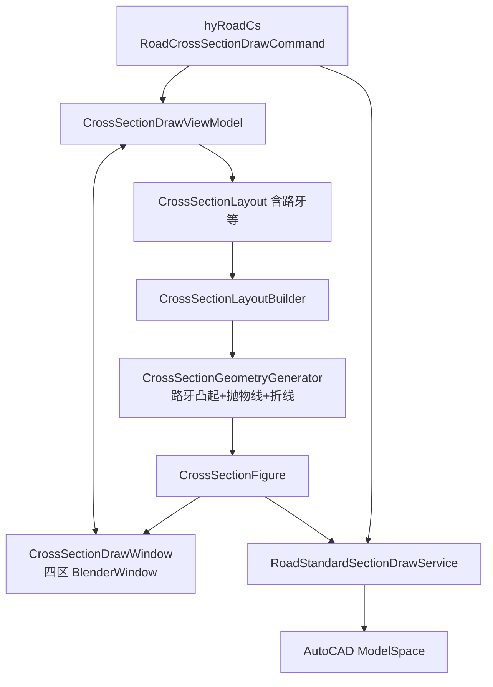

# 道路横断绘制重构 — 方案

> 用新命令 `hyRoadCs` 完全替代旧 `hyRoadT`，分 3 阶段：先在 Domain 层扩展板块字段并升级几何让路牙凸起真实出现（图2效果），再用 BlenderUI 工作台四区布局重写 UI，最后注册新命令并把旧链路标记弃用。

## 1. 决策定稿

| 项 | 决定 |
|---|---|
| 新命令名 | `hyRoadCs`（CrossSection 缩写），displayName 「横断绘制」 |
| 旧命令处置 | `hyRoadT` 在 commands.json 改为指向新命令类，displayName 改「[旧] 横断面模板」；C# 类标 `[Obsolete]`，函数体转发 |
| UI 形态 | BlenderWindow 四区：顶 EditorHeader+Toolbar / 左 Outliner（板块树）/ 中 Canvas（预览）/ 右 PropertyEditor（分组 Expander）/ 底 BlenderWindow.Footer |
| 第一阶段交付 | 路牙真实凸起几何（图2 凸起效果）+ Domain 字段扩展，旧 UI 暂不动也能直接看到效果 |

## 2. 关键文件清单

### 新增

- `HyCADTool.Refactored/Domain/ValueObjects/Road/KerbSpec.cs` — 路牙规格 VO（Type/Model/Height/Width）
- `HyCADTool.Refactored/Domain/Models/Road/RoadKerbType.cs` — `None / Curb 立缘 / Plain 平石 / Combined 组合`
- `HyCADTool.Refactored/Domain/Models/Road/RoadCrownProfile.cs` — `Linear 直线型 / Parabolic 抛物线 / Folded 折线`
- `HyCADTool.Refactored/Domain/Models/Road/RoadSlopeType.cs` — `Single 单坡 / Double 双坡`
- `HyCADTool.Refactored/Domain/Models/Road/RoadSurfaceLayer.cs` — `PavementSurface / SidewalkPaving / NonMotorPaving / GreenSoil`
- `HyCADTool.Refactored/Domain/Services/Road/CrossSectionGeometryGenerator.cs` — 替代 `ToFigure` 内联几何，独立类便于扩展；处理路牙凸起、抛物线、折线
- `HyCADTool.Refactored/Presentation/Commands/Road/RoadCrossSectionDrawCommand.cs` — 新命令入口
- `HyCADTool.Refactored/Presentation/ViewModels/Road/CrossSectionDrawViewModel.cs` — 新 VM
- `HyCADTool.Refactored/Presentation/Views/Road/CrossSectionDrawWindow.xaml(.cs)` — 四区窗口

### 修改

- `HyCADTool.Refactored/Domain/ValueObjects/Road/CrossSectionBand.cs` — 加 `OuterKerb / InnerKerb / SlopeType / CrownProfile / SurfaceLayer / LaneCount`
- `HyCADTool.Refactored/Domain/ValueObjects/Road/CrossSectionLayout.cs` — 加 `CenterlinePosition / ProfileElevationOffset / IsEmptyAssembly / StationStart / StationEnd`
- `HyCADTool.Refactored/Domain/Services/Road/CrossSectionLayoutBuilder.cs` — `ToFigure` 委托给新 Generator；`ToTemplate / FromTemplate` 兼容新点序
- `HyCADTool.Refactored/Domain/Services/Road/CrossSectionPresets.cs` — 三条预设给机动车道外缘加 `OuterKerb = (Curb, "15×10×50", 0.18)`
- `HyCADTool.Refactored/Infrastructure/AutoCAD/Services/Road/RoadStandardSectionDrawService.cs` — 路牙独立图层 `HyRoad-Kerb`，按新顶点序绘制
- `ReCall/commands.json` — 注册 `hyRoadCs`；`hyRoadT` 同时指向新类、displayName 改「[旧] 横断面模板」

### 弃用（保留过渡期）

- `HyCADTool.Refactored/Presentation/Commands/Road/RoadTemplateCommand.cs` — 加 `[Obsolete]`，`Execute()` 转发到新命令
- `HyCADTool.Refactored/Presentation/Views/Road/CrossSectionDesignerWindow.xaml(.cs)` — 加 `[Obsolete]` 注释，阶段 3 完成后再删

## 3. 数据流（重构后）



## 4. 阶段 1 核心 — 路牙几何（让图 2 凸起出现）

当前 `CrossSectionLayoutBuilder.ToFigure` 在文件头注释明确 **"v1 忽略缘石凸起"**，每板块只生成 1 个外缘顶点。新算法在每个 `HasOuterKerb` 的板块外缘插入 2 个额外顶点，形成台阶：

```text
机动车道 (W=3.5m, 横坡 1.5%, 道牙高 0.18m, 道牙宽 0.2m)
                                          ┌─────────► 下一板块基准
            内点 (xi, yi)                  │
              │                            ▼
              └──────╲     ╱── KerbTop ───┘
                      ╲   ╱    (xi+W, yi - W·1.5% + 0.18)
                       ╲ ╱     (xi+W+0.2, yi - W·1.5% + 0.18)
                        ╳
                       ╱ ╲
              外缘点 (xi+W, yi - W·1.5%)
```

每板块的顶点序变成 1→3 个（路面外缘 + 路牙顶左 + 路牙顶右），同时 `Panels` 多发射一个 `Kind=Kerb` 的填色面板覆盖路牙轮廓。`DimensionSegments` Tier=1 仍按"功能宽度"（含路牙投影宽）；如需，新增 Tier=3 链单独标路牙宽。

抛物线路拱（仅当板块 `CrownProfile == Parabolic`）：在内→外两端点之间插值 N=4 个中间点，按 `y = y_inner − 4·crown·(x−x_inner)/W·(1 − (x−x_inner)/W)` 抛物，crown = `W · slope%`。

## 5. 三阶段切分（每段独立编译/联调）

### 阶段 1：Domain + 几何（~5 文件 / ~250 行）
- 新增 5 个枚举/VO（`KerbSpec` / `RoadKerbType` / `RoadCrownProfile` / `RoadSlopeType` / `RoadSurfaceLayer`）
- `CrossSectionBand` 加 `OuterKerb / InnerKerb / SlopeType / CrownProfile / SurfaceLayer / LaneCount`，所有新字段都有合理默认值（保持兼容）
- 新建 `CrossSectionGeometryGenerator`，把现有 `ToFigure` 几何搬进来 + 路牙凸起 + 抛物线/折线
- `CrossSectionLayoutBuilder.ToFigure` 改为薄包装委托
- `CrossSectionPresets` 三条预设全部补 `OuterKerb`
- 编译 → C2→C1 → 跑旧 `hyRoadT` → **图 2 出现路牙凸起**（旧 UI 不动也能看到）

### 阶段 2：UI 工作台四区（~6 文件 / ~600 行）
- `BandRowViewModel` 暴露全字段
- 新建 `CrossSectionDrawViewModel`（可大量复用旧 VM 的命令与预览同步逻辑）
- 新建 `CrossSectionDrawWindow.xaml(.cs)`：
  - **顶**：`EditorHeader` 左槽放 Toolbar 按钮组（横断绘制 / +左板块 / +右板块 / 删除 / 上移 / 下移 / 切换路牙），右槽放预设下拉
  - **左**：`PropertyEditor Title="板块大纲"` + `TreeView Style=BlenderOutliner`，按"左半/右半"两组节点呈现，单击选中同步到 `SelectedBand`
  - **中**：`PropertyEditor Title="实时预览"` + `Canvas`，渲染逻辑搬旧 `CrossSectionDesignerWindow.xaml.cs` 的 `RedrawPreview` 并扩展画路牙
  - **右**：`PropertyEditor Title="板块属性"` + 多组 `Expander Style=BlenderExpander`：基础 / 坡型路拱 / 路面结构 / 路牙 / 全局
  - **底**：`BlenderWindow.FooterLeftContent` 显示 左半/右半/路幅；`StatusContent` 显示规范检查；`FooterRightContent` 放 确定/取消
- 旧 `CrossSectionDesignerWindow` 加 `[Obsolete]` 但保留可编译

### 阶段 3：命令注册 + 旧链路弃用（~3 文件 / ~150 行）
- 新建 `RoadCrossSectionDrawCommand.cs`：把 `RoadTemplateCommand` 的 `DrawAndSave / TryRunDesigner / PromptInsertionPoint / PromptBranch` 全部搬过来，UI 改用新窗口
- `commands.json`：
  - 新增 `"hyRoadCs": { type: "...RoadCrossSectionDrawCommand", displayName: "横断绘制", category: "道路", order: 65 }`
  - `hyRoadT` 行改为：`type` 也指向新命令类、`displayName` 改 "[旧] 横断面模板"
- `RoadTemplateCommand.Execute()` 函数体改为 `new RoadCrossSectionDrawCommand().Execute();` + 在文件顶加 `[Obsolete("Use RoadCrossSectionDrawCommand")]`
- 编译 → C2→C1 → 测 `hyRoadCs` 与 `hyRoadT` 都进新窗口

## 6. 风险与回退

- **风险 A**：路牙顶点插入会让 `FromTemplate` 反向解析失败（旧 DWG 里没有路牙凸起点）。对策：`FromTemplate` 在解析时通过"相邻 3 点 X 不变 + Y 跳跃"识别路牙台阶，反推为 `Band.OuterKerb`，识别不出时仍按平段处理（不报错）。
- **风险 B**：现有 3 条预设落库的旧 JSON 模板已没有新字段。对策：新字段全部带默认值；`CrossSectionLayout.Create` 的现有 ctor 重载保留，新字段进可选参数。
- **风险 C**：UI 重构期间联调断档。对策：阶段 1 不动 UI，旧 `hyRoadT` + 旧窗口直接看路牙效果；阶段 2 完成后才切窗口；阶段 3 才切命令名。
- **回退**：每阶段独立提交，问题可单段 revert。`hyRoadT` 至少经过 1 个稳定迭代后才删 C# 文件。

## 7. 默认参数（CJJ 37 + 常用图集）

| 参数 | 默认 | 来源 |
|---|---|---|
| 立缘石型号 | 15×10×50（cm，宽×厚×长） | 常用图集 |
| 道牙高 | 0.18 m | CJJ 37-2012 6.4 |
| 路面横坡 | 1.5% | CJJ 37-2012 6.4 |
| 人行道横坡 | 1.5% 反坡向路面 | CJJ 37 |
| 路拱形式 | Linear（直线型） | 默认；抛物线/折线作为可选 |
| 坡型 | Single（单坡） | 城市道路绝大多数 |
| 抛物线插值点数 | 4 | 视觉够用，可改 |

`helpa.pdf` 我读不到，以上默认值可在阶段 1 后由你校核调整；预设里的具体型号也可改成图集要求的型号。

## 8. Todos（按阶段）

### 阶段 1（先做，让图 2 路牙凸起出现）
- [ ] 新增 KerbSpec / RoadKerbType / RoadCrownProfile / RoadSlopeType / RoadSurfaceLayer 5 个枚举/VO
- [ ] CrossSectionBand 扩展字段 (OuterKerb/InnerKerb/SlopeType/CrownProfile/SurfaceLayer/LaneCount)，保留旧构造兼容
- [ ] CrossSectionLayout 扩展全局字段 (CenterlinePosition/ProfileElevationOffset/IsEmptyAssembly/StationStart/StationEnd)
- [ ] 新建 CrossSectionGeometryGenerator，实现路牙凸起 + 抛物线/折线路拱；ToFigure 委托过去
- [ ] CrossSectionPresets 三条预设补 OuterKerb 与默认坡型/路拱
- [ ] RoadStandardSectionDrawService 适配多顶点路牙，新增 HyRoad-Kerb 图层
- [ ] 验证：编译 → C2 → C1 → 旧 hyRoadT → 图 2 路牙凸起出现

### 阶段 2（UI 工作台四区）
- [ ] BandRowViewModel 暴露全字段；新建 CrossSectionDrawViewModel
- [ ] 新建 CrossSectionDrawWindow.xaml(.cs)：四区（顶 Toolbar / 左 Outliner / 中 Canvas / 右 PropertyEditor / 底 Status）
- [ ] CrossSectionDesignerWindow 加 [Obsolete]
- [ ] 验证：编译 → C2 → C1 → 旧 hyRoadT 仍可用旧窗口；用 Test 入口跑新窗口

### 阶段 3（命令注册 + 旧链路弃用）
- [ ] 新建 RoadCrossSectionDrawCommand，搬迁 DrawAndSave / TryRunDesigner / 插入点 / 分支选择逻辑
- [ ] commands.json 注册 hyRoadCs；hyRoadT 同时指向新类，displayName 改 [旧] 横断面模板
- [ ] RoadTemplateCommand 加 [Obsolete]，函数体转发
- [ ] 验证：编译 → C2 → C1 → hyRoadCs 与 hyRoadT 都进新窗口
