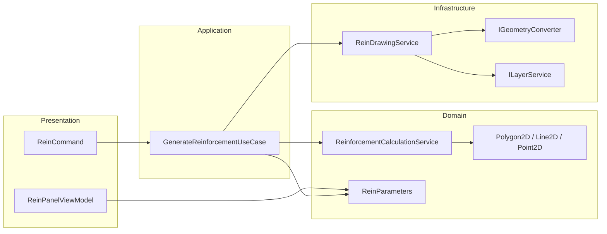

# Reinforcement（钢筋生成）Clean + DDD 重构计划

## 一、现状与目标

**现状**（旧项目 HyCADtool）：

- [ReinforcementFun.cs](HyCADtool/Tools/CreatEntity/Rein/ReinforcementFun.cs)：静态方法，包含配筋分段、锚固延伸、弯钩、点钢、引线标注等算法，强依赖 `Polyline`/`Line`/`MLeader`、`BaseConfig`、`ZTools`、`ReinPanel.ActivePanel`。
- [ReinforcementMain - 复制.cs](HyCADtool/Tools/CreatEntity/Rein/ReinforcementMain - 复制.cs)：静态属性（参数来自 ReinPanel/BaseConfig）、状态（SubReinforcements、Boundary、DotRein 等）、入口 `Rein()`（选多段线 → GenerateReinforcement → DimensionForReinforcement.GenerateDimension）。

**目标**：

- **Domain**：纯算法与值对象，零 AutoCAD 依赖，可迁 Blender。
- **Infrastructure**：几何转换（Polygon2D ↔ Polyline）、图层与实体绘制（线钢筋、点钢筋、MLeader）。
- **Application/Presentation**：用例编排 + 命令；参数来自注入的 ReinParameters（与 ReinPanelViewModel 对齐），不直接依赖 ReinPanel 静态实例。

**范围说明**：本次仅重构「根据边界多段线生成配筋并绘制」；`DimensionForReinforcement.GenerateDimension` 仍属旧项目，Refactored 中可先预留接口或后续单独迁移，不在本计划内实现。

------

## 二、依赖与边界

- **Domain** 不引用 AutoCAD、不引用 UI；只引用现有 `Domain.ValueObjects.Geometry`（Point2D、Line2D、Polygon2D）及 `ReinParameters`。
- **Infrastructure** 实现「从领域结果写回 CAD」：创建图层、多段线、圆、MLeader 等；依赖 `IGeometryConverter`、`ILayerService`，必要时新增 `IDrawingService` 或专用绘制接口。
- **参数来源**：Refactored 已有 [ReinPanelViewModel](HyCADTool.Refactored/Presentation/ViewModels/ReinPanelViewModel.cs) 与 [ReinParameters](HyCADTool.Refactored/Domain/ValueObjects/ReinParameters.cs)。ReinParameters 需补全与旧 Reinforcement 一致的字段（如 `DotStartDistance`、`BendingLineLength` 等），并由 ViewModel 或“当前参数提供者”在命令执行时生成 ReinParameters 传入用例。

------

## 三、分层设计

### 3.1 Domain 层（平台无关）

**新增/扩展**：

1. **值对象**
   - 沿用并必要时扩展 [Point2D](HyCADTool.Refactored/Domain/ValueObjects/Geometry/Point2D.cs)、[Line2D](HyCADTool.Refactored/Domain/ValueObjects/Geometry/Line2D.cs)、[Polygon2D](HyCADTool.Refactored/Domain/ValueObjects/Geometry/Polygon2D.cs)。
   - 若线段操作多，可增加 `LineSegment2D` 或复用 Line2D。
   - [ReinParameters](HyCADTool.Refactored/Domain/ValueObjects/ReinParameters.cs)：补全旧代码用到的所有参数（DotStartDistance、BendingLineLength、DotReinOffsetOut 等），保证与 ReinPanel 字段一一对应。
2. **领域服务（纯算法）**
   - **ReinforcementCalculationService**（或拆成多个小服务）：
     - 输入：边界 `Polygon2D`、内缩/公差等（来自 ReinParameters），以及 ReinParameters。
     - 输出：结构化 DTO（如 `ReinforcementResult`），包含：
       - 线钢筋：多条折线（顶点序列）+ 每端是否弯折；
       - 点钢筋：两套点集（普通点钢、减少数量点钢）；
       - 引线标注：每条标注的附着点与内容。
   - 从 ReinforcementFun 迁移的**纯几何/数值逻辑**（不碰 AutoCAD）：
     - 按轮廓内缩后按段角分段（对应 `GetSubReinforcements`）；
     - 按条件连接两根钢筋（`ConnectReinByCondition`）；
     - 单根钢筋两端锚固延伸与是否弯折（`ExtendEndingReinforcement`、`GetDirectionTwoPointInOneLine`、`GetExtendSeg`）；
     - 弯钩端点计算（`AddAnchorToReinforcement`、`AddAnchorToReinforcementIsReverse` 的几何部分）；
     - 点钢：沿边分段点、减少数量点（`AddDotRein`、`AddReduceDotRein`、`GetLineSeparatPoint`、`GetLineReducePoints`、`GetRangeNumbersUseSEPoint`、`GetRangeNumbersByLengthSeparatin`）；
     - 引线标注位置与内容（`AddMleaders` / `GetMleaderByPoints` 的几何与文本部分）。
   - **AlgebraicArea**（有向面积、弧段面积）：迁入 Domain 的几何工具类或扩展 Polygon2D/弧段值对象，供上述服务使用。
3. **领域接口（可选）**
   - 若希望“生成配筋”与“标注”解耦，可在 Domain 定义 `IReinforcementResult` 或 DTO 契约，Application 层再编排“生成 + 绘制”与后续“标注”（标注实现可后续迁移）。

**不放入 Domain**：Polyline、Line、MLeader、Editor、Database、ReinPanel、ZTools、BaseConfig 等一切 AutoCAD/UI 依赖。

------

### 3.2 Application 层（用例）

- **GenerateReinforcementUseCase**（或同名应用服务）：
  - 输入：边界（以 Polyline 或 Polygon2D 传入）、ReinParameters（来自面板/配置）。
  - 步骤：边界 →（若为 Polyline）经 IGeometryConverter 转 Polygon2D → 调用 Domain ReinforcementCalculationService 得到 ReinforcementResult → 调用 Infrastructure 的“绘制服务”将结果写回当前图形（创建图层、画线、画点钢、画 MLeader）。
  - 不直接依赖 AutoCAD 类型；依赖 Domain 服务接口与 Infrastructure 绘制接口。

可选：**GetCurrentReinParametersUseCase**，从 ReinPanelViewModel 或配置服务读取并组装 ReinParameters，供命令调用。

------

### 3.3 Infrastructure 层

1. **几何转换**
   - 已有 [GeometryConverter](HyCADTool.Refactored/Infrastructure/AutoCAD/Converters/GeometryConverter.cs)：Polyline ↔ Polygon2D、Point2D/Point3D ↔ Point2d/Point3d、Line2D ↔ Line。确认是否需补充：多段线顶点序列 ↔ 多条 Line2D/Polyline 的转换（用于“线钢筋”多条折线）。
2. **绘制能力**
   - 旧代码依赖：`ZTools.CreateMultipleLayers`、`ZTools.SetCurrentLayer`、`ZTools.CreateSolidCircle`、`ZTools.AddMleader`、`ToSpace()`（实体写入模型空间）。Refactored 中 [ILayerService](HyCADTool.Refactored/Infrastructure/AutoCAD/Services/LayerService.cs) 等已有部分能力；需补齐：
     - 按名称创建/切换图层（与旧图层名一致：如 `01_hy_1钢筋_线钢筋`、`01_hy_1钢筋_点钢筋`、`00_hy_3公共_标注3_引线`）；
     - 将“线钢筋”折线、点钢筋圆、MLeader 写入当前数据库（等价 ToSpace）。
   - 可在 **ReinDrawingService** 中实现：输入 ReinforcementResult + 当前 Database，负责创建图层、将领域折线/点/标注数据转为 Entity 并加入 ModelSpace。ReinDrawingService 依赖 IGeometryConverter、ILayerService，以及需要的 IDatabaseService/Transaction 封装。
3. **IReinService 实现**
   - 现有 [IReinService](HyCADTool.Refactored/Domain/Services/IReinService.cs) 含 DrawReinforcement(ReinParameters)、ApplyStyle、DimensionRein。可在 Infrastructure 实现 **ReinService**：
     - **DrawReinforcement**：弹选或由调用方传入一条 Polyline → 调用 GenerateReinforcementUseCase（或直接调 Domain + ReinDrawingService），完成“生成 + 绘制”；不在此步调用 DimensionForReinforcement。
     - ApplyStyle、DimensionRein 可先保留为占位或委托给后续标注迁移。
   - 参数来源：通过构造函数注入“当前 ReinParameters 提供者”（例如从 PanelManager/ReinPanelViewModel 读取），避免静态 ReinPanel。

------

### 3.4 Presentation 层

- **ReinCommand**（对应原 `Rein()`）：
  - 选一条 Polyline；校验 ReinParameters（如 Scale > 0）；调用 IReinService.DrawReinforcement(parameters)；输出极简 1～3 行（如“配筋生成完成”或加耗时）。
- **ReinPanelViewModel** 已注入 IReinService，其“绘制”按钮可改为调用同一 IReinService.DrawReinforcement，参数从 ViewModel 属性组装为 ReinParameters。
- 不在命令中直接引用 HyCADtool 的 Reinforcement 或 DimensionForReinforcement。

------

## 四、实施顺序建议

| 步骤 | 内容                                                         | 产出                        |
| ---- | ------------------------------------------------------------ | --------------------------- |
| 1    | ReinParameters 补全与 ReinPanelViewModel 对齐                | 参数一致、可 from ViewModel |
| 2    | Domain：AlgebraicArea + 分段/连接/锚固/弯钩/点钢/标注位置等纯算法迁入 ReinforcementCalculationService，输入输出为 Polygon2D/Line2D/Point2D 与 DTO | 平台无关算法层              |
| 3    | Domain：定义 ReinforcementResult DTO（线钢筋、点钢筋、引线数据） | 领域输出契约                |
| 4    | Infrastructure：ReinDrawingService（图层 + 线/圆/MLeader 写入），依赖 IGeometryConverter、ILayerService | 绘制到 CAD                  |
| 5    | Application：GenerateReinforcementUseCase 编排 Domain + ReinDrawingService | 用例                        |
| 6    | Infrastructure：实现 IReinService，实现 DrawReinforcement；注册到 Autofac | 服务可用                    |
| 7    | Presentation：ReinCommand 选 Polyline 调 IReinService；ReinPanel 绘制按钮绑定同一服务 | 命令与 UI 闭环              |
| 8    | 测试：C1 切到 ReinCommand，C2 热重启验证；必要时单元测试 ReinforcementCalculationService | 可测、可交付                |

------

## 五、风险与注意点

- **算法保真**：旧代码中有大量索引、角度、方向判断（如 `angles[i] < Math.PI`、弯折方向、正反向交点），迁移时需逐函数对照，用单元测试或 C1 对比结果，避免行为偏差。
- **公差与配置**：BaseConfig.ToleranceDouble、TolerancePoint 在 Domain 中改为 ReinParameters 或 ToleranceSettings 传入，不在 Domain 内写死。
- **ZTools.MakeMark**：ReinforcementFun 中用于“不满足锚固长度”的标记，可保留为 Infrastructure 的可选行为（或通过参数关闭），不放入 Domain。
- **DimensionForReinforcement**：本次不迁移；Rein() 中原有的“生成标注”一步可在 Refactored 中改为：仅执行 DrawReinforcement，标注由用户另发命令或后续 Phase 实现。

------

## 六、关键文件索引

| 层级           | 文件/类型                       | 说明                                                         |
| -------------- | ------------------------------- | ------------------------------------------------------------ |
| Domain         | ReinParameters.cs               | 补全字段，与 ReinPanel 一致                                  |
| Domain         | ReinforcementCalculationService | 纯算法，输入 Polygon2D + ReinParameters，输出 ReinforcementResult |
| Domain         | ReinforcementResult（DTO）      | 线钢筋列表、点钢筋点集、引线列表                             |
| Domain         | AlgebraicArea 或 Polygon2D 扩展 | 有向面积等                                                   |
| Application    | GenerateReinforcementUseCase    | 编排 Domain + 绘制                                           |
| Infrastructure | ReinDrawingService              | 将 ReinforcementResult 画到当前图                            |
| Infrastructure | ReinService                     | 实现 IReinService.DrawReinforcement                          |
| Presentation   | ReinCommand                     | 选线 → 调 IReinService，极简输出                             |
| Config         | AutofacModule.cs                | 注册 ReinService、ReinDrawingService、UseCase 等             |

以上完成即形成「ReinforcementFun + ReinforcementMain 复制」的 Clean + DDD 重构闭环，且 Domain 保持可迁 Blender。