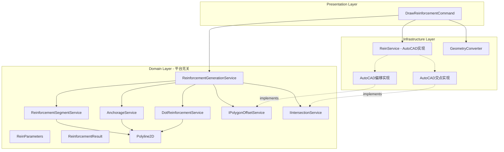

# Reinforcement 模块 Clean Architecture + DDD 重构

## 现状分析

旧代码是一个巨大的 `static partial class Reinforcement`，包含：

- **属性定义**（`ReinforcementMain - 复制.cs`）：20+ 静态属性，直接从 UI 面板 `ReinPanel.ActivePanel` 读取
- **核心配筋流程**（`ReinforcementFun.cs`）：`SetProperties` -> `GenerateReinforcement` 全流程
- **纯算法**：钢筋分段、锚固延伸、弯钩计算、点钢筋布置、标注生成
- **AutoCAD 操作**：图层创建、实体写入、多段线偏移、交点计算

问题：所有逻辑混在一个静态类中，平台强耦合，无法测试，无法迁移到 Blender。

## 重构架构设计

## 文件规划

### Domain 层（平台无关，100% 可迁移 Blender）

**值对象 / 数据结构：**

- `Domain/ValueObjects/ReinParameters.cs` -- 已存在，需补充 `DotStartDistance` 字段
- `Domain/ValueObjects/Geometry/Polyline2D.cs` -- **新建**，开放多段线（非闭合多边形），支持顶点操作
- `Domain/ValueObjects/Reinforcement/ReinforcementResult.cs` -- **新建**，封装配筋生成的全部结果

**领域服务：**

- `Domain/Services/Reinforcement/ReinforcementGenerationService.cs` -- **新建**，配筋生成主编排服务
- `Domain/Services/Reinforcement/ReinforcementSegmentService.cs` -- **新建**，钢筋分段算法（对应 `GetSubReinforcements`、`ConnectReinByCondition`）
- `Domain/Services/Reinforcement/AnchorageService.cs` -- **新建**，锚固延伸 + 弯钩计算（对应 `ExtendSingleReinforcement`、`ExtendEndingReinforcement`、`Addhook`、`AddAnchorToReinforcement` 系列）
- `Domain/Services/Reinforcement/DotReinforcementService.cs` -- **新建**，点钢筋布置（对应 `AddDotRein`、`AddReduceDotRein`、`GetLineSeparatPoint` 系列）
- `Domain/Services/Reinforcement/ReinforcementLabelService.cs` -- **新建**，标注位置计算（对应 `AddMleaders`、`GetMleaderByPoints`）

**领域接口（依赖倒置）：**

- `Domain/Interfaces/IPolygonOffsetService.cs` -- **新建**，多边形/多段线偏移抽象（旧代码 `GetOffsetCurves` 依赖 AutoCAD）
- `Domain/Interfaces/ILineIntersectionService.cs` -- **新建**，线段-多边形交点计算抽象（旧代码 `IntersectWith` 依赖 AutoCAD）

### Infrastructure 层

- `Infrastructure/AutoCAD/Services/ReinService.cs` -- 已存在，实现 `DrawReinforcement` 和 `DimensionRein`（写入 AutoCAD 图纸）
- `Infrastructure/AutoCAD/Services/AutoCadPolygonOffsetService.cs` -- **新建**，实现 `IPolygonOffsetService`，封装 `Polyline.GetOffsetCurves`
- `Infrastructure/AutoCAD/Services/AutoCadIntersectionService.cs` -- **新建**，实现 `ILineIntersectionService`，封装 `Line.IntersectWith`
- `Infrastructure/AutoCAD/Converters/ReinforcementConverter.cs` -- **新建**，`Polyline2D` <-> AutoCAD `Polyline` 互转

### Presentation 层

- `Presentation/Commands/DrawReinforcementCommand.cs` -- **新建**，对应旧命令 `gj`，主入口命令

## 关键重构决策

### 1. 消除全局静态状态

旧代码 `Reinforcement` 类有大量静态属性（`Boundary`、`SubReinforcements`、`DotReinPoints` 等），作为中间结果全局共享。重构后：

- 用 `ReinforcementResult` 值对象封装所有中间和最终结果
- 服务方法通过参数传入、返回值传出，无副作用

### 2. 多段线偏移的平台隔离

旧代码频繁调用 `boundary.GetOffsetCurves(d)` 这是 AutoCAD 特有 API。重构方案：

- Domain 层定义 `IPolygonOffsetService` 接口
- Infrastructure 层用 AutoCAD API 实现
- 未来 Blender 端可用 Clipper2 等纯算法实现

### 3. 交点计算的平台隔离

旧代码 `Line.IntersectWith(boundary, ...)` 依赖 AutoCAD。重构方案：

- Domain 层定义 `ILineIntersectionService` 接口
- Domain 层已有 `Line2D.GetIntersection` 可用于简单情况
- 对 Polyline 整体交点计算，通过接口注入

### 4. 引入 Polyline2D 值对象

旧代码中大量使用 AutoCAD `Polyline`。`Polygon2D` 已有但假设闭合且 >= 3 个顶点。钢筋是开放多段线（可能 2 个顶点），需要新建 `Polyline2D`：

- 支持开放/闭合
- 支持 `AddVertex`、`GetSegmentAt`、`GetAngles` 等操作
- 与 `Polygon2D` 共存，各有侧重

### 5. AlgebraicArea 辅助类

旧代码底部的 `AlgebraicArea` 静态类（判断多段线顺逆时针）功能已由 `Polygon2D.GetSignedArea()` / `IsCounterClockwise()` 覆盖，不再需要单独迁移。

## 算法迁移映射表

| 旧方法                               | 新位置                                              | 说明                  |
| ------------------------------------ | --------------------------------------------------- | --------------------- |
| `SetProperties`                      | `ReinforcementGenerationService.Generate`           | 编排方法              |
| `GenerateReinforcement`              | `ReinService.DrawReinforcement` + Command           | AutoCAD 写入          |
| `GetSubReinforcements`               | `ReinforcementSegmentService.SegmentByBoundary`     | 纯算法                |
| `ConnectReinByCondition`             | `ReinforcementSegmentService.ConnectByCondition`    | 纯算法                |
| `GetSubReinforcementWithAnchors`     | `AnchorageService.ExtendToAnchorage`                | 纯算法                |
| `ExtendSingleReinforcement`          | `AnchorageService.ExtendSingle`                     | 纯算法                |
| `ExtendEndingReinforcement`          | `AnchorageService.ExtendEnding`                     | 纯算法                |
| `Addhook`                            | `AnchorageService.AddHooks`                         | 纯算法                |
| `AddAnchorToReinforcement`           | `AnchorageService.CalculateHookPoint`               | 纯算法                |
| `AddAnchorToReinforcementIsReverse`  | `AnchorageService.CalculateHookPointWithReverse`    | 纯算法                |
| `GetDirectionTwoPointInOneLine`      | `AnchorageService.GetBendDirection`                 | 纯算法                |
| `GetExtendSeg`                       | `AnchorageService.GetExtendSegment`                 | 纯算法                |
| `GetSegmentInPolyLineByPoint`        | `Polyline2D.GetSegmentAtPoint`                      | 值对象方法            |
| `GetIntersectionByLinetWithBoundary` | `ILineIntersectionService`                          | 接口抽象              |
| `AddDotRein`                         | `DotReinforcementService.GenerateDotPositions`      | 纯算法                |
| `AddReduceDotRein`                   | `DotReinforcementService.GenerateReducedPositions`  | 纯算法                |
| `GetLineSeparatPoint`                | `DotReinforcementService.GetSeparationPoints`       | 纯算法                |
| `GetRangeNumbersUseSEPoint`          | `DotReinforcementService` 私有方法                  | 纯算法                |
| `GetRangeNumbersByLengthSeparatin`   | `DotReinforcementService` 私有方法                  | 纯算法                |
| `GetLineReducePoints`                | `DotReinforcementService.GetReducePoints`           | 纯算法                |
| `PointsToDotRein`                    | `ReinService`（Infrastructure）                     | AutoCAD 实体创建      |
| `PolyToLines`                        | `Polyline2D.GetSegments`                            | 值对象方法            |
| `GetDotReinCenterPoly`               | 通过 `IPolygonOffsetService`                        | 偏移操作              |
| `AddMleaders`                        | `ReinforcementLabelService.CalculateLabelPositions` | 位置计算              |
| `GetMleaderByPoints`                 | `ReinforcementLabelService` 私有方法                | 位置计算              |
| `AlgebraicArea`                      | 不迁移                                              | 已被 `Polygon2D` 覆盖 |
| `Rein()` 入口                        | `DrawReinforcementCommand.Execute`                  | Presentation 层       |

## 依赖注入注册

在 `AutofacModule.cs` 中添加：

- `ReinforcementGenerationService` -> AsSelf, SingleInstance
- `ReinforcementSegmentService` -> AsSelf, SingleInstance
- `AnchorageService` -> AsSelf, SingleInstance
- `DotReinforcementService` -> AsSelf, SingleInstance
- `ReinforcementLabelService` -> AsSelf, SingleInstance
- `AutoCadPolygonOffsetService` -> As IPolygonOffsetService, SingleInstance
- `AutoCadIntersectionService` -> As ILineIntersectionService, SingleInstance