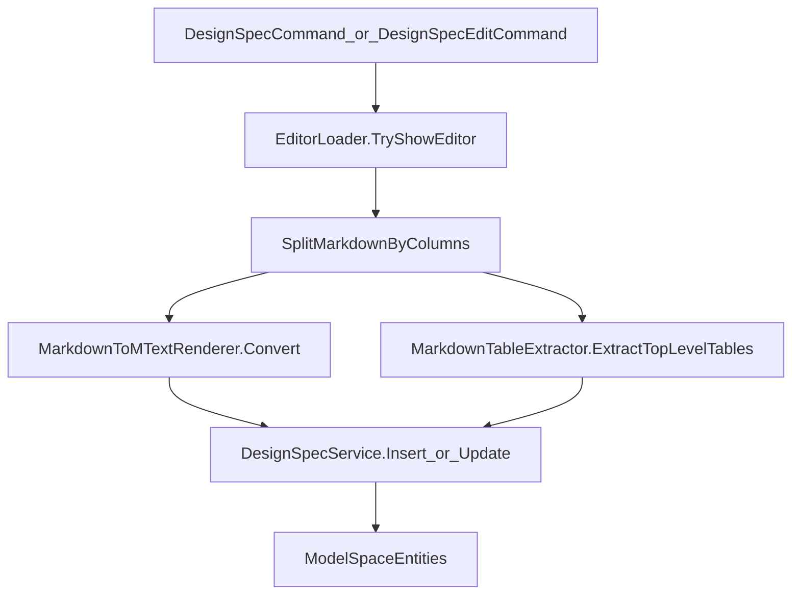

# Markdown 命令与调用链

## 1. 目标

说明 `hymd` 新建导入与 `hymdE` 二次编辑在 Refactored 架构中的执行路径，明确每一层职责与输入输出。

## 2. 命令入口概览

### 2.1 新建导入

- 入口类：`HyCADTool.Refactored/Presentation/Commands/DesignSpecCommand.cs`
- 主流程：
  1. 调用 `EditorLoader.TryShowEditor(...)` 打开编辑器并拿到结果。
  2. 用户在 CAD 中选插入点。
  3. 调用 `DesignSpecService.Insert(...)` 落图。

### 2.2 二次编辑

- 入口类：`HyCADTool.Refactored/Presentation/Commands/DesignSpecEditCommand.cs`
- 主流程：
  1. 选择实体（当前支持 `MText`/`Table`）。
  2. 读取元数据（含同组回溯）拿到 `markdownSource` 与 `config`。
  3. 调用 `EditorLoader.TryShowEditor(...)` 进入编辑。
  4. 调用 `DesignSpecService.Update(...)` 删除旧组并重建。

## 3. `EditorLoader` 桥接职责

核心文件：`HyCADTool.Refactored/Presentation/Commands/EditorLoader.cs`

### 3.1 动态加载与调用

- 反射加载 `HyCADTool.MarkdownEditor.dll`。
- 反射执行 `EditorLauncher.ShowDialog(inputJson, ownerHandle)`。
- 兼容普通部署与 `ReCall C2` 临时目录场景。

### 3.2 结果解析

- 输入：`EditorResult` JSON（包含 Markdown、Config、PreviewStats）。
- 提取：
  - `Markdown`
  - `Config`
  - `ColumnParagraphIndices`（直接字段或 `PreviewStats` 回退）

### 3.3 栏拆分与渲染

1. `SplitMarkdownByColumns(markdown, paraIndices)` 得到 `columnMarkdowns`。
2. 对每栏执行：
   - `MarkdownTableExtractor.RemoveTopLevelTables(columnMarkdown)`
   - `MarkdownToMTextRenderer.Convert(...)`
3. 输出：
   - `columnMarkdowns`（给 Table 实体提取）
   - `columnContents`（给 MText 落图）

## 4. `DesignSpecService` 落图职责

核心文件：`HyCADTool.Refactored/Infrastructure/AutoCAD/Services/DesignSpecService.cs`

### 4.1 Insert（新建）

- 根据 `TextAreaCalculator.Calculate(config)` 计算栏宽。
- 每栏创建：
  - `MText`（来源 `columnContents`）
  - `Table`（来源 `columnMarkdowns` 中抽取的顶层表格）
- 元数据写入：
  - `HyDesignSpec_MD`
  - `HyDesignSpec_CFG`
  - `HyDesignSpec_Group`

### 4.2 Update（重建）

- 读取所选锚点实体组 ID。
- 删除同组旧实体（`MText + Table`）。
- 按当前输入重建并写入新组 ID。

## 5. 调用链时序

## 6. 关键输入/输出约定

- `columnMarkdowns.Length` 与 `columnContents.Length` 对齐。
- `columnContents[i]` 只包含文本渲染结果，不含顶层表格块。
- 组内至少应有一个实体持有 `HyDesignSpec_MD` 与 `HyDesignSpec_CFG`（便于二次编辑）。

## 7. 异常路径

- 编辑器加载失败：命令层提示 WebView2 不可用。
- 用户取消：命令层直接返回，不落图。
- 源码缺失：二次编辑命令提示重新选择或取消。

## 8. 测试入口说明

文件：`HyCADTool.Refactored/Test/TestCommand.cs`

- 默认无待执行命令时，`Run()` 会执行测试入口命令。
- 在专项调试期间可切换：
  - `new DesignSpecCommand().Execute();`
  - `new DesignSpecEditCommand().Execute();`

