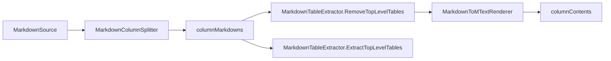

# Markdown 分栏与渲染内核

## 1. 目标

说明 Domain 层如何将 Markdown 文本转换为“可落图的按栏文本结果”，并保证分栏稳定性、格式一致性与可维护性。

## 2. 内核模块清单

- `HyCADTool.Refactored/Domain/Models/Text/MarkdownColumnSplitter.cs`
- `HyCADTool.Refactored/Domain/Models/Text/MarkdownTableExtractor.cs`
- `HyCADTool.Refactored/Domain/Models/Text/MarkdownToMTextRenderer.cs`
- `HyCADTool.Refactored/Domain/Models/Text/DisplayWidthCalculator.cs`

## 3. 分栏算法：`MarkdownColumnSplitter`

### 3.1 输入输出

- 输入：
  - `markdown`（完整 Markdown）
  - `paraIndices`（例如 `0,1,2|3,4`）
- 输出：
  - `string[]`：按栏拆分后的 `columnMarkdowns`

### 3.2 关键策略

- 使用 Markdig 顶层 Block 作为拆分最小单位（不是按空行拆分）。
- 通过 Block Span 回切原文，尽量保持文本与语义一致。
- `LinkReferenceDefinitionGroup` 作为可忽略元块处理，避免误触发整体回退。
- 出现不可恢复异常时回退到“按空行拆分”，保障可用性优先。

### 3.3 设计收益

- 代码块、引用、表格等块级元素不易被错误拆断。
- 与预览端 `ColumnParagraphIndices` 的语义更容易对齐。

## 4. 表格处理：`MarkdownTableExtractor`

### 4.1 双职责

- `ExtractTopLevelTables(markdown)`：提取顶层表格为结构化数据。
- `RemoveTopLevelTables(markdown)`：生成“去表格文本”供 MText 渲染。

### 4.2 表格数据模型

- `MarkdownTableData.Rows: List<List<string>>`
- `MarkdownTableData.ColumnCount`

### 4.3 设计要点

- 只处理“可定位的顶层表格块”，避免误抽取嵌套复杂结构。
- 表格抽取失败不抛出到上层（不中断整体导入）。

## 5. MText 渲染：`MarkdownToMTextRenderer`

### 5.1 渲染范围

- 标题、段落、列表、引用、分隔线、代码块、表格（表格文本模拟仍保留用于非实体化路径）。
- Inline：普通文字、粗体、斜体、行内代码等。

### 5.2 关键格式策略

- 全局基准字高/字宽：`\H` + `\W`。
- 引用缩进 `\pxi l` 使用英寸单位（已按 mm/25.4 处理）。
- 列表支持递归层级缩进。
- 代码块使用等宽字体（`Consolas`）增强可读性。

### 5.3 特殊字符

- `{` `}` `\` 在 MText 内容中转义，防止格式串破坏。

## 6. 字宽口径：`DisplayWidthCalculator`

- ASCII 记 1 单位，CJK/全角记 2 单位。
- 用于表格字符宽估算和相关统计一致性。

## 7. 数据流（内核视角）

## 8. 边界与限制

- `paraIndices` 若来自预览空组，会产生空栏（属于上游分配结果）。
- Markdown 复杂语法（图片/公式/高级样式）在 MText 中无法完全等价。
- 表格语义已可实体化，但精细排版（跨页/复杂合并）仍有提升空间。

## 9. 扩展建议

- 提供统一 `MarkdownParseContext`，减少多处重复 Parse。
- 为 `MarkdownTableExtractor` 增加更多 inline 类型解析（链接标题、复杂强调）。
- 补充内核单元测试：异常 Span、混合文档、空栏边界。

