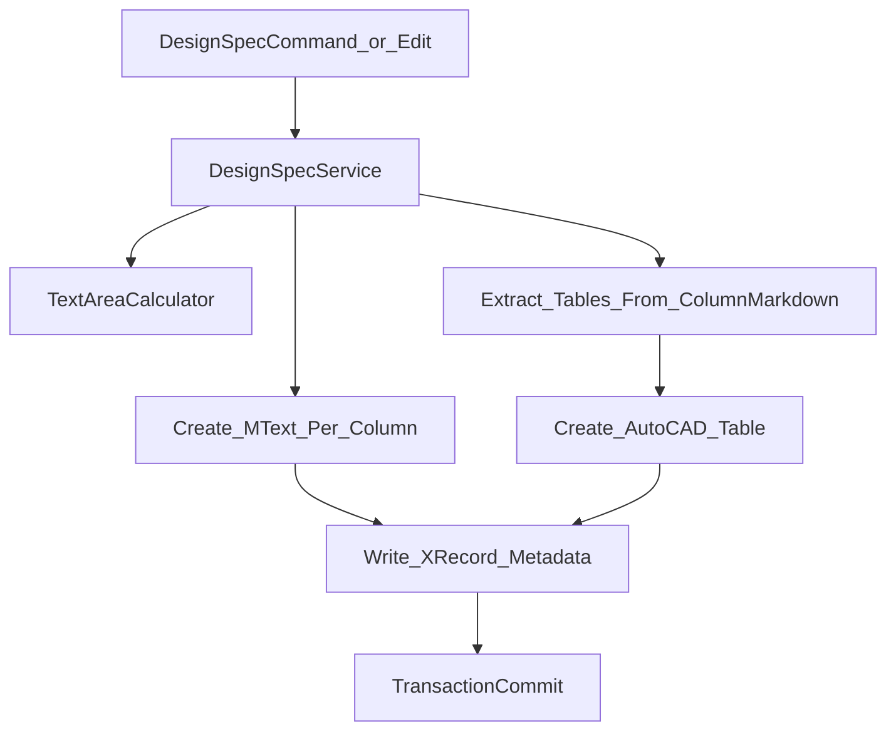

# Markdown 在 AutoCAD 中的落图机制

## 1. 目标

说明 Markdown 结果如何在 AutoCAD 模型空间落为实体，重点解释 `MText + Table` 混合模式、元数据持久化与更新重建策略。

## 2. 核心服务

- 文件：`HyCADTool.Refactored/Infrastructure/AutoCAD/Services/DesignSpecService.cs`
- 核心方法：
  - `Insert(...)`
  - `Update(...)`
  - `InsertTablesForColumn(...)`
  - `WriteMetadataIfNeeded(...)`

## 3. Insert（新建导入）机制

### 3.1 输入

- `columnContents`：按栏 MText 内容
- `columnMarkdowns`：按栏 Markdown（用于表格提取）
- `markdownSource`：完整源文
- `config`：排版配置
- `insertionPoint`：插入锚点

### 3.2 过程

1. 基于 `TextAreaCalculator.Calculate(config)` 获取栏宽和总高。
2. 每栏创建 `MText`（如果有文本内容）。
3. 每栏解析 Markdown 顶层表格并创建 `Table` 实体。
4. 统一写入组标识 `HyDesignSpec_Group`。
5. 仅首次写入源码/配置元数据（`HyDesignSpec_MD` / `HyDesignSpec_CFG`）。

### 3.3 输出

- 模型空间实体集合：`MText` + `Table`。

## 4. Update（二次编辑）机制

### 4.1 锚点与读取

- 输入锚点改为通用 `Entity`（支持 `MText` / `Table`）。
- 从锚点读组 ID，锁定同组实体集合。

### 4.2 重建策略

1. 删除同组旧实体（不再只删 MText）。
2. 以锚点位置作为插入基准重建。
3. 重新写入组 ID 和元数据。

### 4.3 位置规则

`GetAnchorPoint(entity)` 优先顺序：

1. `MText.Location`
2. `Table.Position`
3. `BlockReference.Position`
4. 几何外包框推导
5. `Point3d.Origin`（最终兜底）

## 5. Table 实体生成规则

由 `InsertTablesForColumn(...)` 执行：

- 数据源：`MarkdownTableExtractor.ExtractTopLevelTables(columnMarkdown)`
- 实体参数：
  - `TableStyle = db.Tablestyle`
  - 行高：`max(TextHeight * LineSpacingFactor * 1.3, TextHeight)`
  - 列宽：`max(TextHeight * 3.0, columnWidth / colCount)`
- 位置：按列左上角向下堆叠，避免覆盖正文主区。

## 6. 元数据设计

- `HyDesignSpec_MD`：完整 Markdown 源文
- `HyDesignSpec_CFG`：序列化配置 JSON
- `HyDesignSpec_Group`：组标识

用途：

- 二次编辑可追溯源文。
- 更新时可按组批量删除与重建。

## 7. 流程图（落图视角）

## 8. 边界与风险

- 表格默认堆叠在主文本区下方，复杂版式可能需要人工调整。
- 同组删除依赖组 ID 完整性；历史无组实体不参与重建清理。
- 表格宽度策略当前偏保守，超宽列可能需二次优化。

## 9. 排障建议

- 若二次编辑提示无源码，优先检查实体是否含 `HyDesignSpec_MD` 或同组回溯是否可达。
- 若表格未见，先确认该栏 `columnMarkdown` 是否含顶层表格块。
- 若更新后残留，检查同组实体 `HyDesignSpec_Group` 是否一致。

