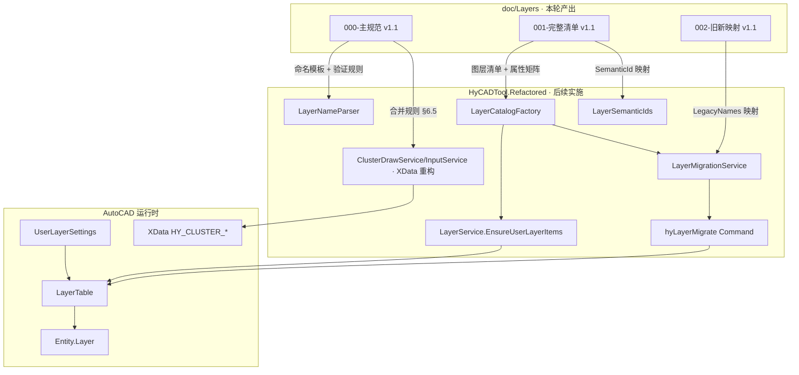
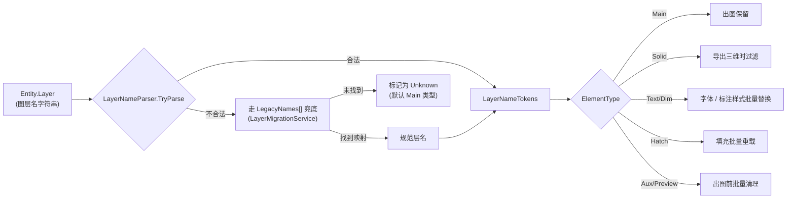

# HyCAD 图层规范 v1.1

> 版本：v1.1 · 2026-04-24 · 适用：`HyCADTool.Refactored` / `HyCAD.BlenderUI` / 所有 AutoCAD 产出图纸
> 权威：本文档是 HyCAD 图层体系的**单一真相源**，所有代码中的 `private const *Layer` 都应以此为准回落到 `LayerCatalogFactory` 的统一入口。

## v1.1 与 v1.0 的差异

1. **全部中文命名**：去除所有英文字母、缩写（`MBR` / `3D` / `H/V` / `X/Y` / `BP` / `DCEL` / `Voronoi` / `Raft` 等），一律用中文；后期如需英文版本再单独出
2. **系统性合并**（层数从 106 → 91）：
   - 结构-钢筋 + 结构-筏板 → 合并为「1配筋」一个子组（用户视角都是"配筋"）
   - 结构-聚类 15 条 → 合并为 5 条（聚类中间产物用 XData 区分）
   - 结构子组数 9 → 8（空出 `9` 位留作扩展）
   - 道路-横断「注释+方位」合并、「图题+装饰」合并（11 条 → 9 条）
3. **后缀扩展**：增加 `-标`（标注/尺寸），将 `-3D` 改名为 `-体`

---

## 0. 为什么要这份规范

### 0.1 当前痛点（调研结论）

| 症状 | 根因 | 举例 |
|---|---|---|
| 同一个"视口"在 4 个文件各写一遍 | 没有单一真相源 | `PublicViewport` / `MBRCommand` / `PackViewportsCommand` / `CreateLayoutViewportsCommand` 都含字符串 `"00_hy_2公共_视口"` |
| 不同模块命名风格分裂 | 历史代码各成一派 | `00_hy_` / `00_HY_` / `00_Hy_` / `HY_` / `0-road-` / `00-HY-` / 纯中文层 6 种并存 |
| 图层名无法反推结构化数据 | 分隔符不统一、段数不定 | `00_hy_3公共_标注1_外` 5 段 vs `00_hy_图框` 3 段，解析器无从下手 |
| 业务分类与图层号不匹配 | 历史占位顺序非使用频率 | 道路最常用却占 `05_*`，钢筋/桩专业合并成"结构"但分在 `01/02` 两段 |
| 图层太多不好管理 | 同一业务分散到多个子组 | 钢筋在 `01`、筏板配筋在 `00_hy_`、锚栓在 `00_Hy_`，用户看不懂归属 |
| AutoCAD 下划线/Markdown 渲染异常 | `_` 在两处都有语义冲突 | `_` 会被 Markdown 视为斜体起始，AutoCAD 命令行部分版本会截断 |
| 英文缩写图层名用户读不懂 | 代码直接用程序员的英文命名 | `00_hy_BP` / `dcelOuter` / `HY_V向钢筋` / `00-HY-Voronoi` 对画图用户是"黑话" |

### 0.2 本规范的 5 个设计目标

1. **可反查**：从图层名直接解析出 `(大类, 子组, 图元类型, 具体)` 四元组，不依赖外部字典
2. **高频优先**：大类编号按使用频率排序，用户最常用的专业放在最前（`00` / `01` / `02`）
3. **语义锚定**：每层有稳定的 `SemanticId`（英文驼峰），用户可自由改名，但代码定位用 ID 不用显示名
4. **分隔统一**：全域只用 `-`，彻底告别 `_` 与 Markdown/AutoCAD 的兼容问题
5. **全中文 + 精简**：图层名对工程师直观可读；业务相关层合并到同一子组，减少心智负担；向前扩展保留 03-09 大类 + 每大类 9 个子组

---

## 1. 命名模板

### 1.1 基本格式

```
<大类号>-hy-<子组号+子组名>-<具体层名>[-类型后缀]
  2 位     2 字    1 位 + 中文      中文      可选中文
```

示例：

- `00-hy-2视口-主`
- `01-hy-1配筋-钢筋线`
- `01-hy-6墙-挡土-体`
- `02-hy-9预览-原线-预`
- `02-hy-3横断-车道`

### 1.2 分段约束

| 段位 | 名称 | 字符数 | 约束 | 示例 |
|---|---|---|---|---|
| 1 | 大类号 `ClassId` | 固定 2 位数字 | `00~99`，目前已占 `00~06` | `00` / `01` / `02` |
| 2 | 厂商码 `VendorCode` | 固定 2 字符 | 必为小写 `hy` | `hy` |
| 3 | 子组号 + 子组名 | 1 位数字 + 中文 | 子组号 `1~9`，超 9 个升级为 2 位；中文子组名 2~4 字 | `1配筋` / `3横断` / `9预览` |
| 4 | 具体层名 | 1~8 字 | **仅中文**，不含分隔符 `-` | `主` / `钢筋线` / `挡土` / `筏板横上` |
| 5 | 类型后缀 | 1 字 | 可选，固定枚举（见 §3） | `-体` / `-文` / `-标` / `-预` |

**全图层名总长约束**：**≤ 32 字符**（命令行截断友好，AutoCAD 图层名规格上限为 255 但长名不便工作）。

### 1.3 中文化规则（v1.1 新增）

- 全段（具体名 + 子组名）**只允许中文 + 数字**，**不允许英文字母**
- 历史英文缩写中文化对照：
  | 原英文/缩写 | 中文 | 适用场景 |
  |---|---|---|
  | `3D` | `体` | 三维实体（后缀 `-体`） |
  | `H 向` / `V 向` | `横` / `纵` | 钢筋 / 标注方向 |
  | `X` / `Y`（坐标） | `横` / `纵` | X 轴 → 横向；Y 轴 → 纵向 |
  | `MBR`（Minimum Bounding Rectangle） | `主` | 视口最小外框 |
  | `BP` / `AAP` / `BAP` / `ABolt` / `SteelPlate` | 合并为"聚类-主" | 聚类算法中间产物 |
  | `DCEL`（Doubly Connected Edge List） | `外环` / `内环` | 拓扑结构外/内边界 |
  | `Voronoi` | `维诺` | 维诺图（音译）；等价于"泰森多边形" |
  | `Raft` | `筏板` | 筏板基础 |

### 1.4 分隔符与大小写

- 分隔符：**全域只用 `-`**；禁用 `_`、`.`、空格、`\`、`/`
- `hy`：**只能小写**，不能 `HY` / `Hy` 混用
- 数字段：**半角阿拉伯数字**，不能使用中文数字一二三
- 中文：优先使用标准简体；避免古字、异体字；**禁止使用繁体**

### 1.5 保留字符与非法字符

沿用 AutoCAD 规则 + 本规范额外约束：

```
禁止字符：< > / \ " : ; ? * | , ' = ` _  以及 全部英文字母（ASCII A-Z a-z）
分隔符（仅允许作分段用）：-
```

非法字符清理逻辑沿用现有 [UserLayerSettingsMerger.SanitizeName](../../HyCADTool.Refactored/Domain/Services/UserLayerSettingsMerger.cs)，新增 `_` → `-` 的转写；保留 `hy` 字符串豁免（规范厂商码）。

---

## 2. 大类表（按使用频率降序）

大类号固定 2 位数字，为全局"一级专业"。目前占用如下：

| 大类号 | 大类名 | 专业 | 频率评级 | 现状 | 下一步 |
|---|---|---|---|---|---|
| `00` | 公共 | 跨专业共享的图框/视口/标注/文字/表格/轴线/标高/图像/标记 | A+ 最高 | 已占用 | 子组重排 |
| `01` | 结构 | 配筋（钢筋+筏板）/ 桩 / 锚栓 / 设备基础 / 垫层 / 墙 / 柱板 / 聚类 | A 高 | 原 `01=钢筋`、`02=桩`，合并为 `01=结构` | 大类合并 + 子组重排 |
| `02` | 道路 | 平面 / 纵断 / 横断 / 标线 / 桩号 / 几何 / 交叉口 / 预览 | A 高 | 原 `05=道路`，按频率提到 `02` | 降级迁移 |
| `03` | 建筑 | 平面布置 / 墙门窗 / 楼板 / 屋顶 / 室内装修 | B 预留 | 暂空 | 业务上量后细化 |
| `04` | 排水 | 给水 / 排水 / 雨水 / 污水管网 / 检查井 | B 预留 | 暂空 | 业务上量后细化 |
| `05` | 电气 | 强电 / 弱电 / 配电箱 / 桥架 / 接地 | B 预留 | 腾空（原 05 道路已迁出） | 业务上量后细化 |
| `06` | 绿化 | 乔木 / 灌木 / 草坪 / 花坛 / 地被 | B 预留 | 暂空 | 业务上量后细化 |
| `07` | 暖通 | 空调 / 通风 / 采暖 / 消防 | C 保留 | 暂空 | — |
| `08` | 工艺 | 工艺管道 / 设备布置 / 支吊架 | C 保留 | 暂空 | — |
| `09` | 总图 | 场地 / 竖向 / 红线 / 坐标网 | C 保留 | 暂空 | — |
| `10~99` | — | 扩展预留 | — | — | — |

**大类号分配原则**：

- **按使用频率排序**：用户现在最常用的"公共、结构、道路"占 `00~02`，次要专业占 `03~06`
- **频率不是绝对顺序**：一旦大类号分配，**禁止**后续调换（否则 `LayerMigrationService` 的映射表会无限爆炸）。新专业始终追加到末位
- **`00` 保留给"公共"**：因为公共层跨所有专业，视觉上"全体起立"时放在最前

---

## 3. 子组表（按大类展开）

### 3.1 `00` 公共（9 个子组；层数 21 + 1 模板）

| 子组号 | 子组名 | 含义 | 典型具体层 |
|---|---|---|---|
| 1 | 图框 | 图幅边框 / 标题栏 / 图签 | 主 · 说明-文 |
| 2 | 视口 | 模型空间出图框 / 布局视口边界 | 主 |
| 3 | 标注 | 尺寸 / 标注引出线 | 外 · 内横 · 内纵 · 引线 |
| 5 | 表格 | 通用明细表 / 材料表 / 图签表 | 主 |
| 6 | 轴线 | 定位轴线 / 轴号圆 / 轴号文字 | 主 · 主-文 |
| 7 | 标高 | 标高符号 / 标高文字 / 分区 | 符号 · 无文 · 警告 · {分组} |
| 8 | 图像 | 底图光栅 / 定位图像 / 参考图像 | 定位 |
| 9 | 标记 | 调试标记 / 检查标记 / 临时辅助（不可打印） | 打断点 · 重复线 · 外轮廓 · 内孔洞 · 标高检查 · 独立端点 · 未连接线 |

> 子组号 `4` 暂未使用（原"4 文字"合并入图框子组的 `-文` 后缀）。

### 3.2 `01` 结构（8 个子组；层数 42 + 1 模板）

| 子组号 | 子组名 | 含义 | 典型具体层 |
|---|---|---|---|
| 1 | 配筋 | 钢筋 + 筏板附加配筋**合并** | 钢筋线 · 钢筋点 · 钢筋外 · 钢筋-文 · 手动 · 筏板轮廓 · 筏板轮廓-辅 · 筏板横上 · 筏板横下 · 筏板纵上 · 筏板纵下 · 筏板横-标 · 筏板纵-标 · 筏板-体 · 筏板厚度-文 |
| 2 | 桩 | 桩主 / 地基轮廓 / 阵列 / 维诺辅助 | 主 · 地基轮廓 · 阵列 · 维诺-辅 |
| 3 | 锚栓 | 螺栓 / 预埋板 / 动态型号 | 主 · 轮廓 · 编号 · 预埋 · {型号} |
| 4 | 设备基础 | 设备基础 3D 侧 / 顶 / 底 | 侧-体 · 顶-体 · 底-体 |
| 5 | 垫层 | 垫层轮廓 | 主 |
| 6 | 墙 | 砼墙 / 墙体三维 / 挡土 / 连接 | 砼墙 · 主-体 · 挡土-体 · 连接-体 |
| 7 | 柱板 | 柱 / 板 / 板配筋标注 / DCEL 外/内环 | 柱 · 板 · 板配筋-标 · 外环-辅 · 内环-辅 |
| 8 | 聚类 | 聚类算法中间产物（15 条原层**合并**为 5 条） | 主 · 轴 · 区域 · 标 · 辅 |

> 子组号 `9` 暂未使用，预留扩展。

### 3.3 `02` 道路（8 个子组；层数 28）

| 子组号 | 子组名 | 含义 | 典型具体层 |
|---|---|---|---|
| 1 | 平面 | 平面线位 / 走廊 / 红线 / 板块分界 / 平面标线 | 线位 · 走廊 · 红线 · 板块 · 标线 |
| 2 | 纵断 | 纵断面主线 | 主 |
| 3 | 横断 | 横断面轮廓 / 车道 / 人道 / 路牙 / 绿化 / 尺寸标 / 注释文 / 图题 | 轮廓 · 中心 · 车道 · 人道 · 路牙 · 绿化 · 尺寸-标 · 注释-文 · 图题 |
| 5 | 标线 | 道路标线 / 人行横道 / 停止线 / 辅助 | 主 · 人道 · 停止 · 辅助-辅 |
| 6 | 桩号 | 桩号文字 / 桩号刻度 | 主 |
| 7 | 几何 | 几何点 / 偏移线 / 缘石坡道 / 盲道 | 点 · 偏移 · 缘石 · 盲道 |
| 8 | 交叉口 | 交叉口轮廓 / 细部 | 主 |
| 9 | 预览 | 原线（锁定）/ 实时预览 / 用户拾取（工作态） | 原线-预 · 实时-预 · 拾取-预 |

> 子组号 `4` 暂未使用（原"4 走廊"合并入 `1平面-走廊`）。

### 3.4 `03~06` 预留大类（骨架）

未进入 MVP，仅占位。真正业务进入时按本规范补全子组表。

| 大类 | 预留子组骨架 |
|---|---|
| `03` 建筑 | `1平面` · `2立面` · `3剖面` · `4详图` · `5墙门窗` · `6楼板` · `7屋顶` · `8装修` · `9设备` |
| `04` 排水 | `1给水` · `2排水` · `3雨水` · `4污水` · `5检查井` · `6管件` · `7附属` · `8支架` · `9标注` |
| `05` 电气 | `1强电` · `2弱电` · `3配电` · `4桥架` · `5接地` · `6照明` · `7消防` · `8弱电井` · `9标注` |
| `06` 绿化 | `1乔木` · `2灌木` · `3草坪` · `4地被` · `5花坛` · `6硬景` · `7水体` · `8景观构` · `9标注` |

---

## 4. 类型后缀（可选末段，6 种）

v1.1 扩展为 6 种后缀。无后缀默认为"主几何"。

| 后缀 | 含义 | 示例 | 反查用途 |
|---|---|---|---|
| （无） | 主几何（默认） | `01-hy-1配筋-钢筋线` | 默认 `ElementType = Main` |
| `-文` | 文字 / 标签 | `00-hy-6轴线-主-文` | 批量改字体 / 字高 |
| `-标` | 标注 / 尺寸（Dimension 对象） | `01-hy-1配筋-筏板横-标` | 标注样式统一重载 |
| `-填` | 填充 / Hatch | `01-hy-6墙-砼墙-填` | 填充图案批量重载 |
| `-辅` | 辅助 / 参考线 / 构造线 | `01-hy-8聚类-辅` | 出图时批量关闭 |
| `-预` | 工作态 / 预览 / 拾取原线 | `02-hy-9预览-原线-预` | 出图前批量清理 |
| `-体` | 三维实体 / 体量（替代原 `-3D`） | `01-hy-4设备基础-侧-体` | 输出 3D 模型时批量过滤 |

**为什么是可选后缀而非必填第 5 段**：

- 多数层本身不需要类型修饰（`01-hy-1配筋-钢筋线` 已足够自描述）
- 强制 5 段会让具体层名段变短，无法携带业务语义（如 `筏板横上`）
- 需要类型维度的场景（体 / 文字 / 预览）天然是少数派，用后缀就够

**6 种后缀间的互斥约束**：每层最多挂 1 个后缀；需要多维度时（如"既是文字又是预览"）优先 `-预`，其他维度靠归属子组或具体名表达。

---

## 5. 结构化字段解析

### 5.1 解析模型

```
<ClassId>-hy-<SubGroupId><SubGroupName>-<Specific>[-<ElementType>]
     │       │          │              │          │
     │       │          │              │          └─ 类型后缀（Main / Solid / Text / Dim / Hatch / Aux / Preview）
     │       │          │              └──────────── 具体层名（中文）
     │       │          └─────────────────────────── 子组名（中文）
     │       └────────────────────────────────────── 子组编号（1-9）
     └────────────────────────────────────────────── 大类编号（00-99）
```

### 5.2 字段定义

```csharp
public sealed class LayerNameTokens
{
    public int ClassId { get; init; }           // 00~99
    public string ClassName { get; init; }      // 公共 / 结构 / 道路 ...（查大类表）
    public string VendorCode { get; init; }     // 固定 "hy"
    public int SubGroupId { get; init; }        // 1~9
    public string SubGroupName { get; init; }   // 图框 / 配筋 / 横断 ...
    public string Specific { get; init; }       // 主 / 钢筋线 / 挡土 / 线位 ...
    public LayerElementType ElementType { get; init; }
}

public enum LayerElementType
{
    Main,      // 默认（无后缀）
    Solid,     // -体
    Text,      // -文
    Dim,       // -标
    Hatch,     // -填
    Aux,       // -辅
    Preview,   // -预
}
```

### 5.3 解析 API

```csharp
public static class LayerNameParser
{
    public static LayerNameTokens Parse(string layerName);
    public static bool TryParse(string layerName, out LayerNameTokens tokens);
    public static string Format(LayerNameTokens tokens);
    public static bool IsValid(string layerName);
}
```

### 5.4 使用示例

```csharp
var tokens = LayerNameParser.Parse("02-hy-9预览-原线-预");
// tokens.ClassId = 2, ClassName = "道路"
// tokens.SubGroupId = 9, SubGroupName = "预览"
// tokens.Specific = "原线", ElementType = LayerElementType.Preview

// 出图前批量清理所有 Preview 层
foreach (var layer in allLayers)
{
    if (LayerNameParser.TryParse(layer.Name, out var t) && t.ElementType == LayerElementType.Preview)
        EraseAllEntitiesOnLayer(layer);
}
```

---

## 6. 图层默认属性矩阵

每条图层在 [LayerCatalogFactory.CreateDefaultItems](../../HyCADTool.Refactored/Infrastructure/AutoCAD/Configuration/LayerCatalogFactory.cs) 中必须定义以下字段：

| 字段 | 类型 | 必填 | 说明 |
|---|---|---|---|
| `SemanticId` | `string` | 是 | 稳定语义 ID（[LayerSemanticIds](../../HyCADTool.Refactored/Domain/ValueObjects/Configuration/User/LayerSemanticIds.cs)），英文驼峰点分 |
| `Name` | `string` | 是 | 新规范默认名（遵循本规范 v1.1） |
| `AciColor` | `short` | 是 | AutoCAD ACI 颜色索引（1-255） |
| `Linetype` | `string` | 是 | 线型名，默认 `Continuous` |
| `LineWeightMm` | `int` | 是 | 线宽（100 倍 mm 整数；-1 = ByLayer） |
| `IsPlottable` | `bool` | 是 | 是否可打印（预览/标记层通常为 `false`） |
| `IsLocked` | `bool` | 是 | 默认锁定（原线/底图通常为 `true`） |
| `LegacyNames` | `string[]` | 否 | 历史遗留层名数组，**驱动迁移脚本** |
| `Description` | `string` | 否 | 中文描述，用于"设置—图层"UI 悬浮提示 |

### 6.1 颜色策略

- 沿用 AutoCAD ACI 索引（0-256），**禁止** `RGB True Color`
- 同子组内尽量保持色系一致（如结构-配筋主色 1 红，标注色 3 黄）
- 预览/辅助层统一 `252`（极浅灰）或 `253/254/255`
- 不可打印的标记层统一 `200`（紫色）以便肉眼识别

### 6.2 线宽策略

- 默认 `-1` (ByLayer，跟随对象)
- 出图关键层（图框主框、标题栏外框、剖面轮廓）可设 `0.35/0.50 mm`
- 辅助层固定 `0.00 mm` 或 `-1`

### 6.3 锁定层规则（关键）

以下类型**必须** `IsLocked = true`：

- 预览类：`02-hy-9预览-原线-预`
- 底图类：`00-hy-8图像-定位`
- 参考类：外部参照（xref）落地图层（由 xref 服务创建）

**锁定层的写入规则**：

```csharp
using (doc.LockDocument())
using (var tr = db.TransactionManager.StartTransaction())
{
    using (LayerLockScope.Unlock(tr, db, HyRoadLayers.RawPolylineLayer))
    {
        var btr = (BlockTableRecord)tr.GetObject(db.CurrentSpaceId, OpenMode.ForWrite);
        btr.AppendEntity(poly);
        tr.AddNewlyCreatedDBObject(poly, true);
    }
    tr.Commit();
}
```

禁止直接 `layer.IsLocked = false; ... layer.IsLocked = true` 不走 `LayerLockScope`。

### 6.4 不可打印层规则

以下类型**必须** `IsPlottable = false`：

- 所有 `9标记` 子组下的层（公共大类 `9` 子组统一约定为"调试/临时标记"）
- 类型后缀为 `-预` 的层
- 类型后缀为 `-辅` 的层（视需求，产出图纸时通常不打印）

### 6.5 合并层的 XData 区分（v1.1 新增）

由于 v1.1 把原来的多条细分层合并到少数几条（如聚类 15 → 5），同一层上的实体可能属于不同"逻辑种类"。用 XData 区分：

```csharp
// 在 01-hy-8聚类-主 层上写实体时，用 XData 标记原来的分类
entity.WriteXDataKind("HY_CLUSTER", "BP");       // 原 BP 层
entity.WriteXDataKind("HY_CLUSTER", "AAP");      // 原 AAP 层
entity.WriteXDataKind("HY_CLUSTER", "ABolt");    // 原 ABolt 层
// 读取时按 XData.Kind 筛选，而非按图层名
var bolts = modelSpace.QueryByXData("HY_CLUSTER", "ABolt");
```

XData 注册簇命名与现有 [HyRoadXdata.RegAppName](../../HyCADTool.Refactored/Infrastructure/AutoCAD/Xdata/HyRoadXdata.cs) 保持对称风格：

| 合并场景 | XData 注册簇 | KIND 字段取值 |
|---|---|---|
| 钢筋-文 合并 H 向 + V 向 | `HY_REBAR_TEXT` | `Horizontal` / `Vertical` |
| 聚类-主 合并 5 条 | `HY_CLUSTER_MAIN` | `BP` / `AAP` / `BAP` / `ABolt` / `SteelPlate` |
| 聚类-轴 合并 2 条 | `HY_CLUSTER_AXIS` | `Circle` / `Text` |
| 聚类-区域 合并 2 条 | `HY_CLUSTER_REGION` | `Frame` / `Text` |
| 聚类-标 合并 2 条 | `HY_CLUSTER_DIM` | `X` / `Y` |
| 聚类-辅 合并 4 条 | `HY_CLUSTER_AUX` | `EP` / `EEP` / `Hull` / `Pts` |
| 设备基础-侧/顶/底-体 保留 3 条 | — | 不合并（保留颜色区分） |
| 道路-横断-注释-文 合并 2 条 | `HY_ROAD_CS_ANNO` | `Annotation` / `Orientation` |
| 道路-横断-图题 合并 2 条 | `HY_ROAD_CS_TITLE` | `Main` / `Decoration` |

---

## 7. 已知坑修补清单（代码实施阶段须同步完成）

### 7.1 `EnsureUserLayerItems` 漏写 `IsLocked`

**位置**：[LayerService.EnsureUserLayerItems](../../HyCADTool.Refactored/Infrastructure/AutoCAD/Services/LayerService.cs) ≈ 424-487 行

**现状**：用户层表含 `IsLocked`（[LayerDefinitionItem](../../HyCADTool.Refactored/Domain/ValueObjects/Configuration/User/LayerDefinitionItem.cs) 56-59 行），但 `EnsureUserLayerItems` 不把该值写入 `LayerTableRecord.IsLocked`，导致"设置—图层"里勾选锁定后 DWG 图层仍未锁。

**修复**：在 `EnsureUserLayerItems` 的 `new LayerTableRecord` 与 "已存在则更新" 两条分支都加：

```csharp
layerRec.IsLocked = item.IsLocked;
```

注意：`IsLocked` 属性在 `LayerTableRecord` 上需要 `UpgradeOpen` 到 `ForWrite` 才能改。

### 7.2 `MapRoadNameToSemanticId` 字面耦合

**位置**：[LayerCatalogFactory.MapRoadNameToSemanticId](../../HyCADTool.Refactored/Infrastructure/AutoCAD/Configuration/LayerCatalogFactory.cs) ≈ 94-129 行

**现状**：29 条 `switch case` 按字面匹配历史默认名。一旦按本规范把道路默认名从 `05_hy_道路_平面线位` 改为 `02-hy-1平面-线位`，每条 `case` 都要同步改。

**修复**：改为 `foreach` 遍历 `LayerDefinitionItem`，按 `LegacyNames[]` 反查语义 ID：

```csharp
public static string MapLegacyNameToSemanticId(string layerName)
{
    if (string.IsNullOrWhiteSpace(layerName)) return null;
    var trimmed = layerName.Trim();
    foreach (var item in CreateDefaultItems())
    {
        if (string.Equals(item.Name, trimmed, StringComparison.Ordinal)) return item.SemanticId;
        if (item.LegacyNames == null) continue;
        foreach (var legacy in item.LegacyNames)
            if (string.Equals(legacy, trimmed, StringComparison.Ordinal)) return item.SemanticId;
    }
    return null;
}
```

### 7.3 `AlignmentSegmentRenderer` 层不存在时不设 Layer

**位置**：[AlignmentSegmentRenderer](../../HyCADTool.Refactored/Infrastructure/AutoCAD/Rendering/AlignmentSegmentRenderer.cs) ≈ 89、110 行

**现状**：条件检查 `if (LayerExists(tr, db, targetLayer))` 不成立时**跳过**设置 `Layer`，实体静默落到当前层（往往是 `0` 层）。

**修复**：迁移后所有必需层由 `LayerCatalogFactory` 启动保证存在，Renderer 侧**移除存在性检查分支**，改为直接赋值。

### 7.4 遗留裸中文层无段号

**位置**：[BaseReinforcementService.OptimizeBasemap](../../HyCADTool.Refactored/Infrastructure/AutoCAD/Services/BaseReinforcementService.cs) ≈ 72、241、273 行

**涉及层**：`砼墙` · `柱` · `板元` · `筏板板元配筋标注` · `筏板` 5 个裸中文层

**处理**：全部纳入对应新层的 `LegacyNames[]`，代码侧在 `OptimizeBasemap` 读取时改走 `LayerCatalogService.Resolve(SemanticId)` 接口，不再用字面字符串比较。

### 7.5 旧横道命令命名异类

**位置**：[DrawCrosswalkCommand](../../HyCADTool.Refactored/Presentation/Commands/DrawCrosswalkCommand.cs) ≈ 16-22 行

**涉及层**：`0-road-辅助线` · `0-road-标线-人行横道-实线` · `0-road-标线-停止线`

**处理**：全部纳入 `02-hy-5标线-*` 的 `LegacyNames[]`。

### 7.6 桩优化命令连字符命名异类

**位置**：[PileVoronoiOptimizationCommand](../../HyCADTool.Refactored/Presentation/Commands/PileVoronoiOptimizationCommand.cs) ≈ 135-136、246、261 行

**涉及层**：`00-HY-桩` · `00-HY-Voronoi`

**处理**：纳入 `01-hy-2桩-阵列` / `01-hy-2桩-维诺-辅` 的 `LegacyNames[]`。

### 7.7 聚类 15 条合并后的 XData 重构（v1.1 新增）

**位置**：[Cluster/ClusterDrawService](../../HyCADTool.Refactored/Infrastructure/AutoCAD/Services/Cluster/ClusterDrawService.cs) 及 [Cluster/ClusterInputService](../../HyCADTool.Refactored/Infrastructure/AutoCAD/Services/Cluster/ClusterInputService.cs)

**现状**：15 条聚类层按层名识别（`layerName.StartsWith("00_Hy_螺栓_预埋板")` 等）

**修复**：
1. 写入路径：所有 Cluster 中间实体写到合并后的 5 条层中，同时写 XData KIND（见 §6.5 对照表）
2. 读取路径：按 XData KIND 筛选实体，不再依赖图层名
3. 保留层名兼容：`LayerCatalogService.Resolve(SemanticId)` 反查时仍能从旧 15 条 `LegacyNames[]` 回溯到新层

### 7.8 `AnchorBoltSectionCommand` 正则过滤（v1.1 新增）

**位置**：[AnchorBoltSectionCommand](../../HyCADTool.Refactored/Presentation/Commands/AnchorBoltSectionCommand.cs) · [AnchorBoltToggleDisplayCommand](../../HyCADTool.Refactored/Presentation/Commands/AnchorBoltToggleDisplayCommand.cs)

**现状**：`new TypedValue((int)DxfCode.LayerName, "00_Hy_螺栓_[1-9]")` 过滤

**修复**：改为 `"01-hy-3锚栓-*"`（AutoCAD 通配 `*` 匹配任意字符串，含中文型号名）

---

## 8. 验证规则

### 8.1 正则表达式（v1.1 更新）

```
^([0-9]{2})-hy-([1-9])([^\-]{1,6})-([^\-]{1,8})(-(体|文|标|填|辅|预))?$
```

- 匹配大类号 `00~99`（两位数字）
- 匹配子组号 `1~9`（一位数字）+ 子组名（非 `-` 1~6 字，中文）
- 匹配具体层名（非 `-` 1~8 字，中文）
- 可选类型后缀 `-体` / `-文` / `-标` / `-填` / `-辅` / `-预`

> 子组号规定为 1 位；如未来某大类子组超过 9 个，将正则升级为 `([1-9][0-9]?)`。

### 8.2 禁忌词清单（v1.1 更新）

层名中出现以下任一，视为不合规：

- 分隔符：`_`（全域禁用）
- 前缀：`HY_` · `Hy_` · `00_hy_` · `00_HY_` · `00_Hy_` · `0-road-`
- **英文字母**：除厂商码固定段 `hy` 以外，任何位置含 ASCII `A-Z` / `a-z` 均为违规（v1.1 新增约束）
- 裸中文无段号层：`砼墙` / `柱` / `板元` 等 1~3 字中文层
- 带空格层：`HY 标记` 等
- 默认 AutoCAD 层：`0` / `Defpoints`（两者代码不应主动写入实体，仅保留系统用途）

### 8.3 CI / 单测建议

- 新增 `LayerNameValidator`：对 `LayerCatalogFactory.CreateDefaultItems` 所有产出层执行正则 + 禁忌词双重校验
- 新增 `LayerNameParserTests`：覆盖所有合法 / 非法样本；确保每个大类 / 子组 / 后缀都有至少 1 条测试样本
- **v1.1 新增测试**：`含英文字母的旧层名` → 必须被 `IsValid` 判定为 `false`（如 `01-hy-1配筋-KEY`）
- 打包期运行：纳入 `HyCADTool.Refactored.Tests` 单测集，构建失败即阻塞提交

---

## 9. 扩展指引

### 9.1 新增"大类"

1. 明确专业是否长期存在（次性需求请用子组而非大类）
2. 追加到大类表尾部（如 `07` 暖通、`08` 工艺），**不得**插入占用已有号
3. 同步更新 `LayerCatalogCategory` 枚举
4. 在本文档 §2 大类表补一行

### 9.2 新增"子组"

1. 子组号顺延（当前大类最大子组号 + 1）
2. 子组名 2~4 字中文，避免与同大类其他子组混淆
3. 在本文档 §3 对应子组表补一行
4. 在 [LayerSemanticIds](../../HyCADTool.Refactored/Domain/ValueObjects/Configuration/User/LayerSemanticIds.cs) 增加 `const string NewGroupMain = "Category.NewGroup.Main"` 等基础键

### 9.3 新增"具体层"

1. 具体层名 1~8 字，**纯中文**（v1.1）
2. 如需"类型维度"分开，用类型后缀而非新子组
3. 在 [LayerCatalogFactory.CreateDefaultItems](../../HyCADTool.Refactored/Infrastructure/AutoCAD/Configuration/LayerCatalogFactory.cs) 加种子行（含 `LegacyNames` 若有）
4. 更新 [doc/Layers/001-图层完整清单-v1.md](001-图层完整清单-v1.md)

### 9.4 层名改动（用户 UI 改名）

- 用户在"设置—图层" UI 里改名仅影响 `hy-settings.json` 的 `UserLayerSettings.Items[].Name`
- **不得**把用户名写回代码或 `LayerCatalogFactory` 默认表
- 代码定位永远用 `SemanticId` → `UserLayerNameResolver.Get(id, defaultName)`

### 9.5 英文版本（未来）

本版 v1.1 固化为**中文版**。如未来需要英文版本：

1. 新增 `LayerCatalogFactory.CreateDefaultItemsEn()` 返回英文命名表
2. 在 `hy-settings.json` 增加 `Language` 字段（`zh-CN` / `en-US`）
3. `UserLayerNameResolver.Get` 按语言选默认名
4. 每条 `LayerDefinitionItem` 的 `LegacyNames[]` 既含中文旧名又含潜在英文新名

**本轮不做**。

---

## 10. 整体架构（文档 ↔ 代码承接关系）



---

## 11. 解析流程（运行时视角）



---

## 12. 变更日志

| 版本 | 日期 | 变更 | 作者 |
|---|---|---|---|
| v1.1 | 2026-04-24 | **汉化 + 合并**：去除所有英文字母/缩写；结构钢筋+筏板合并为"配筋"子组；聚类 15 条合并为 5 条；后缀增加 `-标`，`-3D` 改名 `-体`；总层数 106 → 91；验证正则同步更新 | ZHY + Cursor Agent |
| v1.0 | 2026-04-24 | 首版；定 4 段固定格式 `<大类号>-hy-<子组号+子组名>-<具体>[-后缀]`，分隔符 `-`，覆盖 `00~06` 大类（MVP：`00/01/02`），附带类型后缀 5 枚、验证规则、迁移策略 | ZHY + Cursor Agent |

---

## 13. 相关文档

- [doc/Layers/001-图层完整清单-v1.md](001-图层完整清单-v1.md) — 全图层属性矩阵（v1.1 · 91 条）
- [doc/Layers/002-旧到新图层映射-v1.md](002-旧到新图层映射-v1.md) — 遗留层对照表（v1.1 · 108 条旧 → 91 条新）
- [.cursor/skills/hycad-project-pitfalls/SKILL.md](../../.cursor/skills/hycad-project-pitfalls/SKILL.md) — HyRoad 图层锁定与注册坑（A7）
- [doc/Setting/04-图层与样式初始化.md](../Setting/04-图层与样式初始化.md) — 图层初始化流程（已记录 `GetRequiredLayers` 被 `LayerCatalogFactory` 取代）
