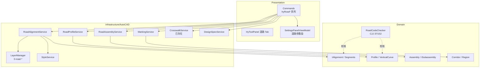
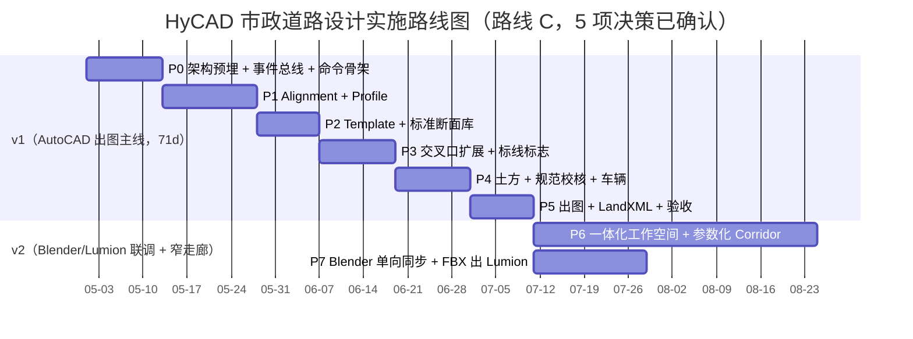

# HyCADTool 市政道路设计 总设计纲要

> 导航：[README](./README.md) · [02INDEX 总对比](./02Software_Overview_INDEX.md) · [03RoadSelect 选型](./03RoadSelect.md)

> 第一性原理：市政道路设计 = **线位** + **剖面** + **部件** + **标注** + **交换**。
> 一切设计从这五个不可再分的本质出发，按重要性降序排列。

---

## 零、文档定位

本文是 HyCADTool.Refactored 新增「市政道路设计」模块的**唯一执行文档**。它建立：

1. 市政道路的领域第一性原理（五元）
2. 与现有 HyCADTool.Refactored 架构的接入方式
3. 实施路线 A / B / C 的并列对比与最终推荐
4. 规范清单与设计红线
5. P0 - P7 的分阶段交付计划

### 工具链路线（项目级决策）

本项目的最终工具链是 **AutoCAD（平面出图） → Blender（3D 模型） → Lumion（渲染）**，后期准备**抛弃 AutoCAD 迁移到 Blender-first**。因此本模块的核心要求是：

- **v1 主攻 AutoCAD 出图**（P0-P5）：完整的平面 + 纵断面 + 横断面 + 标线 + 标志 + 规范校核 + 土方 + 工程量表 + LandXML
- **同时预埋所有中性化接口**：`.roaddesign.json` 单一事实源 / Domain 层零 AutoCAD 依赖 / 稳定 GUID / 事件总线 / 3D 导出端口（空实现）
- **v2 加入 Blender 同步**（P7）：AutoCAD 保存 → Blender 自动刷新 → FBX 给 Lumion
- **v3 / v∞ 远景**：双向实时同步 / Blender-first 迁移 / 抛弃 AutoCAD

工具链专项详见 **[04Pipeline_CAD_Blender_Lumion.md](./04Pipeline_CAD_Blender_Lumion.md)**。

### 交叉索引

- 对标调研：[02Software_Overview_INDEX.md](./02Software_Overview_INDEX.md)（13 款软件）
- 道路核心系统详细设计：[03RoadSelect.md](./03RoadSelect.md)
- AutoCAD → Blender → Lumion 工具链：[04Pipeline_CAD_Blender_Lumion.md](./04Pipeline_CAD_Blender_Lumion.md)

---

## 一、线位（Alignment）— 一切的起点

市政道路模型就是**有桩号的线位 + 沿线的剖面 + 沿线的部件**。

### 1.1 三级线位模型

```
Alignment（平面线位）→ Profile（纵断面）→ Corridor（走廊实体）
```

| 概念 | 职责 | 对标来源 |
|------|------|----------|
| `Alignment` | 平面中心线：直线 + 圆曲线 + 缓和曲线（回旋线）+ 桩号系统 | Civil 3D `Alignment` / 纬地"智能布线" |
| `Profile` | 纵断面：设计标高折线 + 竖曲线；有"地面线 Existing"与"设计线 Design"两种 | Civil 3D `Profile` / 鸿业"多控制点拉坡" |
| `Corridor` | 走廊：沿 Alignment+Profile 扫掠 Assembly 生成的三维实体集 | Civil 3D `Corridor` / OpenRoads `Corridor` |

改 Alignment → Profile 的桩号映射自动更新 → Corridor 沿线刷新。

### 1.2 桩号系统

```csharp
public readonly record struct Station(double Value)  // 沿 Alignment 的弧长，单位 m
{
    public string Format()  // "K0+000.000"
        => $"K{(int)(Value / 1000)}+{(Value % 1000):000.000}";
}

public interface IAlignment
{
    string Name { get; }                        // "K 路"
    double StartStation { get; }                // K0+000
    double EndStation { get; }                  // K1+234.567
    IReadOnlyList<IAlignmentSegment> Segments { get; }  // Line / Arc / Spiral

    Point3d StationToPoint(Station s);
    (Station, double offset) PointToStation(Point3d p);
    double CurvatureAt(Station s);
}
```

### 1.3 现有雏形

HyCADTool.Refactored 的 [`CrosswalkService.cs`](../../HyCADTool.Refactored/Infrastructure/AutoCAD/Services/CrosswalkService.cs) 已经有「直线+圆弧」交叉口拓扑识别（内部 `RoadArm` 概念），但**尚未抽象出 Alignment 概念**。本模块第一步就是把 `RoadArm` 提升到 `Domain/Models/Road/Alignment.cs`。

---

## 二、剖面（Profile & Cross-Section）— 沿线的高程与宽度

### 2.1 纵断面（Profile）

```csharp
public sealed class Profile
{
    public IAlignment Baseline { get; }                 // 绑定的平面线位
    public ProfileKind Kind { get; }                    // Existing / Design
    public IReadOnlyList<ProfilePoint> Pvi { get; }     // 变坡点 Point of Vertical Intersection
    public IReadOnlyList<VerticalCurve> VCurves { get; } // 竖曲线（凹/凸）

    public double ElevationAt(Station s);
    public double GradeAt(Station s);                    // 坡度
}

public readonly record struct ProfilePoint(Station Sta, double Elevation);
public sealed record VerticalCurve(Station Center, double Length, VerticalCurveKind Kind);
public enum VerticalCurveKind { Crest /* 凸 */, Sag /* 凹 */ }
```

### 2.2 横断面（Cross-Section / Assembly）

横断面是部件（Subassembly）的组合：

```csharp
public sealed class Assembly
{
    public string Name { get; }                          // "双向6车道+机非隔离"
    public IReadOnlyList<ISubassembly> Left { get; }     // 左半幅部件序列
    public IReadOnlyList<ISubassembly> Right { get; }
}

public interface ISubassembly
{
    string Code { get; }                                 // "SA_Lane" / "SA_Curb" / "SA_Sidewalk"
    IReadOnlyList<SubassemblyPoint> EvaluateAt(Station s, AssemblyContext ctx);
}
```

典型市政道路部件（对应 CJJ 37 的断面组成）：

| 代号 | 部件 | 对应 Civil 3D Subassembly | 对应鸿业术语 |
|------|------|---------------------------|--------------|
| `SA_MedianDivider` | 中央分隔带 | `MedianDepressed` | 中央分隔带 |
| `SA_Lane` | 机动车道 | `LaneOutsideSuper` | 车行道 |
| `SA_BikeLane` | 非机动车道 | `LaneInsideSuper` | 非机动车道 |
| `SA_GreenBelt` | 绿化带 | `StripePlantation` | 绿化带 |
| `SA_Sidewalk` | 人行道 | `UrbanSidewalk` | 人行道 |
| `SA_Curb` | 路缘石 | `UrbanCurbGutterGeneral` | 路缘石 |
| `SA_Shoulder` | 硬路肩（市政少用） | `ShoulderExtendAll` | — |
| `SA_SideSlope` | 边坡 | `LinkSlopeToSurface` | 边坡 |
| `SA_PavementLayer` | 路面结构层（面/基/垫） | `ShapeOverlayLayer` | 路面结构 |

---

## 三、部件（Assembly）— 可复用的断面模板

### 3.1 参数化部件库

```csharp
public interface ISubassemblyTemplate
{
    string Code { get; }
    IReadOnlyDictionary<string, ParameterDef> Parameters { get; }   // 宽度/横坡/厚度...
    ISubassembly Instantiate(IReadOnlyDictionary<string, object> values);
}

public sealed class AssemblyLibrary
{
    public IReadOnlyList<ISubassemblyTemplate> Templates { get; }
    public ISubassemblyTemplate? Find(string code);
}
```

### 3.2 区段覆写（Region / Override）

同一走廊在不同桩号段需要不同断面（例如 K0+000~K0+500 为标准断面，K0+500~K0+800 过渡到拓宽）：

```csharp
public sealed class CorridorRegion
{
    public Station Start { get; }
    public Station End { get; }
    public Assembly Assembly { get; }
    public IReadOnlyList<IParametricOverride> Overrides { get; }   // 某桩号车道宽度 3.5→3.75
}
```

这是 Civil 3D 的 `Region` + OpenRoads 的 `Template Drop` 共同概念，HyCAD 采用 Civil 3D 的"区段"命名（更直观）。

---

## 四、标注（Marking & Labeling）— 施工图的灵魂

市政道路有"**三层标注**"：

### 4.1 第一层：几何标注

沿 Alignment 放置的**桩号/标高/坐标**标注。

```csharp
public interface IRoadLabelService
{
    void LabelStations(IAlignment a, double interval);         // 每 20m 桩号
    void LabelElevations(Profile p, double interval);          // 纵断面每 20m 标高
    void LabelCoordinates(IAlignment a, IReadOnlyList<Station> key);  // 主要点坐标
}
```

### 4.2 第二层：交通标线（Marking）

`hyRoad` 已做人行横道 / 停止线，需要扩展到：

| 命令（建议） | 功能 | 对应国标 GB 5768 条款 |
|--------------|------|------------------------|
| `hyRoadLane` | 车道分界线（白虚/白实/黄双实） | GB 5768-3 第 4 章 |
| `hyRoadArrow` | 导向箭头图块 | GB 5768-3 第 5.3 节 |
| `hyRoadZebra` | 人行横道（**已存在** `hyRoad`） | GB 5768-3 第 5.1 节 |
| `hyRoadStop` | 停止线 / 让行线 | GB 5768-3 第 5.2 节 |
| `hyRoadGrid` | 禁停网格 | GB 5768-3 第 7 章 |
| `hyRoadSign` | 标志牌图块插入 | GB 5768-2 |

### 4.3 第三层：说明与表格

走现有 [`DesignSpecService.cs`](../../HyCADTool.Refactored/Infrastructure/AutoCAD/Services/DesignSpecService.cs)：

- 设计说明（Markdown → 多栏 MText）
- 路面结构层表
- 工程量汇总表
- 主要控制点坐标表

---

## 五、交换（Exchange）— 数据如何流入流出

### 5.1 DWG / DXF（通过现有 ACAD API）

HyCADTool.Refactored 本身就是 AutoCAD 插件，天然读写 DWG。但要**建立道路语义层**：

```csharp
public interface IRoadDwgPort
{
    Task<IAlignment> ImportAlignmentFromPolylineAsync(ObjectId polyId);   // 从多段线反解
    Task<ObjectId> ExportAlignmentAsPolylineAsync(IAlignment a);
    Task<ObjectId> ExportCorridorAsBlocks(Corridor c, CorridorExportOptions opt);
}
```

### 5.2 LandXML（对标 Civil 3D / OpenRoads / 12d Model 通用交换）

```csharp
public interface ILandXmlPort
{
    Task ImportAsync(string path, ILandXmlImportProfile profile, CancellationToken ct);
    Task ExportAsync(RoadDesign design, string path, CancellationToken ct);
}
```

LandXML 1.2 能表达 `Alignments/Alignment`、`CoordGeom`、`Profile`、`CrossSects` 等全部核心概念，是道路软件事实交换标准。

### 5.3 GIS（远期）

矢量：Shapefile / GeoJSON；坐标：WKT / EPSG。详见 [QGIS_GIS.md](./QGIS_GIS.md)。

### 5.4 IFC 4.3 Road（BIM 远期）

IFC 4.3 正式引入 `IfcAlignment` / `IfcRoad`，可对接 Tekla Civil / Revit。

### 5.5 三维交换（glTF 2.0 / FBX）— Blender / Lumion 流水线

本项目的目标工具链是 **AutoCAD（出图） → Blender（3D 模型） → Lumion（渲染）**，后期准备抛弃 AutoCAD 迁移到 Blender-first。为此新增 3D 交换端口，**v1 只预留接口，v2 实现**：

```csharp
public interface IThreeDExportPort
{
    Task ExportGltfAsync(RoadDesign design, string path, GltfExportOptions opt, CancellationToken ct);
    Task ExportFbxAsync(RoadDesign design, string path, FbxExportOptions opt, CancellationToken ct);
}

public interface ICorridorMeshBuilder
{
    IRoadMesh Build(Corridor corridor);
}
```

详细方案见 **[04Pipeline_CAD_Blender_Lumion.md](./04Pipeline_CAD_Blender_Lumion.md)**，包括：

- 数据流四阶段（v1 文件级双写 → v2 文件监听 → v3 Named Pipe → v∞ Blender-first）
- 格式选型：`.roaddesign.json`（主）+ glTF 2.0（Blender）+ FBX（Lumion）
- v1 **预留点清单**（Domain 零 AutoCAD 依赖 / 稳定 GUID / `schemaVersion` / 事件总线 / 3D 目录约定）
- Blender Python 插件 `hy_roaddesign_addon` 架构
- Lumion LiveSync 文件轮询方案

---

## 六、架构分层



**分层红线**：

1. Domain 层不引用 `Autodesk.AutoCAD.*`（只持有几何值对象）
2. Infrastructure 层的 Service 不缓存 `Database` / `Document`，每次从 `MdiActiveDocument` 解析（遵循 [.cursor/skills/hycad-autocad-singleton-database-context/SKILL.md](../../.cursor/skills/hycad-autocad-singleton-database-context/SKILL.md)）
3. Presentation 层通过 `CommandRegistry.Run` 包装命令，保证样式/参数一致性

---

## 七、与 HyCADTool.Refactored 既有资产的复用

### 7.1 直接复用（零修改）

| 资产 | 用途 |
|------|------|
| [`LayerManager.cs`](../../HyCADTool.Refactored/Infrastructure/AutoCAD/Services/LayerManager.cs) | `0-road-*` 图层批量建表 |
| [`StyleService.cs`](../../HyCADTool.Refactored/Infrastructure/AutoCAD/Services/StyleService.cs) | 文字 / 标注 / 多重引线 / 表格样式 |
| [`DimensionTextAlignService.cs`](../../HyCADTool.Refactored/Infrastructure/AutoCAD/Services/DimensionTextAlignService.cs) | 平面图密集桩号标注防重叠（`ddaa`） |
| [`DesignSpecService.cs`](../../HyCADTool.Refactored/Infrastructure/AutoCAD/Services/DesignSpecService.cs) | 道路设计说明 Markdown → 多栏 MText（`hymd`） |
| `HYJP` 合并平行线 | 双线路缘石整理 |
| `HYOV` OverKill | 图面清理 |
| `HYBL` / `HYBC` 断线 / 曲线打断 | 交叉口几何修整 |
| `Paper/*.cs`（`ph/pv` 系列） | 图纸空间排版 |

### 7.2 扩展既有服务

- [`CrosswalkService.cs`](../../HyCADTool.Refactored/Infrastructure/AutoCAD/Services/CrosswalkService.cs) 的 `RoadArm` 提升到 `Domain/Models/Road/RoadArm.cs`，成为 `Alignment` 的特化（交叉口臂）
- [`SettingsPanelViewModel.cs`](../../HyCADTool.Refactored/Presentation/ViewModels/SettingsPanelViewModel.cs) 在现有 `RoadGapWidth` / `RoadCrosswalkWidth` / `RoadStopLineDistance` / `RoadStripeSpacing` 基础上追加：
  - `RoadLaneWidth` / `RoadBikeLaneWidth` / `RoadSidewalkWidth`
  - `RoadCrownSlope`（路拱横坡，默认 2%）
  - `RoadDesignSpeed`（设计速度，决定最小半径与视距）
  - `RoadStationInterval`（桩号标注间距，默认 20m）
- [`HyToolPanel.xaml`](../../HyCADTool.Refactored/Presentation/Views/HyToolPanel.xaml) 索引 6「道路」Tab 内容填充

### 7.3 新增 Domain 模型

```
Domain/Models/Road/
├── Alignment.cs
├── AlignmentSegment.cs          (Line / Arc / Spiral)
├── Station.cs
├── Profile.cs
├── VerticalCurve.cs
├── Assembly.cs
├── Subassembly/
│   ├── ISubassembly.cs
│   ├── Lane.cs
│   ├── Curb.cs
│   ├── Sidewalk.cs
│   └── ...
├── Corridor.cs
├── CorridorRegion.cs
├── Intersection.cs
├── RoadArm.cs                    (从 CrosswalkService 迁入)
└── RoadDesign.cs                 (聚合根)
```

### 7.4 新增 Infrastructure Service

```
Infrastructure/AutoCAD/Services/Road/
├── RoadAlignmentService.cs
├── RoadProfileService.cs
├── RoadAssemblyService.cs
├── RoadCorridorService.cs
├── IntersectionService.cs        (复用 CrosswalkService 的识别逻辑)
├── MarkingService.cs             (车道线/箭头/禁停网格)
├── SignService.cs                (标志牌图块)
└── RoadCodeChecker.cs            (CJJ 37/152 参数校核)
```

---

## 八、实施路线 A / B / C（三选一，由工程师定）

### 路线 A — 施工图工具链路线（国内实用派风格）

| 项 | 说明 |
|----|------|
| **范式** | AutoCAD 内 2D 辅助建模 + 快速出图，延续 `hyRoad` 现有风格 |
| **对标** | 鸿业、理正、天正、飞时达 |
| **v1 交付** | 平面要素绘制 + 交叉口扩展 + 标线 + 标志 + 标注 + 说明表单 |
| **数据模型** | 以 AutoCAD 实体为核心，`Alignment` 只是多段线的轻量包装 |
| **优点** | 工期短（6-10 周）、符合国内设计院工作流、对 AutoCAD 依赖自然 |
| **缺点** | 没有真正的三维走廊模型、横纵断面联动弱、难接 BIM 下游 |

### 路线 B — 参数化走廊路线（国外标杆风格）

| 项 | 说明 |
|----|------|
| **范式** | Alignment + Profile + Assembly + Corridor 四级，动态联动 |
| **对标** | Civil 3D、OpenRoads、纬地 BIM 2.0 |
| **v1 交付** | 在 Domain 实现完整走廊模型 + AutoCAD 几何同步 + LandXML 交换 |
| **数据模型** | 以 Domain 对象为核心，AutoCAD 实体是**视图**（走廊变化则重建） |
| **优点** | 架构有前瞻性、能进 BIM 正向设计、可扩展曲面与土方 |
| **缺点** | 工期长（4-6 个月）、需要 TIN 曲面、开发成本高、初期对设计师"重" |

### 路线 C — 混合路线（推荐）

| 项 | 说明 |
|----|------|
| **v1** | 路线 A 全部交付（8 周），Domain 同步预埋 `IAlignment` / `Profile` / `Assembly` 接口 |
| **v2** | 选择 2-3 种核心 Assembly 实现参数化，开通"拖动 Alignment → 刷新 Corridor 几何"的窄走廊 |
| **v3** | 扩展到 TIN 曲面 / 超高加宽 / LandXML，逐步接近路线 B |
| **优点** | 每一阶段都有可交付成果，架构留白不浪费；v1 工期可控 |
| **缺点** | 需要 Domain 接口预留足够的前瞻性，v2 的数据迁移需提前设计 |

### 路线决策依据（批 3 回填）

基于 [02Software_Overview_INDEX.md](./02Software_Overview_INDEX.md) 全部对标汇总（13 款软件），以及 HyCAD.Refactored 既有资产评估，得出以下决策依据：

#### a) 目标用户画像

> **国内市政设计院的 AutoCAD 工程师**——日常 90% 时间在 AutoCAD，用鸿业 / 天正 / 纬地出施工图，偶尔用 Civil 3D 或 InfraWorks 做概念方案。对"BIM 正向设计"有兴趣但不急迫。对"数据可 diff / 可版本化 / 可交换"的诉求强烈。

#### b) 既有资产评估

| 资产 | 成熟度 | 对路线选择的影响 |
|------|--------|------------------|
| `CrosswalkService`（交叉臂识别 + 人行横道 + 停止线） | ★★★★ | 已经是"路线 A 的雏形"，继续往前推最经济 |
| `LayerManager` / `StyleService` / `DimensionTextAlignService` | ★★★★★ | 施工图出图基础设施成熟 |
| `DesignSpecService`（Markdown→CAD 说明） | ★★★★ | 设计说明 / 结构层表 / 工程量表可直接复用 |
| `SettingsPanelViewModel` + `hy-settings.json` | ★★★★ | 参数持久化成熟 |
| `PaletteSet` + `HyToolPanel`（7 Tab，含"道路"骨架） | ★★★★ | UI 骨架已留，第 7 Tab 直接扩展 |
| `CommandRegistry` + `AgentDebugLogger` | ★★★★★ | 命令体系健壮 |
| `AutoCAD TransactionManager` + 多文档 SKILL | ★★★★ | 已踩过"单例缓存 Database"的坑 |
| Domain 层通用性 | ★★★ | 尚无道路模型，需要新增，但分层边界清晰 |

**结论**：既有资产高度偏向"**AutoCAD 插件施工图派**"，与路线 A 完全契合，与路线 B 部分冲突（Domain 需要大量新增且与 AutoCAD 实体解耦要求高）。

#### c) 推荐：**路线 C — 混合路线（v1=A / v2=A+B 窄走廊 / v3=B+）**

> **核心判断**：不追求一步到位做完整 BIM 走廊（路线 B），也不自我阉割成纯"天正风格"（路线 A 单独走）。分阶段逐步向 BIM 正向逼近，每阶段都有可交付价值。

**路线 C 的三大理由**：

1. **v1 降维交付**：以现有 `CrosswalkService` 为底，按路线 A 补齐 Alignment/Profile/Template/标线/标志/土方/规范/车辆/标注/说明表单，6-10 周可用。与鸿业 + 天正 + AutoTurn 功能大致持平。
2. **v2 架构前倾**：在 Domain 预埋 `IAlignment` / `Profile` / `Template` / `Corridor` 接口，v2 选择 2-3 种核心 Template 实现参数化 Corridor 重建（窄走廊路径），进入纬地 BIM 2.0 能力区间。
3. **v3 全面 BIM**：v3 引入 TIN Surface、超高加宽、Civil Cell（交叉口/立交）、LandXML/IFC 4.3 交换，贴齐 Civil 3D / OpenRoads / HintCAD 能力顶端。

#### d) 为什么不选路线 A 单独走

- 路线 A 极限下限太低——最终产品仍是"现代版天正"，对企业长期价值不足
- 无法覆盖"三维走廊 / BIM / 交换"这三个市政道路升级方向的刚需

#### e) 为什么不选路线 B 一步到位

- 工期不可控（4-6 个月只是架构完成，产品距离可用还很远）
- 超前于目标用户心智（国内设计师还未准备好"完全放弃多段线驱动的图形思维"）
- 投入产出比低（TIN / 超高 / 曲线连续性等难点，没有成熟 .NET 开源库参考）

---

## 九、规范清单

| 规范 | 标准号 | 核心校核点 |
|------|--------|------------|
| 城市道路工程设计规范 | GB 50647-2011（已并入 CJJ 37） | 荷载、设计速度、建筑限界 |
| **城市道路工程设计规范** | **CJJ 37-2012（2016 局部修订）** | **设计速度、平曲线最小半径、纵坡、视距、横断面组成** |
| **城市道路交叉口设计规程** | **CJJ 152-2010** | **转角半径、渠化、视距三角形、人行横道、停止线位置** |
| 城市道路路线设计规范 | CJJ 193-2012 | 平曲线超高加宽、竖曲线最小半径 |
| 城市道路路基设计规范 | CJJ 194-2013 | 路基填挖、边坡坡率 |
| 城市道路路面设计规范 | CJJ 169-2012 | 沥青 / 水泥混凝土路面结构 |
| 城市道路照明设计标准 | CJJ 45-2015 | 灯具布置（远期） |
| 城市道路交通工程设施 | CJJ/T 266-2017 | 标志牌、护栏、隔离设施 |
| 道路交通标志和标线 | **GB 5768.1~5-2022** | **标线线型、箭头尺寸、标志牌规格** |
| 无障碍设计规范 | GB 50763-2012 | 盲道、缘石坡道 |

**实时校核点**（`RoadCodeChecker`）：

| 参数 | 规范 | 典型阈值（例） |
|------|------|----------------|
| 设计速度 | CJJ 37 表 3.2.1 | 主干路 40-60 km/h |
| 平曲线最小半径 | CJJ 37 表 5.3.2 | 设计速度 50 时不设超高 R≥400m |
| 最大纵坡 | CJJ 37 表 6.2.2 | 主干路 ≤ 6% |
| 最小纵坡 | CJJ 37 § 6.2.3 | ≥ 0.3% |
| 竖曲线最小半径（凸 / 凹） | CJJ 193 § 4.3.2 | 设计速度 50 时 R凸 ≥ 1400m / R凹 ≥ 1050m |
| 交叉口转角半径 | CJJ 152 § 4.3.4 | 次干路与次干路 R=15~20m |
| 人行横道视距三角形 | CJJ 152 § 5.1.4 | 按设计速度计算 |

---

## 十、设计红线

1. **Domain 层禁止 `using Autodesk.AutoCAD.*`**
2. **Infrastructure 服务不缓存 `Database` / `Document`**，每次从 `MdiActiveDocument` 解析
3. **命令必须经 `CommandRegistry.Run` 包装**（样式应用 / 参数加载 / 异常捕获）
4. **所有道路参数必须入 `hy-settings.json`**（可跨 C1/C2 一致）
5. **图层命名必须以 `0-road-` 或 `1-road-` 前缀**（保持与 CrosswalkService 一致）
6. **规范校核必须可禁用且有等级**（Warning / Error），不能硬停用户

---

## 十一、产出路线图 P0 - P7（路线 C 下的八阶段）

### 总览



> v1 每一阶段均含**"预留点清单"**子项——不实现但接口/字段/命令名必须落位，为 v2 Blender 联调、v∞ Blender-first 抛弃 AutoCAD 做准备。详见 **[04Pipeline_CAD_Blender_Lumion.md § 五 预留点清单](./04Pipeline_CAD_Blender_Lumion.md#五v1-预留点清单不实现但接口字段留好)**。

### 关键决策（2026-04-17 确认）

| # | 决策 | 结果 | 影响 |
|---|------|------|------|
| 1 | `.roaddesign.json` 粒度 | 单文件 | Schema v1.0.0 固定 |
| 2 | v1 glTF 导出 | 不做（纯 JSON） | v1 不依赖 SharpGLTF |
| 3 | 事件总线 | **真实发布订阅** | **P0 +2d** |
| 4 | GUID 存储 | DWG Xdata `HY_ROAD` | 随 Copy/Mirror 复制 |
| 5 | Blender 插件启动 | v2（P7） | P0-P5 不做 Python |

详见 [04Pipeline § 十一](./04Pipeline_CAD_Blender_Lumion.md#十一v1-启动前的-5-个关键决策已确认2026-04-17)。

### P0 — 架构预埋 + 事件总线 + 命令骨架（12 工作日）

> **注**：基于决策 3（事件总线 v1 真实实现），原 10d 调整为 12d。

**目标**：建立 Domain 接口 + 命令路由 + 事件发布订阅 + 数据存储骨架，**不产生最终用户可见功能**，但 `.roaddesign.json` 双写链路必须通。

#### v1 必做（核心）

**A. Domain 层（零 AutoCAD 依赖）**

- `Domain/Models/Road/` 目录：`IAlignment` / `Profile` / `Template` / `Corridor` / `RoadNode` 接口定义（空实现或占位）
- `Domain/Geometry/` 纯 C# 几何类型：`RoadPoint3d` / `RoadVector3d` / `RoadPolyline3d` / `RoadMesh`（**禁止 using `Autodesk.AutoCAD.*`**）
- **`Domain/Events/` 事件总线（决策 3）**：
  - `IRoadChangeEvent` 标记接口
  - 9 种 `RoadChange` 具体事件类：`AlignmentAdded/Modified/Removed` / `ProfileAdded/Modified/Removed` / `TemplateAssignmentChanged` / `MarkingAdded/Modified/Removed` / `SignAdded/Removed` / `RoadDesignSaved`
  - `IRoadEventBus` 接口 + `RoadEventBus` 具体实现（`ConcurrentDictionary<Type, ImmutableList<Delegate>>`，弱引用订阅，线程安全）
  - `EventBusTests.cs` ≥ 8 个 case（订阅/退订/多订阅者/异常隔离/线程安全）

**B. Infrastructure 层**

- `Infrastructure/AutoCAD/Services/Road/` 骨架：`RoadAlignmentService` / `RoadProfileService` / `RoadCorridorService` / `IntersectionService` / `MarkingService` / `RoadCodeChecker`
- `Infrastructure/AutoCAD/Geometry/RoadGeometryBridge.cs`：`RoadPoint3d ↔ Autodesk.AutoCAD.Geometry.Point3d` 双向转换
- **`Infrastructure/AutoCAD/Xdata/HyRoadXdata.cs`（决策 4）**：
  - `AppName = "HY_ROAD"`，`SchemaVersion = 1`
  - `EnsureRegApp(Database)` / `TryRead(ObjectId)` / `Write(ObjectId, kind, Guid)`
  - 破损容忍：读失败自动补写
- `Infrastructure/Persistence/Road/RoadDesignJsonPersistenceService.cs`：
  - `.roaddesign.json` 读写（`schemaVersion = "1.0.0"`，UTF-8 无 BOM，2 空格缩进）
  - **订阅所有 `IRoadChangeEvent`，防抖 500ms 写盘**（决策 3 联动决策 1）
- `Infrastructure/IO/RoadDesignFileWatcher.cs`：骨架（v1 不启用，P7 Blender 端用）

**C. Presentation 层**

- `Presentation/ViewModels/RoadDesignViewModel.cs`：面板 ViewModel 骨架
- `HyToolPanel.xaml` 第 7 Tab "道路"补全布局（按 [HongYeRoad.md § 3.4](./HongYeRoad.md#34-面板设计草图道路tab-扩展) 草图）
- `hy-settings.json` 的 `Road` 段扩展
- `CommandRegistry.cs` 新增 15+ `hyRoad*` 命令空响应 + 5 个 `hyRoad3d*` 命令占位

**D. 迁移与启动**

- **把现有 `CrosswalkService.RoadArm` 提升到 `Domain/Models/Road/RoadArm.cs`**（非破坏性迁移，保留命令 `hyRoad`）
- `PluginInitializer` 新增：加载 DWG 后调用 `HyRoadXdata.EnsureRegApp(db)`
- feature-catalog.json v0（预定义 8-10 种基础道路对象）

#### v1 预留（不实现但必须就位）

为 v2 Blender 同步、v∞ Blender-first 做准备（详见 [04Pipeline § 五](./04Pipeline_CAD_Blender_Lumion.md#五v1-预留点清单不实现但接口字段留好)）：

| 预留项 | 位置 | v1 实现方式 | 决策关联 |
|--------|------|-------------|:---:|
| `Guid Id { get; }` | 所有 Road Domain 对象 | **实现**（每对象带稳定 GUID） | 决策 4 |
| DWG Xdata 存 GUID | `HyRoadXdata` 工具类 | **实现**（`HY_ROAD` 应用名） | 决策 4 |
| `IRoadEventBus` | `Domain/Events/` | **实现真实发布订阅**（非 Noop） | 决策 3 |
| `ICorridorMeshBuilder` 接口 | `Domain/Services/` | 接口定义 + `ThrowNotImpl` | 决策 2 |
| `IThreeDExportPort` 接口 | `Domain/Ports/` | 接口定义 + `ThrowNotImpl` | 决策 2 |
| `_libraries/blender-material-mapping.json` | 项目资源目录 | **创建模板**（图层→材质映射） | 决策 5 |
| `_export/{gltf,fbx,reports}/` 目录规约 | 项目文件系统 | **文档化**（v1 创建 reports，其余 v2 用） | 决策 5 |
| `hyRoad3dExportGltf` / `hyRoad3dBlenderSync` / `hyRoad3dExportFbx` / `hyRoad3dBridgeStart` / `hyRoad3dLumionLive` 命令 | `CommandRegistry` | 占位 + 日志"v2 实现（P7）" | 决策 2/5 |

**验收**：
- [ ] 所有命令可执行（弹"功能开发中"），面板可打开
- [ ] `Domain.Models.Road` + `Domain.Events` + `Domain.Geometry` 测试能独立于 AutoCAD 跑（`dotnet test` 不依赖 acdbmgd.dll）
- [ ] `EventBusTests` 全部绿灯（≥ 8 个 case）
- [ ] 新建 DWG → 画一条 Alignment（即使是简单多段线包装）→ `.roaddesign.json` **由事件触发**自动写盘（而不是保存时机械全量写）
- [ ] Alignment 的 Guid 存在 DWG Xdata，Copy/Mirror 后副本 Guid 不同但 schema 一致
- [ ] 重启 AutoCAD 重开 DWG，`Alignment.Id` 保持不变

### P1 — Alignment + Profile（15 工作日）

**目标**：完整实现 L1 + L2，用户可从头画出一条完整的平面+纵断面。

**交付物**：

- Alignment：
  - `hyRoadAlnByPi`（导线法）：交互式输入 PI 点 + 半径 + 缓和曲线参数
  - `hyRoadAlnByEntity`（曲线法）：起点 + 方位 + 段序列
  - `hyRoadAlnEdit`：夹点编辑 PI 点、改半径
  - `hyRoadAlnStation`：批量桩号标注（每 20m 主桩 + 每 5m 副桩，默认）
  - Alignment Entity 自检 `ValidateContinuity()`
- Profile：
  - `hyRoadProfEG`：从选定高程点群或等高线生成 EG 地面线
  - `hyRoadProfFG`：交互式拉设计线（多控制点 + 自动竖曲线）
  - `hyRoadProfEdit`：夹点拖动 PVI
  - `hyRoadProfLabel`：纵断面逐桩标高标注
- 纵断面窗口（WPF Canvas 内嵌）显示 EG + FG
- 规范：CJJ37-5.3.2 / CJJ37-6.2.2 / CJJ37-6.2.3 / CJJ193-4.3.2 实时校核

**对标参考**：[HongYeRoad.md § 1.3](./HongYeRoad.md#13-纵断面多控制点拉坡)（多控制点拉坡） + [Civil3D.md § 1.1](./Civil3D.md#11-alignment--平面线位的一等公民)（Alignment 桩号）。

### P2 — Template + 标准断面库（10 工作日）

**目标**：横断面标准模板体系落地。

#### v1 必做（核心）

- `Template` / `TemplatePoint` / `TemplateConstraint` / `TemplateComponent` Domain
- `TemplateLibrary` 加载器（从 `.hytpl` JSON）
- 6 种内置 CJJ 37 标准断面：快速路 / 主干路（6车道）/ 主干路（4车道）/ 次干路（4车道）/ 次干路（2车道）/ 支路（2车道）
- `hyRoadTpl`：模板库浏览器面板
- `hyRoadTplApply`：对当前 Alignment 应用模板（全桩号或段）
- `hyRoadCross`：批量戴帽子——每 20m 生成横断面图纸（AutoCAD 二维）
- 横断面图图框复用现有 `Paper/*.cs`

#### v1 预留（为 Blender 走廊 Mesh 铺路）

- `Template` Domain 对象里每个 `TemplatePoint` 带 `MaterialKey` 字段（v1 写默认值 `"asphalt_01"` / `"concrete_pavement"`，v2 读取驱动 Blender 材质）
- `TemplateComponent` 带 `BlenderExtrudeHint` 字段（"SweepAlongCurve" / "Decal" / "DoNotExport"，控制 v2 时该组件在 Blender 怎么建）
- `blender-material-mapping.json` 填充前面 6 种断面涉及的所有图层 → 材质映射
- `hyRoadTpl3dPreview` 命令占位（v2 实现 Blender 里实时看模板 3D）

**对标参考**：[OpenRoads.md § 1.1](./OpenRoads.md#11-template-library--断面模板的集中治理) + [HintCAD.md § 1.4](./HintCAD.md#14-批量自动化戴帽子)。

### P3 — 交叉口扩展 + 标线标志（12 工作日）

**目标**：把现有 `CrosswalkService` 升级为完整的 `IntersectionService`，并内置 GB 5768 图库。

**交付物**：

- `IntersectionService.GenerateCornerArc`（四臂转角圆弧，CJJ 152 默认）
- `IntersectionService.GenerateApproachWiden`（进口展宽，可选）
- `IntersectionService.GenerateCurbRamp`（缘石坡道，无障碍）
- `IntersectionService.GenerateTactilePaving`（盲道）
- 命令 `hyRoadIntersection`：交互式—选两条 Alignment，按设置自动生成
- 标线：
  - `hyRoadLane`：车道分界线（白虚/白实/黄双实）
  - `hyRoadArrow`：导向箭头（从图库选）
  - `hyRoadGrid`：禁停网格
- 标志：
  - `hyRoadSign`：标志牌图库浏览器
  - GB 5768 图库初始 80+ 图块（警告/禁令/指示/指路）
- 现有 `hyRoad`（人行横道）保留，界面绑定 `RoadDesignViewModel`

**对标参考**：[HongYeRoad.md § 1.2](./HongYeRoad.md#12-交叉口自动识别与渠化) + [TangentRoad.md § 3.1](./TangentRoad.md#31-图库结构首批内置) + [CrosswalkService 现状](../../HyCADTool.Refactored/Infrastructure/AutoCAD/Services/CrosswalkService.cs)。

### P4 — 土方 + 规范校核 + 车辆（12 工作日）

**目标**：交通校核与工程量出齐。

**交付物**：

- `RoadEarthworkService.CalculateByCrossSection`（道路断面法）
- `hyRoadEarthwork`：土方汇总报告 Markdown / Excel / 累计曲线图
- `RoadCodeChecker` 规则引擎（DynamicExpresso 加载 JSON 规则）
- 内置 12 条 v1 规则（见 [03RoadSelect.md § 4.4](./03RoadSelect.md#44-内置规则清单v1)）
- `hyRoadCheck`：执行校核，生成 Markdown / Word 报告
- 面板红黄绿状态栏（🟢 通过数 🟡 警告数 🔴 错误数）
- 图形高亮（违规对象用错误图层显示）
- `VehicleTrackingService`（自行车模型扫略算法）
- 车辆库 JSON（20 种中国车辆）
- `hyRoadTrack` / `hyRoadSmartPath`
- 视距三角形命令 `hyRoadSightTri`（CJJ152-5.1.4）

**对标参考**：[FastTFT_LiZheng.md § 3.2](./FastTFT_LiZheng.md#32-道路断面法算法骨架) + [HintCAD.md § 3.4](./HintCAD.md#34-120-项审核规则存储) + [AutoTurn.md § 3.2](./AutoTurn.md#32-首批内置车辆清单)。

### P5 — 出图 + LandXML + 验收（10 工作日）

**目标**：可交付施工图 + 数据交换 + v1 收官。

#### v1 必做（核心）

- 平面图：复用现有 `Paper/*.cs` 图框 + 比例
- 纵断面图：WPF Canvas 内容转 AutoCAD 实体
- 横断面图：沿用 P2 批量戴帽子
- 路面结构层表：通过 `DesignSpecService` 生成 MText 表
- 工程量汇总表：表格 / MText
- 设计说明：Markdown 文件 → `DesignSpecService` 多栏 MText
- `LandXmlPort.ImportAsync` / `ExportAsync`
- `hyRoadImportLandXml` / `hyRoadExportLandXml`
- 中国 CRS 预设 [QGIS_GIS.md § 3.1](./QGIS_GIS.md#31-中国-crs-预设)
- 真实项目试用验收：选 1 条 500m~1km 主干路 + 2 个交叉口

#### v1 预留（收尾盘点）

- `.roaddesign.json` **双写机制上线**：每次 `_acDocument.Save` / `SaveAs` 同步写出
- `IThreeDExportPort` 空实现留置（签名确定，供 P7 注入真实实现）
- 验收时完成 **"中性 Domain 审计"**：代码审查 `Domain/Models/Road/` 与 `Domain/Geometry/` 全部 .cs 文件，确保无任何 `Autodesk.AutoCAD.*` 导入
- 导出当前 `.roaddesign.json` 样例（主线 + 交叉口 + 标线）放入 `Doc/RoadDesign/samples/`，作为后续 Blender 插件开发的**测试夹具**

**对标参考**：[Novapoint.md § 3.3](./Novapoint.md#33-landxml-导入导出v1-必交付) + [TangentRoad.md](./TangentRoad.md)（出图习惯）。

### v1 里程碑 — 总计约 71 工作日（约 14.2 周）

| 阶段 | 工期 | 说明 |
|------|:---:|------|
| P0 架构 + 事件总线 + 骨架 | **12d** | 决策 3 +2d |
| P1 Alignment + Profile | 15d | |
| P2 Template + 断面库 | 10d | |
| P3 交叉口 + 标线标志 | 12d | |
| P4 土方 + 规范 + 车辆 | 12d | |
| P5 出图 + LandXML + 验收 | 10d | |
| **合计** | **71d** | |

交付后能力：等价于"**鸿业市政 + 天正图库 + AutoTurn 基础 + FastTFT 断面土方 + Civil 3D 式桩号标注 + LandXML 交换**"的现代化整合版，**同时 Domain 层完全脱耦 AutoCAD、真实事件总线跑通、`.roaddesign.json` 由事件驱动写盘、可被任意外部工具（含 Blender）消费**。

---

### P6 — 一体化工作空间 + 参数化 Corridor（45 工作日）

**目标**：v2 窄走廊路径——从"辅助建模"向"参数化 BIM"迈出第一步。

**交付物**：

- WPF 一体化工作空间窗口（平/纵/横三视图同步，[HintCAD.md § 3.2](./HintCAD.md#32-一体化工作空间架构v2)）
- `Corridor` 完整 Domain 实现 + `CorridorRebuildEngine` 增量重建
- DAG 作为 Corridor 内部实现（[RhinoGH_Parametric.md § 3.1](./RhinoGH_Parametric.md#31-核心借鉴--dag-作为-corridor-的内部实现)）
- Template 参数化扩展：`TemplateParameterTransition`（变宽变板块）
- `hyRoadCorr` / `hyRoadCorrRebuild`
- Civil Cell v1：`intersection-cross-cjj152.hycc`（十字交叉口）
- 超高加宽：`CJJ193SuperRules` 规则库
- `hyRoadProposal`：方案比选面板（[InfraWorks.md § 3.4](./InfraWorks.md#34-proposal-比选面板v2-草案)）
- Feature Catalog 扩展（[Novapoint.md § 3.2](./Novapoint.md#32-feature-catalog-样例)）
- GIS 导入（Shapefile / GeoJSON）

### P7 — Blender 单向同步 + FBX 出 Lumion（18 工作日，与 P6 可并行）

**目标**：把 AutoCAD 设计的道路**搬进 Blender**，Lumion 里能看到渲染结果。

**交付物**：

- **Blender Addon `hy_roaddesign_addon`**（Python，Blender 4.2 LTS）
  - `operators/op_import.py`：读 `.roaddesign.json` 生成 Curve + Mesh
  - `operators/op_watch.py`：文件监听自动重建（watchdog）
  - `operators/op_export_fbx.py`：FBX 批导出（给 Lumion）
  - `builders/alignment_builder.py` / `corridor_builder.py` / `marking_builder.py`
- **C# 侧 `hyRoad3dExportGltf`**：SharpGLTF 生成 .glb（手动一键导出，给不想装 Addon 的设计师）
- **材质映射落实**：`blender-material-mapping.json` 覆盖所有 v1 图层
- **Lumion LiveSync 文档**：Blender FBX 输出路径 + Lumion 监听配置
- **样例工程**：在 `Doc/RoadDesign/samples/` 放一组 DWG + JSON + Blend + FBX + Lumion 截图

**关键质量门**：
- [ ] 用户改 AutoCAD Alignment → 保存 → 回 Blender 窗口 < 2 秒内看到更新
- [ ] FBX 导入 Lumion 无材质错乱（沥青、水泥、绿化、标线至少 4 类正确显示）

**对标参考**：[04Pipeline § 六 v2 方案](./04Pipeline_CAD_Blender_Lumion.md#六v2-方案autocad--blender-单向同步) + [04Pipeline § 十 风险](./04Pipeline_CAD_Blender_Lumion.md#十风险与取舍)。

### v3 远景（不纳入当前路线图，作为路线 C 的后续）

- **双向实时同步**（Named Pipe + JSON Patch，见 [04Pipeline § 七](./04Pipeline_CAD_Blender_Lumion.md#七v3-方案双向实时--lumion-livesync)）
- **Lumion LiveSync 稳定版**
- **Blender-first 迁移**（[04Pipeline § 八 v∞](./04Pipeline_CAD_Blender_Lumion.md#八vblender-first抛弃-autocad)）
- 其他远景详见 [02Software_Overview_INDEX.md § 六](./02Software_Overview_INDEX.md#六v1--v2--v3-功能建议清单从对标总结)。

---

## 十二、风险识别

| 风险 | 概率 | 影响 | 缓解 |
|------|------|------|------|
| 异形交叉口拓扑识别失败 | 中 | 中 | 半自动 fallback（见 [HongYeRoad.md § 2.1](./HongYeRoad.md#21-异形交叉口崩溃)） |
| 多段线 / 圆弧几何精度不足 | 低 | 中 | 使用 AutoCAD 原生 `Polyline` / `Polyline3d` / `Arc`；Alignment 用双精度 |
| 纵断面 Canvas 性能问题 | 低 | 低 | 按桩号分区缓存渲染；大于 10km 采用稀疏采样 |
| 规范参数表持续更新 | 高 | 中 | 规则 JSON 化，运行时加载；用户可在 _libraries/ 自行更新 |
| AutoCAD API 版本兼容 | 低 | 高 | 锁定 AutoCAD 2025+；已在项目整体方案确定 |
| 多文档切换导致服务缓存失效 | 中 | 高 | 遵循 [hycad-autocad-singleton-database-context](../../.cursor/skills/hycad-autocad-singleton-database-context/SKILL.md) 与 [hycad-multidoc-panel-resource-init](../../.cursor/skills/hycad-multidoc-panel-resource-init/SKILL.md) SKILL |
| 与热加载 C1/C2 联调复杂 | 中 | 低 | 参考 [hycad-refactored-migration-patterns](../../.cursor/skills/hycad-refactored-migration-patterns/SKILL.md) |
| LandXML 复杂数据丢失 | 中 | 中 | v1 先做 `Alignment + Profile`，不做 `CrossSects`；v2 补充 |
| v1 Domain 层意外引入 `Autodesk.AutoCAD.*` 依赖 | 中 | **高** | P5 验收前做"中性 Domain 审计"；CI 可加静态检查规则 |
| `.roaddesign.json` Schema 破坏性变更 | 中 | 中 | 强制 `schemaVersion` 字段；所有读取兼容缺失字段；变更版本号即迁移 |
| Blender 大坐标精度丢失 | 高 | 中 | 见 [04Pipeline § 6.5](./04Pipeline_CAD_Blender_Lumion.md#65-已知坑提前规避) |
| Lumion 无公开 API | 高 | 中 | LiveSync 走文件轮询；关注 Lumion AIR 进展 |
| Blender 插件跨版本失效 | 中 | 中 | 锁 Blender 4.2 LTS；严格声明 `bl_info.blender` |
| Python.NET 与 Blender 兼容性（v∞） | 中 | 高 | v∞ 前实地测试；保留"外部进程 IPC"备用路径 |

---

## 附：命名前缀约定

| 类型 | 前缀 | 示例 |
|------|------|------|
| 命令 | `hyRoad` | `hyRoad`（已存在，人行横道）、`hyRoadLane`、`hyRoadProfile` |
| Domain 类 | `Road*` / 领域词 | `RoadDesign` / `Alignment` / `Profile`（无前缀，在 `Domain.Models.Road` 命名空间） |
| Service | `Road*Service` | `RoadAlignmentService` / `IntersectionService`（例外：交叉口已成熟术语） |
| 图层 | `0-road-xxx` | `0-road-中心线` / `0-road-标线-人行横道-实线`（已存在） |
| 样式 | `HY-Road-xxx` | 文字样式 / 标注样式 |
| hy-settings 字段 | `Road*` | `RoadLaneWidth` / `RoadDesignSpeed`（已存在 `RoadGapWidth` 等） |

---

## 修订记录

| 日期 | 说明 |
|------|------|
| 2026-04-16 | 初版骨架（批 1）：五元原理 + 架构分层 + 实施路线 A/B/C 框架 + 规范清单 |
| 2026-04-17 | 批 3 回填：实施路线最终推荐（路线 C）、产出路线图 P0-P6 |
| 2026-04-17 | 工具链集成：§ 零工具链路线、§ 5.5 3D 交换、P0/P2/P5 划分"v1 必做/预留"、新增 P7 Blender 同步阶段、§ 十二补 4 项 3D 流水线风险（配合新增 04Pipeline） |
| 2026-04-17 | 5 项关键决策确认：单文件 JSON / 不做 glTF / 真实事件总线（P0 +2d）/ DWG Xdata GUID / Blender v2 启动；v1 里程碑 69d→71d，P0 细化事件总线 + Xdata 交付物 |
