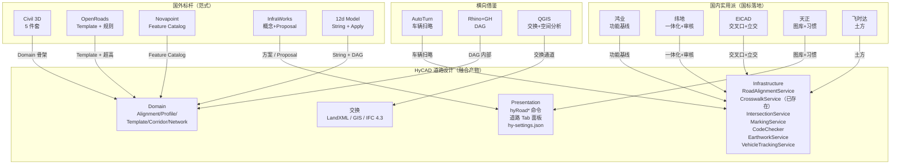

# 市政道路对标软件总览索引与对比表

> 导航：[README](./README.md) · [01MASTER 总纲](./01MASTER.md) · [03RoadSelect 选型](./03RoadSelect.md)

> 13 款软件对标完成。本文是"一站式选型参考"——想知道"HyCAD 应该向哪个软件学什么"，先读本文。

---

## 一、软件清单（13 款）

### 国外标杆（5 款）

| 文档 | 软件 | 厂商 | 平台 | 价格梯度 | 核心定位 |
|------|------|------|------|----------|----------|
| [Civil3D.md](./Civil3D.md) | Autodesk Civil 3D | Autodesk | AutoCAD 扩展 | $$$$$ | 参数化走廊的定义者 |
| [OpenRoads.md](./OpenRoads.md) | OpenRoads Designer | Bentley | MicroStation | $$$$$ | 企业级规范化走廊 + Civil Cell |
| [Novapoint.md](./Novapoint.md) | Novapoint + Quadri | Trimble | MicroStation + Quadri Server | $$$$$ | 多专业模型服务器协同 |
| [InfraWorks.md](./InfraWorks.md) | InfraWorks | Autodesk | 独立桌面 | $$$$ | 概念设计 + 城市底座 |
| [12dModel.md](./12dModel.md) | 12d Model | 12d Solutions | 独立桌面 | $$$$ | 字符串函数式土木一体化 |

### 国内实用派（5 款）

| 文档 | 软件 | 厂商 | 平台 | 价格梯度 | 核心定位 |
|------|------|------|------|----------|----------|
| [HongYeRoad.md](./HongYeRoad.md) | 鸿业市政道路（HY-SZDL） | 鸿业科技 | AutoCAD 扩展 | $$ | 国内市政覆盖最完整 |
| [HintCAD.md](./HintCAD.md) | 纬地道路（HintCAD / BIM 2.0） | 西安纬地 | AutoCAD / 中望 CAD | $$$ | 平纵横一体化 + BIM 正向 |
| [EICAD.md](./EICAD.md) | 狄诺尼 EICAD 5.0 | 江苏狄诺尼 | 中望 CAD + SaaS | $$$ | 交叉口/立交专业 + AIGC |
| [TangentRoad.md](./TangentRoad.md) | 天正市政道路 TDL | 天正软件 | AutoCAD 扩展 | $$ | 国标制图习惯 + 图库 |
| [FastTFT_LiZheng.md](./FastTFT_LiZheng.md) | 飞时达 FastTFT / 理正 | 飞时达 / 理正 | AutoCAD / 中望 | $$ | 快速出图 + 土方专精 |

### 横向借鉴（3 款）

| 文档 | 软件 | 厂商 | 平台 | 价格梯度 | 核心定位 |
|------|------|------|------|----------|----------|
| [AutoTurn.md](./AutoTurn.md) | Transoft AutoTurn | Transoft Solutions | AutoCAD / MicroStation 扩展 | $$$ | 车辆扫略路径 + 视距 |
| [RhinoGH_Parametric.md](./RhinoGH_Parametric.md) | Rhino + Grasshopper | McNeel | 独立桌面 | $$ | 通用参数化 DAG |
| [QGIS_GIS.md](./QGIS_GIS.md) | QGIS / ArcGIS | OSGeo / Esri | 独立桌面 | 免费~$$$$ | GIS 空间数据 + 交换格式 |

> 价格梯度：`$` ≤ ¥5k/年，`$$` ≤ ¥20k/年，`$$$` ≤ ¥80k/年，`$$$$` ≤ ¥300k/年，`$$$$$` > ¥300k/年。

---

## 二、总对比表（核心能力维度）

图例：**●** 完整支持 / **◐** 部分支持 / **○** 弱或无 / **—** 不适用

| 能力维度 | Civil3D | OpenRoads | Novapoint | InfraWorks | 12dModel | HongYe | HintCAD | EICAD | Tangent | FastTFT | AutoTurn | Rhino+GH | GIS |
|----------|:-------:|:---------:|:---------:|:----------:|:--------:|:------:|:-------:|:-----:|:-------:|:-------:|:--------:|:--------:|:---:|
| **Alignment 平面** | ● | ● | ● | ◐ | ● | ● | ● | ● | ◐ | ◐ | — | ○ | ○ |
| **Profile 纵断面** | ● | ● | ● | ◐ | ● | ● | ● | ● | ◐ | ◐ | — | ○ | — |
| **Assembly/Template 横断面** | ● | ● | ● | ◐ | ● | ● | ● | ● | ○ | ◐ | — | — | — |
| **Corridor 三维走廊** | ● | ● | ● | ◐ | ● | ◐ | ● | ● | ○ | ○ | — | ○ | — |
| **交叉口自动化** | ◐ | ● | ◐ | ○ | ◐ | ● | ● | ● | ◐ | ○ | ◐ | ○ | — |
| **标线/标志/图库** | ◐ | ◐ | ◐ | ○ | ◐ | ● | ● | ◐ | ● | ◐ | — | — | ○ |
| **超高加宽** | ● | ● | ● | ○ | ● | ● | ● | ● | ○ | ○ | — | — | — |
| **土方计算** | ● | ● | ● | ◐ | ● | ● | ● | ● | ○ | ● | — | — | ○ |
| **规范校核** | ◐ | ● | ◐ | ○ | ◐ | ● | ● | ● | ○ | ◐ | ◐ | ○ | — |
| **车辆扫略/视距** | ◐ | ◐ | ○ | ○ | ○ | ◐ | ◐ | ◐ | ○ | ○ | ● | — | — |
| **概念设计** | ○ | ○ | ○ | ● | ○ | ○ | ◐ | ◐ | ○ | ○ | — | ● | ◐ |
| **BIM 三维正向** | ● | ● | ● | ◐ | ● | ○ | ● | ● | ○ | ○ | — | ● | — |
| **IFC 4.3 Road** | ◐ | ● | ● | ◐ | ◐ | ○ | ◐ | ◐ | ○ | ○ | — | ○ | — |
| **LandXML** | ● | ● | ● | ◐ | ● | ○ | ◐ | ◐ | ○ | ○ | — | ○ | ● |
| **GIS 格式（Shp/GeoJson/KML）** | ◐ | ◐ | ◐ | ● | ◐ | ○ | ○ | ○ | ○ | ○ | — | ◐ | ● |
| **方案比选 / 多 Proposal** | ◐ | ◐ | ◐ | ● | ○ | ○ | ○ | ◐ | ○ | ○ | — | ● | ◐ |
| **云端 / 多人协同** | ◐ | ● | ● | ● | ○ | ○ | ○ | ● | ○ | ○ | ◐ | ○ | ◐ |
| **AI / AIGC** | ◐ | ○ | ○ | ◐ | ○ | ○ | ○ | ● | ○ | ○ | — | ◐ | ○ |
| **参数化 DAG 可视** | ◐ (PKT) | ● (.itl) | ◐ | ◐ | ● (MTF) | ○ | ◐ | ○ | ○ | ○ | — | ● | ○ |
| **国标 CJJ 37/152** | ○ | ○ | ○ | ○ | ○ | ● | ● | ● | ◐ | ◐ | ◐ | ○ | — |
| **中文 / 本地化** | ◐ | ◐ | ○ | ◐ | ○ | ● | ● | ● | ● | ● | ◐ | ◐ | ◐ |
| **AutoCAD 原生** | ● | ○ | ◐ | ○ | ○ | ● | ● | ○ | ● | ● | ● | ○ | ○ |
| **学习曲线（越少越好）** | ◐ | ○ | ○ | ● | ○ | ◐ | ◐ | ◐ | ● | ● | ● | ○ | ◐ |

---

## 三、按维度的"最佳借鉴对象"

| 维度 | 第一梯队 | 第二梯队 | 备注 |
|------|----------|----------|------|
| **参数化走廊完备性** | Civil3D / OpenRoads / HintCAD | 12dModel / Novapoint / EICAD | Civil3D 是范式定义者，HintCAD 是最强本土化 |
| **交叉口专业深度** | EICAD / HintCAD | HongYe / OpenRoads | 左转待行区 / 渠化 / 交织区 EICAD 最深 |
| **标线标志图库** | Tangent | HongYe | 天正的图块习惯国内设计师最熟 |
| **土方计算算法** | FastTFT | 12dModel / HongYe / HintCAD | FastTFT 七种算法并存 |
| **车辆扫略 / 视距** | AutoTurn | AutoTurn Pro（3D）/ VRRoad | 绝对专业，无替代 |
| **规范内置** | HongYe / HintCAD / EICAD | — | 国产软件在国标上完全碾压 |
| **概念设计 / 方案** | InfraWorks | Rhino+GH | 方案阶段 InfraWorks 最快 |
| **BIM 正向设计** | Civil3D / Novapoint / HintCAD BIM 2.0 | OpenRoads | 业界四强 |
| **云端协同** | Novapoint/Quadri / EICAD SaaS | InfraWorks+BIM 360 | 北欧派领先 |
| **数据交换格式** | Novapoint | Civil3D / OpenRoads | LandXML/IFC 4.3 最完整 |
| **GIS 整合** | InfraWorks / QGIS+ArcGIS | Novapoint | 规划阶段必备 |
| **参数化扩展性** | Rhino+GH | 12dModel | DAG 思维 GH 最彻底 |
| **AI 方向** | EICAD + AIRoad | Civil3D（Forma） | 国内 EICAD 抢跑 |

---

## 四、按"HyCAD 吸纳价值"排序（对 HyCAD.Refactored 最重要的 TOP 10）

| 排名 | 软件 | 吸纳内容 | 优先级 |
|------|------|----------|--------|
| **1** | 鸿业 HongYe | 全功能对标基线（v1 功能清单） | P0 |
| **2** | 纬地 HintCAD | 平纵横一体化交互（v2） + 120 项规范审核（v1-v2） | P0 |
| **3** | Civil 3D | Alignment/Profile/Assembly/Corridor 四件套（Domain 核心） | P0 |
| **4** | 天正 Tangent | 图库 + 标注样式 + 图层命名习惯（v1 必做） | P0 |
| **5** | AutoTurn | 车辆扫略 + 视距三角形（v2 独立模块） | P1 |
| **6** | EICAD | 左转待行区 / 交织区 / 立交（v2-v3） | P1 |
| **7** | FastTFT | 土方道路断面法 + 累计曲线（v1） | P1 |
| **8** | OpenRoads | Template Library 治理 + Civil Cell + 超高 XML 规则（v2-v3） | P1 |
| **9** | Novapoint | Feature Catalog + LandXML + 快照版本（v1-v2） | P1 |
| **10** | Rhino+GH | DAG 作为 Corridor 内部实现哲学（v2 内核） | P2 |

InfraWorks / 12d Model / QGIS 属于**参考但不直接吸纳**，作为远期（v3+）扩展方向。

### 补充：Blender + Lumion 的工具链角色

本文的 13 款软件都是**竞品**。但 HyCAD 的最终工具链里还有两个**合作者**：

| 工具 | 角色 | 在 HyCAD 中 | 对比 |
|------|------|-------------|------|
| **Blender 4.2 LTS** | 3D 建模环境 | v2 接入（P7 阶段），v∞ 作为 Blender-first 主编辑器 | 类比 Rhino，但开源、免费、Python 插件生态 |
| **Lumion** | 渲染器 | v2 接入（FBX 批导出），v3 LiveSync | 类比 InfraWorks 的可视化角色，但专职渲染 |

两者不占 13 款竞品名额，因为它们不直接做"市政道路设计"——它们是 HyCAD 设计结果的 **3D / 渲染下游**。工具链详细设计见 **[04Pipeline_CAD_Blender_Lumion.md](./04Pipeline_CAD_Blender_Lumion.md)**。

---

## 五、收敛图：13 款软件 → HyCAD 设计

---

## 六、v1 / v2 / v3 功能建议清单（从对标总结）

### v1 基线（6-10 周，路线 A）

**必含**（对标鸿业基线 + 天正习惯 + AutoTurn 基础 + FastTFT 土方）：

- Alignment：PI 点法 / 参数法
- Profile：EG 从点群提取 + FG 交互式拉坡
- 标准横断面模板：6 种 CJJ 37 典型断面
- 交叉口：转角圆弧 + 进口展宽（扩展现有 CrosswalkService）
- 标线：车道分界 / 导向箭头 / 禁停网格 / 人行横道（已存在） / 停止线（已存在）
- 标志：GB 5768 标志牌图库（70+ 图块）
- 桩号 / 标高 / 坐标标注（逐桩）
- 土方：道路断面法 + 累计曲线
- 规范校核：CJJ 37 / CJJ 152 / CJJ 193（红黄绿实时提示）
- 车辆扫略（基础）：20+ 中国常用车辆 + SmartPath
- 视距三角形（CJJ 152）
- 说明与表单：复用 `DesignSpecService` + 结构层表 + 工程量表
- LandXML 导入导出
- `.roaddesign` 单文件 + 本地快照
- 中国 CRS 预设

### v2 深化（再 8-12 周，路线 B 或路线 C）

- 一体化工作空间（平纵横三视图同步，借鉴 HintCAD）
- Template 模板库机制（借鉴 OpenRoads .itl）
- Civil Cell：十字 / T / 环岛（借鉴 OpenRoads + 纬地）
- 超高加宽（CJJ 193 规则库）
- 港湾式公交站（借鉴 HongYe）
- 左转待行区（借鉴 EICAD）
- 交织区分析
- 变宽变板块过渡
- 非对称断面原生支持
- 方案比选 / Proposal（借鉴 InfraWorks）
- Feature Catalog（借鉴 Novapoint）
- GIS 交换（Shapefile / GeoJSON / KML）
- 空间分析（Buffer / Intersect，NetTopologySuite）
- Corridor 增量重建（DAG 作为内部实现）

### v3 远景（再 12-24 周）

- IFC 4.3 Road 导出
- TIN Surface + 三角网土方
- 立交 / 匝道（多 Alignment + 约束）
- BCF 评审工作流
- 概念设计（InfraWorks 式零参数绘制）
- 正射影像 / DEM 背景（v3）
- Script 节点（Roslyn，用户自定义）
- 驾驶仿真接口（FBX → Unity/UE）
- 智能拉坡优化（Galapagos 式）
- MCP Server（AI 命令接入，对接 LLM）

---

## 七、"避坑清单"

| 坑 | 来源 | HyCAD 应对 |
|----|------|------------|
| Subassembly Composer 只支持 VB.NET | Civil 3D | C# 原生 `ISubassembly` |
| .itl 二进制难 diff | OpenRoads | JSON/JSON5 格式 |
| Quadri 服务器部署门槛 | Novapoint | 单文件 + 本地快照 |
| 概念到详细脱节 | InfraWorks | 方案/施工图共用 Domain |
| MTF 语法陈旧 | 12d Model | Template 用 C#/JSON |
| 异形交叉口崩溃 | HongYe | 半自动 fallback |
| 非对称断面笨拙 | HongYe | Left/Right 独立 |
| BIM 2.0 许可贵 | HintCAD | 免费集成 |
| SaaS 数据合规 | EICAD | 纯本地 |
| 2D 思维 | Tangent | Domain 为 BIM 预留 |
| 模块数据不共享 | FastTFT/理正 | 单 Domain 聚合根 |
| 中国车辆库覆盖不全 | AutoTurn | 首发 20-30 种 |
| 学习曲线高 | Rhino+GH | DAG 藏在内部 |
| 对中国 CRS 支持不完整 | QGIS | 中国 CRS 预设 |

---

## 八、阅读路径建议

- **只读 3 篇**：[Civil3D.md](./Civil3D.md)（理解范式）+ [HongYeRoad.md](./HongYeRoad.md)（理解功能基线）+ [01MASTER.md](./01MASTER.md)（HyCAD 纲要）
- **工程决策**：读本文 + [01MASTER.md § 八](./01MASTER.md#八实施路线-a--b--c三选一由工程师定) + [03RoadSelect.md](./03RoadSelect.md)
- **前端/UX**：[TangentRoad.md](./TangentRoad.md) + [HintCAD.md](./HintCAD.md)
- **Domain/架构**：[Civil3D.md](./Civil3D.md) + [OpenRoads.md](./OpenRoads.md) + [12dModel.md](./12dModel.md) + [Novapoint.md](./Novapoint.md)
- **交通工程**：[AutoTurn.md](./AutoTurn.md) + [EICAD.md](./EICAD.md)
- **BIM / 交换**：[Novapoint.md](./Novapoint.md) + [QGIS_GIS.md](./QGIS_GIS.md)
- **方案设计**：[InfraWorks.md](./InfraWorks.md)
- **参数化前沿**：[RhinoGH_Parametric.md](./RhinoGH_Parametric.md) + [12dModel.md](./12dModel.md)

---

## 九、索引

- [README.md](./README.md)
- [01MASTER.md](./01MASTER.md) — 总纲
- [03RoadSelect.md](./03RoadSelect.md) — 道路核心系统专项
- [04Pipeline_CAD_Blender_Lumion.md](./04Pipeline_CAD_Blender_Lumion.md) — AutoCAD → Blender → Lumion 工具链

国外标杆：[Civil3D](./Civil3D.md) · [OpenRoads](./OpenRoads.md) · [Novapoint](./Novapoint.md) · [InfraWorks](./InfraWorks.md) · [12dModel](./12dModel.md)

国内实用派：[HongYeRoad](./HongYeRoad.md) · [HintCAD](./HintCAD.md) · [EICAD](./EICAD.md) · [TangentRoad](./TangentRoad.md) · [FastTFT_LiZheng](./FastTFT_LiZheng.md)

横向借鉴：[AutoTurn](./AutoTurn.md) · [RhinoGH_Parametric](./RhinoGH_Parametric.md) · [QGIS_GIS](./QGIS_GIS.md)
