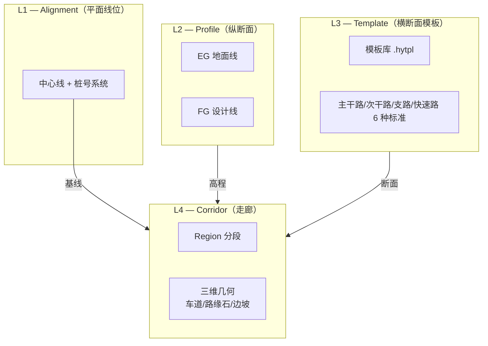
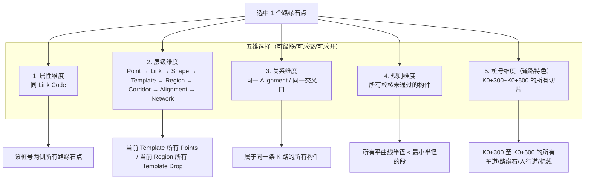
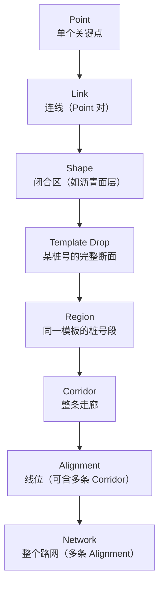
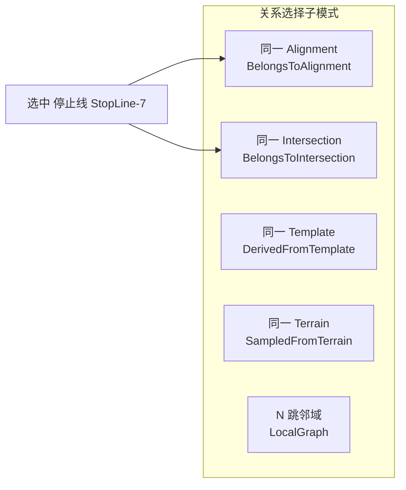
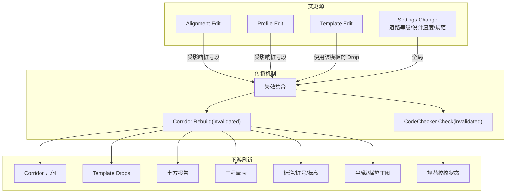
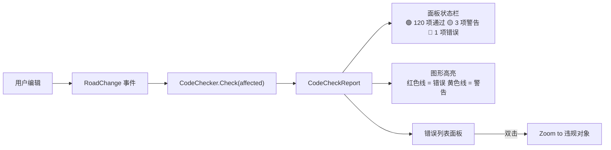

# HyCAD 道路核心系统：参数化体系 + 五维选择 + 联动传播

> 导航：[README](./README.md) · [01MASTER 总纲](./01MASTER.md) · [02INDEX 总对比](./02Software_Overview_INDEX.md)

> 本文是 HyCAD 市政道路设计的"**核心系统专项**"，结构仿 [`HyTool/Doc/Select.md`](../../../HyTool/Doc/Select.md)，覆盖：
> 1. 四级参数化体系（Alignment / Profile / Template / Corridor）
> 2. 五维选择（属性 / 层级 / 关系 / 规则 / 桩号）
> 3. 联动传播（Alignment 动 → 全系刷新）
> 4. 规范实时反馈（红/黄/绿）

读懂本文，就读懂了 HyCAD 道路设计的**运行逻辑**。

---

## 一、四级参数化体系

### 1.1 四个核心层次



### 1.2 对应 Civil 3D / OpenRoads / 12d / 鸿业 / 纬地的映射

| HyCAD 层 | Civil 3D | OpenRoads | 12d Model | 鸿业 | 纬地 |
|----------|----------|-----------|-----------|------|------|
| L1 Alignment | Alignment | Alignment | Super Alignment | 平面线形 | Alignment |
| L2 Profile | Profile (EG/FG) | Profile | Profile String | 纵断面 | Profile |
| L3 Template | Assembly+Subassembly | Template (.itl) | MTF Template | 横断面模板 | 横断面 |
| L4 Corridor | Corridor | Corridor | Apply MTF 输出 | 走廊 (BIM 2.0) | BIM 走廊 |

**关键设计决策**：

- **合并 Assembly 与 Template**：HyCAD 不把 Subassembly 暴露给用户（藏在 Template.Component 内部）。Template 概念更贴近国内设计师心智（"标准断面表"）。
- **EG 与 FG 都是 Profile**，通过 `ProfileKind` 枚举区分。
- **Corridor 不是图形，是 Domain 对象**。AutoCAD 里看到的走廊几何只是视图。

### 1.3 Domain 完整定义

```csharp
namespace HyCADTool.Refactored.Domain.Models.Road;

public sealed class RoadDesign      // 聚合根
{
    public string Name { get; }
    public Crs Crs { get; }
    public IReadOnlyList<IAlignment> Alignments { get; }       // L1（可多条：路网）
    public IReadOnlyList<Profile> Profiles { get; }             // L2
    public TemplateLibrary Templates { get; }                   // L3 库
    public IReadOnlyList<Corridor> Corridors { get; }           // L4
    public IReadOnlyList<RoadNode> Nodes { get; }               // 交叉口/立交
    public SettingsSnapshot Settings { get; }                   // hy-settings.json 快照
}
```

---

## 二、五维选择系统（仿 HyTool Select 的道路特化）

### 2.1 五维纵览



### 2.2 维度 1：属性选择（Property）

从选中的道路构件出发，按属性相同筛选：

| 属性轴 | 示例 |
|--------|------|
| `LinkCode` | "所有中央分隔带边线" |
| `ShapeCode` | "所有沥青面层" |
| `Material` | "所有 C30 水泥混凝土基层" |
| `PavementLayerType` | "所有面层" |
| `FunctionalClass` | "所有主干路" |
| `DesignSpeed` | "所有 50 km/h 路段" |
| `RoadStringKind` | "所有路缘石顶线" |
| `IntersectionType` | "所有 T 形交叉口" |
| `CodeCheckStatus` | "所有 Warning 构件" |

```csharp
public sealed class RoadPropertySelector
{
    public RoadPropertyAxis Axis { get; init; }
    public ComparisonOperator Operator { get; init; }
    public object? Value { get; init; }          // null = 从已选对象自动取值
}

public enum RoadPropertyAxis
{
    LinkCode, ShapeCode, Material, PavementLayerType,
    FunctionalClass, DesignSpeed, RoadStringKind,
    IntersectionType, CodeCheckStatus,
    CustomProperty                               // 预留
}
```

### 2.3 维度 2：层级选择（Hierarchy）

道路层次比结构更复杂。HyCAD 给用户**7 级**层次：



**快捷键**（建议）：

| 操作 | 快捷键 | 效果 |
|------|--------|------|
| 向上一级 | `Ctrl + Shift + ↑` | Point → Link → Shape → ... → Network |
| 向下一级 | `Ctrl + Shift + ↓` | 回退 |
| 直跳层级 | `Ctrl + Shift + L` | 弹出层级选择菜单 |

```csharp
public enum RoadHierarchyLevel
{
    Point,
    Link,
    Shape,
    TemplateDrop,
    Region,
    Corridor,
    Alignment,
    Network
}

public interface IRoadHierarchySelector
{
    RoadSelectionSet Expand(RoadSelectionSet current, RoadHierarchyLevel target);
    RoadSelectionSet Contract(RoadSelectionSet current, RoadHierarchyLevel target);
    RoadSelectionSet SiblingSwitch(RoadSelectionSet current, SiblingDirection dir);
}
```

### 2.4 维度 3：关系选择（Relation）

道路对象之间的**关系边**：



| 子模式 | 起点 | 遍历 | 结果 |
|--------|------|------|------|
| **同 Alignment** | 停止线 StopLine-7 | StopLine-7 → `BelongsToAlignment`(K路) → K路 Backlinks | K路上的所有停止线 / 人行横道 / 标线 / 标志 |
| **同 Intersection** | 斑马线 Crosswalk-3 | Crosswalk-3 → `BelongsToIntersection`(Node-5) → Node-5 Backlinks | 该交叉口的 4 条斑马线 + 4 条停止线 + 转角圆弧 + 渠化岛 |
| **同 Template** | 某 Template Drop 的路面 | TemplateDrop → `DerivedFromTemplate`(Template-主干路-6车道) → Backlinks | 所有使用同一模板的 TemplateDrop |
| **同 Terrain** | 某 EG Profile | Profile → `SampledFromTerrain`(EG-Surface) → Backlinks | 所有从该地形采样的 Profile |
| **N 跳邻域** | 某交叉口 | Node-5 → 相邻 Alignment → 相邻 Node | 局部图谱（2-3 跳内） |

### 2.5 维度 4：规则选择（Rule / Query）

按**条件表达式**筛选所有对象：

| 规则示例 | 语义 |
|----------|------|
| `alignment.segment.kind == 'Curve' AND segment.radius < lookup('CJJ37.5.3.2', designSpeed)` | 所有不满足最小半径的圆曲线 |
| `profile.segment.grade.abs > lookup('CJJ37.6.2.2', functionalClass)` | 所有超过最大纵坡的段 |
| `intersection.cornerArc.radius < 15` | 所有转角半径小于 15m 的交叉口 |
| `template.point.code == 'EP' AND template.shapeAt(point).material == '沥青'` | 所有沥青面层边线 |
| `feature.codeCheckStatus == 'Error'` | 所有规范校核失败对象 |

规则引擎用 **DynamicExpresso**（推荐）或 **System.Linq.Dynamic.Core**：

```csharp
public interface IRoadQueryEngine
{
    RoadSelectionSet Execute(string expression, IRoadQueryContext context);
}

public sealed class RoadQueryContext : IRoadQueryContext
{
    public RoadDesign Design { get; }
    public IReadOnlyDictionary<string, ICodeStandardLookup> Standards { get; }   // "CJJ37" / "CJJ152" / "CJJ193"
}
```

### 2.6 维度 5：桩号选择（Station）— 道路独有

道路的独特维度——**沿桩号轴**的选择：

| 形式 | 示例 |
|------|------|
| 单点 | 选中 K0+500 的 Template Drop |
| 区间 | 选中 K0+300 ~ K0+500 的所有切片 |
| 间隔采样 | 每 20m 的一个 Template Drop |
| 交点 | 选中与 M 路交叉的 K 路段 ± 50m 范围 |

```csharp
public sealed class StationSelector
{
    public StationSelectionKind Kind { get; init; }
    public Station? Start { get; init; }
    public Station? End { get; init; }
    public double? Interval { get; init; }
    public object? AnchorObject { get; init; }   // 交点模式需要另一 Alignment / Intersection
}
```

### 2.7 维度的组合（集合运算）

五维可相互**求交 / 求并 / 求差**：

```
// 场景：K 路 K0+300 ~ K0+500 段的所有主干路规范错误
(同 Alignment K 路)
  ∩ (桩号 K0+300 ~ K0+500)
  ∩ (规则 feature.codeCheckStatus == 'Error')
  ∩ (属性 functionalClass == '主干路')
```

```csharp
public sealed class RoadSelectionSet
{
    public IReadOnlyList<object> Items { get; }

    public RoadSelectionSet Union(RoadSelectionSet other);
    public RoadSelectionSet Intersect(RoadSelectionSet other);
    public RoadSelectionSet Except(RoadSelectionSet other);
    public RoadSelectionSet Filter(Func<object, bool> predicate);
}
```

---

## 三、联动传播（Alignment 动，全系刷新）

### 3.1 联动图



### 3.2 失效集合计算

```csharp
public interface IChangeAnalyzer
{
    RoadChangeImpact Analyze(RoadChange change, RoadDesign design);
}

public sealed class RoadChangeImpact
{
    public IReadOnlySet<string> AffectedAlignmentIds { get; }
    public IReadOnlySet<Station> AffectedStations { get; }
    public IReadOnlySet<Corridor> AffectedCorridors { get; }
    public IReadOnlySet<string> AffectedRegionIds { get; }
    public bool RequiresFullRebuild { get; }           // 设计速度变了就全量
}
```

### 3.3 增量重建策略

参考 [Civil3D.md § 2.3](./Civil3D.md#23-性能大模型卡顿) 与 [HongYeRoad.md § 1.5](./HongYeRoad.md#15-平纵横土方数据联动)：

```csharp
public sealed class CorridorRebuildEngine
{
    public CorridorRebuildReport Rebuild(
        Corridor corridor,
        IReadOnlySet<Station> invalidatedStations,
        CancellationToken ct)
    {
        // 1. 只重算 invalidatedStations 附近一个"缓冲区"内的 CorridorStations
        // 2. 对每个 Station：计算 Template.EvaluateAt(station, ctx)
        // 3. 合并结果到 Corridor.Stations
        // 4. 重算受影响段的土方与工程量
        // 5. 通知 AutoCAD 视图层只重绘相应图层
    }
}
```

### 3.4 事件总线

```csharp
public interface IRoadEventBus
{
    void Publish(RoadChange change);
    IDisposable Subscribe<TChange>(Action<TChange> handler) where TChange : RoadChange;
}

public abstract record RoadChange(string DesignId, DateTime OccurredAt);
public sealed record AlignmentEdited(string DesignId, DateTime OccurredAt, string AlignmentId, IReadOnlySet<Station> AffectedRange) : RoadChange(DesignId, OccurredAt);
public sealed record ProfileEdited(string DesignId, DateTime OccurredAt, string ProfileId, IReadOnlySet<Station> AffectedRange) : RoadChange(DesignId, OccurredAt);
public sealed record TemplateEdited(string DesignId, DateTime OccurredAt, string TemplateCode) : RoadChange(DesignId, OccurredAt);
public sealed record SettingsChanged(string DesignId, DateTime OccurredAt, IReadOnlySet<string> ChangedKeys) : RoadChange(DesignId, OccurredAt);
```

---

## 四、规范实时反馈（红/黄/绿）

### 4.1 三级信号

| 等级 | 含义 | 示例 |
|------|------|------|
| **🟢 绿** | 满足规范 | 平曲线半径 = 500m > 最小 400m |
| **🟡 黄（Warning）** | 建议改进但不致命 | 平曲线半径 = 410m（接近最小但满足） |
| **🔴 红（Error）** | 违反规范硬指标 | 平曲线半径 = 380m < 最小 400m |

### 4.2 校核器架构

```csharp
public sealed class RoadCodeChecker
{
    public IReadOnlyList<IRoadCodeRule> Rules { get; }       // 从 JSON 加载

    public CodeCheckReport Check(RoadDesign design, IReadOnlySet<Station>? affectedRange = null);
}

public interface IRoadCodeRule
{
    string Id { get; }                                       // "CJJ37-5.3.2"
    string Description { get; }
    CodeCheckCategory Category { get; }
    CodeCheckSeverity Severity { get; }                      // Error / Warning

    IEnumerable<CodeCheckIssue> Evaluate(RoadDesign design, IReadOnlyList<object>? scope = null);
}

public sealed record CodeCheckIssue(
    string RuleId,
    CodeCheckSeverity Severity,
    string Message,                           // "设计速度 50 下平曲线最小半径 400m，当前 380m"
    object Entity,                            // 违反的对象（Alignment Entity / Profile Segment / ...）
    Point3d? Location);                       // 图形位置（便于 zoom to）
```

### 4.3 反馈通道



### 4.4 内置规则清单（v1）

| 规则 ID | 描述 | 规范 | 等级 |
|---------|------|------|------|
| `CJJ37-3.2.1` | 设计速度分级 | CJJ 37 表 3.2.1 | 信息 |
| `CJJ37-5.3.2` | 平曲线最小半径（不设超高） | CJJ 37 表 5.3.2 | Error |
| `CJJ37-5.4.2` | 缓和曲线最小长度 | CJJ 37 § 5.4 | Warning |
| `CJJ37-6.2.2` | 最大纵坡 | CJJ 37 表 6.2.2 | Error |
| `CJJ37-6.2.3` | 最小纵坡 | CJJ 37 § 6.2.3 | Warning |
| `CJJ37-6.3.1` | 坡长限制 | CJJ 37 表 6.3.1 | Warning |
| `CJJ193-4.3.2` | 竖曲线最小半径 | CJJ 193 表 4.3.2 | Error |
| `CJJ193-4.3.3` | 竖曲线最小长度 | CJJ 193 § 4.3.3 | Warning |
| `CJJ152-4.3.4` | 交叉口转角半径 | CJJ 152 § 4.3.4 | Warning |
| `CJJ152-5.1.4` | 视距三角形 | CJJ 152 § 5.1.4 | Error |
| `CJJ152-5.2.1` | 交叉口间距 | CJJ 152 § 5.2 | Warning |
| `GB5768-4.2` | 标线线型 | GB 5768.3 § 4.2 | Warning |

v2 扩展到 50+ 规则，覆盖纬地 120 项审核。

---

## 五、批量修改（选择集上的统一操作）

选择不是终点，**批量修改**才是选择的价值所在。仿 HyTool `ISelectionQueryEngine` 的 `ApplyBatchModification`：

```csharp
public interface IRoadBatchModifier
{
    RoadBatchResult ApplyAll(RoadSelectionSet selection, IRoadModification modification);
}

public abstract record RoadModification
{
    public sealed record SetLaneWidth(double NewWidth) : RoadModification;
    public sealed record SetPavementLayer(PavementLayerSpec NewLayer) : RoadModification;
    public sealed record ApplyTemplate(Template NewTemplate, Station? StartOverride, Station? EndOverride) : RoadModification;
    public sealed record SetDesignSpeed(double NewSpeedKmh) : RoadModification;
    public sealed record MoveProfileBy(double DeltaElevation) : RoadModification;
    public sealed record SwapMaterial(string From, string To) : RoadModification;
    // 图形级（AutoCAD 实体）
    public sealed record ChangeLayer(string NewLayer) : RoadModification;
    public sealed record ChangeLinetypeScale(double Scale) : RoadModification;
}
```

**典型操作示例**：

1. 选中"所有主干路+所有规范错误"→ 对整体 Alignment 重新优化（可能触发半径调整）
2. 选中"K0+300~K0+500 所有 Template Drop"→ 批量替换为"加宽断面模板"
3. 选中"所有 50 km/h 段"→ 改为 40 km/h（触发规范重检）
4. 选中"所有 C30 基层"→ 批量改为 C25（触发结构层表更新）

---

## 六、UI 设计草图（五维选择面板）

```
┌ 道路 Tab → 选择 ───────────────────────────────┐
│ 当前选择：237 个对象                             │
│                                                  │
│ ● 维度 1 — 属性                                  │
│   [属性轴 LinkCode ▼]  运算 [Equal ▼]           │
│   值 [edge-pavement-outer]  [执行]               │
│                                                  │
│ ● 维度 2 — 层级                                  │
│   向上: [Link] → [Shape] → [Drop] → [Region]    │
│         → [Corridor] → [Alignment] → [Network]  │
│   [↑ 放大一级]  [↓ 缩小一级]                    │
│                                                  │
│ ● 维度 3 — 关系                                  │
│   [同一 Alignment]  [同一交叉口]                 │
│   [同一 Template]  [N 跳邻域(2)]                 │
│                                                  │
│ ● 维度 4 — 规则                                  │
│   表达式 [alignment.segment.radius < 400]       │
│   [运行查询]  [保存为预设]                      │
│                                                  │
│ ● 维度 5 — 桩号                                  │
│   [区间] 从 [K0+300] 到 [K0+500]                 │
│   [间隔采样] 每 [20] m                          │
│   [全部]                                         │
│                                                  │
│ ● 组合运算                                       │
│   历史：(属性) ∩ (桩号区间)                     │
│   [∪ 并]  [∩ 交]  [− 差]  [撤销]               │
│                                                  │
│ ● 批量修改                                       │
│   [车道宽 → 3.75]  [应用 Template]              │
│   [材料 → C25]  [图层 → 0-road-xxx]             │
│                                                  │
│ ● 规范校核                                       │
│   对当前选择：🟢 230  🟡 5  🔴 2                │
│   [查看详情]                                     │
└──────────────────────────────────────────────────┘
```

---

## 七、命令挂点

| 命令 | 功能 |
|------|------|
| `hyRoadSelSim` | 相似属性选择（Select Similar） |
| `hyRoadSelExpand` | 层级向上扩展 |
| `hyRoadSelContract` | 层级向下收缩 |
| `hyRoadSelSiblings` | 同级兄弟切换 |
| `hyRoadSelRel` | 关系选择 |
| `hyRoadSelQuery` | 规则查询 |
| `hyRoadSelStation` | 桩号选择 |
| `hyRoadSelUnion` / `hyRoadSelInter` / `hyRoadSelDiff` | 集合运算 |
| `hyRoadSelSave` / `hyRoadSelLoad` | 选择集持久化 |
| `hyRoadBatchApply` | 对选择集批量应用修改 |
| `hyRoadCheck` | 对选择集（或全体）执行规范校核 |

---

## 八、与其他文档的交叉引用

- [01MASTER.md](./01MASTER.md)：五元原理（线位+剖面+部件+标注+交换）与四级参数化体系的对应
- [Civil3D.md](./Civil3D.md) / [OpenRoads.md](./OpenRoads.md) / [HintCAD.md](./HintCAD.md)：四级参数化体系的国外/国内对照
- [12dModel.md](./12dModel.md) / [RhinoGH_Parametric.md](./RhinoGH_Parametric.md)：DAG 作为 Corridor 内部实现
- [Novapoint.md](./Novapoint.md)：Feature Catalog 作为属性维度基础
- [02Software_Overview_INDEX.md](./02Software_Overview_INDEX.md)：能力矩阵 + 优先级
- [HyTool/Doc/Select.md](../../../HyTool/Doc/Select.md)：本文的参考范式（结构工程领域的五维选择）
