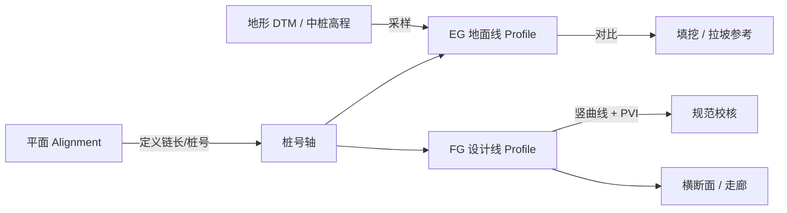

# 044 · 道路设计 · 从平面线位到纵断面 · 市场软件调研

> **代号 `044`**：在已有 **平面路线（Alignment / 导线）** 的前提下，市面主流道路设计软件如何衔接 **地形/地面线**、完成 **纵断面（拉坡 + 竖曲线）** 并进入下游横断面与出图的数据流调研。  
> **关联入口**：[041 · 道路设计 · AI 上下文索引](./041-道路设计-AI上下文索引.md) · [042 · rCs / 标准横断面](./042-道路设计-rCs-AI上下文索引.md) · [03RoadSelect · 四级体系](./03RoadSelect.md) · [07Alignment · 平面线位对标](./07Alignment.md)  
> 完整路径：`doc/RoadDesign/044-道路设计-平面到纵断面-市场软件调研-2026-04-21.md`

---

## 一、文档目的与结论摘要

### 1.1 目的

回答工程与产品两个问题：

1. **数据上**：平面线位确定之后，纵断面设计还需要哪些输入（桩号、地面高程、控制点、结构物约束）？
2. **流程上**：各软件如何把「沿线的地面线 EG」与「设计线 FG」组织在同一套 **桩号/链长** 坐标系下，并完成规范校核与图纸输出？

### 1.2 行业共识（一句话）

**平面线位提供「沿程位置」一维参数（桩号/链长）；纵断面在该参数轴上叠加高程。**  
地面高程来自 **地形模型（DTM/TIN/栅格）或离散中桩高程**；设计线由 **变坡点 PVI + 竖曲线** 构成；EG 与 FG 叠加对比后得到填挖，再驱动横断面与土方。

该共识在 Civil 3D、OpenRoads、国内纬地/鸿业等产品中表述不同，但结构一致，见 [03RoadSelect § 1.1](./03RoadSelect.md#一四级参数化体系) 与 [Civil3D § 1.2](./Civil3D.md#12-profile--纵断面的两面性)。

---

## 二、共通概念与依赖关系

### 2.1 平面线位之后纵断面「还缺什么」

| 输入类别 | 含义 | 典型来源 |
|----------|------|----------|
| **桩号系** | 与平面 Alignment 一致的链长、断链规则 | 平面设计成果（起点桩、断链） |
| **地面高程 EG** | 各桩号处原地面标高 | 地形曲面采样、中桩实测、数字化地形 |
| **竖向控制** | 桥梁、隧道、交叉口、既有管线、防洪等 | 专业互提资料、控制点高程 |
| **设计标准** | 最大纵坡、坡长、竖曲线半径/长度、视距 | 项目规范（CJJ、公路规范等） |

没有 **EG** 或等价信息，只能做「假定地面」或「仅几何竖曲线」，无法得到真实填挖与排水设计。

### 2.2 典型数据流（示意）

### 2.3 「平包竖」与迭代

公路与市政设计均强调 **平面与竖向协调**（俗称「平包竖」）：平面线位上的陡坡、视距不良、合成坡度等问题需在纵断面阶段反复调整。软件上体现为：**Alignment 与 Profile 的联动编辑**（改线位则桩号重算、地面线重采样、设计线需复查）。

---

## 三、分产品/产品线：从平面到纵断的典型步骤

以下按 **公开帮助文档、培训材料与行业实践** 归纳；具体菜单名以各版本为准。

### 3.1 Autodesk Civil 3D（国际市政/公路标杆）

| 维度 | 要点 |
|------|------|
| **对象关系** | `Alignment` 为纵断面父级；纵断面为 `Profile`，挂在某条 Alignment 上。 |
| **EG（地面线）** | 先有 **Surface（地形曲面）**，使用 **Create Profile From Surface** 沿 Alignment 采样，得到 **surface profile**；可设采样范围、采样偏移、动态/静态更新等（参见 Autodesk 帮助：*Create Profile From Surface*、*Create Profile From Surface Dialog Box*）。 |
| **纵断面图** | **Profile View** 为纸面空间中的「纵断面图窗口」，可叠放多条 Profile（多条地面线、不同设计方案）。 |
| **FG（设计线）** | 在 Profile View 中用 **Profile Layout Tools** 布置 **切线 + 竖曲线（通常抛物线）**；支持 **Design Criteria**（XML）实时检查。 |
| **与平面对应** | 同一条 Alignment 上，平面桩号与纵断面水平轴一致；改 Alignment 几何，相关 Profile 与 Profile View 联动更新。 |

**典型顺序**：地形曲面 → 创建 Alignment → **从曲面创建 EG Profile** → 创建 Profile View → **拉坡生成 FG Profile** → 走廊用 FG 作为高程基准。

### 3.2 Bentley OpenRoads Designer（OpenRoads 系列）

| 维度 | 要点 |
|------|------|
| **定位** | 在 DGN 环境中，以 **Horizontal Alignment** 与 **Vertical Geometry** 协同工作。 |
| **EG** | 可将 **地形模型**（Terrain / Mesh 等）上 **Profile From Surface** 或 **Quick Profile From Surface** 得到初始纵断面（参见 Bentley 文档：*Vertical*、*Profile* 相关主题）。 |
| **FG** | **Vertical Geometry** 工具集：常坡度、变坡点、竖曲线组合；支持 **Profile By Constant Elevation**、**By Slope From Point/Element**、**Vertical Offset From Element**、**3D Element** 等多种构造方式，用于复杂边界与衔接。 |
| **复杂竖向** | 可将多段竖向几何组合为 **Complex**，或用 **VPI**、拟合等方式与已有线形协调。 |

**典型顺序**：建立水平线形 → 贴地或参考曲面生成纵断面显示 → 用竖向几何工具逐段定义设计高程 → 与 Corridor / Template 联动。

### 3.3 Autodesk InfraWorks 与 Civil 3D 的衔接

| 维度 | 要点 |
|------|------|
| **阶段** | InfraWorks 偏 **概念/方案** 道路；Civil 3D 偏 **详细设计**。 |
| **数据交换** | 支持 **IMX** 等交换格式，在 Civil 3D 与 InfraWorks 之间传递线位与纵断面；**Centerline Alignment** 与 **Profile** 的实体类型会影响在 InfraWorks 中是否可编辑（仅部分几何类型可逆编辑）。 |
| **设计启示** | 若产品分「方案 / 施工图」两级，需约定 **Profile 实体类型** 与可编辑性，避免往返交换丢几何。 |

### 3.4 纬地道路（HintCAD 等国内公路主流）

| 维度 | 要点 |
|------|------|
| **流程** | 行业培训与教程普遍采用：**项目/导线** → **平面线形设计**（交点、曲线、缓和）→ **设计向导**（路幅、超高、加宽等）→ **数模建立**（等高线/约束 → DTM）→ **纵断面设计**（拉坡、竖曲线、规范检查）→ **横断面** → … → 出图出表。 |
| **与平面关系** | 平面线形文件确定后，纵断面在 **同一项目桩号体系** 下展开；**数模** 提供各桩号地面高程，是纵断拉坡的前提。 |
| **特点** | 强调 **平纵横一体化** 与国内规范内嵌；**平包竖** 在教程中反复出现。 |

### 3.5 鸿业市政道路等（国内市政习惯）

| 维度 | 要点 |
|------|------|
| **流程** | 平面线形（中心线、曲线、缓和）→ 导入或标注 **地面高程**（中桩高程等）→ **拉坡**（控制坡度、坡长）→ **竖曲线** → 与桥隧、排水控制点协调 → **纵断面出图**。 |
| **鸿业式交互** | [HongYeRoad.md § 1.3](./HongYeRoad.md#13-纵断面多控制点拉坡) 所述 **多控制点拉坡**——在纵断面图上用多个控制点驱动设计线，适合市政道路频繁的控制条件。 |

### 3.6 其他国内/专项产品（简述）

| 产品 | 纵断面与平面的关系（概括） |
|------|---------------------------|
| **EICAD** | 同济系公路设计，平面与纵断模块与 **数模、互通立交** 协同紧密；流程上仍遵循 **导线 → 纵断 → 横断** 顺序。 |
| **天正道路** | 偏 **制图与出图**；纵断面多依赖 **地面数据** 与 **设计高程** 输入，在 CAD 侧成图。 |
| **Trimble / Novapoint、12d Model** 等 | 以 **地形 + 线位 + 纵断面** 一体化与土方/排水见长；LandXML 交换常见，见 [LandXML 学习文档](./054-LandXML学习文档-2026-04-20.md)。 |

---

## 四、横向对比表（平面已有 → 纵断完成）

| 维度 | Civil 3D | OpenRoads Designer | 纬地类 | 鸿业市政类 |
|------|----------|-------------------|--------|------------|
| **平面成果** | Alignment 对象 | Horizontal Alignment | 平面线形/导线 | 中心线 + 平面参数 |
| **EG 核心** | Surface 采样 → Surface Profile | Terrain 上采样 / 投影 | 数模 DTM 插值 | 中桩高程 / 地形 |
| **FG 核心** | Layout Profile（PVI + 竖曲线） | Vertical Geometry 工具链 | 竖曲线 + 拉坡 | 多控制点拉坡 + 竖曲线 |
| **纵断图展示** | Profile View | Profile 视图 | 纵断面图 | 纵断面图 |
| **联动** | Alignment–Profile–Corridor 动态 | 与 Corridor / Template 联动 | 平纵横联动 | 图表与实体联动 |

---

## 五、对 HyCADTool 的映射（只读对齐，非规格变更）

本仓库总纲将 **Alignment → Profile → Template → Corridor** 定为四级体系（见 [01MASTER](./01MASTER.md)、[03RoadSelect](./03RoadSelect.md)）。**044 调研结论**与实现侧对应关系可概括为：

| 市场步骤 | HyCADTool 方向（概念） |
|----------|------------------------|
| 平面线位 + 桩号 | `IAlignment`、桩号与几何点（已有平面命令与 [07Alignment](./07Alignment.md)） |
| 地面线 EG | `ProfileKind.ExistingGround`，来自地形采样或导入高程（与 `RoadProfileService` 规划一致） |
| 设计线 FG | `ProfileKind.DesignFinish`，PVI + 竖曲线；UI 可参考 [HongYeRoad.md](./HongYeRoad.md) 多控制点拉坡 + [ProfileEditorWindow.xaml](../../HyCADTool.Refactored/Presentation/Views/Road/ProfileEditorWindow.xaml) |
| 纵断面图 | 图面 `Profile View` 等价物：WPF Canvas → AutoCAD 出图（见 [01MASTER § P1](./01MASTER.md)） |
| 横断面与标准断面 | [042](./042-道路设计-rCs-AI上下文索引.md) 的 `hyRoadCs` / Template 链在 **FG 确定后** 更完整 |

---

## 六、实施建议（产品层面）

1. **先定桩号轴**：纵断面与平面必须共用 **同一套 Alignment 链长**（含断链），否则 EG/FG 无法对齐。  
2. **EG 数据来源明确**：支持「曲面采样」与「离散中桩」两条路径，可覆盖测绘与 BIM 地形两种项目。  
3. **FG 编辑范式**：Civil 3D 式 **PVI + 竖曲线** 与鸿业式 **多控制点** 二选一为主、另一为辅，降低学习成本。  
4. **规范校核时机**：竖曲线与纵坡约束应在 **拖拽 PVI** 时实时反馈（与 [03RoadSelect § 规范](./03RoadSelect.md) 思路一致）。  
5. **交换格式**：长期与 **LandXML** 的 `Profile` / `ProfAlign` 等节点对齐，便于与外部软件互操作（见 [054](./054-LandXML学习文档-2026-04-20.md)）。

---

## 七、参考与延伸阅读

### 7.1 本仓库文档

- [01MASTER.md](./01MASTER.md) — P1 阶段 Profile 交付与命令命名  
- [Civil3D.md](./Civil3D.md) — Profile、EG/FG、走廊关系  
- [HongYeRoad.md](./HongYeRoad.md) — 纵断面多控制点拉坡  
- [HintCAD.md](./HintCAD.md) — 纬地平纵横一体化  
- [OpenRoads.md](./OpenRoads.md) — 纵向几何与模板库  
- [InfraWorks.md](./InfraWorks.md) — 概念设计与数据交换  

### 7.2 外部公开资料（检索用，不保证链接永久有效）

- Autodesk Civil 3D Help：*Create Profile From Surface*、*Creating Alignments, Surface Profiles, and Profile Views*（workflow）  
- Bentley OpenRoads Designer Help：*Vertical*、*Profile*、*Vertical Geometry*  
- Autodesk：Civil 3D 与 InfraWorks 数据交换、IMX 相关说明  

---

## 八、维护说明

- 若各软件版本菜单更名，以厂商官方帮助为准；本文侧重 **逻辑顺序与对象模型**，不绑定某一版 UI。  
- 若 HyCAD 实现 **Profile 服务** 或 **纵断面命令** 有重大变更，请同步更新 **第五节映射表** 与 [041](./041-道路设计-AI上下文索引.md) 的源码索引（若已收录纵断面文件）。
