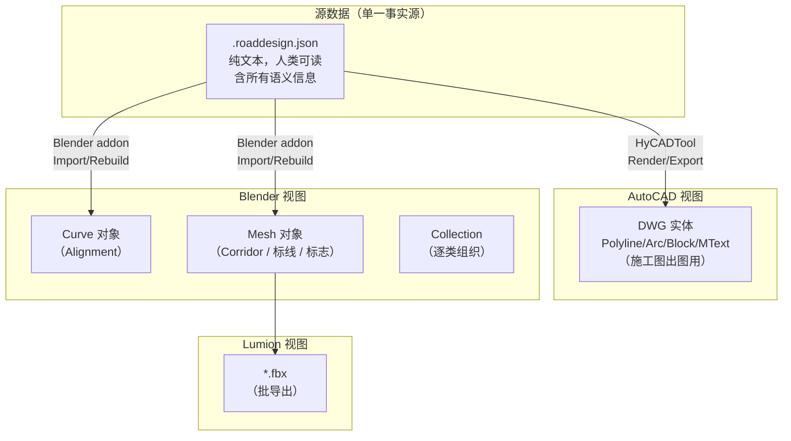
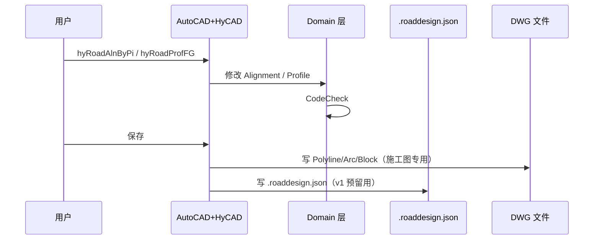
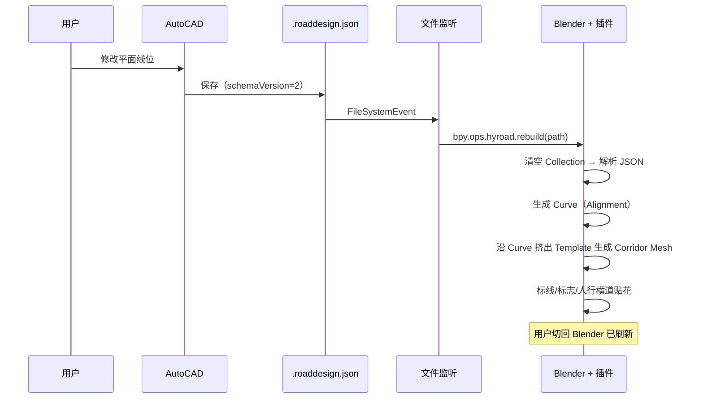
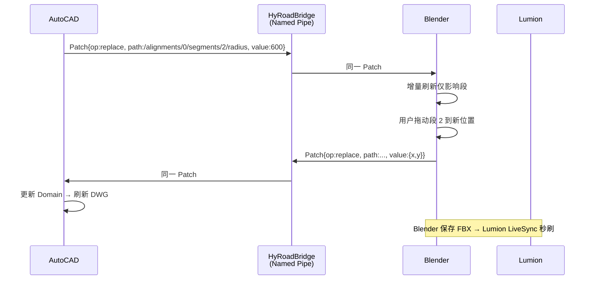
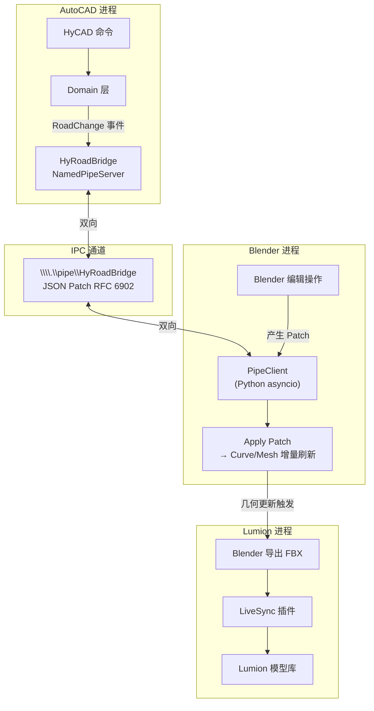

# AutoCAD → Blender → Lumion 数据流水线

> 导航：[README](./README.md) · [01MASTER 总纲](./01MASTER.md) · [02INDEX 总对比](./02Software_Overview_INDEX.md) · [03RoadSelect 选型](./03RoadSelect.md)

> 本文是 HyCAD 道路设计的**工具链专项**，回答三个问题：
> 1. AutoCAD（出图）→ Blender（3D 建模）→ Lumion（渲染）这条路，数据怎么流？
> 2. v1（AutoCAD 出图主场）**必做什么** / **必须预留什么**？
> 3. 未来抛弃 AutoCAD 转 Blender-first 时，我们留好什么底牌？

---

## 零、路线目标（三段演进）

```mermaid
graph LR
    subgraph v1 ["v1：AutoCAD 出图主场（当前）"]
        ACAD1["AutoCAD<br/>平面+纵+横<br/>施工图出图"]
        ACAD1 -.|"烘焙导出"| Glb1[".glb / .fbx<br/>（手动触发）"]
    end

    subgraph v2 ["v2：AutoCAD 主 + Blender 同步"]
        ACAD2["AutoCAD<br/>设计源头"]
        Json2[".roaddesign.json<br/>（单一事实源）"]
        Blender2["Blender<br/>3D 模型"]
        Lumion2["Lumion<br/>渲染"]
        ACAD2 -->|"保存触发"| Json2
        Json2 -->|"文件监听"| Blender2
        Blender2 -->|"FBX 批导出"| Lumion2
    end

    subgraph v3 ["v3：双向实时 + LiveSync"]
        ACAD3["AutoCAD<br/>设计"]
        Server3["HyRoadBridge<br/>（Pipe/HTTP Server）"]
        Blender3["Blender<br/>秒刷"]
        Lumion3["Lumion<br/>LiveSync"]
        ACAD3 <-->|"JSON Patch<br/>RFC 6902"| Server3
        Server3 <-->|"bpy 订阅"| Blender3
        Blender3 -.|"FBX 热更"| Lumion3
    end

    subgraph vinf ["v∞：Blender-first（抛弃 AutoCAD）"]
        Core["HyRoad.Core<br/>（.NET 8 纯 C# 库）"]
        BlenderM["Blender<br/>（bpy 插件<br/>+ Python.NET）"]
        LumionM["Lumion<br/>或 Unreal"]
        Core <--> BlenderM
        BlenderM --> LumionM
    end

    v1 --> v2 --> v3 --> vinf
```

**v1 的唯一任务**：AutoCAD 里把施工图做出来，同时**让 Domain 层完全不依赖 AutoCAD**，给 v2 / v∞ 留路。

---

## 一、工具链架构

### 1.1 三个工具的定位

| 工具 | 负责什么 | 不负责什么 |
|------|----------|------------|
| **AutoCAD**（HyCADTool.Refactored） | 平面线位 / 纵断面 / 横断面 / 标线标志 / 规范校核 / **施工图出图** / 工程量 | 3D 几何精修、材质、灯光、植被 |
| **Blender**（bpy 插件） | 3D 道路模型 / 路面材质 / 路缘石实体 / 标线贴花 / 场景植被 / 周边建筑粗模 | 二维标注、桩号、工程量表 |
| **Lumion** | 最终渲染 / 日照模拟 / 天气 / 汽车行人动画 / 视频输出 | 编辑、设计调整 |

### 1.2 数据层次



**核心原则**：**三个视图都是 `.roaddesign.json` 的投影**。DWG 是最完整的施工图投影，Blender 是 3D 可视化投影，Lumion 是渲染投影。源头永远是 JSON。

---

## 二、数据流四个阶段

### 2.1 v1（当前主攻）：AutoCAD 一条腿走路 + JSON 副本

**特征**：
- 用户在 AutoCAD 里完成全部设计
- 每次 `Save` 时，除了 DWG 外，额外写一份 `项目名.roaddesign.json`
- JSON 仅作为"调试可读版本"——**v1 不读取回用，不被其他工具消费**
- **但 Domain 代码要写得好像这份 JSON 是未来唯一数据源**



**v1 的"预留"**：JSON 写了但不读。写出来的意义是：
1. **可 diff / 可版本化**（Git 友好，比 DWG 强太多）
2. **v2 启动时不必手动迁移数据**——v2 的 Blender 插件直接读
3. **给设计师一个"数据透明"的安心感**

### 2.2 v2（下一阶段）：AutoCAD → Blender 单向同步

**加入**：
- Blender Python 插件 `hy_roaddesign_addon`
- AutoCAD 侧写 JSON 时，**Blender 文件监听**触发重建
- 重建过程：JSON 解析 → 新建/更新 Blender Collection → Curve + Mesh + Material
- 材质用**路面贴图预置**（沥青、水泥、标线白/黄）



**工期估算**：v2 单向同步约 15-20 工作日（见 [01MASTER § 十一](./01MASTER.md#十一产出路线图-p0---p6路线-c-下的七阶段) 新增 P7 阶段）。

### 2.3 v3：双向实时 + Lumion LiveSync

**加入**：
- `HyRoadBridge`（AutoCAD 插件内置 Named Pipe Server）
- 用 **JSON Patch (RFC 6902)** 推增量，而非全量重建
- Blender 能反向"编辑"——例如拖一段 Alignment，Blender 向 AutoCAD 发补丁
- Lumion 通过 **FBX 热导出 + LiveSync** 监听 Blender 的导出目录



### 2.4 v∞：Blender-first（抛弃 AutoCAD）

**状态**：
- AutoCAD 退化为"打开旧 DWG"的工具，或直接停用
- `HyRoad.Core`（.NET 8 纯 C# 库）脱离 AutoCAD 依赖
- Blender 通过 **Python.NET** 或 **IPC** 调用 `HyRoad.Core`
- 施工图出图用独立 WPF 程序或 Web 页面生成 PDF（不再 DWG）

**此时 v1 预留的所有接口都在发挥作用**——这是 v1 最重要的战略价值。

---

## 三、格式选型

### 3.1 总览表

| 格式 | 用途 | AutoCAD→Blender | Blender→Lumion | 可读性 | HyCAD 选择 |
|------|------|:---:|:---:|:---:|:---:|
| **.roaddesign.json** | 语义源头（自定义） | ✅ 直读 | — | ★★★★★ | **主数据源** |
| **glTF 2.0 (.glb)** | 几何烘焙 | ✅ Blender 4.x 原生 | ⚠️ 材质部分丢 | ★★ | v2 视觉几何 |
| **FBX** | 3D 交换 | ✅ | ✅ **Lumion 原生** | ★ | Blender→Lumion 主用 |
| **USD** | 工业级场景 | ⚠️ 重 | ⚠️ | ★★ | v3+ 考虑 |
| **OBJ** | 最简 | ✅ | ✅ | ★★ | 不用（无动画/材质） |
| **DWG** | 施工图 | ❌（Blender 无原生） | ❌ | ★ | AutoCAD 专用 |
| **LandXML** | 公路语义 | ❌ | ❌ | ★★★ | 仅 AutoCAD 侧与他家软件交换 |
| **DXF** | CAD 通用 | △ 低效 | ❌ | ★ | 不用 |
| **IFC 4.3** | BIM | △ 重 | ❌ | ★★ | v3+ 用于 BIM 提交 |

### 3.2 为什么选 glTF 2.0 作为 AutoCAD→Blender 的第一格式

1. **Blender 4.x 原生导入最完美**（比 FBX 更干净，社区维护活跃）
2. **体积小**（二进制 + 压缩）
3. **材质支持 PBR**（Lumion 的 FBX 吃不下 glTF 的全部材质，但 Blender 吃得下）
4. **社区 .NET 库成熟**：[SharpGLTF](https://github.com/vpenades/SharpGLTF)

### 3.3 为什么选 FBX 作为 Blender→Lumion 的唯一格式

1. **Lumion 原生支持 FBX**，其他格式（DAE / OBJ）材质都有坑
2. Blender 4.x FBX Addon 由 Autodesk 维护，往 FBX 方向走是业界惯性
3. FBX 的二进制版（7.x）在 Lumion 里性能最好

### 3.4 `.roaddesign.json` 的 Schema 设计原则

```json
{
  "schemaVersion": "1.0.0",
  "projectId": "6a8d3b1c-...",
  "crs": {
    "epsg": "EPSG:4547",
    "zone": "CGCS2000 / 3° GK Zone 37"
  },
  "alignments": [
    {
      "id": "aln-7b...",
      "name": "主线",
      "startStation": 0,
      "segments": [
        { "kind": "Line", "startPoint": {"x": 100, "y": 200, "z": 0}, "length": 150.0 },
        { "kind": "Curve", "radius": 500, "direction": "CW", "length": 120.0 },
        { "kind": "Spiral", "A": 120.0, "length": 80.0 }
      ]
    }
  ],
  "profiles": [ { "alignmentId": "aln-7b...", "pvis": [...] } ],
  "templates": [ { "id": "tpl-...", "points": [...], "components": [...] } ],
  "corridors": [
    {
      "alignmentId": "aln-7b...",
      "templateAssignments": [
        { "station": 0, "templateId": "tpl-..." }
      ]
    }
  ],
  "markings": [ /* 标线 */ ],
  "signs": [ /* 标志 */ ],
  "visualHints": {
    "pavementMaterial": "asphalt_01",
    "markingColor": "#FFFFFF"
  }
}
```

**设计原则**：
1. 有 `schemaVersion`：v1 为 `1.0.0`，后续扩展不破坏
2. 所有对象有 **稳定 GUID**（AutoCAD ObjectId 换了也不影响）
3. 几何用 **纯数字**（`{x,y,z}` 而不是 AutoCAD 的 `Point3d`）
4. `visualHints` 字段是 **v2 Blender 专用**——v1 只写，不读
5. 坐标系 `crs` 字段明确——为 GIS / LandXML / glTF 几何对齐保驾护航

---

## 四、v1 必做（AutoCAD 平面出图主线）

**范围**：完全覆盖 P0-P5 的所有内容。用户能用 AutoCAD 画出完整的市政道路施工图（平面+纵断面+横断面+标注+说明+土方）。

> 详见 [01MASTER § 十一 P0-P5](./01MASTER.md#十一产出路线图-p0---p6路线-c-下的七阶段)。

**v1 要同时做好的"地基工程"**：

1. **Domain 层零 AutoCAD 依赖**
   - `Domain/Models/Road/*.cs` **禁止 `using Autodesk.AutoCAD.*`**
   - 自有几何 `RoadPoint3d` / `RoadVector3d` / `RoadPolyline3d`（纯 C# struct）
   - Infrastructure 层做双向转换 `RoadPoint3d ↔ Autodesk.AutoCAD.Geometry.Point3d`

2. **双写 DWG + .roaddesign.json**
   - 每次保存 DWG 时同步写 JSON
   - JSON 路径：与 DWG 同名同目录，后缀 `.roaddesign.json`

3. **稳定 GUID 体系**
   - `Alignment.Id` / `Profile.Id` / `Template.Id` 均为 `Guid`
   - DWG 侧通过 Xdata 存 GUID 与 ObjectId 绑定
   - 重启 AutoCAD / reload DWG 后 GUID 不变

4. **事件总线骨架**（可空接口实现）
   - `IRoadEventBus.Publish(RoadChange change)`
   - v1 有一个 NoopImpl 什么也不做
   - v2 加入 `FileWatcherDispatcher` 触发 JSON 重写

**验收标准**：
- [ ] `Domain.Models.Road` 单元测试能脱离 AutoCAD 运行（通过 dotnet test 直接跑）
- [ ] 用户编辑 Alignment 后，JSON 里的 `segments[i].radius` 字段正确更新
- [ ] 关闭 AutoCAD 重新打开，Alignment 的 `Id` 不变

---

## 五、v1 预留点清单（不实现但接口/字段留好）

> 这是本文档的**核心表**——用户可据此判断"哪些代码是 v1 要写的 vs 哪些只是空接口"。

### 5.1 Domain 层预留

| 预留项 | 位置 | 实现方式（v1） | v2 用途 |
|--------|------|----------------|---------|
| `RoadPoint3d` / `RoadVector3d` struct | `Domain/Geometry/*.cs` | **实现**（简单 struct） | 所有几何计算 |
| `RoadPolyline3d` / `RoadMesh` | `Domain/Geometry/*.cs` | **实现**基本操作 | Blender Curve/Mesh 对应 |
| `IRoadChangeEvent` 接口 | `Domain/Events/*.cs` | 接口定义 + Noop 实现 | 触发 JSON 重写 |
| `IRoadEventBus` 事件总线 | `Domain/Events/*.cs` | 接口定义 + Noop 实现 | Blender 同步 |
| `Guid Id { get; }` 属性 | `Domain/Models/Road/*.cs` 各对象 | **实现**（每个对象带 GUID） | JSON 稳定引用 |
| `schemaVersion` 常量 | `Domain/Models/Road/RoadDesign.cs` | **实现**（v1 = "1.0.0"） | v2 识别版本 |

### 5.2 Infrastructure 层预留

| 预留项 | 位置 | 实现方式（v1） | v2 用途 |
|--------|------|----------------|---------|
| `ICorridorMeshBuilder` 接口 | `Domain/Services/*.cs` | 接口定义 + Throw NotImpl | v2 生成 3D Mesh |
| `IThreeDExportPort` 接口 | `Domain/Ports/*.cs` | 接口定义 + Throw NotImpl | glTF/FBX 导出 |
| `ExportRoadDesignJson` 服务 | `Infrastructure/Persistence/Road/*.cs` | **实现**（读写 JSON） | Blender 读源 |
| `RoadDesignFileWatcher` | `Infrastructure/IO/*.cs` | 仅文件预留 | v2 插入真实监听 |
| `HyRoadBridge` Pipe Server | — | **v1 完全不做** | v3 使用 |

### 5.3 JSON Schema 预留字段

| 字段 | v1 是否写 | v1 是否读 | v2 作用 |
|------|:---:|:---:|---------|
| `schemaVersion` | ✅ | ✅（兼容检查） | 版本协商 |
| `projectId` | ✅ | ✅ | 唯一识别 |
| `crs.epsg` | ✅ | ✅ | Blender 导入 GIS 参考系 |
| `alignments[].id` | ✅ | ✅ | 稳定 GUID |
| `alignments[].segments[].kind` | ✅ | ✅ | Blender Curve 类型 |
| `templates[].id` | ✅ | ✅ | Corridor 模板引用 |
| `corridors[].templateAssignments` | ✅ | ✅ | 沿线模板分布 |
| `markings[]` | ✅ | ✅ | Blender 贴花生成源 |
| `signs[].blockName` | ✅ | ✅ | Blender 替换为 3D 标志 |
| `visualHints.pavementMaterial` | ✅（默认值） | ❌（v1 不读） | v2 Blender 材质映射 |
| `visualHints.ambient` | ❌（v1 不写） | — | v3 Lumion 传递环境 |
| `blender.collections` | ❌（v1 不写） | — | v2 Blender 组织结构 |
| `blender.userOverrides` | ❌ | — | v3 Blender 反向修改 |

### 5.4 命令命名空间预留（v1 不实现）

| 命令 | 说明 | 计划阶段 |
|------|------|---------|
| `hyRoad3dExportGltf` | 导出当前设计的 3D Mesh 为 glb | v2 / P7 |
| `hyRoad3dExportFbx` | 导出 FBX（给 Lumion） | v2 / P7 |
| `hyRoad3dBlenderSync` | 一键启动 Blender 同步 | v2 / P7 |
| `hyRoad3dBridgeStart` | 启动 Named Pipe Server | v3 |
| `hyRoad3dLumionLive` | Lumion LiveSync 适配 | v3 |

**v1 做法**：`CommandRegistry` 注册上述命令名，实现只写一行日志 `"命令 xxx 尚未实现（计划 v2）"`——**占位防止未来命名冲突**。

### 5.5 图层 / 块名 → 3D 材质的预映射

在 `_libraries/blender-material-mapping.json`（v1 创建但不用）：

```json
{
  "schemaVersion": "1.0.0",
  "layerToMaterial": {
    "0-road-车行道": { "material": "asphalt_01", "type": "PBR" },
    "0-road-人行道": { "material": "concrete_pavement", "type": "PBR" },
    "0-road-绿化带": { "material": "grass_short", "type": "Procedural" },
    "0-road-标线-实线-白": { "material": "marking_white", "type": "Decal" },
    "0-road-标线-实线-黄": { "material": "marking_yellow", "type": "Decal" }
  },
  "blockToGltfModel": {
    "HY-Sign-指示-直行": "models/signs/sign_go_straight.glb"
  }
}
```

v1 仅创建这份 JSON 模板（空内容也可），**v2 Blender 插件直接读取**。

### 5.6 导出目录约定

每个 `.dwg` 项目的同目录下预留：

```
项目目录/
├── project.dwg                          (v1 主文件)
├── project.roaddesign.json              (v1 写，v2+ 读)
├── _export/                             (v1 创建空目录)
│   ├── gltf/                            (v2 填充)
│   ├── fbx/                             (v2 填充，Lumion 用)
│   └── reports/                         (v1 填充，规范校核报告)
├── _libraries/                          (全局配置缓存)
│   ├── blender-material-mapping.json   (v1 创建，v2 读)
│   └── feature-catalog.json            (v1 创建 + 读)
```

---

## 六、v2 方案：AutoCAD → Blender 单向同步

### 6.1 触发路径

```mermaid
graph LR
    Save["AutoCAD 保存"] -->|"双写 DWG+JSON"| JSON[".roaddesign.json"]
    JSON -->|"FileSystemWatcher"| Addon["Blender Addon<br/>hy_roaddesign"]
    Addon -->|"清 Collection"| Del["删除 Collection 'HyRoad_*'"]
    Del -->|"解析 JSON"| Parse["读 schemaVersion/CRS/Alignments/..."]
    Parse -->|"构建几何"| Build["Curve + Corridor Mesh + 标线贴花"]
    Build -->|"应用材质"| Mat["查 blender-material-mapping.json"]
    Mat -->|"完成"| View["Viewport 自动刷新"]
```



### 6.2 Blender Addon 目录结构

```
hy_roaddesign_addon/
├── __init__.py                          (bl_info + 注册入口)
├── preferences.py                       (JSON 路径 / 自动刷新开关)
├── operators/
│   ├── op_import.py                     (主动导入操作)
│   ├── op_watch.py                      (启停文件监听)
│   └── op_export_fbx.py                 (批导 FBX 给 Lumion)
├── builders/
│   ├── alignment_builder.py             (JSON → bpy.types.Curve)
│   ├── corridor_builder.py              (Alignment + Template → Mesh)
│   ├── marking_builder.py               (标线 Decal)
│   └── sign_builder.py                  (标志 GLB 引用)
├── io/
│   ├── roaddesign_schema.py             (JSON 解析 + 版本检查)
│   └── file_watcher.py                  (watchdog 库监听)
└── libs/
    └── watchdog/                        (打包依赖)
```

### 6.3 C# → Python 的"最小数据契约"

C# 端写出的 JSON 满足下列规则，Python 端就一定能读懂：

1. 所有 GUID 写为标准字符串 `"6a8d3b1c-..."`（不带大括号）
2. 所有数字用 `double`（Python `float`），精度 6 位小数
3. 坐标固定右手系 XYZ（X=东 / Y=北 / Z=高），与 AutoCAD 一致
4. 单位统一 **米**
5. 颜色用 `"#RRGGBB"`，不用 HTML 命名色
6. 所有字段都允许缺失（Python 侧用 `.get(..., default)`）

### 6.4 走廊 Mesh 生成（Blender 侧）

```python
def build_corridor_mesh(alignment_curve, template, assignments):
    """沿 Alignment Curve 每个桩号应用 Template 生成 Mesh。"""
    mesh = bpy.data.meshes.new(f"HyRoad_Corridor_{alignment.id[:8]}")
    verts, faces = [], []
    for station in sample_stations(alignment_curve, step=5.0):
        tpl = interpolate_template(assignments, station)
        center = alignment_curve.evaluate(station)
        normal = alignment_curve.normal_at(station)
        for p in tpl.points:
            v = center + normal * p.offset_x + Vector((0, 0, p.offset_z))
            verts.append(v)
    faces = stitch_faces(len(tpl.points))
    mesh.from_pydata(verts, [], faces)
    mesh.update()
    return mesh
```

### 6.5 已知坑（提前规避）

| 坑 | 原因 | 规避 |
|----|------|------|
| Blender 坐标系 Z-up，某些导入器误导成 Y-up | glTF 导出器偶尔翻 | 统一 glTF `"y_up": false` 属性；Addon 自有 parser 硬编码 Z-up |
| Blender 大坐标精度丢失（超 10 万米） | Blender float32 | 保存时减去项目中心点 `{dx, dy}`，Blender 侧放在 Empty 父对象下偏移 |
| FileSystemWatcher 误触发 | AutoCAD 保存是 "删+新建"二连 | debounce 300ms |
| Blender 批更新 UI 卡顿 | Viewport 每变动刷新一次 | 用 `bpy.data.use_fake_user + defer update` |
| Lumion FBX 不支持 per-face 材质 | Lumion 几何+1材质 | Blender 侧每个材质拆成独立 Mesh |

---

## 七、v3 方案：双向实时 + Lumion LiveSync

### 7.1 HyRoadBridge 架构



### 7.2 JSON Patch 增量示例

```json
[
  { "op": "replace",
    "path": "/alignments/0/segments/2/radius",
    "value": 600 },
  { "op": "add",
    "path": "/markings/-",
    "value": { "id": "mk-9c3d...", "kind": "Crosswalk", "station": 125.0, "width": 3.0 } }
]
```

### 7.3 反向编辑的权限控制

并非所有编辑都允许 Blender 回推 AutoCAD：

| 操作 | Blender → AutoCAD | 原因 |
|------|:---:|------|
| 纯视觉属性（材质 / 灯光 / 摄像机） | ❌ | 属 Blender 职责 |
| Alignment 段的几何位置 | ✅ | 双向有意义 |
| Profile PVI 高程 | ✅ | 双向有意义 |
| Template 形状参数 | ✅ | 双向有意义 |
| 标线位置 | ⚠️ 仅限桩号范围 | 避免破坏施工图 |
| 标志 3D 模型替换 | ❌ | Blender 可视化用 |

### 7.4 Lumion LiveSync 做法

Lumion 没有公开 SDK，只能通过**文件轮询**：

1. Blender 插件每次增量刷新后，**防抖 1 秒**后导出 `_export/fbx/corridor_live.fbx`
2. Lumion 里用 "Import Model" 指向该 FBX，并开启"监听文件变化"
3. 2024+ 版本的 Lumion（LumionAIR）可能支持 API，届时改为直连

---

## 八、v∞：Blender-first（抛弃 AutoCAD）

### 8.1 触发时机

满足以下条件后进入 v∞：
- Blender 插件成熟度足够（v2 + v3 累计 6-12 个月使用数据支持）
- 设计院反馈"Blender 作图"体感不输 AutoCAD
- Lumion LiveSync 或其他 Path Tracing 渲染器稳定
- 施工图出图改为 WPF/Web PDF 方案可行

### 8.2 架构重组

```mermaid
graph TB
    subgraph core ["HyRoad.Core（.NET 8 库）"]
        DomainC["Domain.Road<br/>（无 AutoCAD 依赖）"]
        Algos["几何算法 / 规范校核"]
        JsonIO["JSON 读写"]
        PDF["施工图 PDF 生成<br/>（QuestPDF 或 PdfSharp）"]
    end

    subgraph blender2 ["Blender（主编辑环境）"]
        BlenderAddon["hy_roaddesign_addon 2.0"]
        PyNet["Python.NET 桥"]
        BlenderAddon --> PyNet
        PyNet --> DomainC
        PyNet --> Algos
    end

    subgraph output ["输出"]
        PDFOut["施工图 PDF"]
        FBXOut["渲染 FBX"]
        LandXml["LandXML 交换"]
        IFC["IFC 4.3 Road"]
    end

    DomainC --> JsonIO
    DomainC --> PDF
    PDF --> PDFOut
    BlenderAddon --> FBXOut
    DomainC --> LandXml
    DomainC --> IFC

    AutoCAD_Legacy["AutoCAD<br/>（旧 DWG 打开工具）"] -.|"转为"| DomainC
```

### 8.3 "抛弃 AutoCAD"的判断 Checklist

如果以下条目 80% 满足，可启动 v∞：

- [ ] `.roaddesign.json` 是所有工具链的唯一事实源
- [ ] `HyRoad.Core` 独立 NuGet 包发布
- [ ] Blender 插件功能覆盖 v1 所有 `hyRoad*` 命令
- [ ] 施工图 PDF 生成器通过至少 3 个院 的试用验证
- [ ] 团队有至少 1 个 Blender-first 的试点项目成功交付
- [ ] Python.NET 集成无生产阻塞问题
- [ ] 规范校核全部迁移到 `HyRoad.Core`（脱离 AutoCAD）
- [ ] 客户端 AutoCAD 插件可仅作"DWG 导入工具"存在

---

## 九、C# + Python 交互的三种方式

| 方式 | 实现 | 优点 | 缺点 | HyCAD 用法 |
|------|------|------|------|------------|
| **文件 + 监听** | 双方读写 JSON，watchdog | 解耦彻底、易调试 | 有延迟、不适合高频交互 | **v2 首选** |
| **Named Pipe + JSON Patch** | .NET `NamedPipeServerStream` + Python `pywin32` | 低延迟、双向、跨进程 | 平台依赖 Windows | **v3** |
| **Python.NET 嵌入** | Blender 内嵌 pythonnet，直接 import 托管 DLL | 零序列化开销 | Blender 进程稳定性风险 | **v∞** |

```csharp
// v3 HyRoadBridge 骨架（C# 侧）
public sealed class HyRoadBridgeServer : IDisposable
{
    private readonly NamedPipeServerStream _pipe;
    private readonly IRoadEventBus _events;
    private readonly JsonSerializerOptions _json;

    public HyRoadBridgeServer(IRoadEventBus events)
    {
        _events = events;
        _pipe = new NamedPipeServerStream("HyRoadBridge", PipeDirection.InOut, 1);
        _events.Subscribe<RoadChange>(OnDomainChange);
    }

    public async Task StartAsync(CancellationToken ct) { /* accept + read/write patches */ }

    private async void OnDomainChange(RoadChange change)
    {
        var patch = RoadChangeToJsonPatch.Convert(change);
        await WritePatchAsync(patch);
    }
}
```

```python
# v3 hy_roaddesign_addon / bridge_client.py
import asyncio, json, win32pipe, win32file

class BridgeClient:
    def __init__(self, pipe_name=r"\\.\pipe\HyRoadBridge"):
        self._pipe = win32file.CreateFile(pipe_name, ...)
        self._loop = asyncio.new_event_loop()

    async def listen(self):
        while True:
            raw = await self._read_line()
            patch = json.loads(raw)
            bpy.app.timers.register(lambda: apply_patch(patch))
```

---

## 十、风险与取舍

| 风险 | 概率 | 影响 | 缓解 |
|------|:---:|:---:|------|
| Blender 坐标大偏移精度问题 | 高 | 中 | 项目中心归零 + Empty 父对象偏移 |
| FBX 格式 Lumion 兼容版本 | 中 | 高 | 锁 FBX 7.4 二进制；v2 测试期专项验证 |
| Lumion 无公开 API | 高 | 中 | LiveSync 走文件 + 防抖；长期关注 Lumion AIR |
| Blender 插件跨版本失效 | 中 | 中 | 锁 Blender 4.2 LTS；Addon 严格声明 bl_info |
| Python.NET 与 Blender 3.x / 4.x 的兼容性 | 中 | 高 | v∞ 前实地测试；保留"Blender 外部进程 + IPC"备用路径 |
| 抛弃 AutoCAD 的商业阻力 | 高 | 中 | v∞ 之前长期维持双平台；迁移成本 < 设计院年费 |
| 大项目 JSON 文件过大 | 中 | 中 | 分片持久化（按 Alignment 拆文件）；v3 加二进制 proto 备选 |
| C# 端 Blender 依赖 Python 不可维护 | 低 | 低 | 编写标准化 Schema + 版本 + 规约，Python 端独立测试 |

---

## 十一、v1 启动前的 5 个关键决策（**已确认**，2026-04-17）

工程团队已对以下 5 项决策达成共识，直接记录结果。

### 决策 1：`.roaddesign.json` 的持久化粒度 → **单文件** ✔

| 选项 | 优点 | 缺点 | 选择 |
|------|------|------|:---:|
| **单文件**（一个项目一个 JSON） | 简单、易管理 | 大项目臃肿 | **✓ 已选** |
| 分片（按 Alignment 一个 JSON） | 性能好、并行编辑 | 复杂度高 | — |

**落地要求**：
- 文件名 `<dwgFileName>.roaddesign.json`，与 DWG 同目录
- UTF-8 无 BOM，缩进 2 空格，尾随换行
- 大项目（估计 > 2 MB）在 v2 才考虑分片迁移，届时 `schemaVersion` 升至 `2.0.0` 引导自动转换

### 决策 2：v1 是否实现 glTF 导出 → **不做**（纯 JSON） ✔

| 选项 | 工期 | 理由 | 选择 |
|------|:---:|------|:---:|
| **不做**（纯 JSON） | P5 持平 | v1 聚焦 AutoCAD 出图，Blender 联调推迟到 P7 | **✓ 已选** |
| 做基础 `hyRoad3dExportGltf` | +3d | 备选 | — |

**落地要求**：
- v1 阶段不引入 SharpGLTF 依赖（`HyCADTool.Refactored.csproj` 不加 NuGet）
- `IThreeDExportPort` 保持空接口 + `ThrowNotImpl`
- 命令名 `hyRoad3dExportGltf` / `hyRoad3dBlenderSync` 仅占位 + 日志"v2 实现（P7）"

### 决策 3：事件总线 v1 是否真实实现 → **真实发布订阅** ✔

| 选项 | 工期 | 理由 | 选择 |
|------|:---:|------|:---:|
| 接口 + Noop 实现 | P0 原估 10d | 最小化预留 | — |
| **接口 + 真实发布订阅** | **P0 +2d → 12d** | **v1 就让 RoadChange 真实发布，JSON 重写由事件触发；v2 Blender 插件能直接订阅** | **✓ 已选** |

**落地要求**（影响 P0 工期，总计 v1 从 69d 调整为 71d）：
- `IRoadEventBus` 完整实现：
  ```csharp
  public interface IRoadEventBus
  {
      IDisposable Subscribe<TEvent>(Action<TEvent> handler) where TEvent : IRoadChangeEvent;
      void Publish<TEvent>(TEvent evt) where TEvent : IRoadChangeEvent;
  }
  ```
- **线程安全**：`ConcurrentDictionary<Type, ImmutableList<Delegate>>`，Publish 使用 snapshot 遍历
- **弱引用订阅**（推荐 `WeakReference<>` 包裹 handler）避免内存泄漏
- **v1 必须发布的事件**：
  - `AlignmentAdded` / `AlignmentModified` / `AlignmentRemoved`
  - `ProfileAdded` / `ProfileModified` / `ProfileRemoved`
  - `TemplateAssignmentChanged`
  - `MarkingAdded` / `MarkingModified` / `MarkingRemoved`
  - `SignAdded` / `SignRemoved`
  - `RoadDesignSaved`（整体保存完成）
- **v1 必须订阅的订阅者**：
  - `RoadDesignJsonPersistenceService`：监听上述事件，**防抖 500ms 后写 JSON**（避免一次批量修改触发多次磁盘 I/O）
- **v1 留口给 P7**：Blender Addon 通过文件监听 `.roaddesign.json` 修改时间触发，无需 IPC
- **单元测试**：`EventBusTests.cs` 至少 8 个 case（订阅/退订/多订阅者/异常隔离/线程安全）

### 决策 4：AutoCAD 侧 GUID 存储位置 → **DWG Xdata** ✔

| 选项 | 优点 | 缺点 | 选择 |
|------|------|------|:---:|
| **DWG Xdata** | 最稳定，随 Copy/Mirror 一同复制，不随 ObjectName 漂移 | API 稍复杂 | **✓ 已选** |
| 对象名称编码 | 简单 | 易被用户修改 | — |

**落地要求**：
- `RegAppTableRecord` 名称：`HY_ROAD`（v1 固定）
- Xdata DXF 码约定：
  - `1001` → `HY_ROAD`（应用名）
  - `1000` → 对象种类（如 `Alignment` / `Profile` / `Template`）
  - `1070` → schema 版本号（v1 = `1`）
  - `1000` → GUID 字符串（带标准连字符，不带大括号）
- **GUID 工具类**：`Infrastructure/AutoCAD/Xdata/HyRoadXdata.cs`
  ```csharp
  public static class HyRoadXdata
  {
      public const string AppName = "HY_ROAD";
      public const short SchemaVersion = 1;
      public static Guid? TryRead(ObjectId id);
      public static void Write(ObjectId id, string kind, Guid guid);
      public static void EnsureRegApp(Database db);
  }
  ```
- **启动时自检**：`PluginInitializer` 打开 DWG 后调用 `HyRoadXdata.EnsureRegApp(db)` 注册应用名
- **破损容忍**：Xdata 读失败（老版本 DWG / 手工粘贴）时自动补发新 GUID 并写回

### 决策 5：Blender 插件何时启动 → **v2 启动（P7）** ✔

| 选项 | 时机 | 选择 |
|------|------|:---:|
| v1 同期（P5 并行） | 需额外 Python 人力 | — |
| **v2 启动（P7）** | 集中攻坚，18 工作日 | **✓ 已选** |

**落地要求**：
- P0-P5 阶段**不启动** `hy_roaddesign_addon` 仓库
- P5 验收样例 DWG + `.roaddesign.json` 放入 `Doc/RoadDesign/samples/`，作为 P7 开发的**测试夹具**
- P7 开始前，由团队指定 1 名 Python 开发或自学成员承担

---

### 决策总结表（一眼可查）

| # | 决策项 | 结果 | 工期影响 |
|---|--------|------|:---:|
| 1 | `.roaddesign.json` 粒度 | 单文件 | 0 |
| 2 | v1 glTF 导出 | 不做（纯 JSON） | 0 |
| 3 | 事件总线 | **真实发布订阅** | **P0 +2d** |
| 4 | GUID 存储 | DWG Xdata | 0 |
| 5 | Blender 插件启动 | v2（P7） | 0 |

**v1 总工期从 69d 调整为 71d（约 14.2 周）**。详见 [01MASTER § 十一](./01MASTER.md#十一产出路线图-p0---p7路线-c-下的八阶段) 同步更新。

---

## 十二、与 01MASTER 的映射关系

| 本文章节 | 01MASTER 对应章节 | 关系 |
|----------|------------------|------|
| § 零 路线目标 | [§ 八 实施路线 C](./01MASTER.md#八实施路线-a--b--c三选一由工程师定) | 细化 |
| § 二 数据流四阶段 | [§ 十一 P0-P6](./01MASTER.md#十一产出路线图-p0---p6路线-c-下的七阶段) | 扩展（新增 P7） |
| § 三 格式选型 | [§ 五 交换](./01MASTER.md#五交换exchange-数据如何流入流出) | 扩展 3D 交换 |
| § 四 v1 必做 | [§ 十一 P0-P5](./01MASTER.md#十一产出路线图-p0---p6路线-c-下的七阶段) | 加强"Domain 零依赖"要求 |
| § 五 v1 预留点 | [§ 十一 P0-P5](./01MASTER.md#十一产出路线图-p0---p6路线-c-下的七阶段) | **新增交付物清单** |
| § 十 风险 | [§ 十二 风险](./01MASTER.md#十二风险识别) | 补充 3D 流水线专项 |

---

## 十三、下一步

1. **确认**上述 5 个关键决策（[§ 十一](#十一v1-启动前的-5-个关键决策)）
2. 将 01MASTER § 十一 的 P0 / P2 / P5 交付物**明确分为"核心"与"预留"两栏**（本轮已回填）
3. 创建 `.gitignore` 规则确保 `_export/fbx/` `_export/gltf/` 不入 Git
4. 在 P0 里把"Domain 零 AutoCAD 依赖"作为首要质量门
5. v1 上线后 1 个月内启动 Blender 插件开发调研

---

## 附：参考资料

- [Blender 4.2 Python API](https://docs.blender.org/api/4.2/)
- [glTF 2.0 Specification](https://registry.khronos.org/glTF/specs/2.0/glTF-2.0.html)
- [SharpGLTF（C# glTF 库）](https://github.com/vpenades/SharpGLTF)
- [FBX SDK 概览（Autodesk）](https://aps.autodesk.com/developer/overview/fbx-sdk)
- [JSON Patch RFC 6902](https://datatracker.ietf.org/doc/html/rfc6902)
- [Python.NET](https://pythonnet.github.io/)
- [Lumion 官方 LiveSync](https://support.lumion.com/hc/en-us/articles/360014170933-LiveSync)

---

## 修订记录

| 日期 | 说明 |
|------|------|
| 2026-04-17 | 初稿（v1 必做 + 预留清单 + 三阶段演进） |
