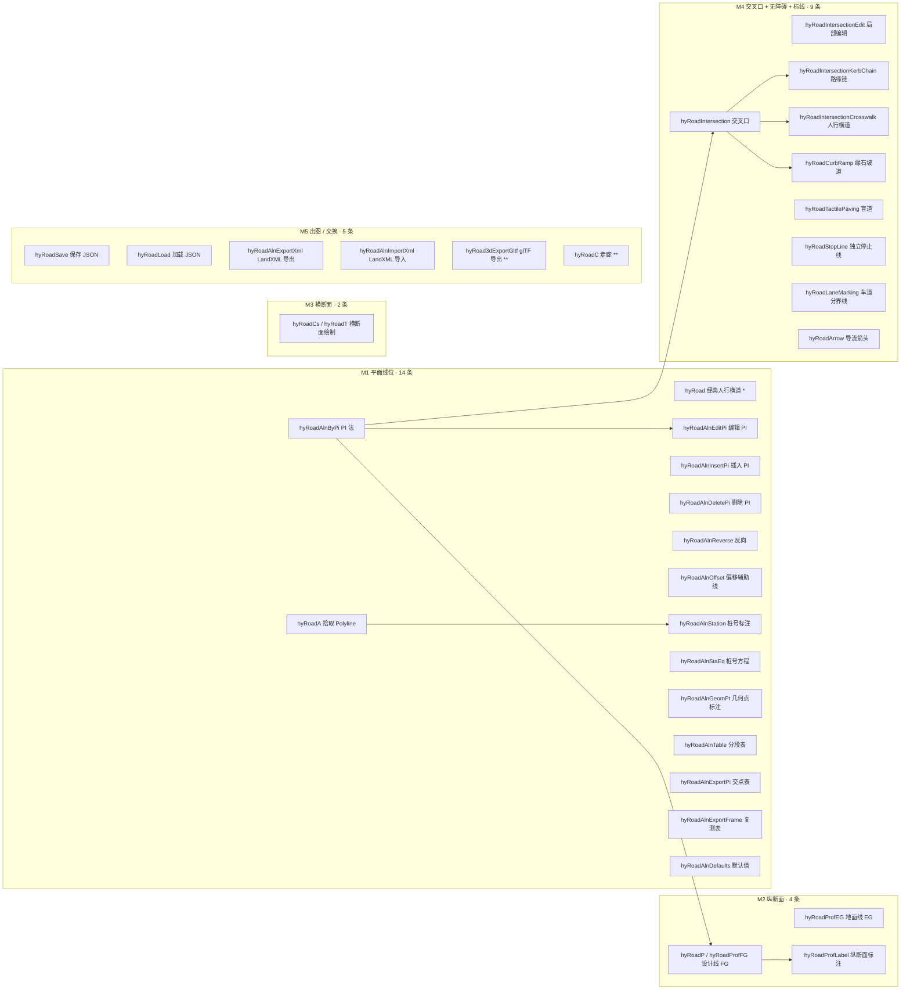
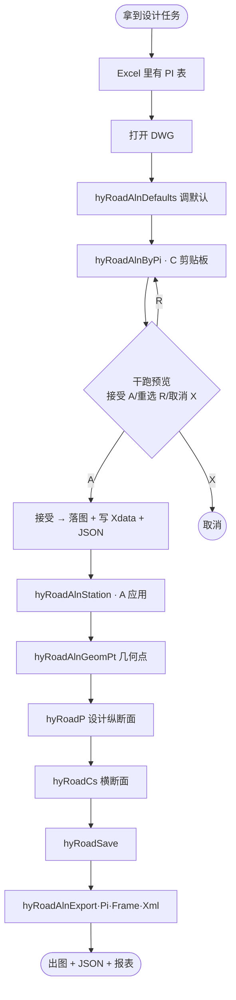
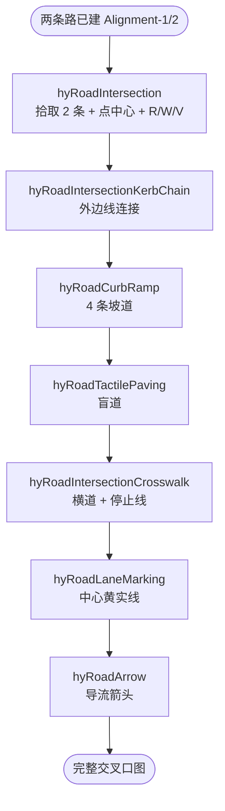

# 052 · 道路设计 · 命令功能与使用流程手册（2026-04-19）

> 文档性质：**用户使用手册** —— 把 `HyCADTool.Refactored` 已实装的全部道路命令按"命令名、功能、交互步骤、典型产出"的四元结构列清，并配合"端到端工作流"说明命令之间的先后顺序。  
> 读者：第一次用 HyCAD 做道路设计的工程师、写回归测试的 QA、做用户培训的人。  
> 对位：[051-当前完成工作](./051-道路设计当前完成工作-2026-04-19.md) 盘点「做到哪」；本书 052 回答「怎么用」。  
> 不重复：具体算法 / Domain 层分层 / 校核表 → 见 [07Alignment.md](./07Alignment.md)、[08Intersection.md](./08Intersection.md)、[09Assembly.md](./09Assembly.md)、[01MASTER.md](./01MASTER.md)。

---

## 0. TL;DR

- **31 个道路命令全部已在 `commands.json` 注册**，绝大部分走 `hyRoad*` 正名；PI 法 + PI 编辑额外保留 `N1 / N2` 占位别名。
- **命令分为 5 大家族**：M1 平面线位（14）/ M2 纵断面（4）/ M3 横断面（2）/ M4 交叉口 + 无障碍 + 标线（9）/ M5 出图交换（5）。
- **两条典型端到端工作流**：
  1. **单条道路全流程（§8.1）**：`hyRoadAlnByPi` → `hyRoadP` → `hyRoadAlnStation` → `hyRoadCs` → `hyRoadSave`，约 5 分钟。
  2. **十字交叉口全流程（§8.2）**：两条 `hyRoadAlnByPi` → `hyRoadIntersection` → `hyRoadCurbRamp` → `hyRoadTactilePaving` → `hyRoadIntersectionCrosswalk` → `hyRoadLaneMarking` → `hyRoadArrow`，约 8 分钟。
- **数据持久化**：所有写命令收尾同步落 `.roaddesign.json`（DWG 同目录）；Domain 对象的身份由 `HY_ROAD` Xdata（`KIND + ID`）与 AutoCAD 实体绑定，SAVEAS 后自动 rebind 不丢数据。

---

## 1. 命令总览

### 1.1 按主线分组（当前 31 条）



> `*` = 经典兼容命令（v1.1 起建议被新的 `hyRoadIntersectionCrosswalk` 取代）；`**` = 骨架 / 占位命令（v1.1 / v2 阶段实装）。

### 1.2 一张表速查

| 序 | 命令 | 分组 | 功能一句话 | 前置 | 幂等 | 落 JSON |
|:-:|---|---|---|---|:-:|:-:|
| 1 | `hyRoad` | M4*兼容 | 经典模式从 Line+Arc 反推绘人行横道 | 任意 | ❌ | ❌ |
| 2 | `hyRoadA` | M1 | 挂 HY_ROAD Xdata 把现有 Polyline 登记为 Alignment | 任意 | ✅ | ✅ |
| 3 | `hyRoadAlnByPi` / `N1` | M1 | PI 法点取 / CSV / 剪贴板三通道建线 + 干跑预览 | 任意 | ❌ | ✅ |
| 4 | `hyRoadAlnEditPi` / `N2` | M1 | 选线位 → 选某个内部 PI → 窗口/命令行改 R / Ls | `hyRoadAlnByPi` | ✅ | ✅ |
| 5 | `hyRoadAlnInsertPi` | M1 | 在选段中点插入新 PI → 整线重建 | `hyRoadAlnByPi` | ✅ | ✅ |
| 6 | `hyRoadAlnDeletePi` | M1 | 删除指定内部 PI → 整线重建 | `hyRoadAlnByPi` | ✅ | ✅ |
| 7 | `hyRoadAlnReverse` | M1 | 整线反向（PI 倒排 + Ls_in/Ls_out 互换 + 桩号方程镜像） | `hyRoadA`/`ByPi` | ✅ | ✅ |
| 8 | `hyRoadAlnOffset` | M1 | 生成左右平行偏移辅助线（挂 OffsetAuxiliary Xdata） | Alignment | ✅ | ✅ |
| 9 | `hyRoadAlnStation` | M1 | 主桩 + 副桩批量出图（三分支：应用/配置/恢复默认） | Alignment | ✅ | — |
| 10 | `hyRoadAlnStaEq` | M1 | 桩号方程（断链），含几何点接近度警告 | Alignment | ✅ | ✅ |
| 11 | `hyRoadAlnGeomPt` | M1 | BP/EP/BC/EC/TS/SC/CS/ST + PI 延伸投影一键标注 | Alignment | ✅ | — |
| 12 | `hyRoadAlnTable` | M1 | Sub-Entity 全表窗（段表 + 几何点表），选段 DWG 高亮 | Alignment | — | — |
| 13 | `hyRoadAlnExportPi` | M1 | 交点表导 CSV（UTF-8 BOM） | Alignment | — | — |
| 14 | `hyRoadAlnExportFrame` | M1 | 复测表导 CSV（UTF-8 BOM） | Alignment | — | — |
| 15 | `hyRoadAlnDefaults` | M1 | 调整默认 R / Ls / StartStation / 主副桩间隔（写 hy-settings.json） | — | — | — |
| 16 | `hyRoadP` / `hyRoadProfFG` | M2 | 设计纵断面（三 Tab：PVI 表 / 4 项规范 / Canvas 预览） | Alignment | ✅ | ✅ |
| 17 | `hyRoadProfEG` | M2 | 拾取 3D Polyline 沿桩号采样 → 存 EG Profile | Alignment | ✅ | ✅ |
| 18 | `hyRoadProfLabel` | M2 | 纵断面网格 + FG + EG + PVI 标注到 DWG | FG 必需 | ✅ | — |
| 19 | `hyRoadCs` / `hyRoadT` | M3 | 横断面绘制（新建 / 加载 / 命令行三分支，9 图层） | — | ✅ | ✅ |
| 20 | `hyRoadIntersection` | M4 | ≥ 2 条 Alignment → 自动生成转角圆弧（CJJ 152 校核） | ≥ 2 条 Alignment | ✅ | ✅ |
| 21 | `hyRoadIntersectionEdit` | M4 | 局部改单弧半径 / 单臂半宽 / 设计速度（非破坏性） | Intersection | ✅ | ✅ |
| 22 | `hyRoadIntersectionKerbChain` | M4 | 切换相邻 CornerArc 之间的路缘外边线直段链 | Intersection | ✅ | ✅ |
| 23 | `hyRoadIntersectionCrosswalk` | M4 | 为每条 Leg 布置人行横道 + 停止线（CJJ 37 §11.3） | Intersection | ✅ | ✅ |
| 24 | `hyRoadCurbRamp` | M4 | 所有 CornerArc 批量布缘石坡道（GB 50763 §3.2） | Intersection | ✅ | ✅ |
| 25 | `hyRoadTactilePaving` | M4 | 提示盲道 + 行进盲道（GB 50763 §3.3） | Intersection | ✅ | ✅ |
| 26 | `hyRoadStopLine` | M4 | 两端点拾取独立停止线（KIND=StandaloneStopLine） | 任意 | — | ✅ |
| 27 | `hyRoadLaneMarking` | M4 | 白实 / 白虚 / 黄实 / 双黄 四型车道分界线 | 任意 | — | ✅ |
| 28 | `hyRoadArrow` | M4 | 直 / 左 / 右 / 直左 / 直右 / 左右 六型导流箭头 | 任意 | — | ✅ |
| 29 | `hyRoadSave` | M5 | 手动把当前 Registry 落盘 | 任意 | — | ✅ |
| 30 | `hyRoadLoad` | M5 | 从 `.roaddesign.json` 载入合并到 Registry | 任意 | — | — |
| 31 | `hyRoadAlnExportXml` / `ImportXml` | M5 | LandXML 1.2 双向互通（Civil 3D / 鸿业兼容） | Alignment | — | ✅ |
| 32 | `hyRoadC` | M5 | 走廊（v1.1 占位，`ICorridorMeshBuilder` 接口预埋） | FG + Alignment | — | — |
| 33 | `hyRoad3dExportGltf` | M5 | glTF 三维导出（v2 占位） | 全量 | — | — |

> 表里「幂等 ✅」= 重复跑不累积图元；「落 JSON ✅」= 命令收尾会同步写 `.roaddesign.json`。

---

## 2. M1 平面线位（Alignment）—— 从建线到出报表

### 2.1 `hyRoadA` —— 拾取既有 Polyline 登记

| 项 | 内容 |
|---|---|
| 用途 | 把图上已画好的 `LWPOLYLINE` 一键挂 `HY_ROAD` Xdata → 进入 Domain Registry，后续命令可按 AlignmentId 追踪 |
| 前置 | 存在一条 2D `Polyline`（含弧段可保留 bulge） |
| 不接受 | `Polyline3d` / `Spline` / `Line+Arc` 集合（有明确修复指引） |

**交互步骤**：

1. 在命令行输入 `hyRoadA`。
2. 提示："选择一条多段线作为平面线位中心线："→ 点中目标 Polyline。
3. 命令立即反馈：`Id=<GUID>，顶点 N 个，含弧段 M 段，平面长度 L.LLL m`。
4. 若检测到视觉弧但所有 `bulge=0`，主动提示两类常见成因（PEDIT→S 样条拟合 / PLINE 未按 A 切弧）+ 修复方法。
5. JSON 已同步落盘提示（若 DWG 还没保存则提示"先 QSAVE / SAVEAS，再跑 hyRoadSave"）。

---

### 2.2 `hyRoadAlnByPi` / `N1` —— PI 表法三通道建线

| 项 | 内容 |
|---|---|
| 用途 | 设计院最常用工作流：拿到 Excel 里的 PI 坐标 + R + Ls → 一键生成完整线位 |
| 输入通道 | **点取(P) / 导入 CSV(F) / 剪贴板(C)** 三选一 |
| 交互亮点 | **干跑预览** → 先在命令行打印 PI 表 + 每段诊断 + 规范状态，再追问接受 / 批量改 R / 取消 |

**交互步骤**：

```
Command: hyRoadAlnByPi
[道路] 选择 PI 输入方式 [点取(P)/导入CSV(F)/剪贴板(C)] <P>: C
[道路] 解析成功：共 5 个 PI。
[道路/预览] PI=5, 圆角=3, 缓和=2, 折线=0, 跳过=0, 平面长度=1235.421 m。
[道路/预览] 诊断（最多 20 条）：
  i   X          Y          turn°    R       Ls     T       状态
  0   0.000      0.000      0.00     0.00    0.00   0.00    圆曲线
  1   300.500    10.250     25.30    200.00  160.00 116.25  直-缓-圆-缓-直
  ...
[道路] 操作 [接受(A)/重选半径(R)/取消(X)] <A>: A
[道路] 导线法生成 Alignment-1：PI 5 个，圆角 3 段，缓和 2 段，折线 0 段，跳过 0 段，顶点 47 个，平面长度 1235.421 m。（输入通道：剪贴板）
[道路] JSON 已同步落盘：E:\proj\XX-Road.roaddesign.json
```

**三种输入通道格式**：

- **P（点取）**：图上首尾 PI 坐标直接点；每个内部 PI 点完坐标后立即追问 `R`、`Ls_in`、`Ls_out`（默认值沿用上一次或 `hy-settings.json` 的默认）。
- **F（CSV）**：列顺序 `x, y [, R, Ls_in, Ls_out, tag]`，列 3-6 可空；支持 UTF-8 / UTF-8 BOM。
- **C（剪贴板）**：与 CSV 同规则，在 STA 线程 3 秒超时读 `System.Windows.Clipboard`，与 Excel 粘贴无缝对接。

**预览循环（Step D）**：

| 输入 | 行为 |
|---|---|
| `A` 或回车 | 接受当前几何，落图 + 写 Xdata + 落盘 |
| `R` | 再提示一个半径值，把所有 `R=0` 的内部 PI 统一改成这个值 → 重新预览 |
| `X` | 放弃 |

---

### 2.3 `hyRoadAlnEditPi` / `N2` —— 编辑单个 PI 参数

**交互步骤**：

1. `hyRoadAlnEditPi` → 拾取 HY_ROAD Alignment。
2. 命令行打印 PI 表（首尾星标 `*` 不可编辑）。
3. 选交互方式 `[窗口(W)/命令行(C)] <窗口>`：
   - **窗口 W**（推荐）：`PiThreeUnitWindow` 三 Tab —— 参数 / 6 项规范检查 / 缓-圆-缓 SVG 示意；边改边在 DWG 上用 **Transient 红色虚线** 预览新几何。
   - **命令行 C**：依次 Prompt 新 R / 新 Ls_in / 新 Ls_out（老脚本友好）。
4. 只改一个 PI 也会**整线重建**（因为每个 PI 的参数会影响前后切线长），重建后给出新顶点数 + 新平面长度 + 规范自检警告。

---

### 2.4 `hyRoadAlnInsertPi` / `hyRoadAlnDeletePi` —— PI 插入 / 删除

**Insert PI 典型场景**：已有 4 个 PI，但中间需要额外加一个转折点避让既有建筑。

```
Command: hyRoadAlnInsertPi
[道路] 拾取要插入 PI 的平面线位：<点中 Polyline>
[道路] 当前 PI 表（共 5 个）：
  idx  X          Y          ...
  ...
[道路] 在哪两个 PI 之间插入？[1..4] <2>: 2   ← 意为 PI[1] 和 PI[2] 中间
[道路] 指定新 PI 坐标：<图上点取>
[道路] 新 PI 半径 R（默认 200）: 150
...
[道路] PI 表已更新（6 个），整线重建完成。
```

**Delete PI 典型场景**：发现某个内部 PI 参数不合理想删掉，让两侧切线段直接相连。

- 同样走拾取 → 列表 → 序号 → 重建。

### 2.5 `hyRoadAlnReverse` —— 整线反向

- **不只是几何倒排**：`PiElements` 倒序、`SpiralIn / SpiralOut` 互换、`StationEquation` 几何镜像（不是清空！）、所有下游标注自动按新桩号方向重排。
- 常用场景：做路线比选时方向选错了；或者路线是从北往南画的，但设计方向应该是从南往北。

### 2.6 `hyRoadAlnOffset` —— 左右平行偏移

| 输入 | 说明 |
|---|---|
| 偏移距离 | 正数 = 左侧，负数 = 右侧；单位 m |
| 内部校核 | `CenterlineOffsetService.ComputeMinCurvatureRadius`：偏移距离必须小于原线最小曲率半径，否则自相交警告 |
| 产出 | 一条新 `Polyline`，挂 `HY_ROAD` Xdata + `KIND=OffsetAuxiliary` + `ParentAlignmentId` → 便于后续批量清理或追溯 |

### 2.7 `hyRoadAlnStation` —— 桩号标注（三分支）

```
Command: hyRoadAlnStation
[道路] 桩号标注 [应用(A)/配置(C)/默认(D)] <应用>: 
```

| 分支 | 行为 |
|---|---|
| **A 应用**（默认） | 读 `hy-settings.json.Road.AlignmentDefaults`；对当前 DWG 所有 Alignment 幂等重建主桩 / 副桩标注 |
| **C 配置** | 弹 `StationLabelConfigWindow`：主桩间隔 / 副桩间隔 / 文字高 / 左右侧 / 沿切线旋转 → 改完落 `hy-settings.json` |
| **D 默认** | 把配置重置回 `RoadStationLabelOptions.Default`（主 20m、副 5m、字高 3m，左侧，沿切线） |

**关键行为**：
- 主桩按**显示桩号**对齐（经 `StationConverter.FromDisplayStation` 映射），桩号方程存在时主桩刻度会"跳变"——比如 K0+500 断链为 K1+000 时，主桩会接着画 K1+020 / K1+040 而不是 K0+520。
- 幂等重建：先按 AlignmentId 清旧标注，再重画，重复跑不会累积图元。

### 2.8 `hyRoadAlnStaEq` —— 桩号方程（断链）

| 场景 | 举例 |
|---|---|
| 长断链 | 老路桩号 K3+523.4 → 市政重新编号为 K4+000.0（增加 476.6 m 虚拟长度） |
| 短断链 | 老路 K2+800 → 市政 K2+600（缩掉 200 m） |
| 反向断链 | 支持 `Ahead` 方向任意跳变 |

**交互步骤**：

1. `hyRoadAlnStaEq` → 拾取 HY_ROAD Alignment。
2. 提示输入 `BeforeRaw`（m，原始距离坐标）+ `AheadDisplay`（`K` 字符串或 m）。
3. 如果 `BeforeRaw` 接近某个 PI / BC / EC / TS / SC / CS / ST，命令会给出接近度警告（默认阈值 2m），建议略微调整避免几何点桩号跳变引起歧义。
4. 落盘后，**所有下游命令**（`hyRoadAlnStation`、`hyRoadAlnGeomPt`、`hyRoadAlnExportFrame`、`hyRoadAlnExportXml`）自动按 `StationConverter` 做 raw→display 双向映射。

### 2.9 `hyRoadAlnGeomPt` —— 几何点标注

一键为当前 DWG 所有 Alignment 绘 9 种几何点：

| 缩写 | 含义 | 绘制内容 |
|---|---|---|
| BP | Begin Point | 起点方块 + 桩号文字 |
| EP | End Point | 终点方块 + 桩号文字 |
| BC/EC | 圆曲线起 / 终点 | 短刻度 + 缩写 + 桩号 |
| TS/ST | 直缓过渡（PI 两端） | 短刻度 + 缩写 + 桩号 |
| SC/CS | 缓圆过渡 | 短刻度 + 缩写 + 桩号 |
| PI | 交点（切线延伸交点） | PI 延长线虚线投影 + 标签 |

- 幂等：按 AlignmentId 清旧重建，不累积。
- 所有桩号走 `StationConverter`，自动兼容桩号方程。

### 2.10 `hyRoadAlnTable` —— Sub-Entity 全表窗

对位 Civil 3D 的 Alignment Entities Vista：

| Tab | 内容 |
|---|---|
| 段表 | idx / 段类型（Line / CircularArc / Spiral） / 起桩 / 终桩 / 长度 / R / Ls / 转角° |
| 几何点表 | idx / 种类 / 显示桩号 / X / Y / 方位角 |

- 双击段表某行 → AutoCAD 视口里把对应段**高亮**（瞬态 Drawable，关窗自动清）。
- 右键菜单可导出当前表到 CSV / TSV。

### 2.11 `hyRoadAlnExportPi` / `hyRoadAlnExportFrame` —— 两个 CSV 报表

| 命令 | 对应国内文档类型 | 列 |
|---|---|---|
| `ExportPi` | 鸿业"交点要素表" / Civil 3D "Alignment Entity Report" | PI 序号 / X / Y / R / Ls_in / Ls_out / T / 转角° / 段长 / Tag |
| `ExportFrame` | 鸿业"路线复测表" / Civil 3D "Reports Manager → Stations" | 桩号（显示） / X / Y / 方位角 / 切线 / 高程（若 FG 存在） / 备注 |

- 两者共用 `AlignmentExportHelper.PickAndExport` 的拾取 + 保存对话框。
- 文件格式：UTF-8 BOM，CSV / TSV 任选；Excel 直接打开不乱码，WPS / LibreOffice 同样。

### 2.12 `hyRoadAlnDefaults` —— 默认值设置窗

对位 Civil 3D 的 **Curve and Spiral Settings** + 鸿业的"设计参数"：

| 字段 | 作用 |
|---|---|
| 默认 R | PI 法点取时，新内部 PI 的初始半径 |
| 默认 Ls_in / Ls_out | 对应的缓和曲线长度 |
| 默认 StartStation | 新建 Alignment 的起始桩号（`K0+000` 或任意） |
| 主桩间隔 / 副桩间隔 | `hyRoadAlnStation` 的缺省间隔 |
| 文字高 / 左右侧 / 沿切线 | 桩号文字视觉配置 |

- 所有字段落 `hy-settings.json.Road.AlignmentDefaults`；改完后下次命令立即生效，无需关 CAD。

---

## 3. M2 纵断面（Profile）—— 设计线闭环 + 地面线 / 标注骨架

### 3.1 `hyRoadP` / `hyRoadProfFG` —— 设计纵断面 FG

**交互步骤**：

1. `hyRoadP` → 拾取 HY_ROAD Alignment。
2. 若该 Alignment 没有设计 Profile：命令提示"新建设计纵断面（默认 v=60 km/h）"。
3. 弹 `ProfileEditorWindow`（BlenderWindow 风格，三 Tab）：

   | Tab | 内容 |
   |---|---|
   | PVI 表 | 序号 / Station / Elevation / R（竖曲线半径，0 = 不设竖曲线）；增 / 删 / 上下移 / 从 CSV 粘 |
   | 4 项规范 | CJJ 37-2012 §6.2.2（最大纵坡）/ §6.2.3（最小纵坡）/ CJJ 193-2012 §4.3.2（凸 / 凹竖曲线最小半径），按 `DesignSpeed` 查表实时校核；✓ ✗ 列表 |
   | Canvas 预览 | WPF Canvas 画 PVI 折线 + 竖曲线段；横向比例 = 10× 纵向（国标标准纵断面） |

4. 右上角修改设计速度（20 / 30 / 40 / 50 / 60 / 80 / 100 km/h），4 项规范立即重算。
5. 确定 → Domain 存 `Profile.IsDesignProfile=true`；JSON 同步落盘。
6. 有任何规范项不通过，"确定"会二次确认（`NonCompliantConfirm`），用户可选择"强制保存"或回编辑。

### 3.2 `hyRoadProfEG` —— 地面线采样

**前置**：图上已有一条 `Polyline3d`（测量成果）或 `Polyline`（只有 2D + 元素的 Z 字段）代表地面线。

**交互步骤**：

1. `hyRoadProfEG` → 拾取 HY_ROAD Alignment。
2. 提示"拾取地面线（≥ 2 顶点）" → 点中 3D Polyline。
3. 提示采样间隔（默认 5 m）。
4. 命令内部调 `EgProfileSampler.Sample`：沿 Alignment 每 5 m 取一个桩号 → 投影到地面线上取 Z → 组合成 `ProfileVertex` 列表。
5. 超出地面线横向覆盖范围（默认 20 m）的桩号会被跳过，命令给出跳过数量 + 最大横向偏移。
6. 成功 → Domain 写 `Profile.IsDesignProfile=false`；JSON 同步落盘。

**提醒**：一条 Alignment 只能有一条 EG，再跑一次会覆盖。

### 3.3 `hyRoadProfLabel` —— 纵断面标注到 DWG

**交互步骤**：

1. `hyRoadProfLabel` → 拾取 HY_ROAD Alignment。
2. 提示"高程方向缩放"（默认 10×，即国标"1:1000 平面 + 1:100 纵断面"的标准比）。
3. 提示"拾取纵断面图原点（左下角）"。
4. 命令自动绘：
   - 网格（主 20m + 副 5m + 高程格）
   - **FG 折线 + 竖曲线段**（绿色实线）
   - **EG 折线**（若存在）（棕色虚线）
   - **PVI 标注**（桩号 / 高程 / 半径 / 坡度 文字）
5. 所有图元落 `05_hy_道路_纵断面` 图层，挂 HY_ROAD Xdata（KIND=ProfileLabel，ID=AlignmentId）可幂等重建。

---

## 4. M3 横断面（Cross Section）—— 标准断面绘制

### 4.1 `hyRoadCs` / `hyRoadT` —— 横断面绘制（三分支）

```
Command: hyRoadCs
[道路] 选择横断面绘制模式 [新建(N)/加载(L)/命令行(C)] <N>: 
```

| 分支 | 行为 |
|---|---|
| **N 新建**（默认） | 启动 `CrossSectionDrawWindow`（BlenderUI workbench 风格，含 Outliner / Toolbar / Canvas / PropertyEditor / StatusBar），默认加载 CJJ 37 "城市主干路" 预设；改完参数 → 插入点 → 出图 + 落 JSON |
| **L 加载** | 从当前 DWG 已存的 `Design.Templates` 列表选一个（序号） → 反序列化成 `CrossSectionLayout` → 弹窗编辑 → 覆盖保存 + 重绘 |
| **C 命令行** | 预设直出，不弹窗。预设 4 种：城市快速路 / 城市主干 / 城市次干 / 城市支路 —— 用于脚本或回归测试 |

**`CrossSectionDrawWindow` 核心字段**：

| 分组 | 字段 |
|---|---|
| 路幅 | 左半宽 / 右半宽 / 机动车道数 / 单车道宽 |
| 人行道 | 左人行道宽 / 右人行道宽 / 是否绿化 |
| 绿化带 | 中分带宽 / 左侧带宽 / 右侧带宽 |
| 路牙 | 立 / 斜 / 无，路牙高 / 顶宽 / 底宽 |
| 路拱 | 直线型 / 抛物线型，横坡度 |
| 边坡 | 填方坡比 / 挖方坡比 |
| 结构层（v2 预留） | 面层 / 基层 / 垫层 厚度 |
| 桩号 | 当前横断面的桩号标签 |
| 出图 | 比例 1:100 / 1:200 / 1:500 |

**9 图层分类落图**：`_轮廓 / _中心线 / _车行道 / _人行道 / _路牙 / _绿化带 / _尺寸链 / _文字 / _图题 / _方位`。

### 4.2 未实装的横断面后续

| 目标 | 状态 |
|---|---|
| `hyRoadTpl` 浏览器面板（像鸿业断面库） | ❌ v1.3 候选 |
| `hyRoadTplApply` 沿线批量戴帽子 | ❌ v1.3 候选 |
| 6 种 CJJ 37 内置模板 JSON | ❌ v1.3 候选 |
| `TemplatePoint / Constraint / Component` Domain | ❌ v1.3 候选 |

---

## 5. M4 交叉口 + 无障碍 + 标线

### 5.1 `hyRoadIntersection` —— 平面交叉口转角圆弧

| 项 | 内容 |
|---|---|
| 前置 | 至少 2 条已挂 HY_ROAD 的 Alignment，且在一个点附近"接近相交" |
| 核心几何 | `IntersectionDesigner.ComputeFromAlignments` 按 CCW 排序 Legs → 逐对相邻 Leg 做转角圆弧 |
| 规范 | CJJ 37-2012 §5.2 + CJJ 152-2010 —— 按设计速度查最小转角半径 |

**交互步骤**：

1. `hyRoadIntersection` → 循环拾取 Alignment（回车结束）。
2. 点取交叉口大致中心点（用于决定每条 Alignment 取起端还是末端）。
3. 输入 `R`（默认 20 m）、`W` 半宽（默认 7.5 m）、`V` 设计速度（默认 30 km/h）。
4. 命令生成 Intersection 聚合（Legs / CornerArcs）→ 挂 HY_ROAD Xdata → 落 JSON。
5. 命令行返回：臂数 / 弧数 / 绘制实体数 / 规范警告条数。

**已知约束（v1.0）**：
- 单轮所有 CornerArc 使用同一半径；要逐 corner 独立半径 → 走 `hyRoadIntersectionEdit`。
- 进口展宽（`ApproachWiden`）未做；未来 P2 Template 阶段补。

### 5.2 `hyRoadIntersectionEdit` —— 交叉口局部编辑

支持三种局部调整（非破坏性，不重新计算整个交叉口几何）：

| 选项 | 操作 |
|---|---|
| **改单弧半径** | 拾取某条 CornerArc → 新 R → 只重算这条弧 |
| **改单臂半宽** | 拾取某条 Leg 外边线 → 新 HalfWidth → 只重算该 Leg 及相邻两条 CornerArc |
| **改设计速度** | 整体改 V，重新做规范校核（不改几何） |

### 5.3 `hyRoadIntersectionKerbChain` —— 路缘外边线直段链

- 连接相邻 CornerArc 的 Leg 外边线直段；在"不想画整条外边线"的情况下，只加转角弧之间的直段连接。
- 切换型命令：再跑一次 = 切换显隐（幂等清旧 + 根据当前 `Intersection.KerbChainEnabled` 标志位决定是否重画）。

### 5.4 `hyRoadIntersectionCrosswalk` —— 基于交叉口聚合的人行横道

**交互步骤**：

1. 拾取目标交叉口任一实体（转角弧 / 坡道 / 盲道 / 路缘线，共用 Intersection.Id）。
2. 命令自动为每条 Leg 生成 `Crosswalk`（基点 = 相邻 CornerArc 切点）。
3. 再次允许用户覆盖 4 个参数：
   - `GapWidth`（路缘到横道的空挡）
   - `Width`（横道宽度）
   - `StopLineDistance`（横道到停止线距离）
   - `StripeSpacing`（条纹中心距）
4. 命令内部调 `RoadCrosswalkService.RebuildCrosswalks` 幂等清旧 + 重绘。
5. 所有横道条纹落 `05_hy_道路_人行横道` 图层，停止线落 `05_hy_道路_停止线` 图层。

> `hyRoad`（经典）在 v0 / v1 阶段保留，用于老图兼容；新工程必走 `hyRoadIntersectionCrosswalk`。

### 5.5 `hyRoadCurbRamp` —— 缘石坡道

对位 GB 50763-2012 §3.2（无障碍设计规范）：

**交互步骤**：

1. 拾取目标交叉口任意 HY_ROAD 图元。
2. 选类型 `[单面(S)/三面(T)/扇形(F)]`（默认单面）。
3. 输入宽度 W（默认 1.5 m，规范下限 1.2 m）、深度 D（默认 1.8 m）、坡度（默认 1:12）。
4. 命令自动在**所有 CornerArc**上批量布坡道 → 落 `05_hy_道路_缘石坡道` 图层。
5. `AccessibilityCodeChecker` 校核宽度 / 坡度，不合规给出警告但不硬停。

### 5.6 `hyRoadTactilePaving` —— 盲道

GB 50763-2012 §3.3：

| 类型 | 用途 |
|---|---|
| **行进盲道**（条纹纹理） | 沿人行道主方向铺设，指示视障人员行进 |
| **提示盲道**（圆点纹理） | 坡道前、路口、障碍物前铺设，警示停下 |

**交互步骤**：

1. 拾取目标交叉口任一 HY_ROAD 图元。
2. 选盲道类型（默认"提示盲道组合坡道前"）。
3. 输入条带宽（默认 0.3 m）、延伸长度（默认 1.5 m）。
4. 命令自动在坡道前 / 人行道外缘生成盲道图元 → 落 `05_hy_道路_盲道` 图层（土黄 42 号色，贴近实际材料）。

### 5.7 `hyRoadStopLine` —— 独立停止线

与交叉口内部的停止线（随 Crosswalk 一起建）区别开：

| 区别 | 交叉口停止线 | 独立停止线（本命令） |
|---|---|---|
| 依附 | 必须有 Intersection | 无依附 |
| KIND | `StopLine` | `StandaloneStopLine` |
| 用途 | 随 Crosswalk 幂等重建 | 无转角圆弧的路段 / 支路出入口 / 小区出入口 |

**交互步骤**：

1. 拾取停止线左端点（车行道左缘）。
2. 拾取停止线右端点（车行道右缘）。
3. 输入线宽（默认 0.40 m，GB 5768-2009 范围 0.20~0.40）。
4. 如果长度 < 3 m 或宽度超范围 → 给警告但仍绘制（体现"软校核"原则）。
5. 落 `05_hy_道路_停止线` 图层，`Polyline + ConstantWidth` 实现。

### 5.8 `hyRoadLaneMarking` —— 车道分界线

GB 5768-2009 §5.1 四型：

| 类型 | 缩写 | 颜色 / 形态 | 典型用途 |
|---|---|---|---|
| **白实线 SolidWhite** | `W` | 白色连续 | 不允许越线（路段分界 / 匝道） |
| **白虚线 DashedWhite** | `D` | 白色虚线 4m 线 + 6m 间隔 | 允许越线（同向车道分隔） |
| **黄实线 SolidYellow** | `Y` | 黄色连续 | 中央分隔（道路中心线） |
| **双黄 DoubleYellow** | `YY` | 黄色双实线，中心间距 0.15m | 重要中央分隔（双向道路中心） |

**交互步骤**：

1. `hyRoadLaneMarking` → 选类型 `[W/D/Y/YY]`（默认 W）。
2. 拾取起点 → 拾取终点。
3. 输入线宽（默认 0.15 m）。
4. 命令自动生成（虚线展开多段；双黄生成两段）→ 落 `05_hy_道路_标线` 图层。

### 5.9 `hyRoadArrow` —— 路面导流箭头

GB 5768-2009 §5.3 六型：

| 类型 | 缩写 | 说明 |
|---|---|---|
| **直行 Straight** | `S` | 单箭头向前 |
| **左转 Left** | `L` | 单箭头 90° 左偏 |
| **右转 Right** | `R` | 单箭头 90° 右偏 |
| **直左 StraightLeft** | `SL` | 双箭头：直 + 左 |
| **直右 StraightRight** | `SR` | 双箭头：直 + 右 |
| **左右 LeftRight** | `LR` | 双箭头：左 + 右（极罕见，专用于准许左右不准直行车道） |

**交互步骤**：

1. 选类型（默认 S 直行）。
2. 拾取箭尾中心点（`ArrowMarking.Anchor`）。
3. 拾取方向参考点（`Anchor → 该点` 方向为箭头朝向）。
4. 输入主长度（默认 6 m，GB 3 / 6 / 9 三档任选）。
5. 命令生成多边形图元集（箭头由 1 个箭尾矩形 + 1~2 个三角形 + 可能的折弯段组成）→ 落 `05_hy_道路_标线` 图层。

---

## 6. M5 出图 / 交换

### 6.1 `hyRoadSave` / `hyRoadLoad` —— 项目级 JSON

| 命令 | 行为 |
|---|---|
| `hyRoadSave` | 把 `RoadDesignRegistry[doc.Name]` 里的 `RoadDesign` 聚合序列化到 `<DWG 目录>\<DWG 名称>.roaddesign.json` |
| `hyRoadLoad` | 反向：从磁盘读 JSON → 合并到 Registry（同 Id 覆盖，新 Id 追加），DWG 端 Polyline 的 HY_ROAD Xdata 会重新 rebind |

- 大多数写命令会自动落盘；`hyRoadSave` 是手动版本（当 DWG 刚刚 SAVEAS 到新路径、想立即让 JSON 跟上时用）。
- `hyRoadLoad` 典型场景：两台电脑协作，A 做平面线位 → 把 `.roaddesign.json` + DWG 一起拷给 B → B 打开 DWG + `hyRoadLoad` 就能接着工作。

### 6.2 `hyRoadAlnExportXml` / `hyRoadAlnImportXml` —— LandXML 1.2

对位 Civil 3D / 鸿业 / OpenRoads 的 LandXML 互通：

| 元素 | HyCAD 导出 | HyCAD 导入 |
|---|:-:|:-:|
| `CoordGeom` Line | ✅ | ✅ |
| `CoordGeom` Curve | ✅ | ✅ |
| `CoordGeom` Spiral（Clothoid） | ✅ | ✅ |
| `StaEquation` | ✅ | ✅ |
| 坐标系 Bearing ↔ Azimuth | ✅ | ✅ |
| Profile（纵断面）（v1 未支持） | ❌ | ❌ |

**导入注意**：LandXML 没有 PI 源信息，导入后 `Alignment.Source = null`，后续无法跑 `hyRoadAlnEditPi` / `hyRoadAlnInsertPi` —— 要编辑的话先用 `hyRoadA` 重新登记 Polyline 再走 `hyRoadAlnByPi` 重建。

### 6.3 `hyRoadC` / `hyRoad3dExportGltf` —— 占位

- `hyRoadC`：走廊 —— 接口 `ICorridorMeshBuilder` 已在 `Domain` 层预埋，v1.1 实装沿桩号每 20m 出横断面 → 生成走廊 3D 线框；v2 做走廊面。
- `hyRoad3dExportGltf`：v2 Blender 联调期接 `IThreeDExportPort`；v1 阶段命令能跑但只输出占位信息。

---

## 7. 通用约定（每个命令都遵守）

1. **拾取优先**：所有写命令先让用户拾取或输入，不靠"隐式全选当前 DWG"；减少误操作。
2. **默认值回车**：所有数字输入都有合理默认，回车 = 接受默认；查表 `hy-settings.json` 的值高于代码常量。
3. **规范软校核**：校核未通过 → 命令行打印警告 + 二次确认，不强制停止（用户在"标准道路"+"非标项目"之间切换时不会被硬阻）。
4. **幂等重建**：所有标注 / 坡道 / 盲道 / 人行横道 / 车道线 / 桩号命令都**先按 AlignmentId / IntersectionId 清旧，再重画**；重复跑不会累积图元。
5. **SAVEAS 自愈**：所有写命令开头调 `svc.RebindForDocument(doc.Name, tr, db)`，DWG 路径换了也能自动把 Registry 重绑到新 key。
6. **事务收尾落盘**：JSON 写盘在 `tr.Commit()` 之后（事务外），避免 I/O 拉长事务生命周期或触发 `eFatalError`。
7. **命令行 + 窗口双模**：凡是参数 ≥ 3 个的命令都提供窗口模式（便于可视化预览）+ 命令行模式（便于脚本批处理）。

---

## 8. 端到端工作流

### 8.1 场景 A：单条次干路 1.2 km，4 PI，V=50 km/h

**任务**：从 Excel 里的 4 PI 坐标 + 标准参数起，到生成平面线位 + 主副桩号 + 纵断面 + 标准断面 + JSON 落盘。

| 步 | 命令 | 参数 | 产出 |
|:-:|---|---|---|
| 0 | `hyRoadAlnDefaults` | 默认 R=300 / Ls=80 / StartStation=K0+000 / 主 20m / 副 5m | `hy-settings.json` 已写 |
| 1 | 打开 Excel，复制 4 行 `x, y, R, Ls_in, Ls_out` | — | 剪贴板就绪 |
| 2 | `hyRoadAlnByPi` → `C`（剪贴板） | 默认 | 打印 PI 表 + 诊断 |
| 3 | `A`（接受） | — | 生成 `Alignment-1`，DWG 画出 Polyline |
| 4 | `hyRoadAlnStation` → `A`（应用） | — | 主桩 62、副桩 247 标注 |
| 5 | `hyRoadAlnGeomPt` | — | BP/EP/BC/EC/TS/SC/CS/ST 标 |
| 6 | `hyRoadP` → 拾取 Alignment | 编辑 PVI 表 + 4 项规范 + Canvas 预览 → 确定 | FG 设计线落盘 |
| 7 | `hyRoadCs` → `N`（新建） | 选 "城市次干路" 预设 → 改参数 → 确定 → 插入点 | 横断面图 9 图层落图 |
| 8 | `hyRoadSave`（可选，多数命令已自动落）| — | `<DWG>.roaddesign.json` 写到 DWG 同目录 |
| 9 | `hyRoadAlnExportPi` + `hyRoadAlnExportFrame` | 选保存路径 | 交点表 + 复测表 CSV |

**估计总时间**：熟练用户 5 分钟；第一次用的工程师 15 分钟（主要花在熟悉纵断面编辑窗口）。

### 8.2 场景 B：十字交叉口全套

**任务**：两条 V=40 km/h 的次干路十字相交，出"转角圆弧 + 缘石坡道 + 盲道 + 人行横道 + 车道线 + 导流箭头"全套。

| 步 | 命令 | 参数 | 产出 |
|:-:|---|---|---|
| 1 | `hyRoadAlnByPi`（East-West 线） → `A` | — | Alignment-1 |
| 2 | `hyRoadAlnByPi`（North-South 线） → `A` | — | Alignment-2 |
| 3 | `hyRoadIntersection` | 选两条 Alignment → 点中心点 → R=20m / W=7.5m / V=40 | 4 条 CornerArc |
| 4 | `hyRoadIntersectionKerbChain` | — | 外边线直段链（4 段） |
| 5 | `hyRoadCurbRamp` → `S`（单面） | W=1.5m / D=1.8m / Slope=1:12 | 4 条坡道 + GB 50763 校核 |
| 6 | `hyRoadTactilePaving` | 条宽 0.3m / 延伸 1.5m | 坡道前盲道 |
| 7 | `hyRoadIntersectionCrosswalk` | Gap=0.3m / W=4m / Stop=2m / Spacing=0.8m | 4 条横道 + 4 条停止线 |
| 8 | `hyRoadLaneMarking`（每条 Leg 画 1 条） | `Y` 黄实线 / 1.5m 线宽 | 中心分隔线 4 条 |
| 9 | `hyRoadArrow`（每条 Leg 画 1 组） | `S` 直行 / L=6m / 各 6 个箭头 | 导流箭头 24 个 |

**估计总时间**：熟练用户 8 分钟；第一次用的工程师 20 分钟。

### 8.3 场景 C：LandXML 互通（与 Civil 3D 协作）

**任务**：Civil 3D 里做好的线位，想导到 HyCAD 出带规范校核的交点表 + 桩号，然后再导回 Civil 3D。

```
Civil 3D → 导出 LandXML (.xml)
   ↓
HyCAD: hyRoadAlnImportXml → 选 xml → 自动生成 Alignment
   ↓
HyCAD: hyRoadAlnStation / hyRoadAlnGeomPt / hyRoadAlnExportPi
   ↓
HyCAD: hyRoadAlnExportXml → 新 xml（含 StaEquation + Spiral）
   ↓
Civil 3D: LandXMLIn 读新 xml
```

**已知约束**：
- HyCAD 导入后 `Alignment.Source = null` → 不能再走 `hyRoadAlnEditPi`。要编辑必须先 `hyRoadA` 重登记 + `hyRoadAlnByPi` 重建。
- 速度字段 LandXML 不存，导入后统一赋 60 km/h，需手动经 `hyRoadAlnDefaults` 或编辑命令调整。
- `Profile`（纵断面）暂不支持 LandXML 互通，v1.3 候选。

---

## 9. 推荐命令顺序（依赖矩阵）

### 9.1 依赖优先级（从上到下）

```
┌────────────────────────────────────────────────────┐
│ L1 源 → hyRoadAlnDefaults （可选，改默认值）        │
├────────────────────────────────────────────────────┤
│ L2 建线 → hyRoadA / hyRoadAlnByPi / hyRoadAlnImportXml │
├────────────────────────────────────────────────────┤
│ L3 编辑 → hyRoadAlnEditPi / InsertPi / DeletePi /  │
│          Reverse / Offset                           │
├────────────────────────────────────────────────────┤
│ L4 桩号 → hyRoadAlnStation / StaEq / GeomPt        │
├────────────────────────────────────────────────────┤
│ L5 纵断 → hyRoadP（FG） → hyRoadProfEG（EG） →     │
│          hyRoadProfLabel（出图）                    │
├────────────────────────────────────────────────────┤
│ L6 交叉口 → hyRoadIntersection                      │
│             ├── hyRoadIntersectionEdit （局部调）   │
│             ├── hyRoadIntersectionKerbChain         │
│             ├── hyRoadCurbRamp                      │
│             ├── hyRoadTactilePaving                 │
│             └── hyRoadIntersectionCrosswalk         │
├────────────────────────────────────────────────────┤
│ L7 标线 → hyRoadLaneMarking / hyRoadArrow /        │
│          hyRoadStopLine （对 Alignment 不强依赖）    │
├────────────────────────────────────────────────────┤
│ L8 横断 → hyRoadCs （独立模块，通常与其他并行）      │
├────────────────────────────────────────────────────┤
│ L9 导出 → hyRoadSave / hyRoadAlnExportPi /         │
│          hyRoadAlnExportFrame / hyRoadAlnExportXml   │
└────────────────────────────────────────────────────┘
```

### 9.2 常见错误与修复

| 现象 | 原因 | 修复 |
|---|---|---|
| `hyRoadAlnEditPi` 报"没有 PI 表快照" | 用 `hyRoadA` 或 `hyRoadAlnImportXml` 建的线 | 先 `hyRoadA` 重登记 → `hyRoadAlnByPi` 重建 |
| `hyRoadAlnStation` 报"没有 Alignment" | 当前 DWG 没跑过建线命令 | 先 `hyRoadA` 或 `hyRoadAlnByPi` |
| `hyRoadIntersection` 报"有效 Alignment 不足" | 拾取的 Polyline 没挂 HY_ROAD | 先 `hyRoadA` 把所有参与的线挂上 |
| `hyRoadP` 打开窗口但规范全红 | 设计速度默认 60 但 PVI 表中有超限纵坡 | 调低 DesignSpeed 或改 PVI 高程 / 半径 |
| `hyRoadCurbRamp` 生成 0 条 | 目标交叉口无 CornerArc（还没跑 `hyRoadIntersection`） | 先 `hyRoadIntersection` |
| `hyRoadAlnOffset` 生成后图形扭曲 | 偏移距离 > 最小曲率半径 | 减小偏移距离或重做 Alignment 增大半径 |
| `.roaddesign.json` 没生成 | DWG 还没 QSAVE（新文档） | 先 `QSAVE` 到任意路径 → 再跑 `hyRoadSave` |
| SAVEAS 到新路径后数据看似"丢了" | Registry 还绑在老 key | 所有写命令开头有 `RebindForDocument`，跑任意一条写命令即自愈 |

---

## 10. 命令 → 图层映射

| 图层 | 颜色 | 用途 | 对应命令 |
|---|:-:|---|---|
| `05_hy_道路_平面线位` | 6 品红 | Alignment 中心线 | `hyRoadA` / `hyRoadAlnByPi` |
| `05_hy_道路_桩号` | 7 白 | 主副桩号文字 | `hyRoadAlnStation` |
| `05_hy_道路_几何点` | 4 青 | BP/EP/BC/EC/TS/SC/CS/ST | `hyRoadAlnGeomPt` |
| `05_hy_道路_偏移线` | 30 橙 | 左右平行辅助 | `hyRoadAlnOffset` |
| `05_hy_道路_纵断面` | 2 黄 | FG / EG / 网格 / PVI | `hyRoadProfLabel` |
| `05_hy_道路_走廊` | 8 灰 | Corridor 3D 线框 | `hyRoadC` |
| `05_hy_道路_标线` | 3 绿 | 车道线 / 箭头 | `hyRoadLaneMarking` / `hyRoadArrow` |
| `05_hy_道路_停止线` | 7 白 | 停止线 | `hyRoadStopLine` / 交叉口内随 `Crosswalk` 生成 |
| `05_hy_道路_交叉口` | 1 红 | 转角圆弧 | `hyRoadIntersection` |
| `05_hy_道路_缘石坡道` | 11 | 坡道 | `hyRoadCurbRamp` |
| `05_hy_道路_盲道` | 42 土黄 | 行进 / 提示盲道 | `hyRoadTactilePaving` |
| `05_hy_道路_人行横道` | 7 白 | 横道条纹 | `hyRoadIntersectionCrosswalk` / `hyRoad`（经典） |
| `05_hy_道路_横断面_轮廓` | 7 | 横断面外轮廓 | `hyRoadCs` |
| `05_hy_道路_横断面_中心线` | 1 | 横断面中心线 | 同上 |
| `05_hy_道路_横断面_车行道` | 5 | 车行道填色 | 同上 |
| `05_hy_道路_横断面_人行道` | 52 | 人行道填色 | 同上 |
| `05_hy_道路_横断面_路牙` | 8 | 路牙 | 同上 |
| `05_hy_道路_横断面_绿化带` | 92 | 绿化带 | 同上 |
| `05_hy_道路_横断面_尺寸链` | 4 | 尺寸链 | 同上 |
| `05_hy_道路_横断面_文字` | 7 | 文字说明 | 同上 |
| `05_hy_道路_横断面_图题` | 3 | 图题 | 同上 |
| `05_hy_道路_横断面_方位` | 6 | 方位标记 | 同上 |

> 所有图层由 `PluginInitializer.GetRequiredLayers()`（经 `HyRoadLayers.GetAll()`）在插件启动时自动创建；命令使用前 `LayerTable.Has(...)` 兜底，若被用户删掉会保留当前图层而不崩溃。

---

## 11. 配置文件 `hy-settings.json` 的道路相关片段

路径：`%APPDATA%\HyCADTool\hy-settings.json`（全局）或项目级 override。

```jsonc
{
  "Road": {
    "AlignmentDefaults": {
      "DefaultRadius": 300,
      "DefaultSpiralIn": 80,
      "DefaultSpiralOut": 80,
      "DefaultStartStation": 0,
      "MainInterval": 20,
      "SubInterval": 5,
      "TextHeight": 3.0,
      "SideIsLeft": true,
      "RotateTextAlongTangent": true
    },
    "RoadGapWidth": 0.3,
    "RoadCrosswalkWidth": 4.0,
    "RoadStopLineDistance": 2.0,
    "RoadStripeSpacing": 0.8
  }
}
```

| 字段 | 影响命令 |
|---|---|
| `AlignmentDefaults.*` | `hyRoadAlnByPi` 的 R/Ls 初始值、`hyRoadAlnStation` 的间隔和文字配置 |
| `Road.RoadGapWidth` 等 | `hyRoadIntersectionCrosswalk` 的 4 参数默认值 |

所有字段都有代码常量兜底（`RoadStationLabelOptions.Default` / `Crosswalk.DefaultXxx` 等），配置文件丢失或字段缺失不会崩。

---

## 12. 使用流程图（mermaid 汇总）

### 12.1 单条道路全流程



### 12.2 十字交叉口全流程



---

## 13. 下一步候选命令（v1.1~v1.3）

参考 [051 §7](./051-道路设计当前完成工作-2026-04-19.md#7-已知待做下一块砖从最小成本排序)：

| 优先级 | 候选命令 | 目标 |
|:-:|---|---|
| 🟢 本周可摘 | 完成 `hyRoadProfEG` / `hyRoadProfLabel` 命令层接线（Domain 已就绪） | EG + Label 真正可用 |
| 🟢 本周可摘 | 为新 4 条命令补 `N21~N24` 别名 | `commands.json` 快速联调 |
| 🟡 本月 | `hyRoadTpl` 断面库浏览器 + `hyRoadTplApply` 批量戴帽子 | 横断面模板化 |
| 🟡 本月 | `hyRoadCheck` 顶层规则引擎（统一校核入口） | 一键跑全量规范 |
| 🔴 中期 | `hyRoadGrid`（禁停网格） + GB 5768 图块库 80+ | 完整标线库 |
| 🔴 中期 | `hyRoadEarthwork`（断面法土方） | v1 土方 |
| 🔴 中期 | `hyRoadAlnPlot` 平面图自动出图（配合图框） | 施工图出图 |
| 🔴 长期 | `hyRoadCorridor` 真实走廊 3D 面 + glTF | v2 Blender 联调 |

---

## 14. 参考资料与相关文档

### 14.1 道路设计专题

- [README.md](./README.md) · 文档目录总览
- [01MASTER.md](./01MASTER.md) · 总设计纲要（P0-P7 路线图）
- [05计划书.md](./05计划书.md) · 总体作战地图（5 主线 / M1-M5）
- [051-道路设计当前完成工作.md](./051-道路设计当前完成工作-2026-04-19.md) · 现状盘点（本书前作）
- [07Alignment.md](./07Alignment.md) · 平面线位对标（Civil 3D / 鸿业 / HyCAD）
- [08Intersection.md](./08Intersection.md) · 交叉口对标
- [09Assembly.md](./09Assembly.md) · 横断面装配对标
- [10Corridor.md](./10Corridor.md) · 走廊对标

### 14.2 涉及的国家 / 行业规范

| 规范号 | 名称 | 本书引用处 |
|---|---|---|
| CJJ 37-2012 | 城市道路工程设计规范 | 平面 / 纵断 / 横断 / 人行横道 / 停止线 |
| CJJ 152-2010 | 城市道路交叉口设计规程 | 交叉口转角圆弧 |
| CJJ 193-2012 | 城市道路路线设计规范 | 凸 / 凹竖曲线最小半径 |
| GB 50763-2012 | 无障碍设计规范 | 缘石坡道 / 盲道 |
| GB 5768-2009 | 道路交通标志和标线 | 车道分界线 / 导流箭头 / 停止线 |

### 14.3 源码入口

| 层 | 目录 | 关键文件 |
|---|---|---|
| Presentation / Commands | `HyCADTool.Refactored/Presentation/Commands/Road/` | 每条命令一个 `*Command.cs` |
| Presentation / ViewModels | `.../Presentation/ViewModels/Road/` | `PiThreeUnitViewModel` / `ProfileEditorViewModel` / `AlignmentTableViewModel` 等 |
| Presentation / Views | `.../Presentation/Views/Road/` | `PiThreeUnitWindow` / `ProfileEditorWindow` / `CrossSectionDrawWindow` 等 |
| Domain / Services | `.../Domain/Services/Road/` | `AlignmentPiDesigner` / `ProfileFgDesigner` / `IntersectionDesigner` 等 |
| Domain / ValueObjects | `.../Domain/ValueObjects/Road/` | `Alignment` / `Profile` / `Intersection` / `Crosswalk` 等 |
| Infrastructure / AutoCAD | `.../Infrastructure/AutoCAD/Services/Road/` | `RoadAlignmentService` / `RoadIntersectionService` / `RoadJsonExportService` 等 |
| Infrastructure / Xdata | `.../Infrastructure/AutoCAD/Xdata/` | `HyRoadXdata` / `HyRoadLayers` |
| 配置 | `ReCall/commands.json` | 31+ 道路命令注册 |

---

**文档性质**：用户使用手册 —— 命令功能 + 交互步骤 + 端到端工作流。  
**更新日期**：2026-04-19。  
**下一次更新触发**：
- 新增命令（如 `hyRoadTpl` / `hyRoadCheck` / `hyRoadAlnPlot` 任一）上线；
- 或现有命令交互改动（如 `hyRoadP` 多 Tab 结构变化）；
- 或依赖矩阵 / 图层映射有新增（如 M3 Template 家族启动后图层增至 30+）。
