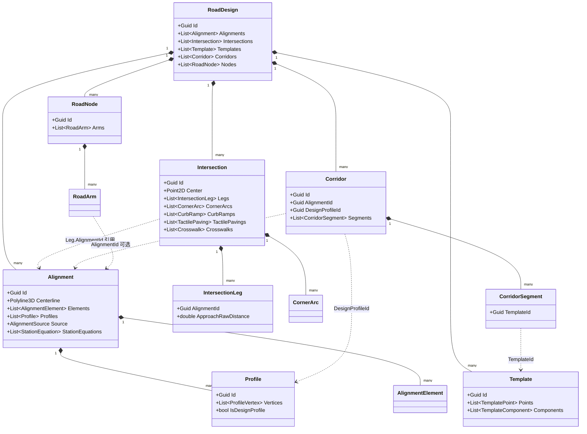
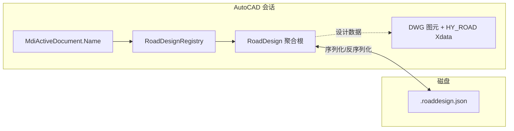

# 053 · 道路设计 · 领域类型关系图（2026-04-20）

> 文档性质：**开发者心智模型** —— 说明 `HyCADTool.Refactored` 道路模块里 **Domain 模型如何组合**、**值对象与聚合根的边界**、**DWG Xdata（`HY_ROAD`）如何把图元绑回领域 ID**。  
> 读者：要读/改道路 JSON、交叉口、纵断面或标线命令的工程师。  
> 对位：[052-道路设计命令功能](./052-道路设计命令功能-2026-04-19.md) 回答「怎么用」；本书 053 回答「类型之间是什么关系」。  
> 不重复：具体算法与对标表仍见 [07Alignment.md](./07Alignment.md)、[08Intersection.md](./08Intersection.md)、[01MASTER.md](./01MASTER.md)。

---

## 0. TL;DR

- **一个 DWG 文档**在内存里对应 **`RoadDesignRegistry[文档名]` → 一个 `RoadDesign` 聚合根**；序列化到同目录 `<DWG 名>.roaddesign.json`。
- **`RoadDesign` 下一级子聚合**主要是五类容器：`Alignments`、`Intersections`、`Templates`、`Corridors`、`Nodes`（旧版交叉口节点）；横断面编辑态另有 **`CrossSectionLayout` ↔ `Template`** 的显式转换，见 `CrossSectionLayoutBuilder`。
- **引用关系习惯**：父子嵌套用 **包含列表**（如 `Alignment.Profiles`）；跨对象用 **`Guid` 外键**（如 `IntersectionLeg.AlignmentId`、`Corridor.AlignmentId`）；**纵断面 `Profile` 不单独写 ParentId**，只挂在父 `Alignment.Profiles` 里。
- **DWG 绑定**：绝大多数可拾取对象写 `HY_ROAD` Xdata，**`ID` = 领域对象 `Guid`**，`KIND` = 字符串标签；交叉口相关附属图元（横道、停止线、坡道、盲道）的 **ID 一律用 `Intersection.Id`**，便于按交叉口幂等清旧。

---

## 1. 聚合根 `RoadDesign`：容器一览

`RoadDesign`（`Domain.Models.Road`）是 **一个道路项目** 在 Domain 中的根对象，包含：

| 成员 | 类型 | 含义 |
|---|---|---|
| `Alignments` | `List<Alignment>` | 平面线位（中心线 + 元素链 + 纵断面列表 + 桩号方程 + PI 源） |
| `Intersections` | `List<Intersection>` | 由 ≥2 条 `Alignment` 驱动的平面交叉口（Legs / CornerArcs / 无障碍 / 横道参数） |
| `Templates` | `List<Template>` | 横断面模板（点链 + 功能段），与 `CrossSectionLayout` 可互转 |
| `Corridors` | `List<Corridor>` | 走廊：引用 `AlignmentId` + `DesignProfileId` + 分段 `TemplateId`（v1 多占位） |
| `Nodes` | `List<RoadNode>` | 旧版 **`hyRoad` 经典人行横道** 用的节点 + `RoadArm` 容器，与新版 `Intersection` **并存** |
| `Id` / `Schema` / `ProjectName` / 时间戳 | 元数据 | JSON Schema 与审计字段 |

**空聚合判断**（不写盘）：`IsEmpty` 当且仅当上述五个列表全空。

---

## 2. 总览类图（Mermaid）

下列关系以 **「包含 / 引用」** 为主，不展开 `Domain.ValueObjects.Geometry`（`Polyline3D`、`Point2D` 等）的细节。

---

## 3. 平面线位 `Alignment`：子结构说明

| 子对象 | 关系 | 说明 |
|---|---|---|
| `Centerline` | 1:1 | `Polyline3D` 采样中心线，直接驱动 DWG `Polyline` |
| `Elements` | 1:N | `AlignmentElement`（直线 / 圆曲线 / 缓和曲线）链，对齐 Civil「Alignment Entity」概念，供表导出与校验 |
| `Profiles` | 1:N | 纵断面；FG/EG 均为 `Profile`，用 `IsDesignProfile` 区分 |
| `Source` | 0:1 | `AlignmentSource`：仅 **PI 法建线/编辑** 时有；`hyRoadA` 拾取、`LandXML` 导入可为 `null` |
| `StationEquations` | 0:N | 桩号方程（断链），与 `StationConverter` 配合 |

**校验**：`Alignment.Validate` / `ValidateContinuity` 为只读自检，不修改状态。

---

## 4. 交叉口 `Intersection`：与 `RoadNode` 的分工

| 维度 | `Intersection`（新） | `RoadNode` + `RoadArm`（旧） |
|---|---|---|
| 典型命令 | `hyRoadIntersection` 族 | 经典 `hyRoad` 人行横道 |
| 几何来源 | 从已登记 **`Alignment`** 端点 + 中心点计算 | 从图上 **Line/Arc** 反推臂 |
| 持久化 | `RoadDesign.Intersections`，JSON 完整 | `RoadDesign.Nodes` |
| 与 `Alignment` | `IntersectionLeg.AlignmentId` **强引用** | `RoadArm.AlignmentId` **可选** |

同一 `RoadDesign` 里两类容器可同时存在；新工程以 `Intersection` 为主线（见 052 §5）。

---

## 5. 横断面：`CrossSectionLayout` 与 `Template`

- **`CrossSectionLayout`**（`Domain.ValueObjects.Road`）：UI / 命令编辑用的 **不可变条带模型**（`CrossSectionBand` 等）。
- **`Template`**（`Domain.Models.Road`）：落入 **`RoadDesign.Templates`** 的 **持久化形态**（`TemplatePoint` + `TemplateComponent`）。
- **转换**：`CrossSectionLayoutBuilder.ToTemplate` / `FromTemplate` / `ToFigure` 负责 **Layout ↔ Template ↔ 绘图指令 `CrossSectionFigure`**。

因此：**JSON 里看到的是 `Template`，不是 `CrossSectionLayout`**；后者是运行期值对象。

---

## 6. 走廊 `Corridor`

- **引用式**：`AlignmentId`、`DesignProfileId` 指向已有对象；`CorridorSegment.TemplateId` 指向 `Template.Id`。
- **v1**：以数据结构与 `ICorridorMeshBuilder` 预埋为主，命令层多为占位（见 052 §6.3）。

---

## 7. `HY_ROAD` Xdata：`KIND` 与 `ID` 语义

RegApp：`HY_ROAD`。键：`ID`（`Guid` 字符串）、`KIND`（类型标签）、`SCHEMA`（版本）。

### 7.1 按「ID 绑谁」分三类心智模型

1. **线位族**：`ID` = **`Alignment.Id`**（中心线、桩号标注、几何点标注、纵断面标注等）。
2. **交叉口族**：`ID` = **`Intersection.Id`**（转角弧、路缘链、横道条纹、交叉口内停止线、坡道、盲道等）。
3. **独立标线族**：`ID` = **值对象自身 `Guid`**（如 `LaneMarking.Id`、`ArrowMarking.Id`、`StopLine.Id`）。当前 **`RoadDesign` 聚合根没有** 车道线 / 导流箭头 / 独立停止线的列表字段 —— 它们 **仅通过 DWG 图元 + Xdata 存在**；`hyRoadSave` 写的 `.roaddesign.json` **不会**带上这些对象（与 052 命令表「落 JSON」列若不一致时，以代码为准）。

### 7.2 常用 `KIND` 常量（Infrastructure 层）

| KIND | 典型图元 | ID 归属 |
|---|---|---|
| `Alignment` | 平面线位 `Polyline` | `Alignment.Id` |
| `StationLabel` | 主/副桩号 | `Alignment.Id` |
| `GeometryPointLabel` | 几何点标注 | `Alignment.Id` |
| `OffsetAuxiliary` | 偏移辅助线 | 父线 `Alignment.Id`（另含业务字段区分） |
| `ProfileLabel` | 纵断面图网格/线/标注 | `Alignment.Id` |
| `Intersection` | 转角 `Arc` | `Intersection.Id` |
| `IntersectionKerb` | 路缘链 `Line` | `Intersection.Id` |
| `Crosswalk` | 横道条纹 | `Intersection.Id` |
| `StopLine` | 交叉口内停止线 | `Intersection.Id` |
| `CurbRamp` | 缘石坡道 | `Intersection.Id` |
| `TactilePaving` | 盲道 | `Intersection.Id` |
| `LaneMarking` | 车道线 | `LaneMarking.Id` |
| `ArrowMarking` | 导流箭头 | `ArrowMarking.Id` |
| `StandaloneStopLine` | 独立停止线 | `StopLine.Id` |
| `CrossSectionStandard` | 标准横断面图 | `Template.Id` |

具体写入点分布在 `RoadAlignmentService`、`RoadIntersectionService`、`RoadCrosswalkService`、`RoadAccessibilityService`、`RoadLaneMarkingService`、`RoadArrowMarkingService`、`RoadStopLineService`、`ProfileLabelDrawService`、`RoadStandardSectionDrawService` 等类中。

---

## 8. 运行时与持久化：`RoadDesignRegistry` 与 JSON

- **Registry**：按 **文档名字符串** 缓存 `RoadDesign`；`GetOrCreate` / `TryGet` / `Replace` / `Rekey`（SAVEAS 迁移）见 `RoadDesignRegistry` 注释。
- **真相源**：业务上以 **Domain 聚合 + JSON** 为主；DWG 为 **可视化与拾取载体**，通过 Xdata 与 `Guid` 对齐。

---

## 9. 分层速查（读代码时按目录跳）

| 层次 | 路径 | 关注点 |
|---|---|---|
| 聚合与实体 | `Domain/Models/Road/` | `RoadDesign`、`Alignment`、`Intersection`、`Profile`、`Template`、`Corridor`、`RoadNode` |
| 道路值对象 | `Domain/ValueObjects/Road/` | `IntersectionLeg`、`CornerArc`、`Crosswalk`、`StationEquation`、标线/盲道 VO 等 |
| 几何值对象 | `Domain/ValueObjects/Geometry/` | `Polyline3D`、`Point2D`、`Point3D`（与 AutoCAD 解耦） |
| 领域服务 | `Domain/Services/Road/` | `*Designer`、`*CodeChecker`、`StationConverter`、`CrossSectionLayoutBuilder` |
| AutoCAD 落地 | `Infrastructure/AutoCAD/Services/Road/` | `Road*Service`、Xdata 写入、幂等清旧重画 |
| 命令入口 | `Presentation/Commands/Road/` | 各 `*Command.cs` |

---

## 10. 与 052 的对应关系（一句话）

- **M1 平面**：操作核心是 **`Alignment`** +（可选）**`AlignmentSource`** + **`StationEquation`**。  
- **M2 纵断**：核心是父 **`Alignment.Profiles`** 内的 **`Profile`** + **`ProfileVertex`**。  
- **M3 横断**：编辑 **`CrossSectionLayout`** → 存 **`Template`** → 画 **`CrossSectionFigure`**。  
- **M4 交叉口与附属**：核心是 **`Intersection`**，通过 **`IntersectionLeg.AlignmentId`** 回到线位；无障碍与横道参数挂在 **`Intersection`** 列表字段上。  
- **M5 交换**：整包 **`RoadDesign`** ↔ JSON / LandXML（线位为主）。

---

## 11. 参考资料

- [052-道路设计命令功能](./052-道路设计命令功能-2026-04-19.md)
- [051-道路设计当前完成工作](./051-道路设计当前完成工作-2026-04-19.md)
- 源码：`Domain/Models/Road/RoadDesign.cs`、`Intersection.cs`、`Alignment.cs`、`Infrastructure/AutoCAD/Xdata/HyRoadXdata.cs`

---

**文档性质**：领域类型关系说明（聚合 / 引用 / Xdata / 持久化）。  
**更新日期**：2026-04-20。  
**下一次更新触发**：新增顶层容器（如顶层 `ArrowMarking` 列表）、`Intersection` 字段增减、或 `HY_ROAD` KIND 增删时同步改 §7。
