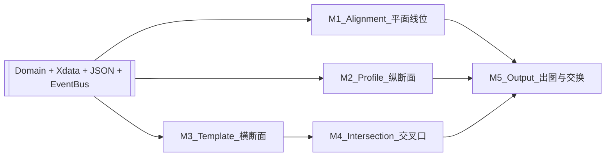

# HyCADTool 市政道路设计 — 05 计划书（总览）

> 导航：[README](./README.md) · [01MASTER 路线图](./01MASTER.md#十一产出路线图-p0---p7路线-c-下的八阶段) · [04Pipeline](./04Pipeline_CAD_Blender_Lumion.md)

> **本书性质**：总体计划 / 作战地图。只写「在哪一站 + 做什么 + 拿到什么就算过关」，**不写具体实现步骤**。实施时每一小节再用 Plan 模式展开成详细施工单。

---

## 零、阅读顺序（固定三步）

1. 看 **§ 一** 的现状坐标：我们当前在哪。
2. 看 **§ 二** 的 5 条主线（平面/纵断/断面/交叉口/出图交换）：每条主线 **已完成** 与 **还差什么**。
3. 需要动手时，直接跳到 **§ 四 任务看板**，挑一个最上面的未完成项进入 Plan 模式展开。

遇到「细节混乱」的时刻，强制回到 **§ 三 不可动的总原则**，再决定要不要继续深挖细节。

---

## 一、现状坐标（2026-04-17）

与 01MASTER 的 P0~P7 阶段对照：

| 01MASTER 阶段 | 覆盖度 | 代码层判定 |
|---------------|:-----:|-----------|
| P0 架构预埋 + 事件总线 + 命令骨架 | **已通** | `RoadDesign*`、`IRoadEventBus`、`HY_ROAD` Xdata、`.roaddesign.json` 已跑通 |
| P1 Alignment + Profile | **75%** | Alignment 主线（`hyRoadA` 拾取 / `hyRoadAlnByPi` 导线法 / `hyRoadAlnStation` 桩号）已可用；Profile 设计线 FG 闭环（B2+B3 完工，4 项 CJJ 规范实时校核 + Canvas 预览 + JSON 持久化）；EG/Label（B1/B4）命令骨架就位待 v1.1 |
| P2 Template + 断面库 | **10%** | 只有空 `Template` 创建；无断面库、无戴帽子 |
| P3 交叉口 + 标线标志 | **5%** | 仅有现成的人行横道 `hyRoad`；无 `IntersectionService` |
| P4 土方 + 校核 + 车辆 | **0%** | 未启动 |
| P5 出图 + LandXML + 验收 | **0%** | 未启动 |
| P6 / P7 | **未启动** | v2 阶段，按计划置后 |

**结论：当前 = 正在 P1 的中后段（Profile 未动）+ P0 收尾巩固。**

---

## 二、五条主线与「下一块砖」

用 5 条并行主线看清全局，避免「今天改 Alignment，明天改面板，感觉都在做又都没推进」。

### M1 平面线位（Alignment）

- **已完成**：`hyRoadA`（拾取 Polyline）、`hyRoadAlnByPi` / `N1`（导线法 + 统一半径 + bulge）、`hyRoadAlnStation`（桩号）、`hyRoadSave` / `hyRoadLoad`、Xdata、Rebind、JSON 同步。
- **下一块砖**：缓和曲线（回旋线）、每 PI 独立半径、夹点编辑 / 一键重建、几何自检 `ValidateContinuity()`。

### M2 纵断面（Profile）

- **已完成**：
  - `Profile`/`ProfileVertex` 领域对象（`DesignSpeed` / `LastModifiedUtc` 字段，JSON 向后兼容）。
  - `ProfileFgDesigner`：纯 C# PVI → 竖曲线（`L = R · |ω|`） + `ElevationAt(station)` + 相邻竖曲线重叠告警 / 桩号倒序错误（13 个单测）。
  - `ProfileCodeChecker`：4 项 CJJ 37-2012 § 6.2.2/6.2.3 + CJJ 193-2012 § 4.3.2（最大/最小纵坡 + 凸/凹竖曲线最小半径），按 `DesignSpeed` 查表（12 个单测）。
  - `RoadProfileService`：`GetOrCreateDesignProfile / ReplaceVertices / Delete`，全部走 `IRoadEventBus.PublishProfileChanged`（11 个单测）。
  - `ProfileEditorViewModel`（25 个单测）+ `ProfileEditorWindow`（BlenderWindow，三 Tab：PVI 表 / 规范 / WPF Canvas 预览）。
  - `hyRoadP` / `hyRoadProfFG`（鸿业别名）= 选 Alignment → 编辑 PVI → ReplaceVertices → JSON 落盘。
  - `hyRoadProfEG` / `hyRoadProfLabel` = 命令骨架（v1.1 实现）。
- **下一块砖**：地面线 EG（从 3D Polyline 沿桩号采 Z）、纵断面 DWG 标注（网格 + 红点 + 半径文字）、纵断面图与 Civil3D `.aecclayer` 对位。

### M3 横断面模板（Template）

- **已完成**：空 `Template` 创建 / 删除。
- **下一块砖**：`TemplatePoint / Constraint / Component` Domain、标准断面库（CJJ 37 快速路 / 主 / 次 / 支）、`hyRoadTplApply`、`hyRoadCross` 批量戴帽子。

### M4 交叉口 + 标线 + 标志

- **已完成**：`hyRoad` 人行横道（旧功能保留）。
- **下一块砖**：`IntersectionService.GenerateCornerArc`、进口展宽、标线（车道分界 / 箭头 / 禁停网格）、GB 5768 图库。

### M5 出图 + LandXML + 校核 + 土方

- **已完成**：`.roaddesign.json` 导出；`hyRoad3dExportGltf` 占位。
- **下一块砖**：施工图平纵横成套出图、LandXML 导入导出、`RoadCodeChecker` 规则引擎、`RoadEarthworkService`（断面法）。

---

## 三、不可动的总原则（遇到混乱时回到这里）

1. **Domain 零 AutoCAD 依赖**：`Domain/**` 禁止 `using Autodesk.AutoCAD.*`。所有几何靠 `Polyline3D` / `Point2D/3D` / `Vector2D` 等中性类型；CAD 交互全部走 `Infrastructure` 层。
2. **数据流单一事实源 = `.roaddesign.json`**：任何写命令必须「事务内改 Domain → 事务外 `RoadJsonExportService.SaveForDocument` 落盘」。
3. **身份绑定 = `HY_ROAD` Xdata GUID**：任何把 AutoCAD 实体和 Domain 对象挂钩的新命令，必须走 `HyRoadXdata` + `ImportFromPolyline`-style 的「Xdata 孤儿兜底」流程，**不要**自己发明 ID。
4. **SAVEAS 兼容**：写命令开头统一走 `RoadAlignmentService.RebindForDocument`，否则文档重命名后会丢数据。
5. **事件总线真实发布**：任何领域数据变动必须经 `IRoadEventBus` 发布；禁止在命令层直接 hack UI 刷新。
6. **命令命名两套并存**：
   - 正名：`hyRoad*`（需改 `CommandFacade.cs`，关 CAD 重 NETLOAD 才生效）；
   - 占位：`N1~N50`（改 `commands.json` 即可，不关 CAD）。先用 N 位测、稳了再升正名。
7. **ReCall 落盘纪律**：`commands.json` 真正起作用的是 **`ReCall\bin\Debug\commands.json`**，源码改完必须随 build 拷贝或手工同步。
8. **规范校核**：必须可禁用、分等级（Warning / Error），不能硬停用户。
9. **图层兜底**：命令使用图层前查 `LayerTable.Has(...)`，不存在时 **保留当前图层**，禁止崩溃。
10. **文档写作纪律**：本目录 `doc/RoadDesign/**` 只做「对标 + 规划 + 现状」，不重复代码注释；详细实现落回源码 XML Doc。

---

## 四、任务看板（Kanban）

> 从上往下做。每一条在真正动工前，用 Plan 模式把它展开为「文件/函数级别」详细子任务。

### 4.1 P1 收口（当前焦点）

- [ ] **A1 Alignment 缓和曲线（回旋线）**：`AlignmentPiDesigner` 增加 `spiralIn / spiralOut` 长度参数，验算最小半径；`ImportFromPolyline` 链路零改动。
- [ ] **A2 每 PI 独立半径 + 缓和曲线参数表**：`hyRoadAlnByPi` 交互升级为「逐 PI 参数」或读 CSV。
- [ ] **A3 Alignment 夹点编辑 / 一键重建**：`hyRoadAlnEdit`。
- [ ] **A4 Alignment 几何自检 `ValidateContinuity()`**：长度、圆顺、桩号单调。
- [ ] **B1 Profile 地面线 EG**：`hyRoadProfEG` 命令骨架就位（v1 占位，回显 v1.1 实现路径：拾取 3D Polyline → 沿桩号采 Z → 生成 `IsDesignProfile=false` 的 Profile）。
- [x] **B2 Profile 设计线 FG**：`hyRoadProfFG`（与 `hyRoadP` 等价别名）—— PVI 表 → `ProfileFgDesigner`（`L=R·ω`、`ElevationAt`、相邻竖曲线重叠告警）→ `RoadProfileService.ReplaceVertices` → JSON 持久化。
- [x] **B3 纵断面窗口**：`ProfileEditorWindow`（BlenderWindow + 三 Tab：PVI 表 / 4 项规范 / WPF Canvas 预览），ViewModel 不依赖 WPF 类型（`RenderSegments` 数据结构），4 项 CJJ 37/193 规范实时校核。
- [ ] **B4 Profile 桩号标高 `hyRoadProfLabel`**：命令骨架就位（v1 占位，回显 v1.1 实现路径：网格 + FG/EG + PVI 标注到 DWG，`ROAD-PROFILE-*` 图层）。

### 4.2 P2 启动

- [ ] **T1** `TemplatePoint / Constraint / Component` Domain。
- [ ] **T2** `TemplateLibrary` + 6 种 CJJ 37 内置断面 JSON。
- [ ] **T3** `hyRoadTpl`（浏览器面板） + `hyRoadTplApply`。
- [ ] **T4** `hyRoadCross` 批量戴帽子（20m 一张）。

### 4.3 P3 预热

- [ ] **I1** `IntersectionService.GenerateCornerArc`。
- [ ] **I2** 标线三件套：`hyRoadLane / Arrow / Grid`。
- [ ] **I3** GB 5768 图库初始 80+ 图块。

### 4.4 P4 / P5 / P6 / P7

- 暂不拆卡；保留 01MASTER 的总工期估算（**v1 合计 ≈ 71 工作日**）。

---

## 五、节奏与节点（单人 / 小团队版）

| 节点 | 目标 | 完成标志 |
|------|------|---------|
| **节点 A（近 1-2 周）** | **P1 Alignment 闭环** | A1 + A4 完工；`hyRoadAlnByPi` 支持缓和曲线；全部单元测试绿灯 |
| **节点 B（2-4 周）** | **Profile 最小可用** | B1 + B2 可画出 EG+FG；纵断面窗口能看；JSON 持久化 |
| **节点 C（4-6 周）** | **Template + 批量戴帽子** | 6 种断面库 + `hyRoadCross` 一键出图 |
| **节点 D（6-10 周）** | **交叉口 + 标线图库** | `IntersectionService` 首发 + 车道线/箭头/禁停网格 |
| **节点 E（10-14 周）** | **出图 + LandXML + 校核 + 土方** | v1 验收集装箱 |

> 每个节点收尾前，回 **§ 三** 做一次原则合规性自检（Domain 纯净、JSON 同步、SAVEAS 重绑定、事件总线发布、规范可禁用等）。

---

## 六、风险清单（按发生概率排序）

1. **`bin\Debug\commands.json` 与源码不同步** → `N?` / `hyRoad*` 看起来挂了。每次改完 JSON 记得 build 或手工覆盖输出目录。
2. **SAVEAS 后 Registry key 漂移** → 数据像「丢了」。所有写命令必须 `RebindForDocument`。
3. **Domain 层偷偷 `using Autodesk.AutoCAD.*`** → Blender-first 迁移被卡。P5 前做一次 Domain 纯净审计。
4. **命令耦合面板 VM 状态** → 测试难。命令只能走 `ServiceLocator.Resolve<*Service>()`，不读 VM。
5. **规范校核硬停** → 用户体验爆炸。规则必须分等级 + 可禁用。
6. **性能**：大量 Alignment / 桩号标注时 AutoCAD 卡顿。批量操作走事务外；标注走幂等重建，不累积图元。

---

## 七、下一步动作（立即可做）

- **今天 / 明天**：把 **A1（缓和曲线）** 和 **A4（`ValidateContinuity`）** 切成两个 Plan 模式子任务分别展开。
- **本周内**：B2/B3 已闭环，启动 **B1（EG 地面线）** 的实现（已选定方案：拾取 3D Polyline + 沿桩号采 Z）。
- **本月内**：T1+T2 起步，让 P2 能开跑。

遇到新需求，先问「属于 M1~M5 哪条？卡在哪一块砖？是否违反 § 三？」——这个循环能把「细节混乱」挡在外面。

---

**文档性质**：总体计划书，**定方向、定节奏、定红线**。细节不在此。  
**更新日期**：2026-04-19（P1 Profile B2/B3 闭环；B1/B4 命令骨架就位）
