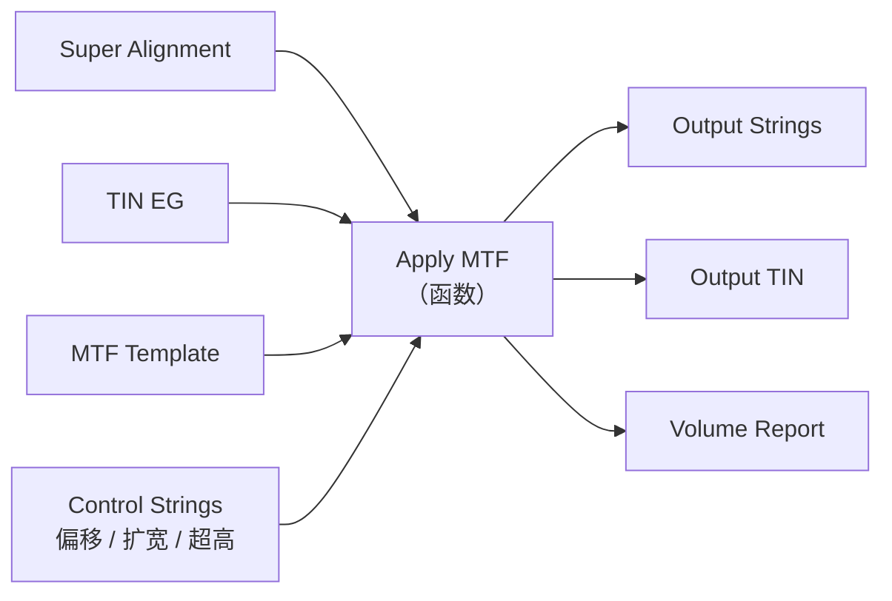

# 12d Model 分析：借鉴与超越

> 导航：[README](./README.md) · [01MASTER 总纲](./01MASTER.md) · [02INDEX 总对比](./02Software_Overview_INDEX.md) · [03RoadSelect 选型](./03RoadSelect.md)

12d Model 是澳大利亚 12d Solutions 的土木一体化设计软件，在澳洲/东南亚市场占有率极高。与 Civil 3D / OpenRoads 不同，它走"**字符串（String）+ Apply 函数**"的函数式数据流范式，Apply MTF Manager 被誉为"设计师自己写程序"。对 HyCAD 的启发在于**轻量数据模型 + 函数式变换**，这是参数化走廊的另一条实现路线。

---

## 一、值得借鉴的 12d Model 核心设计理念

### 1.1 String — 万物皆字符串

12d Model 的根数据类型是 **String（字符串）**，但这里的 String 不是文本字符串，而是**有类型的折线**：

| String 类型 | 本质 | 用途 |
|-------------|------|------|
| **2d String** | 纯平面多段线 | 图块 / 标注 |
| **3d String** | 带 Z 的折线 | 路缘石顶线 / 等高线 |
| **4d String** | 带时间维度 | 进度模拟 / 动画 |
| **Super String** | 有属性 + 参数化定义 | 道路中心线 / 基准线 |
| **Alignment String** | 有桩号系统的 3d String | 同 Civil 3D Alignment |
| **Interface String** | 不同介质交界 | 路面与土基的分界线 |
| **Pipe String** | 管道（有直径 / 材质） | 给排水管 |
| **Text String** | 带位置的文字 | 标注 |

**TIN（三角网曲面）**：是 String 的衍生对象——由 3d Strings 围合 / 点云生成。

**关键哲学**：**所有东西都是 String，没有"对象 vs 多段线"的二分**。这让数据模型极其轻量：一个道路设计就是"一堆有类型的 String"。

**映射到 HyTool**：

```csharp
public interface IRoadString
{
    string Id { get; }
    RoadStringKind Kind { get; }
    IReadOnlyList<Point3d> Vertices { get; }
    IReadOnlyDictionary<string, object> Attributes { get; }
}

public enum RoadStringKind
{
    Alignment,      // 中心线（带桩号）
    FeatureLine,    // 特征线（带 Z）
    EdgeOfPavement, // 路面边线
    CurbTop,        // 路缘石顶线
    Interface,      // 交界线
    Pipe,           // 管线
    Text,           // 文字
    Planar2d        // 纯 2D 辅助线
}
```

### 1.2 Model — 数据容器

12d Model 的 **Model** 不是"建筑模型"而是"数据组"：

```
Project
├── Model "地形"
│    ├── String "contour_100m"
│    ├── String "contour_101m"
│    └── TIN "EG_Surface"
├── Model "道路-K 路"
│    ├── Super Alignment "K路_CL"
│    ├── String "K路_edge_L"
│    ├── String "K路_edge_R"
│    └── TIN "K路_Pavement"
└── Model "管线"
     ├── Pipe String "雨水干管"
     └── Pipe String "污水干管"
```

Model **像文件夹**，但可以批量开关显示、批量过滤。

**HyTool 借鉴**：AutoCAD 的 Layer 天然对应 Model，但 Layer 只有"显示开关 + 颜色"。可以引入**语义分组**：

```csharp
public sealed class RoadModelGroup
{
    public string Name { get; }                    // "道路-K 路"
    public IReadOnlyList<IRoadString> Members { get; }
    public IReadOnlyList<string> AutoCADLayers { get; }   // 关联图层
    public GroupVisibility Visibility { get; }     // Shown / Hidden / Muted
}
```

### 1.3 Apply MTF — 函数式的走廊生成

12d Model 生成道路走廊的核心是 **Apply MTF（Apply Macro Template File）**，这是一个**函数**：

```
Apply MTF:
  Inputs:
    - Super Alignment (中心线)
    - TIN (地形曲面)
    - Template (MTF 模板文件)
    - Control Strings (控制字符串，如边线 / 偏移 / 扩宽)
  Output:
    - Road Design Strings (边线 / 顶线 / 底线 / 边坡线)
    - Pavement TIN
    - Optional: Volume Report
```



**价值**：

1. **函数幂等**：同样的输入同样的输出；输入变化自动重算
2. **可组合**：一个 Apply 的输出可以作为另一个 Apply 的输入
3. **控制字符串**：这是 12d 的灵魂——"想要某段路加宽？放一条 Control String，Apply 自动响应"

### 1.4 Control Strings — 变化的驱动器

Control String 是 12d 与 Civil 3D Target 的对比：都是"外部对象控制部件参数"，但 12d 更彻底：

| 控制类型 | 含义 |
|----------|------|
| **Width Control** | 沿线变化的车道宽度（一条 3D String，水平偏距 = 车道宽度） |
| **Offset Control** | 边线偏移（相对中心线的水平偏距） |
| **Level Control** | 标高控制（某点必须通过某标高） |
| **Super Control** | 超高过渡 |
| **Cut/Fill Control** | 强制填挖范围 |

**映射**：

```csharp
public interface IRoadControl
{
    ControlKind Kind { get; }
    IRoadString ControlString { get; }    // 控制字符串本身就是一个 3d String
    Station Start { get; }
    Station End { get; }
}

public enum ControlKind { Width, Offset, Level, Super, CutFill }
```

### 1.5 String Modifiers — 字符串的声明式变换

对一条 String 做"偏移 / 平滑 / 简化 / 投影到 TIN"这类操作，12d 用 **String Modifiers**（声明式）：

```
String "curb_top":
  Modifiers:
    1. Offset from "CL" by 7.0m horizontally
    2. Project vertically to "EG_Surface"
    3. Add level offset +0.15m (路缘石高)
```

**HyTool 借鉴**：类似 Rhino Grasshopper 的 DAG——一条 String 的**几何定义**可以是"上游对象 + 一串变换"：

```csharp
public abstract record StringModifier
{
    public sealed record HorizontalOffset(double Distance) : StringModifier;
    public sealed record VerticalProject(string SurfaceName) : StringModifier;
    public sealed record LevelOffset(double Delta) : StringModifier;
    public sealed record Smooth(double Factor) : StringModifier;
    public sealed record Simplify(double Tolerance) : StringModifier;
}

public sealed class DerivedRoadString : IRoadString
{
    public IRoadString Source { get; }
    public IReadOnlyList<StringModifier> Modifiers { get; }
    public IReadOnlyList<Point3d> Vertices => EvaluateChain();
}
```

### 1.6 TIN — 三角网曲面

12d 的 TIN 构建：

- 从点群 / 3d Strings 生成
- 支持 **Breakline**（硬线）——保证三角形边与折线对齐
- 支持 **Null Edge**（空洞）
- 可从 Apply MTF 输出（道路路面 TIN）
- 可做 **TIN subtract** 土方计算

**映射**（v2+）：

```csharp
public interface IRoadTin
{
    IReadOnlyList<Triangle3d> Triangles { get; }
    double ElevationAt(double x, double y);
    IRoadTin Subtract(IRoadTin other);        // 土方差
    VolumeReport ComputeVolume(Polygon2d boundary);
}
```

### 1.7 12da 文件格式

12d 的文件格式 `.12da` 是**文本格式**（类似 JSON 前身），人类可读、可 diff、可编辑。

**HyTool 借鉴**：`.roaddesign` 用 **JSON / JSON5**（支持注释），可 diff。虽然 protobuf 紧凑，但对道路设计这种"数据量不大、可读性重要"的场景，JSON 更合适。

```json
// design.roaddesign
{
  "version": "1.0",
  "coordinateSystem": "EPSG:4544",
  "strings": [
    {
      "id": "K路_CL",
      "kind": "Alignment",
      "stationStart": 0,
      "entities": [
        { "type": "Line", "start": [100, 200, 10.5], "end": [200, 200, 11.0] },
        { "type": "Curve", "radius": 500, "length": 157.08, "rotation": "CCW" }
      ]
    }
  ],
  "modelGroups": [...],
  "controls": [...]
}
```

---

## 二、必须超越 12d Model 的缺点

### 2.1 UX 陈旧

12d Model 的界面仍是 2000 年代 Windows 风格，菜单深嵌套，学习曲线陡峭。

**HyTool 应对**：WPF 现代面板 + 参数集中到 hy-settings.json，保持与 HyToolPanel 其它 Tab 一致的体验。

### 2.2 市场与资源少

国内几乎无用户、无中文资料、无行业支持。

**HyTool 应对**：借鉴其理念，但不追求与 12d Model 直接互操作（LandXML 作为桥梁足够）。

### 2.3 价格昂贵

澳大利亚进口定价，国内企业难以接受。

### 2.4 MTF 模板语法陈旧

Macro Template File 使用专属的类 Fortran 语法，不适合现代开发。

**HyTool 应对**：Template 直接用 C# `ISubassembly` 或 JSON 定义。

### 2.5 对 BIM 的支持弱

12da 不是 IFC、不是 LandXML 的超集，BIM 下游需要通过 LandXML 导出中转。

**HyTool 应对**：LandXML + IFC 4.3 双通道。

---

## 三、映射到 HyCADTool.Refactored 的设计

### 3.1 String 统一模型（v2 重点）

12d 的"万物皆 String"对 HyCAD 的启发：**把 AutoCAD 里各种多段线纳入统一的 `IRoadString` 抽象**，让算法可以在 Alignment / Feature Line / Edge / Control 上统一操作。

```csharp
public interface IRoadString
{
    string Id { get; }
    RoadStringKind Kind { get; }
    IReadOnlyList<Point3d> Vertices { get; }
    IReadOnlyDictionary<string, object> Attributes { get; }

    double Length { get; }
    Point3d StartPoint { get; }
    Point3d EndPoint { get; }

    Point3d PointAt(double chainage);             // 沿线距离
    double ChainageAt(Point3d pt);
}
```

AutoCAD 的 `Polyline` / `Polyline3d` / `Line` / `Arc` / `Spline` 都可以实现成 `IRoadString` 的 Adapter。

### 3.2 String Modifier 链（v2+）

借鉴 12d String Modifiers 思想，但**只覆盖道路最高频的 5 种变换**：

```csharp
public abstract record RoadStringModifier
{
    public sealed record HorizontalOffset(double Distance) : RoadStringModifier;
    public sealed record VerticalOffset(double Delta) : RoadStringModifier;
    public sealed record ProjectToElevationPoints(string PointsGroupId) : RoadStringModifier;
    public sealed record SmoothBezier(double Factor) : RoadStringModifier;
    public sealed record ClampToRange(double MinElev, double MaxElev) : RoadStringModifier;
}

public sealed class DerivedRoadString : IRoadString
{
    public IRoadString Source { get; }
    public IReadOnlyList<RoadStringModifier> Chain { get; }
}
```

**用户场景**：

- 画一条 Alignment → 创建派生 String"北侧路缘石" = Alignment + HorizontalOffset(7.0) + VerticalOffset(0.15)
- Alignment 改 → 派生 String 自动跟随（DAG 刷新）

### 3.3 函数式走廊生成（v2+）

命令 `hyRoadCorr` 底层是一个函数：

```csharp
public static class RoadCorridorPipeline
{
    public static Corridor Apply(
        IAlignment baseline,
        Profile profile,
        Template template,
        IReadOnlyList<IRoadControl> controls,
        CorridorOptions opt)
    {
        // 1. 沿 baseline 以 opt.Interval 为步长采样
        // 2. 每个桩号：
        //    a. 从 profile 取设计高程
        //    b. 从 controls 算当前桩号的参数覆写
        //    c. 实例化 template 得到当前桩号的断面
        // 3. 组合成 Corridor
    }
}
```

这是纯函数，输入 = 输出，便于增量缓存与单元测试。

### 3.4 AutoCAD 中"万物归一"的命令

| 命令 | 功能 |
|------|------|
| `hyRoadToString` | 把选中的 AutoCAD 对象（Polyline / Line / Arc）转成 `IRoadString` 并挂属性 |
| `hyRoadStringBrowser` | 打开 Road String 浏览器（列出所有 String，按 Kind 分组） |
| `hyRoadDerive` | 从已有 String 派生（选 Source + 选 Modifier 链） |
| `hyRoadSync` | 从 DWG 同步 String 的几何到 Domain（如果用户直接编辑了多段线） |

### 3.5 Model Group 图层映射

`road-styles.json`（借鉴 InfraWorks 的 Rule-based Style + 12d 的 Model 分组）：

```json
{
  "modelGroups": [
    {
      "name": "K路平面",
      "strings": ["K路_CL", "K路_edge_L", "K路_edge_R"],
      "autoCADLayers": ["0-road-中心线", "0-road-车行道-边线"],
      "defaultVisibility": "Shown"
    }
  ]
}
```

---

## 四、总结：借鉴 vs 超越

| 12d Model 设计 | 借鉴 | HyCAD 超越 |
|----------------|------|-------------|
| String 统一数据模型 | 完全借鉴 | 映射到 AutoCAD Polyline/Polyline3d/Line/Arc 的 Adapter |
| Model（数据组） | 借鉴 | 与 AutoCAD Layer 双向绑定 |
| Apply MTF 函数式 | 借鉴哲学 | v2 落地 `RoadCorridorPipeline.Apply` |
| Control Strings | 借鉴 | v2 落地 `IRoadControl` 抽象 |
| String Modifiers 链 | 借鉴 | v2+ 落地，只做 5 种高频变换 |
| TIN 曲面 | 借鉴 | v2+ 引入，支持 Breakline |
| 12da 文本格式 | 借鉴可 diff 哲学 | 用 JSON，可带注释 |
| UX 陈旧 | **避免** | WPF 现代面板 |
| MTF 语法专属 | **避免** | Template 用 C#/JSON |
| BIM 支持弱 | **避免** | LandXML + IFC 4.3 双通道 |
| 国内无生态 | — | 不追求直接互操作，LandXML 中转 |

---

## 五、与其他对标篇的交叉引用

- [Civil3D.md](./Civil3D.md)：Apply MTF vs Corridor，两种参数化走廊的 PL 范式对比
- [RhinoGH_Parametric.md](./RhinoGH_Parametric.md)：String Modifier 链 = Grasshopper DAG 的道路特化
- [OpenRoads.md](./OpenRoads.md)：Template vs MTF，断面定义的三种流派
- [03RoadSelect.md](./03RoadSelect.md)：String 统一模型作为"规则选择"的基础设施
