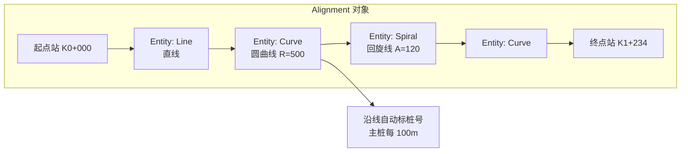
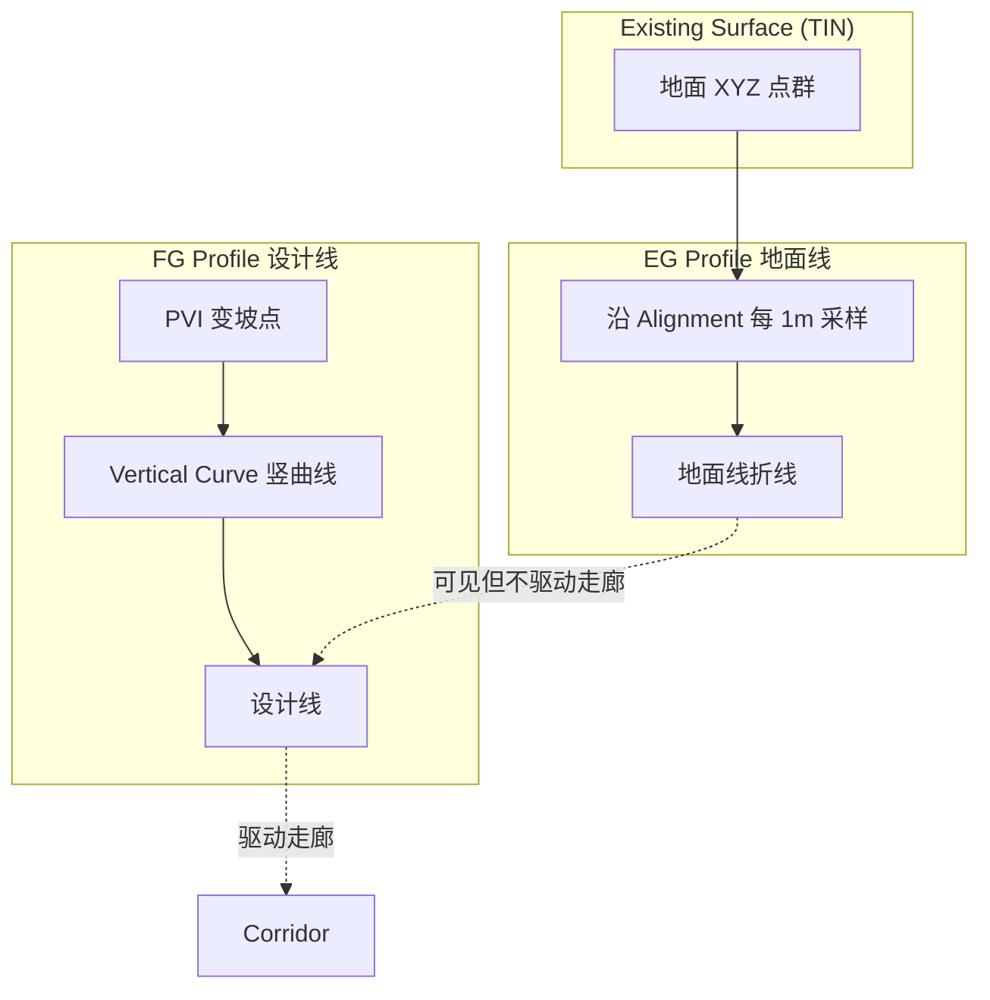
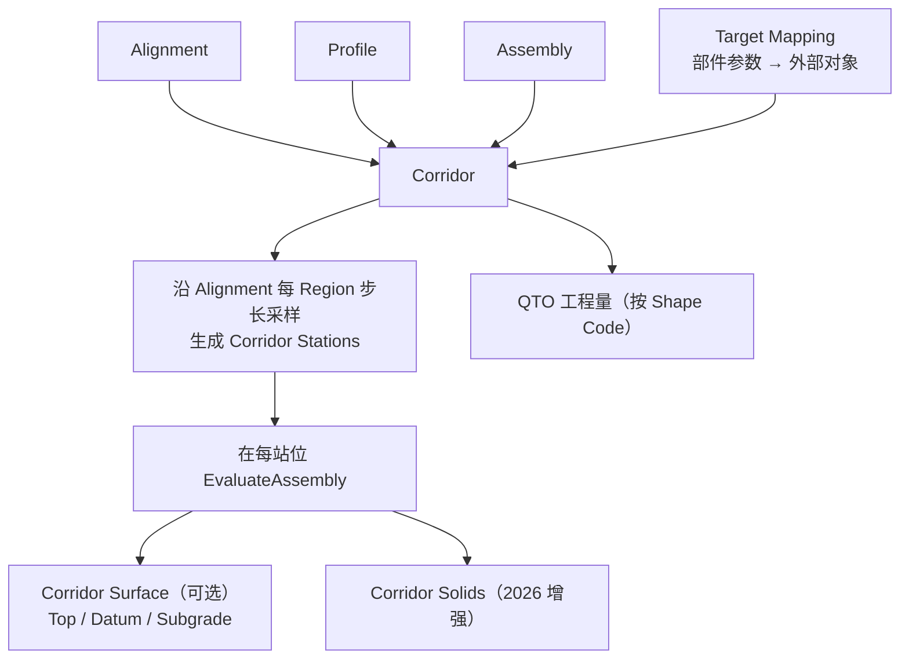

# Autodesk Civil 3D 分析：借鉴与超越

> 导航：[README](./README.md) · [01MASTER 总纲](./01MASTER.md) · [02INDEX 总对比](./02Software_Overview_INDEX.md) · [03RoadSelect 选型](./03RoadSelect.md)

Civil 3D 是全球市政/公路工程设计领域**参数化走廊范式**的定义者。其 Alignment → Profile → Assembly → Corridor 五件套已成为行业事实标准，OpenRoads、纬地、鸿业都在不同程度上跟随此模型。Civil 3D 2026 的重点是大数据集性能、Model Viewer（三维预览）、Drainage Tools（独立排水）及走廊 API 稳定性。

---

## 一、值得借鉴的 Civil 3D 核心设计理念

### 1.1 Alignment — 平面线位的一等公民

Alignment 不是普通多段线，而是一个**有桩号系统的参数对象**：



**关键特征**：

1. Alignment 是**拓扑连续**的——每个 Entity 相邻处自动保证切线一致（C¹ 连续）
2. 支持**方位角-弧长反算**：给定桩号反算 XY 坐标；给定 XY 反算桩号与偏距
3. **桩号方程（Station Equation）**：允许一条 Alignment 中存在桩号断链（如 K0+500=K0+450，即向后跳 50m）

**映射到 HyTool**：

```csharp
public interface IAlignment
{
    string Name { get; }
    IReadOnlyList<IAlignmentEntity> Entities { get; }
    IReadOnlyList<StationEquation> StationEquations { get; }  // 桩号断链

    Point3d StationOffsetToPoint(Station sta, double offset);
    (Station sta, double offset, double bearing) PointToStationOffset(Point3d p);
}

public interface IAlignmentEntity  // Line / Curve / Spiral 统一接口
{
    AlignmentEntityKind Kind { get; }
    double Length { get; }
    Point3d StartPoint { get; }
    Point3d EndPoint { get; }
    double StartBearing { get; }
    double EndBearing { get; }
}

public sealed record StationEquation(Station Back, Station Ahead, StationEquationKind Kind);
public enum StationEquationKind { Increasing, Decreasing /* 断链跳减 */ }
```

### 1.2 Profile — 纵断面的两面性

Civil 3D 区分 **EG（Existing Ground）** 与 **FG（Finished Ground）** 两种 Profile：

| 类型 | 来源 | 特点 |
|------|------|------|
| EG Profile | 地面线，从 TIN Surface 采样 | 只读，跟随 Surface 更新 |
| FG Profile | 设计线，人工拉坡 | 可编辑，由 PVI + 竖曲线组成 |



**映射**：

```csharp
public enum ProfileKind { ExistingGround, DesignFinish }

public sealed class Profile
{
    public IAlignment Baseline { get; }
    public ProfileKind Kind { get; }

    // EG：由 Surface + Alignment 自动采样（不可编辑 PVI）
    // FG：由 PVI 列表 + 竖曲线组成
    public IReadOnlyList<ProfilePvi> Pvis { get; }
    public IReadOnlyList<VerticalCurve> VCurves { get; }
}
```

### 1.3 Assembly / Subassembly — 部件化的断面

Civil 3D 最精髓的设计——**把横断面拆成可拖拽、可参数化的乐高积木**：

```
Assembly "双向6车道城市主干路"
  ├── Baseline Point（中心点，对齐 Alignment）
  ├── Left Side
  │    ├── SA_MedianDivider (width=2.0m, height=0.25m)
  │    ├── SA_Lane (width=3.75, cross-slope=-2%)
  │    ├── SA_Lane (width=3.5)
  │    ├── SA_Lane (width=3.5)
  │    ├── SA_BikeLane (width=2.5)
  │    ├── SA_GreenStrip (width=1.5)
  │    ├── SA_Sidewalk (width=3.0)
  │    └── SA_Curb
  └── Right Side (mirror)
```

每个 Subassembly 都是一个**有 Input / Output Point / Link / Shape 的小程序**：

- **Input**：从上游 Subassembly 拿到的"插接点"
- **Output Points**：本部件产生的关键点（边线 / 路面线 / 路肩点）
- **Links**：点之间的连线（可挂图层 / 样式 / 坡度）
- **Shapes**：闭合区域（可挂材料 / 计算面积）

**Subassembly Composer (PKT)**：Civil 3D 提供的节点式编辑器，输出 `.pkt` 文件，可用 VB.NET 子类扩展。

**映射**：

```csharp
public interface ISubassembly
{
    string Code { get; }

    /// <summary>在某个桩号处装配，返回相对于 Baseline 的几何。</summary>
    SubassemblyGeometry EvaluateAt(
        Station station,
        SubassemblyInputAnchor input,   // 上游接点
        AssemblyContext ctx);           // 含 Profile、横坡、超高等上下文
}

public sealed class SubassemblyGeometry
{
    public IReadOnlyList<SubassemblyPoint> Points { get; }    // 关键点
    public IReadOnlyList<SubassemblyLink> Links { get; }      // 连线
    public IReadOnlyList<SubassemblyShape> Shapes { get; }    // 闭合区
    public SubassemblyOutputAnchor Output { get; }            // 下游接点
}

public readonly record struct SubassemblyPoint(string Code, Point3d Position, PointFlags Flags);
public sealed record SubassemblyLink(string Code, IReadOnlyList<Point3d> Polyline, string LinkCodes);
public sealed record SubassemblyShape(string Code, IReadOnlyList<Point3d> Boundary, string ShapeCodes);
```

### 1.4 Corridor — 动态三维走廊

Corridor 是 Alignment + Profile + Assembly + **Target Mapping** 的合成结果：



**Target Mapping**：部件里某个参数可以绑到外部对象——比如"车道宽度"绑到一条"Width Target Feature Line"，Feature Line 一变，走廊跟着变：

```csharp
public interface ITargetMapping
{
    TargetKind Kind { get; }       // SurfaceTarget / WidthTarget / ElevationTarget / OffsetTarget
    object Source { get; }         // ISurface / IPolyline / IFeatureLine
    string SubassemblyParameter { get; }   // 绑定到部件的哪个参数
}
```

### 1.5 Regions 与 Multiple Baselines

一条 Corridor 可以有多条 Baseline（主路 + 辅路 + 匝道），每条 Baseline 沿桩号分若干 **Region**，每个 Region 用不同 Assembly：

```
Corridor "K路"
  ├── Baseline "主路"
  │    ├── Region K0+000 ~ K0+500 → Assembly_Standard
  │    ├── Region K0+500 ~ K0+800 → Assembly_Widen (拓宽段)
  │    └── Region K0+800 ~ K1+234 → Assembly_Standard
  └── Baseline "辅路" (如有)
```

### 1.6 Feature Lines — 自由线的一等公民

在 Alignment 之外，Civil 3D 还有 **Feature Line**（要素线）——"有标高的多段线"，常用于：

- 路缘石顶线（非中心线）
- 绿化带边线
- 停车场边界

Feature Line 可以作为 Target、可以参与 Corridor 的 Link To Surface。对市政道路**极其实用**。

### 1.7 TIN Surface — 曲面的核心数据结构

Civil 3D 的 Surface 本质是 TIN（三角网），支持：

- 从点云 / 等高线 / LandXML / Corridor 生成
- 体积对比（Volume Surface = TIN₁ − TIN₂），用于土方
- 与 Corridor 交互：`Link To Surface` 边坡自动追形

### 1.8 QTO（Quantity Take-Off）

基于 Assembly 里 Link Code / Shape Code 自动统计：

- 按 Shape Code：面积 → 沿桩号积分 → 体积（路面 / 基层 / 垫层方量）
- 按 Link Code：长度 → 沿桩号累加（路缘石长度、标线长度）

---

## 二、必须超越 Civil 3D 的缺点

### 2.1 学习曲线陡（最大痛点）

- Subassembly Composer 是独立工具，需要 VB.NET 思维
- Target Mapping 的 UX 被普遍批评"命名混乱 + 弹窗多"
- 新手从零到跑通一条走廊平均 40 小时

**HyTool 应对**：

- 内置 10 个开箱即用的市政部件（中央分隔带 / 车道 / 非机动车道 / 绿化带 / 人行道 / 路缘石 / 边坡 / 面层 / 基层 / 垫层），覆盖 CJJ 37 全部标准断面
- Target Mapping 弱化：v1 只支持"固定数值参数 + 沿线插值"，不支持动态 Target（留给 v2）

### 2.2 对中国规范适配差

- 符号化体系完全西式（米/英制混用、Alignment Label Style 不支持 "K0+000" 中文桩号格式）
- 路面结构层表模板是 AASHTO，需要自己改
- 交叉口无本土渠化模板

**HyTool 应对**：

- 桩号格式默认 `K{km}+{m:000.000}`（与 CJJ 37 图纸习惯一致）
- 路面结构层表模板默认为 CJJ 169 沥青/水泥混凝土两套
- `IntersectionService` 继承自已有 `CrosswalkService`，本身就是按 CJJ 152 做的

### 2.3 性能：大模型卡顿

Civil 3D 在 Corridor 规模 > 10 km 或 Surface 点数 > 500 万时，Rebuild 操作可达分钟级。2026 版 "Performance Improvements" 承认这是重点修复项。

**HyTool 应对**：

- Corridor 采用**增量重建**：只重算发生变化的 Region
- Surface 用 BKDTree 空间索引（复用 HyTool 现有 `SpatialIndexService<T>`）
- 与 AutoCAD 实体解耦：Domain Corridor 是真相，AutoCAD 图形是视图，按需生成

### 2.4 封闭格式 / 单文件瓶颈

- `.dwg` 里塞 Corridor 对象 → 文件膨胀
- 多人协作靠 Data Shortcut（本质是 XML 引用），不及 Novapoint/Quadri 的模型服务器

**HyTool 应对**：

- 道路设计存储：JSON / protobuf（方案待定），与 DWG **分离**
- DWG 中只留图形视图，语义层存旁路文件（`.roaddesign`）

### 2.5 曲线连续性 Bug 历史悠久

直线-缓和曲线-圆曲线-缓和曲线-直线（对称基本型）在 Entity 接缝处经常出现曲率不连续或桩号跳差，论坛 Issue 存续 10+ 年。

**HyTool 应对**：

- Alignment Entity 提供**自检方法** `ValidateContinuity()`：检查相邻 Entity 的切线角与切点容差
- 提供"平滑化"命令 `hyRoadAlnClean` 自动纠正微小不连续

### 2.6 Subassembly Composer 不支持 C#

官方只支持 VB.NET 语法（虽然运行时是 .NET），扩展门槛高。

**HyTool 应对**：

- 自定义 Subassembly 直接写 C# `ISubassembly` 实现，热加载到 `AssemblyLibrary`

---

## 三、映射到 HyCADTool.Refactored 的设计

### 3.1 命令挂点（新增于 `CommandRegistry.cs`）

| 命令 | 功能 | Civil 3D 对应 |
|------|------|---------------|
| `hyRoadAln` | 从多段线创建 Alignment（或交互式绘制） | `AECCAlignment` |
| `hyRoadAlnEdit` | 编辑 Alignment（加 PI 点、改半径） | Alignment Grips |
| `hyRoadProfEG` | 从高程点群采样地面线 Profile | `CreateProfileFromSurface` |
| `hyRoadProfFG` | 交互式拉设计线（多控制点） | `CreateProfile` |
| `hyRoadAsm` | 创建 / 编辑 Assembly（从部件库组装） | Assembly + Subassembly |
| `hyRoadCorr` | 创建 Corridor（选 Alignment + Profile + Assembly） | `CreateCorridor` |
| `hyRoadCorrRebuild` | 重建 Corridor | Corridor Rebuild |
| `hyRoadCross` | 批量输出横断面图 | Sample Line + Section |
| `hyRoadQto` | 工程量汇总（体积 / 面积 / 长度） | QTO Report |

### 3.2 Domain 新增目录

已在 [01MASTER.md § 7.3](./01MASTER.md#73-新增-domain-模型) 列出。

### 3.3 Service 层

```csharp
namespace HyCADTool.Refactored.Infrastructure.AutoCAD.Services.Road;

public sealed class RoadAlignmentService
{
    public IAlignment CreateFromPolyline(ObjectId polyId, AlignmentOptions opt);
    public ObjectId RenderToAutoCAD(IAlignment a, RoadLayerSet layers);
    public void LabelStations(IAlignment a, double interval, LabelStyle style);
}

public sealed class RoadCorridorService
{
    public Corridor Build(IAlignment a, Profile p, Assembly asm,
                         IReadOnlyList<CorridorRegion> regions,
                         double stationStep);    // 默认 5m

    public void Render3D(Corridor c, RoadLayerSet layers);
    public QtoReport ComputeQto(Corridor c);
}
```

### 3.4 图层（扩展 `0-road-*`）

| 图层 | 用途 |
|------|------|
| `0-road-中心线` | Alignment |
| `0-road-桩号` | 桩号标注 |
| `0-road-车行道-边线` | 车道边线 |
| `0-road-非机-边线` | 非机动车道边线 |
| `0-road-人行道-边线` | 人行道边线 |
| `0-road-路缘石` | 路缘石 |
| `0-road-绿化带` | 绿化带 |
| `0-road-边坡` | 边坡线 |
| `0-road-纵断面-地面线` | Profile EG |
| `0-road-纵断面-设计线` | Profile FG |
| `0-road-纵断面-竖曲线` | VCurve |
| `0-road-横断面-路拱` | 横断面图 |
| （沿用 CrosswalkService 既有） | `0-road-标线-人行横道-实线`、`0-road-标线-停止线`、`0-road-辅助线` |

### 3.5 `hy-settings.json` 扩展

```json
{
  "Road": {
    "DesignSpeed": 50,                // km/h
    "StationInterval": 20,            // m
    "StationFormat": "K{km}+{m:000.000}",
    "LaneWidth": 3.5,
    "BikeLaneWidth": 2.5,
    "SidewalkWidth": 3.0,
    "GreenBeltWidth": 1.5,
    "MedianWidth": 2.0,
    "CrownSlope": 0.02,               // 2%
    "CurbHeight": 0.15,
    "// 以下为已存在字段": "",
    "GapWidth": 5.0,
    "CrosswalkWidth": 5.0,
    "StopLineDistance": 2.0,
    "StripeSpacing": 1.0
  }
}
```

---

## 四、总结：借鉴 vs 超越

| Civil 3D 设计 | 借鉴 | HyCAD 超越 |
|---------------|------|-------------|
| Alignment 桩号系统 | 完全借鉴，`IAlignment` + `Station` | 默认支持 CJJ 37 中文桩号格式 |
| Profile EG / FG 双面 | 借鉴 | 避免 Surface 强依赖（EG 可来自高程点） |
| Assembly / Subassembly 参数化 | 借鉴"积木"思想 | 内置 10 个 CJJ 部件，用户无需 PKT |
| Target Mapping | 借鉴概念 | v1 简化为固定参数 + 桩号插值 |
| Corridor Region 分段 | 完全借鉴 | 增量重建（只算变化段） |
| Feature Line | 借鉴概念 | 复用现有多段线体系，不单独建类型 |
| TIN Surface | 借鉴，v2 引入 | v1 用点群 + 采样，回避 TIN 复杂度 |
| QTO 按 Link/Shape Code | 借鉴 | 默认报告模板匹配国内工程量清单 |
| 学习曲线陡 | **避免** | 参数集中在 hy-settings.json + 面板 Tab |
| 对中国规范适配差 | **避免** | CJJ 37/152/193 内置校核 |
| 大模型性能 | **避免** | 增量重建 + 空间索引 + 视图/模型分离 |
| 封闭格式 | **避免** | 道路语义独立存储（.roaddesign + DWG 分离） |
| Subassembly 只支持 VB.NET | **避免** | C# 原生 `ISubassembly` |

---

## 五、与其他对标篇的交叉引用

- [OpenRoads.md](./OpenRoads.md)：同样是参数化走廊，但模板用 `.itl` 库，与 Civil 3D 的 `.pkt` 对照
- [HintCAD.md](./HintCAD.md)：国内纬地的 BIM 2.0 核心理念与 Civil 3D 同源
- [HongYeRoad.md](./HongYeRoad.md)：鸿业"平纵横联动"对 Civil 3D 的简化应用
- [03RoadSelect.md](./03RoadSelect.md)：HyCAD 如何整合 Civil 3D 五件套到"四级参数化体系 + 五维选择"
