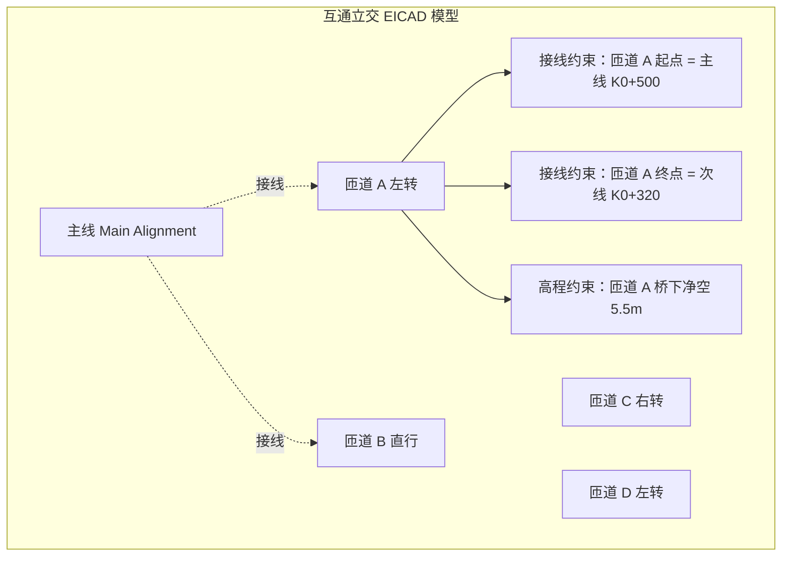

# 狄诺尼 EICAD 分析：借鉴与超越

> 导航：[README](./README.md) · [01MASTER 总纲](./01MASTER.md) · [02INDEX 总对比](./02Software_Overview_INDEX.md) · [03RoadSelect 选型](./03RoadSelect.md)

EICAD（集成交互式道路与互通立交设计系统）是江苏狄诺尼信息技术的旗舰产品，2023+ 已全面 SaaS 化，覆盖全国 80% 甲级设计院。其核心差异化在**互通立交的复杂线形设计能力** 和**AIRoad 方案级 AIGC** 的衔接。在市政道路领域，EICAD 对 **交叉口渠化 / 左转待行区 / 交织区** 等交通工程细节的处理最深。

---

## 一、值得借鉴的 EICAD 核心设计理念

### 1.1 互通立交的"主线+匝道"体系

EICAD 把立交视作一组**多条 Alignment 的几何约束集**：



**关键设计**：

- 每条匝道都是独立的 Alignment + Profile + Template
- **约束**（接线 / 高程 / 净空）显式存储，不是"画完看一眼"
- 改主线 → 所有接线约束的匝道自动调整起终点

**HyTool 借鉴**（v2+，市政立交场景）：

```csharp
public sealed class RoadNetwork
{
    public IAlignment Main { get; }
    public IReadOnlyList<IAlignment> Ramps { get; }
    public IReadOnlyList<IAlignmentConstraint> Constraints { get; }
}

public abstract record IAlignmentConstraint
{
    public abstract void Validate(IAlignment target, IReadOnlyList<IAlignment> siblings);
}

public sealed record ConnectConstraint(
    IAlignment Owner, Station OwnerStation,
    IAlignment Other, Station OtherStation,
    double Tolerance = 0.01) : IAlignmentConstraint;

public sealed record VerticalClearanceConstraint(
    IAlignment Lower, Station LowerStation,
    IAlignment Upper, Station UpperStation,
    double MinClearance) : IAlignmentConstraint;
```

> 城市立交（如快速路上下匝道、地下通道）在大型市政项目中不少见，这部分能力放 v3。

### 1.2 左转待行区

EICAD 对 **左转待行区**（CJJ 152 允许的渠化形式）的处理是国内最专业的：

```
左转待行区平面要素：
  1. 左转车道边线（白虚/白实过渡）
  2. 待行区边线（黄色导流线）
  3. 二次停止线（位于交叉口中心附近）
  4. 待行区指示箭头
  5. 相应信号灯配置说明
```

**HyTool 策略**：v2 `IntersectionService.AddLeftTurnWaitingArea()`：

```csharp
public sealed class LeftTurnWaitingArea
{
    public Intersection ParentIntersection { get; }
    public string ArmCode { get; }              // 哪条进口臂
    public double WaitingAreaLength { get; }    // 待行区长度，通常 1 个车身 6m
    public int WaitingCapacity { get; }          // 容纳车辆数
    public ObjectId[] DrawingEntities { get; }
}
```

### 1.3 交织区分析

市政快速路的出入口、主辅路转换区存在**交织**——车辆从一个车道变换到另一个车道的距离段。CJJ 37 附录 F 规定最小交织长度。EICAD 提供：

1. 自动识别交织区（两个相邻出入口之间）
2. 长度校核
3. 交织区内禁止标线（白实禁止变道）自动生成

**HyTool 策略**：v2 `RoadCodeChecker` 增加交织区规则；`MarkingService` 增加白实禁止变道线生成。

### 1.4 VRRoad 驾驶模拟集成

EICAD 可导出到 **VRRoad 道路驾驶模拟**，在沉浸式 3D 场景里验证：

- 视距是否充分
- 超车视距
- 导向标志是否清晰
- 夜间照明

这是"方案安全性评价"的高阶能力。

**HyTool 策略**：不直接做驾驶模拟，但**导出 LandXML / IFC / FBX**以支持第三方驾驶仿真（UE/Unity）。

### 1.5 SaaS 化与多设计师协同

EICAD 5.0+ 走 SaaS，主要特征：

- 模型 / 图纸存云端
- 多人同时编辑（冲突检测）
- 版本快照
- 按席位按年计费

**HyTool 策略**：**不做 SaaS**，但**模型版本快照**可本地落地（见 [Novapoint.md § 3.5](./Novapoint.md#35-版本历史的落地不依赖-quadri)）。

### 1.6 AIRoad 的"文生路"方向

狄诺尼旗下 AIRoad 道路工程快速方案设计系统采用 AIGC 模型，据称可从"设计需求描述 + 控制点"一键生成合规的初步路线。这是行业 AI 方向的探索。

**HyTool 策略**：现有 `AgentDebugLogger` 已显示项目对 AI 有预期。未来可集成 MCP Server，提供：

- `create_alignment_from_description`（自然语言→Alignment 初稿）
- `check_road_compliance`（调用 RoadCodeChecker）
- `generate_report`（调用 DesignSpecService）

详见 `HyTool/Doc/AI_Workflow.md` 的设计模式。

---

## 二、必须超越 EICAD 的缺点

### 2.1 依赖中望 CAD

EICAD 5.0 目前主要跑在中望 CAD 平台，AutoCAD 版本的功能更新滞后。

**HyTool 应对**：扎根 AutoCAD 原生。

### 2.2 公路 DNA

与纬地类似，EICAD 同样是公路→市政的演化路径，术语与菜单偏公路。

**HyTool 应对**：市政为一等公民。

### 2.3 SaaS 数据合规性

部分涉密市政项目不允许数据上云。

**HyTool 应对**：纯本地。

### 2.4 高度依赖厂商服务

EICAD 的复杂模块（AIRoad、VRRoad）高度依赖厂商专家支持，用户自主扩展能力弱。

**HyTool 应对**：基础功能开箱即用，高级功能通过开放的 Domain API 和配置文件扩展。

---

## 三、映射到 HyCADTool.Refactored 的设计

### 3.1 命令挂点

| 命令 | 功能 | EICAD 对应 |
|------|------|------------|
| `hyRoadNetwork` | 创建道路网络（多 Alignment 集合） | 立交系统 |
| `hyRoadConstrain` | 添加接线/净空约束 | 立交约束 |
| `hyRoadLeftWait` | 生成左转待行区 | 左转待行区 |
| `hyRoadWeaveCheck` | 交织区校核 | 交织区分析 |
| `hyRoadExportVr` | 导出 FBX 供 VR 仿真（v3） | VRRoad 接口 |

### 3.2 交叉口 + 立交的统一模型

```csharp
public abstract class RoadNode
{
    public abstract RoadNodeKind Kind { get; }
    public abstract IReadOnlyList<RoadNodeArm> Arms { get; }   // 所有接入臂
}

public enum RoadNodeKind { Intersection, TJunction, YJunction, Roundabout, Interchange }

public sealed class Intersection : RoadNode    // 平面交叉
{
    public override RoadNodeKind Kind => /* Intersection/TJunction/... */;
    public IReadOnlyList<IntersectionCornerArc> Corners { get; }
    public IReadOnlyList<Crosswalk> Crosswalks { get; }
    public IReadOnlyList<LeftTurnWaitingArea> WaitingAreas { get; }
    public IReadOnlyList<ChannelizationIsland> Islands { get; }
}

public sealed class Interchange : RoadNode     // 互通立交（v3）
{
    public override RoadNodeKind Kind => RoadNodeKind.Interchange;
    public IAlignment Main { get; }
    public IReadOnlyList<IAlignment> Ramps { get; }
    public IReadOnlyList<IAlignmentConstraint> Constraints { get; }
    public IReadOnlyList<OverpassBridge> Overpasses { get; }
}
```

### 3.3 左转待行区生成算法

```csharp
public sealed class LeftTurnWaitingAreaService
{
    public LeftTurnWaitingArea Generate(
        Intersection isec,
        string armCode,
        LeftTurnWaitingOptions opt)
    {
        // 1. 取该臂的左转车道（从车道功能表）
        // 2. 从该臂停止线向交叉口中心推进 waitingLength
        // 3. 绘制黄色导流线（封闭多边形）
        // 4. 绘制二次停止线
        // 5. 绘制待行指示箭头
        // 6. 挂属性：冲突点分析、信号周期建议
    }
}
```

### 3.4 AI 命令（v3+）

```csharp
[McpServerTool]
public string CreateAlignmentFromDescription(string description, Point3d[] controlPoints)
{
    var parsed = _llm.Parse(description);
    var builder = new PiPointAlignmentBuilder
    {
        PiPoints = controlPoints,
        Radii = parsed.Radii ?? InferRadiiFromDescription(description, controlPoints),
        SpiralParams = parsed.SpiralParams
    };
    var alignment = builder.Build();
    return _roadDesign.AddAlignment(alignment);
}
```

---

## 四、总结：借鉴 vs 超越

| EICAD 设计 | 借鉴 | HyCAD 超越 |
|------------|------|-------------|
| 立交"主线+匝道+约束"模型 | 完全借鉴 | 统一的 RoadNode 层次，涵盖交叉口与立交 |
| 左转待行区 | 完全借鉴 | v2 落地 |
| 交织区校核 | 借鉴 | v2 规则库增加 |
| VRRoad 驾驶模拟 | 间接借鉴 | v3 通过 FBX/IFC 导出给第三方引擎 |
| AIRoad AIGC 方向 | 借鉴 | v3 通过 MCP Server 集成 |
| SaaS 多人协同 | **避免** | 本地 + 文件快照 |
| 中望 CAD 平台 | **避免** | 扎根 AutoCAD |
| 公路 DNA | **避免** | 市政为一等公民 |
| 数据合规性 | **避免** | 纯本地 |

---

## 五、与其他对标篇的交叉引用

- [HintCAD.md](./HintCAD.md)：两者同为公路系软件的市政扩展
- [HongYeRoad.md](./HongYeRoad.md)：EICAD 的交叉口专业度 vs 鸿业的市政广度
- [AutoTurn.md](./AutoTurn.md)：视距与车辆扫略路径的专业化
- [01MASTER.md § 九](./01MASTER.md#九规范清单)：CJJ 152 渠化条款
