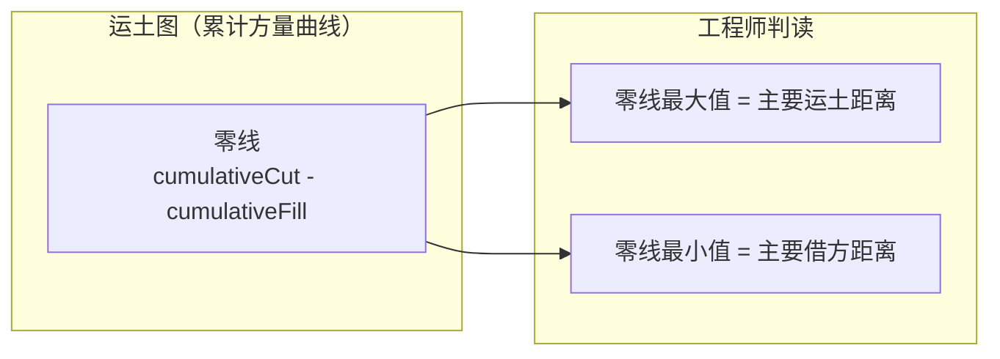

# 飞时达（FastTFT）+ 理正市政 分析：借鉴与超越

> 导航：[README](./README.md) · [01MASTER 总纲](./01MASTER.md) · [02INDEX 总对比](./02Software_Overview_INDEX.md) · [03RoadSelect 选型](./03RoadSelect.md)

飞时达（Fast）与理正（LeadingSoft）是国内 **"快速出图派"** 的两大代表。飞时达以 **土方计算（FastTFT）+ 总图设计（GPCADZ）+ 道路设计（RDCAD）** 三驾马车著称；理正以 **勘察岩土** 为主业，在市政道路设计领域主要提供场平竖向、土方管控。对 HyCAD 的价值：**土方计算算法 + 快速出图套路 + 竖向设计**。

---

## 一、值得借鉴的飞时达/理正核心设计理念

### 1.1 七种土方算法并存（FastTFT 的镇店之宝）

飞时达 FastTFT 的土方计算支持 7 种算法，覆盖从粗算到精算的各种场景：

| 算法 | 原理 | 精度 | 适用 |
|------|------|------|------|
| **方格网法** | 按 20m 方格划分，每格按四角平均高差算体积 | ★★★ | 规则地形、平整场地 |
| **三角网法** | 基于 TIN 三角片积分 | ★★★★★ | 复杂地形、精算 |
| **断面法** | 沿路线取横断面，面积+桩号距离积分 | ★★★★ | 道路、长条状工程 |
| **道路断面法** | 断面法特化，支持挖方/填方 / 台阶 / 护坡 分类 | ★★★★★ | 道路专用 |
| **田块法** | 按地块边界分块 | ★★ | 场地平整 |
| **地下多层计算** | 多层基坑、挡墙、护坡 | ★★★★ | 地下结构 |
| **整体估算法** | 按面积 × 平均深度估算 | ★ | 初步估算 |

**HyTool 借鉴**：市政道路主要用**道路断面法**（+ 方格网法作为场地平整辅助）。v1 交付目标：

```csharp
public interface IRoadEarthworkCalculator
{
    EarthworkReport CalculateByCrossSection(
        Corridor corridor,
        IRoadTerrain existingTerrain,
        EarthworkOptions opt);
}

public sealed class EarthworkReport
{
    public double TotalCut { get; }          // 总挖方 m³
    public double TotalFill { get; }          // 总填方 m³
    public double NetVolume { get; }          // 净方 = Cut - Fill
    public IReadOnlyList<StationVolume> PerStation { get; }   // 逐桩号方量
    public IReadOnlyList<SegmentVolume> PerSegment { get; }   // 逐段方量
    public string ToMarkdown();
    public byte[] ToExcel();                   // 复用现有 ExcelExportService
}

public readonly record struct StationVolume(
    Station At,
    double CutArea,
    double FillArea,
    double CumulativeCut,
    double CumulativeFill);
```

### 1.2 场地土方调配优化

飞时达的"土方调配"算法：

1. 按方格网算出每格的填挖量
2. 按"**填挖平衡**"原则规划"从哪里挖、运到哪里填"
3. 输出**运距 × 方量**最小的调配方案（运筹学最小费用流）
4. 生成调配图（箭头标注每段运量）

**HyTool 策略**（v2+）：不直接做运筹优化，但**输出填挖累计曲线**（沿桩号积分的 cut/fill 曲线）是必需的：


### 1.3 RDCAD 道路设计的"简快方向"

RDCAD 的设计哲学：**不追求完整 BIM 走廊，只做国内设计院最常用的 5 个功能**：

1. 道路平面（PI 点法）
2. 纵断面（手工拉坡 + 最简规范检查）
3. 横断面（标准模板 + 填挖）
4. 土方计算（调用 FastTFT）
5. 管网设计（道路附属）

**HyTool 借鉴**：这就是**路线 A** 的底层哲学——覆盖国内市政设计院 80% 的日常工作，不背 BIM 的"技术债"。

### 1.4 GPCADZ 场地竖向设计

GPCADZ（总图设计软件）擅长**场地竖向设计**——给定场地边界 + 控制点高程，自动计算：

- 设计标高网格
- 坡面走向（等高线）
- 排水走向
- 与市政道路衔接点的接坡

```csharp
public interface ISiteGradingService
{
    SiteGradingResult Design(
        Polygon2d siteBoundary,
        IReadOnlyList<ElevationControlPoint> controls,
        IReadOnlyList<Point3d>? existingTerrainPoints,
        SiteGradingOptions opt);
}

public sealed class SiteGradingResult
{
    public IRoadTerrain DesignTerrain { get; }          // 设计地形 TIN
    public IReadOnlyList<Polyline> ContourLines { get; } // 设计等高线
    public IReadOnlyList<FlowDirectionArrow> Flows { get; }   // 排水方向
    public EarthworkReport Volumes { get; }
}
```

> 市政道路通常不涉及场地竖向，但**交叉口内的"路面衔接标高"** 本质上是一个小型场地竖向问题。

### 1.5 理正岩土的"数据中心"思想

理正近年主推"大岩土数据中心"——把勘察数据、地质断面、岩土参数集中存储，AI 辅助报告生成。对 HyCAD 的启发：**道路设计数据也应该被当作资产持久化**。

**映射**：

- `.roaddesign` 文件 + `_snapshots/` 快照目录（已设计）
- `feature-catalog.json` 结构化对象属性（已设计）
- 远期可以引入 **项目级数据库**（SQLite）存储多条道路的元数据

### 1.6 理正对国产化的支持

理正官网强调"**信创国产化适配**（中望 CAD、浩辰 CAD、国产操作系统）"，这是近年国内政策导向。

**HyTool 策略**：当前基于 AutoCAD，长期目标应保持 Domain 零依赖，方便未来移植到中望 CAD / 浩辰 CAD。

---

## 二、必须超越的缺点

### 2.1 飞时达的道路设计深度浅

RDCAD 的道路设计功能覆盖面窄（不支持超高、不支持复杂交叉口、不支持 BIM），定位是"配合 FastTFT 做土方"。

**HyTool 应对**：HyCAD 的道路设计功能本身就深，FastTFT 风格的"土方专家"作为 v1 的一个模块整合进来即可。

### 2.2 飞时达对新版 AutoCAD 跟进慢

FastTFT v17 才支持 AutoCAD 2025，道路模块（RDCAD）更新更慢。

**HyTool 应对**：HyCAD 追最新 AutoCAD。

### 2.3 理正在市政道路的存在感弱

理正的重心在岩土勘察，市政道路只作附属功能，深度不足。

**HyTool 应对**：市政道路为主线，不依赖理正。

### 2.4 两家都是"特色模块拼接"

飞时达 = FastTFT + RDCAD + GPCADZ + 其它，模块之间**数据不共享**（同一条道路在三个模块中需要重复建模）。

**HyTool 应对**：**单一 Domain 模型**——`RoadDesign` 聚合根持有 Alignment、Profile、Template、Corridor、Terrain、Earthwork、Site Grading，一次建模所有模块可用。

### 2.5 报告风格固化

两家的报告输出多为 Word 模板，定制困难。

**HyTool 应对**：所有报告走 `DesignSpecService` → Markdown → 多栏 MText / Word / PDF / Excel。

---

## 三、映射到 HyCADTool.Refactored 的设计

### 3.1 命令挂点

| 命令 | 功能 | 飞时达/理正对应 |
|------|------|----------------|
| `hyRoadEarthwork` | 按道路断面法算土方 | FastTFT 道路断面法 |
| `hyRoadEarthworkGrid` | 按方格网法算土方（场地平整） | FastTFT 方格网法 |
| `hyRoadHaulCurve` | 生成土方累计曲线（运土图） | 调配分析 |
| `hyRoadSiteGrade` | 场地竖向设计（小场地，如交叉口广场）（v2） | GPCADZ |
| `hyRoadQto` | 工程量汇总（复用，见 [Civil3D.md](./Civil3D.md) ） | — |

### 3.2 道路断面法算法骨架

```csharp
public EarthworkReport CalculateByCrossSection(
    Corridor corridor,
    IRoadTerrain existingTerrain,
    EarthworkOptions opt)
{
    var stationStep = opt.StationInterval;         // 默认 20m
    var stations = corridor.EnumerateStations(stationStep).ToList();
    var per = new List<StationVolume>();

    double cumCut = 0, cumFill = 0;
    for (int i = 0; i < stations.Count; i++)
    {
        var sta = stations[i];

        // 1. 该桩号的设计横断面（取自 corridor.Template）
        var designSection = corridor.EvaluateCrossSection(sta);

        // 2. 该桩号的地面线（从 existingTerrain 采样）
        var groundLine = SampleGround(existingTerrain, sta, designSection.TotalWidth);

        // 3. 计算设计线 vs 地面线 的围合区
        var (cutArea, fillArea) = ComputeCutFillArea(designSection, groundLine);

        per.Add(new StationVolume(sta, cutArea, fillArea, cumCut, cumFill));

        // 4. 沿桩号积分：用梯形法或辛普森法
        if (i > 0)
        {
            var prev = per[i - 1];
            var segLen = sta.Value - prev.At.Value;
            cumCut += (prev.CutArea + cutArea) / 2.0 * segLen;
            cumFill += (prev.FillArea + fillArea) / 2.0 * segLen;
        }
    }

    return new EarthworkReport(
        TotalCut: cumCut,
        TotalFill: cumFill,
        NetVolume: cumCut - cumFill,
        PerStation: per);
}
```

### 3.3 土方累计曲线（运土图）



生成的图表作为设计说明的附图（走 `DesignSpecService`）。

### 3.4 场地竖向设计（v2）的 Domain 模型

```csharp
public sealed class SiteGrading
{
    public string Name { get; }
    public Polygon2d Boundary { get; }
    public IReadOnlyList<ElevationControlPoint> Controls { get; }
    public IReadOnlyList<BreakLine> BreakLines { get; }      // 分水线 / 汇水线
    public IRoadTerrain DesignTerrain { get; }
    public IRoadTerrain? ExistingTerrain { get; }
    public EarthworkReport Earthwork { get; }
}
```

### 3.5 `hy-settings.json` 扩展

```json
{
  "Road": {
    "Earthwork": {
      "DefaultMethod": "CrossSection",         // CrossSection / Grid / Tin
      "StationInterval": 20,
      "GridSize": 20,
      "IntegrationMethod": "Trapezoidal",      // Trapezoidal / Simpson
      "CrossSectionWidth": 80,                  // 横断面取样总宽度
      "ReportWithCumulative": true,
      "AssumeCompactionRatio": 1.10             // 压实系数
    }
  }
}
```

---

## 四、总结：借鉴 vs 超越

| 飞时达/理正设计 | 借鉴 | HyCAD 超越 |
|-----------------|------|-------------|
| 道路断面法土方 | 完全借鉴 | v1 落地 + 集成在 `hyRoadQto` |
| 方格网法土方 | 借鉴 | v2 交叉口 / 小场地用 |
| 三角网法土方 | 借鉴 | v2+ 需要 TIN 基础设施 |
| 土方调配累计曲线 | 借鉴 | v1 落地 `hyRoadHaulCurve` |
| 场地竖向设计 | 借鉴 | v2 交叉口场地 |
| RDCAD 简快方向 | 借鉴哲学 | 路线 A 的底色 |
| 理正数据中心 | 借鉴 | 本地文件 + 远期 SQLite |
| 国产化支持 | 借鉴 | Domain 零依赖便于移植 |
| 模块数据不共享 | **避免** | 单 Domain 模型 |
| AutoCAD 版本跟进慢 | **避免** | 追最新版本 |
| 报告风格固化 | **避免** | Markdown → 多格式 |
| 道路设计深度浅 | **避免** | 走廊/规范/BIM 全面 |

---

## 五、与其他对标篇的交叉引用

- [HongYeRoad.md](./HongYeRoad.md)：鸿业的"平纵横+土方" vs 飞时达的"FastTFT 专精土方"
- [12dModel.md](./12dModel.md)：TIN 土方 vs 断面法土方
- [01MASTER.md § 八](./01MASTER.md#八实施路线-a--b--c三选一由工程师定)：路线 A 的"快速出图派"基因
