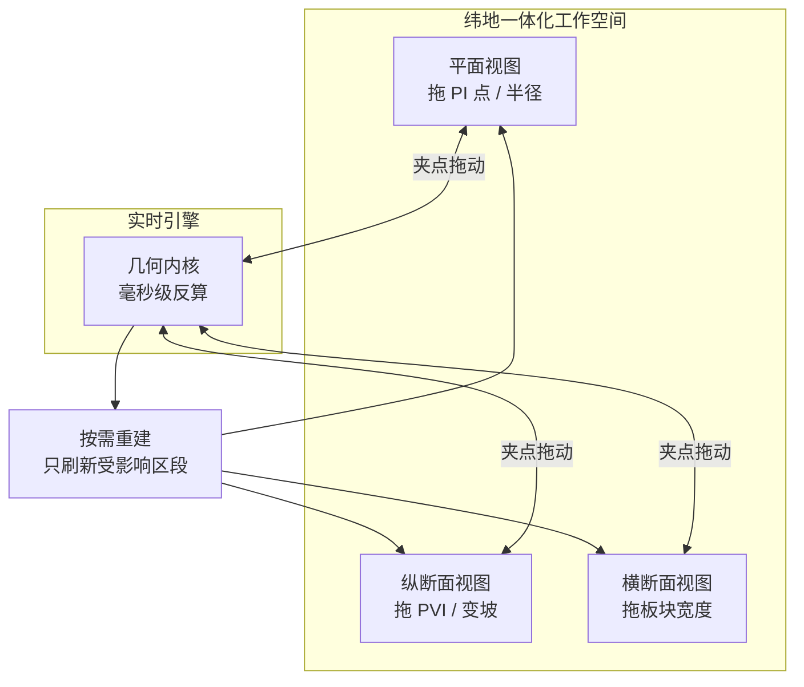
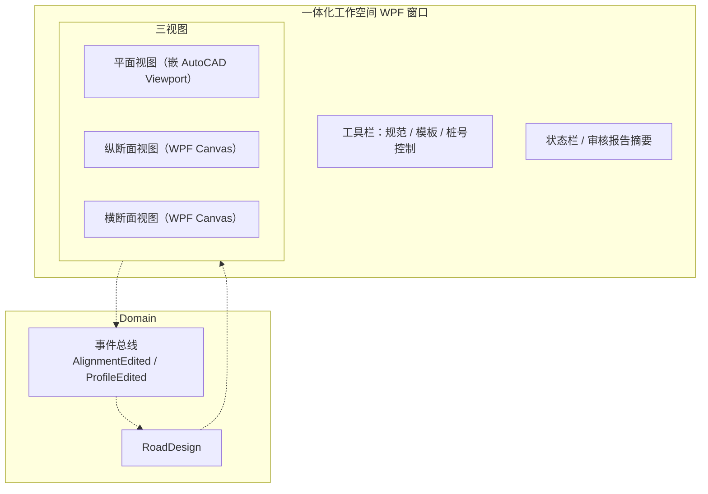

# 纬地道路（HintCAD）分析：借鉴与超越

> 导航：[README](./README.md) · [01MASTER 总纲](./01MASTER.md) · [02INDEX 总对比](./02Software_Overview_INDEX.md) · [03RoadSelect 选型](./03RoadSelect.md)

纬地道路（HintCAD）是中交第一公路勘察设计研究院下属西安纬地软件工程有限责任公司的产品，在国内公路行业占有率第一，近年通过 **纬地 BIM 2.0** 切入市政道路市场。与鸿业相比，纬地的强项是**平纵横一体化 + 智能布线 + 一键 BIM 模型构建**，是国内最接近 Civil 3D 范式的软件。

---

## 一、值得借鉴的纬地核心设计理念

### 1.1 平纵横一体化设计 — 实时拖动即刻联动

纬地最具特色的交互——**实时拖动技术**：



**关键特征**：

1. 三个视图**同步显示**，不切换窗口
2. 拖动任一视图的夹点，另外两个视图**毫秒级响应**
3. 图纸输出**同步更新**，不需要"重新生成"按钮

**映射到 HyTool**（v2）：

```csharp
public sealed class RoadDesignWorkspace
{
    public RoadDesign Current { get; private set; }
    public ViewState PlanView { get; }
    public ViewState ProfileView { get; }
    public ViewState CrossSectionView { get; }

    // 集中式变更通知——任一视图内拖动，Workspace 统一分发
    public event Action<RoadDesignChange>? OnDesignChanged;
}

public readonly record struct RoadDesignChange(
    DesignChangeKind Kind,      // AlignmentEdited / ProfileEdited / TemplateEdited
    IReadOnlySet<Station> AffectedStationRange);
```

### 1.2 智能布线 — "曲线连接"自动插入过渡

纬地的 **"智能布线"** 面板让用户在两条直线间用"曲线连接"模式自动插入缓和曲线+圆曲线+缓和曲线（对称基本型）：

1. 选择入线 + 出线
2. 指定目标半径（或让软件建议）
3. 软件计算缓和曲线参数 A，使 C¹ 连续
4. 用户可拖动转角大小（PI 点位置）观察半径变化

**HyTool 借鉴**：`hyRoadAlnConnect` 命令 + Jig 交互：

```csharp
public sealed class AlignmentConnectJig
{
    public IAlignmentEntity LeadIn { get; init; }
    public IAlignmentEntity LeadOut { get; init; }
    public double? TargetRadius { get; set; }
    public double? SpiralParam { get; set; }

    public CurveConnectionResult Solve();   // 算出基本型的三段
}
```

### 1.3 交叉口 BIM 一键构建

纬地 BIM 2.0 的杀手锏——**选两条 Alignment，一键生成交叉口三维 BIM 模型**，包含：

- 转角圆弧（平面）
- 人行横道（平面）
- 停止线（平面）
- 路拱反坡过渡（三维：交叉口抹角处路拱改向）
- 路面 Mesh（三维）
- 路缘石三维挤出

这比 Civil 3D Civil Cell 的用户体验更直接——无需配置参数表，软件按 **CJJ 152 默认值** 一键出模型。

**HyTool 借鉴**：`hyRoadIntersectionBim` 命令（v2+）：

```csharp
public sealed class IntersectionBimService
{
    public IntersectionBim BuildCrossIntersection(
        IAlignment major, IAlignment minor,
        IntersectionParameters? custom = null);   // null = CJJ 152 默认
}

public sealed class IntersectionBim
{
    public IReadOnlyList<Arc> CornerArcs { get; }        // 四角圆弧
    public IReadOnlyList<Polygon> Crosswalks { get; }    // 四条人行横道
    public IReadOnlyList<LineSegment3d> StopLines { get; }
    public SurfaceMesh PavementMesh { get; }              // 路面 Mesh
    public IReadOnlyList<Polyline3d> CurbLines { get; }   // 路缘石三维线
    public Polyline3d DrainageGutter { get; }             // 反坡排水沟
}
```

### 1.4 批量自动化"戴帽子"

"戴帽子"是公路行业术语：**沿 Alignment 逐桩号绘制横断面图（EG 地面线 + FG 设计线）**。纬地的批量戴帽子：

1. 输入桩号范围 + 间距（默认 20m）
2. 自动取 EG 地面线（从 DTM 采样）
3. 按 Template 生成设计线
4. 每张横断面独立布图 + 填挖面积标注
5. 一次输出几百张横断面图纸

**HyTool 借鉴**：`hyRoadCrossBatch` 命令：

```csharp
public sealed class CrossSectionBatchService
{
    public DrawingPackage GenerateBatch(
        Corridor corridor,
        CrossSectionBatchOptions opt);
}

public sealed class CrossSectionBatchOptions
{
    public Station Start { get; init; }
    public Station End { get; init; }
    public double Interval { get; init; } = 20.0;       // 每张桩号间隔
    public LayoutGridOptions LayoutGrid { get; init; }  // 图纸布局
    public bool LabelArea { get; init; } = true;         // 填挖面积标注
}
```

### 1.5 自动审核 — 120 项规范检查

纬地"路线几何设计自动审核"：按行业标准对 8 大类、120 余项内容检查，输出审核报告（Word / PDF）。类别包括：

- 平面线形（半径、缓和曲线参数、转角）
- 纵断面（坡长、坡度、竖曲线、合成纵坡）
- 横断面（路面宽度、横坡、超高加宽）
- 视距（停车视距、会车视距、超车视距）
- 平纵组合（平曲线与竖曲线相对位置）
- 路基（边坡、边沟、护坡道）
- 路面（结构层厚度）
- 交叉口（间距、视距三角形）

**HyTool 借鉴**：`RoadCodeChecker` 分类：

```csharp
public enum CodeCheckCategory
{
    Planar,              // 平面线形
    Profile,             // 纵断面
    CrossSection,        // 横断面
    SightDistance,       // 视距
    PlanProfileCombination, // 平纵组合
    SubBase,             // 路基
    Pavement,            // 路面
    Intersection         // 交叉口
}

public sealed class CodeCheckReport
{
    public IReadOnlyList<CodeCheckIssue> Issues { get; }
    public int WarningCount { get; }
    public int ErrorCount { get; }
    public string ToMarkdown();
    public byte[] ToPdf();
    public byte[] ToWord();   // 走现有 WordExportService
}
```

### 1.6 三维 BIM 正向设计

纬地 BIM 2.0 的核心卖点——**所有三维几何从参数直接生成，而非手工建模**：

```
参数化设计 → Domain BIM 模型 → 自动建模 → 自动挂属性
```

BIM 模型包含：

- 路基边坡
- 路面结构层（分层 Mesh）
- 路缘石
- 人行道
- 排水附属（检查井、边沟）
- 护栏
- 交通标线 / 标志（三维）

每个构件自动加 BIM 属性（位置、材料、规格）。

**HyTool 借鉴**：对应 HyCAD 的远期目标，v3 实施。Domain 层预留：

```csharp
public interface IBimExportable
{
    IfcEntityKind IfcKind { get; }
    IReadOnlyDictionary<string, object> Properties { get; }
    SurfaceMesh ToMesh();
}

public sealed class RoadCurb : IBimExportable    // 路缘石
{
    public IfcEntityKind IfcKind => IfcEntityKind.IfcBuildingElementProxy;
    // ...
}
```

### 1.7 与中望 CAD 平台兼容

纬地 2023+ 同时支持 AutoCAD 2010-2023 与中望 CAD 2023（X64）。国产化替代背景下，中望 CAD 市场份额上升。

**HyTool 策略**：HyCADTool.Refactored 当前基于 AutoCAD.NET API，**长期目标可考虑**移植到中望 CAD（其 API 兼容度约 90%）。但这**不是 v1 范围**。

---

## 二、必须超越纬地的缺点

### 2.1 公路优先，市政是次要

纬地的原生 DNA 是公路设计院，界面术语（超高、缓和曲线 A 值）对纯市政设计师不友好；交叉口、管线协调等市政核心功能晚于鸿业推出。

**HyTool 应对**：**市政优先**。术语（车道、人行道、路缘石、人行横道、标线）与 CJJ 37 一致。

### 2.2 BIM 2.0 许可昂贵

纬地 BIM 2.0 为独立许可，单席位年费数万元。中小设计院门槛高。

**HyTool 应对**：作为 HyCAD 插件免费集成。

### 2.3 学习曲线仍陡

纬地虽然交互流畅，但概念体系（Super Alignment、控制字符串、Apply 函数）延续 12d Model 哲学，初学者仍需数周培训。

**HyTool 应对**：概念简化——只保留 Alignment / Profile / Template / Corridor / Intersection 五个核心对象。

### 2.4 对 AutoCAD 深度依赖

纬地必须寄生在 AutoCAD 或中望 CAD 中，无独立运行模式。

**HyTool 应对**：HyCAD.Domain 层**本就零 AutoCAD 依赖**，未来可移植到 WPF 独立应用或 Web。

### 2.5 对开源格式支持有限

LandXML 导入导出支持但不完整；IFC 4.3 还在路线图上。

**HyTool 应对**：LandXML v1 即落地，IFC 4.3 v3 落地。

### 2.6 审核报告模板固化

120 项规范检查是好事，但报告输出是 Word 模板，定制化改动困难。

**HyTool 应对**：报告走 Markdown → `DesignSpecService`，格式完全可定制。

---

## 三、映射到 HyCADTool.Refactored 的设计

### 3.1 命令挂点（继承鸿业篇，增补纬地特色）

| 命令 | 功能 | 纬地对应 |
|------|------|----------|
| `hyRoadWorkspace` | 打开一体化三视图工作空间（v2） | 平纵横一体化 |
| `hyRoadAlnConnect` | 曲线连接智能布线 | 曲线连接 |
| `hyRoadIntersectionBim` | 交叉口 BIM 一键生成（v2） | 交叉口 BIM |
| `hyRoadCrossBatch` | 批量戴帽子 | 批量横断面 |
| `hyRoadAudit` | 规范自动审核 120 项 | 自动审核 |

### 3.2 一体化工作空间架构（v2）



三视图内部实现：

- **平面视图**：AutoCAD 内嵌 Viewport 显示（DWG 里已有的 Polyline），支持夹点拖动
- **纵断面视图**：WPF Canvas 绘制，X 轴 = 桩号，Y 轴 = 标高（放大比例独立）
- **横断面视图**：WPF Canvas 绘制，显示当前桩号的 Template

### 3.3 BIM 属性模型

```csharp
public sealed class RoadBimModel
{
    public IReadOnlyList<RoadComponent> Components { get; }

    // IFC 4.3 映射
    public IfcStage ExportToIfc(IfcExportOptions opt);
}

public abstract record RoadComponent
{
    public abstract IfcEntityKind IfcKind { get; }
    public abstract IReadOnlyDictionary<string, object> Properties { get; }
    public abstract SurfaceMesh Mesh { get; }
}

public sealed record PavementLayerComponent(
    string LayerCode,           // "面层/中面层/基层/垫层"
    double Thickness,           // m
    string Material,            // "SMA-13" / "AC-20C" / "水稳"
    SurfaceMesh Mesh) : RoadComponent
{
    public override IfcEntityKind IfcKind => IfcEntityKind.IfcCourse;
    public override IReadOnlyDictionary<string, object> Properties => new Dictionary<string, object>
    {
        ["LayerCode"] = LayerCode,
        ["Thickness"] = Thickness,
        ["Material"] = Material
    };
}
```

### 3.4 120 项审核规则存储

`Infrastructure/Configuration/code-audit-rules.json`：

```json
{
  "version": "1.0",
  "standards": [
    {
      "id": "CJJ37-5.3.2",
      "category": "Planar",
      "description": "平曲线最小半径（不设超高）",
      "severity": "Error",
      "rule": {
        "when": "alignment.entity.kind == 'Curve'",
        "condition": "entity.radius >= lookupTable('CJJ37', '5.3.2', designSpeed)",
        "message": "设计速度 ${designSpeed} 下，不设超高最小半径 ${expected}，当前 ${actual}"
      }
    },
    {
      "id": "CJJ37-6.2.2",
      "category": "Profile",
      "description": "最大纵坡",
      "severity": "Error",
      "rule": {
        "when": "profile.segment.grade.abs > threshold",
        "condition": "grade.abs <= lookupTable('CJJ37', '6.2.2', functionalClass, designSpeed)",
        "message": "${functionalClass} 设计速度 ${designSpeed} 最大纵坡 ${expected}%，当前 ${actual}%"
      }
    }
  ]
}
```

规则引擎用 C# `System.Linq.Dynamic.Core` 或 `DynamicExpresso` 表达式求值，规则可在文件中扩展无需重编译。

---

## 四、总结：借鉴 vs 超越

| 纬地设计 | 借鉴 | HyCAD 超越 |
|----------|------|-------------|
| 平纵横一体化（三视图同步） | 完全借鉴 | v2 落地，WPF 现代实现 |
| 智能布线（曲线连接） | 借鉴 | v1 以 Jig 形式落地 |
| 交叉口 BIM 一键生成 | 借鉴 | v2 落地，CJJ 152 默认 |
| 批量戴帽子 | 借鉴 | v1 落地 `hyRoadCrossBatch` |
| 自动审核 120 项 | 完全借鉴 | 规则 JSON 化 + 可扩展 |
| 三维 BIM 正向设计 | 借鉴 | v3 落地 + IFC 4.3 |
| 中望 CAD 兼容 | 借鉴 | v3+ 考虑移植 |
| 公路优先 | **避免** | 市政为一等公民 |
| BIM 2.0 许可贵 | **避免** | 免费集成 |
| 学习曲线陡 | **避免** | 五概念精简 |
| 深度依赖 AutoCAD | **避免** | Domain 零依赖 |
| LandXML/IFC 弱 | **避免** | v1/v3 完整支持 |
| 报告模板固化 | **避免** | Markdown → 可定制 |

---

## 五、与其他对标篇的交叉引用

- [Civil3D.md](./Civil3D.md)：纬地与 Civil 3D 的范式同源性
- [HongYeRoad.md](./HongYeRoad.md)：纬地公路 DNA vs 鸿业市政 DNA
- [OpenRoads.md](./OpenRoads.md)：规范检查 XML 规则 vs 纬地 120 项审核
- [12dModel.md](./12dModel.md)：纬地的"控制字符串"源自 12d 哲学
- [01MASTER.md § 八](./01MASTER.md#八实施路线-a--b--c三选一由工程师定)：路线 C 的 v2 阶段 ≈ "国产纬地 BIM 2.0"
