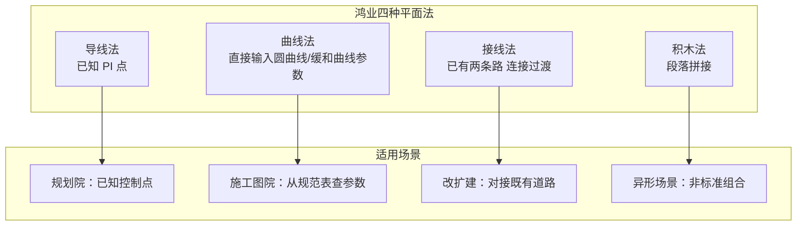
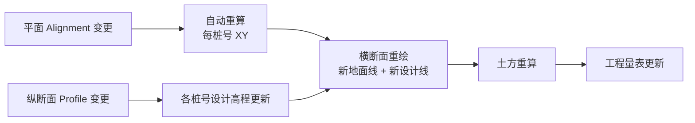

# 鸿业市政道路设计（HY-SZDL 9.0）分析：借鉴与超越

> 导航：[README](./README.md) · [01MASTER 总纲](./01MASTER.md) · [02INDEX 总对比](./02Software_Overview_INDEX.md) · [03RoadSelect 选型](./03RoadSelect.md)

鸿业市政道路（HY-SZDL）是国内市政道路设计领域**覆盖最完整的 AutoCAD 插件**，是 HyCADTool.Refactored 最直接的对标对象。它的优势是"**国标内置 + 全流程覆盖 + 数据联动**"，劣势是"**软件工程陈旧 + 异形场景缺陷多 + UX 沉重**"。深度理解鸿业，能帮 HyCAD 判断哪些功能是"刚需一定要做"，哪些是"鸡肋可以跳过"。

---

## 一、值得借鉴的鸿业核心设计理念

### 1.1 四种平面线形设计法并存

鸿业平面线形支持 4 种建模方式，覆盖不同来源的设计思路：



**HyTool 借鉴**：

v1 至少做 **导线法 + 曲线法** 两种（覆盖 80% 场景），接线法可作为命令级扩展（`hyRoadAlnConnect`），积木法放到 v2。

```csharp
public interface IAlignmentBuilder
{
    IAlignment Build();
}

public sealed class PiPointAlignmentBuilder : IAlignmentBuilder    // 导线法
{
    public IReadOnlyList<Point3d> PiPoints { get; init; }
    public IReadOnlyList<double> Radii { get; init; }
    public IReadOnlyList<double> SpiralParams { get; init; }
}

public sealed class ParametricAlignmentBuilder : IAlignmentBuilder  // 曲线法
{
    public Point3d StartPoint { get; init; }
    public double StartBearing { get; init; }
    public IReadOnlyList<AlignmentEntitySpec> Entities { get; init; }
}

public sealed class ConnectAlignmentBuilder : IAlignmentBuilder     // 接线法
{
    public IAlignment LeadIn { get; init; }
    public IAlignment LeadOut { get; init; }
    public double? MinRadius { get; init; }
}
```

### 1.2 交叉口自动识别与渠化

鸿业最实用的功能之一——**自动识别**两条 Alignment 的交叉关系，自动生成：

1. 四个臂的转角圆弧（参数：转角半径 R、缓和段长度）
2. 进口道展宽（左转展宽 / 右转展宽）
3. 人行横道位置（自动按停止线后退距离定位）
4. 视距三角形
5. 渠化岛（若展宽宽度 > 阈值自动生成）

现有 [`CrosswalkService.cs`](../../HyCADTool.Refactored/Infrastructure/AutoCAD/Services/CrosswalkService.cs) 已经做了交叉臂识别（直线+圆弧拓扑 → `RoadArm`）、人行横道、停止线三项，鸿业这套可以作为功能对齐表：

| 鸿业功能 | HyCAD 现状 | 计划 |
|----------|-----------|------|
| 交叉臂识别 | ✓ `CrosswalkService.RoadArm` | v1 提升到 Domain |
| 转角圆弧 | ✗ 未实现 | v1 新增 `IntersectionService.GenerateCornerArc` |
| 进口展宽 | ✗ | v1 `IntersectionService.GenerateApproachWiden` |
| 人行横道 | ✓ `DrawCrosswalkCommand` | 保留 |
| 停止线 | ✓ `CrosswalkService` | 保留 |
| 视距三角形 | ✗ | v1 `RoadCodeChecker.CheckSightTriangle` |
| 渠化岛 | ✗ | v2 `IntersectionService.GenerateChannelization` |
| 左转待行区 | ✗ | v2（参考 EICAD） |

### 1.3 纵断面多控制点拉坡

鸿业纵断面的建模核心——**多控制点拉坡**：

- 在 EG 地面线上标注控制点（已知标高 / 与管线交叉标高 / 既有道路接线标高）
- 用户拖拽 PVI 动态拉设计线
- 实时显示：最大纵坡 / 最小纵坡 / 竖曲线半径是否满足规范
- 多方案比较（存为不同版本）

**HyTool 借鉴**：纵断面面板必须支持：

1. 既有地面高程点的导入（从 DWG 的 TEXT 实体 / CSV / LandXML）
2. PVI 点的交互式拖拽（在单独的纵断面窗口，或用 Jig）
3. 竖曲线自动插入（对称型，半径按 CJJ 193）
4. **实时规范提示**（超限高亮）

```csharp
public sealed class ProfileEditor
{
    public Profile Current { get; private set; }
    public ObservableCollection<ProfilePvi> Pvis { get; }

    public void AddPvi(Station sta, double elev);
    public void MovePvi(int index, double deltaStation, double deltaElev);
    public void SetVerticalCurveRadius(int pviIndex, double radius);

    public event Action<CodeCheckResult>? OnCodeCheck;   // 实时规范反馈
}
```

### 1.4 横断面模板与地形提取

鸿业横断面的两大特色：

**a）变宽变板块**：允许某车道在桩号段内宽度变化（例如机非分隔带从 1.5m → 3.0m）：

```csharp
public sealed record TemplateParameterTransition(
    string ParameterName,          // "BikeLaneWidth"
    Station StartStation,
    Station EndStation,
    double StartValue,
    double EndValue,
    TransitionKind Kind = TransitionKind.Linear);
```

**b）从数字地形图提取自然高程**：鸿业支持从**等高线 / 高程点 / TIN** 自动采样生成每桩号的自然地面线，并绘制横断面图。

```csharp
public interface ITerrainSampleService
{
    IReadOnlyList<Point3d> SampleCrossSection(
        IAlignment baseline,
        Station station,
        double leftWidth, double rightWidth,
        double interval);
}
```

### 1.5 平纵横+土方数据联动

鸿业最强调的 Slogan：**"修改平面，自动更新横断面与土方"**。



**HyTool 落地**：Domain 层 Corridor 对象的 `Rebuild()` 方法应该**明确 CPU 代价**和**增量粒度**：

```csharp
public interface ICorridor
{
    /// <summary>全量重建。</summary>
    void Rebuild();

    /// <summary>
    /// 增量重建：只重算与 invalidatedStations 相关的 CorridorStation 和后续统计。
    /// </summary>
    void Rebuild(IReadOnlySet<Station> invalidatedStations);

    event Action<CorridorRebuildReport>? OnRebuildComplete;
}
```

### 1.6 CJJ 37 / CJJ 152 规范内置

鸿业的规范参数表都内置（可在"工程设置"里调设计速度档，其他参数自动跟随）：

- CJJ 37 表 3.2.1（设计速度）
- CJJ 37 表 5.3.2（不设超高最小半径）
- CJJ 37 表 6.2.2（最大纵坡）
- CJJ 193 表 4.3.2（竖曲线最小半径）
- CJJ 152 表 4.3.4（交叉口转角半径）

**HyTool 策略**：`RoadCodeChecker` 按**规范标准 + 版本**装载参数表，内置 CJJ 37-2012、CJJ 193-2012、CJJ 152-2010 三版；用户可切换。

```csharp
public interface IRoadCodeStandard
{
    string Name { get; }                   // "CJJ 37-2012"
    DateTime EditionDate { get; }
    IReadOnlyDictionary<string, object> Parameters { get; }   // 按表号+行列编码
    T GetValue<T>(string key);
}
```

### 1.7 超高加宽自动计算

市政道路本身多数不超高，但**匝道 / 立交 / 主路拓宽段**需要。鸿业能按半径自动查表算超高率、算加宽值，并在横断面上用"桥洞"效果展示过渡段。

> 对应 [OpenRoads.md § 1.3](./OpenRoads.md#13-superelevation--独立的-xml-规则工作流)。HyCAD v1 可先做"固定横坡"（超高=0），v2 引入超高。

### 1.8 港湾式公交停靠站

鸿业有专门的港湾站设计工具——输入公交线路 + 站台长度 + 停靠位数，自动生成三段式（减速 + 停靠 + 加速）线形与站台。

**HyTool 策略**：作为 `IntersectionService` 的一个子模块，v2 落地（对应 CJJ 37 § 5.5）。

### 1.9 报错与崩溃是大问题

文献明确指出鸿业的局限：

> "对于非正交的异形交叉口，软件自动提取功能可能报错，需逐桩量取参数后手工输入"
> "处理非对称断面时，需通过增加小板块并设置反坡等技巧实现"
> "盲道、公交站台等平面细部往往无法自动生成，需通过编辑成块进行批量手动添加"

这些正是 HyCAD 可以**超越**的空间。

---

## 二、必须超越鸿业的缺点

### 2.1 异形交叉口崩溃

鸿业假定交叉口为"标准正交"或"小偏转"。对 Y 形、斜交、错位、多岔路口自动识别经常失败。

**HyTool 应对**：

- 交叉口识别基于现有 `CrosswalkService` 的拓扑算法（直线+圆弧求交），支持任意角度
- 异常时 fallback 到**半自动交互模式**（用户点每个臂，软件认）

### 2.2 非对称断面处理笨拙

鸿业的模板机制本质上是"左右镜像"，非对称需要分别定义左右模板，UX 痛苦。

**HyTool 应对**：Template 的 `Left` 与 `Right` 从一开始就独立：

```csharp
public sealed class Template
{
    public IReadOnlyList<TemplatePoint> LeftPoints { get; }
    public IReadOnlyList<TemplatePoint> RightPoints { get; }
    public bool IsSymmetric => ArePointsSymmetric(LeftPoints, RightPoints);
}
```

### 2.3 盲道 / 公交站 / 细部需手工

鸿业的"图块化细部"体验停留在 2010 年水平——双击图块弹框改参数、图块不跟随道路变化。

**HyTool 应对**：利用 HyCADTool 已有"动态块"机制 + 现代 WPF 参数面板，盲道、缘石坡道按**沿线规则**自动布置：

```csharp
public interface ISidewalkAccessibilityService
{
    IReadOnlyList<ObjectId> PlaceTactilePaving(IAlignment a, TactileConfig cfg);
    IReadOnlyList<ObjectId> PlaceCurbRamps(Intersection isec);
}
```

### 2.4 AutoCAD 版本碎片化

鸿业 9.0 明确支持 AutoCAD 2000-2012，但 2015+ 需要单独版本，升级慢。

**HyTool 应对**：HyCADTool.Refactored 目标 AutoCAD 2025+/Civil 3D 2025+，统一 .NET 平台，不重复造低版本兼容。

### 2.5 软件整体性能

大项目（50+ km 道路）鸿业经常出现"打开图纸卡 10 分钟 / 修改一次平面等 30 秒"。

**HyTool 应对**：

- 道路语义与 AutoCAD 实体解耦（数据存 `.roaddesign`，AutoCAD 实体只是视图）
- Corridor 增量重建
- Profile 计算纯 C# Math，速度 100× 于鸿业 COBOL 式的代码

### 2.6 对 BIM 支持空白

鸿业 9.0 没有 IFC / LandXML 支持，生成的都是 2D DWG。

**HyTool 应对**：LandXML v1 必交付，IFC 4.3 v3 交付。

---

## 三、映射到 HyCADTool.Refactored 的设计

### 3.1 功能模块优先级对齐

以鸿业功能为参照，HyCAD 交付三层：

**v1 必交付**（6-8 周）：
- 导线法 / 曲线法 Alignment
- EG Profile 从高程点群提取 + FG Profile 交互式拉坡
- 横断面标准模板（6 种 CJJ 37 典型断面）
- 交叉口转角圆弧 + 展宽（在现有 CrosswalkService 基础上扩展）
- 标线（车道分界 / 导向箭头 / 禁停网格）+ 标志图块
- 桩号 / 标高 / 坐标标注
- 土方粗算（面积-桩号积分）
- CJJ 37/152/193 规范实时校核
- 设计说明（复用 DesignSpecService）+ 路面结构层表 + 工程量表

**v2 增强**（再 4-6 周）：
- 接线法 + 积木法
- 变宽变板块过渡
- 超高加宽
- 港湾式公交站
- 渠化岛 / 左转待行区（参考 EICAD）
- LandXML 导入导出
- 增量走廊重建

**v3 远景**：
- IFC 4.3 Road 导出
- 概念设计工具（参考 InfraWorks）
- BCF 评审（参考 Novapoint）

### 3.2 命令对照表

| 鸿业命令（菜单） | HyCAD 命令 |
|------------------|------------|
| 道路-平面设计-导线法 | `hyRoadAlnByPi` |
| 道路-平面设计-曲线法 | `hyRoadAlnByEntity` |
| 道路-纵断面-建立纵断面 | `hyRoadProf` |
| 道路-纵断面-拉坡 | `hyRoadProfPull` |
| 道路-横断面-建立横断面 | `hyRoadCross` |
| 道路-交叉口-自动处理 | `hyRoadIntersection` |
| 道路-标线-人行横道 | `hyRoad`（已存在，扩展参数） |
| 道路-规范校核 | `hyRoadCheckCode` |
| 道路-工程量统计 | `hyRoadQto` |

### 3.3 `hy-settings.json` 扩展（鸿业启发）

```json
{
  "Road": {
    "CodeStandard": "CJJ 37-2012",
    "DesignSpeed": 50,
    "AllowSuperelevation": false,
    "AllowWidening": false,
    "IntersectionCornerRadius": 20,
    "IntersectionApproachWiden": 0,
    "PublicTransitBayEnabled": false,
    "IncludeCurbRamp": true,
    "IncludeTactilePaving": true
  }
}
```

### 3.4 面板设计草图（"道路"Tab 扩展）

```
┌ 道路 Tab ─────────────────────────────┐
│ ● 总体设置                             │
│   规范标准 [CJJ 37-2012 ▼]             │
│   设计速度 [50  ▼] km/h                │
│   道路等级 [主干路 ▼]                   │
│                                        │
│ ● 平面                                  │
│   [导线法]  [曲线法]  [接线法]         │
│   [编辑 PI]  [加/减 PI]  [清理不连续]  │
│                                        │
│ ● 纵断面                               │
│   [从高程点提取 EG]  [拉设计线]        │
│   [添加 PVI]  [设置竖曲线半径]          │
│                                        │
│ ● 横断面                               │
│   模板 [双向6车道 ▼]  [定制]           │
│   车道宽 [3.5] 非机 [2.5] 人行 [3.0]  │
│                                        │
│ ● 交叉口                               │
│   [识别]  [生成]  [编辑]               │
│   转角半径 [20] 展宽 [1.5]             │
│                                        │
│ ● 标线 / 标志                           │
│   [人行横道]  [停止线]  [车道分界]     │
│   [导向箭头]  [禁停网格]  [标志插入]   │
│                                        │
│ ● 规范校核                             │
│   [校核当前]  报告: 3 项警告 0 项错误  │
│                                        │
│ ● 出图                                  │
│   [平面图]  [纵断面图]  [横断面图]     │
│   [结构层表]  [工程量表]  [设计说明]   │
└────────────────────────────────────────┘
```

---

## 四、总结：借鉴 vs 超越

| 鸿业设计 | 借鉴 | HyCAD 超越 |
|----------|------|-------------|
| 四种平面法并存 | 借鉴（v1 做 2 种，v2 补齐） | UX 统一、共享 Domain |
| 交叉口自动识别+渠化 | 借鉴 | 支持异形交叉口、半自动 fallback |
| 纵断面多控制点拉坡 | 完全借鉴 | WPF 现代面板、实时规范反馈 |
| 横断面变宽变板块 | 借鉴 | 非对称断面原生支持 |
| 从地形图提取高程 | 借鉴 | 多数据源（等高线/点群/LandXML） |
| 平纵横+土方联动 | 借鉴 | Corridor 增量重建（100× 快） |
| CJJ 37/152/193 规范内置 | 完全借鉴 | 规则库 JSON 化，可切版本 |
| 超高加宽计算 | 借鉴 | v2 + 借鉴 OpenRoads 规则库 |
| 港湾式公交站 | 借鉴 | v2 落地 |
| 异形交叉口崩溃 | **避免** | 半自动 fallback |
| 非对称断面笨拙 | **避免** | Left/Right 独立定义 |
| 盲道/公交站手工 | **避免** | 沿线规则自动布置 |
| AutoCAD 版本碎片 | **避免** | 统一 2025+ |
| 性能卡顿 | **避免** | 数据解耦 + 增量重建 |
| BIM 支持空白 | **避免** | LandXML + IFC 4.3 |

---

## 五、与其他对标篇的交叉引用

- [HintCAD.md](./HintCAD.md)：纬地的 BIM 正向设计 vs 鸿业的纯施工图
- [EICAD.md](./EICAD.md)：左转待行区 / 渠化岛的更专业处理
- [TangentRoad.md](./TangentRoad.md)：天正的"国标制图习惯"与鸿业对照
- [Civil3D.md](./Civil3D.md)：国内鸿业与国外 Civil 3D 的功能对照表
- [01MASTER.md § 八](./01MASTER.md#八实施路线-a--b--c三选一由工程师定)：路线 A 基本就是"做一个现代化的鸿业"
