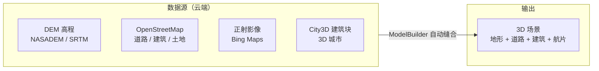

# Autodesk InfraWorks 分析：借鉴与超越

> 导航：[README](./README.md) · [01MASTER 总纲](./01MASTER.md) · [02INDEX 总对比](./02Software_Overview_INDEX.md) · [03RoadSelect 选型](./03RoadSelect.md)

InfraWorks 是 Autodesk 在"**概念设计阶段**"的拳头产品，定位明显区别于 Civil 3D 的"详细/施工图阶段"。核心价值是**以 GIS / 倾斜摄影 / OSM 数据快速搭起一个 30 km² 的城市场景**，在真实地形里拖拽道路中心线，即刻看到 3D 效果。它代表了市政道路设计上游的"**方案快闪**"能力——这是国内鸿业 / 纬地都薄弱的环节。

---

## 一、值得借鉴的 InfraWorks 核心设计理念

### 1.1 Model Builder — 一键生成城市底座

InfraWorks 最震撼的功能：指定一个地理范围矩形，自动从以下数据源**缝合**一个 3D 场景：



10 分钟从"零"到"一个带真实地形、道路、建筑的 3D 城市"。设计师在此基础上**拖拽新道路方案**，实时看到与既有街区的关系。

**HyTool 借鉴**：市政道路方案阶段常需向政府/业主汇报"这条路穿过哪个街区、会遮挡哪栋楼、与现状道路如何衔接"。现状的 `HyCADTool.Refactored` 完全没有这层。**v3+ 可引入**：

```csharp
public interface ISceneContextProvider
{
    Task<DigitalTerrain> FetchTerrainAsync(GeoBounds bounds, CancellationToken ct);
    Task<IReadOnlyList<IFeatureInstance>> FetchOsmFeaturesAsync(GeoBounds bounds, CancellationToken ct);
    Task<ImageRaster> FetchOrthoAsync(GeoBounds bounds, int zoomLevel, CancellationToken ct);
}
```

数据源可以从 OSM API / 天地图 / 高德 / 腾讯地图 / 国内测绘 API 接入。

### 1.2 概念设计的"零参数"道路绘制

InfraWorks 允许用户用一条"**设计路**"工具，在 3D 场景里点几个点，自动生成：

- 合理的平面线（自动插入圆曲线 / 缓和曲线）
- 合理的纵断面（跟随地形，自动找坡度 < 6%）
- 默认的横断面（按道路等级选配）
- 三维路面与土方

**然后**设计师可以：

- 调整道路等级（Street / Arterial / Highway）→ 整条路的横断面换一套
- 调整设计速度 → 最小半径自动重算
- 拖动平面节点 → 纵断面与横断面联动

**关键价值**：在方案阶段，**参数合理性由软件默认提供**，设计师只做决策不做数据录入。

**HyTool 借鉴**：命令 `hyRoadQuickDraft` —— 在 AutoCAD 里选几个点，按预设道路等级快速生成完整的道路设计骨架：

```csharp
public sealed record QuickDraftRequest(
    IReadOnlyList<Point3d> ControlPoints,
    RoadFunctionalClass Class,          // 主干路 / 次干路 / 支路 / 快速路
    double DesignSpeed,                 // km/h
    ExistingTerrain? Terrain);

public sealed class RoadQuickDraftService
{
    public RoadDesign Draft(QuickDraftRequest req);
    //  - 按点集生成 Alignment（自动在拐点插缓+圆+缓）
    //  - 按设计速度取默认横断面模板
    //  - 若有 Terrain，生成默认 FG Profile（匹配填挖平衡）
    //  - 否则生成 0% 平坡 FG Profile
}
```

### 1.3 Proposal / Scenario — 多方案对比

InfraWorks 的 **Proposal**：同一个基础场景下维护多个方案：

```
Base Scenario
├── Proposal A: 6 车道拓宽方案
├── Proposal B: 4 车道 + BRT 方案
└── Proposal C: 地下通道方案
```

每个 Proposal 对模型的修改都是**差分式**的，可以切换对比。

**HyTool 借鉴**：

```csharp
public sealed class RoadScenarioContainer
{
    public RoadDesign BaseScenario { get; }
    public IReadOnlyList<RoadProposal> Proposals { get; }
    public void SwitchTo(string proposalId);
    public ScenarioComparison Compare(string a, string b);
}

public sealed class RoadProposal
{
    public string Id { get; }
    public string Name { get; }
    public IReadOnlyList<IModelPatch> Patches { get; }   // 相对 Base 的差分
}
```

多方案比选场景对市政项目**极其高频**（政府方案汇报），这个功能放 v2 有明确价值。

### 1.4 Style / Rule Style — 样式即规则

InfraWorks 所有道路样式由 **Style** 定义，Style 本身可以根据属性**条件化**：

```
Road Style "City Default"
  When FunctionalClass = Arterial AND NumberOfLanes >= 4:
    Use Asset: "Six-Lane Arterial"
    Line Color: #808080
    Show Lane Markings: true
  When FunctionalClass = Local:
    Use Asset: "Two-Lane Local"
    Line Color: #c0c0c0
    Show Lane Markings: false
```

这种 **Rule-based Style** 把"属性 → 外观"解耦，是 GIS 系统（ArcGIS Rule-Based Symbology）的老传统。

**HyTool 借鉴**：一种**道路样式规则引擎**，根据 Feature 属性自动选图层/颜色/标注：

```csharp
public interface IRoadStyleRule
{
    bool Matches(IFeatureInstance feature);
    RoadVisualStyle Apply(IFeatureInstance feature);
}

public sealed class RoadStyleRuleSet
{
    public IReadOnlyList<IRoadStyleRule> Rules { get; }    // 按优先级顺序
    public RoadVisualStyle Resolve(IFeatureInstance feature);   // 首个匹配规则胜出
}

public sealed record RoadVisualStyle(
    string Layer,
    short? Color,
    string? LinetypeName,
    double LineWeight,
    string? MarkingPattern);
```

配置位于 `hy-settings.json` → `RoadStyleRules`，或独立 `road-styles.json`。

### 1.5 Bridge Conceptual Design — 概念桥梁与市政道路的衔接

InfraWorks 2026 在桥梁方面增强了 Girder Design（大梁）和 Vertical Pier Placement（桥墩放置）。**市政道路常要穿越河道 / 跨越铁路**，需要概念桥方案：

```csharp
public interface IConceptualBridgeService
{
    ConceptualBridge PlaceBridge(
        Alignment roadAlignment,
        Station start, Station end,
        BridgeTypology typology);   // BeamBridge / ArchBridge / CableStayed
}
```

> v3+ 目标。现阶段 HyCADTool.Refactored 已有桥梁相关的工程服务（`EquipmentFoundationService` 等），但尚未形成"桥梁构件 + 道路 Alignment 联动"。

### 1.6 Grading — 场地坡度与排水设计

Grading 面板让设计师画一条边界线 + 指定目标坡度，自动计算场地填挖方量。对市政道路**常见的 Y 形交叉口、立交桥头场地**很有用。

**HyTool 借鉴**（v3+）：

```csharp
public interface IGradingService
{
    GradingResult Grade(
        Polyline2d boundary,
        GradingCriteria criteria);   // TargetElevation / SlopeToSurface / DaylightAt
}
```

### 1.7 Traffic Simulation — 动静态交通仿真（对接 Vissim）

InfraWorks 通过 **Traffic Simulation** 工具与 PTV Vissim 对接，可在方案阶段快速评估交叉口的服务水平、排队长度、延误。

**HyTool 借鉴**：**暂不直接做**，但为未来接入仿真工具预留接口——Feature Catalog 中记录渠化 / 信号周期 / 车道功能等属性，可被仿真工具消费。

---

## 二、必须超越 InfraWorks 的缺点

### 2.1 概念与详细设计脱节（最大痛点）

InfraWorks 做方案非常快，但**一旦要出施工图**，必须把模型导到 Civil 3D（通过 Data Shortcut），再从头细化——中间数据丢失严重，工程师普遍反映"用 InfraWorks 越做越后悔"。

**HyTool 应对**：**方案与施工图共用同一 Domain 模型**。`hyRoadQuickDraft` 生成的 `RoadDesign` 对象直接可以在同一面板里深化参数、出施工图。**零切换**。

### 2.2 对 AutoCAD 不友好

- 视图只能在 InfraWorks 独立窗口里
- 输出 DWG 是粗糙的 Proxy 对象

**HyTool 应对**：扎根 AutoCAD 原生视图，方案图可以与施工图在同一个 DWG 里。

### 2.3 高精度测绘数据集成弱

ModelBuilder 依赖全球低精度数据（SRTM 30m 精度），中国城市的"1:500 地形图 + 控制点" 流程无法对接。

**HyTool 应对**：

- 支持从 DWG 高程点云 / 等高线提取地形
- 支持 LandXML / XYZ / CASS 交换格式
- 天地图 API / 国内正射影像作为次优数据源

### 2.4 云端订阅模式

InfraWorks 模型必须上传 Autodesk 云 → BIM 360 协同，数据合规性对国内涉密项目是红线。

**HyTool 应对**：纯本地，数据不出机。

### 2.5 本地化差

- 术语全英文或机翻
- 中国道路等级体系（快速路 / 主干路 / 次干路 / 支路）不被一等公民支持
- CJJ 37 的"设计速度分级"不是默认选项

**HyTool 应对**：中文术语 + CJJ 37 分级。

---

## 三、映射到 HyCADTool.Refactored 的设计

### 3.1 命令挂点

| 命令 | 功能 | InfraWorks 对应 |
|------|------|-----------------|
| `hyRoadQuickDraft` | 从几个点快速生成完整道路设计 | 设计路工具 |
| `hyRoadProposal` | 方案比选管理器（v2） | Proposal |
| `hyRoadStyleRule` | 样式规则管理器（v2） | Style |
| `hyRoadGrading` | 场地坡度设计（v3） | Grading |

### 3.2 `hy-settings.json` 道路等级默认断面映射

```json
{
  "Road": {
    "ClassDefaults": {
      "主干路": {
        "LaneCount": 6,
        "LaneWidth": 3.5,
        "BikeLaneWidth": 3.0,
        "SidewalkWidth": 3.5,
        "GreenBeltWidth": 2.0,
        "MedianWidth": 2.5,
        "DesignSpeed": 50
      },
      "次干路": {
        "LaneCount": 4,
        "LaneWidth": 3.5,
        "BikeLaneWidth": 2.5,
        "SidewalkWidth": 3.0,
        "GreenBeltWidth": 1.5,
        "MedianWidth": 0,
        "DesignSpeed": 40
      },
      "支路": {
        "LaneCount": 2,
        "LaneWidth": 3.25,
        "BikeLaneWidth": 2.0,
        "SidewalkWidth": 2.5,
        "GreenBeltWidth": 0,
        "MedianWidth": 0,
        "DesignSpeed": 30
      },
      "快速路": {
        "LaneCount": 8,
        "LaneWidth": 3.75,
        "BikeLaneWidth": 0,
        "SidewalkWidth": 0,
        "GreenBeltWidth": 3.0,
        "MedianWidth": 4.0,
        "DesignSpeed": 80
      }
    }
  }
}
```

### 3.3 `hyRoadQuickDraft` 的算法骨架

```csharp
public RoadDesign Draft(QuickDraftRequest req)
{
    // 1. 平面线位
    var alignment = BuildAlignmentFromPoints(
        req.ControlPoints,
        minRadius: MinRadiusFor(req.DesignSpeed),       // CJJ 37 表 5.3.2
        spiralParamMin: SpiralParamMinFor(req.DesignSpeed));

    // 2. 纵断面
    Profile profile = req.Terrain is null
        ? BuildFlatProfile(alignment, elevation: 0.0)
        : FitProfileToTerrain(alignment, req.Terrain, maxGrade: MaxGradeFor(req.Class));

    // 3. 横断面模板
    var template = LoadTemplate($"municipal-{req.Class.ToCode()}.hytpl");

    // 4. 走廊
    var corridor = new Corridor(alignment, profile, new[] { new TemplateDrop(alignment.StartStation, template) });

    // 5. 交叉口 placeholder（如果 ControlPoints 里有分叉）
    var intersections = DetectIntersections(req.ControlPoints);

    return new RoadDesign(alignment, profile, template, corridor, intersections);
}
```

### 3.4 Proposal 比选面板（v2 草案）

```
┌ 道路方案管理 ──────────────────────────┐
│ Base Scenario：K 路基础方案             │
│                                         │
│ ☑ Proposal A：6 车道拓宽   ★ 当前       │
│    指标：总长 1234m / 总宽 40m          │
│    土方：填 1200m³ 挖 800m³             │
│                                         │
│ ☐ Proposal B：4 车道 + BRT              │
│    指标：总长 1234m / 总宽 32m          │
│    土方：填 900m³ 挖 500m³              │
│                                         │
│ ☐ Proposal C：地下通道                  │
│                                         │
│ [切换到]  [对比]  [新建]  [复制]  [删除] │
└─────────────────────────────────────────┘
```

### 3.5 InfraWorks 的"场景数据 + 概念设计 + 施工图"完整管线的 HyCAD 简化版


---

## 四、总结：借鉴 vs 超越

| InfraWorks 设计 | 借鉴 | HyCAD 超越 |
|-----------------|------|-------------|
| Model Builder 城市底座 | 借鉴理念 | v3+ 引入，数据源接国内 API |
| 零参数概念道路 | 完全借鉴 | `hyRoadQuickDraft`，参数取自 CJJ 默认 |
| Proposal 多方案 | 借鉴 | v2 落地 |
| Rule-based Style | 借鉴 | JSON 规则 + 面板管理 |
| 概念桥梁设计 | 借鉴 | v3+ 落地 |
| Grading 场地 | 借鉴 | v3+ 落地 |
| Traffic Simulation 对接 | 暂不做 | Feature Catalog 预留属性 |
| 概念与详细脱节 | **避免** | 方案与施工图共用 Domain 模型 |
| AutoCAD 不友好 | **避免** | 扎根 AutoCAD 原生 |
| 全球低精度数据 | **避免** | 支持 DWG 高精度地形数据 |
| 云端订阅 | **避免** | 纯本地 |
| 英文 UX | **避免** | 中文 + CJJ 37 |

---

## 五、与其他对标篇的交叉引用

- [Civil3D.md](./Civil3D.md)：InfraWorks → Civil 3D 的"概念到详细"断链
- [Novapoint.md](./Novapoint.md)：场景上下文与 Feature Catalog 的关系
- [QGIS_GIS.md](./QGIS_GIS.md)：Model Builder 的 GIS 数据来源
- [01MASTER.md § 八](./01MASTER.md#八实施路线-a--b--c三选一由工程师定)：路线 C 的"方案 v1 → 参数化走廊 v2"阶段
