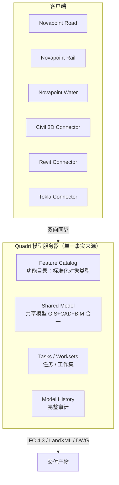

# Trimble Novapoint + Quadri 分析：借鉴与超越

> 导航：[README](./README.md) · [01MASTER 总纲](./01MASTER.md) · [02INDEX 总对比](./02Software_Overview_INDEX.md) · [03RoadSelect 选型](./03RoadSelect.md)

Novapoint 是 Trimble 的北欧派道路/铁路/市政 BIM 建模软件，其核心差异化是**与 Quadri 模型服务器的深度协同**——多专业（道路、桥梁、隧道、水务、铁路）在一个**单一事实来源**的模型服务器上并行工作，这是 Civil 3D / OpenRoads 单机 + 文件参考范式的根本超越。对市政道路多专业协同，Novapoint / Quadri 的思路最值得借鉴。

---

## 一、值得借鉴的 Novapoint 核心设计理念

### 1.1 Quadri — 以"模型服务器"替代"文件"



**关键机制**：

1. **Feature Catalog**：所有对象类型（道路中心线、车道边线、路缘石、绿化带、管线、桥墩）都有**全局定义**。不同专业往同一个 Shared Model 里塞数据，塞的都是"同一种对象"。
2. **Bidirectional Connector**：Novapoint Road 里改 Alignment → 几秒后 Quadri 里更新 → 桥梁专业打开 Quadri 看到最新 → 桥墩位置冲突自动高亮。
3. **Task 工作流**：任务粒度到"对某段桩号的修改"，每个 Task 可以独立 Check-In / Check-Out。
4. **Version History**：模型像 Git 一样有完整提交历史，可回滚到任意版本。

**映射到 HyTool**（长远愿景）：

```csharp
public interface IRoadModelServer
{
    Task<RoadModel> CheckOutAsync(RoadModelQuery query, CancellationToken ct);
    Task<CommitResult> CommitAsync(RoadModelPatch patch, CancellationToken ct);
    Task<ConflictReport> DetectConflictsAsync(RoadModel local, CancellationToken ct);
    IAsyncEnumerable<RoadModelEvent> SubscribeAsync(string scope, CancellationToken ct);
}
```

> **现实约束**：市政道路 HyCAD v1 / v2 不具备做模型服务器的工期与目标用户场景。但**"可 diff / 可回滚"的设计哲学可以从第一天落地**——`.roaddesign` 文件用 JSON/protobuf，配合 git 或内置快照机制即可。

### 1.2 Feature Catalog — 对象类型的"宪法"

Novapoint 强制每个对象挂一个 **Feature Class**，所有属性结构化：

```
Feature Class: Road_Centerline
  Attributes:
    - FunctionalClass: Enum (Freeway / Arterial / Collector / Local)
    - DesignSpeed: Number (km/h)
    - NumberOfLanes: Integer
    - PavementType: Enum (Asphalt / Concrete)
  Geometry: 3D Polyline
```

```
Feature Class: Road_Pavement_Layer
  Attributes:
    - LayerType: Enum (Surface / Binder / Base / Subbase)
    - Material: String
    - Thickness: Number (m)
  Geometry: 3D Surface
```

**价值**：

1. 属性成为**一等公民**，不是 AutoCAD XData 或 Extension Dictionary 那种弱类型扩展
2. 对象天然进入 GIS 查询范围（"找所有设计速度 > 50 的主干路"）
3. IFC 4.3 映射水到渠成

**映射**：

```csharp
public interface IFeatureClass
{
    string Code { get; }                       // "Road_Centerline"
    string DisplayName { get; }
    IReadOnlyDictionary<string, AttributeDef> Attributes { get; }
    GeometryKind GeometryKind { get; }
}

public interface IFeatureInstance
{
    IFeatureClass Class { get; }
    IReadOnlyDictionary<string, object> Values { get; }
    object Geometry { get; }                   // Point3d / Polyline3d / MeshSurface
    string HandleInCAD { get; }                // 与 AutoCAD Handle 的映射
}
```

### 1.3 Trimble Drawing — 2D/3D CAD 双向同步

Novapoint 2024+ 推出的 **Trimble Drawing** 模块：

- 从 Quadri 模型**自动生成**平面图 / 纵断面图 / 横断面图 DWG
- DWG 里改注释 / 标签，变更可**回写**到 Quadri
- 避免 Civil 3D "Data Shortcut" 那种单向引用的脆弱

**映射**（v2+）：

```csharp
public interface IRoadDrawingGenerator
{
    Task<DrawingPackage> GeneratePlanAsync(IAlignment a, PlanOptions opt);
    Task<DrawingPackage> GenerateProfileAsync(Profile p, ProfileOptions opt);
    Task<DrawingPackage> GenerateCrossSectionsAsync(Corridor c, CrossSectionOptions opt);
    Task<UpdateResult> ApplyAnnotationChangesAsync(DrawingPackage pkg);
}
```

### 1.4 LandXML 1.2 — 互操作的"世界语"

Novapoint 对 LandXML 1.2 的支持是业界最完整之一，几乎可以无损导入/导出 Civil 3D / OpenRoads / 12d Model 的 Alignment + Profile + Surface + CrossSects。

LandXML 本质是"道路工程的 DXF"：

```xml
<LandXML version="1.2">
  <CoordinateSystem epsgCode="4544"/>
  <Alignments>
    <Alignment name="K路" length="1234.567" staStart="0">
      <CoordGeom>
        <Line length="100.0" startStation="0">
          <Start>500000.0 4000000.0</Start>
          <End>500100.0 4000000.0</End>
        </Line>
        <Curve length="200.0" radius="500" rot="ccw" ...>
          ...
        </Curve>
      </CoordGeom>
      <Profile>
        <ProfAlign>
          <PVI>0 100.0</PVI>
          <PVI>500 102.5</PVI>
          ...
        </ProfAlign>
      </Profile>
      <CrossSects>...</CrossSects>
    </Alignment>
  </Alignments>
  <Surfaces>
    <Surface name="EG">...</Surface>
  </Surfaces>
</LandXML>
```

**HyTool 策略**：LandXML 1.2 的导入/导出是 v1 **必交付**，这是 HyCAD 道路设计与其他软件互通的唯一低成本通道。

### 1.5 IFC 4.3 Road — BIM 国际标准

Novapoint 2023+ 导出 IFC 4.3，对接 Tekla Civil、Revit、SYNCHRO。IFC 4.3 正式定义：

- `IfcAlignment` / `IfcAlignmentHorizontal` / `IfcAlignmentVertical` / `IfcAlignmentCant`（超高）
- `IfcRoad` / `IfcRoadPart`（车行道 / 人行道 / 中央分隔带 / 硬路肩）
- `IfcCourse`（路面结构层）

**HyTool 策略**：v3+ 目标，但 Domain 模型设计要为 IFC 4.3 预留映射表。

### 1.6 BCF（BIM Collaboration Format）— 评审工作流

Quadri 与 Trimble Connect 集成，BCF Issue 作为协同的**任务载体**：

1. 桥梁专业在 Quadri 里看到 Alignment 与桥墩冲突
2. 创建 BCF Issue，截图 + 位置标记 + @道路负责人
3. 道路负责人在自己的 Novapoint 里调整 Alignment
4. 回帖 Resolved → BCF Issue 关闭

**HyTool 策略**（远期）：面板内置 BCF 导出能力，工程师可把审查意见连同截图 + 模型位置一并送给外部评审人。

---

## 二、必须超越 Novapoint 的缺点

### 2.1 Quadri 部署门槛

- Quadri for Windows（本地）/ Quadri Cloud（云端）都需要服务器资源
- 小型设计院 / 单人项目基本用不上
- 连接器配置复杂

**HyTool 应对**：第一性原理回到**单机 + 文件**——`.roaddesign` 为单一事实来源，用 git 或本地快照作为版本控制，满足 95% 场景。

### 2.2 北欧专用词汇 / UX

- 术语与流程带明显北欧工程文化（Statens Vegvesen、SVV 标准优先）
- 交叉口、渠化的中国习惯场景不是一等公民

**HyTool 应对**：术语全中文 + CJJ 系列规范为一等公民。

### 2.3 对 AutoCAD 的依赖通过 Trimble Drawing 间接达成

Novapoint 原生是 MicroStation 栈，Trimble Drawing 是对 AutoCAD 用户的"和解"但非母语。

**HyTool 应对**：AutoCAD 插件路径，直接住进国内设计师的主力环境。

### 2.4 Feature Catalog 定制复杂

企业想自定义 Feature Class 需要通过 Quadri Admin 工具维护，曲线陡。

**HyTool 应对**：Feature Class 用 JSON 文件定义，用户在 `hy-settings.json` 或专门的 `feature-catalog.json` 里加一行即可。

### 2.5 价格高昂

Novapoint + Quadri 的组合每席位年费数万欧元级。

**HyTool 应对**：随 AutoCAD 使用，无额外授权。

---

## 三、映射到 HyCADTool.Refactored 的设计

### 3.1 核心借鉴点与落地

| Novapoint/Quadri 设计 | HyCAD 落地 | 阶段 |
|----------------------|------------|------|
| 单一事实来源 | `.roaddesign` 单文件 + DWG 视图 | v1 |
| Feature Catalog | `feature-catalog.json` 中定义道路对象类型与属性 | v1 |
| LandXML 导入/导出 | `ILandXmlPort` 接口 + CJJ 习惯映射 | v1 |
| Trimble Drawing 平纵横一键出图 | `IRoadDrawingGenerator` | v2 |
| BCF 评审 | `IRoadReviewService`（导出 BCF ZIP） | v3 |
| IFC 4.3 Road | `IIfcRoadPort` | v3 |
| Quadri 模型服务器 | 不直接做，但 Domain 设计要支持未来接入 | v4+ |

### 3.2 Feature Catalog 样例

`HyCADTool.Refactored/Infrastructure/Configuration/feature-catalog.json`：

```json
{
  "version": "1.0",
  "features": [
    {
      "code": "Road_Centerline",
      "displayName": "道路中心线",
      "geometryKind": "Alignment",
      "attributes": {
        "FunctionalClass": { "type": "enum", "values": ["主干路", "次干路", "支路", "快速路"], "required": true },
        "DesignSpeed":      { "type": "number", "unit": "km/h", "min": 20, "max": 120, "required": true },
        "NumberOfLanes":    { "type": "integer", "min": 1, "max": 8 },
        "PavementType":     { "type": "enum", "values": ["沥青混凝土", "水泥混凝土"] }
      }
    },
    {
      "code": "Road_Pavement_Layer",
      "displayName": "路面结构层",
      "geometryKind": "Surface",
      "attributes": {
        "LayerType":   { "type": "enum", "values": ["面层", "基层", "底基层", "垫层"] },
        "Material":    { "type": "string" },
        "Thickness":   { "type": "number", "unit": "mm" }
      }
    },
    {
      "code": "Road_Crosswalk",
      "displayName": "人行横道",
      "geometryKind": "Region",
      "attributes": {
        "Width":   { "type": "number", "unit": "m", "default": 5.0 },
        "StripeSpacing": { "type": "number", "unit": "m", "default": 1.0 }
      }
    }
  ]
}
```

### 3.3 LandXML 导入导出（v1 必交付）

```csharp
namespace HyCADTool.Refactored.Infrastructure.AutoCAD.Services.Road;

public interface ILandXmlPort
{
    Task<RoadDesign> ImportAsync(string path, LandXmlImportProfile profile, CancellationToken ct);
    Task ExportAsync(RoadDesign design, string path, LandXmlExportProfile profile, CancellationToken ct);
}

public sealed class LandXmlImportProfile
{
    public string TargetEpsg { get; init; } = "EPSG:4544";   // CGCS2000 3° 高斯-克吕格第 33 度带
    public bool ImportSurfaces { get; init; } = true;
    public bool ImportCrossSections { get; init; } = false;
}
```

### 3.4 命令挂点

| 命令 | 功能 |
|------|------|
| `hyRoadImportLandXml` | 导入 LandXML 到当前道路设计 |
| `hyRoadExportLandXml` | 导出当前道路设计到 LandXML |
| `hyRoadFeatureBrowser` | 打开 Feature Catalog 浏览器（v2） |
| `hyRoadGenDrawings` | 平/纵/横一键出图（v2） |
| `hyRoadExportBcf` | 导出 BCF 审查包（v3） |
| `hyRoadExportIfc` | 导出 IFC 4.3（v3） |

### 3.5 版本历史的落地（不依赖 Quadri）

```csharp
public sealed class RoadDesignSnapshot
{
    public string Id { get; }                // Guid 或时间戳
    public DateTime CreatedAt { get; }
    public string Author { get; }
    public string Message { get; }           // git 风格 commit message
    public string PreviousId { get; }        // 父快照
    public RoadDesign Model { get; }         // 全量模型（未来可改增量）
}

public interface IRoadDesignHistoryService
{
    Task<string> CommitAsync(RoadDesign current, string message, CancellationToken ct);
    Task<RoadDesign> CheckoutAsync(string snapshotId, CancellationToken ct);
    IReadOnlyList<RoadDesignSnapshot> Log(int count = 20);
}
```

快照存储位置：项目目录 `_snapshots/`，文件名 `{timestamp}-{author}.rdsn`。

---

## 四、总结：借鉴 vs 超越

| Novapoint / Quadri 设计 | 借鉴 | HyCAD 超越 |
|-------------------------|------|-------------|
| Quadri 模型服务器 | 借鉴"单一事实来源"哲学 | 简化为单文件 + 本地快照 |
| Feature Catalog 强类型对象 | 完全借鉴 | JSON 文件定义，开箱即用 |
| LandXML 1.2 完整支持 | 完全借鉴 | v1 必交付 + CJJ 习惯映射 |
| Trimble Drawing 平纵横一键出图 | 借鉴 | v2 落地，复用现有 Paper/*.cs 排版 |
| IFC 4.3 Road | 借鉴 | v3 落地，Domain 预留映射 |
| BCF 评审工作流 | 借鉴 | v3 落地 |
| 双向 Connector | 部分借鉴 | v1 不做（单机模型） |
| 部署门槛高 | **避免** | 单机 + 文件 |
| 北欧 UX | **避免** | 中文 + CJJ 为一等公民 |
| 高许可费 | **避免** | 随 AutoCAD |

---

## 五、与其他对标篇的交叉引用

- [Civil3D.md](./Civil3D.md)：Quadri vs Civil 3D Data Shortcut 的协作模型对比
- [QGIS_GIS.md](./QGIS_GIS.md)：Feature Class 与 GIS 矢量图层的对齐
- [03RoadSelect.md](./03RoadSelect.md)：Feature Catalog 如何支撑 HyCAD 的规则选择维度
