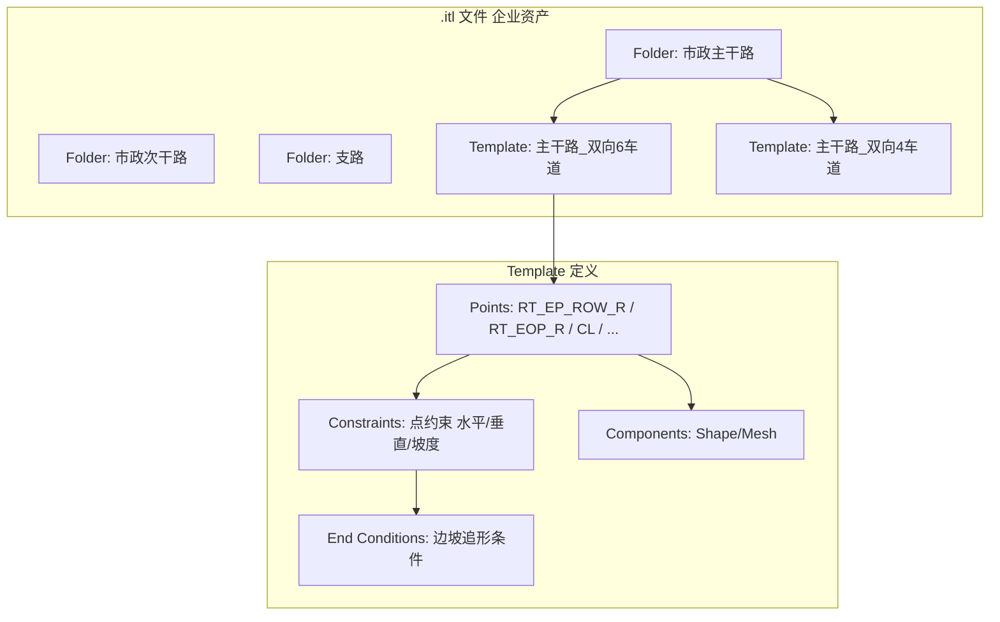
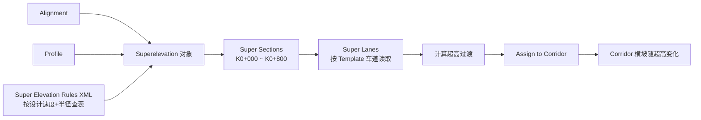

# Bentley OpenRoads Designer 分析：借鉴与超越

> 导航：[README](./README.md) · [01MASTER 总纲](./01MASTER.md) · [02INDEX 总对比](./02Software_Overview_INDEX.md) · [03RoadSelect 选型](./03RoadSelect.md)

OpenRoads Designer（ORD）是 Bentley 基于 MicroStation 的道路设计旗舰产品，与 Civil 3D 分庭抗礼。与 Civil 3D 相比，ORD 的三大差异化设计是：**Template Library（.itl）取代 Subassembly PKT**、**Civil Cells（规则化单元）**、**超高计算作为独立工作流并以 XML 规则驱动**。对大型公路/铁路/市政项目，ORD 的"企业规范化"能力明显强于 Civil 3D。

---

## 一、值得借鉴的 OpenRoads 核心设计理念

### 1.1 Template Library — 断面模板的集中治理

ORD 所有横断面模板集中在 `.itl` 文件（ITL = Inroads Template Library 的继承命名），这个库是一个**企业级资产**，常由 DOT / 设计院的 BIM 负责人维护：



**关键设计**：

1. **点（Point）命名约定**：`RT_EOP_R` = Right Edge Of Pavement Right 侧，这套命名本身就是行业语言
2. **点约束（Constraint）**：每个点可以有 Horizontal / Vertical / Slope / Vector-Offset / Project-To-Surface 等约束，形成一个**几何求解图**
3. **End Condition**：边坡追形——向外找 Surface，找到为止，是"规则驱动"思想的巅峰
4. **版本化 & 分发**：`.itl` 文件可以签入企业 ProjectWise，类似代码库管理

**映射到 HyTool**：

```csharp
public sealed class TemplateLibrary
{
    public string FilePath { get; }                              // *.hytpl（建议用 JSON/protobuf）
    public IReadOnlyList<TemplateFolder> Root { get; }
    public ITemplate? Find(string path);                         // "市政主干路/主干路_双向6车道"
}

public sealed class Template
{
    public string Name { get; }
    public IReadOnlyList<TemplatePoint> Points { get; }
    public IReadOnlyList<TemplateConstraint> Constraints { get; }
    public IReadOnlyList<TemplateEndCondition> EndConditions { get; }
    public IReadOnlyList<TemplateComponent> Components { get; }
}

public sealed record TemplatePoint(
    string Code,                // "RT_EOP_R"
    PointFlags Flags,
    Vector3d InitialOffset);    // 相对 Baseline 的初始偏移

public abstract record TemplateConstraint(TemplatePoint Target, TemplatePoint Source)
{
    public sealed record Horizontal(TemplatePoint Target, TemplatePoint Source, double Value) : TemplateConstraint(Target, Source);
    public sealed record Vertical(TemplatePoint Target, TemplatePoint Source, double Value) : TemplateConstraint(Target, Source);
    public sealed record Slope(TemplatePoint Target, TemplatePoint Source, double Value) : TemplateConstraint(Target, Source);
    public sealed record ProjectToSurface(TemplatePoint Target, string SurfaceName) : TemplateConstraint(Target, Target);
}
```

### 1.2 Corridor = Template Drop 序列

ORD 的 Corridor 不是"一个 Assembly 扫掠"，而是"**沿桩号投下 N 个 Template Drop**"：

```
Corridor "K路"
  ├── Template Drop @ K0+000 → Template "主干路_双向6车道"
  ├── Template Drop @ K0+500 → Template "主干路_双向4车道"（缩减断面）
  ├── Template Drop @ K0+800 → Template "主干路_双向6车道"（恢复）
  └── Interval 2.0m  （采样步长）
```

两个 Template Drop 之间，点位按**线性插值**（或用户指定的曲线）过渡——这是 ORD 处理**加宽段/过渡段**最自然的机制。

**映射**：

```csharp
public sealed class Corridor
{
    public IAlignment Baseline { get; }
    public Profile DesignProfile { get; }
    public IReadOnlyList<TemplateDrop> Drops { get; }
    public double Interval { get; }   // 采样步长 m
}

public sealed record TemplateDrop(
    Station At,
    Template Template,
    TransitionKind Transition = TransitionKind.Linear);

public enum TransitionKind { Linear, Parabolic, None /* 硬切换 */ }
```

### 1.3 Superelevation — 独立的 XML 规则工作流

超高是 ORD 最严谨的模块：超高不存在"模板里"，而是**独立的对象**，通过 XML 规则文件（`.xml`）计算：



**关键价值**：

1. 规范（AASHTO / Eurocode / JTG / **CJJ 37**）对"设计速度 vs 半径 vs 超高率"都是查表，XML 规则天然适配
2. 超高独立于模板，可以在不改动 Template 的情况下换规范
3. 过渡段（Runoff / Runout）的长度计算复杂，XML 规则托管

**映射**：

```csharp
public interface ISuperelevationRuleSet
{
    string StandardName { get; }                 // "CJJ 37-2012"
    double GetSuperRate(double designSpeed, double radius);
    double GetRunoffLength(double designSpeed, double lanes, double superRate);
    double GetRunoutLength(double designSpeed);
}

public sealed class CJJ37SuperRules : ISuperelevationRuleSet
{
    // 按 CJJ 37 表 5.3.5 内置查表
}

public sealed class SuperelevationService
{
    public SuperelevationDesign Design(
        IAlignment a, Profile p,
        ISuperelevationRuleSet rules,
        IReadOnlyList<LaneDefinition> lanes);
}
```

> HyCADTool 市政道路设计速度多在 30-60 km/h，平曲线半径通常满足"不设超高"。但**匝道 / 立交 / 上跨桥匝道**会用到超高，这模块对 v2 价值大。

### 1.4 Civil Cells — 规则化的"道路积木"

Civil Cell 是 ORD 最独特的设计：**把一整套交叉口 / 立交 / 收费站等复杂几何打包成可复用的参数化单元**：

```
Civil Cell "十字交叉口_四向信号控制_主次干路"
  Parameters:
    - 主路 Alignment (选择)
    - 次路 Alignment (选择)
    - 转角半径 R (15 ~ 30 m)
    - 人行横道宽度 (3 ~ 6 m)
    - 进口道展宽长度
    - 人行横道通过区距离
  Contents:
    - 转角圆弧 × 4
    - 人行横道 × 4
    - 停止线 × 4
    - 渠化岛 × (根据参数决定 0-4)
    - 标线 / 箭头
```

**价值**：交叉口标准图的复用性极高，每个 DOT / 设计院都有一套"院级图库"，Civil Cell 完美承载这个需求。

**映射（v2 重点）**：

```csharp
public interface ICivilCell
{
    string Name { get; }
    IReadOnlyDictionary<string, ParameterDef> Parameters { get; }
    CivilCellResult Place(CivilCellInvocation invocation);
}

public sealed class CivilCellInvocation
{
    public IReadOnlyDictionary<string, IAlignment> AlignmentInputs { get; }
    public IReadOnlyDictionary<string, object> Values { get; }
    public Point3d Anchor { get; }
}

public sealed class IntersectionCrossCell : ICivilCell   // 十字交叉口
{
    // 参数化生成交叉口的所有几何元素
}
```

### 1.5 Parametric Constraints / Point Controls — 部件参数化控制

Corridor 级的参数化控制，两种方式：

| 机制 | 作用 | Civil 3D 对应 |
|------|------|---------------|
| **Parametric Constraint** | 覆写 Template 内部的一个 Constraint 值（按桩号区间） | Subassembly Parameter Override |
| **Point Control** | 把 Template 的某个 Point 控制到外部对象（Alignment / Feature Line / Surface） | Target Mapping |

```csharp
public sealed record ParametricConstraintOverride(
    string TemplatePointCode,
    string ConstraintName,
    Station Start,
    Station End,
    double StartValue,
    double EndValue);

public sealed record PointControlBinding(
    string TemplatePointCode,
    PointControlKind Kind,            // Horizontal / Vertical / Both / Project
    object Target,                    // IAlignment / IFeatureLine / ISurface
    Station Start,
    Station End);
```

### 1.6 DGN 工作目录结构 — 工程化治理

ORD 的项目结构强制：

```
Project/
├── GeometricSurvey.dgn       (地形 / 测量 DGN)
├── Alignments.dgn            (所有 Alignment)
├── Profiles.dgn              (所有 Profile)
├── Corridors.dgn             (所有 Corridor)
├── Drawings/
│   ├── PlanSheet.dgn
│   └── ProfileSheet.dgn
└── _libraries/
    ├── Templates.itl
    └── Super.xml
```

**References（参考附着）**：每个 DGN 按需引用别的 DGN，而不是把所有东西塞到一个文件。**多人并行编辑**天然支持。

**HyTool 借鉴**：路线 B/C 实施时，将道路设计存储为**独立的 `.roaddesign` 文件**，DWG 只作为视图载体。

---

## 二、必须超越 OpenRoads 的缺点

### 2.1 MicroStation 生态门槛

国内设计师 95%+ 用 AutoCAD，DGN 格式反感度高。

**HyTool 应对**：天然扎根 AutoCAD，这是 OpenRoads 的最大短板。

### 2.2 学习曲线比 Civil 3D 更陡

Template / Point Constraint / Superelevation / Civil Cell 四套概念互相嵌套。

**HyTool 应对**：Template 与 Subassembly 二选一（不双轨）；v1 只做 Template 式；Civil Cell 放 v2，且只做"交叉口标准图"这一最高价值场景。

### 2.3 许可费用高昂

ORD 年许可数万美元 / 席位。

**HyTool 应对**：作为 AutoCAD 插件随 AutoCAD 一起走，零额外许可。

### 2.4 本土规范库缺失

ORD 官方只提供 AASHTO 超高规则库，中国 CJJ 37 / JTG B01 需要自己写 XML。

**HyTool 应对**：内置 `CJJ37SuperRules` / `CJJ193SuperRules`，用户零配置。

### 2.5 交叉口 Civil Cell 定制难

官方提供的 Civil Cell 大多是北美式圆形出入口（Roundabout、Diamond Interchange），对中国市政十字 / T 形交叉口几乎无帮助。

**HyTool 应对**：首批 CivilCell 就按国内主流交叉口类型：十字 / T / Y / 错位 / 环岛 / 展宽渠化，全部覆盖 CJJ 152 标准图。

### 2.6 DGN Reference 多层嵌套难调试

当 Alignment 在 `Alignments.dgn`，Corridor 引用它在 `Corridors.dgn`，Template 又在 `.itl` 中，出问题排错链条长。

**HyTool 应对**：道路设计存储单文件（`.roaddesign`，JSON 或 protobuf），所有语义一处可见；AutoCAD 视图只读展示。

---

## 三、映射到 HyCADTool.Refactored 的设计

### 3.1 命令挂点（相对 Civil 3D 篇的新增）

| 命令 | 功能 | OpenRoads 对应 |
|------|------|----------------|
| `hyRoadTpl` | 打开模板库面板 / 导入 `.hytpl` | Template Library |
| `hyRoadTplDrop` | 在当前 Corridor 桩号处下模板 | Create Template Drop |
| `hyRoadSuper` | 计算超高 | Superelevation |
| `hyRoadCellX` | 十字交叉口 Civil Cell | Cross Intersection Civil Cell |
| `hyRoadCellT` | T 形交叉口 Civil Cell | — |
| `hyRoadCellRoundabout` | 环岛 Civil Cell | Roundabout Civil Cell |
| `hyRoadPointCtrl` | 绑定 Point Control | Point Control |

### 3.2 数据结构对照（与 Civil 3D 路线混合）

HyCAD 建议**模板（Template）与 Assembly 二选一，默认走 Template**：

- Template 概念更接近国内设计师心智（"标准断面表"）
- Assembly 的 PKT 复杂度高，对市政道路杀鸡用牛刀

保留 `ISubassembly` 接口作为**内部实现**（Template.Component 内部可以复用 Subassembly 机制生成几何），但**用户层只看到 Template**。

```csharp
public sealed class Template                        // 用户看到的
{
    public string Name { get; }
    public IReadOnlyList<TemplatePoint> Points { get; }
    public IReadOnlyList<TemplateConstraint> Constraints { get; }
    public IReadOnlyList<TemplateComponent> Components { get; }
    public Assembly ToAssembly();                   // 内部转换
}
```

### 3.3 超高规则库文件格式

```json
// _libraries/super-cjj37.json
{
  "standard": "CJJ 37-2012",
  "unit": "metric",
  "superMax": 0.06,
  "table": [
    { "designSpeed": 30, "radiusSuperNotRequired": 300, "entries": [
      { "radius": 150, "superRate": 0.02 },
      { "radius": 100, "superRate": 0.04 },
      { "radius": 70,  "superRate": 0.06 }
    ]},
    { "designSpeed": 40, "radiusSuperNotRequired": 400, "entries": [ ... ] },
    { "designSpeed": 50, "radiusSuperNotRequired": 600, "entries": [ ... ] },
    { "designSpeed": 60, "radiusSuperNotRequired": 800, "entries": [ ... ] }
  ]
}
```

### 3.4 Civil Cell 存储结构

```
_libraries/
├── templates/
│   ├── municipal-trunk-6lane.hytpl
│   └── municipal-minor-4lane.hytpl
├── super/
│   └── super-cjj37.json
└── civilcells/
    ├── intersection-cross-cjj152.hycc
    ├── intersection-t-cjj152.hycc
    └── roundabout-cjj152.hycc
```

### 3.5 单文件 vs 多文件决策（与 ORD 相反）

OpenRoads 主张多 DGN + Reference；HyCAD 建议**单 `.roaddesign` 文件 + 图形视图（DWG）分离**。原因：

1. 国内设计院极少采用 ProjectWise 式的文件级协作
2. 单文件便于备份 / 邮件发送 / 版本控制
3. AutoCAD 图形作为视图单向生成，不反写

---

## 四、总结：借鉴 vs 超越

| OpenRoads 设计 | 借鉴 | HyCAD 超越 |
|----------------|------|-------------|
| Template Library `.itl` | 借鉴集中治理理念 | 用 JSON/protobuf 替代二进制 `.itl`，可 diff |
| Template Drop 沿桩号投 | 完全借鉴 | 用户 UX 直接映射 |
| Superelevation 独立工作流 + XML 规则 | 借鉴 | 内置 CJJ 37/193 规则，无需写 XML |
| Civil Cell 规则化单元 | 借鉴交叉口 Cell 化 | 首批只做 CJJ 152 国内类型 |
| Parametric Constraint | 借鉴 | v1 简化：只支持数值线性过渡 |
| Point Control | 借鉴 | v2 引入，v1 不做 |
| DGN Reference 多文件 | **反向**：单文件设计 | `.roaddesign` 单文件 + DWG 视图 |
| MicroStation 生态 | **避免** | 扎根 AutoCAD |
| 高额许可 | **避免** | 随 AutoCAD 授权使用 |
| 北美规范默认 | **避免** | 国标内置 |
| 学习曲线陡 | **避免** | Template 与 Assembly 二选一，默认 Template |

---

## 五、与其他对标篇的交叉引用

- [Civil3D.md](./Civil3D.md)：Assembly vs Template 的两种范式对比
- [Novapoint.md](./Novapoint.md)：ORD 的"DGN + Reference" vs Novapoint 的"Quadri 模型服务器"，都是协作解题
- [03RoadSelect.md](./03RoadSelect.md)：HyCAD 如何整合 Template + 规则库 + Civil Cell 到四级参数化体系
