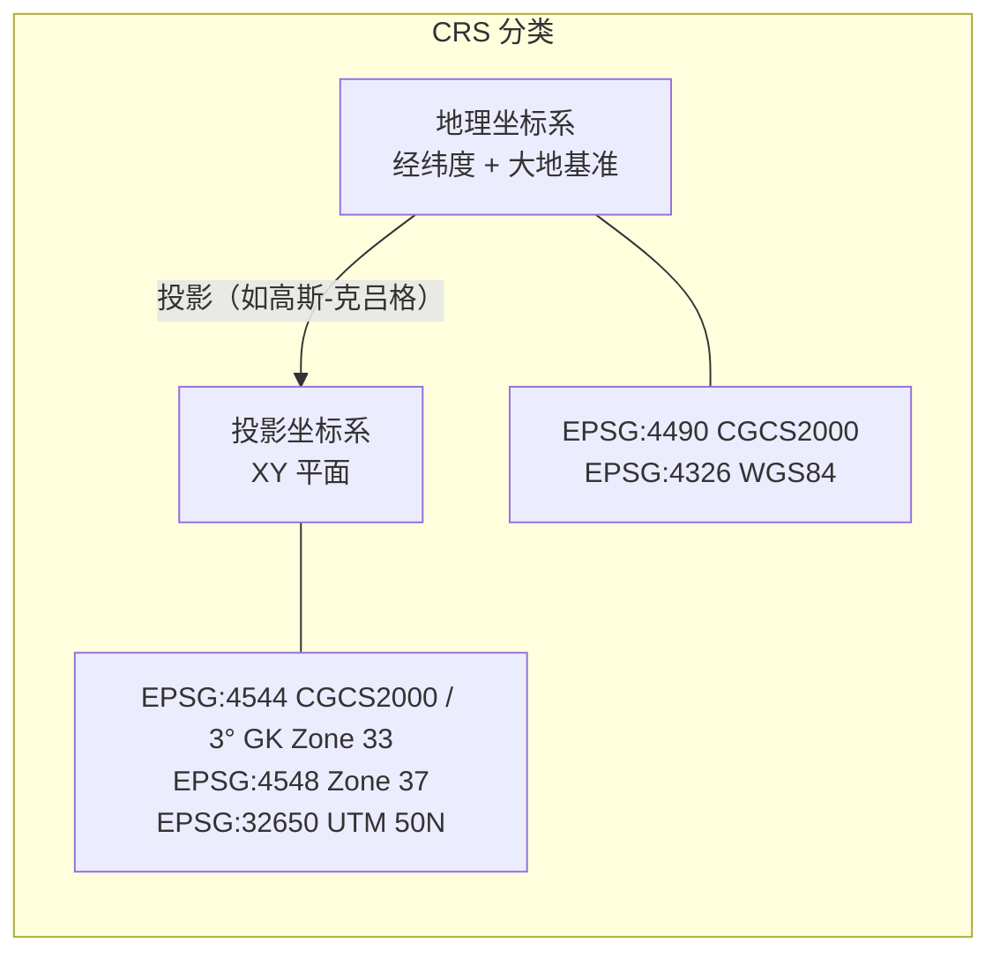

# QGIS / ArcGIS（GIS）分析：借鉴与超越

> 导航：[README](./README.md) · [01MASTER 总纲](./01MASTER.md) · [02INDEX 总对比](./02Software_Overview_INDEX.md) · [03RoadSelect 选型](./03RoadSelect.md)

QGIS（开源）和 ArcGIS（商业）是 GIS 领域的两强。虽然它们不是道路设计软件，但 **"矢量数据分层 + CRS 坐标系 + 空间索引 + 标准交换格式"** 是现代空间数据处理的基础设施。HyCAD 的"交换维度"（[01MASTER.md § 五](./01MASTER.md#五交换exchange-数据如何流入流出)）几乎全部借鉴自 GIS 世界。

---

## 一、值得借鉴的 GIS 核心设计理念

### 1.1 Coordinate Reference System（CRS）— 坐标的一等公民



**关键知识点**：

1. **每个图层必须标注 CRS**，否则叠加无意义
2. **EPSG 编号**是 CRS 的唯一标识（"EPSG:4544" = "CGCS2000 / 3° GK Zone 33"）
3. **投影变换**（Reprojection）：经纬度 ↔ 平面 XY 是数学严格的变换
4. **中国大陆市政道路**绝大多数用：**CGCS2000 + 3° 高斯-克吕格投影**，中央经线按项目位置选（105° 为 Zone 35、108° 为 Zone 36、111° 为 Zone 37、114° 为 Zone 38、117° 为 Zone 39、120° 为 Zone 40...）

**映射到 HyTool**：

```csharp
public readonly record struct Crs(string EpsgCode, string Name)
{
    public static readonly Crs WGS84 = new("EPSG:4326", "WGS84 (经纬度)");
    public static readonly Crs CGCS2000 = new("EPSG:4490", "CGCS2000 (经纬度)");

    public static Crs GaussKrugerCgcs2000_3Degree(int zone)
        => new($"EPSG:{4513 + zone - 25}", $"CGCS2000 / 3° GK Zone {zone}");
}

public sealed class RoadDesign
{
    public Crs ProjectionCrs { get; }     // 图形所在的投影坐标系
    public Crs? SourceCrs { get; }         // 若从 GIS 导入，记录原始 CRS
}
```

HyCAD 强制 **每个 `RoadDesign` 声明 CRS**，避免"坐标对不上"的低级错误。

### 1.2 矢量图层分层

GIS 的核心数据模型：**图层（Layer）**：

```
Project
├── Layer: 行政区划 (Polygon)
│    └── Features: [北京市, 上海市, ...]
├── Layer: 道路网络 (LineString)
│    └── Features: [G4, G5, 京哈, ...]
├── Layer: 建筑物 (Polygon)
├── Layer: 水系 (Polygon + LineString)
└── Layer: 高程点 (Point with Z)
```

每个 Layer：

- 同一几何类型（Point / LineString / Polygon / ...）
- 同一属性表结构（Schema）
- 可独立样式化（Style）
- 可独立显示开关
- 可独立查询

**对比 AutoCAD 图层**：AutoCAD Layer 只有"显示 + 颜色 + 线型"。**GIS Layer 的 Schema 与 Style 语义化程度远高**。

**映射**：HyCAD 的 `RoadModelGroup`（见 [12dModel.md § 3.5](./12dModel.md#35-model-group-图层映射)）+ Feature Class（见 [Novapoint.md § 3.2](./Novapoint.md#32-feature-catalog-样例)）= 这一套。

### 1.3 空间索引（Spatial Index）

GIS 查询"查找某矩形范围内的所有对象"如果逐个遍历，对 10 万级要素就会崩溃。GIS 用**空间索引**：

- **R-Tree**：最常见，PostGIS 默认
- **Quadtree**：简单、实现容易
- **KD-Tree**：多维点查询

```csharp
public interface ISpatialIndex<T>
{
    void Insert(T item, BoundingBox3d bbox);
    IEnumerable<T> Query(BoundingBox3d bbox);
    IEnumerable<T> QueryNearest(Point3d pt, int k);
    IEnumerable<T> QueryWithin(Polygon2d boundary);
}
```

**映射**：HyCADTool 已有类似设施（比如 `SpatialIndexService` 用于梁配筋冲突检测）。道路模块复用即可。

### 1.4 标准交换格式

GIS 世界的交换格式极其丰富：

| 格式 | 扩展名 | 来源 | 场景 |
|------|--------|------|------|
| **Shapefile** | `.shp` + `.dbf` + `.shx` + `.prj` | ESRI | 最古老、最兼容的矢量格式 |
| **GeoJSON** | `.geojson` | Web 标准 | 互联网、JavaScript |
| **KML / KMZ** | `.kml` | Google | Google Earth |
| **GeoPackage** | `.gpkg` | OGC | 现代 SQLite 容器 |
| **GML** | `.gml` | OGC | XML 系 |
| **GPX** | `.gpx` | GPS | 轨迹数据 |
| **DXF / DWG** | `.dxf` | AutoCAD | CAD 通用 |
| **LandXML** | `.xml` | AEC | 道路/曲面/勘测（见 [Novapoint.md § 1.4](./Novapoint.md#14-landxml-12--互操作的世界语)） |
| **PostGIS** | DB | OSGeo | 空间数据库 |

**HyTool 关注重点**：

- **LandXML**（v1 必做）：道路核心几何交换
- **Shapefile / GeoJSON**（v2）：规划阶段的地块/道路网络输入
- **KML**（v2）：Google Earth 叠加展示
- **DXF**（现有）：AutoCAD 之间互通

```csharp
public interface IGisPort
{
    Task<IReadOnlyList<IFeatureInstance>> ImportShapefileAsync(string path, Crs? sourceCrs, Crs? targetCrs);
    Task<IReadOnlyList<IFeatureInstance>> ImportGeoJsonAsync(string path, Crs? targetCrs);
    Task ExportShapefileAsync(IEnumerable<IFeatureInstance> features, string path, Crs targetCrs);
    Task ExportGeoJsonAsync(IEnumerable<IFeatureInstance> features, string path, Crs targetCrs);
}
```

### 1.5 Rule-Based Symbology — 规则样式

ArcGIS 和 QGIS 都支持**按属性条件渲染**的样式规则：

```
Road Symbology
  - When RoadClass = "Highway":     red   line, weight 3
  - When RoadClass = "Arterial":    orange line, weight 2
  - When RoadClass = "Collector":   yellow line, weight 1
  - When RoadClass = "Local":       white  line, weight 0.5
```

这与 [InfraWorks.md § 1.4](./InfraWorks.md#14-style--rule-style--样式即规则) 的 Style 是同一套。HyCAD 的 `RoadStyleRuleSet` 已有设计。

### 1.6 空间分析（Buffer / Intersect / Union）

GIS 的"分析工具箱"是工程师的瑞士军刀：

| 工具 | 用途（道路场景举例） |
|------|---------------------|
| **Buffer**（缓冲区） | "距离道路 30m 范围内的所有建筑" → 用于道路红线征地分析 |
| **Intersect**（相交） | "两条道路的交叉区域" → 交叉口定位 |
| **Union**（并集） | "合并多个道路地块" |
| **Clip**（裁剪） | "设计路段裁到行政区边界内" |
| **Difference**（差集） | "道路占地 = 新路 - 既有路" |

**映射**：v2 引入 `IGeometryAnalysisService`：

```csharp
public interface IGeometryAnalysisService
{
    Polygon2d Buffer(IRoadString input, double distance, BufferOptions opt);
    IReadOnlyList<Polygon2d> Intersect(Polygon2d a, Polygon2d b);
    IReadOnlyList<Polygon2d> Union(IEnumerable<Polygon2d> inputs);
    IReadOnlyList<Polygon2d> Clip(Polygon2d target, Polygon2d boundary);
}
```

推荐使用 **NetTopologySuite**（.NET 端 JTS 移植，LGPL，可商用）。

### 1.7 栅格数据（Raster）

GIS 的另一半 — 栅格（Raster）：DEM 高程、正射影像、遥感图。市政道路用到：

- **DEM（数字高程模型）** → 从中采样得到 EG Profile
- **正射影像** → 设计图底图（便于向领导汇报）

格式：`.tif` / `.jp2` / `.img` / `.asc`。

**HyTool 策略**：v3 引入 DEM 采样（与 [InfraWorks.md § 1.1](./InfraWorks.md#11-model-builder--一键生成城市底座) 呼应）；正射影像底图放 v3+。

### 1.8 CRS 变换服务

给定源 CRS 和目标 CRS，变换几何。标准做法：**PROJ 库**。

```csharp
public interface ICrsTransformService
{
    Point3d Transform(Point3d pt, Crs source, Crs target);
    Polyline2d Transform(Polyline2d poly, Crs source, Crs target);
}
```

.NET 端可用 **ProjNet.NET** 或 **CoordinateSharp**。但注意：**CGCS2000 3° 高斯-克吕格的正确参数**需要单独核对，ProjNet 默认可能是 WGS84 变体。

---

## 二、必须超越 QGIS / ArcGIS 的缺点

### 2.1 不是道路设计工具

GIS 只处理几何，不懂道路几何规范。Alignment 的缓和曲线、Profile 的竖曲线都不是 GIS 概念。

**HyTool 应对**：GIS 只作为**交换通道**，Domain 层仍以道路语义为核心。

### 2.2 施工图能力弱

QGIS 的 Print Layout 能出图，但与 AutoCAD 的精确施工图差距大。

**HyTool 应对**：施工图走 AutoCAD 主通道。

### 2.3 属性处理强，几何精度稍弱

GIS 习惯处理"一个街区多边形的中心线是什么"，但不擅长"毫米级的路缘石偏移"。

**HyTool 应对**：几何精度按 AutoCAD 标准，GIS 只作导入数据源。

### 2.4 ArcGIS 价格高昂 / QGIS 中文差

ArcGIS 订阅贵；QGIS 中文文档相对落后、部分 UI 未汉化。

**HyTool 应对**：直接用**开源库**（NetTopologySuite、ProjNet.NET），不依赖 QGIS / ArcGIS 安装。

### 2.5 对中国 CRS 支持不完整

PROJ / QGIS 对 CGCS2000 的支持近年才完善。早期文档建议用 "EPSG:4547" 之类的实际上是 WGS84 变体。

**HyTool 应对**：内置 **中国大陆 CRS 预设**（见 3.1），用户选择"北京/上海/深圳"等城市即可。

---

## 三、映射到 HyCADTool.Refactored 的设计

### 3.1 中国 CRS 预设

```json
// Infrastructure/Configuration/china-crs-presets.json
{
  "presets": [
    { "name": "北京（CGCS2000 / 3° GK Zone 40）", "epsg": "EPSG:4528", "centralMeridian": 120, "recommendedFor": ["北京"] },
    { "name": "上海（CGCS2000 / 3° GK Zone 40）", "epsg": "EPSG:4528", "centralMeridian": 120, "recommendedFor": ["上海"] },
    { "name": "深圳（CGCS2000 / 3° GK Zone 38）", "epsg": "EPSG:4526", "centralMeridian": 114, "recommendedFor": ["深圳", "广州"] },
    { "name": "成都（CGCS2000 / 3° GK Zone 35）", "epsg": "EPSG:4523", "centralMeridian": 105, "recommendedFor": ["成都"] },
    { "name": "武汉（CGCS2000 / 3° GK Zone 38）", "epsg": "EPSG:4526", "centralMeridian": 114, "recommendedFor": ["武汉"] },
    { "name": "西安（CGCS2000 / 3° GK Zone 36）", "epsg": "EPSG:4524", "centralMeridian": 108, "recommendedFor": ["西安"] }
  ],
  "note": "EPSG 编号需与 PROJ 库验证。本预设以 CGCS2000 为基准。"
}
```

### 3.2 命令挂点

| 命令 | 功能 |
|------|------|
| `hyRoadCrs` | 设置当前道路设计的 CRS |
| `hyRoadImportShp` | 从 Shapefile 导入（路网 / 地块 / 建筑） |
| `hyRoadImportGeoJson` | 从 GeoJSON 导入 |
| `hyRoadImportLandXml` | 从 LandXML 导入（见 [Novapoint.md § 3.3](./Novapoint.md#33-landxml-导入导出v1-必交付)） |
| `hyRoadExportShp` | 导出 Shapefile |
| `hyRoadExportGeoJson` | 导出 GeoJSON |
| `hyRoadExportKml` | 导出 KML（Google Earth 展示） |
| `hyRoadBuffer` | 缓冲区分析（v2） |
| `hyRoadIntersect` | 相交分析（v2） |
| `hyRoadImportDem` | 导入 DEM 栅格（v3） |

### 3.3 面板（"道路 Tab → 数据交换"）

```
┌ 道路 Tab → 数据交换 ───────────────────┐
│ ● 坐标系                                │
│   [北京 CGCS2000 / 3° GK Zone 40  ▼]    │
│   EPSG:4528                             │
│                                         │
│ ● 导入                                  │
│   [LandXML]  [Shapefile]  [GeoJSON]    │
│   [DEM 栅格（v3）]                      │
│                                         │
│ ● 导出                                  │
│   [LandXML]  [Shapefile]  [GeoJSON]    │
│   [KML（Google Earth）]                 │
│   [IFC 4.3 Road（v3）]                  │
│   [BCF 审查包（v3）]                    │
│                                         │
│ ● 空间分析（v2）                        │
│   [缓冲区]  [相交]  [并集]  [裁剪]     │
└─────────────────────────────────────────┘
```

### 3.4 依赖库清单

| 库 | 用途 | License |
|----|------|---------|
| [NetTopologySuite](https://github.com/NetTopologySuite/NetTopologySuite) | 几何运算（Buffer / Intersect / ...） | BSD |
| [ProjNet.NET](https://github.com/NetTopologySuite/ProjNet4GeoAPI) | CRS 变换 | MIT |
| [DotSpatial.Projections](https://github.com/DotSpatial/DotSpatial) | 备选 CRS 库 | MIT |
| [SharpKml](https://github.com/samcragg/sharpkml) | KML 读写 | MIT |
| [GeoAPI.NET](https://github.com/NetTopologySuite/GeoAPI) | 接口抽象 | BSD |

### 3.5 LandXML 的特殊地位

LandXML 是 GIS 交换格式中**唯一理解道路几何**的——它能表达 Alignment / Profile / Surface，其它都只是"线 / 多边形"。这是 HyCAD v1 必做的根本原因。

详细见 [Novapoint.md § 1.4](./Novapoint.md#14-landxml-12--互操作的世界语)。

---

## 四、总结：借鉴 vs 超越

| GIS 设计 | 借鉴 | HyCAD 超越 |
|----------|------|-------------|
| CRS 坐标系 + EPSG | 完全借鉴 | 中国 CRS 预设 |
| 矢量图层 + Schema | 借鉴 | 映射到 RoadModelGroup + Feature Catalog |
| 空间索引 R-Tree | 借鉴 | 复用现有 `SpatialIndexService` |
| Shapefile / GeoJSON / KML | 完全借鉴 | v2 导入导出 |
| LandXML | 完全借鉴 | v1 必做 |
| Rule-Based Symbology | 借鉴 | Style 规则（见 InfraWorks.md） |
| 空间分析（Buffer/Intersect/...） | 借鉴 | v2 引入 NetTopologySuite |
| 栅格 DEM | 借鉴 | v3 落地 |
| CRS 变换服务 | 借鉴 | ProjNet.NET + 中国 CRS 校验 |
| 不是道路设计 | **超越** | 保留完整道路 Domain |
| 施工图能力弱 | **避免** | 扎根 AutoCAD |
| ArcGIS 高价 / QGIS 中文差 | **避免** | 嵌入开源库，不依赖安装 |
| 对中国 CRS 支持不完整 | **避免** | 中国预设 |

---

## 五、与其他对标篇的交叉引用

- [Novapoint.md](./Novapoint.md)：Feature Class 设计 + LandXML
- [InfraWorks.md](./InfraWorks.md)：Model Builder 依赖的数据源与 GIS 同源
- [12dModel.md](./12dModel.md)：12da 格式与 LandXML / GeoJSON 的位置
- [01MASTER.md § 五](./01MASTER.md#五交换exchange-数据如何流入流出)：交换维度的总体设计
