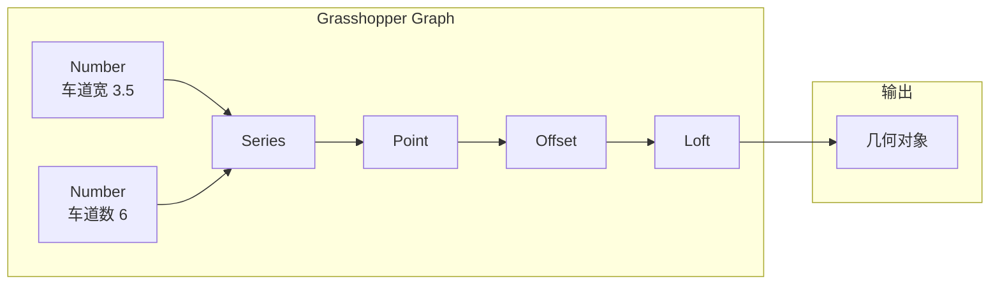

# Rhino + Grasshopper 参数化 分析：借鉴与超越

> 导航：[README](./README.md) · [01MASTER 总纲](./01MASTER.md) · [02INDEX 总对比](./02Software_Overview_INDEX.md) · [03RoadSelect 选型](./03RoadSelect.md)

Rhino + Grasshopper（GH）不是道路设计软件，而是**通用参数化建模平台**。然而市政道路的"批量参数化断面 / 异形交叉口 / 节点复杂几何"这类场景，在 Civil 3D / 鸿业 / 纬地里都难做，而 GH 做起来却异常自然。GH 对 HyCAD 的核心价值在于**DAG（有向无环图）参数化思想 + 夹点预览 + 可视化编程**——这三点可以借用到道路设计的 **批量生成**与**异形场景**处理。

---

## 一、值得借鉴的 Rhino + GH 核心设计理念

### 1.1 DAG（Directed Acyclic Graph）— 所有几何由节点图生成

Grasshopper 的核心数据模型：



**核心特征**：

1. **幂等**：同样的输入始终产生同样的输出
2. **实时**：输入变化，整个图自动刷新
3. **可视**：每个节点都显示当前值 / 几何预览
4. **可调试**：每根连线都可以检查

**映射到 HyTool**：[01MASTER.md § 1.1](./01MASTER.md#11-三级线位模型) 设计的 `Alignment → Profile → Corridor` 本质就是一个极简 DAG；[12dModel.md § 1.5](./12dModel.md#15-string-modifiers--字符串的声明式变换) 的 String Modifier 链是更细粒度的 DAG。GH 的启发在于**把 DAG 显式化**——让用户在一个面板中看到整条依赖链：

```csharp
public sealed class RoadDesignGraph
{
    public IReadOnlyList<IRoadNode> Nodes { get; }
    public IReadOnlyList<RoadEdge> Edges { get; }

    public void Invalidate(IRoadNode node);
    public void Evaluate();     // 拓扑排序 + 按需执行

    public event Action<IRoadNode, EvaluationResult>? OnNodeEvaluated;
}

public interface IRoadNode
{
    string Id { get; }
    IReadOnlyDictionary<string, IRoadPort> Inputs { get; }
    IReadOnlyDictionary<string, IRoadPort> Outputs { get; }
    EvaluationResult Evaluate();
}
```

### 1.2 夹点预览（Ghosted Preview）

GH 的每个节点都在画布上**实时展示其几何输出**——不等 Bake，用户就能看到效果。拖动任一数值滑块，几何预览立刻更新。

这对道路设计的启发：**Alignment 编辑时，横断面/纵断面/走廊的预览应实时显示**（对应 [HintCAD.md § 1.1](./HintCAD.md#11-平纵横一体化设计--实时拖动即刻联动)）。

### 1.3 Data Tree — 层次化数据

GH 的数据不是扁平列表，而是**树**（Data Tree）：

```
Data Tree:
  {0;0} = [p1, p2, p3]     // 第 0 条 Alignment 的关键点
  {0;1} = [p4, p5]          // 第 0 条的另一组点
  {1;0} = [p6, p7, p8, p9]  // 第 1 条 Alignment
  ...
```

用 `Path + Branch` 索引。当批量处理"所有 Alignment 的所有关键点"时，数据树自然对应。

**映射**：HyCAD 有多条 Alignment 时（一个大型市政项目），路网内对象也可用类似树结构：

```csharp
public sealed class RoadDataTree<T>
{
    public IReadOnlyDictionary<RoadPath, IReadOnlyList<T>> Branches { get; }
}

public readonly record struct RoadPath(params int[] Indices)
{
    public override string ToString() => $"{{{string.Join(";", Indices)}}}";
}
```

用途：批量工程量汇总（按 Alignment + 按 Region）、批量规范校核结果。

### 1.4 Cluster — 子图封装

GH 的 **Cluster**：把一组节点打包成一个黑盒，作为可复用组件。对应 C# 的"函数"。

**映射**：HyCAD 的 **Civil Cell**（借鉴自 [OpenRoads.md § 1.4](./OpenRoads.md#14-civil-cells--规则化的道路积木)）就是 Cluster 的道路特化——把"十字交叉口""环岛""港湾站"这类复杂几何打包成参数化组件。

### 1.5 GhPython / C# Script — 扩展接口

GH 支持在图中插入 Python / C# 脚本节点，解决标准节点无法完成的逻辑。

**映射**：HyCAD 可提供 **Script 节点**，允许用户用 C# 写一段逻辑处理自定义几何转换。对于**已经用 GH 思维工作的景观/规划用户**，这是"迁入"HyCAD 的桥梁。

### 1.6 Bake — 从参数到实体

GH 的图只在内存中，用户按 Bake 按钮才会把几何"烘焙"为 Rhino 实体（持久化到 3DM 文件）。

**映射**：HyCAD 的 Domain 模型是"真相"，AutoCAD 实体是"视图"——`hyRoadBake` 命令把当前 Domain 状态写入 AutoCAD 图形。这与 Civil 3D 的 `Corridor.Rebuild` 不同（Civil 3D 的对象始终在 DWG 里），HyCAD 更接近 GH 哲学。

### 1.7 Kangaroo / Galapagos — 求解与优化

Kangaroo（物理引擎，用于形态优化）、Galapagos（遗传算法优化）让 GH 能处理**约束求解**问题：

- 给定地块边界 + 目标通行量，求最优路网布局
- 给定土方平衡目标，求最优纵断面设计线

**HyTool 策略**：v3+ 可考虑**基于约束求解的智能拉坡**——给定若干强制过点（既有管线交叉、接现有道路标高）+ 填挖平衡目标，自动求最优 PVI 组合。

### 1.8 GH 在市政领域的真实案例

- **景观/建筑师**使用 GH 做场地参数化
- **路桥工程师**使用 GH 做异形立交桥墩布置、超高过渡研究
- **规划师**使用 GH 做路网参数化生成（VanBraak、城市设计研究）

虽然这些都是非官方 / 研究性场景，但证明**参数化思想在道路领域有真实生命力**。

---

## 二、必须超越 Rhino + GH 的缺点

### 2.1 不是道路软件

GH 没有 Alignment / Profile / Station 等道路语义，一切都要从零搭建。对真正的施工图交付不现实。

**HyTool 应对**：GH 只是**思想借鉴**，不是功能借鉴。HyCAD 保留完整的道路 Domain 模型。

### 2.2 DWG 兼容差

Rhino → DWG 需要经过 DGN / IGES 等中间格式，几乎无法保持层 / 块信息。

**HyTool 应对**：直接扎根 AutoCAD，零格式转换。

### 2.3 中文 / 规范支持空白

GH 生态中没有任何针对中国规范的插件。

**HyTool 应对**：CJJ 37/152/193 内置。

### 2.4 图的复杂度管理

复杂 GH 文件（500+ 节点）会退化为"图墙"，可读性急剧下降。

**HyTool 应对**：DAG 不直接暴露给用户——只在**内部作为实现**。用户看到的是"道路设计面板 + 参数字段 + 命令按钮"，熟悉的 AutoCAD UX。

### 2.5 许可与生态闭合

Rhino 许可约 ¥6000/人/永久；GH 免费但依赖 Rhino。大型插件（Lands Design、Parametric Concrete 等）还需单独付费。

**HyTool 应对**：随 HyCAD 分发。

### 2.6 国内使用门槛高

会用 GH 的工程师非常少，培训成本高，国内落地困难。

**HyTool 应对**：参数化能力**封装在命令/面板背后**，用户无需懂 DAG 即可使用。

---

## 三、映射到 HyCADTool.Refactored 的设计

### 3.1 核心借鉴 — DAG 作为 Corridor 的内部实现

HyCAD v2 可引入 **Road Design Graph** 作为 Corridor 的内部表示：

```mermaid
graph TB
    subgraph graph ["Road Design Graph（内部）"]
        N1["AlignmentNode<br/>K路_CL"]
        N2["ProfileNode<br/>K路_FG"]
        N3["TerrainSampleNode<br/>EG at stations"]
        N4["TemplateDropNode<br/>@ K0+000"]
        N5["CorridorEvaluateNode"]
        N6["EarthworkNode"]
        N7["QtoNode"]

        N1 --> N5
        N2 --> N5
        N1 --> N3
        N3 --> N5
        N4 --> N5
        N5 --> N6
        N5 --> N7
    end

    Facade["用户界面<br/>面板 + 命令"] -.-> graph
```

用户**不看这个图**，但改 Alignment 时，系统按 DAG 拓扑自动只重算受影响的下游节点——这就是 [HongYeRoad.md § 1.5](./HongYeRoad.md#15-平纵横土方数据联动) 提到的"增量重建"的内部机制。

### 3.2 Civil Cell = Cluster

沿用 [OpenRoads.md § 3.4](./OpenRoads.md#34-civil-cell-存储结构) 的 Civil Cell 文件格式，内部就是一个**子图**：

```json
{
  "name": "intersection-cross-cjj152",
  "version": "1.0",
  "parameters": [
    { "name": "majorAlignment",    "type": "IAlignment" },
    { "name": "minorAlignment",    "type": "IAlignment" },
    { "name": "cornerRadius",      "type": "number", "default": 20 },
    { "name": "crosswalkWidth",    "type": "number", "default": 5 }
  ],
  "graph": {
    "nodes": [
      { "id": "n1", "type": "FindIntersectionCenter", ... },
      { "id": "n2", "type": "CornerArcs",   "inputs": { "center": "n1", "radius": "$cornerRadius", "arms": "..." } },
      { "id": "n3", "type": "Crosswalks",   "inputs": { "arms": "...", "width": "$crosswalkWidth" } },
      { "id": "n4", "type": "StopLines",    ... }
    ],
    "outputs": { "cornerArcs": "n2", "crosswalks": "n3", "stopLines": "n4" }
  }
}
```

### 3.3 Script 节点（v3+）— 用户自定义逻辑

```csharp
public interface IRoadScriptNode : IRoadNode
{
    string CSharpSource { get; set; }

    /// <summary>动态编译并执行。</summary>
    EvaluationResult Evaluate();
}
```

实现可基于 **Roslyn**（`Microsoft.CodeAnalysis.CSharp.Scripting`）。用户在 `.roaddesign` 中塞一段 C# 代码，动态编译。

> 这对 HyCAD 扩展性是关键。但优先级放 v3+，v1 不做。

### 3.4 批量参数化断面生成

借鉴 GH 批量思想，HyCAD 提供 **`hyRoadCrossParametric`** 命令：

- 给定一条 Alignment
- 给定沿线参数变化函数（车道数 / 中分带宽度 / 横坡等）
- 按桩号区间自动生成参数化过渡

```csharp
public sealed class ParametricCrossSectionRequest
{
    public IAlignment Baseline { get; init; }
    public Station Start { get; init; }
    public Station End { get; init; }
    public IReadOnlyList<ParametricTransitionSpec> Transitions { get; init; }
}

public sealed record ParametricTransitionSpec(
    string ParameterName,           // "BikeLaneWidth" / "MedianWidth"
    double StartValue,
    double EndValue,
    TransitionKind Kind = TransitionKind.Linear);
```

### 3.5 异形交叉口的"降级到 GH 思维"

对于**无法用标准模板处理的异形交叉口**（5 岔口、多层环岛、非正交快速路出入口），HyCAD 提供**基础几何构造命令**：

```csharp
[CommandMethod("hyRoadPolyArc")]
public void DrawPolylineArcAtMidpoint() { ... }

[CommandMethod("hyRoadOffsetAlong")]
public void OffsetAlongAlignment() { ... }

[CommandMethod("hyRoadBoolean")]
public void BooleanBetweenPolygons() { ... }

[CommandMethod("hyRoadLoft")]
public void LoftBetweenProfiles() { ... }
```

用户组合这些基础命令**手工构造异形几何**，然后用 `hyRoadFeaturize` 命令把结果注册为 `IRoadString` 挂入 Domain。这是"保底路线"。

---

## 四、总结：借鉴 vs 超越

| Rhino + GH 设计 | 借鉴 | HyCAD 超越 |
|-----------------|------|-------------|
| DAG 参数化 | 借鉴哲学 | v2 内部实现 Corridor，用户不暴露 |
| 夹点预览 | 借鉴 | 一体化工作空间（[HintCAD.md](./HintCAD.md)） |
| Data Tree 层次数据 | 借鉴 | 路网场景下用 `RoadDataTree<T>` |
| Cluster 子图封装 | 借鉴 | Civil Cell 机制 |
| Script 节点 | 借鉴 | v3+ Roslyn 脚本 |
| Bake 参数→实体 | 借鉴 | `hyRoadBake` 命令 |
| Kangaroo / Galapagos 求解 | 借鉴 | v3+ 智能拉坡优化 |
| 异形几何通用能力 | 借鉴 | 基础几何命令 + `hyRoadFeaturize` |
| 无道路语义 | **避免** | 保留完整 Alignment / Profile / Template |
| DWG 兼容差 | **避免** | 扎根 AutoCAD |
| 中文/规范空白 | **避免** | CJJ 系列内置 |
| 复杂图难读 | **避免** | 图封装为内部实现 |
| 许可贵 / 生态封闭 | **避免** | 随 HyCAD |
| 使用门槛高 | **避免** | 参数化藏在面板背后 |

---

## 五、与其他对标篇的交叉引用

- [12dModel.md](./12dModel.md)：String Modifier 链 = GH DAG 的道路特化
- [OpenRoads.md](./OpenRoads.md)：Civil Cell = Cluster 的道路特化
- [InfraWorks.md](./InfraWorks.md)：Proposal 多方案 = GH 参数滑块的离散版
- [03RoadSelect.md](./03RoadSelect.md)：规则选择维度 = GH Filter 的对象侧映射
