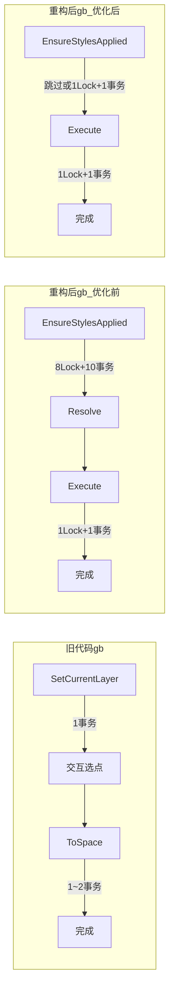

# 命令性能优化方案

## 问题诊断

旧代码中一个典型命令（如 `gb`）的执行路径：

```
用户输入 gb → [CommandMethod] 静态方法 → SetCurrentLayer (1事务) → 交互选点 → 内存创建实体 → ToSpace (1~2事务)
```

**旧代码总计：2~3 个事务，0 次预处理，无 DI 解析。**

重构后同一个命令（面板已打开，参数有变更）：

```
用户输入 gb → CommandRegistry.Run()
  → EnsureStylesApplied()     // 8 LockDoc + 10 事务（CreateText/Dim/MLeader/Table + SetCurrent×4）
  → new MleaderReinCommand()  // 1 次 Resolve
  → Execute()                 // 1 LockDoc + 1 事务
```

**重构后总计：9 LockDoc + 11 事务。最坏情况（gj 命令）：13 LockDoc + 19 事务。**

核心问题不是 DI（微秒级），而是 **StyleService 的事务碎片化 + 无差别全量样式重建**。

## 对比分析



## 优化策略

### 策略一：StyleService 合并事务（核心优化）

**目标**：将 `ApplyStyle()` 的 8 Lock + 10 事务合并为 **1 Lock + 1 事务**。

在 [StyleService.cs](HyCADTool.Refactored/Infrastructure/AutoCAD/Services/StyleService.cs) 中新增批量方法：

```csharp
public void ApplyAll(string textStyleName, string fontName, string bigFontName, 
    double textHeight, double widthFactor,
    string dimStyleName, double scale, double dimtxt, double dimexo, double dimexe, 
    double dimdle, double dimgap, double dimasz,
    string mleaderStyleName, double arrowSize, double landingGap, 
    double mleaderTextHeight, int textColorIndex,
    string tableStyleName)
{
    var doc = AcApp.DocumentManager.MdiActiveDocument;
    var db = doc.Database;
    using (doc.LockDocument())        // 1 次 LockDocument
    using (var tr = db.TransactionManager.StartTransaction())  // 1 次事务
    {
        // 在同一个事务内完成全部 4 类样式的创建/更新 + 设置当前
        CreateOrUpdateTextStyle(tr, db, textStyleName, fontName, bigFontName, textHeight, widthFactor);
        CreateOrUpdateDimensionStyle(tr, db, dimStyleName, textStyleName, scale, dimtxt, dimexo, dimexe, dimdle, dimgap, dimasz);
        CreateOrUpdateMLeaderStyle(tr, db, mleaderStyleName, textStyleName, scale, arrowSize, landingGap, mleaderTextHeight, textColorIndex);
        CreateOrUpdateTableStyle(tr, db, tableStyleName, textStyleName);
        tr.Commit();
    }
}
```

同时将 `GetArrowObjectId` 改为接受 `Transaction tr` 参数，复用外层事务，消除嵌套事务。

**收益**：10 事务 → 1 事务，8 LockDocument → 1 LockDocument。

### 策略二：精确化脏标记

当前 `SetProperty<T>` 对**任何属性**变更都设 `_stylesDirty = true`，包括 `RebarDiameter`、`AnchorageLength` 等 15+ 个与样式无关的钢筋几何参数。

在 [SettingsPanelViewModel.cs](HyCADTool.Refactored/Presentation/ViewModels/SettingsPanelViewModel.cs) 中：

- 从 `SetProperty` 中移除 `_stylesDirty = true`
- 仅在样式相关属性的 setter 中标记 dirty：`Scale`、`FontFileName`、`BigFontFileName`、`TextSize`、`TextXScale`、`Dimtxt/Dimexo/Dimexe/Dimdle/Dimgap/Dimasz`、`MLeaderArrowSize/MLeaderLandingGap/MLeaderTextColorIndex`

```csharp
// SetProperty 不再设 dirty
protected bool SetProperty<T>(ref T storage, T value, [CallerMemberName] string propertyName = null)
{
    if (Equals(storage, value)) return false;
    storage = value;
    OnPropertyChanged(propertyName);
    return true;
}

// 仅样式属性标记 dirty，例如:
public double Scale
{
    get => _scale;
    set
    {
        if (SetProperty(ref _scale, value))
        {
            _stylesDirty = true;  // 仅样式属性设 dirty
            OnPropertyChanged(nameof(TextStyleName));
            // ...
        }
    }
}
```

**收益**：用户改钢筋参数后执行命令不再重建样式。

### 策略三：消除 ReinService.ApplyStyle 的重复样式创建

[DrawReinforcementCommand.cs](HyCADTool.Refactored/Presentation/Commands/DrawReinforcementCommand.cs) 第 64 行调用 `_reinService.ApplyStyle(parameters)`，而 `CommandRegistry.Run()` 已经调过 `EnsureStylesApplied()`。

[ReinService.cs](HyCADTool.Refactored/Infrastructure/AutoCAD/Services/ReinService.cs) 的 `ApplyStyle()` 做了两件事：

1. 创建图层 — **需要保留**
2. 创建 4 个样式（硬编码 `0_Hy_40`）— **应该删除**（与面板样式冲突）

修改 `ReinService.ApplyStyle()` 为只创建图层：

```csharp
public void ApplyStyle(ReinParameters parameters)
{
    _layerService.CreateMultipleLayers(
        (LayerLineRein, 1),
        (LayerDotRein, 5),
        (LayerDimOutside, 3),
        (LayerLeader, 92)
    );
    // 样式由 SettingsPanelViewModel.EnsureStylesApplied() 统一管理，不再重复创建
}
```

**收益**：`gj` 命令减少 7 个事务。

### 策略四：非样式命令跳过 EnsureStylesApplied（可选增强）

很多命令（如 `HYc2bc` 块颜色、`HYBL` 断线、`hyex` 导出）根本不使用样式，但 `CommandRegistry.Run()` 仍然为它们检查脏标记。

有两种方式：

- **方案 A（简单）**：保持现状。dirty flag 跳过时只有一次 bool 判断，开销可忽略。
- **方案 B（精细）**：将 `Run()` 拆为 `Run()` 和 `RunWithStyle()`，只有需要样式的命令用后者。

建议先用方案 A，dirty flag 已经足够高效。

## 优化后的预期效果

| 场景             | 优化前            | 优化后          | 旧代码          |
| ---------------- | ----------------- | --------------- | --------------- |
| gb（首次/dirty） | 9 Lock + 11 事务  | 2 Lock + 2 事务 | 1 Lock + 2 事务 |
| gb（非dirty）    | 1 Lock + 1 事务   | 1 Lock + 1 事务 | 1 Lock + 2 事务 |
| gj（首次/dirty） | 13 Lock + 19 事务 | 2 Lock + 3 事务 | 0 Lock + 7 事务 |
| gj（非dirty）    | 5 Lock + 9 事务   | 1 Lock + 2 事务 | 0 Lock + 7 事务 |

优化后重构代码在大多数场景下**比旧代码更快**（事务更少），同时保持了统一样式管理、DI 解耦等架构优势。

## 修改文件清单

- [StyleService.cs](HyCADTool.Refactored/Infrastructure/AutoCAD/Services/StyleService.cs) — 新增 `ApplyAll()` 批量方法，`GetArrowObjectId` 支持复用事务
- [SettingsPanelViewModel.cs](HyCADTool.Refactored/Presentation/ViewModels/SettingsPanelViewModel.cs) — `ApplyStyle()` 调用 `ApplyAll()`，精确化 dirty flag
- [ReinService.cs](HyCADTool.Refactored/Infrastructure/AutoCAD/Services/ReinService.cs) — `ApplyStyle()` 仅保留图层创建，删除重复的样式创建
- [BaseReinforcementService.cs](HyCADTool.Refactored/Infrastructure/AutoCAD/Services/BaseReinforcementService.cs) — `ApplyStyles()` 调用 `ApplyAll()`
- [IStyleService.cs](HyCADTool.Refactored/Domain/Interfaces/IStyleService.cs) — 接口新增 `ApplyAll()` 方法