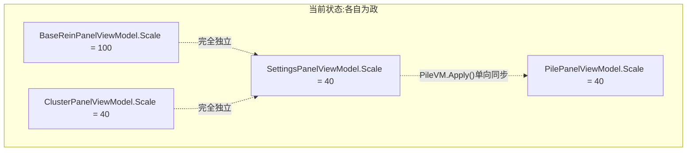
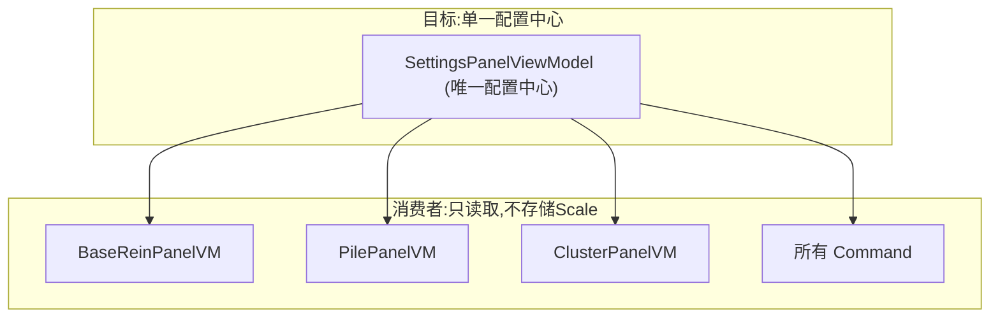
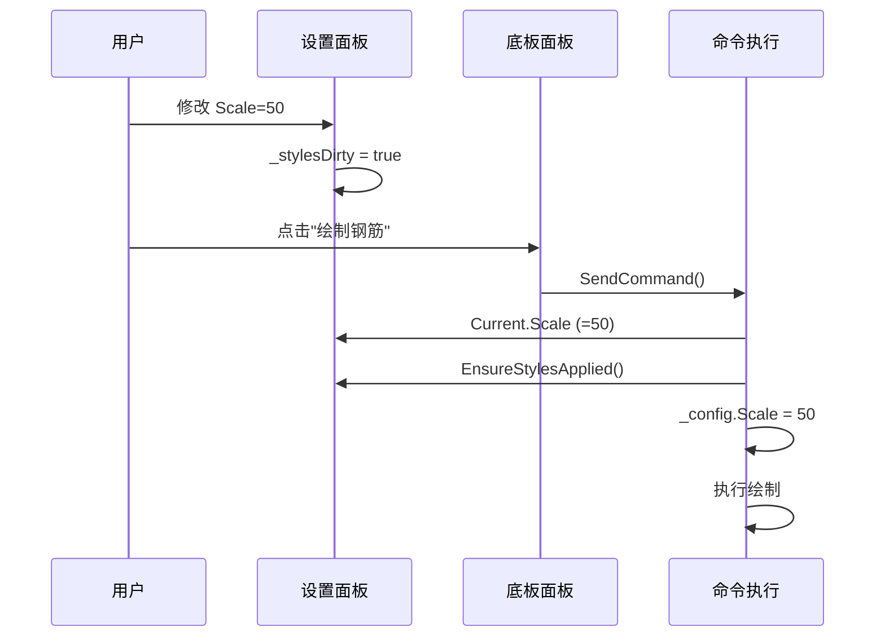

# 配置系统统一重构

## 当前问题诊断

### 架构混乱：Scale 在 4 处独立存储，互不同步



### 具体问题清单

1. **钢筋命令不可用**：`SettingsPanelViewModel.Current`（第47-51行）用无参构造函数创建实例，所有按钮命令为 `() => {}`
2. **Scale 4 处定义**：Settings(40), BaseRein(100), Pile(40), Cluster(40) 互不同步
3. **fallback 默认值不一致**：大部分命令 `?? 40.0`，`GroupCirclesByElevation` 是 `?? 100`
4. **反射桥接**：`SyncToOldReinforcement()` 450-518行反射调用旧项目（违反规则4）
5. **DrawReinforcement()** 方法同时反射同步+发命令，冗余且脆弱

## 目标架构



**核心原则**：Scale、TextSize 等全局样式参数只在 `SettingsPanelViewModel` 中存储，其他面板和命令一律从 `SettingsPanelViewModel.Current` 读取。

------

## 修改清单

### 1. 修复 Current 属性（解决钢筋命令不可用）

**文件**：[SettingsPanelViewModel.cs](HyCADTool.Refactored/Presentation/ViewModels/SettingsPanelViewModel.cs) 第47-51行

将无参构造改为从 DI 容器获取 IStyleService 创建完整实例：

```csharp
if (!_documentViewModels.ContainsKey(docName))
{
    IStyleService styleService = null;
    try { styleService = Infrastructure.Configuration.ServiceLocator.Resolve<IStyleService>(); }
    catch { }
    _documentViewModels[docName] = styleService != null
        ? new SettingsPanelViewModel(styleService)
        : new SettingsPanelViewModel();
}
```

### 2. 删除反射桥接代码

**文件**：[SettingsPanelViewModel.cs](HyCADTool.Refactored/Presentation/ViewModels/SettingsPanelViewModel.cs)

- 删除 `SyncToOldReinforcement()` 方法（第447-518行）和 `SetOldPanelProperty()` 辅助方法（第520-524行）
- 删除 `DrawReinforcement()` 方法（第426-441行），因为它调用反射同步+发送旧命令 `gj`，而 `gj` 在 CommandRegistry 中已直接注册为 `new DrawReinforcementCommand().Execute()`
- `DrawCommand` 改为与 `CmdGj` 相同的实现：`SendCommand(() => new Commands.DrawReinforcementCommand().Execute())`

### 3. Tab 名称 "样式" → "设置"

**文件**：[HyToolPanel.xaml](HyCADTool.Refactored/Presentation/Views/HyToolPanel.xaml) 第23行

### 4. 底板面板去除冗余

**文件**：[BaseReinPanel.xaml](HyCADTool.Refactored/Presentation/Views/BaseReinPanel.xaml)

- 删除第20-61行整个"基本设置" Expander（含主图形比例 + 设置样式 + 恢复默认值）

**文件**：[BaseReinPanelViewModel.cs](HyCADTool.Refactored/Presentation/ViewModels/BaseReinPanelViewModel.cs)

- 删除 `Scale` 属性（第64-69行）
- 删除 `ApplyStyleCommand`/`ResetCommand` 及 `ExecuteApplyStyle()`/`ExecuteReset()`
- 在 `SendCommand()` 中同步 Scale：执行前 `_config.Scale = SettingsPanelViewModel.Current?.Scale ?? 40.0`
- 添加一个 `ResetBaseReinCommand`（只重置底板配筋特有参数，不含 Scale）

**文件**：[BaseReinforcementConfig.cs](HyCADTool.Refactored/Domain/Models/Configuration/BaseReinforcementConfig.cs)

- `CreateDefault()` 中 Scale 不再设置固定值 100，改为读 `SettingsPanelViewModel.Current?.Scale ?? 40.0`
  - 或直接去除 Scale 默认赋值（由运行时从设置面板注入）

### 5. 桩基面板去除冗余

**文件**：[PilePanel.xaml](HyCADTool.Refactored/Presentation/Views/PilePanel.xaml)

- 删除第33-46行（主图形比例 TextBox + 设置样式 + 恢复默认值按钮）

**文件**：[PilePanelViewModel.cs](HyCADTool.Refactored/Presentation/ViewModels/PilePanelViewModel.cs)

- 删除 `Scale` 属性（第86-91行）及私有字段 `_scale`
- 删除 `ApplyCommand` 及 `Apply()` 方法
- `DrawPilesCommand` 和其他命令中，Scale 从 `SettingsPanelViewModel.Current?.Scale ?? 40.0` 读取
- `ResetToDefaults()` 只重置桩基特有参数
- `CanDrawPiles()` 改为从 Settings 读 Scale

### 6. 聚类面板去除冗余 Scale

**文件**：[ClusterPanel.xaml](HyCADTool.Refactored/Presentation/Views/ClusterPanel.xaml)

- 删除第22-29行的"比例" TextBox

**文件**：[ClusterPanelViewModel.cs](HyCADTool.Refactored/Presentation/ViewModels/ClusterPanelViewModel.cs)

- 删除 `Scale` 属性（第243-244行）
- `ExecuteDraw()` 中的 `Scale` 改为从 `SettingsPanelViewModel.Current?.Scale ?? 40.0` 读取

### 7. 修复 GroupCirclesByElevationCommand 默认值

将 `?? 100` 改为 `?? 40.0`

### 8. PanelManager.UpdateDataContexts 补全

**文件**：[PanelManager.cs](HyCADTool.Refactored/Presentation/PanelManager.cs)

- `OnDocumentToBeDestroyed` 中补充清理 `ClusterPanelViewModel`（当前只清理 Settings 和 Pile）

------

## 改动后的参数流



## 涉及文件（8个）

| 文件                        | 改动量 | 说明                                         |
| --------------------------- | ------ | -------------------------------------------- |
| `SettingsPanelViewModel.cs` | 中     | 修复 Current + 删反射 + 改 DrawCommand       |
| `HyToolPanel.xaml`          | 小     | Tab 名称                                     |
| `BaseReinPanel.xaml`        | 小     | 删"基本设置" Expander                        |
| `BaseReinPanelViewModel.cs` | 中     | 删 Scale/ApplyStyle/Reset + SendCommand 同步 |
| `PilePanel.xaml`            | 小     | 删 Scale/设置样式/恢复默认                   |
| `PilePanelViewModel.cs`     | 中     | 删 Scale/Apply + 从 Settings 读              |
| `ClusterPanel.xaml`         | 小     | 删比例 TextBox                               |
| `ClusterPanelViewModel.cs`  | 小     | 删 Scale + ExecuteDraw 从 Settings 读        |