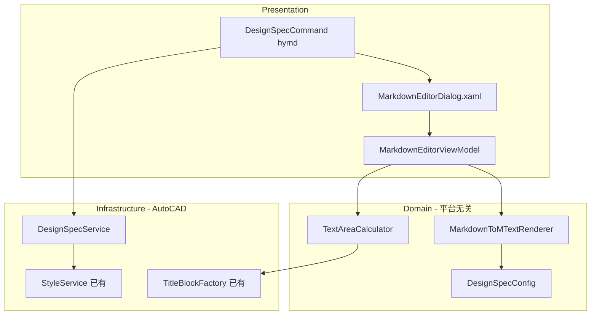

# Markdown 设计说明排版插件 (hymd)

## 调研结论

### 最优秀的排版工具对比

| 工具         | 优势                             | 适用性               |
| ------------ | -------------------------------- | -------------------- |
| LaTeX/Typst  | 学术排版金标准，公式强           | 过重，工程图纸不需要 |
| InDesign     | 专业出版排版                     | 非编程友好           |
| **Markdown** | 语法简单、可版本控制、程序员友好 | **最佳选择**         |
| Word         | 所见即所得                       | 与 CAD 工作流不兼容  |

**结论：Markdown 是工程设计说明的最优输入格式** -- 语法足够表达标题/段落/列表/表格，工程师学习成本低，可用 Git 管理，程序化解析成熟。

### 技术选型

- **Markdown 解析器**: [Markdig](https://www.nuget.org/packages/Markdig/) v0.45.0 -- C# 生态最成熟的 MD 解析库，支持 .NET Framework 4.6.2+，AST 可遍历，20+ 内置扩展
- **AutoCAD 输出**: MText + 内置分栏（`ColumnType.DynamicColumns`）-- 单个 MText 对象自动处理多栏文字流
- **WPF 预览**: 基于 Markdig AST 的自定义 FlowDocument 渲染器（不引入额外依赖）

------

## 架构设计



------

## Markdown 子集与 MText 映射

支持的 Markdown 语法及其到 MText 格式码的转换：

- **`# H1`** -> `{\H{TextSize*1.6*Scale};\W0.7;设计说明}\P\P` -- 一级标题，加大字号
- **`## H2`** -> `{\H{TextSize*1.3*Scale};\W0.7;一、工程概况}\P\P` -- 二级标题
- **`### H3`** -> `{\H{TextSize*1.1*Scale};\W0.7;1.1 名称}\P` -- 三级标题
- **普通段落** -> `正文文字...\P` -- 使用默认 TextSize*Scale
- **`\**粗体\**`** -> `{\fSimHei|b1;粗体文字}` -- 切换黑体(TTF)模拟粗体（SHX 不支持 Bold）
- **`\*斜体\*`** -> `{\Q15;斜体文字\Q0;}` -- 15度倾斜角
- **`- 列表`** -> `\pxi{indent},l{left};  · 列表文字\P` -- Unicode 圆点 + 缩进
- **`1. 列表`** -> `\pxi{indent},l{left};  1. 列表文字\P` -- 编号 + 缩进
- **`---`** -> `\P{\H{h*0.5};────────────}\P` -- 分隔线
- **`> 引用`** -> `\pxi0,l{indent};引用文字\P` -- 左缩进段落
- **Markdown 表格** -> AutoCAD Table 对象（独立实体，v2 支持）

------

## 关键配置 DesignSpecConfig

从 [TitleBlockFactory](HyCADTool.Refactored/Infrastructure/AutoCAD/Services/TitleBlockService.cs) 已有的图幅定义计算文字区域：

```csharp
// A2: 594x420mm, 边距 Left=25, Top/Right/Bottom=10, 签栏 180x50
// A1: 841x594mm, 边距同 A2, 签栏 180x50
// 文字可用区域 = 内框尺寸 - 签栏区域
// A2 内框宽 = 594 - 25 - 10 = 559mm, 高 = 420 - 10 - 10 = 400mm
// A2 文字区（去签栏后）≈ 559 x 350mm
```

配置项:

- `PaperSize` -- A1/A2（默认 A2）
- `ColumnCount` -- 栏数（默认 2）
- `ColumnGutter` -- 栏间距 mm（默认 10）
- `TextAreaMargin` -- 文字区额外边距（默认 5mm）
- `ParagraphSpacing` -- 段间距倍数（默认 1.5）
- `H1Scale/H2Scale/H3Scale` -- 标题字号倍率（默认 1.6/1.3/1.1）
- 字体来自 [SettingsPanelViewModel](HyCADTool.Refactored/Presentation/ViewModels/SettingsPanelViewModel.cs): `FontFileName`, `BigFontFileName`, `TextSize`, `TextXScale`, `Scale`

------

## WPF 对话框布局

```
+----------------------------------------------+
|  图纸: [A2 v]  栏数: [2]  间距: [10]         |
+----------------------------------------------+
|  Markdown 编辑器         |  排版预览          |
|  (等宽字体 TextBox)      |  (FlowDocumentSV)  |
|                          |                    |
|  # 设计说明              |  [设计说明]         |
|  ## 一、工程概况          |  一、工程概况       |
|  本工程位于...           |  本工程位于...      |
|                          |                    |
+----------------------------------------------+
|  [打开.md] [保存.md]    [插入到CAD] [关闭]    |
+----------------------------------------------+
```

------

## 文件清单

### Domain 层（平台无关）

- `Domain/Models/Text/DesignSpecConfig.cs` -- 排版配置模型
- `Domain/Models/Text/MarkdownToMTextRenderer.cs` -- Markdig AST -> MText 格式码转换器
- `Domain/Models/Text/TextAreaCalculator.cs` -- 根据图幅计算文字区域尺寸

### Infrastructure 层（AutoCAD）

- `Infrastructure/AutoCAD/Services/DesignSpecService.cs` -- 创建 MText 实体（含分栏设置）

### Presentation 层

- `Presentation/Commands/DesignSpecCommand.cs` -- 命令入口 (hymd)
- `Presentation/Views/MarkdownEditorDialog.xaml` -- WPF 对话框
- `Presentation/Views/MarkdownEditorDialog.xaml.cs` -- Code-behind
- `Presentation/ViewModels/MarkdownEditorViewModel.cs` -- ViewModel（编辑/预览/配置绑定）

------

## MText 分栏实现

通过 AutoCAD .NET API 的 MText 内置分栏属性：

```csharp
var mtext = new MText();
mtext.Contents = convertedMTextString;  // Markdig 转换后的格式码字符串
mtext.Location = insertionPoint;
mtext.TextStyleId = hyTextStyleId;      // 来自 SettingsPanel
mtext.TextHeight = config.TextSize * config.Scale;
mtext.Width = columnWidth;              // 单栏宽度

// 分栏设置
mtext.ColumnType = ColumnType.DynamicColumns;
mtext.ColumnCount = config.ColumnCount;
mtext.ColumnWidth = columnWidth;
mtext.ColumnGutterWidth = config.ColumnGutter * config.Scale;
mtext.ColumnAutoHeight = false;
mtext.Height = textAreaHeight;          // 文字区总高度
```

------

## NuGet 依赖

仅新增一个包: `Markdig` (当前版本 0.45.0, 支持 .NET Framework 4.6.2+)

------

## 工作量估算

总计约 8 个文件, ~1200 行代码, 分 4 步实施。