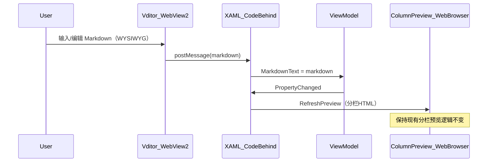

# Vditor WYSIWYG Markdown 编辑器集成

## 技术选型

- **Vditor 3.11.2** — 浏览器端 Markdown 编辑器，支持 IR（即时渲染）模式，体验接近 Typora
  - `getValue()` / `setValue(markdown)` 直接操作 Markdown（无需 HTML<->MD 转换）
  - 内置工具栏：标题 Ctrl+1-4、加粗、斜体、有序/无序列表切换、图片、表格、引用等
  - 内置暗色主题、中文语言包
  - CDN 加载：`https://unpkg.com/vditor@3.11.2/dist/`
- **WebView2** — Chromium 内核，替代 IE11 的 WPF WebBrowser，支持现代 JS
  - NuGet: `Microsoft.Web.WebView2`
  - 项目 net48 兼容，Windows 10/11 自带 Runtime

## 架构



核心原则：**只替换左侧编辑器**，右侧分栏预览、ViewModel、MText 渲染链路全部保持不变。

## 文件变更清单

### 1. `HyCADTool.Refactored.csproj` — 添加 WebView2 依赖

```xml
<PackageReference Include="Microsoft.Web.WebView2" Version="1.0.3650.58" />
```

### 2. 新建 `Domain/Models/Text/VditorHtmlTemplate.cs` — Vditor HTML 模板

生成嵌入 Vditor 编辑器的完整 HTML 页面字符串：

- IR 模式 (`mode: 'ir'`)，暗色主题 (`theme: 'dark'`)，中文 (`lang: 'zh_CN'`)
- 工具栏配置：`headings, bold, italic, strike, |, list, ordered-list, check, |, quote, code, inline-code, |, link, table, line, |, upload, undo, redo`
- `input` 回调 → `window.chrome.webview.postMessage(vditor.getValue())`
- 图片处理：不配置上传服务器，粘贴图片自动转为 base64 内联
- 暴露 JS 函数：`setContent(md)` 供 C# 调用设置内容

### 3. `MarkdownEditorDialog.xaml` — 替换左侧编辑器

- 添加 xmlns：`xmlns:wv2="clr-namespace:Microsoft.Web.WebView2.Wpf;assembly=Microsoft.Web.WebView2.Wpf"`
- 左侧面板：移除 `TextBox`，替换为 `<wv2:WebView2 x:Name="EditorWebView" />`
- 左侧标题栏从"Markdown编辑"改为"编辑器"
- 右侧分栏预览及工具栏完全保留不变

### 4. `MarkdownEditorDialog.xaml.cs` — WebView2 初始化与 JS 互操作

- `InitEditorAsync()`：
  1. 设置 UserDataFolder（`%LocalAppData%/HyCADTool/WebView2`）
  2. `await EditorWebView.EnsureCoreWebView2Async(env)`
  3. `NavigateToString(VditorHtmlTemplate.Generate(initialMarkdown))`
  4. 等待 Vditor 加载完成（JS ready 信号）
- `WebMessageReceived` 事件处理：
  - 接收 Vditor `input` 回调发来的 Markdown 字符串
  - 更新 `ViewModel.MarkdownText`（不触发回写循环）
- `SetEditorContent(markdown)`：调用 JS `setContent(md)` 设置编辑器内容
- `OnPropChanged` 无需监听 `MarkdownText`（编辑器是唯一写入源）
- `RefreshPreview()` 保持不变（从 `ViewModel.MarkdownText` 读取）

### 5. `MarkdownEditorViewModel.cs` — 微调

- `MarkdownText` setter 增加标志位 `_isUpdatingFromEditor` 避免循环更新
- 其余逻辑不变（BuildConfig、SplitMarkdownByColumns、ExecuteInsert 等）

## Vditor 工具栏对照 Typora

| Typora 功能 | Vditor 工具栏项 | 快捷键   |
| ----------- | --------------- | -------- |
| 一级标题    | headings        | Ctrl+1   |
| 二级标题    | headings        | Ctrl+2   |
| 三级标题    | headings        | Ctrl+3   |
| 四级标题    | headings        | Ctrl+4   |
| 加粗        | bold            | Ctrl+B   |
| 斜体        | italic          | Ctrl+I   |
| 删除线      | strike          | Ctrl+D   |
| 无序列表    | list            | -        |
| 有序列表    | ordered-list    | -        |
| 任务列表    | check           | -        |
| 引用        | quote           | -        |
| 代码块      | code            | -        |
| 行内代码    | inline-code     | -        |
| 插入图片    | upload (base64) | -        |
| 插入表格    | table           | -        |
| 分隔线      | line            | -        |
| 撤销/重做   | undo, redo      | Ctrl+Z/Y |

## 风险与缓解

- **CDN 依赖**：首次使用需联网加载 Vditor dist 文件。缓解：WebView2 有本地缓存；后续可改为本地打包
- **WebView2 Runtime**：Windows 10 21H2+/Windows 11 已预装。用户 OS 为 10.0.26200，确认兼容
- **编辑器加载延迟**：CDN 首次加载约 1-2 秒。缓解：显示 loading 动画，后续从缓存加载极快
- **图片 base64 体积大**：粘贴高分辨率图片会导致 Markdown 内容膨胀。此为 CAD 设计说明，图片需求不多，可接受