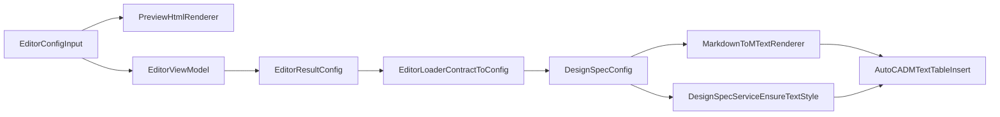

# 插入一致性完善计划（TTF一致性，全阶段）

## 目标

在保留现有命令链路（`hymd`/`hymdE`）的前提下，让“编辑器预览结果”和“AutoCAD 插入结果”在字体、换行、分栏统计上尽量一致，并建立可持续回归机制。

## 范围边界

- 不改业务命令语义：`DesignSpecCommand`/`DesignSpecEditCommand` 仍保持当前入口行为。
- 优先解决高影响偏差：字体不一致、MText 样式覆盖、配置回写丢失。
- 字体策略采用 TTF 一致性优先（你已确认）。

## 现状关键偏差（需优先收敛）

- 样式已存在时未刷新字体文件：`[e:/BaiduSyncdisk/Code/CSharp/CursorProjects/hy-cad-tool/HyCADTool.Refactored/Infrastructure/AutoCAD/Services/DesignSpecService.cs](e:/BaiduSyncdisk/Code/CSharp/CursorProjects/hy-cad-tool/HyCADTool.Refactored/Infrastructure/AutoCAD/Services/DesignSpecService.cs)` 的 `EnsureTextStyle()` 已存在分支仅更新 `TextSize/XScale`。
- 预览字体硬编码：`[e:/BaiduSyncdisk/Code/CSharp/CursorProjects/hy-cad-tool/HyCADTool.MarkdownEditor/Html/PreviewHtmlRenderer.cs](e:/BaiduSyncdisk/Code/CSharp/CursorProjects/hy-cad-tool/HyCADTool.MarkdownEditor/Html/PreviewHtmlRenderer.cs)` 当前固定 `Microsoft YaHei`，未由配置驱动。
- 编辑器回写字体字段不完整：`[e:/BaiduSyncdisk/Code/CSharp/CursorProjects/hy-cad-tool/HyCADTool.MarkdownEditor/ViewModels/EditorViewModel.cs](e:/BaiduSyncdisk/Code/CSharp/CursorProjects/hy-cad-tool/HyCADTool.MarkdownEditor/ViewModels/EditorViewModel.cs)` `BuildConfig()` 未显式承接字体字段，存在默认值覆盖风险。
- 字宽口径存在实现差异：`PreviewHtmlRenderer` JS `charDisplayUnits()` 与 `[e:/BaiduSyncdisk/Code/CSharp/CursorProjects/hy-cad-tool/HyCADTool.Refactored/Domain/Models/Text/DisplayWidthCalculator.cs](e:/BaiduSyncdisk/Code/CSharp/CursorProjects/hy-cad-tool/HyCADTool.Refactored/Domain/Models/Text/DisplayWidthCalculator.cs)` 不完全一致。

## 实施方案

### 阶段1：高收益低风险收敛（先落地）

1. **字体配置全链路保真（round-trip）**
   - 文件：
     - `[e:/BaiduSyncdisk/Code/CSharp/CursorProjects/hy-cad-tool/HyCADTool.MarkdownEditor/ViewModels/EditorViewModel.cs](e:/BaiduSyncdisk/Code/CSharp/CursorProjects/hy-cad-tool/HyCADTool.MarkdownEditor/ViewModels/EditorViewModel.cs)`
     - `[e:/BaiduSyncdisk/Code/CSharp/CursorProjects/hy-cad-tool/HyCADTool.Refactored/Presentation/Commands/EditorLoader.cs](e:/BaiduSyncdisk/Code/CSharp/CursorProjects/hy-cad-tool/HyCADTool.Refactored/Presentation/Commands/EditorLoader.cs)`
   - 动作：显式承接并回写 `FontFileName`、`BigFontFileName`、`BoldFontName`，避免编辑后被默认值覆盖。
2. **修复已存在样式的字体刷新**
   - 文件：`[e:/BaiduSyncdisk/Code/CSharp/CursorProjects/hy-cad-tool/HyCADTool.Refactored/Infrastructure/AutoCAD/Services/DesignSpecService.cs](e:/BaiduSyncdisk/Code/CSharp/CursorProjects/hy-cad-tool/HyCADTool.Refactored/Infrastructure/AutoCAD/Services/DesignSpecService.cs)`
   - 动作：`EnsureTextStyle()` 在 `tst.Has(styleName)` 分支同步更新 `FileName`/`BigFontFileName`/`XScale`。
3. **预览字体改为配置驱动（TTF映射）**
   - 文件：`[e:/BaiduSyncdisk/Code/CSharp/CursorProjects/hy-cad-tool/HyCADTool.MarkdownEditor/Html/PreviewHtmlRenderer.cs](e:/BaiduSyncdisk/Code/CSharp/CursorProjects/hy-cad-tool/HyCADTool.MarkdownEditor/Html/PreviewHtmlRenderer.cs)`
   - 动作：新增字体栈映射逻辑（配置字体 -> 预览CSS font-family），并注入代码块/强调文本的一致字体策略。
4. **统一字符宽度规则**
   - 文件：
     - `[e:/BaiduSyncdisk/Code/CSharp/CursorProjects/hy-cad-tool/HyCADTool.Refactored/Domain/Models/Text/DisplayWidthCalculator.cs](e:/BaiduSyncdisk/Code/CSharp/CursorProjects/hy-cad-tool/HyCADTool.Refactored/Domain/Models/Text/DisplayWidthCalculator.cs)`
     - `[e:/BaiduSyncdisk/Code/CSharp/CursorProjects/hy-cad-tool/HyCADTool.MarkdownEditor/Html/PreviewHtmlRenderer.cs](e:/BaiduSyncdisk/Code/CSharp/CursorProjects/hy-cad-tool/HyCADTool.MarkdownEditor/Html/PreviewHtmlRenderer.cs)`
   - 动作：使 JS/C# 字宽判断规则完全一致，稳定 `CharsPerColumn` 与落图栏宽关系。

### 阶段2：字符与样式治理（减少局部突变）

1. **粗体渲染策略统一**
   - 文件：`[e:/BaiduSyncdisk/Code/CSharp/CursorProjects/hy-cad-tool/HyCADTool.Refactored/Domain/Models/Text/MarkdownToMTextRenderer.cs](e:/BaiduSyncdisk/Code/CSharp/CursorProjects/hy-cad-tool/HyCADTool.Refactored/Domain/Models/Text/MarkdownToMTextRenderer.cs)`
   - 动作：从“强切 SimHei”调整为“同家族优先/可配置Bold”，避免段内跨家族跳变。
2. **特殊字符治理（提示+降级）**
   - 文件：
     - `[e:/BaiduSyncdisk/Code/CSharp/CursorProjects/hy-cad-tool/HyCADTool.Refactored/Domain/Models/Text/MarkdownToMTextRenderer.cs](e:/BaiduSyncdisk/Code/CSharp/CursorProjects/hy-cad-tool/HyCADTool.Refactored/Domain/Models/Text/MarkdownToMTextRenderer.cs)`
     - `[e:/BaiduSyncdisk/Code/CSharp/CursorProjects/hy-cad-tool/HyCADTool.MarkdownEditor/Views/EditorWindow.xaml.cs](e:/BaiduSyncdisk/Code/CSharp/CursorProjects/hy-cad-tool/HyCADTool.MarkdownEditor/Views/EditorWindow.xaml.cs)`
   - 动作：对高风险字符（如圈号数字）做插入前提示；提供可选降级（例如 `① -> (1)`）。
3. **代码块字体回退链统一**
   - 文件：
     - `[e:/BaiduSyncdisk/Code/CSharp/CursorProjects/hy-cad-tool/HyCADTool.Refactored/Domain/Models/Text/MarkdownToMTextRenderer.cs](e:/BaiduSyncdisk/Code/CSharp/CursorProjects/hy-cad-tool/HyCADTool.Refactored/Domain/Models/Text/MarkdownToMTextRenderer.cs)`
     - `[e:/BaiduSyncdisk/Code/CSharp/CursorProjects/hy-cad-tool/HyCADTool.MarkdownEditor/Html/PreviewHtmlRenderer.cs](e:/BaiduSyncdisk/Code/CSharp/CursorProjects/hy-cad-tool/HyCADTool.MarkdownEditor/Html/PreviewHtmlRenderer.cs)`
   - 动作：统一 `Consolas -> Courier New -> monospace` 回退链。

### 阶段3：一致性回归体系建设

1. **新增一致性回归样例集**
   - 目录：`[e:/BaiduSyncdisk/Code/CSharp/CursorProjects/hy-cad-tool/HyCADTool.MarkdownEditor/RegressionSamples](e:/BaiduSyncdisk/Code/CSharp/CursorProjects/hy-cad-tool/HyCADTool.MarkdownEditor/RegressionSamples)`
   - 动作：补充中英混排、粗体、特殊符号、代码块、表格样例。
2. **定义对比指标与报告模板**
   - 文档：`[e:/BaiduSyncdisk/Code/CSharp/CursorProjects/hy-cad-tool/doc](e:/BaiduSyncdisk/Code/CSharp/CursorProjects/hy-cad-tool/doc)`
   - 动作：固定验收指标（换行偏差、字符容纳偏差、特殊字符可显示率）。
3. **固定 C2->C1 回归流程**
   - 文件：`[e:/BaiduSyncdisk/Code/CSharp/CursorProjects/hy-cad-tool/HyCADTool.Refactored/Test/TestCommand.cs](e:/BaiduSyncdisk/Code/CSharp/CursorProjects/hy-cad-tool/HyCADTool.Refactored/Test/TestCommand.cs)`
   - 动作：保持 `DesignSpecCommand` 作为一致性回归入口，形成发布前必跑清单。

## 架构视图（本次改造焦点）

## 验收标准

- 预览与插入字体家族一致（正文/粗体/代码块按策略可追踪）。
- 修改字体配置后，插入结果立即生效（含已存在样式）。
- `CharsPerColumn` 与实际插入换行偏差显著收敛（目标 <= 5%）。
- 特殊字符出现时有提示或可预期降级，不再“静默变形”。