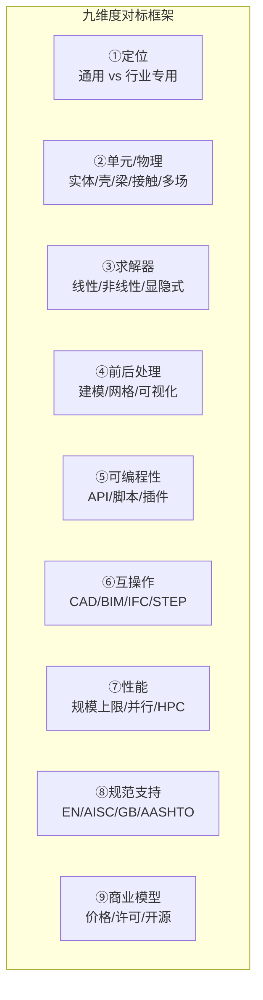
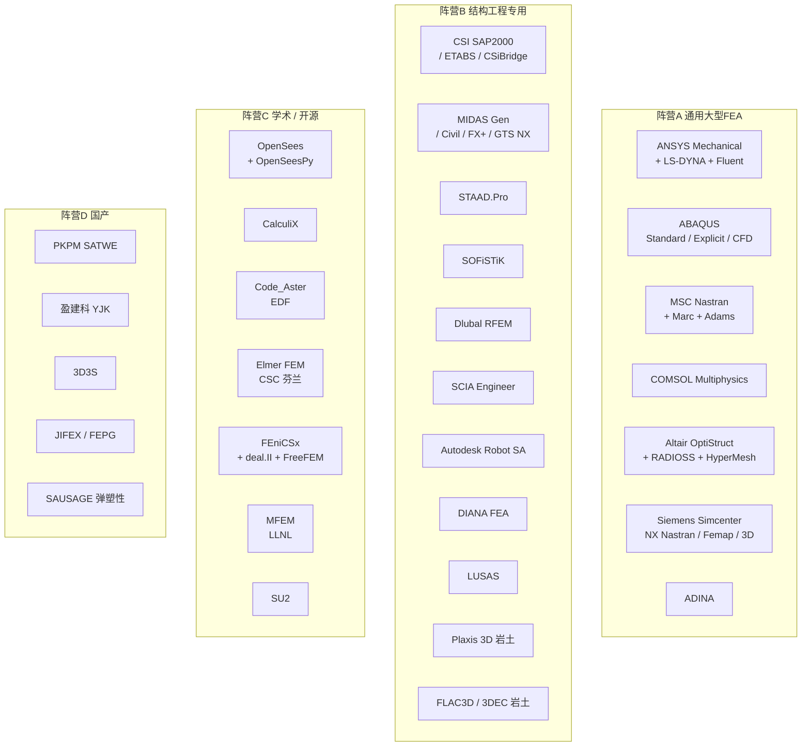
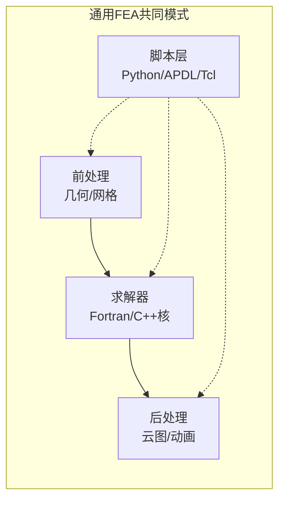
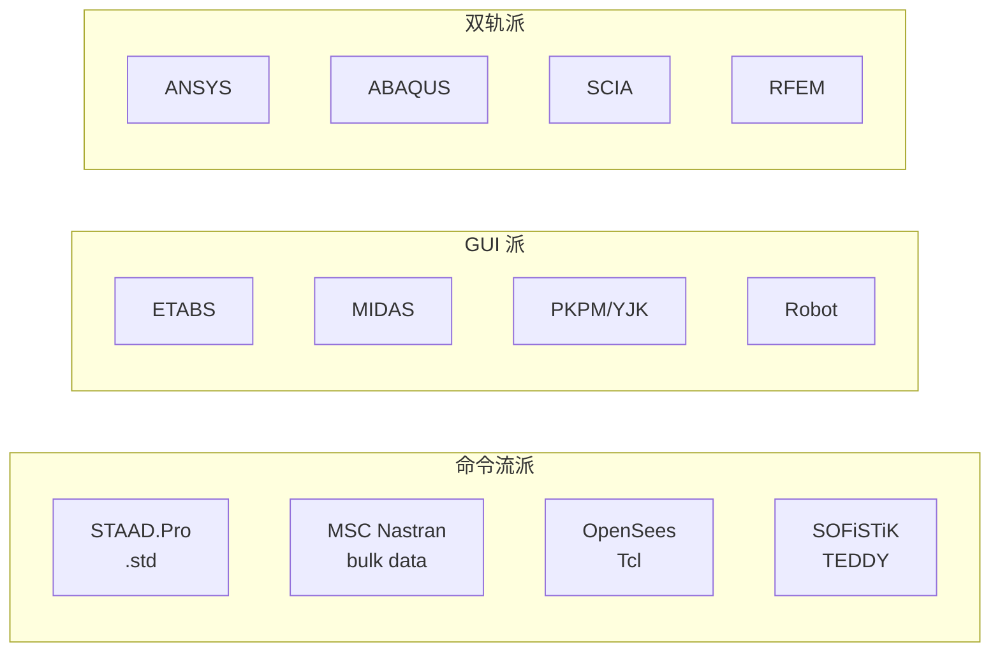
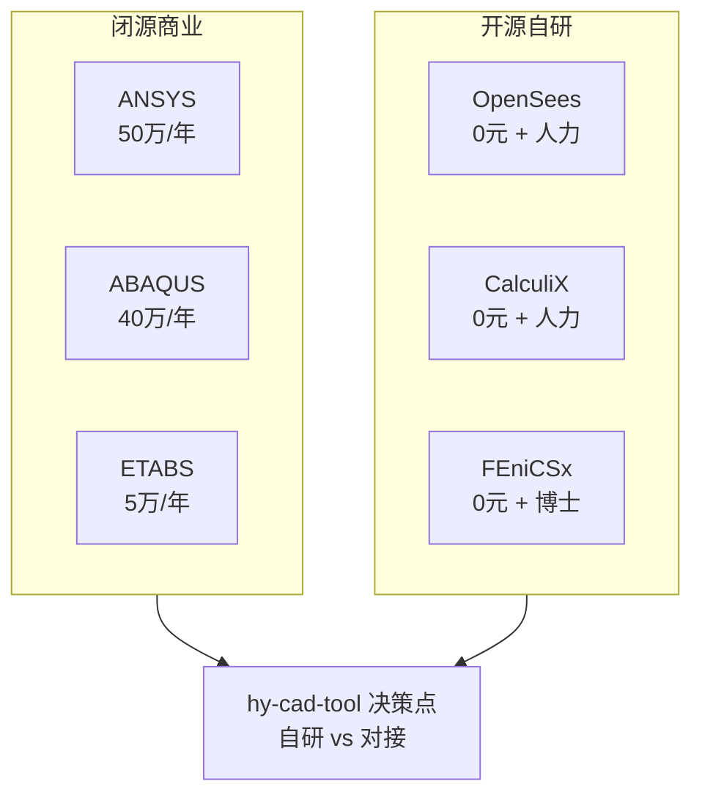
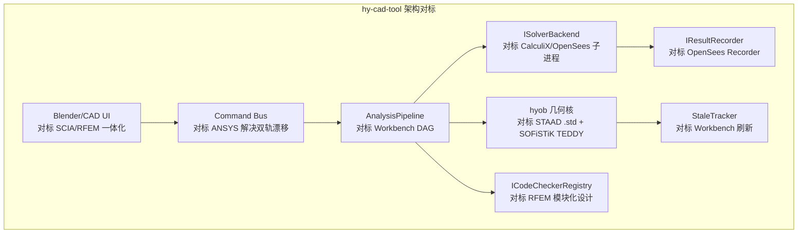

# 全球三维有限元软件对标调研：优缺点比较与启示

> 调研日期：2026-05-14
> 调研背景：为 **hy-cad-tool** 在结构分析、岩土沉降、几何—有限元数据互通等方向选型与架构演进提供对标依据。
> 调研范围：当前国际上仍在持续维护、在工程或科研一线大规模使用的**三维有限元（3D FEM）软件**，覆盖通用 FEA、结构工程专用、开源/学术、国产四大阵营共 25+ 款产品。
> 写作思路参考：`E:\HyTool\Doc` 中的"软件—借鉴与超越"系列分析方法，重点不在于罗列功能，而在于**定位差异、设计权衡、对自研工具的启示**。

## 一、调研框架与维度

不同三维有限元软件的差异，远不止"哪个更强"那么简单。本次对标围绕**九个维度**展开，避免落入"功能堆砌式"对比的陷阱。

| 维度 | 关键问题 | 对 hy-cad-tool 的意义 |
|------|---------|----------------------|
| ①定位 | 通用科研 / 行业工程 / 教学开源？ | 决定自研工具的"参考线" |
| ②单元/物理 | 是否支持 3D 实体、接触、流固耦合、显式动力？ | 影响 `IElementFormulationPlugin` 设计 |
| ③求解器 | 直接法/迭代法、隐式/显式、AMG？ | `ISolverBackend` 抽象边界 |
| ④前后处理 | 建模交互、网格自动化、结果可视化 | 与 Blender/CAD 端的衔接策略 |
| ⑤可编程性 | Python/Tcl/C++ API、UEL/UMAT 扩展 | DSL/MCP 接入参考 |
| ⑥互操作 | DWG/IFC/STEP/Nastran bulk/iGES 互导 | `hyob` 与 DWG 双轨设计的对标 |
| ⑦性能 | 节点上限、并行模式、内存策略 | `ModelCapacityPolicy` 选型 |
| ⑧规范支持 | 各国设计规范模块化能力 | `ICodeCheckerRegistry` 思路 |
| ⑨商业模型 | License 成本、出口管制、生态 | 国产化与开源策略 |

---

## 二、软件阵营总览（四大阵营 × 25 款产品）

> **统计口径**：每个阵营内并非穷举，而是选**市场占有率显著**或**设计理念有代表性**的产品；每款列出的兄弟产品（如 LS-DYNA、Fluent、HyperMesh）单独列时分量更重，但在 3D 结构 FEM 语境下属同一公司线。

---

## 三、阵营A：通用大型 FEA — "做什么都行，但很重"

这一组的共同特征是**多物理场全覆盖、求解器自研、内核 Fortran/C++、脚本 Python/APDL、价格 5 万 ~ 50 万人民币/年/license**。它们是科研界的"基础设施"，也是航空/汽车/能源行业的标准答案。

### 3.1 ANSYS Mechanical / Workbench / LS-DYNA

| 项 | 说明 |
|----|------|
| **定位** | 全物理场通用 FEA 之王，Workbench 把几何—网格—物理—求解—后处理串成 DAG |
| **核心优势** | ① 单元库最丰富（200+ 单元）；② 隐式 + 显式（LS-DYNA 收购后）+ CFD（Fluent）一体；③ Parameter/Design Point 驱动的优化与 DOE；④ APDL 命令流 + Python 双脚本 |
| **核心劣势** | ① 重量级，启动慢、许可结构复杂（HPC pack、单元数限制）；② Workbench 抽象层和 APDL 命令层会"双轨漂移"；③ 高昂年费 |
| **3D FEM 专项** | SOLID185/186/187（六面体/四面体/二阶）、CONTA174、Cohesive Zone、显式 SPH/ALE 完备 |
| **hy-cad-tool 启示** | 借鉴 Workbench 的 **DAG 项目示意图** 做分析流水线；警惕双轨脚本带来的同步问题 |

### 3.2 ABAQUS（Dassault SIMULIA）

| 项 | 说明 |
|----|------|
| **定位** | 非线性 FEA 标杆，工业界做"难问题"（接触、橡胶、复合材料、地震）的首选 |
| **核心优势** | ① 非线性求解器口碑最好（Newton + 弧长 + Riks）；② Python 驱动的 CAE，**"慢语言管快计算"** 范式典范；③ UEL/UMAT/UMESHMOTION 扩展面广，研究生态强 |
| **核心劣势** | ① 价格与许可比 ANSYS 更激进；② 前处理 CAE 网格能力一般，多与 HyperMesh 搭配；③ 显式 Standard / Explicit 切换需重新提交 |
| **3D FEM 专项** | C3D8R/C3D10、CGAX（轴对称）、SPRING-DASHPOT、Cohesive、XFEM 完备 |
| **hy-cad-tool 启示** | "**Python 编排 + 编译核**"是当前最普适的 FEM 架构，对应 hy-cad-tool 的 **C# 编排 + 可插拔 SolverBackend** |

### 3.3 MSC Nastran / Marc / Adams

| 项 | 说明 |
|----|------|
| **定位** | 航空航天起家的"老贵族"，bulk data deck 格式是事实工业标准 |
| **核心优势** | ① 模态、频响、随机振动、气弹耦合（Aeroelasticity）；② Marc 强非线性；③ Adams 多体动力学最强 |
| **核心劣势** | ① 前处理弱，靠 Patran 或 Femap；② 命令文件文化与 GUI 割裂；③ 更新节奏慢 |
| **3D FEM 专项** | CHEXA/CTETRA/CPENTA、Glue 接触、SOL 101~700 求解流程 |
| **hy-cad-tool 启示** | Nastran bulk data 是**最值得对标的纯文本工程互操作格式**——可审计、可 diff、可版本管理；类比可作为 `hyob` 文本对照层 |

### 3.4 COMSOL Multiphysics

| 项 | 说明 |
|----|------|
| **定位** | 多物理场耦合最直观的产品，方程层级可编辑（弱形式、PDE） |
| **核心优势** | ① 物理场模块自由组合（电—热—力—流—化学）；② 数学接口允许用户输入任意 PDE；③ MATLAB LiveLink，AppDesigner 做小工具 |
| **核心劣势** | ① 求解大模型时内存爆炸（直接法默认）；② 不擅长接触与显式动力；③ 单元库较窄 |
| **3D FEM 专项** | 偏物理研究而非结构工程；3D 实体支持但非首选 |
| **hy-cad-tool 启示** | 借鉴"**物理模块可插拔**"——hy-cad-tool 不必自做求解，但要把"问题类型"做成插件 |

### 3.5 Altair（OptiStruct + RADIOSS + HyperWorks）

| 项 | 说明 |
|----|------|
| **定位** | 拓扑优化与显式碰撞两手抓 |
| **核心优势** | ① OptiStruct 是**拓扑/形状/尺寸优化**事实标准；② HyperMesh 网格能力业界最强；③ RADIOSS 显式与 LS-DYNA 抗衡 |
| **核心劣势** | ① 模块价格分散；② 国内生态远弱于 ANSYS |
| **hy-cad-tool 启示** | 优化是 hy-cad-tool **Annotations/04 通用优化引擎**的可借鉴方向——OptiStruct 把优化对象、约束、目标函数都做成"可被 UI 编辑"的实体 |

### 3.6 Siemens Simcenter（NX Nastran + Femap + STAR-CCM+）

| 项 | 说明 |
|----|------|
| **定位** | 与 NX CAD 深度集成的西门子线 FEA |
| **核心优势** | ① 与 CAD 几何完美耦合，**关联式建模**；② 数字孪生平台 Teamcenter 一体化 |
| **核心劣势** | ① 学习曲线陡；② 价格不透明 |
| **hy-cad-tool 启示** | "**CAD 几何变更 → FEM 模型自动跟踪**"是 hy-cad-tool 想做的方向；Simcenter 的 NX 关联是金标准 |

### 3.7 ADINA

| 项 | 说明 |
|----|------|
| **定位** | Bathe 教授学派，FSI（流固耦合）老牌产品，2022 被 Bentley 收购 |
| **核心优势** | 非线性求解理论扎实，FSI 不靠耦合接口而是真正共求解 |
| **核心劣势** | 用户群小、商业推广弱 |
| **hy-cad-tool 启示** | 提醒——FEM 软件的**学术血统**会决定它在某些领域不可替代 |

### 阵营A 小结

| 共性 | 说明 |
|------|------|
| **三层架构** | 前处理 ↔ 求解 ↔ 后处理 明显分离 |
| **脚本与 GUI 双轨** | 灵活但易漂移，必须有命令总线统一 |
| **价格高昂** | 单 license 5 万~ 50 万 RMB/年，HPC 包另算 |
| **国产替代痛点** | 出口管制（如 ANSYS 对俄罗斯）、设计规范本地化、CNAS/CECS 认证空白 |

---

## 四、阵营B：结构工程专用 — "对工程师友好，对程序员封闭"

这一组针对建筑、桥梁、岩土工程师，**规范设计模块**是核心卖点，而非求解器本身。

### 4.1 CSI 三剑客：SAP2000 / ETABS / CSiBridge

| 项 | 说明 |
|----|------|
| **定位** | SAP2000 通用、ETABS 建筑、CSiBridge 桥梁，**美标 AISC/ACI/AASHTO** 主线 |
| **核心优势** | ① UI 极成熟，工程师上手快；② OAPI（COM）开放但稳定，可二次开发；③ 报告输出工整 |
| **核心劣势** | ① 3D 实体单元能力一般，主要是杆系 + 壳；② 隐式黑盒，质量集聚等假设不可见；③ 大模型（>100k 节点）易崩 |
| **3D FEM 专项** | ASOLID 实体单元但非线性能力弱；以梁柱壳为主 |
| **hy-cad-tool 启示** | ETABS 的 **Story/Grid/Diaphragm** 心智 = 工程师真实思维，hy-cad-tool 的 Layers 系统可对标 |

### 4.2 MIDAS 系列（Gen / Civil / FX+ / GTS NX）

| 项 | 说明 |
|----|------|
| **定位** | 韩国线、亚洲市占率高，**Gen 建筑、Civil 桥梁、FX+ 通用 FEA、GTS NX 岩土** |
| **核心优势** | ① 施工阶段分析（Stage Construction）业界最完善；② 向导（Wizard）建模降低门槛；③ 中国规范（GB）支持齐全 |
| **核心劣势** | ① 非线性能力中等；② API（COM/Python）相对封闭；③ License 锁死硬件 |
| **3D FEM 专项** | FX+ 与 GTS NX 走真正的 3D 实体路线，岩土能力强 |
| **hy-cad-tool 启示** | **Wizard 模板系统**是结构工程师真实诉求；hy-cad-tool 的 `templates/` 目录设计可借鉴 |

### 4.3 STAAD.Pro（Bentley）

| 项 | 说明 |
|----|------|
| **定位** | 命令流文化代表，`.std` 文件是"输入即模型" |
| **核心优势** | ① 文本输入可 diff、可批处理、可服务器端运行；② 容量上限文档化透明；③ 多国规范覆盖 |
| **核心劣势** | ① UI 已显年迈；② 实体单元能力弱；③ 互导时偏心/组合易丢失 |
| **hy-cad-tool 启示** | `.std` 是工程界**人类可读的 DSL** 范本——hy-cad-tool 的 `hyob` 文本层应学习"既能用又能审计" |

### 4.4 SOFiSTiK（德国）

| 项 | 说明 |
|----|------|
| **定位** | 桥梁与施工阶段分析顶级产品，**TEDDY 文本输入 + CABD 几何**双轨 |
| **核心优势** | ① 桥梁预应力、徐变收缩、施工阶段最专业；② 文本输入既是建模又是计算书；③ 与 Revit/Rhino 深度集成 |
| **核心劣势** | ① 学习曲线极陡（TEDDY 是脚本语言）；② 中国市场推广少 |
| **hy-cad-tool 启示** | **文本输入文件 = 计算书 = 模型** 三位一体的设计哲学，是 hy-cad-tool **可审计性**的终极形态 |

### 4.5 Dlubal RFEM / RSTAB（德国）

| 项 | 说明 |
|----|------|
| **定位** | 欧标 EN 199x 主线，**主模型 + 设计模块** 叠加售卖 |
| **核心优势** | ① 3D 实体单元能力优于 ETABS/STAAD；② COM/RESTful API 开放；③ 模块化清晰 |
| **核心劣势** | ① 模块碎片化，凑齐能力价格不便宜；② 中国规范支持有限 |
| **hy-cad-tool 启示** | **模块化经济**——把核心建模与各规范设计分开包装，避免"半个功能一个 License" |

### 4.6 SCIA Engineer（比利时，Nemetschek）

| 项 | 说明 |
|----|------|
| **定位** | 一体化 UX，强调"单窗口完成建模—分析—设计—出图" |
| **核心优势** | ① Open API（.NET）极开放；② IFC 双向最佳；③ 参数化（Grasshopper 直连） |
| **核心劣势** | ① 在亚洲市占率低；② 大模型性能不及 RFEM |
| **hy-cad-tool 启示** | **.NET API** 是 hy-cad-tool（C# 项目）最自然的对标；可研究 SCIA OpenAPI 的边界设计 |

### 4.7 Autodesk Robot Structural Analysis

| 项 | 说明 |
|----|------|
| **定位** | Autodesk 闭环（Revit ↔ Robot ↔ Advance Steel） |
| **核心优势** | 与 Revit 链路最近；多国规范完备 |
| **核心劣势** | ① 已被 Autodesk 边缘化（北美区已停售给新客户）；② API 不稳定 |
| **hy-cad-tool 启示** | **不要把命运绑定到上游 CAD 厂商的子产品**——Autodesk 自己也会放弃 Robot |

### 4.8 DIANA FEA（荷兰）

| 项 | 说明 |
|----|------|
| **定位** | 混凝土与岩土非线性，**裂缝、损伤、地震** |
| **核心优势** | 钢筋混凝土损伤本构、长期效应、抗震评估业界最强 |
| **核心劣势** | 用户群小，UI 偏学术 |
| **hy-cad-tool 启示** | 学术血统的 FEM 在**特定难题**上不可替代，hy-cad-tool 不应试图覆盖所有 |

### 4.9 LUSAS（英国）

| 项 | 说明 |
|----|------|
| **定位** | 桥梁与岩土，英国/中东市场强 |
| **核心优势** | 3D 实体桥梁建模 + 多阶段施工 |
| **核心劣势** | 国内推广少 |

### 4.10 岩土专项：Plaxis 3D / FLAC3D / 3DEC

| 软件 | 厂商 | 核心特征 |
|------|------|---------|
| **Plaxis 3D** | Bentley | 隐式 FEM、岩土本构丰富、UI 友好、**国内基坑/隧道工程标配** |
| **FLAC3D** | Itasca | 显式有限差分（FDM）但通常并入"3D FEM"统称、塑性流动好 |
| **3DEC** | Itasca | 离散元（DEM）、节理岩体专用 |
| **MIDAS GTS NX** | MIDAS | 综合岩土 FEM，UI 与 MIDAS 系列一致 |

**hy-cad-tool 启示**：hy-cad-tool 的道路工程方向天然涉及**路基沉降、边坡稳定、桩基**等岩土问题，Plaxis 3D 是首要对标对象；其 **stage construction + dewatering + consolidation** 三层抽象值得学习。

### 阵营B 小结

| 共性 | 说明 |
|------|------|
| **规范是核心** | 求解器只是手段，设计验算模块才是工程师购买理由 |
| **UI 重于一切** | 抽象越贴近工程师术语（梁柱墙板而非节点单元）越有竞争力 |
| **3D 实体能力弱** | 多数偏杆系 + 壳，真 3D 实体大模型不擅长 |
| **互操作痛点** | 与 BIM/CAD 互导时偏心、约束、组合类型频繁丢失 |

---

## 五、阵营C：学术 / 开源 — "免费但需要硬功夫"

### 5.1 OpenSees（UC Berkeley）

| 项 | 说明 |
|----|------|
| **定位** | 地震工程与抗震研究事实标准，**Tcl/Python 脚本驱动** |
| **核心优势** | ① Fiber section、纤维梁柱单元业界标杆；② OpenSeesPy 让 Python 用户起飞；③ Domain/Analysis/Recorder 抽象清晰 |
| **核心劣势** | ① 学习曲线陡（必须懂单元/材料/积分器）；② 前后处理几乎为零；③ 大型 3D 实体场景能力弱 |
| **3D FEM 专项** | 主要走杆系 + 壳 + 局部实体；BrickUP 等 3D 单元用于桩—土 |
| **hy-cad-tool 启示** | `IAnalysisDriver` + `IResultRecorder` 抽象直接来自 OpenSees |

### 5.2 CalculiX（德国，免费但闭源核心）

| 项 | 说明 |
|----|------|
| **定位** | **ABAQUS 兼容**输入文件的开源求解器 |
| **核心优势** | ① 直接读 `.inp` 文件，可作 ABAQUS 平替；② CGX 可做基础前后处理 |
| **核心劣势** | UI 极简陋，非线性能力不及 ABAQUS |
| **hy-cad-tool 启示** | "**兼容主流文本格式**"是开源工具站稳脚跟的关键——`hyob` 设计可借鉴 |

### 5.3 Code_Aster（EDF 法国电力）

| 项 | 说明 |
|----|------|
| **定位** | 工业级开源 FEA，EDF 自核反应堆论证使用 |
| **核心优势** | ① 单元/物理/材料覆盖广；② Salome-Meca 集成前后处理 |
| **核心劣势** | ① 文档以法语为主；② 命令文件极复杂 |

### 5.4 Elmer FEM（芬兰 CSC）

| 项 | 说明 |
|----|------|
| **定位** | 多物理场开源，结构 + 流体 + 电磁 + 声 |
| **核心优势** | GUI 友好（ElmerGUI），适合教学 |
| **核心劣势** | 工业大模型能力一般 |

### 5.5 数值库层：FEniCSx / deal.II / MFEM / FreeFEM

| 库 | 维护方 | 特征 | hy-cad-tool 关联 |
|----|--------|------|------------------|
| **FEniCSx** | 多机构 | Python/C++、自动微分变分形式 | 研究型，非工程直用 |
| **deal.II** | 海德堡等 | C++ 模板、AMR 自适应网格 | 学术，对接难 |
| **MFEM** | LLNL | C++、高阶有限元、GPU | HPC 方向参考 |
| **FreeFEM** | INRIA | 自有语言、教学神器 | 概念验证 |
| **GetFEM++** | INRIA | C++/Python 通用 | — |

### 5.6 SU2 / OpenFOAM（流体 FEM/FVM 提及）

虽不属 3D 结构 FEM，但 hy-cad-tool 若涉**风荷载、水流冲刷**等耦合问题，可考虑后端调用 OpenFOAM。

### 阵营C 小结

| 共性 | 说明 |
|------|------|
| **零 License 成本** | 但人力投入是商业软件的 3~10 倍 |
| **学术血统决定专长** | OpenSees 抗震、Code_Aster 核能、MFEM HPC |
| **前后处理短板** | 多数依赖 Salome / ParaView / GiD 等第三方 |
| **可作为后端求解器** | hy-cad-tool 不需自研，但可对接 |

---

## 六、阵营D：国产 — "工程友好但研发投入不足"

### 6.1 PKPM SATWE（中国建筑科学研究院）

| 项 | 说明 |
|----|------|
| **定位** | 中国建筑结构设计软件的国家队，**SATWE 是 3D 空间分析模块** |
| **核心优势** | ① 完全贴合 GB 50011/50010/50017 等国标；② 施工图自动出图；③ 国内市占率 >50% |
| **核心劣势** | ① 历史包袱沉重，文件—数据传递为主；② 二维输入习惯，3D 思维弱；③ API 不开放 |
| **3D FEM 专项** | SATWE-FEM 模块支持，但实体单元能力有限 |

### 6.2 盈建科 YJK

| 项 | 说明 |
|----|------|
| **定位** | PKPM 的"年轻对手"，**算法重写、UI 现代化** |
| **核心优势** | ① 标准层组装清晰；② AI 识图、智能优选；③ 性能与稳定性优于 PKPM |
| **核心劣势** | ① 异形结构仍弱；② 国际规范支持空白 |
| **hy-cad-tool 启示** | YJK 的**标准层 + 指标 + 导荷**三件套是中国结构工程师的真实心智，hy-cad-tool 若涉建筑要尊重此模型 |

### 6.3 3D3S（同济大学）

| 项 | 说明 |
|----|------|
| **定位** | 钢结构与膜结构、空间网格结构 |
| **核心优势** | 找形分析、张拉成形、节点设计 |
| **核心劣势** | 用户群相对小众 |

### 6.4 JIFEX / FEPG（大连理工 / 中科院）

| 项 | 说明 |
|----|------|
| **定位** | 学术血统的国产通用 FEA |
| **核心优势** | 全自主、可生成有限元程序代码（FEPG 元编程） |
| **核心劣势** | 工程化与生态远弱于商业产品 |

### 6.5 SAUSAGE（北京筑信达）

| 项 | 说明 |
|----|------|
| **定位** | **大震弹塑性时程分析**专项 |
| **核心优势** | GPU 加速、与 PKPM/YJK 模型对接 |
| **核心劣势** | 仅做大震一件事 |

### 阵营D 小结

| 共性 | 说明 |
|------|------|
| **规范本地化第一** | GB 标准是天然护城河 |
| **求解器内核是短板** | 多依赖 SuperLU/PARDISO 等开源直接法 |
| **API 极封闭** | 二次开发难，AI/MCP 接入几乎不可能 |
| **机会窗口** | 自主可控政策 + 出口管制 → 国产替代窗口正在打开 |

---

## 七、横向对比矩阵（精简版）

> 说明：◎ 优秀 / ○ 良好 / △ 一般 / × 弱

| 软件 | 3D实体 | 非线性 | 接触 | 多物理 | 前处理 | 后处理 | API | 互操作 | 性价比 |
|------|:------:|:------:|:----:|:------:|:------:|:------:|:---:|:------:|:------:|
| ANSYS Mechanical | ◎ | ◎ | ◎ | ◎ | ○ | ◎ | ◎ | ○ | × |
| ABAQUS | ◎ | ◎ | ◎ | ○ | △ | ○ | ◎ | ○ | × |
| MSC Nastran | ◎ | ○ | ○ | △ | △ | △ | ○ | ◎ | × |
| COMSOL | ○ | ○ | △ | ◎ | ○ | ○ | ○ | △ | × |
| Altair OptiStruct | ◎ | ◎ | ◎ | ○ | ◎ | ◎ | ○ | ○ | △ |
| LS-DYNA | ◎ | ◎ | ◎ | ○ | △ | △ | ○ | ○ | × |
| Simcenter | ◎ | ○ | ○ | ○ | ◎ | ○ | ○ | ◎ | × |
| SAP2000/ETABS | △ | △ | △ | × | ◎ | ◎ | ◎ | ○ | ○ |
| MIDAS Gen/Civil | ○ | ○ | △ | △ | ◎ | ◎ | △ | ○ | ○ |
| STAAD.Pro | △ | △ | × | × | △ | ○ | ○ | ○ | ○ |
| SOFiSTiK | ○ | ○ | △ | △ | △ | ○ | ○ | ◎ | △ |
| RFEM | ○ | ○ | △ | △ | ○ | ○ | ○ | ◎ | ○ |
| SCIA Engineer | ○ | ○ | △ | △ | ○ | ○ | ◎ | ◎ | ○ |
| Plaxis 3D | ○ | ◎ | ◎ | ○ | ○ | ○ | △ | △ | △ |
| FLAC3D | ◎ | ◎ | ◎ | ○ | △ | △ | ○ | △ | △ |
| OpenSees | △ | ◎ | ○ | △ | × | × | ◎ | △ | ◎ |
| CalculiX | ○ | ○ | ○ | △ | △ | △ | △ | ○（ABAQUS兼容） | ◎ |
| Code_Aster | ◎ | ◎ | ○ | ○ | △ | △ | ○ | △ | ◎ |
| Elmer | ○ | △ | △ | ◎ | ○ | △ | ○ | △ | ◎ |
| FEniCSx | ◎（科研） | ◎（科研） | △ | ◎ | × | × | ◎ | × | ◎ |
| PKPM SATWE | △ | △ | × | × | ◎（建筑） | ◎ | × | △ | ○ |
| YJK | △ | △ | × | × | ◎（建筑） | ◎ | △ | △ | ○ |
| SAUSAGE | ○ | ◎ | ○ | × | △ | ○ | △ | ○ | △ |

---

## 八、设计哲学的几条关键分裂线

理解这些"分裂线"远比记住功能更重要——它们决定了**hy-cad-tool 该站在哪一边、为什么**。

### 8.1 命令流文化 vs GUI 文化

| 派别 | 优势 | 劣势 | hy-cad-tool 选择 |
|------|------|------|------------------|
| 命令流 | 可审计、可 diff、CI 友好 | 入门门槛 | `hyob` 作为底层 |
| GUI | 上手快、工程师友好 | 不可追溯 | Blender/CAD 端 |
| 双轨 | 灵活 | 易漂移 | **Command Bus 单一入口** |

### 8.2 通用 FEA vs 行业专用

通用派（ANSYS/ABAQUS）以**单元和材料**为一等公民，行业派（ETABS/MIDAS）以**梁柱墙板**为一等公民。

**hy-cad-tool 启示**：在 hy-cad-tool 的道路工程领域，对标"行业派"——把 **路基、面层、桩、挡墙、桥涵** 做成一等公民，而非通用 3D 实体。

### 8.3 闭源高价 vs 开源自研

| 策略 | 选项 | 风险 |
|------|------|------|
| **自研内核** | 借鉴 OpenSees 抽象，C# 实现 | 投入 5+ 人年 |
| **对接开源** | CalculiX/Code_Aster 作 backend | License 与维护风险低 |
| **对接商业** | 通过 ABAQUS Python API | License 不可控 |
| **混合** | 内置简单线弹性，复杂问题外接 | 推荐 |

### 8.4 单元中心 vs 几何中心

老派 FEM（Nastran）以**节点—单元**为模型；现代派（NX/Simcenter）以**几何特征**为模型，网格随几何变化自动重生成。

**hy-cad-tool 启示**：hy-cad-tool 的 `hyob` 路线本质上是"几何为先、有限元为衍生"——这是**正确的现代方向**，但要警惕几何变更后 FEM 结果失效的同步问题（参考 ANSYS Workbench 的 `StaleTracker`）。

### 8.5 隐式 vs 显式

| 派别 | 适用 | 代表 |
|------|------|------|
| **隐式** | 静力、慢速、平衡问题 | ANSYS Mechanical、ABAQUS Standard、SAP2000 |
| **显式** | 冲击、碰撞、爆炸、高速 | LS-DYNA、ABAQUS Explicit、RADIOSS |

**hy-cad-tool 启示**：道路工程 95% 是隐式（静力 + 准静态施工阶段），可暂不考虑显式。

---

## 九、对 hy-cad-tool 的具体启示

将以上调研收敛为对项目**架构与路线**的具体建议。

### 9.1 架构层面的对标映射

| hy-cad-tool 组件 | 主要对标 | 说明 |
|------------------|----------|------|
| `hyob` 几何层 | STAAD `.std` + SOFiSTiK TEDDY | 文本可审计 + 几何为先 |
| `Command Bus` | ANSYS Workbench 命令体系 | 解决脚本/GUI 双轨漂移 |
| `AnalysisPipeline` | ANSYS Project Schematic | DAG 化分析流水线 |
| `StaleTracker` | Workbench Refresh Required | 几何变 → FEM 标记过期 |
| `ISolverBackend` | ABAQUS Standard / CalculiX | 内核可插拔 |
| `IResultRecorder` | OpenSees Recorder | 时程与历史数据 |
| `ICodeCheckerRegistry` | RFEM 设计模块 | 规范插件化 |
| `ModelCapacityPolicy` | STAAD 容量上限 | 透明化模型规模约束 |
| `IBimInteropPort` | SCIA / IDEA IOM | 开放契约互操作 |

### 9.2 路线图层面的"应做 / 不应做"

**应做（高 ROI）**：

1. **对接 CalculiX 或 Code_Aster 作为 3D 求解后端**——零 License 成本、ABAQUS `.inp` 兼容、能处理道路工程绝大部分线性 + 简单非线性问题。
2. **借鉴 Plaxis 3D 的 stage construction 抽象**——道路工程的填筑、固结、降水分阶段必备。
3. **把 hyob 做成"既能用又能审计"的人类可读 DSL**——参考 STAAD `.std` 和 SOFiSTiK TEDDY，但用现代语法（YAML/TOML 而非 1970s 列定位）。
4. **建立 `IExternalAnalysisPort` 防腐层**——把 OpenSees/CalculiX/Plaxis 各自的 quirks 隔离在适配器里，核心域不污染。
5. **规范模块插件化**——`ICodeCheckerRegistry` 注册 JTG（公路规范）、GB（建筑/岩土规范）等。

**不应做（陷阱）**：

1. ❌ **不要自研通用 FEA 求解器**——这是 5+ 人年投入，且做不过 30 年积累的 ANSYS/ABAQUS。
2. ❌ **不要绑定 ANSYS/ABAQUS 商业 License**——出口管制 + 价格 + 不可二次发行。
3. ❌ **不要重蹈 PKPM 历史包袱**——避免文件—数据传递，统一走 Command Bus + Event Bus。
4. ❌ **不要做全物理场**——COMSOL 的失败教训：什么都做，意味着什么都不精。
5. ❌ **不要把 UI 和命令分两套**——ANSYS APDL/Workbench 双轨漂移是反面教材。

### 9.3 立即可执行的对标动作

| 优先级 | 动作 | 对标对象 | 工作量 |
|--------|------|----------|--------|
| P0 | 调研 CalculiX `.inp` 子集，看 `hyob` 能否生成 | CalculiX/ABAQUS | 1 周 |
| P0 | 把 `Command Bus` 单入口原则写进 `docs/rules/` | ANSYS 教训 | 0.5 天 |
| P1 | 起草 `IAnalysisPipeline` 接口（参考 Workbench DAG） | ANSYS Workbench | 1 周 |
| P1 | 起草 `IResultRecorder` 接口（参考 OpenSees） | OpenSees | 3 天 |
| P2 | 评估 Plaxis 3D Python API（道路沉降场景） | Plaxis 3D | 1 周 |
| P2 | 整理 hy-cad-tool 涉及的设计规范清单，准备 `ICodeCheckerRegistry` | RFEM 国家附录 | 1 周 |
| P3 | 起草 `hyob` ↔ Nastran bulk data 互导原型 | MSC Nastran | 2 周 |

---

## 十、参考与延伸阅读

> 各软件官方文档与白皮书为准；本报告仅做**架构与设计权衡**层面的提炼，不替代任何软件的功能手册。

- **ANSYS**：*ANSYS Mechanical User's Guide*、*Workbench User's Guide*、APDL Programmer's Reference
- **ABAQUS**：*ABAQUS Analysis User's Manual*、*Scripting User's Manual*、Theory Manual
- **MSC Nastran**：*MSC Nastran Quick Reference Guide*、Bulk Data 文件规范
- **CSI**：*SAP2000 Analysis Reference Manual*、*ETABS User's Guide*、CSI OAPI 文档
- **MIDAS**：*MIDAS Gen Analysis Manual*、*Civil Construction Stage Manual*
- **STAAD.Pro**：Bentley *STAAD.Pro Technical Reference*
- **SOFiSTiK**：*TEDDY Manual*、*SOFiCAD-S Reference*
- **Dlubal**：*RFEM Manual*、*RSTAB Manual*
- **SCIA**：*SCIA Engineer Open API Reference*
- **Plaxis**：*Plaxis 3D Reference Manual*、*Material Models Manual*
- **OpenSees**：*OpenSees Command Language Manual*、OpenSeesPy 文档
- **CalculiX**：*CalculiX CrunchiX USER'S MANUAL*
- **Code_Aster**：EDF *U Documentation Series*（法/英）
- **PKPM/YJK**：中国建研院/盈建科官方技术白皮书
- 参考方法论：`E:\HyTool\Doc\` 下的"软件—借鉴与超越"系列分析框架

---

## 修订记录

| 日期 | 修订人 | 说明 |
|------|--------|------|
| 2026-05-14 | — | 初版：四阵营 25+ 款 3D FEM 软件对标 + 九维度框架 + hy-cad-tool 启示 |
