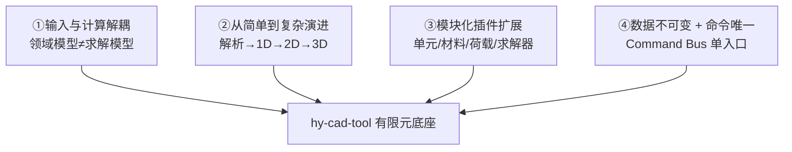
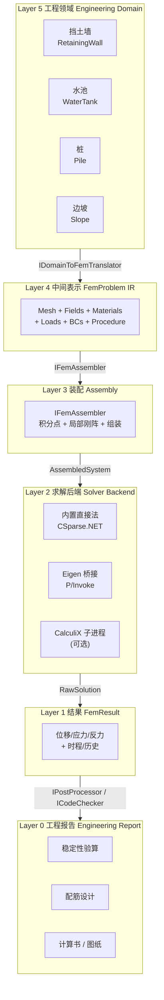
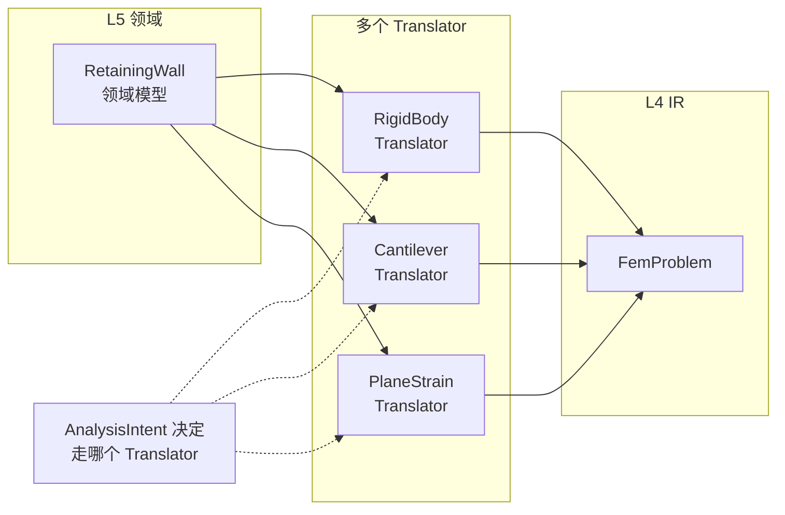
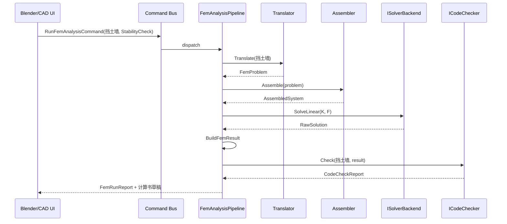
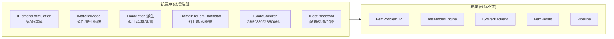
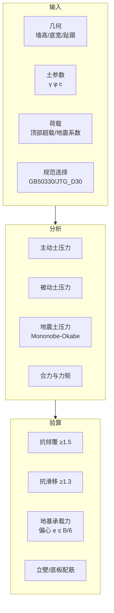
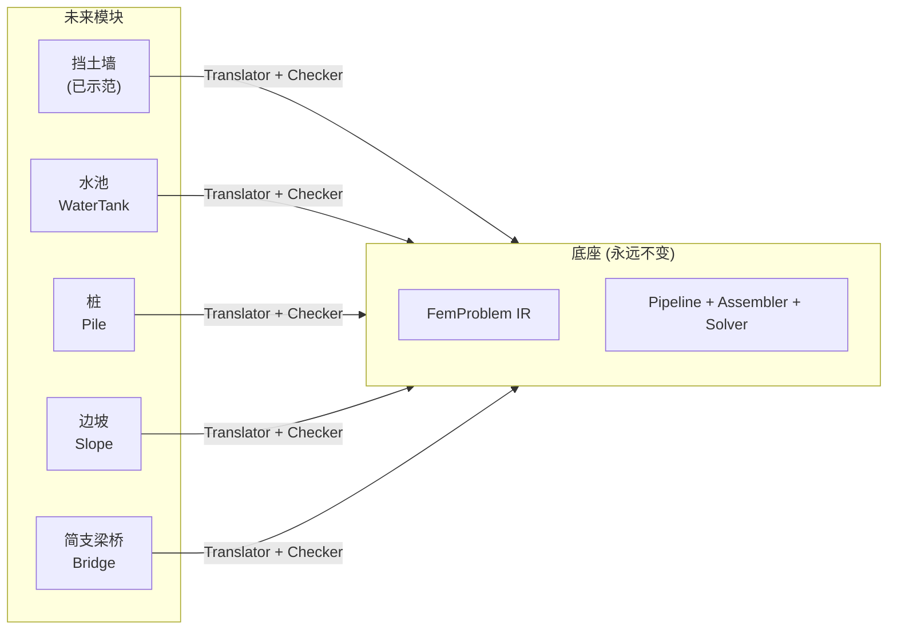

# hy-cad-tool 有限元通用底座架构设计（从挡土墙开始）

> 文档日期：2026-05-14
> 上承：[01-全球三维有限元软件对标调研-2026-05-14](./01-全球三维有限元软件对标调研-2026-05-14.md)
> 文档目的：
> 1. 给出 hy-cad-tool 有限元模块的**通用底座**架构——一个"最先进、可演进、输入与计算解耦、模块可插拔"的基础。
> 2. 以**挡土墙**作为第一个落地模块，验证底座可用性，并示范"从最简单开始 → 后期复杂模块自然接入"的演进路径。

---

## 一、设计哲学：四条不可妥协的原则



| 原则 | 含义 | 反面教材 |
|------|------|----------|
| **①输入与计算解耦** | "挡土墙、水池、桩"是领域概念；"梁单元、壳单元、稀疏方程组"是计算概念。中间必须有一层 **`FemProblem` 中间表示（IR）** 分隔 | PKPM/SATWE：领域逻辑与求解器深度耦合，导致换内核就要重写半个软件 |
| **②从简单到复杂演进** | v0.1 可以连 FEM 都没有，仅是刚体平衡；底座先把"接口形状"做对，内部实现允许偷懒 | 自研者最常见错误：第一版就要做"通用 3D 实体 FEM"，三年做不完 |
| **③模块化插件扩展** | 单元公式、材料本构、荷载类型、求解后端、规范检算都通过 DI/IoC 注册，互不耦合 | ANSYS APDL 单体宏，新增材料要进核心 |
| **④数据不可变 + 命令唯一** | 所有 FEM 模型变更通过 Command Bus；模型与结果均为 immutable record；版本号驱动失效 | Workbench 双轨（GUI/APDL）漂移 |

> 这四条来自调研报告（01）阵营 A/B/C 的共同教训，落到 hy-cad-tool 的 C# 实现上。

---

## 二、总体五层架构

底座按"职责单一 + 边界清晰"切成五层。**层与层之间只通过明确定义的 DTO/接口通信，禁止跨层引用具体实现**。



### 各层职责（与其他层的边界）

| 层 | 输入 | 输出 | 知道什么 | 不知道什么 |
|----|------|------|----------|------------|
| **L5 领域** | 用户在 UI 上摆的"挡土墙、水池" | 领域模型 + 工程意图 | 工程概念、规范、配筋 | FEM 怎么算的 |
| **L4 IR** | L5 → Translator | `FemProblem` 不可变快照 | 网格、单元、荷载、边界 | 这是挡土墙还是水池 |
| **L3 装配** | `FemProblem` | `AssembledSystem`（K, M, F） | 单元公式、积分点、刚阵 | 用什么解 |
| **L2 求解** | `AssembledSystem` | `RawSolution`（向量） | 线性代数 | FEM 含义 |
| **L1 结果** | `RawSolution` + `FemProblem` | `FemResult`（结构化场） | 怎么把向量映射回节点/单元 | 工程含义 |
| **L0 报告** | `FemResult` + L5 领域模型 | 计算书 / 配筋图 / 图纸 | 规范、配筋、验算 | FEM 内部 |

> **关键洞察**：当你新增一个领域（比如水池），**L4 ~ L1 完全不动**，只在 L5 加领域类、L0 加规范检算和报告生成。这就是"输入与计算解耦"的具体含义。

---

## 三、核心抽象 ① ：`FemProblem` 中间表示（IR）

IR 是底座的灵魂。所有"领域 → 计算"的转换都要落到这一个数据结构上，**它必须是 100% 中性的——读不出来这是挡土墙还是水池**。

### 3.1 顶层结构

```csharp
namespace HyCADTool.Features.Fem.Ir;

public sealed record FemProblem
{
    public ProblemMetadata Metadata { get; init; } = new();
    public IMesh Mesh { get; init; } = default!;
    public IReadOnlyList<FieldDefinition> Fields { get; init; } = [];
    public IReadOnlyList<RegionAssignment> Materials { get; init; } = [];
    public IReadOnlyList<RegionAssignment> Formulations { get; init; } = [];
    public IReadOnlyList<LoadCase> LoadCases { get; init; } = [];
    public IReadOnlyList<LoadCombination> Combinations { get; init; } = [];
    public IReadOnlyList<BoundaryCondition> BoundaryConditions { get; init; } = [];
    public AnalysisProcedure Procedure { get; init; } = default!;
    public long IrRevision { get; init; }
}
```

### 3.2 网格抽象——支持 1D / 2D / 3D 混合

```csharp
public interface IMesh
{
    int Dimension { get; }                           // 1 / 2 / 3
    IReadOnlyList<Node> Nodes { get; }
    IReadOnlyList<Cell> Cells { get; }
    IReadOnlyDictionary<string, NodeSet> NodeSets { get; }
    IReadOnlyDictionary<string, CellSet> CellSets { get; }
}

public sealed record Node(int Id, ReadOnlyMemory<double> Coords);

public sealed record Cell(
    int Id,
    CellTopology Topology,                           // Line2 / Tri3 / Quad4 / Tet4 / Hex8 / ...
    ReadOnlyMemory<int> NodeIds,
    string Region);

public enum CellTopology
{
    Line2, Line3,
    Tri3, Tri6, Quad4, Quad8, Quad9,
    Tet4, Tet10, Hex8, Hex20, Hex27, Pyramid5, Wedge6
}
```

> **为什么不直接绑定到"梁/壳/实体"？** 因为同一个 `Quad4` 既可以当壳单元（带 5/6 DOF），也可以当平面应力/平面应变实体（2 DOF）。**单元拓扑 ≠ 单元公式**——这一区分是 deal.II / MFEM 的核心智慧。

### 3.3 场（Field）——DOF 不再 hard-code

```csharp
public sealed record FieldDefinition(
    string Name,                                      // "displacement" / "temperature"
    int ComponentCount,                               // 1=标量, 3=向量, 6=对称张量
    InterpolationOrder Order,                         // Linear / Quadratic
    string MeshSupport);                              // 该场定义在哪些网格集合上

public enum InterpolationOrder { Linear, Quadratic, Cubic }
```

> **示例**：挡土墙 v0.2 只有 `displacement`（2 分量）；水池温度耦合则同时有 `displacement` 和 `temperature`。底座对场数量与种类**完全开放**。

### 3.4 单元公式 ≠ 单元拓扑

```csharp
public interface IElementFormulation
{
    ElementFormulationId Id { get; }
    CellTopology[] SupportedTopologies { get; }
    int[] FieldArities { get; }                       // 每个场分量数
    LocalStiffness Build(
        CellGeometry geom,
        IMaterialModel material,
        FormulationOptions options);
}
```

**首批要实现的公式**（按演进顺序）：

| 公式 | 拓扑 | 场 | 用途 | 难度 |
|------|------|----|------|------|
| `EulerBernoulliBeam2D` | Line2 | 位移 + 转角（3 DOF/节点） | 挡土墙立壁（v0.2） | ★ |
| `TimoshenkoBeam2D` | Line2 | 位移 + 转角 | 短肥梁 / 桩 | ★★ |
| `PlaneStressQ4` | Quad4 | 位移（2 DOF） | 挡土墙整体（v0.3） | ★★ |
| `PlaneStrainQ4` | Quad4 | 位移（2 DOF） | 边坡 / 土体（v0.4） | ★★ |
| `MindlinPlateQ4` | Quad4 | 挠度 + 转角（3 DOF） | 水池底板（v0.5） | ★★★ |
| `ShellMITC4` | Quad4 | 位移 + 转角（5/6 DOF） | 水池池壁（v0.6） | ★★★★ |
| `SolidHex8` | Hex8 | 位移（3 DOF） | 厚底板、桩基（v0.7） | ★★★ |

每个公式独立成 NuGet/插件，与底座只通过 `IElementFormulation` 接口对话。

### 3.5 材料、荷载、边界条件——全部 record + 接口

```csharp
public interface IMaterialModel
{
    MaterialModelId Id { get; }
    Result<MaterialEvaluation> Evaluate(MaterialState state);
}

public sealed record LoadCase(
    string Name,
    LoadCaseKind Kind,                                // Gravity / Hydrostatic / Earth / Thermal / Seismic / ...
    IReadOnlyList<LoadAction> Actions);

public abstract record LoadAction;
public sealed record GravityLoad(double Gx, double Gy, double Gz) : LoadAction;
public sealed record PointLoad(int NodeId, ReadOnlyMemory<double> Force) : LoadAction;
public sealed record EdgeTraction(int CellId, int EdgeLocalId, ReadOnlyMemory<double> Traction) : LoadAction;
public sealed record BodyHeat(string CellSet, double Q) : LoadAction;
public sealed record EarthPressure(string EdgeSet, EarthPressureProfile Profile) : LoadAction;
// ...

public sealed record BoundaryCondition(
    string TargetSet,
    BoundaryConditionKind Kind,                       // Fixed / Roller / Spring / Prescribed
    BoundaryDof Dof,
    double Value);
```

### 3.6 分析过程——线性静力是第一步，但接口要为未来留位

```csharp
public abstract record AnalysisStep(string Name, AnalysisStepKind Kind);

public sealed record LinearStaticStep(string Name) : AnalysisStep(Name, AnalysisStepKind.LinearStatic);
public sealed record ModalStep(string Name, int NumModes) : AnalysisStep(Name, AnalysisStepKind.Modal);
public sealed record ResponseSpectrumStep(string Name, IResponseSpectrum Spectrum, ModalCombinationRule Rule)
    : AnalysisStep(Name, AnalysisStepKind.ResponseSpectrum);
public sealed record NonlinearStaticStep(string Name, NonlinearControls Controls)
    : AnalysisStep(Name, AnalysisStepKind.NonlinearStatic);

public sealed record AnalysisProcedure(IReadOnlyList<AnalysisStep> Steps);
```

---

## 四、核心抽象 ② ：解耦的边界——`IDomainToFemTranslator`

**输入与计算解耦的具体落地**：每个领域写自己的 Translator，把领域模型翻译成 `FemProblem`。

```csharp
public interface IDomainToFemTranslator<TDomain>
{
    Result<FemProblem> Translate(TDomain domainModel, TranslationOptions options);
}

public sealed record TranslationOptions(
    AnalysisIntent Intent,                            // StabilityCheck / Reinforcement / Deformation
    double MeshSize,
    bool IncludeSeismic,
    bool IncludeThermal);

public enum AnalysisIntent
{
    StabilityCheck,
    StressAndReinforcement,
    DeformationAndCracking,
    DynamicResponse
}
```

### Translator 的关键设计

1. **一个领域可以有多个 Translator**——例如挡土墙：
   - `RigidBodyEquilibriumTranslator`：完全不用 FEM，直接算抗倾覆/抗滑
   - `CantileverBeamTranslator`：把立壁建成 1D 悬臂梁
   - `PlaneStrainTranslator`：把整体建成 2D 平面应变
2. **由 `AnalysisIntent` 决定走哪个**——稳定验算走刚体，配筋走梁，变形分析走平面应变
3. **Translator 内部可以"装作"用 FEM**——v0.1 时刚体平衡其实就是手算公式，但**对上层呈现的也是 `FemProblem`**（只有 0 个单元、1 个伪节点），这样 L1/L0 不必区分



---

## 五、核心抽象 ③ ：求解后端可插拔

`ISolverBackend` 是 L2 ↔ L3 的边界。第一版只做"内置直接法"，但接口形状必须支持后期对接 CalculiX / Eigen / cuSPARSE。

```csharp
public interface ISolverBackend
{
    SolverBackendId Id { get; }
    SolverCapabilities Capabilities { get; }

    Task<Result<RawSolution>> SolveLinearAsync(
        AssembledSystem system,
        SolverOptions options,
        CancellationToken ct);

    Task<Result<EigenSolution>> SolveEigenAsync(
        AssembledSystem system,
        int numModes,
        SolverOptions options,
        CancellationToken ct);
}

public sealed record SolverCapabilities(
    bool SupportsSymmetric,
    bool SupportsIndefinite,
    bool SupportsNonlinear,
    bool SupportsEigen,
    long MaxDofRecommended);
```

**第一版只实现一个 backend**：

```csharp
public sealed class CSparseBackend : ISolverBackend
{
    // 基于 CSparse.NET（MIT 协议）做对称稀疏直接法
    // 适用规模：≤ 100k DOF（挡土墙 + 一般水池足够）
}
```

> CSparse.NET 是 Tim Davis 的 CSparse 移植版，纯托管、零依赖，足以撑过 hy-cad-tool 整个 P0~P2 阶段。等真正需要 100k+ DOF 时再 P/Invoke Eigen 或挂 CalculiX。

---

## 六、核心抽象 ④ ：结果与后处理

### 6.1 `FemResult` 设计

```csharp
public sealed record FemResult
{
    public FemProblem Problem { get; init; } = default!;
    public IReadOnlyList<StepResult> Steps { get; init; } = [];
}

public sealed record StepResult
{
    public string StepName { get; init; } = "";
    public IReadOnlyDictionary<string, INodalField> NodalFields { get; init; }
        = new Dictionary<string, INodalField>();
    public IReadOnlyDictionary<string, IElementField> ElementFields { get; init; }
        = new Dictionary<string, IElementField>();
    public IReadOnlyList<ReactionForce> Reactions { get; init; } = [];
}

public interface INodalField
{
    string Name { get; }
    int ComponentCount { get; }
    ReadOnlySpan<double> ValuesAt(int nodeId);
}
```

### 6.2 后处理与规范检算

```csharp
public interface IPostProcessor<TDomain, TReport>
{
    Result<TReport> Process(TDomain domain, FemResult result);
}

public interface ICodeChecker<TDomain>
{
    StructuralCodeFamily Family { get; }              // GB50330 / JTG_D30 / GB50069 / ...
    CodeEdition Edition { get; }
    Result<CodeCheckReport> Check(TDomain domain, FemResult result);
}
```

> 检算结果（裂缝、抗倾覆系数、地基承载力等）是**领域相关**的——所以 `ICodeChecker<TDomain>` 是泛型的。挡土墙的 `ICodeChecker<RetainingWall>` 知道要算抗倾覆，水池的 `ICodeChecker<WaterTank>` 知道要算裂缝宽度。底座只暴露 `CodeCheckReport` 这个**统一的可序列化报告**。

---

## 七、流水线与命令总线整合

```csharp
public sealed record RunFemAnalysisCommand<TDomain>(
    TDomain Domain,
    AnalysisIntent Intent,
    TranslationOptions Options) : ICommand;

public sealed class FemAnalysisPipeline<TDomain>
{
    public async Task<Result<FemRunReport<TDomain>>> RunAsync(
        TDomain domain,
        AnalysisIntent intent,
        CancellationToken ct)
    {
        var translator = _translatorResolver.Resolve<TDomain>(intent);
        var problem    = await translator.TranslateAsync(domain, _opts);
        var assembled  = await _assembler.AssembleAsync(problem, ct);
        var raw        = await _solver.SolveLinearAsync(assembled, _solverOpts, ct);
        var result     = _resultBuilder.Build(problem, raw);
        var report     = _checker.Check(domain, result);
        return new FemRunReport<TDomain>(problem, result, report);
    }
}
```

**关键点**：

- 整条管线只在第一步与最后一步认识 `TDomain`，**中间 IR/装配/求解/结果四步完全通用**；
- 任何变更都进 Command Bus，配合 `IStaleTracker` 实现"领域改了 → 自动标记结果过期"（参考 ANSYS Workbench）；
- `CancellationToken` 一路下沉，长任务可中断。



---

## 八、模块化扩展矩阵

底座要做到"加新模块不动旧代码"。扩展点用 DI 注册，按需启用：



| 扩展点 | 注册方式 | 第一批要做的 |
|--------|----------|--------------|
| `IElementFormulation` | `services.AddElementFormulation<EulerBernoulliBeam2D>()` | EulerBernoulliBeam2D, PlaneStrainQ4 |
| `IMaterialModel` | `services.AddMaterial<LinearElastic>()` | LinearElastic（钢/混凝土/土）, MohrCoulomb（土，后期） |
| `LoadAction` | 派生 record，translator 直接生成 | Gravity, EarthPressure, Hydrostatic, Thermal |
| `IDomainToFemTranslator<T>` | `services.AddTranslator<RetainingWall, RigidBodyTranslator>()` | 挡土墙 × 3 个（刚体/悬臂梁/平面应变） |
| `ICodeChecker<T>` | `services.AddCodeChecker<RetainingWall, GB50330Checker>()` | GB 50330, JTG D30 |
| `IPostProcessor<T,R>` | 同上 | 配筋图生成、计算书 LaTeX |

---

## 九、第一个落地模块：挡土墙

### 9.1 工程问题刻画

挡土墙的**真实计算需求**远不如"通用 3D 实体 FEA"复杂，正适合作为底座的第一个验证案例。



### 9.2 领域模型（L5）

```csharp
namespace HyCADTool.Features.Fem.Domain.RetainingWall;

public sealed record RetainingWall
{
    public RetainingWallType Type { get; init; }                      // Cantilever / Gravity / Counterfort
    public RetainingWallGeometry Geometry { get; init; } = new();
    public SoilProfile BackfillSoil { get; init; } = new();
    public SoilProfile FoundationSoil { get; init; } = new();
    public SurchargeLoad? Surcharge { get; init; }
    public WaterTable? WaterTable { get; init; }
    public SeismicAction? Seismic { get; init; }
    public ConcreteGrade WallMaterial { get; init; } = ConcreteGrade.C30;
    public StructuralCode DesignCode { get; init; } = StructuralCode.GB50330;
}

public sealed record RetainingWallGeometry
{
    public double WallHeight { get; init; }
    public double WallTopWidth { get; init; }
    public double WallBottomWidth { get; init; }
    public double BaseSlabWidth { get; init; }
    public double BaseSlabThickness { get; init; }
    public double ToeWidth { get; init; }
    public double HeelWidth { get; init; }
    public double BackBatter { get; init; }
}

public sealed record SoilProfile(
    double UnitWeight,                                                  // γ kN/m³
    double FrictionAngle,                                               // φ °
    double Cohesion,                                                    // c kPa
    double WallFriction);                                               // δ °
```

### 9.3 v0.1：刚体平衡 Translator（无 FEM）

第一版**不写任何有限元代码**，直接实现"力—力矩平衡"。但对外仍走 Pipeline，对 L4 IR 呈现一个**伪 FemProblem**（一个伪节点存合力、一个伪单元做容器），让 L1/L0 不必感知。

```csharp
public sealed class RigidBodyEquilibriumTranslator : IDomainToFemTranslator<RetainingWall>
{
    public Result<FemProblem> Translate(RetainingWall wall, TranslationOptions opts)
    {
        // 1. 算自重、合力点
        var W  = ComputeSelfWeight(wall);
        // 2. 主动土压力 Rankine / Coulomb
        var Ea = ComputeActiveEarthPressure(wall);
        // 3. 被动土压力
        var Ep = ComputePassiveEarthPressure(wall);
        // 4. 地震增量 Mononobe-Okabe（若启用）
        var Eq = wall.Seismic is null ? null : ComputeMononobeOkabe(wall);

        // 5. 把所有合力封装成 LoadCase，但实际上 Mesh 只有 1 个节点
        return BuildPseudoFemProblem(W, Ea, Ep, Eq);
    }
}
```

**配套的检算**：

```csharp
public sealed class GB50330RetainingWallChecker : ICodeChecker<RetainingWall>
{
    public StructuralCodeFamily Family => StructuralCodeFamily.GB50330;

    public Result<CodeCheckReport> Check(RetainingWall wall, FemResult result)
    {
        var report = new CodeCheckReport();
        report.Add("抗倾覆", CheckOverturning(wall, result, requiredFs: 1.5));
        report.Add("抗滑移", CheckSliding   (wall, result, requiredFs: 1.3));
        report.Add("地基承载力 + 偏心", CheckBearing(wall, result));
        return report;
    }
}
```

> **v0.1 总工作量预估：2 ~ 3 周**。能交付完整的挡土墙稳定验算与计算书。

### 9.4 v0.2：1D 悬臂梁 FEM Translator（立壁配筋）

第二版开始引入**真正的 FEM**——立壁离散为多段 Euler-Bernoulli 梁，土压力作为分布荷载，得到弯矩剪力图，进而做配筋。

```csharp
public sealed class CantileverBeamTranslator : IDomainToFemTranslator<RetainingWall>
{
    public Result<FemProblem> Translate(RetainingWall wall, TranslationOptions opts)
    {
        var mesh = MeshBuilders.Line(
            from: new[] { 0.0, 0.0 },
            to:   new[] { 0.0, wall.Geometry.WallHeight },
            segments: (int)(wall.Geometry.WallHeight / opts.MeshSize));

        var problem = new FemProblem
        {
            Mesh = mesh,
            Fields = [
                new FieldDefinition("displacement", 2, InterpolationOrder.Linear, "all"),
                new FieldDefinition("rotation",     1, InterpolationOrder.Linear, "all")
            ],
            Formulations = [
                new RegionAssignment("all", ElementFormulationId.EulerBernoulliBeam2D, options: ...)
            ],
            // ... 边界条件：底端固结
            // ... 荷载：土压三角形分布 + 地震 + 水（如有）
            Procedure = new AnalysisProcedure([ new LinearStaticStep("static") ])
        };

        return problem;
    }
}
```

**此时需要做的底座工作**：

- 实现 `EulerBernoulliBeam2D` 元素公式
- 实现 `LinearElastic` 材料
- 实现 `EdgeTraction` / `DistributedLineLoad` 荷载
- `CSparseBackend` 求解一个 N×N 对称正定方程组
- 后处理：弯矩 = -EI·v''、剪力等

**v0.2 总工作量预估：4 ~ 6 周**。完成后底座已有"网格 + 单元 + 装配 + 求解 + 后处理"的最小完整链路，**任何后续模块都是叠加而非重写**。

### 9.5 v0.3：2D 平面应变 FEM Translator（整体变形）

第三版把整个挡土墙 + 部分土体建成 2D 平面应变模型，能算变形、整体应力分布、土-结相互作用初步。

```csharp
public sealed class PlaneStrainTranslator : IDomainToFemTranslator<RetainingWall>
{
    public Result<FemProblem> Translate(RetainingWall wall, TranslationOptions opts)
    {
        // 用 hyob 的 2D 几何切割算法划网格（Q4 + T3 混合）
        var mesh = MeshGenerators.PlaneTriQuad(
            wallShape: BuildWallPolygon(wall),
            soilShape: BuildSoilDomain(wall, extentH: 5 * wall.Geometry.WallHeight),
            sizing: opts.MeshSize);

        // ... 装配 PlaneStrainQ4 / PlaneStrainT3 单元
        // ... 土与墙的界面：可选 Tied / 接触（v0.4 再做）
        // ... 远场边界：Roller / Infinite Element（v0.5 再做）
    }
}
```

**v0.3 工作量预估：6 ~ 8 周**。完成后底座具备"2D 实体" FEM 能力，**为水池、桩、边坡的接入做好准备**。

### 9.6 三个版本能力对比

| 能力 | v0.1 刚体 | v0.2 1D 梁 | v0.3 2D 平面应变 |
|------|:--------:|:----------:|:----------------:|
| 抗倾覆 / 抗滑移 | ✅ | ✅ | ✅ |
| 地基偏心 + 承载力 | ✅ | ✅ | ✅ |
| 立壁弯矩剪力 | ✗（仅整体） | ✅ | ✅ |
| 立壁/底板配筋 | ✗ | ✅ | ✅ |
| 整体变形 | ✗ | 立壁顶部位移 | ✅ |
| 土-结界面应力 | ✗ | ✗ | ✅（粗略） |
| 整体稳定（圆弧滑动） | ✗ | ✗ | 需 Layer 2 后端 |
| 复杂土层 | ✗ | ✗ | ✅ |

---

## 十、后续模块如何"自然接入"

底座设计是否成功，看新模块加入时**是不是只动 L5/L0、不动 L1~L4**。



| 新模块 | 复用现有 | 新增 | 估计工作量 |
|--------|----------|------|------------|
| **水池**（继挡土墙之后） | Mindlin/Shell 公式（v0.6 引入）、`CSparseBackend`、Pipeline | `WaterTank` 领域、`HydrostaticLoad`、Housner 附加质量、GB 50069 检算 | 3~4 周（底座搞定后） |
| **桩** | Beam 公式、`CSparseBackend` | `Pile` 领域、`WinklerSpring` 边界、p-y 曲线材料 | 3 周 |
| **边坡** | PlaneStrainQ4 | `Slope` 领域、强度折减法、圆弧搜索 | 4~6 周 |
| **简支梁桥** | Beam 公式 + Shell 公式 | `BridgeSpan` 领域、移动荷载、影响线 | 6~8 周 |

> 这个矩阵直接证明：**底座做好后，单个工程模块的边际成本急剧下降**。第一个挡土墙花 3~4 个月；之后每个新模块只需要 1 个月左右。

---

## 十一、与 hy-cad-tool 既有架构的衔接

| 既有组件 | 与 FEM 底座的关系 |
|----------|-------------------|
| `hyob` 几何核 | **几何来源**：挡土墙截面、水池池壁、桩位都从 hyob 读取；FEM 底座只消费几何，不污染 hyob |
| Command Bus | **统一入口**：所有 `RunFemAnalysisCommand` 都走 Bus，避免脚本/UI 双轨 |
| `Features/` 目录 | 新增 `Features/Fem/`，按子模块分目录：`Fem/Core`（底座）、`Fem/RetainingWall`、`Fem/WaterTank` |
| `Shared/` | 底层数学库放 `Shared/Numerics`，与几何、Annotation 共享 |
| Annotations 优化引擎 | FEM 结果可作为优化目标函数（如挡土墙底宽最小化、满足全部规范）输入到优化引擎 |
| 配置体系 | 求解器选择、规范默认值等通过 `Shell/Configuration` 注入 |

### 推荐目录结构

```
src/HyCADTool/
├── Shared/
│   └── Numerics/                     # 稀疏矩阵/线性代数共享
└── Features/
    └── Fem/
        ├── Core/                     # 底座，永远不绑定具体领域
        │   ├── Ir/                   # FemProblem 及其子类型
        │   ├── Mesh/                 # IMesh / Node / Cell
        │   ├── Formulations/         # 单元公式插件
        │   ├── Materials/            # 材料插件
        │   ├── Loads/                # 荷载类型
        │   ├── Assembly/             # IFemAssembler
        │   ├── Solvers/              # ISolverBackend + CSparseBackend
        │   ├── Results/              # FemResult / NodalField / ElementField
        │   ├── Pipeline/             # FemAnalysisPipeline
        │   └── Checking/             # ICodeChecker 接口
        ├── RetainingWall/            # 第一个领域
        │   ├── Domain/               # RetainingWall 领域模型
        │   ├── Translators/          # RigidBody / Cantilever / PlaneStrain
        │   ├── CodeChecks/           # GB50330 / JTG_D30
        │   └── Reports/              # 计算书与配筋图生成
        └── WaterTank/                # 第二个领域（未来）
```

---

## 十二、第三方依赖与许可

| 用途 | 库 | 协议 | 备注 |
|------|----|------|------|
| 稀疏矩阵直接法 | **CSparse.NET** | LGPL-2.1 | 纯托管，零依赖 |
| 数值基础 | **MathNet.Numerics** | MIT | 矩阵/向量/统计 |
| 网格生成（2D） | **Triangle.NET** | MIT | 后续可换 MeshIt |
| 几何来源 | **ACadSharp** + **hyob** | MIT + 自有 | 已在 hy-cad-tool 中 |
| 单元测试 | xUnit / FluentAssertions | Apache 2.0 | — |
| 可选未来 | Eigen via P/Invoke | MPL2 | 当 DOF > 100k |
| 可选未来 | CalculiX 子进程 | GPL | 非线性 / 大模型 |

> **关键决策**：第一版**只用纯托管 .NET 库**，不引入 P/Invoke 与 native 二进制；这样安装即用，CI 简单，跨平台无忧。等真正撞到性能墙再切。

---

## 十三、路线图与里程碑

### P0：底座 + 挡土墙 v0.1（4 周）

| 周 | 工作 | 交付 |
|----|------|------|
| W1 | `FemProblem` IR、`IMesh`、基础 record 定义 + DI 注册框架 | 编译通过 + 单元测试 |
| W2 | `FemAnalysisPipeline` + `IDomainToFemTranslator` + `RetainingWall` 领域模型 | 命令可分发到空管线 |
| W3 | `RigidBodyEquilibriumTranslator` + 力—力矩平衡公式 | 单墙稳定性数值正确 |
| W4 | `GB50330RetainingWallChecker` + 计算书 LaTeX 模板 + UI 接入 | **可交付的挡土墙稳定验算工具** |

### P1：底座 v1.0 + 挡土墙 v0.2（6 周）

| 周 | 工作 | 交付 |
|----|------|------|
| W5~6 | `EulerBernoulliBeam2D` 公式、`LinearElastic` 材料、`CSparseBackend` | 简单悬臂梁验证 |
| W7 | `IFemAssembler` + 边界条件 + 分布荷载 | 任意一维梁可解 |
| W8 | `CantileverBeamTranslator` + 立壁配筋后处理 | **挡土墙立壁配筋设计** |
| W9~10 | 计算书增强、与 hyob 几何打通、Command Bus 集成 | **完整可发布版本** |

### P2：扩展到 2D + 挡土墙 v0.3（8 周）

| 周 | 工作 | 交付 |
|----|------|------|
| W11~12 | `PlaneStrainQ4`、Triangle.NET 网格生成、CellSet/NodeSet | 简单 2D 矩形受拉验证 |
| W13~14 | `PlaneStrainTranslator` + 多层土 + 自重激活 | 整体应力云图 |
| W15~16 | 土-结界面 Tied、远场 Roller、变形/应力后处理 | **完整 2D 挡土墙分析** |
| W17~18 | 文档、示例库、回归测试集 | **底座 v1.0 正式发布** |

### P3 及以后

- **P3**：水池（复用底座，加 Mindlin Plate + ShellMITC4 + Housner）
- **P4**：桩（Winkler 弹性地基 + p-y）
- **P5**：边坡稳定（强度折减 + 圆弧搜索）
- **P6**：对接 CalculiX 后端（非线性、大模型）
- **P7**：模态 + 反应谱 + 时程

---

## 十四、关键设计决策快查

| # | 决策 | 原因 |
|---|------|------|
| 1 | 五层架构 + IR 中间表示 | 输入与计算解耦，新领域无需动核心 |
| 2 | 单元拓扑 ≠ 单元公式 | 同一 Quad4 可做壳/平面应力/平面应变，复用网格基础设施 |
| 3 | 多场抽象（Field）取代硬编码 DOF | 为温度耦合、孔隙水压等多物理留位 |
| 4 | 一个领域可有多个 Translator | 由 `AnalysisIntent` 路由（稳定走刚体、配筋走梁、变形走平面应变） |
| 5 | v0.1 不写真有限元 | 用刚体平衡 + 伪 FemProblem 走通整条管线，"接口先行" |
| 6 | 第一版只用纯托管 CSparse.NET | 零 P/Invoke、零 native 依赖，CI 友好 |
| 7 | 求解器接口预留 `SolveEigenAsync` / 非线性 | 形状对了，后期实现即可 |
| 8 | `ICodeChecker<TDomain>` 泛型 | 检算与领域同步演进，底座只见到统一报告 |
| 9 | 模块独立目录 `Features/Fem/<Domain>` | 与 hy-cad-tool 既有 Features 切片一致 |
| 10 | Command Bus 单一入口 | 来自 ANSYS APDL/Workbench 双轨漂移教训 |

---

## 十五、风险与对策

| 风险 | 概率 | 影响 | 对策 |
|------|:----:|:----:|------|
| 单元公式自研失败（数值不稳） | 中 | 高 | v0.2 仅 1D 梁公式，参考 Timoshenko 教科书；与 SAP2000 / ETABS 对比验证 |
| Translator 设计漏掉某些工况 | 中 | 中 | 每个 Translator 配套**测试矩阵**：典型工况 → 解析解 |
| 性能不足 | 低（小模型） | 中 | 100k DOF 以内 CSparse 够用；超过则切 Eigen |
| 规范条款理解偏差 | 中 | 高 | 关键参数允许用户覆盖；与设计院真实项目对比 |
| 网格生成质量差 | 中 | 中 | Triangle.NET 已是工业级；预留接口允许换 |
| 与 hyob 集成复杂 | 低 | 中 | FEM 只读 hyob，不写；通过 `IGeometryProvider` 隔离 |

---

## 十六、关键文档与代码引用

- 调研依据：[01-全球三维有限元软件对标调研-2026-05-14](./01-全球三维有限元软件对标调研-2026-05-14.md)
- 设计参考：`E:\HyTool\Doc\ANSYS_Workbench_Mechanical.md`（DAG + Stale Tracker 思想）
- 设计参考：`E:\HyTool\Doc\OpenSees_ABAQUS_Solvers.md`（Domain / Analysis / Recorder 三段拆分）
- 设计参考：`E:\HyTool\Doc\IDEA_RFEM_SCIA_EuropeanLine.md`（IR + 防腐层）
- 项目内既有：`docs/DataExchange/*` 中的 `hyob` 设计
- 项目内既有：`docs/Annotations/*` 中的优化引擎设计

---

## 修订记录

| 日期 | 修订人 | 说明 |
|------|--------|------|
| 2026-05-14 | — | 初版：五层架构 + FemProblem IR + 挡土墙 v0.1~v0.3 演进路线 |
