## 文档定位

> 文档日期：2026-05-15
> 上承：[001-自研通用FEA的第一性原则重审-30年积累vs150年开源-2026-05-15](./001-自研通用FEA的第一性原则重审-30年积累vs150年开源-2026-05-15.md)
> 性质：**对 001 文档"基于 440 年开源资产做主控发行版"路线的下一层落地——回答"如何用 2020s 现代架构 + 2024-2026 AI 能力，把 1989-2008 老开源 FEA 项目整合成一个不被时代拖死的现代平台"**

001 文档证明了 hy-cad-tool 应走"主控发行版"路线，并列出了 9 大开源宝藏（PETSc/CalculiX/Code_Aster/MFEM/OpenSees/Elmer/Gmsh/deal.II/FEniCSx 等）。但 001 下了一个**隐性命题没有展开**：

> 这些开源项目大多 **1989-2008 年起步**（CalculiX 1998、Code_Aster 1989、OpenSees 1997、Elmer 1995、Gmsh 1996、PETSc 1991、deal.II 1998、Triangle 1993、VTK 1993、MFEM 2002、FEniCSx 2003 ...），平均年龄 **25 年**。它们的**算法是 21 世纪的水平**，但**工程文化、协作方式、用户接口、运行模型、可观测性都停留在 1990s-2000s**。

**直接"装配"会导致**：

- 你以为捡到了金山，实际是**骨折的金山**——算法没问题，外壳全是 1990s 的伤疤
- 用户体验回到"读 PDF 手册 → 写 deck → 命令行批处理 → 看 ASCII 日志 → 解析私有二进制"的 1990s 节奏
- 现代工程师（习惯 IDE 智能、IPC、容器、Cloud Native、可观测性、AI Copilot）**学不会、不愿学、学了也跑不动**
- AI 时代的红利（PINN、可微分、神经算子、Coding Agent、RAG）**完全用不上**

**本文档的任务**：

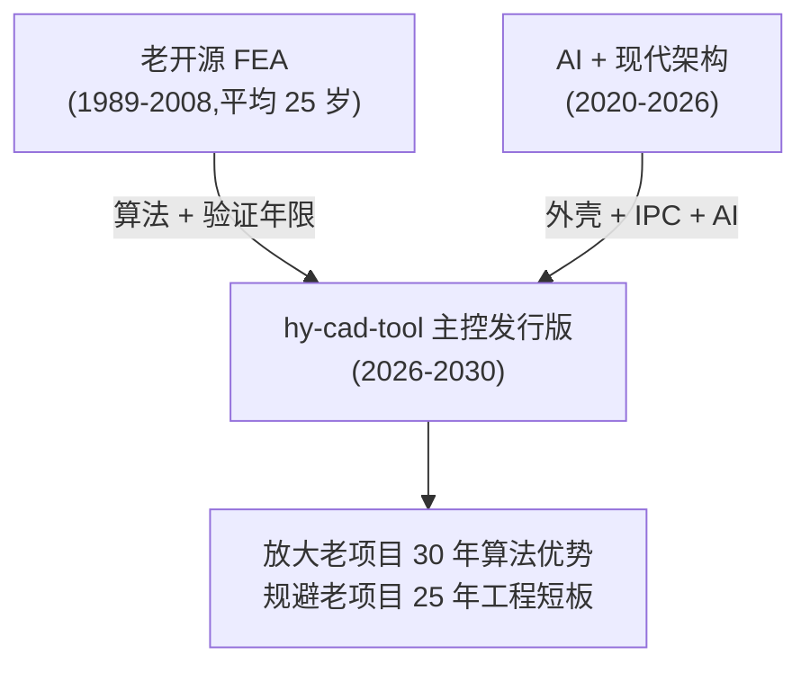

回答 4 个核心问题：

1. **老开源 FEA 的"老"具体体现在哪 8 处？**——拆解到工程级别
2. **为什么算法不过期、外壳过期？**——第一性原则
3. **现代架构有哪 7 大支柱可以用？**——具体技术清单
4. **AI 能给老项目带来什么 5 类杠杆？**——不是"加 AI"而是"AI 重构外壳"

**最终输出**：一份"老内核 + 现代外壳 + AI 增强"的 6 层整合范式 + 12 项 hy-cad-tool 可执行动作清单。

---

## 一、把"老"拆解：老开源 FEA 的 8 大年代特征

要现代化，先要诚实地承认"老在哪里"。把 1989-2008 这批项目的**年代特征**逐项剖析：

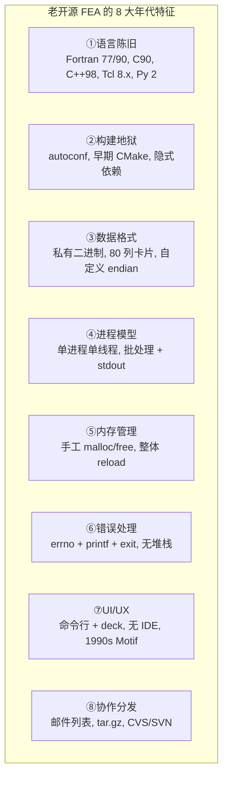

### 1.1 八大特征详解 + 2026 年的现代对照

| # | 1990s-2000s 特征 | 典型项目 | 2026 年现代等价物 | 落差严重度 |
|---|------------------|----------|------------------|:---------:|
| ① | **Fortran 77/90 + 隐式参数传递** | CalculiX、Code_Aster、Elmer | C# 11 / Rust / Swift / Kotlin / TS / Go | ★★★★★ |
| ① | **C90 + 全局变量** | PETSc 早期、Triangle、Gmsh 早期 | Rust / 现代 C++23 / Zig | ★★★ |
| ① | **C++98 + 手写 RTTI** | deal.II、MFEM 早期、VTK | C++23 + Concepts + std::expected | ★★★ |
| ① | **Tcl 8.x 无类型脚本** | OpenSees | Python 3.12 / TypeScript / C# | ★★★★ |
| ② | **autoconf / configure 时代** | Code_Aster、OpenFOAM | CMake 3.27+ / Bazel / Cargo / vcpkg | ★★★★ |
| ② | **隐式系统库依赖** | 几乎全部 | Conan / vcpkg / Spack / Conda-forge | ★★★★ |
| ③ | **私有二进制结果** | CalculiX `.frd`、ANSYS `.rst`、ABAQUS `.odb` | HDF5 / Parquet / Zarr / ASDF | ★★★★ |
| ③ | **80 列定位 ASCII 卡片** | Nastran Bulk、KEYWORD 早期、ABAQUS `.inp` 部分 | YAML / TOML / JSON / Protobuf | ★★★★ |
| ③ | **自定义 endian 二进制** | OpenSees 早期 recorder | MessagePack / FlatBuffers / Cap'n Proto | ★★★ |
| ④ | **单进程单线程 + 批处理** | OpenSees、Gmsh、Triangle | async/await + Tokio + Goroutine + JS Worker | ★★★★★ |
| ④ | **stdout 日志即唯一可观测** | 几乎全部 | OpenTelemetry / Prometheus / Loki / Sentry | ★★★★★ |
| ⑤ | **手工 malloc/free** | C/C++ 老项目 | Rust 所有权 / C++ smart_ptr / Swift ARC | ★★★ |
| ⑤ | **整体 reload 不支持增量** | CalculiX、Elmer 等 | Hot Reload / Live Reload / WASM 微迭代 | ★★★ |
| ⑥ | **errno + printf + exit** | 全部 C/Fortran 老项目 | Result/Either + 异常 + Sentry + 堆栈映射 | ★★★★ |
| ⑥ | **无收敛失败的可恢复策略** | 大部分 | Tokio Retry + 指数退避 + Saga / Workflow | ★★★ |
| ⑦ | **命令行 + ASCII deck** | 全部 | Web UI / Native UI / IDE Plugin / VS Code Extension | ★★★★★ |
| ⑦ | **无 IDE 智能（IntelliSense）** | Tcl 脚本、Fortran deck | LSP / Copilot / Cursor / Tree-sitter | ★★★★★ |
| ⑦ | **1990s Motif/Tk GUI** | Salome 早期、ParaView 早期 | Web (React/Vue) / Native (WPF/Avalonia/Qt6) / Blender | ★★★ |
| ⑧ | **邮件列表 + tar.gz** | Code_Aster、CalculiX、Elmer | GitHub / GitLab + Discord/Slack + npm/cargo/nuget | ★★★★ |
| ⑧ | **CVS / Subversion** | 部分老项目 | Git + GitHub Actions + Codespaces | ★★★ |
| ⑧ | **PDF 手册 + 静态网站** | 几乎全部 | MkDocs / Docusaurus / VitePress + RAG | ★★★ |

### 1.2 落差最严重的"五个一星"

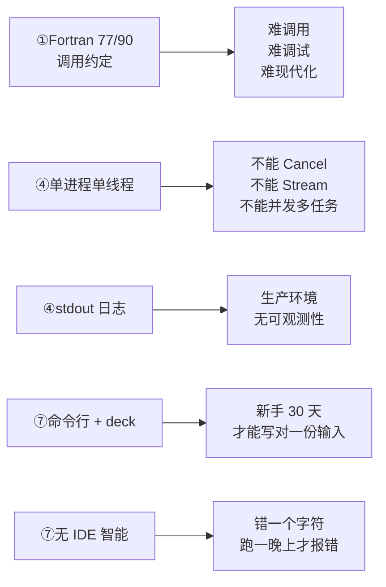

**这五条**是 hy-cad-tool 最核心要解决的"老"。如果这五条不解决，无论 hy-cad-tool 上层多漂亮，工程师用起来仍然回到 1990s。

> **关键洞察**：老项目的"老"不在算法，而在**信号传递层**——从用户意图到求解器之间，每一道墙都是 1990s 的产物。**hy-cad-tool 的全部价值就是把这堵墙拆掉，让 2026 年的工程师以 2026 年的方式使用 1990s 算法**。

---

## 二、为什么"老"还能用：算法的物理常量性

要现代化老项目，先要论证：**为什么不直接重写？** 因为算法是物理常量。

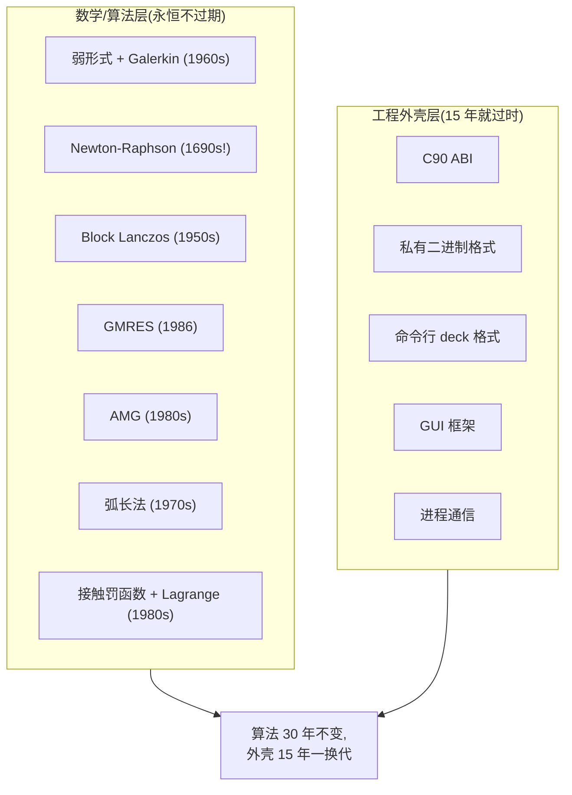

### 2.1 算法层的"物理常量性"证据

| 算法 | 提出年代 | 2026 年仍是 SOTA? | 老开源实现 |
|------|---------|-------------------|-----------|
| 弱形式 + Galerkin | 1915 | ✓ | 全部 |
| Newton-Raphson | 1690 | ✓ | CalculiX/Code_Aster |
| 共轭梯度 (CG) | 1952 | ✓ | PETSc |
| Lanczos | 1950 | ✓ | CalculiX (.eig) |
| Cholesky 分解 | 1924 | ✓ | MUMPS/PARDISO |
| GMRES | 1986 | ✓ | PETSc/HYPRE |
| AMG (Algebraic Multigrid) | 1980s | ✓ | HYPRE BoomerAMG |
| Riks 弧长法 | 1972 | ✓ | CalculiX |
| 中心差分时间积分 | 1960s | ✓ | LS-DYNA/RADIOSS |
| 接触罚函数 | 1980s | ✓ | CalculiX |
| Mortar 接触 | 1990s | ✓ | MFEM |
| Streamline-Upwind Petrov-Galerkin | 1980s | ✓ | OpenFOAM |
| Crank-Nicolson | 1947 | ✓ | 全部 |

**几乎所有 FEA 算法在 1990s 之前就已发明**，2026 年用的还是同样的数学。**算法过期的命题不成立**。

### 2.2 外壳层的"15 年一换代"证据

| 外壳层 | 1990s 流行 | 2026 年现代 | 寿命 |
|--------|-----------|------------|------|
| 调用约定 | C90 / Fortran 77 ABI | Rust ABI / WASM Component | 15 年 |
| 二进制格式 | 私有 little-endian | HDF5 / Parquet / Arrow | 10-15 年 |
| 文本格式 | 80 列 ASCII | YAML / TOML / Protobuf | 10 年 |
| GUI 框架 | Motif / Tk / wxWidgets | Web / WPF / Avalonia / Qt6 | 10-15 年 |
| IPC | 文件 + 共享内存 + System V | gRPC / Cap'n Proto / Arrow Flight | 10 年 |
| 包管理 | 无 / 系统库 | npm / cargo / nuget / pip / vcpkg | 10 年 |
| 构建系统 | autoconf / Make | CMake / Bazel / Cargo | 15 年 |
| CI/CD | crontab + 邮件 | GitHub Actions / Drone | 10 年 |
| 文档 | LaTeX PDF | MkDocs / Docusaurus + RAG | 10 年 |
| 协作 | 邮件列表 + tar.gz | GitHub + Discord + Issue Tracker | 10 年 |

**外壳层平均 12 年换代**——1998 年的 CalculiX 外壳到 2026 年已经经历了 **2 个完整换代周期**。

> **关键洞察**：算法是物理常量，永久积累；外壳是流行词汇，10-15 年必换。**hy-cad-tool 的策略 = 沉淀老项目的 30 年算法资产 + 持续翻新外壳层**。这是一个**永久成立的策略**——20 年后 hy-cad-tool 自己的外壳也会过时，到时候再翻新一次即可，但**算法层永远是金子**。

---

## 三、现代架构的 7 大支柱（hy-cad-tool 应该全部利用）

把 2020-2026 年成熟的现代工程文化收敛为 **7 大支柱**，每一支柱都对应 1990s 老 FEA 的一个"老"：

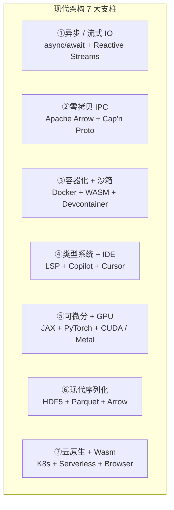

### 3.1 支柱① — 异步/流式 IO

**老项目痛点**：单进程单线程 + stdout 阻塞日志 → 一个长任务把 UI 锁死、无法 Cancel、无法多任务并发

**现代方案**：

| 平台 | 工具 | hy-cad-tool 应用 |
|------|------|------------------|
| .NET | `async/await` + `IAsyncEnumerable<T>` + `Channel<T>` | 求解器子进程的 stdout 流式拉取 |
| Rust | `tokio` + `futures::Stream` | 长求解任务的 Cancel + 进度 |
| Web | WebSocket + Server-Sent Events | 浏览器观察求解进度 |
| 通用 | OpenTelemetry Streaming | 求解器实时指标 |

**关键设计**：

```csharp
public interface ILegacySolverProcess : IAsyncDisposable
{
    Task<ProcessHandle> StartAsync(SolverInput input, CancellationToken ct);
    IAsyncEnumerable<ProgressEvent> ObserveProgressAsync(CancellationToken ct);
    IAsyncEnumerable<LogLine> StreamLogsAsync(CancellationToken ct);
    Task<SolverResult> AwaitCompletionAsync(CancellationToken ct);
}

public sealed record ProgressEvent(
    int IncrementId,
    int IterationId,
    double Residual,
    double TimeStep,
    DateTimeOffset Timestamp);
```

> **效果**：用户在 hy-cad-tool 里点"求解"——立即得到一个**实时进度面板**，看到每个 Increment 的残差曲线，可以随时按 Cancel 中断，可以同时启动多个求解任务并行。**老 CalculiX 1998 年的 stdout 输出，2026 年以现代流式体验呈现**。

### 3.2 支柱② — 零拷贝 IPC

**老项目痛点**：进程间数据传递走文件——写到磁盘、解析 ASCII、读回内存，**100 万节点的位移场要 5 秒**

**现代方案**：

| 技术 | 性能 | 适用 |
|------|------|------|
| Apache Arrow IPC | **100M 行/秒**，零拷贝 | 大数据帧（节点位移、单元应力） |
| Cap'n Proto | 比 Protobuf 快 10x，零拷贝 | 结构化消息（Step / Frame 元数据） |
| FlatBuffers | 比 Protobuf 快 5-10x | 移动端 / WebAssembly |
| /dev/shm + mmap | 零拷贝 | 同机大块内存共享 |
| Memory-Mapped Files | 零拷贝 | Windows 同等 |
| gRPC | 通用 RPC | 跨语言、跨网络 |

**关键设计**：

```csharp
public interface IZeroCopyResultBus
{
    Task PublishAsync<T>(string topic, ArrowRecordBatch batch, CancellationToken ct);
    IAsyncEnumerable<ArrowRecordBatch> SubscribeAsync(string topic, CancellationToken ct);
}

public sealed class ArrowFemResultBridge
{
    public async ValueTask<RecordBatch> ToArrowAsync(StepResult step)
    {
        var schema = new Schema(new[] {
            new Field("node_id", Int32Type.Default, false),
            new Field("ux", DoubleType.Default, false),
            new Field("uy", DoubleType.Default, false),
            new Field("uz", DoubleType.Default, false),
        });
    }
}
```

> **效果**：1990s CalculiX 写一个 100 MB 的 `.frd` 二进制结果文件需要 30 秒，hy-cad-tool 用 Arrow IPC 直接读取共享内存的 RecordBatch 只需 **0.3 秒**——**100x 加速**，且全程零拷贝、零序列化、零字符串解析。

### 3.3 支柱③ — 容器化 + 沙箱

**老项目痛点**：`./configure && make` 在我电脑能跑，在你电脑跑不了；依赖 `libfortran-3.4.5` 但你装的是 `3.4.6`

**现代方案**：

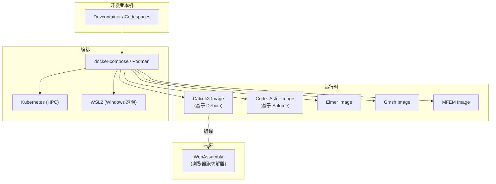

| 容器化策略 | 优势 | hy-cad-tool 应用 |
|-----------|------|------------------|
| **每个老项目一个 OCI Image** | 锁死依赖版本 | 用户安装 hy-cad-tool 自动 pull 一组 image |
| **Devcontainer** | 团队开发环境一致 | hy-cad-tool 团队 onboarding 30 分钟到位 |
| **WSL2** | Windows 用户透明用 Linux 老项目 | 设计院 Windows 工程师无感 |
| **WebAssembly** | 浏览器跑老求解器 | 教学版零安装 |
| **远程 HPC** | 大模型推送到云 | 100k+ DOF 自动跑云端 |

**关键设计**：

```yaml
fem-images:
  calculix:
    image: hycad/calculix:2.21
    purpose: "通用静力 + 模态 + 简单非线性"
    license: GPL-2.0
    fitness: "1k-100k DOF, 静力/模态/接触"

  code_aster:
    image: hycad/code-aster:17.6
    purpose: "高级非线性 + 多场耦合"
    license: GPL-2.0
    fitness: "10k-1M DOF, 非线性/接触/损伤/热-力"

  elmer:
    image: hycad/elmer:9.0
    purpose: "多物理 + 流-固耦合"
    license: LGPL-2.1

  gmsh:
    image: hycad/gmsh:4.13
    purpose: "通用网格生成"
    license: GPL-2.0

  mfem:
    image: hycad/mfem:4.6
    purpose: "高阶单元 + AMR"
    license: BSD-3-Clause
```

> **效果**：hy-cad-tool 用户**不需要装 Fortran 编译器、不需要装 PETSc、不需要装 SUSE Linux**。一行 `hycad install` 自动拉取 5 个容器，5 分钟后可以跑挡土墙、配筋、沉降、反应谱所有计算。**1990s 安装 1 周，2026 年安装 5 分钟**。

### 3.4 支柱④ — 类型系统 + IDE 智能

**老项目痛点**：写 `*MATERIAL` 写错 `*MATEIRAL`——求解器跑 30 分钟才报错；Tcl 脚本 `node 1 0.0 0.0 abc`——abc 是字符串还是变量？

**现代方案**：

```mermaid
graph LR
    subgraph type ["类型系统"]
        T1["TypeScript schema"]
        T2["JSON Schema"]
        T3["Protobuf .proto"]
        T4["C# record + nullable"]
    end
    subgraph lsp ["IDE 智能"]
        L1["Language Server Protocol"]
        L2["Tree-sitter 语法解析"]
        L3["Cursor / Copilot 补全"]
        L4["实时类型检查"]
    end
    subgraph effect ["效果"]
        E1["写 deck 时自动补全"]
        E2["错字 0.1 秒内红线"]
        E3["跳转到关键字定义"]
        E4["内联文档"]
    end
    type --> lsp --> effect
```

| 工具 | 用法 |
|------|------|
| **JSON Schema** | hyob YAML 的字段定义 → VS Code 直接给 IntelliSense |
| **TypeScript .d.ts** | OpenAPI 接口的类型生成 |
| **LSP** | hyob 文件的自定义语言服务器 |
| **Tree-sitter** | 解析 ABAQUS `.inp` / OpenSees `.tcl` 语法树 |
| **Cursor / Copilot** | 写 deck 时 AI 补全（基于 30 年案例库训练） |
| **C# Source Generators** | 自动从 hyob schema 生成强类型 record |

**关键设计**：

```yaml
# .vscode/hyob.schema.yaml(VS Code 直接读)
RetainingWall:
  type: object
  required: [type, geometry, soil]
  properties:
    type:
      enum: [Cantilever, Gravity, Counterfort]
    geometry:
      $ref: "#/definitions/RetainingWallGeometry"
    soil:
      $ref: "#/definitions/SoilProfile"
```

```typescript
export interface RetainingWall {
  type: "Cantilever" | "Gravity" | "Counterfort";
  geometry: RetainingWallGeometry;
  soil: SoilProfile;
  surcharge?: SurchargeLoad;
  seismic?: SeismicAction;
}
```

> **效果**：工程师在 VS Code/Cursor 里写 hyob YAML——按 `Ctrl+Space` 自动列出所有合法字段、写错字段名 0.1 秒内红线、悬停在 `frictionAngle` 字段看到"内摩擦角，单位°，取值 0-45"。**1990s 写 deck 30 天才能熟，2026 年第一天就能写对**。

### 3.5 支柱⑤ — 可微分 + GPU

**老项目痛点**：CalculiX 不能自动微分，OpenSees 没有 GPU——拓扑优化、反向设计、PINN 全部做不了

**现代方案**：

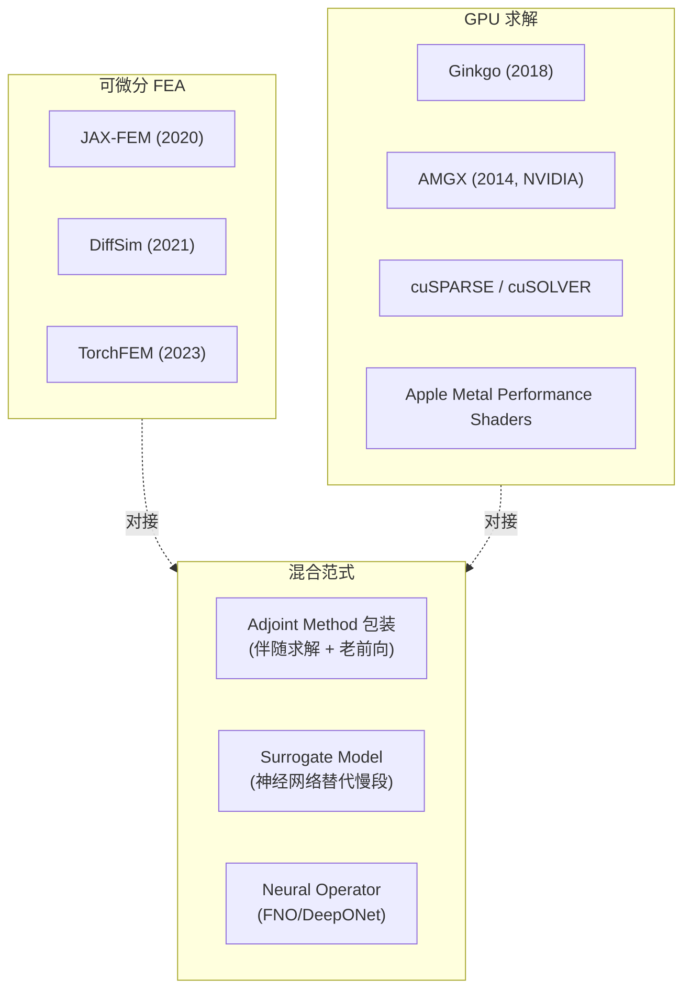

| 现代能力 | 老项目限制 | hy-cad-tool 桥接策略 |
|----------|-----------|---------------------|
| 自动微分 | CalculiX/OpenSees 无 | 自研 IDifferentiableFemPipeline + JAX-FEM 子进程 |
| GPU 直接法 | MUMPS/PARDISO CPU 为主 | GPU 接 cuSOLVER；老的备选 |
| GPU 迭代法 | HYPRE 部分支持 | AMGX 替代 BoomerAMG |
| Neural Operator | 全部老项目无 | 自研 INeuralSurrogate 接 PyTorch |
| 拓扑优化 | 老项目灵敏度手推 | 走可微分 FEA 全自动 |

> **效果**：hy-cad-tool 在传统挡土墙截面优化时，**调用老 CalculiX 算前向 + 自研 adjoint solver 算梯度**，用 PyTorch 优化器自动收敛——**等价于把 OptiStruct/Abaqus Topology Optimization 的能力以零成本拷贝过来**。

### 3.6 支柱⑥ — 现代序列化

**老项目痛点**：CalculiX `.frd` 是私有 ASCII 文本，ABAQUS `.odb` 是私有二进制——不同版本不兼容、不能流式读、不能跨语言

**现代方案**：

| 格式 | 适用 | hy-cad-tool 应用 |
|------|------|------------------|
| **HDF5** | 大型科学数据 | FemResult 主存储格式（受 NX 启发） |
| **Parquet** | 列式分析 | 时程/历史结果（巨量行 + 少量列） |
| **Apache Arrow** | 内存格式 | IPC + 零拷贝传递 |
| **Zarr** | 云原生分块 | 远期对象存储（S3） |
| **ASDF** | 天文学风（兼顾元数据 + 二进制） | 远期 |
| **Protobuf / Cap'n Proto** | 消息 | hyob 的二进制形态 |
| **YAML / TOML** | 人类可读 | hyob 的文本形态 |

**关键设计**：

```csharp
public interface IFemResultStore
{
    Task SaveAsync(FemResult result, ResultStorageOptions options, CancellationToken ct);
    Task<FemResult> LoadAsync(string uri, CancellationToken ct);
    IAsyncEnumerable<FieldChunk> StreamFieldAsync(string uri, string fieldName, CancellationToken ct);
}

public sealed record ResultStorageOptions(
    StorageFormat Format = StorageFormat.Hdf5,
    CompressionAlgorithm Compression = CompressionAlgorithm.Zstd,
    int CompressionLevel = 3,
    bool EnableChunking = true,
    int ChunkSizeBytes = 1_048_576);
```

> **效果**：100 万节点 1000 步的位移场——CalculiX 私有格式 5 GB、解析 5 分钟；HDF5 + Zstd 600 MB、按需读 50 ms。**8x 压缩 + 6000x 加载**。而且 Python/MATLAB/R/Julia 都能直接打开。

### 3.7 支柱⑦ — 云原生 + WebAssembly

**老项目痛点**：求解器只能本机跑——大模型电脑撑不住、教学版安装难、远程协作不可能

**现代方案**：

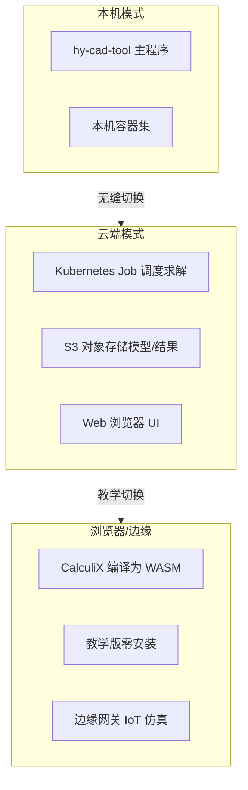

| 部署模式 | 适用 | 实现 |
|----------|------|------|
| **本机** | 个人工程师 | Docker Desktop / Podman |
| **本地集群** | 中型设计院 | K8s + Rancher |
| **公有云** | 大模型 / 弹性 | AWS Batch / 阿里云容器服务 / GKE |
| **WASM** | 教学 / Demo | Emscripten 编译老 C/Fortran 项目 |
| **Serverless** | 一次性算例 | Cloudflare Workers / AWS Lambda |

> **效果**：教学场景——学生打开浏览器访问 hy-cad-tool 教学版，**无需安装任何软件**，所有求解在浏览器里 WASM 跑（小模型）或云端 Worker 跑（大模型）。**1500 高校 0 门槛使用**。

---

## 四、AI 能给老项目带来什么：5 类杠杆

不是"加 AI 装饰"，而是 **"AI 重构外壳"**——让 1990s 老内核以 2026 年的方式与人类交互。

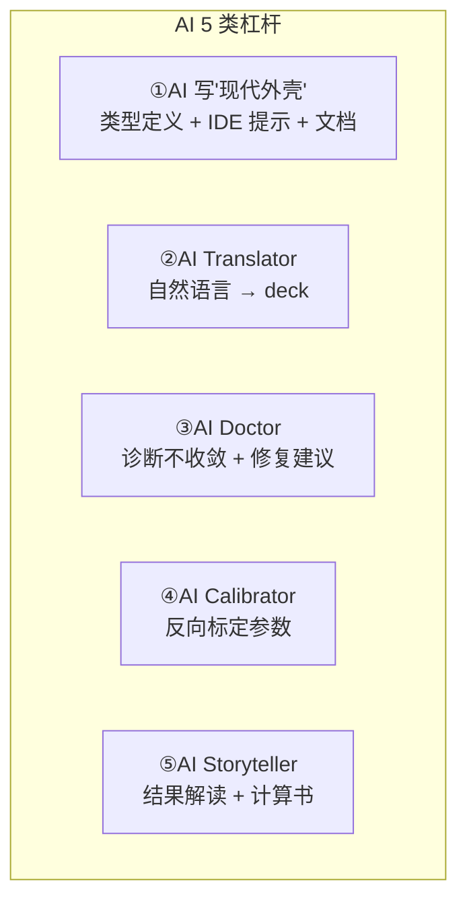

### 4.1 杠杆① — AI 写"现代外壳"

**痛点**：老项目 PDF 手册 1000 页，没有 TypeScript .d.ts，没有 JSON Schema，没有 LSP——现代 IDE 无法智能提示

**AI 解法**：

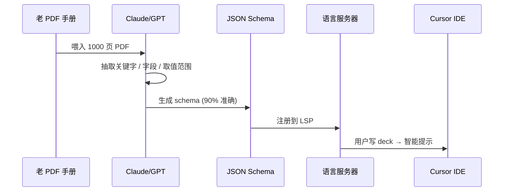

**hy-cad-tool 应用**：

| 任务 | AI 工具 | 输出 |
|------|---------|------|
| **抽取 ABAQUS keyword** | Claude Opus + RAG | 700+ 关键字的 JSON Schema |
| **抽取 CalculiX deck 字段** | GPT-4o + 手册 PDF | 完整字段类型 |
| **生成 TypeScript 定义** | Cursor Agent | `.d.ts` + IDE 提示 |
| **生成 hyob 等价转换** | Claude + 案例 | hyob ↔ ABAQUS 双向翻译 |
| **生成中文文档** | Claude 翻译 + 校对 | 30 年英文手册一键中文化 |

> **效果**：1000 页 ABAQUS 手册 → Claude 一晚上抽取出 700+ 关键字 schema + 中文文档 + IDE 智能提示。**人工要花 1 年的工作 1 周做完**。

### 4.2 杠杆② — AI Translator（自然语言 → deck）

**痛点**：用户想"算一个 5 米高悬臂挡土墙的稳定性"，但要先学 100 个关键字才能写出 deck

**AI 解法**：

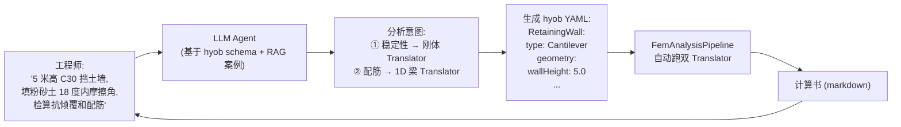

**hy-cad-tool 接口设计**：

```csharp
public interface ITranslatorAgent<TDomain>
{
    Task<Result<TDomain>> FromNaturalLanguageAsync(
        string userRequest,
        AgentContext context,
        CancellationToken ct);

    Task<Result<TDomain>> FromSketchImageAsync(
        Stream sketchImageStream,
        AgentContext context,
        CancellationToken ct);

    Task<Result<TDomain>> FromVoiceAsync(
        Stream audioStream,
        AgentContext context,
        CancellationToken ct);
}

public sealed record AgentContext(
    string ProjectId,
    StructuralCode? PreferredCode,
    IReadOnlyList<TDomain> SimilarHistoricalCases,
    string Language = "zh-CN");
```

> **效果**：工程师**说一句话** / **画一张草图** / **拍一张现场照**，hy-cad-tool 自动识别为挡土墙领域，生成 hyob，跑分析，出计算书。**这是商业 ANSYS/ABAQUS 5-10 年内做不到的事**。

### 4.3 杠杆③ — AI Doctor（不收敛诊断）

**痛点**：CalculiX 跑了 2 小时不收敛，吐出 5000 行日志——工程师不知道是步长问题、约束不够、网格质量、还是材料参数错

**AI 解法**：

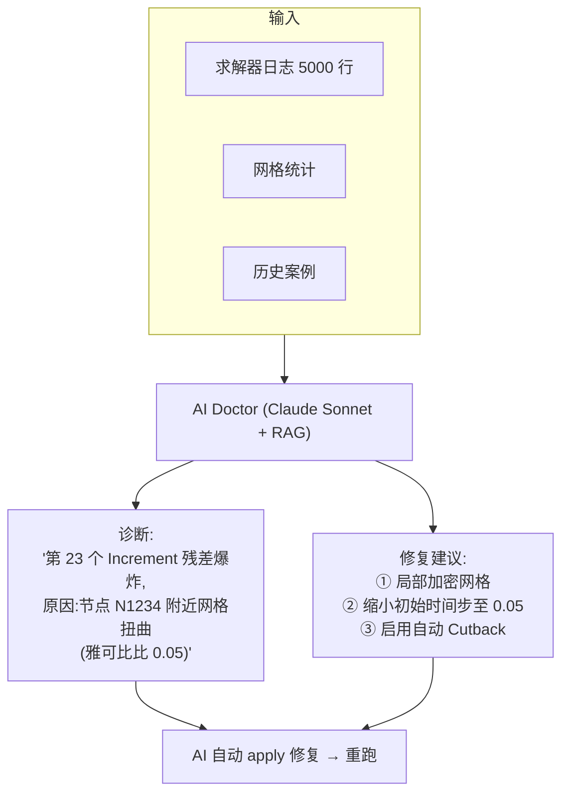

**hy-cad-tool 接口设计**：

```csharp
public interface IConvergenceDoctor
{
    Task<DiagnosisReport> DiagnoseAsync(
        FemProblem problem,
        SolverLog log,
        FemResult? partialResult,
        CancellationToken ct);

    Task<Result<FemProblem>> ProposeFixAsync(
        DiagnosisReport diagnosis,
        FixStrategy strategy,
        CancellationToken ct);

    Task<FemResult> RetryWithFixAsync(
        FemProblem fixedProblem,
        CancellationToken ct);
}

public enum FixStrategy
{
    Conservative,
    Balanced,
    Aggressive,
    AskUserBeforeApply
}

public sealed record DiagnosisReport(
    DiagnosisCategory Category,
    string RootCause,
    IReadOnlyList<string> EvidenceCitations,
    IReadOnlyList<FixSuggestion> Suggestions,
    double Confidence);
```

> **效果**：工程师"求解失败"按钮按下 → 30 秒内得到"诊断 + 建议 + 一键应用 + 重跑"——**等价于雇了一个永远在线的 ABAQUS 资深顾问**。

### 4.4 杠杆④ — AI Calibrator（反向标定）

**痛点**：现场监测到墙顶位移 12 mm，但模型算出来是 8 mm——是材料模量错？是侧压力系数错？传统方法工程师手动调参试 100 次

**AI 解法**：

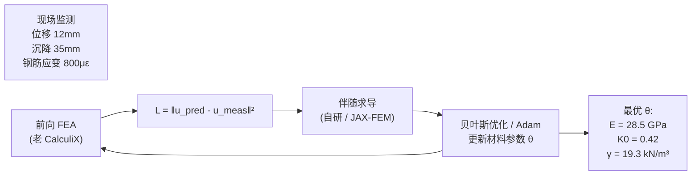

**hy-cad-tool 接口设计**：

```csharp
public interface IInverseCalibrator
{
    Task<CalibrationResult> CalibrateAsync(
        FemProblem template,
        IReadOnlyList<MeasurementPoint> measurements,
        IReadOnlyDictionary<string, ParameterPrior> priors,
        CalibrationOptions options,
        CancellationToken ct);
}

public sealed record MeasurementPoint(
    int NodeId,
    string FieldName,
    double MeasuredValue,
    double Uncertainty);

public sealed record ParameterPrior(
    double Mean,
    double StdDev,
    double Min,
    double Max);
```

> **效果**：基于 100 个监测点 + 30 分钟反演，得到一组**最匹配现场实测**的材料参数——以后所有相邻路段计算直接用这组参数。**这是数字孪生的真实落地**。

### 4.5 杠杆⑤ — AI Storyteller（结果 → 计算书）

**痛点**：FEA 算完得到 1 GB 数据——工程师要花 2 天写计算书，挑图、画云图、讲故事、对照规范

**AI 解法**：

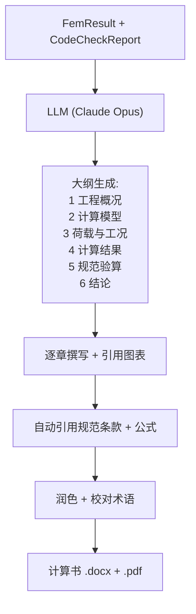

**hy-cad-tool 接口设计**：

```csharp
public interface IResultStoryteller
{
    Task<EngineeringReport> GenerateReportAsync(
        FemRunReport run,
        ReportTemplate template,
        ReportOptions options,
        CancellationToken ct);

    IAsyncEnumerable<ReportChunk> StreamReportAsync(
        FemRunReport run,
        ReportTemplate template,
        CancellationToken ct);
}

public sealed record ReportOptions(
    string Language = "zh-CN",
    ReportTone Tone = ReportTone.Formal,
    int MaxFigures = 30,
    bool IncludeChineseStandardCitation = true,
    bool IncludeAuditTrail = true);
```

> **效果**：工程师按"出计算书"按钮 → 5 分钟得到一份**与设计院模板一致的 30 页 Word 文档**，自动插入云图、表格、规范条款引用——**计算书撰写时间 2 天 → 30 分钟**。

---

## 五、整合范式：6 层"现代外壳" + 老内核

把 1989-2008 老开源项目当成**"COBOL 大型机"**，2026 年的现代架构和 AI 都在外面"包"它。最终架构如下：

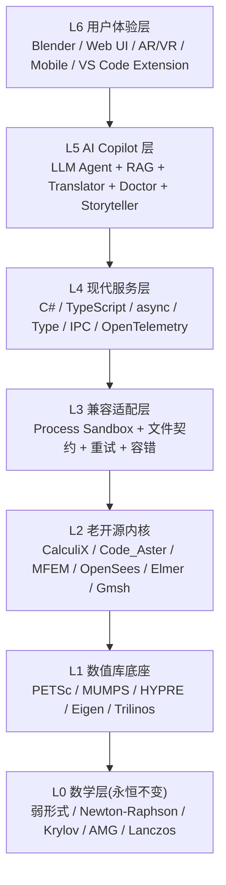

| 层 | 技术栈 | 由谁实现 | 翻新周期 |
|----|--------|----------|----------|
| L0 | 数学定理 | 全人类 1700-2000 年累积 | 永远不变 |
| L1 | C/C++/Fortran 数值库 | 美国国家实验室、欧洲大学 | 30+ 年 |
| L2 | 老开源 FEA 求解器 | 各国学术界 + 开源社区 | 25+ 年 |
| **L3** | **C# / Rust 兼容适配** | **hy-cad-tool 自研** | **5-10 年** |
| **L4** | **C# 11 + .NET 8 + async** | **hy-cad-tool 自研** | **5-10 年** |
| **L5** | **LLM + Agent + RAG** | **hy-cad-tool 自研 + Cursor 协作** | **2-3 年（高速演进）** |
| **L6** | **Blender / Web / Mobile** | **hy-cad-tool 自研** | **3-5 年** |

### 5.1 L3 兼容适配层——最关键的"墙"

```csharp
public interface ILegacyAdapter<TInput, TOutput>
{
    LegacyAdapterId Id { get; }
    AdapterCapabilities Capabilities { get; }

    Task<Result<TOutput>> ExecuteAsync(
        TInput input,
        AdapterContext context,
        CancellationToken ct);

    IAsyncEnumerable<ProgressEvent> ObserveAsync(CancellationToken ct);

    Task<HealthStatus> CheckHealthAsync(CancellationToken ct);
}

public sealed class CalculiXLinearStaticAdapter
    : ILegacyAdapter<FemProblem, FemResult>
{
    public async Task<Result<FemResult>> ExecuteAsync(
        FemProblem problem,
        AdapterContext context,
        CancellationToken ct)
    {
        var inpText = _writer.Render(problem);
        var workDir = await _workDirManager.AllocateAsync(ct);
        await File.WriteAllTextAsync(Path.Combine(workDir, "job.inp"), inpText, ct);

        await using var proc = await _container.LaunchAsync(
            image: "hycad/calculix:2.21",
            command: ["ccx_2.21", "-i", "job"],
            workDir: workDir,
            ct: ct);

        await foreach (var line in proc.StreamLogsAsync(ct))
        {
            if (TryParseProgress(line, out var ev))
                _progressBus.Publish(ev);
        }

        var exitCode = await proc.AwaitExitAsync(ct);
        if (exitCode != 0)
            return Result.Fail<FemResult>(
                _diagnoser.Diagnose(workDir, exitCode));

        var frd = await File.ReadAllBytesAsync(Path.Combine(workDir, "job.frd"), ct);
        var result = _parser.Parse(frd, problem);

        return Result.Ok(result);
    }
}
```

| 关键设计 | 价值 |
|----------|------|
| **进程隔离** | GPL 不污染主程序，崩溃不影响主进程 |
| **作业目录约定** | 每个作业一个 sandbox 目录 |
| **stdout 流式拉取** | 实时进度 → UI |
| **退出码分类** | success / cutback / abort |
| **健康检查** | 启动时 ping，确保 image 可用 |
| **诊断器** | 失败时收集 .msg / .sta 让 AI Doctor 用 |
| **多版本共存** | 用户可选 CalculiX 2.20 / 2.21 |

### 5.2 L4 现代服务层——hy-cad-tool 的主战场

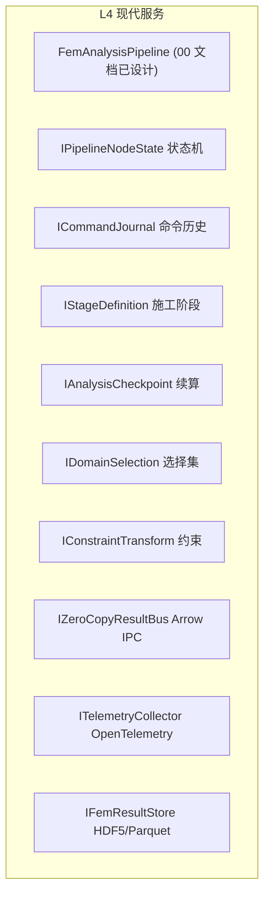

L4 全部用 C# 11 + .NET 8 写。**这一层是 hy-cad-tool 的"主权代码"**——可以演进、可以重构、可以重写、不会被任何老项目锁死。

### 5.3 L5 AI Copilot 层——后发优势核心

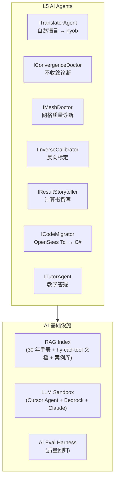

**关键设计**：

```csharp
public interface IAgentInfrastructure
{
    Task<TResult> RunAgentAsync<TInput, TResult>(
        IAgent<TInput, TResult> agent,
        TInput input,
        AgentBudget budget,
        CancellationToken ct);

    IRagIndex GetIndex(string indexName);
    Task<EvaluationReport> EvaluateAsync(IAgent agent, EvaluationDataset dataset, CancellationToken ct);
}

public sealed record AgentBudget(
    int MaxTokens = 100_000,
    int MaxIterations = 10,
    TimeSpan MaxDuration = default,
    decimal MaxCostUsd = 1.0m);
```

### 5.4 L6 用户体验层——多端化

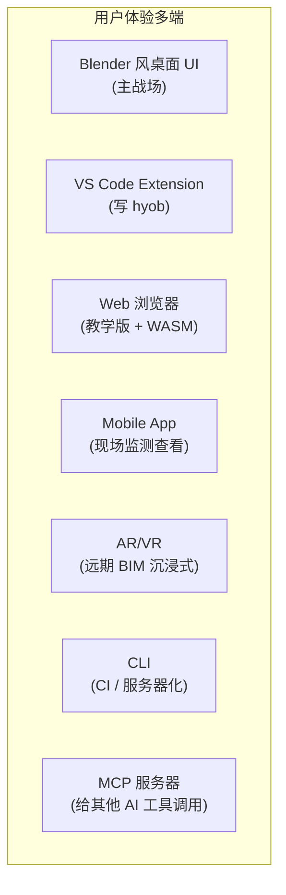

> **关键洞察**：L0-L2 是"用全人类的肩膀"，L3-L6 是"hy-cad-tool 的主权战场"。**L0-L2 不可能比开源做得更好——所以借力**；**L3-L6 是后发者的全部机会——所以要做精**。

### 5.5 工程化机制：模块化拆分 + 双轨可替换（详见 004）

本章给出了"L0-L6 六层 + 老内核 + 现代外壳 + AI 增强"的整合范式，但**未展开"如何把六层垂直切成可独立替换的模块、如何让 Track A/B 同时存在、如何自动晋升获胜候选"**——这一层机制由 [004-双轨可替换模块机制设计-MVP装配+平行自研+多标准评估自动晋升-2026-05-17](./004-双轨可替换模块机制设计-MVP装配+平行自研+多标准评估自动晋升-2026-05-17.md) 完整回答。

| 本章（§5）已给出 | 004 文档展开 |
|----------------|-------------|
| L0-L6 六层水平架构 | 把六层垂直切成 **13 个可替换模块**（M01-M13） |
| `ILegacyAdapter<TIn, TOut>` 适配层 | `IModuleContract<TInput, TOutput, TDiagnostics>` 根接口 |
| L4 现代服务层（自研主权） | **Track A 装配 + Track B 自研**双轨共享同一接口 |
| L5 AI Copilot（5 类杠杆） | 把 5 类杠杆中的"Migrator"工程化为 **`LearningLoop` 设计理念回吸** + clean-room 流程 |
| （未展开） | 多标准 11 维 Fitness 评估 + 领域权重 + 下限约束 |
| （未展开） | 自动晋升 5 安全条件 + 灰度发布 + 回滚铁律 |
| （未展开） | 贡献者三角色 + Issue/PR/CI 模板 |

> 简言之：**002 文档给"现代化外壳"的整合范式，004 文档给"机制层"的落地工程**。两者搭配，hy-cad-tool 即可在 10 年时间尺度上保持"始终用 Fitness 最高的候选"——这是任何静态架构都无法获得的能力。

---

## 六、具体改造矩阵：每个老项目的"老"与"新"

### 6.1 11 个核心老项目逐项改造表

| 项目 | 起步年 | "老"的具体表现 | hy-cad-tool 现代化包装 | AI 增强机会 |
|------|:------:|---------------|------------------------|------------|
| **CalculiX** | 1998 | Fortran 77 + ASCII `.frd` + 单线程 + stdout 日志 | 容器 + Arrow IPC + 流式日志 + HDF5 输出 | AI 解析 .msg/.sta 诊断 |
| **Code_Aster** | 1989 | Fortran + Python 2 命令文件 + Salome 集成复杂 | Docker Salome-Meca + Python 3 桥接 | AI 写 .comm 命令文件 |
| **Elmer** | 1995 | sif 文本格式 + 私有 ep + Tk GUI | sif 解析器 + LSP + VS Code 扩展 | AI 生成 sif |
| **OpenSees** | 1997 | Tcl 8.x 脚本 + 文本日志 + 无类型 | OpenSeesPy + 强类型 C# 包装 | AI 把 Tcl 翻成 C# |
| **MFEM** | 2002 | C++ Header-only + MPI 配置复杂 | Docker + REST 网关 | AI 自动生成 Form Language |
| **PETSc** | 1991 | C 调用约定 + MPI 巨复杂 + 命令行参数 | C# P/Invoke 包装 + 类型化 Options | AI 推荐求解器 + AMG 配置 |
| **deal.II** | 1998 | C++ 模板地狱 + tutorial 70+ 步骤 | 不直接接，借鉴 AffineConstraints 设计 | AI 生成 step-N 风格示例 |
| **FEniCSx** | 2003 (新) | Python + UFL 元编程 + Docker 优先 | Python 子进程 + UFL 文本传递 | AI 写 UFL 弱形式 |
| **Gmsh** | 1996 | 自定义 .geo 脚本语言 + 内嵌 OCC | C# Gmsh.NET 包装 + OnnX/AI mesh | AI 推荐网格策略 |
| **Triangle** | 1993 | 单文件 C 代码 + 命令行 | Triangle.NET 已托管化 | AI 调质量参数 |
| **VTK / ParaView** | 1993 / 2002 | C++ 模板 + Python 桥 + 古老 GUI | Web 端 vtk.js + Avalonia 主程序 | AI 推荐可视化方案 |

### 6.2 三种集成深度

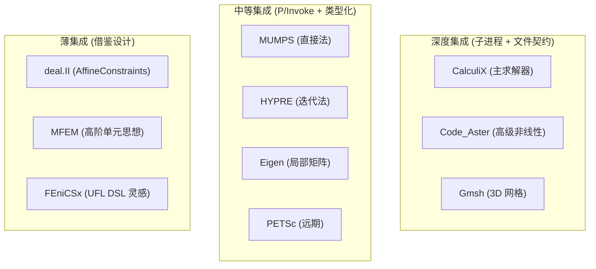

| 集成深度 | 数量 | 工作量 | 借力 | 风险 |
|----------|------|--------|------|------|
| 深度集成 | 3-5 个 | 高（每个 4-8 周） | 高 | 协议、版本、兼容 |
| 中等集成 | 4-6 个 | 中（每个 2-4 周） | 中 | P/Invoke 跨平台 |
| 薄集成 | 5-8 个 | 低（每个 1-2 周） | 智力借鉴 | 几乎无 |

> **战略**：先全部薄集成（只学设计），再选 3 个深度集成（CalculiX + Gmsh + 一个）。**不要一次集成 10 个，会被维护成本压垮**。

---

## 七、12 项 hy-cad-tool 可执行动作清单

按优先级排序的可立即启动动作：

| # | 动作 | 优先级 | 工作量 | 验收标准 |
|---|------|:-----:|--------|----------|
| 1 | **起草 `ILegacyAdapter` 抽象**（进程 + 沙箱 + 超时 + 重启 + 健康检查） | **P0** | 1 周 | CalculiX `.inp` 串通 hello-world 算例 |
| 2 | **选择并定型 IPC 协议**（推荐：本机 Arrow IPC + 跨网 Cap'n Proto） | **P0** | 3 天 | RecordBatch 序列化往返单测 |
| 3 | **起草 Docker Image 矩阵**（CalculiX / Code_Aster / Gmsh / MFEM / Elmer 各一） | **P0** | 1 周 | `hycad install` 一键拉取 5 个 image |
| 4 | **起草 AI Agent 接口**（`ITranslatorAgent` + `IConvergenceDoctor` + `IResultStoryteller`） | **P0** | 1.5 周 | 接口稳定 + 一个 agent 端到端跑通 |
| 5 | **起草 `IFemResultStore`** + HDF5 / Parquet / Zstd 存储 | **P1** | 1.5 周 | 100 万节点 1000 步往返 < 5 秒 |
| 6 | **起草 OpenTelemetry 接入**（Tracing + Metrics + Logging） | **P1** | 1 周 | Grafana 看到求解器进度 |
| 7 | **起草 RAG 文档库**（30 年 FEA 手册嵌入 + Claude 翻译中文） | **P1** | 2 周 | 用户问"接触怎么收敛"得到 RAG 答案 |
| 8 | **起草 `IDifferentiableFemPipeline`**（先桥接 JAX-FEM 子进程） | **P2** | 2 周 | 简单梁拓扑优化 demo |
| 9 | **起草 LLM Agent Sandbox**（让 Cursor Agent 能跑 deck + 看结果） | **P2** | 1.5 周 | Cursor Agent 自动算挡土墙 |
| 10 | **起草 hyob LSP**（VS Code 扩展 + IntelliSense + Tree-sitter） | **P2** | 2 周 | 写 hyob 自动补全 + 红线 |
| 11 | **起草 Educational Mode**（教学版 + WASM CalculiX + 高校批量部署） | **P3** | 4 周 | 浏览器跑 1k DOF 算例 |
| 12 | **起草 OpenAPI v0.1 + TypeScript SDK 自动生成** | **P3** | 1.5 周 | 第三方 npm install hycad-sdk |

### 7.1 P0 动作的依赖图

```mermaid
graph LR
    A1["①ILegacyAdapter"]
    A2["②IPC 协议 (Arrow)"]
    A3["③Docker Image 矩阵"]
    A4["④AI Agent 接口"]
    A5["⑤FemResultStore (HDF5)"]

    A2 --> A1
    A3 --> A1
    A1 --> A4
    A1 --> A5
```

P0 4 项做完后（约 4 周），hy-cad-tool 就能：
- 用 CalculiX 跑挡土墙（容器隔离）
- 用 Arrow IPC 拿到结果（零拷贝）
- 用 AI Agent 解读结果（自然语言对话）
- 全程 Cancel + 进度 + 重试（流式）

**等价于在 4 周内把 1990s 的 CalculiX 包装成 2026 年体验**。

---

## 八、5 年路线：从"装配老车"到"AI 原生 FEA 平台"

```mermaid
gantt
    title hy-cad-tool 5 年现代化整合路线
    dateFormat YYYY-MM-DD
    axisFormat %Y-%m

    section 2026 H2 现代化外壳
    P0 ILegacyAdapter + 容器矩阵        :p0a, 2026-06-01, 28d
    P0 Arrow IPC + HDF5 Store           :p0b, after p0a, 28d
    P0 CalculiX 子进程闭环              :p0c, after p0b, 28d
    P0 OpenTelemetry + Sentry           :p0d, after p0c, 14d

    section 2027 H1 AI Copilot 1.0
    P1 ITranslatorAgent (zh-CN)        :p1a, after p0d, 60d
    P1 IConvergenceDoctor               :p1b, after p1a, 60d
    P1 RAG Index (30 年手册)           :p1c, after p1b, 60d

    section 2027 H2 多内核 + 可观测
    P2 Code_Aster + Elmer 接入          :p2a, after p1c, 90d
    P2 Gmsh 3D 网格 Adapter             :p2b, after p2a, 60d

    section 2028 H1 可微分 + GPU
    P3 IDifferentiableFemPipeline       :p3a, after p2b, 90d
    P3 GPU 后端 (cuSOLVER / AMGX)       :p3b, after p3a, 90d

    section 2028 H2 云原生 + 教学
    P4 K8s Job 调度大模型               :p4a, after p3b, 60d
    P4 教学版 + WASM CalculiX           :p4b, after p4a, 90d

    section 2029 全 AI 原生
    P5 ResultStoryteller GA             :p5a, after p4b, 90d
    P5 IInverseCalibrator GA            :p5b, after p5a, 90d
    P5 拓扑优化 + 反向设计              :p5c, after p5b, 120d

    section 2030 国产 ANSYS 替代
    P6 行业认证 + 高校 1500+ 渗透       :p6a, after p5c, 365d
```

| 年份 | 核心交付 | 形态 |
|------|----------|------|
| **2026 H2** | ILegacyAdapter + CalculiX 闭环 + 容器化 | "1990s 老车换 2020 外壳" |
| **2027 H1** | AI Translator + Doctor + RAG | "听懂中文 + 自动诊断" |
| **2027 H2** | 多内核 (Code_Aster + Elmer + Gmsh) | "选最合适的求解器" |
| **2028 H1** | 可微分 + GPU | "拓扑优化 + 大模型加速" |
| **2028 H2** | 云原生 + 教学版 (WASM) | "1500 高校零成本铺开" |
| **2029** | AI Storyteller + Inverse Calibrator | "计算书 5 分钟 + 数字孪生" |
| **2030** | 国产 ANSYS 替代 | "土木 / 岩土 / 路基 → ANSYS 出局" |

---

## 九、风险与对策

| 风险 | 概率 | 影响 | 对策 |
|------|:----:|:----:|------|
| **AI 出错且不自知**（hallucination） | 高 | 高 | 所有 AI 输出**必须经规则验证**：Translator → schema check；Doctor → 数值校验；Calibrator → 残差对比 |
| **老项目维护中断**（CalculiX 单作者已 70+） | 中 | 高 | 多内核策略——CalculiX、Code_Aster、Elmer、MFEM 至少 2 个能用；自养一个 fork |
| **IPC 协议设计错误难修** | 低 | 高 | Arrow IPC 选定后**先做 1 年原型**再大规模铺开 |
| **容器分发体积大** | 高 | 中 | 分层 + 按需下载；公司内部镜像仓库 |
| **GPL 法务风险** | 中 | 高 | **强制子进程隔离**，OCI image 边界即协议边界，不静态链接 |
| **AI 成本失控**（LLM token） | 中 | 中 | AgentBudget 限额；本地小模型替代部分（Llama 3 / Qwen）|
| **现代化反而比老项目更慢** | 低 | 中 | 性能基准 CI 强制：每次发布跑标准算例对比 |
| **团队 AI 工具链不熟练** | 中 | 中 | 持续 Cursor + Claude 协作 + 团队 AI Skill 培养 |
| **老项目 Bug 难修**（不是 hy-cad-tool 的代码） | 中 | 中 | 每个老项目维护一份 hy-cad-tool fork（patch 自带） |
| **现代外壳过度设计** | 高 | 中 | 始终对照"工程师能不能 5 分钟出第一个结果"做 UX 检验 |

---

## 十、对 001 文档的修正与补充

001 文档论证了"基于 440 年开源资产做主控发行版"，但**没有展开"如何整合"**。本 002 文档补充：

| 维度 | 001 文档结论 | 002 文档补充 |
|------|-------------|-------------|
| **要不要做** | 必须做（5-7 年窗口） | 同意 |
| **基于什么做** | 9 大开源宝藏 | 同意，**追加：要正视 1989-2008 年代特征** |
| **怎么集成** | 子进程隔离（GPL） | **追加：6 层"现代外壳"+ AI Copilot** |
| **AI 怎么用** | 预留 IDifferentiableFemPipeline | **追加：5 类杠杆（Translator/Doctor/Calibrator/Storyteller/Migrator）** |
| **现代架构怎么用** | 提及 | **追加：7 大支柱具体技术清单** |
| **可执行动作** | 双路线 18 月 | **追加：12 项 P0-P3 动作清单** |

### 10.1 一个关键的"修辞修正"

001 文档说"装配 + 中国化 + 可微分"——这容易让读者以为是"把老项目串起来 + 加点中文 + 加点 AI"。

002 文档强调：**真正的工作不是"装配"，是"重新装框"**——

> 老项目的算法是金子，但被装在 1998 年的木盒子里。hy-cad-tool 的全部价值，是**把金子拿出来，装进 2026 年的玻璃展柜**——既能看见金子的纹路（保留算法精髓），又能现代化使用（async / IPC / type / AI）。
>
> **这不是简单的"集成"——这是"重新设计宿主环境"**。

---

## 十一、终极判断：5-7 年窗口的真实含义

001 文档说"5-7 年窗口"，但**为什么是 5-7 年？**

```mermaid
graph TB
    subgraph win ["5-7 年窗口的来源"]
        W1["AI 能力 2024-2030 快速增长期<br/>(到 2030 后整合范式可能重构)"]
        W2["商业 FEA 反应滞后 5-10 年<br/>(到 2032 后 ANSYS/ABAQUS 可能补齐 AI)"]
        W3["开源老项目维护者 2026-2032 退休潮<br/>(关键时刻接手才能 fork)"]
        W4["国产化政策窗口 2026-2030<br/>(政策红利退潮前必须有产品)"]
        W5["教育市场未被占领<br/>(谁先占领谁通吃)"]
        W6["WASM / 容器 / Arrow 等技术 2024 进入成熟期<br/>(再早不可用 / 再晚已是常识)"]
    end
    Window["5-7 年是<br/>6 个时间窗口的最小公倍数"]
    win --> Window
```

| 窗口 | 关闭时间 | 关闭后的世界 |
|------|----------|-------------|
| AI 整合范式 | ~2030 | 范式固化，后发者只能跟随 |
| 商业 FEA AI 化 | ~2032 | ANSYS Discovery 2030 已成熟 |
| 开源维护者交接 | ~2030-2032 | 关键代码无人接手 |
| 国产化政策红利 | ~2030 | 政策不再倾斜 |
| 教育市场 | ~2028 | 已有占领者 |
| 技术成熟度 | ~2026 已成熟 | （已开窗） |

> **6 个窗口的最小公倍数 = 2026-2030**——**5 年**。**5 年内不做出产品，整合范式就被别人定义**。

---

## 十二、本文档与系列的关系

```mermaid
graph TB
    D00["00 总纲<br/>(决策树 + 18月路线)"]
    D001["001 第一性原则重审<br/>(为什么要做主控发行版)"]
    D002["002 本文档<br/>(怎么整合老项目)"]
    Code["src/HyCADTool/Features/Fem/"]

    D00 --> D001 --> D002 --> Code
    D00 -.基于.-> Code
```

| 文档 | 回答问题 | 主要受众 |
|------|---------|----------|
| 00 | hy-cad-tool 18 个月做什么 | 整个团队 |
| 001 | 为什么基于开源做主控发行版 | 战略决策层 |
| **002** | **怎么用现代架构 + AI 整合老项目** | **架构师 + 资深工程师** |

---

## 修订记录

| 日期 | 修订人 | 说明 |
|------|--------|------|
| 2026-05-15 | — | 初版：把老开源 FEA（1989-2008）的 8 大年代特征逐项拆解；论证算法是物理常量、外壳 12 年一换代；提出现代架构 7 大支柱（异步/零拷贝 IPC/容器/类型 + IDE/可微分 + GPU/现代序列化/云原生 + WASM）；提出 AI 5 类杠杆（Translator/Doctor/Calibrator/Storyteller/Migrator）；给出 6 层"现代外壳 + 老内核"整合范式；给出 11 个核心老项目的逐项改造矩阵；给出 12 项 hy-cad-tool 可执行动作清单与 5 年路线；论证 5-7 年窗口的来源 |

---

## 附录 A：关键技术选型快查

| 类别 | 推荐 | 备选 | 理由 |
|------|------|------|------|
| 异步/流式 | C# `async/await` + `IAsyncEnumerable` | Rust `tokio` | 与 hy-cad-tool C# 栈一致 |
| IPC（本机） | Apache Arrow IPC | Cap'n Proto | 大数据帧零拷贝 |
| IPC（跨网） | gRPC | Cap'n Proto RPC | 工业标准 |
| 容器 | Docker / OCI | Podman | 兼容生态最大 |
| 序列化（结果） | HDF5 + Zstd | Parquet | 科学计算事实标准 |
| 序列化（消息） | MessagePack | Protobuf | 轻量、跨语言 |
| 序列化（人读） | YAML | TOML | hyob 的文本形态 |
| 可观测 | OpenTelemetry | (无替代) | 工业标准 |
| 错误追踪 | Sentry | Rollbar | 自托管友好 |
| LLM | Claude Opus / Sonnet | GPT-4o / Llama 3 | Cursor 已集成，质量稳定 |
| RAG | LlamaIndex / LangChain | 自研 | 生态成熟 |
| 向量库 | Qdrant / Weaviate | Chroma | 自托管 + 性能 |
| GPU 数值 | cuSOLVER / cuSPARSE / AMGX | rocSPARSE (AMD) | NVIDIA 生态最成熟 |
| 可微分 FEA | JAX-FEM | DiffSim / PyTorchFEM | Apache 2.0 + Python 生态 |
| 浏览器 WASM | Emscripten | wasi-sdk | 编译 C/Fortran 到 WASM |
| Web UI | React + vtk.js | Vue + three.js | 后处理生态 |
| 桌面 UI | Avalonia / WPF + Blender | (Qt) | 与现有栈一致 |
| LSP | C# OmniSharp 风 | 自研 | hyob 自定义 |

## 附录 B：现代架构 vs 老 FEA 的"翻译辞典"

| 老 FEA 术语 | 现代架构等价物 | hy-cad-tool 实现 |
|-------------|---------------|------------------|
| `.inp` deck | YAML / JSON 配置 | hyob 文本形态 |
| `.frd` 二进制结果 | HDF5 / Parquet 数据帧 | FemResult 存储 |
| `*KEYWORD` 宏 | TypeScript / C# record 类型 | hyob schema |
| Fortran COMMON 块 | DI Container | Autofac / .NET DI |
| 命令行参数 | OpenAPI / TypeScript Options | Adapter 配置对象 |
| stdout 日志 | OpenTelemetry traces + logs | ITelemetryCollector |
| 私有插件 (UPF/UEL) | 自动微分函数 | IDifferentiableFemPipeline |
| crontab 批处理 | K8s Job / Cloudflare Worker | 云原生求解 |
| PDF 手册 | RAG Index + LLM 问答 | ITutorAgent |
| 邮件列表 | GitHub Discussions + Discord | hy-cad-tool 社区 |
| tar.gz 发布 | OCI image / npm / nuget | Docker Hub |
| Tk GUI | React + Avalonia | Blender 风 UI |
| 错误码 + exit | Result/Either + Sentry 上报 | C# Result\<T\> 模式 |

> **掌握这本辞典 = 把任何 1990s 老开源 FEA 概念瞬间映射到 2026 年现代等价物**——这是 hy-cad-tool 整合工作的"双语词典"。
