## 文档定位

> 文档日期：2026-05-15
> 上承：[002-现代架构与AI整合1991到2008开源FEA-放大优势规避短板-2026-05-15](./002-现代架构与AI整合1991到2008开源FEA-放大优势规避短板-2026-05-15.md)
> 性质：**对 002 文档"6 层现代外壳 + 老内核"整合范式的下一层工程细化——回答"如何巧妙地把算法金子从 1990s 木盒子里搬出来、放进 2026 玻璃展柜，全程不踩 12 大雷区、且让算法层永远是人类公共财产"**

002 文档给出了"重新装框"的整体范式，但只到层次架构。**003 必须回答更难的工程问题**：

1. **怎么搬？** —— 老项目的算法不是放在抽屉里等你拿，而是**焊死在工程外壳里**——Fortran COMMON 块、全局变量、隐式 IO、命令行解析、文件路径硬编码。要"搬出"金子，先要小心翼翼地把焊点一个个切开。

2. **怎么不踩坑？** —— 12 大雷区——协议污染、API 漂移、维护断档、数值不一致、性能退化、版本碎片、二次迁移、生态分裂、逆向负担、隐性状态、AI 误重构、ABI 锁定。**任何一个雷区踩中，整个发行版崩盘**。

3. **怎么解耦？** —— 算法层 vs 外壳层的边界**必须从第一天就清晰且可证伪**。否则 5 年后耦合再来拆，工作量是 10 倍。

4. **怎么留给后人？** —— 50 年后人类回看 hy-cad-tool，应该看到的是**一座永久属于全人类的算法宝库**（HyAlgo Commons），而不是又一个被某发行版绑架的"半私有半公开"。**避免后人重复拆分整合**——这是 hy-cad-tool 最大的历史责任。

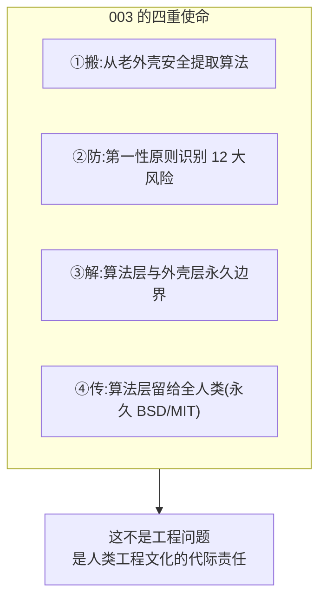

> **核心命题**：001 说"应该做"，002 说"怎么做架构"，**003 说"怎么做才不会让后人再受同样的罪"**。

---

## 一、第一性原则：拆分老项目的 4 大终极目标

每个工程动作都要回到第一性原则。"为什么要解耦算法层和外壳层"的终极目标只有 4 个——其它都是手段：

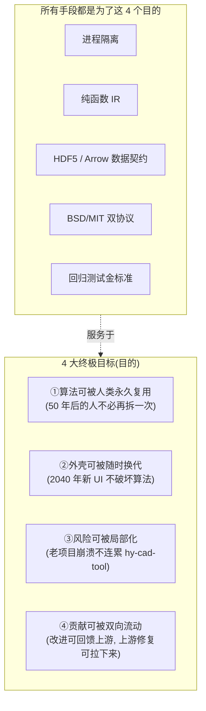

### 1.1 4 大目标的可证伪检验

| 目标 | 可证伪检验 | 检验失败 = 什么后果 |
|------|-----------|---------------------|
| ①算法永久可复用 | **从 hy-cad-tool 里把算法层 fork 出去 1 小时内能独立运行** | 后人会再拆一次，承担 hy-cad-tool 的历史包袱 |
| ②外壳可换代 | **把 L4/L5/L6 整体替换成新栈，L0-L3 不动，1 周完成** | 10 年后整个发行版被外壳绑死无法升级 |
| ③风险局部化 | **任意老项目子进程崩溃，hy-cad-tool 主进程仍可工作** | 一个老项目挂掉拖垮整个发行版 |
| ④贡献双向流动 | **任何 bug 修复可以同时贡献回 CalculiX 上游 + 自身合入** | 与上游分裂，5 年后维护成本爆炸 |

> **关键洞察**：以上 4 条是**强约束**，不是"加分项"。若做不到第①条（算法永久可复用），hy-cad-tool 不过是"又一个被某公司绑架的开源整合"——50 年后的工程师还要再拆一次，这就违背了 001 文档的初心。

### 1.2 反面教材：哪些项目失败了

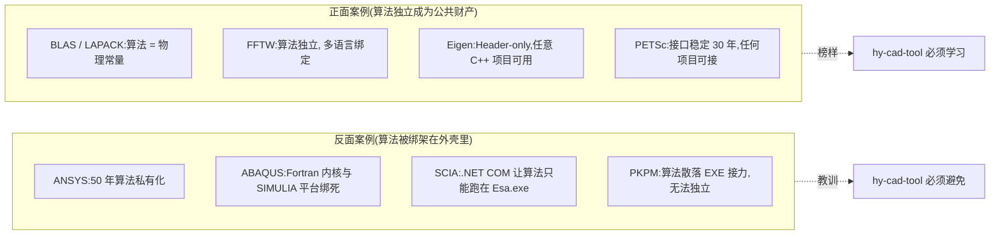

| 失败案例 | 错误点 | 后果 |
|----------|-------|------|
| ANSYS | 算法 = 公司私有资产 | 50 年只服务 ANSYS 一家用户 |
| ABAQUS | 算法绑定 SIMULIA / 3DEXPERIENCE | 收购后逐步封闭 |
| SCIA | 算法只能通过 Esa.exe Open API 调用 | 离开 Esa.exe 无法运行 |
| PKPM | 算法散布在 SATWE/PMSAP 等独立 EXE | 任何升级都要全套重测 |
| **正面：BLAS** | **API 极简、算法纯净** | **40 年成为全人类计算的物理常量** |
| **正面：FFTW** | **算法核心独立** | **任何科学软件都直接用** |

> **hy-cad-tool 的志向**：成为"FEA 领域的 BLAS"——**算法层（HyAlgo Commons）应像 BLAS / LAPACK / FFTW / Eigen 一样，永远是人类公共财产**。

---

## 二、风险全景图：12 大可能踩坑

第一性原则下提前识别 12 大风险，每一项都标注**踩中后的损失级别**：

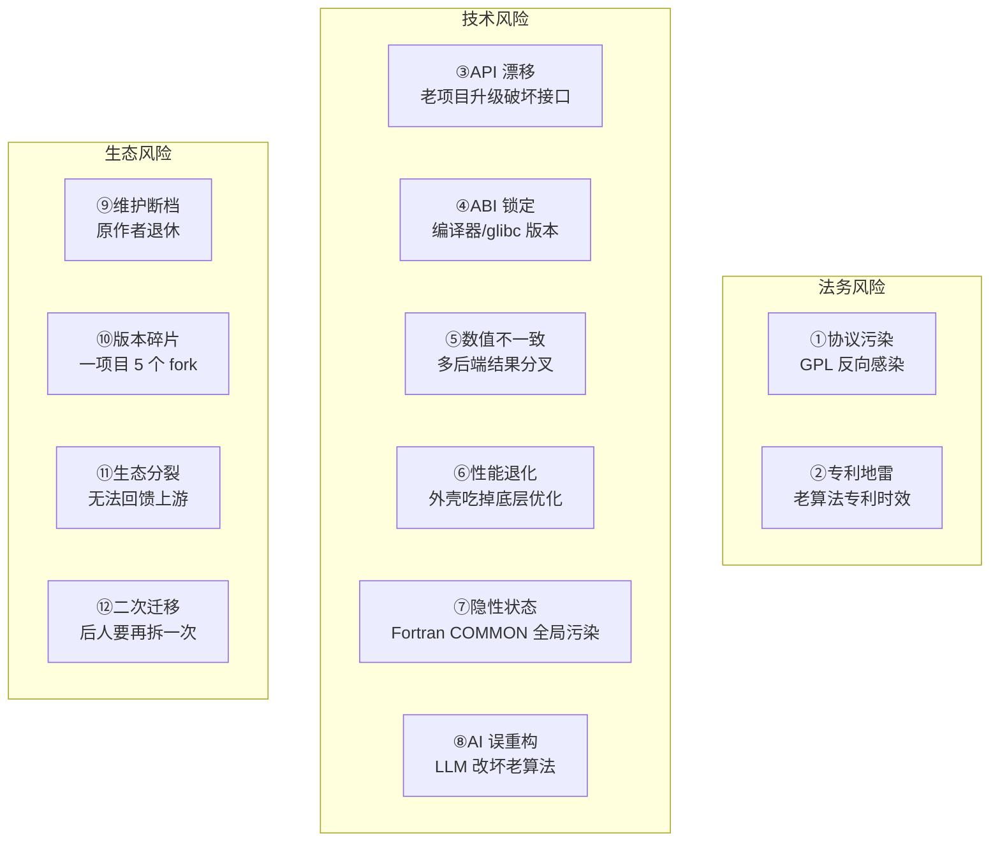

### 2.1 风险逐项详解

#### R1 — 协议污染（损失等级：★★★★★，致命）

| 维度 | 详情 |
|------|------|
| **场景** | hy-cad-tool 静态链接 CalculiX (GPLv2)，触发 GPL "viral" 条款 |
| **后果** | hy-cad-tool 主程序必须开源 GPL，商业模式破灭 |
| **概率** | 高（如果不显式防范） |
| **第一性根因** | GPL 设计哲学 = "派生作品继承传染"，**动态链接也可能算派生** |
| **对策** | **强制子进程边界**：所有 GPL 项目通过 OS 进程边界 + stdio/文件契约访问；**主程序与 GPL 进程之间不共享任何符号、不共享地址空间** |
| **验证方法** | 法律 audit + `lddtree` 检查 + CI 阻断静态链接 GPL .a |

#### R2 — 专利地雷（损失等级：★★★，可控）

| 维度 | 详情 |
|------|------|
| **场景** | 某老算法实现引用了仍在专利保护期的专利（如某些特定接触搜索算法） |
| **后果** | 商业用户被起诉 |
| **概率** | 低-中 |
| **第一性根因** | 算法专利保护期 20 年；老项目可能借鉴但未明示 |
| **对策** | ① 仅采用 1995 年前发表的算法（专利大多已过期）；② 实现前做 freedom-to-operate 检索；③ 优先实现 BLAS/LAPACK 体系内算法（已被反复检索过） |
| **验证方法** | 专利律师季度审计 |

#### R3 — API 漂移（损失等级：★★★★，严重）

| 维度 | 详情 |
|------|------|
| **场景** | CalculiX 2.21 升 2.22，`.inp` 关键字废弃，hy-cad-tool 翻译器全部坏掉 |
| **后果** | 用户升级一夜之间所有项目无法重算 |
| **概率** | 中（老项目变化慢，但仍有微调） |
| **第一性根因** | 没有"凝固契约层"——hy-cad-tool 直接绑定老项目当前版本 |
| **对策** | **Adapter 内部固化版本号**；每个老项目维护"稳定 fork"（hycad-calculix-2.21）；**升级走灰度通道**：A/B 双跑对比 |
| **验证方法** | CI 跑标准回归 100+ 算例，任意一项目升级先全量回归 |

#### R4 — ABI 锁定（损失等级：★★★，可控）

| 维度 | 详情 |
|------|------|
| **场景** | 老项目用 GCC 4.8 + glibc 2.17 编译，新系统 GCC 13 + glibc 2.38 跑挂 |
| **后果** | 容器外部署失败 |
| **概率** | 高（如果不容器化） |
| **第一性根因** | C/C++/Fortran ABI 依赖编译器 + libc 具体版本 |
| **对策** | **强制 OCI 容器化**——锁死 base image（如 `debian:11-slim`）；**所有老项目编译都在固定 image 内**；hy-cad-tool 主程序不直接调用，仅通过容器边界 |
| **验证方法** | 多 host OS 测试矩阵（Win10 / Win11 / Ubuntu 22 / Ubuntu 24 / macOS） |

#### R5 — 数值不一致（损失等级：★★★★★，致命）

| 维度 | 详情 |
|------|------|
| **场景** | 同一挡土墙，CalculiX 算位移 12.3 mm，Code_Aster 算 12.7 mm，自研 CSparse 算 12.5 mm |
| **后果** | 工程师不信任结果；规范审查不通过 |
| **概率** | 中（不同求解器收敛准则、舍入、迭代法不同） |
| **第一性根因** | 浮点不可结合（1e20 + 1 - 1e20 ≠ 1）+ 收敛准则差异 |
| **对策** | **金标准回归库**：100+ 标准算例，每个算例标注"理论值 / ANSYS 值 / 实验值 / 容差"；任何后端必须通过此库；**结果差异 > 容差时主动告警** |
| **验证方法** | CI 每次构建跑全量回归；hyob 文件 + 标准算例库版本化 |

#### R6 — 性能退化（损失等级：★★★，可控）

| 维度 | 详情 |
|------|------|
| **场景** | 直接调 CalculiX 跑 100k DOF 用 2 分钟；hy-cad-tool 包装后跑 5 分钟 |
| **后果** | 用户感觉"包装版反而比原版慢"，质疑价值 |
| **概率** | 高（如果不优化 IPC） |
| **第一性根因** | 文件 IO + ASCII 解析 + 进程启动 overhead 占比过高 |
| **对策** | ① 大模型（>10k DOF）overhead 可忽略；小模型走 CSparse.NET 内置；② Arrow IPC + 长连子进程（不每次启动）；③ 性能基准 CI 强制 P95 退化 < 5% |
| **验证方法** | benchmark.yml 跑 1k/10k/100k 三个规模算例 |

#### R7 — 隐性状态（损失等级：★★★★，严重）

| 维度 | 详情 |
|------|------|
| **场景** | Fortran COMMON BLOCK 在不同函数间隐式传递状态；hy-cad-tool 第一次调用挡土墙正常，第二次调用水池就用了上次残留状态 |
| **后果** | 莫名其妙的间歇性 bug，难复现难调试 |
| **概率** | 高（Fortran 时代标配） |
| **第一性根因** | Fortran 77/90 全局可变状态 + 模块级变量 |
| **对策** | **每次调用都新建子进程**（最严格）；或**显式 reset 钩子**（明确所有 COMMON 块在调用前清零）；**禁止任何"长连共享内存"模式重用 Fortran 状态** |
| **验证方法** | 在测试中故意"先算挡土墙再算水池"对比"只算水池"，结果应一致 |

#### R8 — AI 误重构（损失等级：★★★★★，致命）

| 维度 | 详情 |
|------|------|
| **场景** | 让 Claude 把 CalculiX 一段 Fortran 翻译成 C#，AI 把"3.1415926"误写成"3.1415296"，单元测试通过但实际工程算错 |
| **后果** | 工程事故 |
| **概率** | 高（LLM 在数值代码上易出错） |
| **第一性根因** | LLM 不理解数值算法的"位准确性"要求 |
| **对策** | **AI 不允许直接重写算法层**；**只允许写外壳层**；如必须改算法，**必须有 1000+ 案例数值对比 + 老版本平行跑通** |
| **验证方法** | "AI 生成的代码"与"原 Fortran/C 代码"输出位级别对比（容差 < 1e-12） |

#### R9 — 维护断档（损失等级：★★★★，严重）

| 维度 | 详情 |
|------|------|
| **场景** | CalculiX 单作者 Klaus Wittig 已 70+，万一离世，谁维护？ |
| **后果** | hy-cad-tool 失去主求解器，被迫紧急切换 |
| **概率** | 高（5 年内必发生） |
| **第一性根因** | 老开源单作者维护模式不可持续 |
| **对策** | ① **多内核策略**：CalculiX + Code_Aster + Elmer 至少 2 个能用；② **自养 fork**：hy-cad-tool 维护 hycad-calculix fork，关键 bug 自己修；③ **算法层独立**：万一 CalculiX 全挂，HyAlgo Commons 已抽出 30% 关键单元，可降级运行 |
| **验证方法** | 每季度做"假设 CalculiX 明天挂掉"演习 |

#### R10 — 版本碎片（损失等级：★★★，可控）

| 维度 | 详情 |
|------|------|
| **场景** | CalculiX 主线 + 法国 CGX fork + GitHub 三个社区 fork，各有特色，hy-cad-tool 选哪个？ |
| **后果** | 选错 fork，5 年后该 fork 死亡，重新选 |
| **概率** | 中 |
| **第一性根因** | 开源社区天然分化 |
| **对策** | ① 优先选**有最大用户基数**的主线；② 用 Adapter 抽象屏蔽 fork 差异；③ 关键 bug 同时上报多个 fork |
| **验证方法** | Adapter 单元测试覆盖 2-3 个主流 fork |

#### R11 — 生态分裂（损失等级：★★★★，严重）

| 维度 | 详情 |
|------|------|
| **场景** | hy-cad-tool 给 CalculiX 加了一个特性，但因为牵涉中国规范，上游不接受 |
| **后果** | 5 年后 hy-cad-tool 与 CalculiX 主线分裂，无法升级 |
| **概率** | 高（如果不主动经营上游关系） |
| **第一性根因** | 上游和下游目标不一致 |
| **对策** | ① **改动分层**：通用改进必须回贡献上游；中国特化改进留 hy-cad-tool 自己的 patch 层；② **patch 文件化**：所有自有改动以 .patch 形式保留，可与上游主线 rebase；③ 上游贡献者关系——长期投入 |
| **验证方法** | 每月对照上游主线检查可 rebase 性 |

#### R12 — 二次迁移（损失等级：★★★★★，致命，**也是 003 文档最关键的命题**）

| 维度 | 详情 |
|------|------|
| **场景** | 50 年后，2076 年的工程师想做"新一代 FEA 主控发行版"，发现 hy-cad-tool 把算法和外壳焊死，要重新拆一次 |
| **后果** | 历史包袱传给下一代，违背 hy-cad-tool 的初心 |
| **概率** | 高（如果不主动设计） |
| **第一性根因** | 短期主义思维 + 没有"50 年视角" |
| **对策** | **HyAlgo Commons** 设计：算法层从第一天就独立成项目、独立协议（永久 BSD/MIT）、独立仓库、独立文档；任何人 1 小时内可 fork 并独立运行；**禁止任何 hy-cad-tool 私有概念渗入 HyAlgo Commons** |
| **验证方法** | "50 年后测试"——找一个完全不知道 hy-cad-tool 的工程师，给他 HyAlgo Commons 的 git 链接，看他是否能在 1 小时内独立编译运行 |

### 2.2 风险优先级矩阵

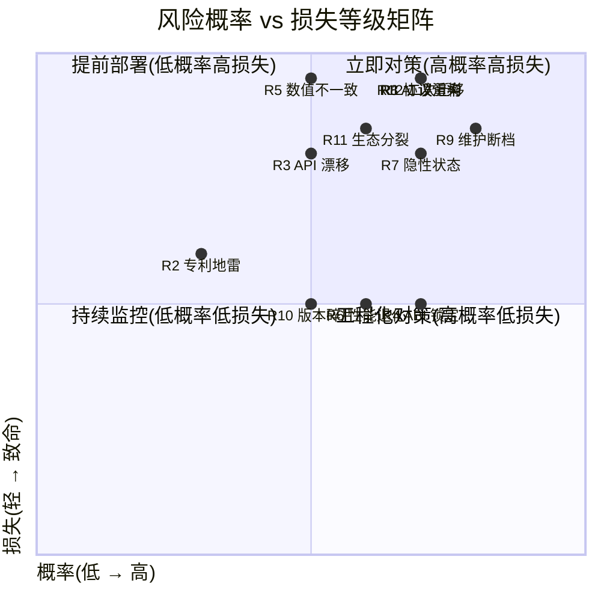

**优先级 P0（高概率 + 致命）**：R1 协议污染、R5 数值不一致、R7 隐性状态、R8 AI 误重构、R9 维护断档、R12 二次迁移
**优先级 P1（高概率 + 严重）**：R3 API 漂移、R11 生态分裂

> **关键决策**：P0 风险**必须在 W1-W4 内全部部署对策**，否则后续都是沙堆上盖楼。

---

## 三、HyAlgo Commons：人类公共财产层的设计

这是本文档**最具历史使命感**的一节。要回答 R12 风险（二次迁移），必须从根本上设计一个**与 hy-cad-tool 解耦、永久属于人类的算法层**。

### 3.1 HyAlgo Commons 的设计宣言

```
HyAlgo Commons 设计宣言

1. 算法层永久独立。HyAlgo Commons 是一个独立的 Git 仓库,
   有独立的 README,独立的 LICENSE(永久 BSD-3-Clause),
   独立的 CI,独立的发布周期。

2. 零 hy-cad-tool 依赖。HyAlgo Commons 不引用 hy-cad-tool
   任何代码、任何概念、任何配置;反之 hy-cad-tool 引用
   HyAlgo Commons 时只通过纯函数 API。

3. 任何人 1 小时内可独立运行。HyAlgo Commons 必须有
   "5 分钟编译 + 5 分钟跑通示例"的 Quick Start。

4. 永远不私有化。任何 hy-cad-tool 的商业化版本不允许
   包含"专属"HyAlgo Commons 改动。所有改动必须开源。

5. 跨语言绑定优先。HyAlgo Commons 的 C ABI 是事实标准,
   提供 C# / Python / Rust / Julia / TypeScript 绑定。

6. 文档即合同。每个算法函数必须有数学定义、
   引用文献(DOI)、复杂度、收敛保证、容差边界、
   失败案例。

7. 可审计。每个算法都有"独立可执行验证"——
   不依赖任何外部库,可单文件证明算法正确。

8. 50 年视角。每一项设计决策都要回答:
   "50 年后的工程师能否无负担地继续使用?"
```

### 3.2 HyAlgo Commons 的边界

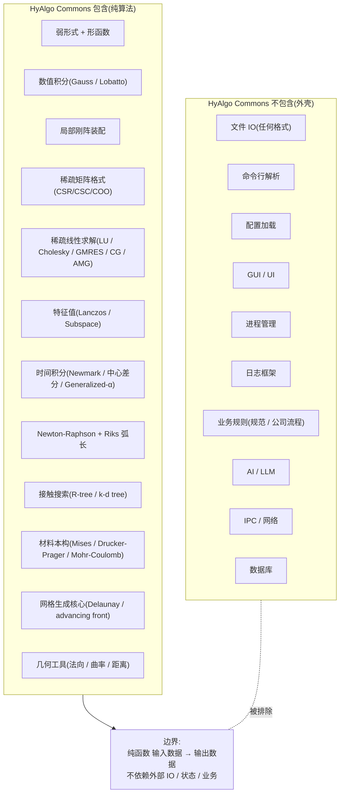

### 3.3 HyAlgo Commons 的物理结构

```
hy-algo-commons/                       # 独立 Git 仓库
├── LICENSE                            # BSD-3-Clause(永久不变)
├── README.md                          # 5 分钟 Quick Start
├── CITATION.cff                       # 学术引用
├── DESIGN.md                          # 设计宣言(本节)
├── core/                              # C ABI 主体(C99 + 少量 Fortran 备份)
│   ├── include/hyalgo/                # 公开头文件
│   │   ├── solver.h                   # 求解器 API
│   │   ├── element.h                  # 单元组装
│   │   ├── material.h                 # 材料本构
│   │   ├── mesh.h                     # 网格抽象
│   │   ├── integration.h              # 数值积分
│   │   ├── linalg.h                   # 线性代数
│   │   └── version.h                  # 版本宏
│   └── src/                           # 实现
├── bindings/                          # 多语言绑定
│   ├── csharp/                        # C# P/Invoke 包装
│   ├── python/                        # cffi / pybind11
│   ├── rust/                          # bindgen
│   ├── julia/                         # ccall
│   └── typescript/                    # WASM bridge
├── tests/                             # 金标准回归
│   ├── unit/                          # 单元测试
│   ├── verification/                  # NAFEMS / ABAQUS Benchmark / 解析解
│   └── numerical/                     # 数值稳定性
├── examples/                          # 独立可运行示例
│   ├── 01-cantilever-beam.c           # 100 行,5 分钟跑通
│   ├── 02-plate-bending.c
│   └── 99-large-scale-modal.c
├── docs/                              # 数学文档
│   ├── theory/                        # 每个算法的数学推导
│   ├── api/                           # Doxygen 风
│   └── tutorials/                     # 教程(中英双语)
├── third_party/                       # 极少且必要的依赖
│   ├── BLAS/                          # 系统 BLAS 接口
│   └── LAPACK/                        # 同
├── ci/                                # 持续集成
│   ├── build.yml                      # 多平台构建
│   ├── benchmark.yml                  # 性能回归
│   └── numerical-regression.yml       # 数值回归
└── governance/                        # 治理
    ├── CONTRIBUTING.md                # 贡献指南
    ├── GOVERNANCE.md                  # 决策流程
    ├── CODE_OF_CONDUCT.md
    └── ROADMAP.md                     # 50 年路线
```

### 3.4 HyAlgo Commons 的 API 风格（C ABI 永久稳定）

```c
#ifndef HYALGO_SOLVER_H
#define HYALGO_SOLVER_H

#include "version.h"
#include "linalg.h"

#ifdef __cplusplus
extern "C" {
#endif

typedef struct hyalgo_csr_matrix_s hyalgo_csr_matrix_t;

typedef enum {
    HYALGO_OK = 0,
    HYALGO_ERR_INVALID_INPUT = -1,
    HYALGO_ERR_NO_MEMORY = -2,
    HYALGO_ERR_NOT_CONVERGED = -3,
    HYALGO_ERR_SINGULAR_MATRIX = -4,
} hyalgo_status_t;

typedef struct {
    int max_iter;
    double tolerance;
    int restart;
} hyalgo_gmres_options_t;

hyalgo_status_t hyalgo_solve_linear_gmres(
    const hyalgo_csr_matrix_t* A,
    const double* b,
    double* x,
    int n,
    const hyalgo_gmres_options_t* opts,
    int* out_iterations,
    double* out_final_residual);

const char* hyalgo_version(void);
const char* hyalgo_git_commit(void);

#ifdef __cplusplus
}
#endif

#endif
```

| 设计点 | 价值 |
|--------|------|
| **C ABI** | 50 年稳定，任何语言可绑定 |
| **opaque struct** | 内部可改，外部不破坏 |
| **status code** | 不依赖异常机制 |
| **out 参数** | 不依赖 RAII，C 友好 |
| **options struct** | 扩展时不破坏 ABI |
| **`extern "C"`** | C++ 用户友好 |
| **版本函数** | 运行时可查 |

### 3.5 hy-cad-tool 与 HyAlgo Commons 的关系

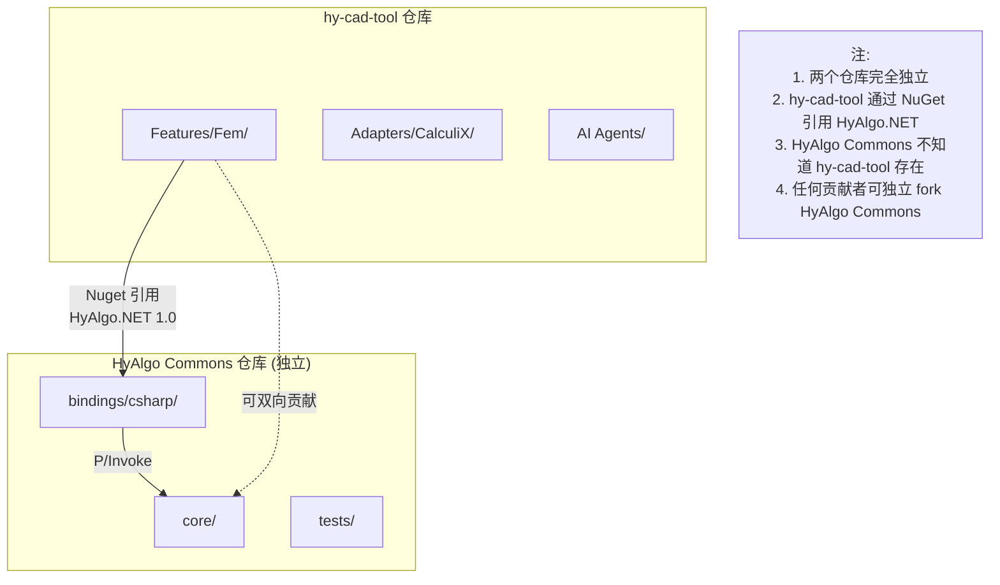

| 关系 | 规则 |
|------|------|
| **依赖方向** | hy-cad-tool → HyAlgo Commons（单向） |
| **依赖形式** | NuGet（C# 绑定） + 容器（C ABI 二进制） |
| **commit 关系** | 完全独立的 git 历史 |
| **issue tracker** | 独立 GitHub 仓库 |
| **协议** | hy-cad-tool 可以 MIT/商业；**HyAlgo Commons 永久 BSD-3-Clause** |
| **治理** | hy-cad-tool 公司决定；**HyAlgo Commons 走 Apache 风社区治理** |

### 3.6 HyAlgo Commons 的"50 年后测试"

> **可证伪检验**：在 hy-cad-tool 项目内部，**每年举办一次"50 年后测试"演习**：找一个**完全不熟悉 hy-cad-tool 的外部工程师**，给他 HyAlgo Commons 的 git 链接，要求：
>
> 1. **5 分钟内**：clone 仓库、读懂 README、理解项目目标
> 2. **30 分钟内**：CI 通过、所有测试通过
> 3. **1 小时内**：跑通 examples/01-cantilever-beam.c
> 4. **3 小时内**：实现自己的简单单元类型
> 5. **1 天内**：贡献一个 PR
>
> 任何一项失败 → HyAlgo Commons 设计有缺陷 → 立即修复

---

## 四、6 层解耦架构再细化

002 文档给出了 6 层架构，但层间边界不够清晰。本节细化每个边界的**契约形态**。

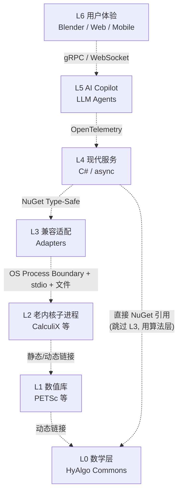

### 4.1 7 个边界的契约

| 边界 | 通信形式 | 契约形态 | 升级独立性 |
|------|----------|----------|-----------|
| **L6 ↔ L5** | gRPC / WebSocket / SSE | OpenAPI 3.1 + TypeScript 类型 | 独立 |
| **L5 ↔ L4** | C# 函数调用 | C# 接口 + OpenTelemetry trace | 独立 |
| **L4 ↔ L3** | C# NuGet | NuGet 包 + 强类型契约 | 独立 |
| **L3 ↔ L2** | OS 进程边界 + stdio + 文件 | `.inp` / Arrow IPC / HDF5 | 独立 |
| **L2 ↔ L1** | C/C++ 链接 | C ABI / Fortran ABI | 容器内绑定 |
| **L1 ↔ L0** | C/C++ 链接 | BLAS / LAPACK ABI | 系统库 |
| **L4 ↔ L0** | NuGet（HyAlgo.NET） | C# 绑定 → C ABI | 独立（关键！） |

### 4.2 关键的"L4 ↔ L0 旁路"——绕过 L2/L3 直接用算法层

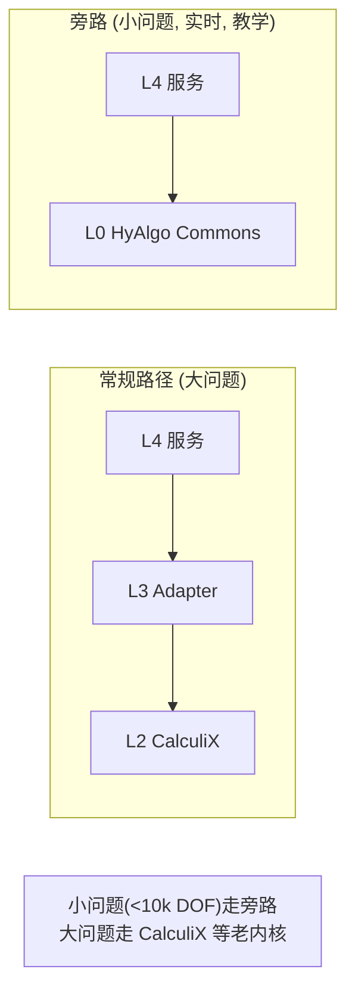

| 场景 | 选择 | 原因 |
|------|------|------|
| 挡土墙 v0.2 立壁 1D 梁（< 1k DOF） | **L4 → L0 旁路** | 启动开销低、纯托管、教学友好 |
| 挡土墙 v0.3 平面应变（< 10k DOF） | **L4 → L0 旁路** | 仍走旁路 |
| 大型水池 3D 实体（100k DOF） | **L4 → L3 → L2 (CalculiX)** | 性能、并行 |
| 桥梁非线性 + 接触（500k DOF） | **L4 → L3 → L2 (Code_Aster)** | 高级非线性 |
| 教学版浏览器（任意规模） | **L4 → L0**（WASM 编译 HyAlgo Commons） | 零安装 |

> **关键洞察**：**L0 (HyAlgo Commons) 不只是"备胎"，是 hy-cad-tool 大量场景的"主选"**。因为：
> 1. 教学版必走 L0（浏览器 WASM）
> 2. 小问题（< 10k DOF）走 L0 远比启子进程划算
> 3. 可微分场景（自动微分 + 梯度）走 L0
> 4. 实时交互（< 1 秒响应）走 L0
>
> 这意味着 **HyAlgo Commons 不是"可有可无的开源贡献"，而是 hy-cad-tool 自己也高频使用的核心**——这反过来保证了它的质量与活跃度。

### 4.3 边界违反的红线检测

任何代码评审必须检查**层间不准做的事情**：

| 反模式 | 违反层 | 后果 | CI 检查方法 |
|--------|--------|------|-------------|
| L0 引用 hy-cad-tool 任何概念 | L0 ↔ L4 | 违反"算法独立"宣言 | grep "hycad" in HyAlgo Commons → 阻断 |
| L0 包含文件 IO | L0 ↔ L3 | 算法不纯 | 静态分析禁止 fopen/fread |
| L3 Adapter 共享地址空间 | L3 ↔ L2 | GPL 污染 | lddtree 检查无 GPL .so |
| L4 直接打开老项目结果二进制 | L4 ↔ L2 | 跨层耦合 | grep ".frd" / ".odb" in L4 → 阻断 |
| L5 直接调用老项目 | L5 ↔ L2 | 跨多层 | AI Agent 必须经 L4 |
| L6 直接读 hyob 文件 | L6 ↔ L4 | 业务漏 UI | 强制走 OpenAPI |

---

## 五、"巧妙搬出"的 5 种工程手法

老项目里的算法不会自己跑出来。要"搬出"，有 5 种由轻到重的工程手法：

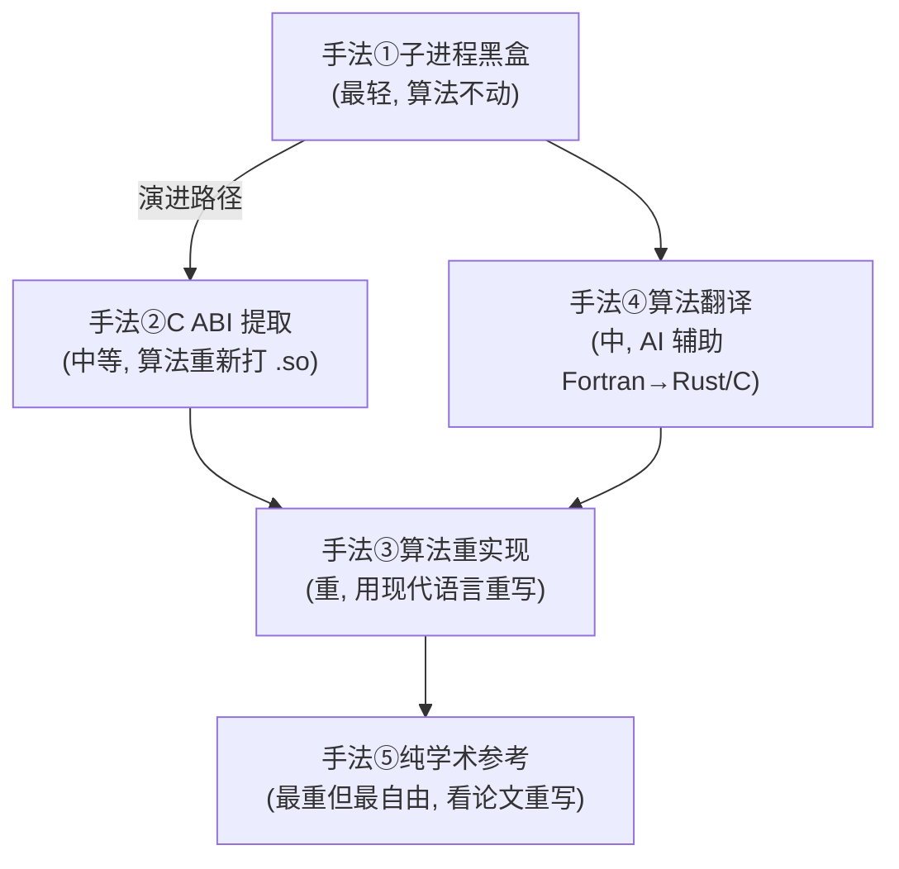

### 5.1 手法①：子进程黑盒

**做法**：完全不改老项目，只在外面做 Adapter。

| 维度 | 详情 |
|------|------|
| **典型对象** | CalculiX、Code_Aster、Gmsh、Elmer |
| **工作量** | 每个 4-8 周 |
| **算法保留** | 100%（一个字节都不改） |
| **优势** | 法律最干净、维护最低 |
| **劣势** | 性能 overhead、深度集成难 |
| **适用** | 大型求解器、网格生成 |

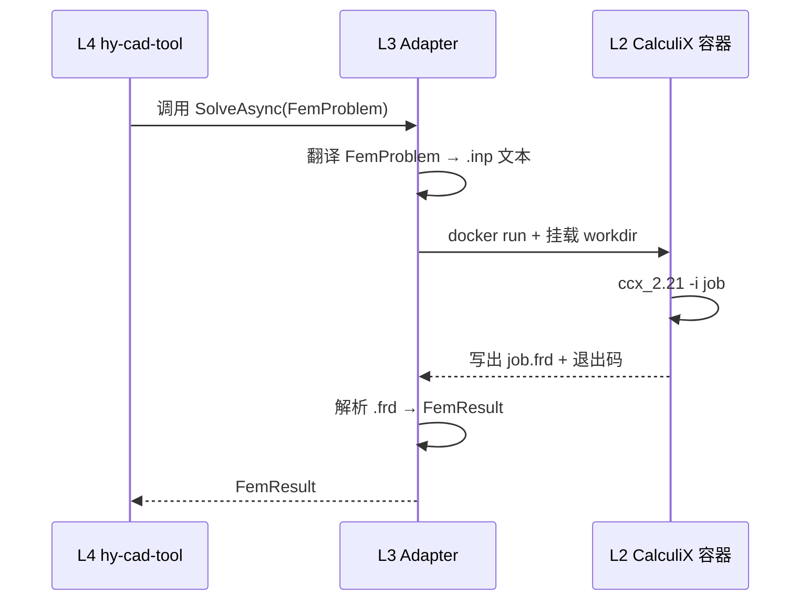

**关键设计**：

```csharp
public sealed class CalculiXSubprocessAdapter : ILegacyAdapter<FemProblem, FemResult>
{
    private readonly IContainerRuntime _containers;
    private readonly IInpWriter _writer;
    private readonly IFrdParser _parser;

    public async Task<Result<FemResult>> ExecuteAsync(
        FemProblem problem,
        AdapterContext context,
        CancellationToken ct)
    {
        await using var workDir = await _workDirManager.AllocateAsync(ct);
        await _writer.WriteAsync(problem, Path.Combine(workDir, "job.inp"), ct);

        await using var container = await _containers.LaunchAsync(new()
        {
            Image = "hycad/calculix:2.21",
            ReadOnlyRoot = true,
            ReadWriteMounts = [(workDir, "/work")],
            Network = NetworkMode.None,
            MemoryLimitMb = context.Budget.MemoryMb,
            CpuShares = context.Budget.CpuShares,
            TimeoutSeconds = context.Budget.TimeoutSeconds,
            Command = ["ccx_2.21", "-i", "/work/job"],
        }, ct);

        await foreach (var line in container.StreamStderrAsync(ct))
        {
            if (TryParseProgress(line, out var ev))
                _progressBus.Publish(ev);
        }

        var exit = await container.AwaitExitAsync(ct);
        if (exit.Code != 0)
            return Result.Fail<FemResult>(_diagnoser.Diagnose(workDir, exit));

        var frdPath = Path.Combine(workDir, "job.frd");
        if (!File.Exists(frdPath))
            return Result.Fail<FemResult>(new FrdMissingError(workDir));

        var result = await _parser.ParseAsync(frdPath, problem, ct);
        return Result.Ok(result);
    }
}
```

### 5.2 手法②：C ABI 提取

**做法**：把老项目编译成 `.so`/`.dll`，hy-cad-tool 通过 P/Invoke 调用。

| 维度 | 详情 |
|------|------|
| **典型对象** | MUMPS、HYPRE、PETSc、Eigen、MFEM 部分 |
| **工作量** | 每个 2-4 周（如果上游已有 C ABI） |
| **算法保留** | 100%（不改源码，只改构建） |
| **优势** | 性能高、无进程开销 |
| **劣势** | ABI 锁定、协议风险（LGPL 友好，GPL 危险） |
| **适用** | 数值库底座（L1）、纯算法函数 |

**关键挑战**：协议必须是 BSD/MIT/MPL/LGPL，**不能是 GPL**（GPL 的动态链接也可能传染）

```csharp
internal static partial class MumpsNative
{
    [LibraryImport("libmumps_double.so", EntryPoint = "dmumps_c")]
    internal static partial void DmumpsC(ref DmumpsStruct id);

    [StructLayout(LayoutKind.Sequential)]
    internal struct DmumpsStruct
    {
        public int Sym;
        public int Par;
        public int Job;
        public int Comm;
        public IntPtr A;
        public IntPtr Irn;
        public IntPtr Jcn;
    }
}
```

### 5.3 手法③：算法重实现

**做法**：用现代语言（C# / Rust / C++）重写老算法。

| 维度 | 详情 |
|------|------|
| **典型对象** | 简单单元（EulerBernoulliBeam2D / PlaneStrainQ4） |
| **工作量** | 每个 1-3 周 |
| **算法保留** | 数学保留 100%，实现 0% 借鉴 |
| **优势** | 完全自主、无任何法律风险、可放入 HyAlgo Commons |
| **劣势** | 工作量大、易引入新 bug |
| **适用** | 教学单元、HyAlgo Commons 主体、小问题快速路径 |

**关键纪律**：**只重写算法，不重写求解器架构**。求解器架构走 PETSc/MUMPS 桥接。

### 5.4 手法④：算法翻译（AI 辅助 Fortran → Rust/C）

**做法**：让 AI 把老 Fortran 代码翻译为现代语言。

| 维度 | 详情 |
|------|------|
| **典型对象** | LAPACK 老子程序、CalculiX 部分 Fortran 子程序 |
| **工作量** | 每千行 1-3 天（含验证） |
| **算法保留** | 数学 100%，实现 50% 借鉴 |
| **优势** | 比纯重实现快 |
| **劣势** | **AI 易出错（R8 风险）**，必须 1000+ 案例验证 |
| **适用** | 与原版位级别对齐的算法移植 |

**严格纪律**：

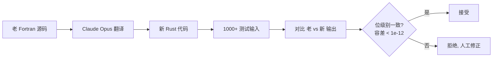

| 验证级别 | 容差 | 适用 |
|----------|------|------|
| 位级别一致 | < 1e-12 | 浮点直接比较 |
| 工程一致 | < 1e-6 相对 | 数值算法验证 |
| 工程接受 | < 1e-3 相对 | 替代实现 |
| 不可接受 | > 1e-3 | **必须人工介入** |

### 5.5 手法⑤：纯学术参考

**做法**：不看老项目源码，只看论文（甚至看老项目的论文引用），独立重写。

| 维度 | 详情 |
|------|------|
| **典型对象** | 高级单元（壳、连续壳、内聚力）、特殊本构 |
| **工作量** | 每个算法 4-12 周 |
| **算法保留** | 数学 100%，实现 0% |
| **优势** | **法律最自由**、**协议最干净**、可专利绕开 |
| **劣势** | 工作量最大、可能漏掉工程细节 |
| **适用** | 想完全规避协议的关键算法 |

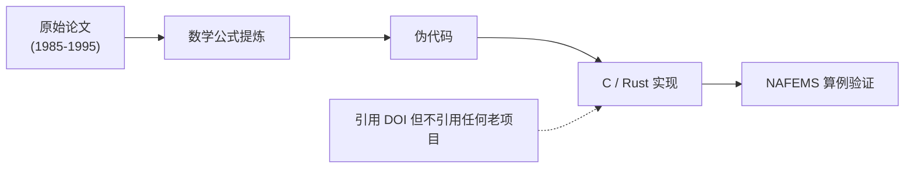

### 5.6 5 种手法的应用矩阵

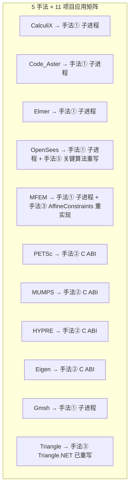

| 老项目 | 主推手法 | 协议 | 进入 HyAlgo Commons? |
|--------|---------|------|---------------------|
| CalculiX | ① 子进程 | GPL | ✗（在 L2，非 L0） |
| Code_Aster | ① 子进程 | GPL | ✗ |
| Elmer | ① 子进程 | LGPL | ✗ |
| OpenSees | ① 子进程 + ⑤ 重写 | BSD-modified | 部分（关键算法） |
| MFEM | ① 子进程 + ③ 重实现 | BSD-3 | 部分 |
| PETSc | ② C ABI | BSD-2 | ✓（绑定层） |
| MUMPS | ② C ABI | CeCILL（LGPL like） | ✓（绑定层） |
| HYPRE | ② C ABI | LGPL | ✓（绑定层） |
| Eigen | ② C ABI | MPL-2.0 | ✓（绑定层） |
| Gmsh | ① 子进程 | GPL-2 + 例外 | ✗ |
| Triangle | ③ 重写完成 | LGPL | ✓ |

> **关键设计**：**HyAlgo Commons 只接收 BSD/MIT/MPL/LGPL 的算法**，**绝不混入 GPL**。GPL 的算法（CalculiX/Code_Aster/Gmsh）只能通过 L2 子进程使用，绝不进入 L0。

---

## 六、每种手法的风险与对策

针对 5 种"搬出"手法，逐项列出风险与对策：

### 6.1 手法①子进程黑盒的风险

| 风险 | 触发场景 | 对策 |
|------|----------|------|
| 启动开销高 | 短任务（< 5 秒）频繁调用 | **长连子进程**（Adapter 持有持久子进程，按需 reset） + 选 L0 旁路 |
| 文件 IO 慢 | 大结果文件 | Arrow IPC + HDF5 替代 ASCII |
| 容器拉取慢 | 第一次安装 | 预拉取 + 本地镜像仓库 |
| 进程崩溃无日志 | Bug 难定位 | 自动收集 core dump + .msg + .sta 给 AI Doctor |
| 跨平台路径 | Windows 反斜杠 | 容器内统一 POSIX 路径 |
| 信号传递 | 不能 Ctrl+C | docker stop --signal SIGTERM + 超时 SIGKILL |

### 6.2 手法②C ABI 的风险

| 风险 | 触发场景 | 对策 |
|------|----------|------|
| ABI 版本不匹配 | gcc/glibc 升级 | 锁定 base image + 静态链接（如 musl） |
| 内存管理混乱 | C 分配 / C# 释放 | 严格契约：谁分配谁释放 |
| 浮点状态污染 | x87 控制字 | 调用前后保存 / 恢复 |
| 全局变量并发 | 多线程调用 | 加锁 + 文档警示 |
| 异常跨边界 | C++ 抛异常给 C# | extern "C" 内不允许异常逃出 |
| 信号挂起 | SIGFPE / SIGSEGV | 隔离子线程 + Watchdog |

### 6.3 手法③重实现的风险

| 风险 | 触发场景 | 对策 |
|------|----------|------|
| 引入新 bug | 重写过程难免错 | 与原版平行跑 + NAFEMS 100+ 算例 |
| 工程细节漏 | "看起来一样实际不同" | 老项目作者请教（如果还能联系） |
| 性能不及原版 | 老项目 30 年优化 | 性能 CI；不是所有算法都需要 SOTA 性能 |
| 维护负担 | 自家代码自家修 | 单元测试覆盖率 > 90% |

### 6.4 手法④AI 翻译的风险

| 风险 | 触发场景 | 对策 |
|------|----------|------|
| **算法位移** | LLM 把 0.5 写成 5.0 | 1000+ 测试 + 位级别对比（容差 1e-12） |
| 隐式状态丢失 | Fortran COMMON 块没翻译 | 手工识别 + 显式参数化 |
| 分支语义错 | GO TO 翻译错 | 严格不允许 GO TO 直翻，必须先重构为结构化 |
| 整数溢出 | INT 翻译成 int 不是 long | 大型问题用 int64 |
| 数组下标 | Fortran 1-based 翻译错 | 转换层显式处理 |

### 6.5 手法⑤纯学术参考的风险

| 风险 | 触发场景 | 对策 |
|------|----------|------|
| 工作量超预期 | 1 个算法 4 个月 | 排好优先级，只重写核心算法 |
| 论文细节缺 | 经典论文不写工程细节 | 同时读 2-3 个相同主题论文 |
| 数值技巧丢 | 老项目里的"trick" | 留意老项目源码注释（不抄代码） |

---

## 七、对 11 个核心老项目的"分级搬运计划"

### 7.1 三档搬运策略

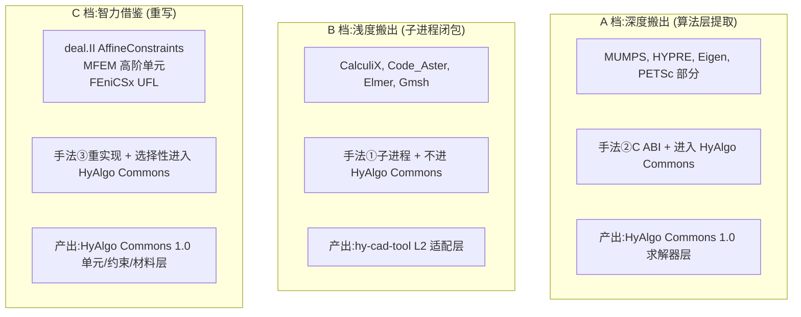

### 7.2 详细搬运计划表

| 老项目 | 档 | 手法 | 时间 | HyAlgo Commons 贡献 | hy-cad-tool 价值 |
|--------|:--:|------|------|---------------------|-----------------|
| **MUMPS** | A | 手法② | W1-2 | 直接法 GMRES 接口 | 100k DOF 求解 |
| **HYPRE BoomerAMG** | A | 手法② | W3-4 | 迭代法 + AMG | 1M+ DOF 求解 |
| **Eigen** | A | 手法② | W5 | 局部矩阵运算 | 单元装配 |
| **CalculiX** | B | 手法① | W6-9 | 不贡献（GPL 隔离） | 主求解器 |
| **Gmsh** | B | 手法① | W10-11 | 不贡献（GPL 隔离） | 3D 网格 |
| **Code_Aster** | B | 手法① | W12-15 | 不贡献（GPL 隔离） | 高级非线性 |
| **Elmer** | B | 手法① | W16-17 | 不贡献（LGPL 隔离） | 多物理 |
| **deal.II AffineConstraints** | C | 手法③ + ⑤ | W18-21 | 约束求解器 | 主从约束 |
| **MFEM 高阶单元** | C | 手法③ | W22-25 | 高阶基函数 | 高精度 |
| **FEniCSx UFL** | C | 手法⑤ | W26-29 | 弱形式 DSL | 未来扩展 |
| **OpenSees Domain** | C | 手法⑤ | W30-33 | Domain/Analysis 七件套抽象 | 已在 00 文档借鉴 |
| **PETSc** | A | 手法② | W34-37 | 大规模并行 | 远期 1M+ DOF |
| **Triangle** | C | 已完成 | — | Triangle.NET 已重写 | 2D 网格 |

### 7.3 一年的"搬运"总产出

| 产出 | 由谁拥有 | 协议 |
|------|----------|------|
| **HyAlgo Commons 1.0**：求解器 + 单元 + 约束 + 材料 + 网格的纯 C 算法层 + C# 绑定 | **全人类**（独立 Git 仓库） | BSD-3-Clause |
| **hy-cad-tool L3 Adapters**：CalculiX / Gmsh / Code_Aster / Elmer 子进程适配 | hy-cad-tool | MIT 或商业 |
| **OCI Image 矩阵**：5+ 个标准化容器 | hy-cad-tool 维护 | 各自原协议 |
| **NAFEMS / ABAQUS Benchmark 回归库** | **全人类** | CC0 / 公共领域 |
| **30 年 FEA 手册中文 RAG 索引** | hy-cad-tool 商业资产 | 商业 |

---

## 八、协议法务深度策略

### 8.1 协议族决策树

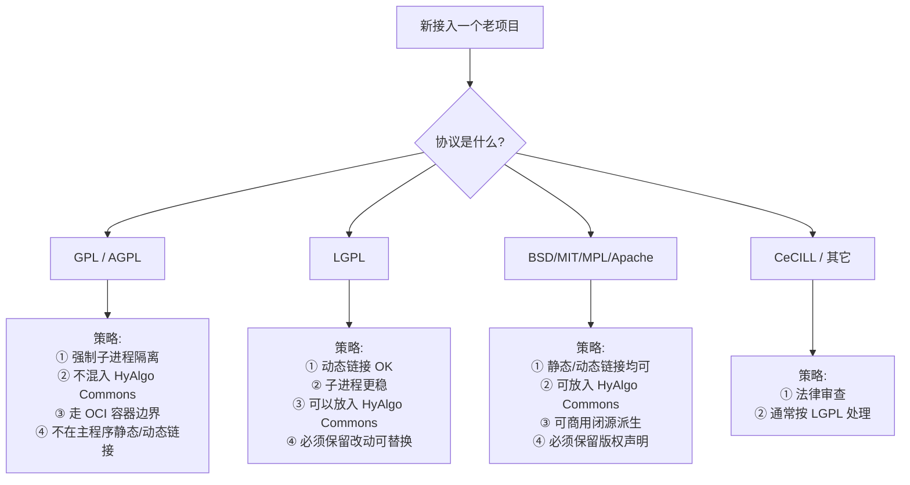

### 8.2 协议矩阵详细说明

| 协议族 | 允许 | 禁止 | hy-cad-tool 应对 |
|--------|------|------|------------------|
| **BSD-3-Clause / MIT** | 任意分发、修改、商用闭源 | 去除版权声明 | 直接用、可放 HyAlgo Commons |
| **MPL-2.0** | 任意分发、与闭源混合 | 修改 MPL 文件本身闭源 | 文件级隔离即可 |
| **Apache-2.0** | 任意分发、商用 | 去除版权 / 专利反诉 | 直接用 |
| **LGPL-2.1/3.0** | 动态链接到闭源 | 静态链接到闭源 | 动态链接 + 替换权 |
| **CeCILL-C**（MUMPS） | 类似 LGPL | 静态链接传染 | 动态链接处理 |
| **GPL-2.0/3.0** | 整个程序开源 GPL | 链接到闭源 | **强制子进程边界** |
| **AGPL** | 网络服务也要开源 | 任何形式闭源 | **避免使用** |

### 8.3 每个老项目的协议处置

| 项目 | 协议 | hy-cad-tool 处置 |
|------|------|------------------|
| MUMPS | CeCILL-C | 子进程 OR 动态链接（OS 提供） |
| HYPRE | LGPL | 动态链接（运行时加载） |
| Eigen | MPL-2.0 | 静态链接，文件级保留 MPL |
| PETSc | BSD-2 | 完全自由 |
| Trilinos | BSD-3 | 完全自由 |
| CalculiX | GPL-2.0 | **强制子进程 + 容器** |
| Code_Aster | GPL-2.0 | 同上 |
| Elmer | LGPL-2.1 | 子进程为主 |
| Gmsh | GPL-2.0 + 例外 | 子进程 |
| OpenSees | BSD-modified | 自由 |
| MFEM | BSD-3 | 自由 |
| deal.II | LGPL-2.1+ | 子进程或 动态链接 |
| FEniCSx | LGPL-3 | 子进程 |
| Triangle | LGPL（再发行） | 已 Triangle.NET 重写 |
| VTK | BSD-3 | 自由 |
| ParaView | BSD-3 | 子进程 |

### 8.4 法务红线 CI 检查

```yaml
- name: License Audit
  uses: hy-cad-tool/license-audit@v1
  with:
    forbidden:
      - GPL-2.0
      - GPL-3.0
      - AGPL-3.0
    allowed-with-process-boundary:
      - GPL-2.0
      - GPL-3.0
    main-binary: src/HyCADTool/bin/Release/HyCADTool.dll
    fail-on-violation: true
```

---

## 九、维护断档的灾难恢复方案

R9 风险（CalculiX 单作者退休）必须有兜底方案。

### 9.1 三层冗余战略

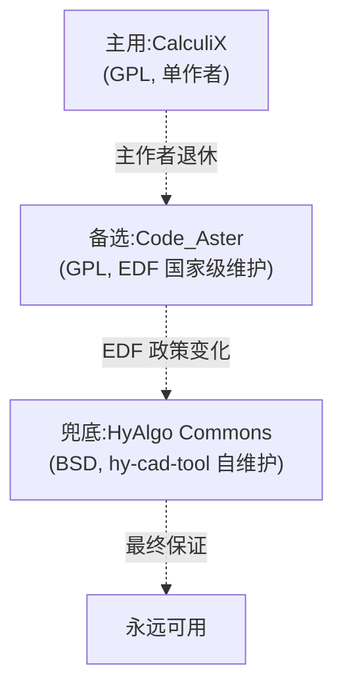

| 层级 | 覆盖能力 | 触发条件 |
|------|----------|----------|
| 主用 CalculiX | 95% 工程需求 | 默认 |
| 备选 Code_Aster | 90%（含高级非线性） | CalculiX 失效 |
| 兜底 HyAlgo Commons | 60%（基本静力 + 模态） | 上述都不可用 |

### 9.2 自养 fork 的纪律

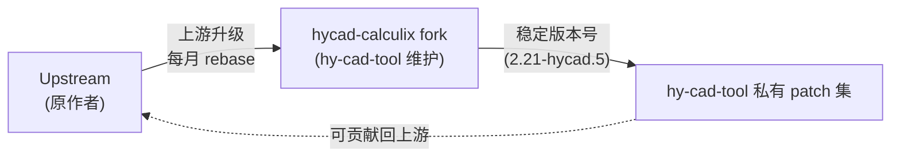

| 治理规则 | 详情 |
|----------|------|
| **fork 命名** | `hycad-<原项目>` |
| **版本号** | `<上游版本>-hycad.<迭代>` |
| **必须可 rebase** | 任何 hy-cad-tool 改动都是 patch 形式 |
| **季度健康检查** | rebase 演练 + bug 反贡献 |
| **关键修复** | 24 小时内反贡献回上游 |
| **如上游死亡** | 自养版成为新主线 + 公开声明 |

---

## 十、版本管理与回归保障体系

### 10.1 多版本兼容矩阵

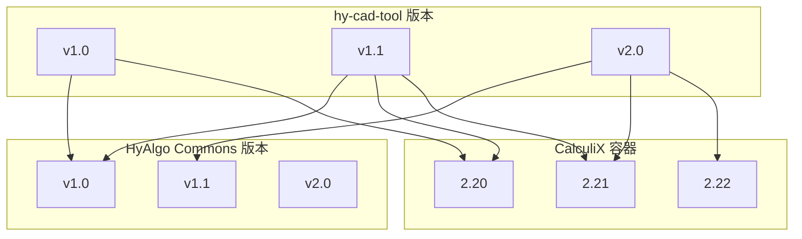

| 兼容规则 | 详情 |
|----------|------|
| **HyAlgo Commons 主版本号 = ABI 兼容性** | 1.x 内 ABI 不破坏 |
| **CalculiX 容器主版本** | 用户可选，hy-cad-tool 多版本兼容 |
| **hy-cad-tool 项目文件版本号** | 嵌入 hyob，跨版本可读 |

### 10.2 数值回归金标准库

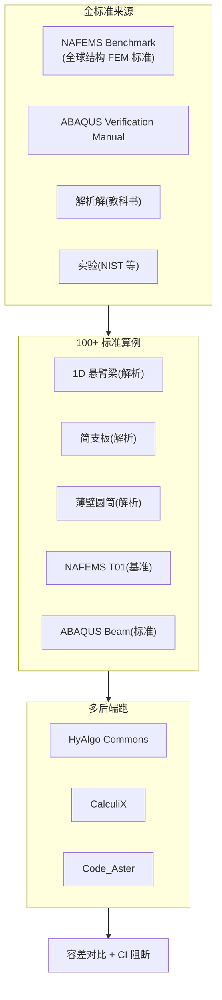

```yaml
- name: nafems-le1-cantilever
  description: "悬臂梁端部荷载, 弯曲应力"
  hyob: tests/golden/nafems-le1.hyob
  expected:
    sigma_max:
      analytical: 60.0
      tolerance: 1e-3
    deflection_tip:
      analytical: 0.001
      tolerance: 1e-4
  backends:
    - hyalgo-commons
    - calculix
    - code-aster
  fail-if-any-backend-deviates: true
```

> **关键纪律**：金标准库**与算法层一同进入 HyAlgo Commons**，是公共财产；任何人 fork HyAlgo Commons 都能跑同样的回归。

---

## 十一、可观测性 + 数值校验：让"搬出"过程可证伪

### 11.1 三层可观测性

```mermaid
graph TB
    subgraph trace ["分布式追踪 (OpenTelemetry)"]
        T1["L4 → L3 → L2 → L0 全链路 trace"]
    end
    subgraph metric ["指标 (Prometheus)"]
        M1["每个 backend 调用 P50/P95/P99"]
        M2["收敛迭代次数分布"]
        M3["各算法 throughput"]
    end
    subgraph log ["日志 (Loki)"]
        L1["结构化日志, 任意维度查询"]
    end
    subgraph eval ["数值校验 (CI + 灰度)"]
        E1["每次发布跑 NAFEMS 全集"]
        E2["A/B 双跑 100+ 真实项目"]
        E3["差异 > 容差 → 阻断发布"]
    end
```

### 11.2 数值校验的"三阶门禁"

| 门禁 | 触发 | 容差 | 阻断? |
|------|------|------|-------|
| **CI 单元测试** | 每个 PR | 1e-12 | ✓ |
| **CI 集成回归** | 每个 PR | 1e-6 | ✓ |
| **每周灰度 A/B** | 自动 | 1e-3 | 警告 |
| **季度真实项目对比** | 手动 | 工程接受 | 报告 |

### 11.3 算法可证伪：每个算法都有"独立验证脚本"

```c
#include <hyalgo/solver.h>
#include <stdio.h>
#include <math.h>

int main(void) {
    int rows[] = {0, 2, 5, 7};
    int cols[] = {0, 1, 0, 1, 2, 1, 2};
    double vals[] = {2.0, -1.0, -1.0, 2.0, -1.0, -1.0, 2.0};
    double b[] = {1.0, 0.0, 1.0};
    double x[3] = {0};

    hyalgo_csr_matrix_t* A = hyalgo_csr_create(3, 3, rows, cols, vals);

    hyalgo_gmres_options_t opts = {
        .max_iter = 100,
        .tolerance = 1e-10,
        .restart = 30,
    };

    int iter;
    double res;
    hyalgo_status_t s = hyalgo_solve_linear_gmres(A, b, x, 3, &opts, &iter, &res);

    if (s != HYALGO_OK) return 1;

    double expected[] = {1.0, 1.0, 1.0};
    for (int i = 0; i < 3; ++i) {
        if (fabs(x[i] - expected[i]) > 1e-10) {
            printf("FAIL: x[%d]=%g != %g\n", i, x[i], expected[i]);
            return 1;
        }
    }
    printf("PASS\n");
    return 0;
}
```

> **关键纪律**：每个算法都必须有这样一个**独立可执行验证**，不依赖任何外部库（除了 stdc + HyAlgo Commons 自身），证明算法正确。**这是 50 年后的工程师重新理解算法的"罗塞塔石碑"**。

---

## 十二、12 项 P0 立即可执行动作

把 003 的设计落地到具体动作（细化 002 的 12 项 + 新增）：

| # | 动作 | 优先级 | 工作量 | 验收标准 |
|---|------|:------:|--------|----------|
| **1** | 创建 **HyAlgo Commons 独立仓库**（hy-algo-commons） + 永久 BSD-3-Clause | **P0** | 2 天 | git push 完成 + LICENSE 永久承诺 |
| **2** | 起草 **HyAlgo Commons C ABI 头文件**（solver.h / element.h / mesh.h） | **P0** | 1 周 | 头文件 freeze + 50 年 ABI 承诺 |
| **3** | 起草 **6 层边界违反 CI 检查**（grep / lddtree / 静态分析） | **P0** | 3 天 | CI 阻断违反 |
| **4** | 起草 **License Audit CI**（禁止 GPL 静态/动态链接） | **P0** | 3 天 | CI 阻断违反 |
| **5** | 起草 **NAFEMS 100+ 算例金标准库**（公共领域 CC0） | **P0** | 2 周 | 100 算例 + 多后端验证 |
| **6** | 起草 **CalculiX OCI Image** + **CalculiXSubprocessAdapter** | **P0** | 2 周 | hello-world 算例端到端 |
| **7** | 起草 **隐性状态防御**（每次新进程或显式 reset） | **P0** | 1 周 | 测试用例：先算 A 再算 B vs 只算 B 一致 |
| **8** | 起草 **AI 翻译纪律**（位级别对比 + 1000 测试 + 拒绝阈值） | **P0** | 1 周 | AI 翻译流程文档 + CI |
| **9** | 起草 **多内核冗余配置**（CalculiX + Code_Aster + HyAlgo Commons） | **P0** | 1.5 周 | Adapter Resolver 自动 fallback |
| **10** | 起草 **hycad-calculix fork** + 上游 rebase 演练 | **P1** | 1 周 | fork 仓库 + 月度 rebase |
| **11** | 起草 **Arrow IPC + HDF5 数据契约** | **P1** | 2 周 | 100 万节点结果 < 5 秒往返 |
| **12** | 起草 **"50 年后测试"演习计划**（每年一次） | **P1** | 1 周 | 第一次演习日期定 + 标准化流程 |

### 12.1 P0 动作的依赖图

```mermaid
graph LR
    A1["①HyAlgo Commons 仓库"]
    A2["②C ABI 头文件"]
    A3["③6 层 CI"]
    A4["④License CI"]
    A5["⑤NAFEMS 金标准"]
    A6["⑥CalculiX Adapter"]
    A7["⑦隐性状态"]
    A8["⑧AI 翻译纪律"]
    A9["⑨多内核冗余"]

    A1 --> A2
    A2 --> A5
    A2 --> A9
    A4 --> A6
    A3 --> A6
    A6 --> A7
    A6 --> A9
    A5 --> A9
    A8 -.独立.-> A8
```

### 12.2 P0 完成后的状态

完成 9 项 P0 动作后（约 4-5 周），hy-cad-tool 达到：

| 状态 | 描述 |
|------|------|
| **HyAlgo Commons 1.0-rc** | 独立仓库 + C ABI + NAFEMS 金标准 + 第一波算法 |
| **CalculiX 安全集成** | 容器隔离 + License audit 通过 + 隐性状态防御 |
| **6 层边界守护** | CI 强制 + 任何边界违反阻断 |
| **多内核冗余** | CalculiX 失效自动 fallback Code_Aster |
| **AI 安全护栏** | 翻译纪律明确 + 拒绝阈值清晰 |
| **可证伪验证** | 每个算法独立验证脚本 + NAFEMS 金标准 |

> **关键洞察**：这 4-5 周的"地基工作"看似不出工程功能，但**每一项都消除了一个致命风险**。**不做这些直接做挡土墙 v0.1，5 年后会被踩中其中一个雷**。

---

## 十三、5 年的"算法层 vs 外壳层"边界守护

### 13.1 边界腐蚀的 4 种典型场景

每天都在发生的"边界腐蚀"——必须警觉：

| 场景 | 腐蚀方向 | 危害 | 守护手段 |
|------|---------|------|----------|
| "算法层加个 log 方便调试" | L0 → L4 | 算法不再纯净 | CI grep 禁止 fprintf in HyAlgo Commons |
| "外壳层直接读 .frd 文件方便点" | L4 → L2 | 跨多层耦合 | CI 禁止 .frd 字面量 in L4 |
| "AI Agent 直接调 CalculiX 子进程" | L5 → L2 | 跳过 L4 服务层 | CI 禁止 docker.exec in L5 |
| "Adapter 引入 hyob 概念为了快" | L3 → L4 | 反向依赖 | CI 禁止 import hyob in L3 |

### 13.2 季度"边界审计"清单

```mermaid
graph TB
    Q1["Q1 边界审计"]
    A1["代码审计:<br/>L0 是否引用 L4+?"]
    A2["依赖审计:<br/>NuGet/Cargo 树有没有反向?"]
    A3["IPC 审计:<br/>L3-L2 之间是否纯文件契约?"]
    A4["License 审计:<br/>有没有 GPL 渗入?"]
    A5["50 年后测试:<br/>外部工程师 1 小时能跑通 HyAlgo Commons?"]

    Q1 --> A1 & A2 & A3 & A4 & A5
    A1 & A2 & A3 & A4 & A5 --> Report["审计报告"]
    Report --> Fix["发现违反立即修复"]
```

### 13.3 5 年的边界演化预期

```mermaid
gantt
    title 5 年算法层 vs 外壳层边界守护
    dateFormat YYYY-MM-DD
    axisFormat %Y-Q%q

    section 2026
    边界设计 + CI 守护                    :2026-06-01, 60d
    HyAlgo Commons 1.0 发布              :2026-12-01, 30d

    section 2027
    第一次 50 年后测试                    :2027-06-01, 7d
    HyAlgo Commons 1.1 (含约束/材料)     :2027-12-01, 30d

    section 2028
    HyAlgo Commons 2.0 (高阶单元)        :2028-06-01, 30d
    边界审计季报常态化                    :2028-01-01, 365d

    section 2029
    HyAlgo Commons 3.0 (可微分)          :2029-06-01, 30d

    section 2030
    HyAlgo Commons 成为社区项目           :2030-06-01, 90d
    hy-cad-tool 不再是唯一发行版          :2030-12-01, 30d
```

> **5 年后的目标**：HyAlgo Commons 已是一个**独立社区项目**——可能有 2-3 个发行版（hy-cad-tool 是其中之一），多家高校在贡献，多家公司在使用。**hy-cad-tool 完成了"FEA 公共基础设施缔造者"的历史使命**。

---

## 十四、致 50 年后：让公共财产真正公共

写到此处，必须直面一个问题：**50 年后的工程师会怎么看 hy-cad-tool？**

```mermaid
graph TB
    subgraph good ["50 年后的 期待场景"]
        G1["HyAlgo Commons 已成 FEA 领域 BLAS<br/>(像 LAPACK 一样不可或缺)"]
        G2["10+ 主控发行版基于 HyAlgo Commons<br/>(中国/欧洲/美国/印度/巴西)"]
        G3["50 年前的 hy-cad-tool 是一个温暖的故事<br/>(它捐出了 HyAlgo Commons)"]
    end
    subgraph bad ["50 年后的 失败场景"]
        B1["HyAlgo Commons 已死<br/>(因为 hy-cad-tool 私有化或 hy-cad-tool 倒闭)"]
        B2["新一代工程师再次拆分老项目<br/>(这次拆 hy-cad-tool)"]
        B3["历史重复:<br/>没有人愿意再做'白送'的事"]
    end
    Now["2026 年的设计决定<br/>决定 50 年后的世界"]
    Now --> good
    Now --> bad
```

### 14.1 让公共财产真正公共的 6 条铁律

这 6 条铁律必须刻在 HyAlgo Commons 的 GOVERNANCE.md 上：

| # | 铁律 | 不可违反的承诺 |
|---|------|---------------|
| 1 | **协议永久 BSD-3-Clause** | 任何人可任意复制、修改、商用、闭源派生 |
| 2 | **永远独立仓库** | 不与任何发行版（包括 hy-cad-tool）合并 |
| 3 | **C ABI 永远稳定** | 主版本号内永不破坏 ABI |
| 4 | **任何人可贡献** | 治理走 Apache 风社区 |
| 5 | **任何人可分叉** | 不阻挠竞争发行版 |
| 6 | **文档与代码同等公开** | 数学、复杂度、引用文献全部公开 |

### 14.2 hy-cad-tool 的"自我克制"承诺

为了让 HyAlgo Commons 真正属于全人类，**hy-cad-tool 必须主动承诺以下"克制"**：

| 克制 | 内容 |
|------|------|
| **不私藏改进** | hy-cad-tool 的任何 HyAlgo Commons 改进必须开源 |
| **不专属优化** | hy-cad-tool 不允许"hy-cad-tool 专属性能优化版" |
| **不锁定接口** | HyAlgo Commons 接口设计必须考虑非 hy-cad-tool 使用者 |
| **不抢治理** | hy-cad-tool 在 HyAlgo Commons 治理中只是普通成员 |
| **不强迫使用** | 鼓励竞争发行版基于 HyAlgo Commons |
| **不用商业绑架** | hy-cad-tool 商业版权不延伸到 HyAlgo Commons |

### 14.3 致后人的一封信（应放入 HyAlgo Commons 的 README）

```markdown
# To Future Engineers

If you are reading this in 2076,

We are the engineers of 2026. We faced a choice:

Option A: Build hy-cad-tool as a closed system,
  bundle the algorithms, profit from the lock-in,
  and let our descendants extract them again
  in 30 years.

Option B: Build hy-cad-tool with hands-off algorithms,
  donate them to humanity as HyAlgo Commons,
  and trust that the next generation will
  inherit a platform, not a prison.

We chose Option B.

If HyAlgo Commons is still alive in 2076 — well,
  hopefully you don't need to thank us. You can just
  build on it, contribute back, and pass it on.

If HyAlgo Commons has died — please understand:
  we tried. The 6 iron laws were our best attempt
  to make it indestructible. If circumstances killed
  it anyway, please fork the last version and
  start fresh. The math is eternal; the code is
  just paper around it.

— The hy-cad-tool team, 2026
```

---

## 十五、本文档与系列的关系

```mermaid
graph TB
    D00["00 总纲<br/>(决策树 + 18月路线)"]
    D001["001 第一性原则重审<br/>(为什么要做主控发行版)"]
    D002["002 现代架构 + AI 整合<br/>(怎么整合 6 层架构 + AI 杠杆)"]
    D003["003 本文档<br/>(怎么搬 + 怎么解耦 + 怎么留给后人)"]
    Code["src/HyCADTool/Features/Fem/"]
    Commons["hy-algo-commons/<br/>(独立仓库)"]

    D00 --> D001 --> D002 --> D003
    D003 --> Code
    D003 --> Commons
```

| 文档 | 回答问题 | 关键产出 |
|------|---------|----------|
| 00 | 18 个月做什么 | 决策树 |
| 001 | 为什么基于开源 | 6 层资产解剖 |
| 002 | 怎么整合（架构） | 6 层 + AI 5 杠杆 |
| **003** | **怎么搬 + 怎么解耦 + 怎么留给后人** | **HyAlgo Commons + 12 风险对策 + 5 手法矩阵** |

**003 是最关键的一篇**——前三篇都是"做什么"和"为什么"，**003 是"做的过程中的工程纪律"**。任何一个 P0 动作没做，5 年后 hy-cad-tool 都会变成另一个 PKPM/SCIA/3D3S——算法被绑架在外壳里，留给后人又一座骨折的金山。

---

## 修订记录

| 日期 | 修订人 | 说明 |
|------|--------|------|
| 2026-05-15 | — | 初版：第一性原则下的 4 大终极目标；12 大风险全景图与对策；HyAlgo Commons 公共财产层设计与 6 条铁律；6 层解耦架构 + 7 边界契约 + L4-L0 旁路；5 种"巧妙搬出"工程手法（子进程黑盒 / C ABI 提取 / 算法重实现 / AI 翻译 / 纯学术参考）；11 个核心老项目分级搬运计划；协议法务深度策略；维护断档三层冗余 + 自养 fork；版本管理与数值回归金标准；可观测性 + 三阶门禁 + 算法独立验证；12 项 P0 立即动作；5 年边界守护演化；致 50 年后的 6 条铁律 + 自我克制承诺 + 致后人信 |

---

## 附录 A：术语速查表（hy-cad-tool / HyAlgo Commons / 老项目）

| 术语 | 定义 | 所在层 |
|------|------|--------|
| **HyAlgo Commons** | 独立 Git 仓库，永久 BSD-3-Clause 算法层 | L0 |
| **HyAlgo.NET** | HyAlgo Commons 的 C# NuGet 绑定 | L0 ↔ L4 桥 |
| **OCI Image 矩阵** | 标准化老项目容器集 | L2 |
| **Adapter** | hy-cad-tool 适配老项目的进程边界封装 | L3 |
| **L4-L0 旁路** | 不走子进程，直接用 HyAlgo Commons | L4 ↔ L0 |
| **金标准库** | NAFEMS / 解析 / 经验值的回归集 | 跨层 |
| **50 年后测试** | 验证 HyAlgo Commons 独立性的演习 | 治理 |
| **6 条铁律** | HyAlgo Commons 永久开放的不可违反承诺 | 治理 |
| **自养 fork** | hy-cad-tool 维护的老项目分支（hycad-calculix） | L2 |

## 附录 B：风险快查（按损失等级）

| 风险编号 | 名称 | 损失 | 概率 | 优先级 |
|---------|------|:----:|:----:|:------:|
| R1 | 协议污染 | ★★★★★ | 高 | P0 |
| R5 | 数值不一致 | ★★★★★ | 中 | P0 |
| R8 | AI 误重构 | ★★★★★ | 高 | P0 |
| R12 | 二次迁移 | ★★★★★ | 高 | P0 |
| R3 | API 漂移 | ★★★★ | 中 | P1 |
| R7 | 隐性状态 | ★★★★ | 高 | P0 |
| R9 | 维护断档 | ★★★★ | 高 | P0 |
| R11 | 生态分裂 | ★★★★ | 高 | P1 |
| R2 | 专利地雷 | ★★★ | 低 | P2 |
| R4 | ABI 锁定 | ★★★ | 高 | P1 |
| R6 | 性能退化 | ★★★ | 中 | P2 |
| R10 | 版本碎片 | ★★★ | 中 | P2 |

## 附录 C：5 种"搬出"手法快查

| 手法 | 算法保留 | 工作量 | 协议风险 | 进 HyAlgo Commons? |
|------|:-------:|:------:|:--------:|:------------------:|
| ① 子进程黑盒 | 100% | 4-8 周/项目 | 低（边界隔离） | ✗ |
| ② C ABI 提取 | 100% | 2-4 周/项目 | 中（看协议） | ✓（限 BSD/MIT/MPL/LGPL） |
| ③ 算法重实现 | 数学 100% / 实现 0% | 1-3 周/算法 | 无 | ✓ |
| ④ AI 翻译 | 数学 100% / 实现 50% | 1 周/千行 | 看原协议 | 看原协议 |
| ⑤ 纯学术参考 | 数学 100% / 实现 0% | 4-12 周/算法 | 无（最自由） | ✓ |
