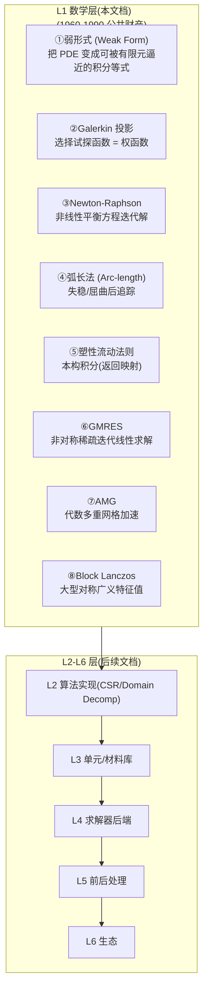
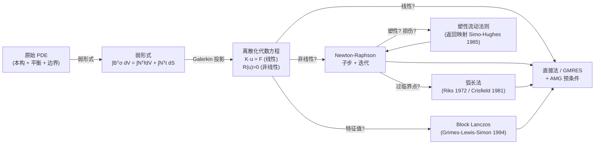
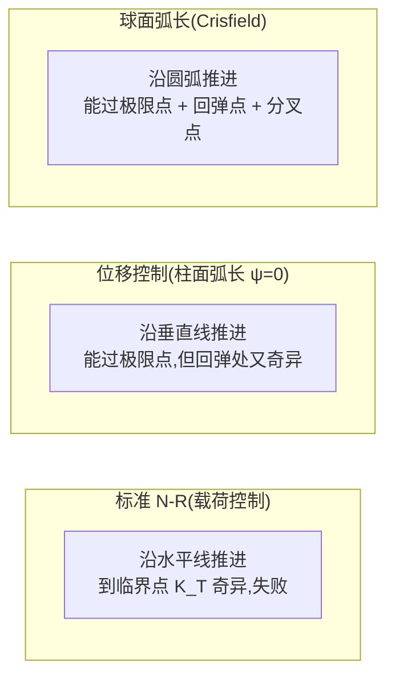
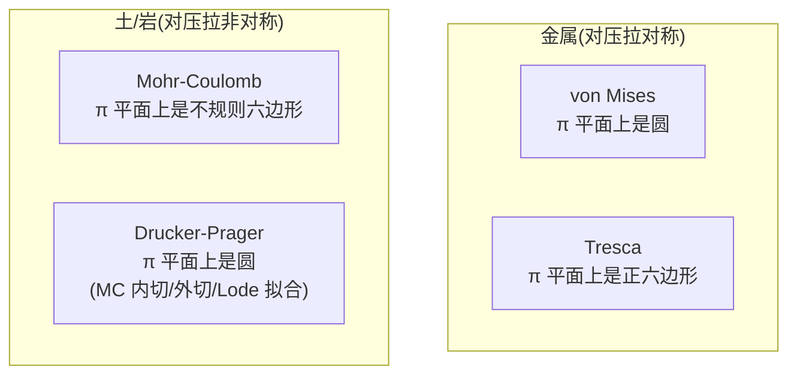
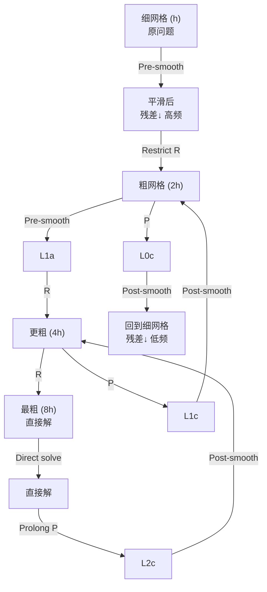
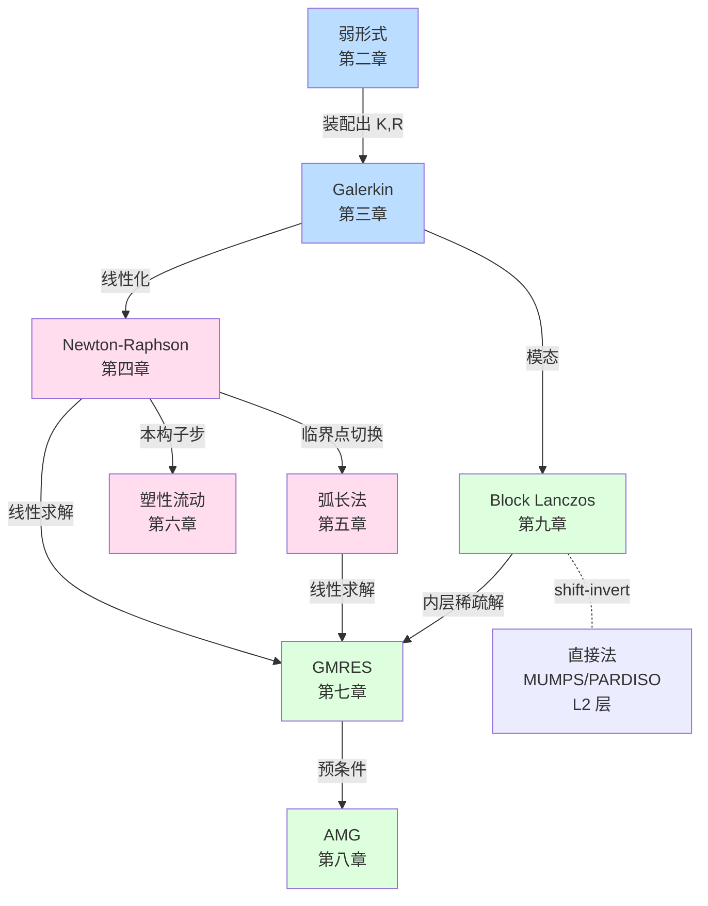
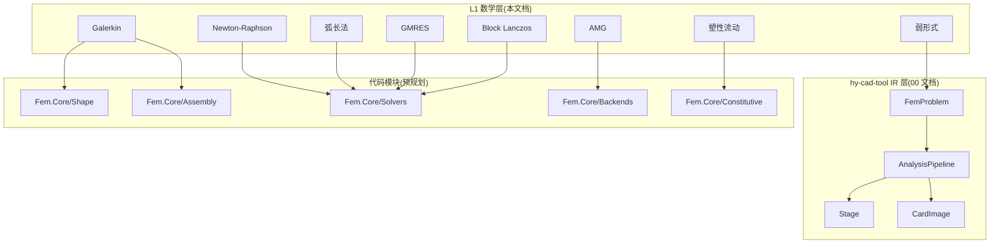
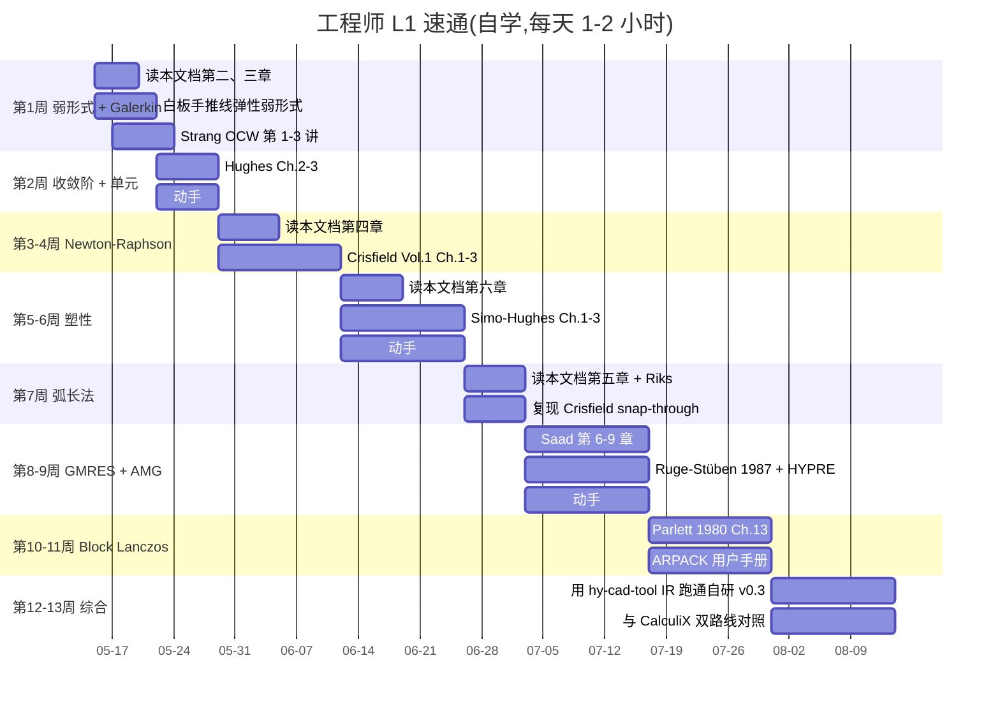

## 文档定位

> 文档日期:2026-05-15
> 上承:
> - [00-hy-cad-tool 有限元方向总纲](./00-hy-cad-tool有限元方向总纲-基于17份调研的决策树与路线图-2026-05-15.md)
> - [001-自研通用 FEA 的第一性原则重审](./001-自研通用FEA的第一性原则重审-30年积累vs150年开源-2026-05-15.md)
> 性质:**对 001 文档"6 层技术资产"中 L1 数学层的逐项深度学习**,把"全是 1960-1990 公共财产"这句结论展开为**可教学、可落地、可索引论文的完整数学手册**

001 文档把通用 FEA 拆解成 6 层技术资产,并下了一句关键论断:

| 层 | 内容 | "30 年积累"含金量 | 后发者门槛 |
|----|------|-------------------|-----------|
| **L1 数学** | 弱形式、Galerkin、Newton-Raphson、Block Lanczos、GMRES、AMG、弧长法、塑性流动法则 | **0**(全是 1960-1990 论文,公共财产) | **0**(本科课程到博士论文都已开放) |

这句话**结论正确,但论据没展开**。如果只到"是公共财产"就停笔,等于把 L1 当成黑盒——而 hy-cad-tool 的"主控发行版"路线(001 第四节)恰恰要求**对 L1 有第一性的理解**,理由有三:

1. **写 IR(`FemProblem`/`AnalysisPipeline`)需要数学语言对齐**——不懂弱形式,就分不清"切线刚度装配"和"内力残差装配"是同一件事的两面。
2. **接 CalculiX/MFEM/PETSc 作子进程需要协议级理解**——不懂 Newton-Raphson 子步与弧长法的状态机,就翻译不出正确的 `.inp` 收敛卡。
3. **可微分 FEA(001 第九节)的反传需要数学闭环理解**——不懂返回映射的一致切线模量,就无法保证伴随梯度的正确性。

本文档**不是教科书**,而是 **"工程师 90 天能读完、读完就能动手"的 L1 数学速通手册**,每节遵循固定的**四段式**:


| 段 | 目标读者 | 产出 |
|----|---------|------|
| ①历史与论文 | 主架构师 / 战略决策者 | 知道为什么 "**这条公式是 1965 年定下来的,后续都是优化**" |
| ②数学形式 | 全体 FEA 工程师 | 看到公式不再绕道,能在白板上手推 |
| ③算法伪代码 | 实施工程师 | 直接抄成 C# 代码 |
| ④落地映射 | hy-cad-tool 维护者 | 知道改哪个文件、哪个接口 |

> **本文档假定读者已有**:本科高等数学(偏微分方程、矩阵论)、本科有限元入门(单元/形函数概念)。**不假定读者熟悉**:泛函分析、Sobolev 空间的细节、数值线性代数高阶算法——这些会在内文逐步补齐。

---

## 一、L1 数学层在 FEA 全栈的位置(再回顾)



### 1.1 L1 八件事的逻辑链



> **核心洞察**:这 8 件事不是 8 个孤立算法,而是 **"PDE → 离散 → 线性化 → 求解 → 校正"** 一条流水线上的 8 道工序。任何一个非线性 FEA 求解器,运行时调用栈大概率是这样:

```text
solveStep()                                # 时间/载荷步
└─ NewtonRaphson()                          # ③
    ├─ assembleStiffnessAndResidual()       # 由 ②②②② Galerkin 装配
    │   └─ for each element:
    │       └─ stressUpdate()               # ⑤ 塑性返回映射(局部)
    ├─ solveLinear(K, ΔU = −R)              # 直接法 or ⑥ GMRES + ⑦ AMG
    └─ if 失稳:    switchToArcLength()      # ④
```

模态分析则是独立分支:`solveModal()` → `BlockLanczos()` → 内部多次 `solveLinear()`。

---

## 二、弱形式(Weak Form)— 1909 年 Ritz / 1915 年 Galerkin / 1943 年 Courant

### 2.1 历史与论文

| 年代 | 人物 | 论文 / 贡献 |
|------|------|-------------|
| 1909 | **Walter Ritz** | "Über eine neue Methode zur Lösung gewisser Variationsprobleme der mathematischen Physik" — 用变分原理把极小化能量泛函离散化(称为 **Ritz 法**) |
| 1915 | **Boris Galerkin** | 把 Ritz 思想推广到**没有显式能量泛函**的问题(如对流-扩散),正式建立 Galerkin 投影 |
| 1943 | **Richard Courant** | "Variational methods for the solution of problems of equilibrium and vibrations" — 在 Bulletin AMS 上**第一次明确写出三角形分片线性单元**,公认的"有限元法的诞生论文" |
| 1956 | **Turner-Clough-Martin-Topp** | "Stiffness and deflection analysis of complex structures" — 航空工程师独立"重发明"有限元,工程界开始用 |
| 1960 | **Ray Clough** | "The finite element method in plane stress analysis" — 第一次出现 "**Finite Element Method**" 这个词 |
| 1973 | **Strang & Fix** | 《An Analysis of the Finite Element Method》— FEM 数学分析的圣经,确立误差估计 |
| 1987 | **Hughes** | 《The Finite Element Method: Linear Static and Dynamic FEA》— 至今仍是研究生教科书首选 |

> **公共财产证据**:Ritz/Galerkin/Courant 三篇核心论文均**早于 1956 年(美国版权法 95 年保护期推算回去 = 全部已进入公共领域)**。Strang-Fix 1973 与 Hughes 1987 是教材,**全网均有合法 PDF 流通**,且原理性内容受到"事实/方法不可版权"的保护。

### 2.2 数学形式

考虑一个最简单的稳态线弹性问题(强形式 / Strong Form):

求位移场 \( u : \Omega \subset \mathbb{R}^3 \to \mathbb{R}^3 \) 使得

\[
\begin{aligned}
-\nabla \cdot \sigma(u) &= f \quad\text{在 } \Omega \text{ 内} \\
\sigma(u) &= \mathbb{C} : \varepsilon(u) \\
\varepsilon(u) &= \tfrac{1}{2}(\nabla u + \nabla u^T) \\
u &= \bar{u} \quad\text{在 } \Gamma_D \text{ 上(Dirichlet)} \\
\sigma \cdot n &= \bar{t} \quad\text{在 } \Gamma_N \text{ 上(Neumann)}
\end{aligned}
\]

**强形式的两个工程麻烦**:

1. 要求 \(u\) 二阶可微(因为 \(\nabla \cdot \sigma\) 含二阶导)——但分片线性的有限元基函数**只有一阶可微**!
2. 在材料/形状不连续处(如多材料界面)二阶导数甚至不存在。

**弱形式的核心招式**:**乘上任意测试函数 \(v\),全域积分,然后分部积分把一阶导转移到 \(v\) 上**。

\[
\int_\Omega (-\nabla \cdot \sigma) \cdot v \, d\Omega = \int_\Omega f \cdot v \, d\Omega
\]

利用 \(\nabla \cdot (\sigma \cdot v) = (\nabla \cdot \sigma) \cdot v + \sigma : \nabla v\) 和 Gauss 散度定理:

\[
\boxed{
\int_\Omega \sigma(u) : \varepsilon(v) \, d\Omega
= \int_\Omega f \cdot v \, d\Omega
+ \int_{\Gamma_N} \bar{t} \cdot v \, dS
\quad \forall v \in V_0
}
\]

其中 \(V_0 = \{ v \in [H^1(\Omega)]^3 : v|_{\Gamma_D} = 0 \}\) 是齐次试探空间。

**关键收益**:

| 性质 | 强形式要求 | 弱形式要求 |
|------|-----------|-----------|
| \(u\) 的光滑性 | \(C^2\) | \(H^1\)(只需要一阶弱导数,**和有限元基函数匹配**) |
| 边界条件 | 显式分两类 | **Dirichlet 显式约束,Neumann 自动隐含在右端项**(称"自然边界条件") |
| 可证明性 | 不一定唯一 | **Lax-Milgram 定理保证存在唯一**(对椭圆问题) |

### 2.3 Sobolev 空间速通

| 记号 | 含义 | 工程直觉 |
|------|------|---------|
| \(L^2(\Omega)\) | 平方可积函数 | "积分意义下有限" |
| \(H^1(\Omega) = W^{1,2}\) | 函数本身 + 一阶弱导数都在 \(L^2\) | "**有限元基函数所属的空间**" |
| \(H^1_0(\Omega)\) | \(H^1\) 中在边界为零的子空间 | 用于齐次 Dirichlet 试探函数 |
| \(H(\text{div})\) | 含散度在 \(L^2\) 中 | RT 单元、混合公式 |
| \(H(\text{curl})\) | 含旋度在 \(L^2\) 中 | Nédélec 单元、电磁 |

> **直觉**:Sobolev 空间的"上标 \(k\)"表示"你能容忍的导数次数"。线弹性弱形式只需要 \(H^1\),因此**分片线性(C0 连续)的三角形/四面体单元天然合法**。这就是为什么 FEM 1956 年起就能直接用三角形单元而不需要二阶光滑。

### 2.4 Lax-Milgram 定理(存在唯一性)

设 \(V\) 是 Hilbert 空间,双线性形式 \(a : V \times V \to \mathbb{R}\) 满足:

1. **连续性**:\(\exists\, M : |a(u,v)| \le M\|u\|\,\|v\|\)
2. **强制性 / Coercivity**:\(\exists\, \alpha > 0 : a(v,v) \ge \alpha \|v\|^2\)

且 \(L : V \to \mathbb{R}\) 线性连续,则 \(a(u, v) = L(v) \quad \forall v\in V\) 存在唯一解。

> **工程对应**:线弹性的 \(a(u,v) = \int_\Omega \sigma(u):\varepsilon(v)\)。**强制性来自 Korn 不等式 + 弹性张量正定**——这就是为什么"刚体模态没被锁死时,刚度矩阵奇异"——少了强制性。

### 2.5 算法伪代码(弱形式 → 单元残差/刚度装配)

```text
function assemble(mesh, ucurrent):
    K ← zeros(N, N), R ← zeros(N)
    for each element e in mesh:
        Ke ← zeros(ne, ne), Re ← zeros(ne)
        for each quadrature point ξ_q with weight w_q:
            B ← strain-displacement matrix at ξ_q
            ε ← B · u^e
            σ, C_tan ← constitutiveUpdate(ε)        # 见第五章塑性
            Ke += Bᵀ · C_tan · B · detJ · w_q       # 切线刚度
            Re += Bᵀ · σ          · detJ · w_q       # 内力残差
        # 外力载荷 f^e:体力 + 面力
        Re -= Ne^T · f · detJ · w_q
        assembleToGlobal(K, R, Ke, Re, dofMap(e))
    applyDirichlet(K, R, ucurrent)                  # 见第四章 N-R
    return K, R
```

### 2.6 落地映射(hy-cad-tool)

| 概念 | hy-cad-tool 代码位置 | 备注 |
|------|---------------------|------|
| `FemProblem` IR(承载弱形式 + 边界) | `src/HyCADTool.Fem.Core/Model/FemProblem.cs`(规划) | 00 文档第 2 节已设计 |
| 单元 B 矩阵 / 雅可比 | `Features/Fem/Elements/*` | 自研 v0.2 起 |
| 装配器 | `Features/Fem/Assembly/IGlobalAssembler.cs` | 接 CSparse.NET 三元组 |
| Dirichlet 边界处理 | `Assembly/DirichletConstraints.cs` | 推荐"行替换 + 列消去"两步法 |

---

## 三、Galerkin 方法 — 1915 年 Galerkin / 1973 年 Strang-Fix 误差估计

### 3.1 历史与论文

| 年代 | 人物 | 贡献 |
|------|------|------|
| 1915 | **B.G. Galerkin** | 把 Ritz 法推广到**无变分原理**的问题 |
| 1969 | **Lions-Magenes** | 弱形式存在性的完整理论 |
| 1973 | **Strang & Fix** | 《An Analysis of the FEM》,**Céa 引理 + 收敛阶 \(O(h^{p+1})\)** 写进教科书 |
| 1978 | **Babuška-Brezzi (LBB) 条件** | 混合公式的稳定性,后被 Stokes/Mindlin 板用到 |
| 1982 | **Hughes-Franca-Hulbert** | SUPG / Galerkin Least-Squares(对流-扩散) |

### 3.2 Bubnov-Galerkin 与 Petrov-Galerkin

设弱形式 \(a(u,v) = L(v)\)。在试探空间 \(V_h \subset V\) 中找 \(u_h \in V_h\) 使

\[
a(u_h, v_h) = L(v_h) \quad \forall v_h \in W_h
\]

| 方法 | 试探空间 \(V_h\) | 测试空间 \(W_h\) | 用途 |
|------|------------------|------------------|------|
| **Bubnov-Galerkin** | \(V_h\) | **\(W_h = V_h\)**(相同) | 椭圆问题,99% FEM |
| **Petrov-Galerkin** | \(V_h\) | \(W_h \ne V_h\) | 对流主导问题(SUPG)、流体 |

> **直觉**:Bubnov-Galerkin 等价于"在试探空间内做正交投影",这就是为什么对称椭圆问题装配出来的刚度矩阵是**对称正定**。

### 3.3 基函数与"形函数 N"的关系

把节点 \(i\) 上的 hat 函数 \(\phi_i\) 取为基,有限元逼近写成

\[
u_h(x) = \sum_{i=1}^{N} u_i \phi_i(x), \qquad
v_h(x) = \sum_{j=1}^{N} v_j \phi_j(x)
\]

代入弱形式得到代数方程

\[
\boxed{
K\,U = F, \qquad
K_{ij} = a(\phi_j, \phi_i), \qquad
F_i = L(\phi_i)
}
\]

**形函数 N**(单元内的 \(\phi_i\))与全局 \(\phi_i\) 的关系:全局 \(\phi_i\) **是若干相邻单元上"局部形函数 N"的拼接**。这就是"组装"(assemble)的数学本质。

### 3.4 Céa 引理与收敛阶(为什么 \(O(h^{p+1})\))

**Céa 引理**:在椭圆问题下,

\[
\|u - u_h\|_V \le \frac{M}{\alpha} \inf_{v_h \in V_h} \|u - v_h\|_V
\]

即"**有限元解 = 在 \(V_h\) 中对真解的最佳逼近**"(以能量范数计,差一个有界常数)。

结合**插值估计**:若 \(u \in H^{p+1}(\Omega)\),则 \(\inf_{v_h} \|u - v_h\|_{H^1} \le C h^p \|u\|_{H^{p+1}}\)。代入 Céa:

\[
\|u - u_h\|_{H^1} \le C h^p \qquad
\|u - u_h\|_{L^2} \le C h^{p+1} \quad\text{(Aubin-Nitsche 对偶论证)}
\]

| 单元 | 多项式阶 \(p\) | 位移误差 \(L^2\) | 应力误差 \(L^2\) |
|------|---------------|-------------------|-------------------|
| 线性三角/四面体 (T3/Tet4) | 1 | \(O(h^2)\) | \(O(h)\) |
| 二次三角/四面体 (T6/Tet10) | 2 | \(O(h^3)\) | \(O(h^2)\) |
| Q4 四边形 | 1(双线性) | \(O(h^2)\) | \(O(h)\) |
| Q8 / Q9 | 2 | \(O(h^3)\) | \(O(h^2)\) |

> **工程师警示**:Céa 假设了**强制性 \(\alpha > 0\)**——但**薄板锁住**(shear locking)、**不可压缩锁住**(volumetric locking)等病态会让 \(\alpha\) 退化为接近零,理论收敛阶仍对,但**常数 \(C\) 爆炸**。这就是为什么 SHELL181/SOLID185 要做 B-bar、enhanced assumed strain 等技巧。这些技巧不在 L1,而在 L3——但**起点都是 Céa 引理被恶化了**。

### 3.5 落地映射

| 概念 | hy-cad-tool 代码位置 |
|------|---------------------|
| 形函数 N + B 矩阵 | `Fem.Core/Shape/*Shape.cs`(linear/quadratic shape) |
| 高斯积分点 | `Fem.Core/Quadrature/GaussQuadrature.cs` |
| 单元 → 全局自由度映射 | `Fem.Core/Dof/DofMap.cs` |
| 收敛阶验证 | `tests/Fem.Verification/*` — h-收敛测试用 patch test + manufactured solution |

---

## 四、Newton-Raphson — 1669 牛顿 / 1690 拉夫森 / 1985 推广形式

### 4.1 历史与论文

| 年代 | 人物 | 贡献 |
|------|------|------|
| 1669 | **Isaac Newton** | 《De analysi》——给出三次方程的迭代格式 |
| 1690 | **Joseph Raphson** | 《Analysis Aequationum Universalis》——把牛顿迭代写成现在的递推形式 |
| 1960s | **Oden / Argyris** | 把 N-R 引入有限元几何非线性 |
| 1975 | **Matthies-Strang** | 修正 Newton-Raphson(KT 不每步更新) |
| 1980 | **Bathe-Cimento** | 大量工程实践经验,**收敛准则**写入 ADINA / ABAQUS |
| 1985 | **Crisfield**《Non-linear Finite Element Analysis of Solids and Structures》 | 两卷本,工程界圣经 |

### 4.2 数学形式

非线性平衡方程:

\[
R(u) := F^{\text{int}}(u) - F^{\text{ext}} = 0
\]

其中 \(F^{\text{int}}(u) = \int_\Omega B^T \sigma(u) \, d\Omega\)(由第二章弱形式导出)。

**牛顿迭代**:从初值 \(u^{(0)}\) 出发,做泰勒展开

\[
R(u^{(k)} + \Delta u) \approx R(u^{(k)}) + \underbrace{\frac{\partial R}{\partial u}\bigg|_{u^{(k)}}}_{K_T(u^{(k)})\;\text{切线刚度}} \Delta u = 0
\]

得到迭代格式

\[
\boxed{
K_T(u^{(k)})\,\Delta u^{(k+1)} = -R(u^{(k)}), \qquad
u^{(k+1)} = u^{(k)} + \Delta u^{(k+1)}
}
\]

**切线刚度** \(K_T\):

\[
K_T = \int_\Omega B^T \mathbb{C}_{\text{tan}} B \, d\Omega + K_{\sigma}
\]

其中 \(\mathbb{C}_{\text{tan}} = \partial \sigma / \partial \varepsilon\) 是**一致切线模量**(第五章塑性会推),\(K_\sigma\) 是**几何刚度**(大变形项)。

### 4.3 收敛速度与陷阱

| 性质 | 标准 Newton-Raphson | 修正 N-R | 弧长法 |
|------|---------------------|----------|--------|
| 收敛阶 | **二阶**(平方收敛) | **一阶**(线性) | 二阶,但能过临界 |
| 每步代价 | 每次重组 \(K_T\) | 只组一次 \(K_T\) | 每次重组 + 多一个约束方程 |
| 失稳能力 | **无,过临界点会发散** | 无 | **能,关键招式** |

**经典收敛准则**(Bathe 1980 提出,ABAQUS 沿用至今):

| 准则 | 公式 | 工程默认值 |
|------|------|-----------|
| 力残差 | \(\|R\| / \|F^{\text{ext}}\| < \varepsilon_F\) | \(\varepsilon_F = 5\times 10^{-3}\) |
| 位移增量 | \(\|\Delta u\| / \|u\| < \varepsilon_U\) | \(\varepsilon_U = 5\times 10^{-3}\) |
| 能量 | \(\Delta u^T R / \Delta u^{(1) T} R^{(0)} < \varepsilon_E\) | \(\varepsilon_E = 10^{-5}\) |

**三大陷阱**:

1. **临界点附近 \(K_T\) 奇异** → 必须切换弧长法
2. **塑性强非线性时 \(K_T\) 不连续** → 必须用**一致切线模量**而非"弹性 \(\mathbb{C}\)"
3. **载荷子步太大** → 自动子步切分(Bathe 1980 的"line search" + "auto bisect")

### 4.4 算法伪代码

```text
function newtonRaphson(u_n, loadStep, tol, maxIter):
    u ← u_n
    applyExternalLoad(F_ext, loadStep)
    for k = 1 .. maxIter:
        K_T, R ← assemble(mesh, u)            # 见第二章 + 第五章
        normR  ← norm(R) / max(norm(F_ext), 1)
        normDU ← norm(ΔU) / max(norm(u), 1)
        if normR < tol_F and normDU < tol_U:
            return u, converged=True
        ΔU ← solveLinear(K_T, −R)              # 见第六章 GMRES / 直接法
        u  ← u + ΔU
    return u, converged=False                  # 触发子步对半切
```

### 4.5 落地映射

| 概念 | hy-cad-tool 代码位置 |
|------|---------------------|
| `INonLinearSolver` 接口 | `Fem.Core/Solvers/INonLinearSolver.cs` |
| `NewtonRaphsonSolver` 实现 | `Fem.Core/Solvers/NewtonRaphsonSolver.cs` |
| 收敛准则配置 | `Fem.Core/Solvers/ConvergenceCriteria.cs` |
| 子步自动切分 | `Fem.Core/Solvers/SubstepController.cs`(Bathe 自适应) |
| 一致切线模量约定 | `IConstitutiveLaw.ComputeStressAndTangent(...)` |

---

## 五、弧长法(Arc-length Method)— 1972 Riks / 1979 Wempner / 1981 Crisfield

### 5.1 历史与论文

| 年代 | 人物 | 贡献 |
|------|------|------|
| 1972 | **Eric Riks**《The Application of Newton's Method to the Problem of Elastic Stability》 | 提出**载荷因子作为额外未知量**的思想 |
| 1979 | **Gerald Wempner** | 独立提出几何上等价的弧长 |
| 1981 | **M.A. Crisfield**《A fast incremental/iterative solution procedure that handles "snap-through"》 | **柱面弧长 + 球面弧长 + 二次方程根的选取规则**,工程界最常用版本 |
| 1990 | **Ramm / Bergan** | 弧长法的变体(更新弧长策略、收敛诊断) |

> **公共财产证据**:Riks 1972 是 IJSS 论文,Crisfield 1981 是 Computers & Structures 论文,均已超过 40 年。Crisfield 1985/1991 的两卷本在大学图书馆全有,且原理性公式不受版权保护。

### 5.2 数学形式

把外载荷参数化:\(F^{\text{ext}}(\lambda) = \lambda\,\hat{F}\)。在标准 N-R 里 \(\lambda\) 是**已知**,在弧长法里 \(\lambda\) 是**未知**——这样 \(K_T\) 在临界点的奇异性被一个额外约束方程救活。

**残差方程**:

\[
R(u, \lambda) = F^{\text{int}}(u) - \lambda\,\hat{F} = 0
\]

**弧长约束方程**(球面型,Crisfield 1981):

\[
g(\Delta u, \Delta \lambda) = \Delta u^T \Delta u + \psi^2 \Delta \lambda^2 \,\hat{F}^T \hat{F} - \Delta s^2 = 0
\]

其中 \(\Delta s\) 是当前子步的"弧长",\(\psi\) 是缩放参数(\(\psi = 0\) 退化为柱面弧长 = 位移控制)。

**联立求解**(N-R 子迭代):

\[
\begin{bmatrix}
K_T & -\hat{F} \\
2\,\Delta u^T & 2\,\psi^2 \Delta \lambda\,\hat{F}^T \hat{F}
\end{bmatrix}
\begin{bmatrix}
\delta u \\ \delta \lambda
\end{bmatrix}
=
\begin{bmatrix}
-R \\ -g
\end{bmatrix}
\]

Crisfield 的招式:**不直接求解 \((N+1)\times(N+1)\) 增广矩阵**,而是分两步解 \(N\) 阶系统,然后从二次方程里挑根。

### 5.3 几何解释



### 5.4 三种弧长变体对比

| 变体 | 约束方程 | 优点 | 缺点 |
|------|---------|------|------|
| **柱面弧长** | \(\Delta u^T \Delta u = \Delta s^2\) | 实现简单,适合大多数极限点 | 不能过 snap-back |
| **球面弧长** | + \(\psi^2 \Delta\lambda^2 \hat F^T \hat F\) | 通用 | \(\psi\) 难选(经验 0.1~1) |
| **线性化弧长 / Ramm** | 当前切线方向上的弧长 | 更简单 | 鲁棒性略差 |

**根的选取**:二次方程会给出两个 \(\delta\lambda\)。Crisfield 规则:**选与上一子步方向一致的那个**(用 \(\Delta u_{\text{old}}^T (\Delta u_{\text{new}})\) 是否正判断)。

### 5.5 算法伪代码

```text
function arcLengthStep(u_n, λ_n, Δs, ψ, hatF):
    # 1) 预测子步(切线方向)
    K_T ← assembleStiffness(u_n)
    Δu_t ← solveLinear(K_T, hatF)
    Δλ ← Δs / sqrt(Δu_tᵀ Δu_t + ψ² hatFᵀ hatF)
    Δu ← Δλ · Δu_t

    # 2) N-R 子迭代修正(Crisfield 形式)
    while not converged:
        R ← Fint(u_n + Δu) − (λ_n + Δλ)·hatF
        K_T ← assembleStiffness(u_n + Δu)
        δu_R ← solveLinear(K_T, −R)
        δu_F ← solveLinear(K_T, hatF)

        # 二次方程 a·δλ² + b·δλ + c = 0
        a ← δu_Fᵀ δu_F + ψ² hatFᵀ hatF
        b ← 2·(Δu + δu_R)ᵀ δu_F + 2 ψ² Δλ hatFᵀ hatF
        c ← (Δu + δu_R)ᵀ (Δu + δu_R) + ψ² Δλ² hatFᵀ hatF − Δs²

        δλ ← selectRootBySign(a, b, c, Δu, δu_R, δu_F)   # Crisfield 选根规则
        δu ← δu_R + δλ · δu_F
        Δu ← Δu + δu
        Δλ ← Δλ + δλ

    return u_n + Δu, λ_n + Δλ
```

### 5.6 落地映射

| 概念 | hy-cad-tool 代码位置 |
|------|---------------------|
| `ArcLengthSolver` | `Fem.Core/Solvers/ArcLengthSolver.cs` |
| 根选取策略 | `Fem.Core/Solvers/ArcLengthRootSelector.cs` |
| 自适应 Δs | `Fem.Core/Solvers/ArcLengthAdaptiveStep.cs` |
| 切换状态机(N-R ↔ 弧长) | `Fem.Core/Solvers/HybridNonlinearStrategy.cs` |

---

## 六、塑性流动法则 — 1864 Tresca / 1913 von Mises / 1985 Simo-Hughes

### 6.1 历史与论文

| 年代 | 人物 | 贡献 |
|------|------|------|
| 1864 | **Henri Tresca** | 最大剪应力屈服准则(基于挤压实验) |
| 1913 | **Richard von Mises** | \(J_2\) 屈服(畸变能假设) |
| 1924 | **Prandtl-Reuss** | 增量塑性理论,**相关流动法则** |
| 1928 | **Mohr-Coulomb** | 摩擦材料屈服(土/岩) |
| 1952 | **Drucker-Prager** | Mohr-Coulomb 的光滑近似(数值友好) |
| 1958 | **Drucker 公设** | "**稳定材料**"的概念(\(\dot\sigma : \dot\varepsilon^p \ge 0\)) |
| 1985 | **Simo & Hughes**《Computational Inelasticity》(书 1998) | **返回映射算法 + 一致切线模量**,工程实现的圣经 |
| 1991 | **Ortiz-Pinsky** | 大塑性的几何积分 |

> **公共财产证据**:Tresca 1864 / von Mises 1913 / Prandtl-Reuss 1924 / Mohr-Coulomb 1928 全部超过版权期。Simo-Hughes 1998 是教材,但其中**算法 = 事实/方法**不受版权,且 Simo 本人在 IJNME 等期刊上的论文全网公开。

### 6.2 数学形式(率独立小应变)

塑性理论的"五件套":

| # | 名称 | 公式 |
|---|------|------|
| ① | **应变加性分解** | \(\varepsilon = \varepsilon^e + \varepsilon^p\) |
| ② | **本构(弹性部分)** | \(\sigma = \mathbb{C} : \varepsilon^e\) |
| ③ | **屈服函数** | \(f(\sigma, \kappa) \le 0\)(\(\kappa\) 是硬化变量) |
| ④ | **流动法则** | \(\dot{\varepsilon}^p = \dot{\gamma}\,\partial g / \partial \sigma\) |
| ⑤ | **K-T 加载条件** | \(\dot\gamma \ge 0,\ f \le 0,\ \dot\gamma\,f = 0\) |

其中 \(g\) 是**塑性势函数**:

- \(g = f\) → **相关流动**(associated,金属、von Mises)
- \(g \ne f\) → **非相关流动**(non-associated,土/岩,Mohr-Coulomb 通常用非相关)

### 6.3 屈服面四大家族(L1 必备)

| 准则 | 屈服函数 | 适用 |
|------|---------|------|
| **von Mises (J2)** | \(f = \sqrt{3 J_2} - \sigma_y(\kappa)\) | 金属、橡胶弹塑性 |
| **Tresca** | \(f = \tfrac{1}{2}(\sigma_1 - \sigma_3) - \tau_y\) | 金属(有锐角,数值不友好) |
| **Mohr-Coulomb** | \(f = (\sigma_1 - \sigma_3) + (\sigma_1+\sigma_3)\sin\phi - 2c\cos\phi\) | 土/岩(有锐角) |
| **Drucker-Prager** | \(f = \alpha I_1 + \sqrt{J_2} - k\) | 土/岩(锐角光滑化) |

其中 \(I_1 = \mathrm{tr}(\sigma),\ J_2 = \tfrac{1}{2} s : s,\ s = \sigma - \tfrac{1}{3} I_1 I\)。



### 6.4 返回映射算法(Simo-Hughes 1985)

**核心思想**:把"率本构积分"变成"**预测-修正**的算子分裂"。

```text
function returnMapping(ε_n, ε_p_n, κ_n, Δε):
    # 1) 弹性预测(trial step)
    ε_trial   ← (ε_n + Δε) − ε_p_n
    σ_trial   ← C : ε_trial
    f_trial   ← yieldFunction(σ_trial, κ_n)

    if f_trial ≤ 0:
        return σ_trial, ε_p_n, κ_n, C    # 弹性,切线 = C

    # 2) 塑性修正(Newton 解 Δγ)
    Δγ ← 0
    repeat:
        σ ← σ_trial − Δγ · C : (∂g/∂σ)
        κ ← κ_n + Δγ · h(σ, κ)            # h 是硬化律
        f ← yieldFunction(σ, κ)
        if |f| < tol:    break
        df_dΔγ ← derivative term
        Δγ ← Δγ − f / df_dΔγ

    # 3) 一致切线模量(consistent tangent)
    C_alg ← computeConsistentTangent(σ, κ, Δγ, C, ∂g/∂σ, ∂f/∂σ, ...)

    return σ, ε_p_n + Δγ · ∂g/∂σ, κ, C_alg
```

**关键招式 1:径向返回(von Mises)**

\[
\sigma_{n+1} = \sigma_{\text{trial}} - 2G\,\Delta\gamma\,\frac{s_{\text{trial}}}{\|s_{\text{trial}}\|}
\]

即"**沿偏应力径向往内拉到屈服面**"。是 von Mises 时这一步**有闭式解**:

\[
\Delta\gamma = \frac{f_{\text{trial}}}{3G + H}
\]

其中 \(H = d\sigma_y / d\kappa\) 是塑性模量。**这就是 1980 年代 von Mises 塑性能算到无穷大网格的原因**——根本不需要内迭代,一次代数解搞定。

**关键招式 2:一致切线模量(consistent tangent)**

\(\mathbb{C}^{\text{alg}} = d\sigma_{n+1} / d\varepsilon_{n+1}|_{\Delta t}\),**注意是对"返回映射后的离散结果"求导**,不是对连续物理本构求导。两者差异:

| 模量 | 公式(von Mises) | N-R 收敛性 |
|------|-------------------|-----------|
| **连续切线** \(\mathbb{C}^{\text{cont}}\) | \(\mathbb{C} - \tfrac{6G^2}{3G+H} n \otimes n\) | 一阶(Δγ→0 时退化) |
| **一致切线** \(\mathbb{C}^{\text{alg}}\) | 上式 + \(2G\beta\,\Delta\gamma\,(I_{\text{dev}} - n\otimes n)/\|s_{\text{trial}}\|\) | **二阶**(精确平方收敛) |

> **工程师警告**:大量教科书写的是连续切线!想要 N-R 平方收敛,**必须**用一致切线。Simo-Hughes 1985 的核心贡献正是这一点。

### 6.5 算法伪代码(集成到 N-R 内层)

```text
# 装配阶段 — 见第二章 assemble()
for each element e:
    for each gauss point q:
        ε ← B · u^e
        σ, C_alg ← returnMapping(state[q], ε)     # 第六章
        K_e += Bᵀ C_alg B det(J) w_q              # ← 必须是一致切线
        R_e += Bᵀ σ      det(J) w_q
        state[q] ← updated
```

### 6.6 落地映射

| 概念 | hy-cad-tool 代码位置 |
|------|---------------------|
| `IConstitutiveLaw` | `Fem.Core/Constitutive/IConstitutiveLaw.cs` |
| `VonMisesPlasticity` | `Fem.Core/Constitutive/VonMisesJ2.cs`(径向返回 + 一致切线) |
| `MohrCoulombPlasticity` | `Fem.Core/Constitutive/MohrCoulomb.cs`(非相关流动,土) |
| `DruckerPragerPlasticity` | `Fem.Core/Constitutive/DruckerPrager.cs`(MC 的圆锥化) |
| 高斯点状态存储 | `Fem.Core/State/GaussPointState.cs`(\(\varepsilon^p\), \(\kappa\), back stress) |

---

## 七、GMRES — 1986 Saad & Schultz

### 7.1 历史与论文

| 年代 | 人物 | 贡献 |
|------|------|------|
| 1952 | **Hestenes-Stiefel** | 共轭梯度法 CG(对称正定) |
| 1975 | **Paige-Saunders** | MINRES / SYMMLQ(对称不定) |
| 1986 | **Saad & Schultz**《GMRES: A generalized minimal residual algorithm for solving nonsymmetric linear systems》SIAM J. Sci. Stat. Comput. | **非对称稀疏迭代的最常用算法** |
| 1993 | **Saad**《Iterative Methods for Sparse Linear Systems》 | 这本书在 2003 年第 2 版后**整本免费**,北卡书库 PDF |

> **公共财产证据**:Saad 把第二版整本 PDF 放在自己个人主页(明尼苏达大学),作者自愿公开。GMRES 算法本身是 1986 论文,**事实/方法不受版权**。

### 7.2 数学形式

求解 \(A x = b\),\(A\) 非对称稀疏。GMRES 的思想:在 Krylov 子空间

\[
\mathcal{K}_m(A, r_0) = \mathrm{span}\{r_0, A r_0, A^2 r_0, \ldots, A^{m-1} r_0\}
\]

中找 \(x_m = x_0 + V_m y\) 使**残差 \(b - A x_m\) 的 2-范数极小**。这就是 "Generalized **Minimal Residual**" 的来源。

通过 **Arnoldi 迭代** 把 \(A\) 在 \(\mathcal{K}_m\) 上正交化为上 Hessenberg 矩阵 \(H_m \in \mathbb{R}^{(m+1) \times m}\):

\[
A V_m = V_{m+1} H_m
\]

子问题变成

\[
\min_y \|\,\|r_0\|\,e_1 - H_m y\,\|_2
\]

这是一个 \((m+1) \times m\) 的**小最小二乘问题**,Givens 旋转 \(O(m^2)\) 解掉。

### 7.3 GMRES vs CG vs BiCGStab

| 算法 | 适用 \(A\) | 内存(每步) | 收敛保证 |
|------|-----------|--------------|----------|
| **CG** | 对称正定 | \(O(N)\) | 单调下降,\(O(\sqrt{\kappa})\) 步 |
| **MINRES** | 对称不定 | \(O(N)\) | 残差单调下降 |
| **GMRES (full)** | 任意非奇异 | \(O(mN)\)(存所有 \(V\)) | 残差单调下降,但内存爆炸 |
| **GMRES(m) 重启** | 任意 | \(O(mN)\),\(m=20\sim50\) | 不再单调,可能停滞 |
| **BiCGStab** | 非对称 | \(O(N)\) | 振荡,收敛较快但不稳定 |

> **L1 数学黄金法则**:**对称正定先 CG / 不定先 MINRES / 不对称先 GMRES(30)** — 这是 PETSc/HYPRE 默认配置背后的逻辑。

### 7.4 预条件(Preconditioner)的极端重要性

GMRES 收敛速度由 \(\kappa(A)\)(条件数)主导。FEA 刚度矩阵的条件数随网格细化恶化:\(\kappa(K) = O(h^{-2})\)。**没有预条件,GMRES 几乎不可用**。

**预条件方程**:解 \(M^{-1} A x = M^{-1} b\),\(M \approx A\) 但**易求逆**。

| 预条件 | 强度 | 代价 |
|--------|------|------|
| Jacobi(对角) | 弱 | 极低 |
| Block Jacobi | 中 | 低 |
| **ILU(0)** | 中 | 中(填零容忍稀疏化) |
| **ILU(k)** | 强 | 高(填入层数 k) |
| **AMG**(代数多重网格) | **极强**,接近最优 | 中-高(setup 贵,solve 便宜) |
| **Domain Decomposition + Schwarz** | 强,并行友好 | 高 |

> **FEA 工程经验**:**3D 弹性 → AMG 几乎是唯一选择**(条件数太坏);**梁/壳/2D → ILU(0) 足够**。这就是 PETSc 默认对 3D 选 BoomerAMG,对 2D 选 ILU。

### 7.5 算法伪代码(完整 GMRES(m))

```text
function gmres(A, b, x0, M, m_restart, tol, maxIter):
    x ← x0
    for outer = 1 .. maxIter:
        r0 ← M⁻¹ (b − A·x)
        β ← norm(r0)
        if β < tol·norm(b):    return x

        V[0] ← r0 / β
        for j = 1 .. m_restart:
            w ← M⁻¹ · A · V[j−1]
            for i = 0 .. j−1:                # 模Gram-Schmidt
                H[i,j−1] ← V[i]ᵀ w
                w ← w − H[i,j−1] · V[i]
            H[j,j−1] ← norm(w)
            V[j] ← w / H[j,j−1]

            applyGivens(H[:,j−1], g)         # 累积 Givens 旋转
            if |g[j]| < tol·β:    break

        y ← back-solve(H[0:j, 0:j], g[0:j])
        x ← x + V[0:j] · y
```

### 7.6 落地映射

| 概念 | hy-cad-tool 代码位置 |
|------|---------------------|
| `ILinearSolver` | `Fem.Core/Solvers/Linear/ILinearSolver.cs` |
| `GMRES` 直接实现 | `Fem.Core/Solvers/Linear/GmresSolver.cs`(CSparse.NET 之上) |
| `IPreconditioner` | `Fem.Core/Solvers/Linear/IPreconditioner.cs` |
| `ILU0` | `Fem.Core/Solvers/Linear/Preconditioners/Ilu0.cs` |
| **AMG 桥接**(子进程) | `Fem.Core/Solvers/Linear/HypreBoomerAmgBackend.cs` |
| **MUMPS 直接法** | `Fem.Core/Solvers/Linear/MumpsBackend.cs`(P/Invoke) |

---

## 八、AMG 代数多重网格 — 1982 Brandt-McCormick-Ruge / 1987 Ruge-Stüben

### 8.1 历史与论文

| 年代 | 人物 | 贡献 |
|------|------|------|
| 1977 | **Achi Brandt** | **几何多重网格 (GMG)**,Math. Comp. 论文 |
| 1982 | **Brandt, McCormick, Ruge** | **代数多重网格 (AMG)** 提出 |
| 1987 | **Ruge & Stüben**《Algebraic multigrid》in *Multigrid Methods*, SIAM | **经典 AMG**(C/F 粗化、强连接),今日所有实现的祖宗 |
| 2000 | **Vaněk-Mandel-Brezina** | **Smoothed Aggregation AMG**(SA-AMG),适合各向异性 |
| 2006 | **HYPRE BoomerAMG** | LLNL 开源,工业级 |

### 8.2 数学形式

求解 \(A u = f\)。**多重网格的核心循环(V-cycle)**:



**关键操作**:

| 算子 | 含义 | AMG 的做法 |
|------|------|-----------|
| **Smoother S** | 平滑细网格 | Gauss-Seidel / Jacobi(去高频残差) |
| **Restriction R** | 细→粗 | \(R = P^T\) |
| **Prolongation P** | 粗→细 | **基于矩阵元素强度自动构造**(AMG 核心) |
| **Coarse operator** | 粗算子 | \(A_c = P^T A P\)(Galerkin 投影) |

> **AMG vs GMG 的关键不同**:GMG 要求**网格层级显式给出**(几何信息);AMG **只看矩阵 \(A\)**,从代数强度推出粗细划分,**对任意网格通用**。这就是 BoomerAMG 能"开箱即用"的原因。

### 8.3 经典 AMG(Ruge-Stüben)的 C/F 粗化

**强连接**:节点 \(i\) 强依赖于 \(j\),若

\[
-a_{ij} \ge \theta \max_{k \ne i} \{-a_{ik}\}, \quad \theta \in [0.25, 0.5]
\]

**C/F 划分规则**:

1. 把"强连接最多"的节点选为 **C(粗节点)**
2. 其邻居被标 **F(细节点)**
3. 重复,直到所有节点被标记
4. 修正:每个 F 节点至少有一个强连接的 C 邻居

**插值算子 P**:对每个 F 节点 \(i\),插值权重

\[
P_{ij} = -a_{ij} / \sum_{k\in C_i} a_{ik}, \quad j \in C_i \text{(strong)}
\]

### 8.4 Smoothed Aggregation(SA-AMG)

SA-AMG 不做点级 C/F 划分,而是**把相邻节点聚合成块**(aggregate),每个 aggregate 对应一个粗节点。聚合后通过 Jacobi 光滑插值算子。对**各向异性问题(壳、薄板)**比经典 AMG 更稳。

| 方法 | 适合 |
|------|------|
| 经典 AMG(Ruge-Stüben) | 3D 弹性、热传导(各向同性 / 弱各向异性) |
| SA-AMG | 各向异性扩散、壳、薄板 |
| **HYPRE BoomerAMG** | 工业级,**默认 Ruge-Stüben + HMIS coarsening** |
| **Trilinos ML / MueLu** | SA-AMG 实现 |

### 8.5 V-cycle 伪代码

```text
function vcycle(A_l, u_l, f_l, level):
    if level == coarsest:
        return directSolve(A_l, f_l)
    
    u_l ← smooth(A_l, u_l, f_l, ν_pre)        # Pre-smooth ν_pre 次
    r_l ← f_l − A_l u_l
    f_{l+1} ← R · r_l                          # Restrict
    e_{l+1} ← 0
    e_{l+1} ← vcycle(A_{l+1}, e_{l+1}, f_{l+1}, level+1)
    u_l ← u_l + P · e_{l+1}                    # Prolong + 修正
    u_l ← smooth(A_l, u_l, f_l, ν_post)
    return u_l
```

### 8.6 落地映射

| 概念 | hy-cad-tool 代码位置 |
|------|---------------------|
| `AmgPreconditioner` 接口 | `Fem.Core/Solvers/Linear/Preconditioners/IAmgPreconditioner.cs` |
| `HypreBoomerAmgBackend`(子进程) | `Fem.Core/Solvers/Linear/HypreBoomerAmgBackend.cs` |
| Setup / Solve 分离 | 必须把 `Setup(A)` 缓存,N-R 多次迭代复用 |
| 远期自研简化版 | `Preconditioners/SimpleRugeStubenAmg.cs`(教学用,p < 2) |

---

## 九、Block Lanczos — 1950 Lanczos / 1980 Parlett / 1994 Grimes-Lewis-Simon

### 9.1 历史与论文

| 年代 | 人物 | 贡献 |
|------|------|------|
| 1950 | **Cornelius Lanczos**《An iteration method for the solution of the eigenvalue problem of linear differential and integral operators》JBRS | 标量 Lanczos,**对称特征值的根本方法** |
| 1980 | **Beresford Parlett**《The Symmetric Eigenvalue Problem》 | 实践细节、再正交化、丢失正交性诊断 |
| 1985 | **Lanczos + shift-invert** | 处理移位反演 \((K - \sigma M)^{-1} M\) |
| 1994 | **Grimes, Lewis, Simon**《A shifted block Lanczos algorithm for solving sparse symmetric generalized eigenproblems》SIAM J. Matrix Anal. Appl. | **Block 版本 + 簇特征值 + 重根处理**,ANSYS/NASTRAN 默认 |
| 1998 | **Stewart Krylov-Schur** | 重启技巧,被 ARPACK 替代 |
| 1998 | **ARPACK**(Lehoucq-Sorensen-Yang) | **隐式重启 Arnoldi**,SciPy `eigsh` 后端 |

### 9.2 数学形式(广义特征值问题)

模态分析:

\[
K \phi = \lambda M \phi, \qquad K = K^T,\ M = M^T \succ 0
\]

求最小若干个 \(\lambda\) 与对应 \(\phi\)(模态频率 / 振型)。

**Lanczos 思想**:把 \(M^{-1} K\) 在 \(M\) 内积下投影到 Krylov 子空间

\[
\mathcal{K}_m(M^{-1}K, v_0) = \mathrm{span}\{v_0, M^{-1}Kv_0, (M^{-1}K)^2 v_0, \ldots\}
\]

得到**三对角矩阵** \(T_m\):

\[
M^{-1}K V_m = V_m T_m + \beta_m v_{m+1} e_m^T, \qquad
T_m = \begin{pmatrix} \alpha_1 & \beta_1 & & \\ \beta_1 & \alpha_2 & \beta_2 & \\ & \beta_2 & \ddots & \beta_{m-1} \\ & & \beta_{m-1} & \alpha_m \end{pmatrix}
\]

\(T_m\) 的特征值 \(\theta_i\)(Ritz 值)收敛到 \(K \phi = \lambda M \phi\) 的极端特征值。

### 9.3 Shift-Invert(关键工程招式)

直接 Lanczos **只能高效找极端值**(最小或最大)。但模态分析想要**前 10-50 阶最小频率**,而 \(M^{-1}K\) 的最小特征值收敛慢。**Shift-Invert** 招式:

\[
(K - \sigma M)^{-1} M\,\phi = \mu\,\phi, \qquad \lambda = \sigma + 1/\mu
\]

\(\mu\) 的最大特征值对应 \(\lambda\) **离 \(\sigma\) 最近**——只要 \(\sigma\) 选在感兴趣频段附近,极端值变成"区间内值",Lanczos 高效。

> **代价**:每次乘 \((K - \sigma M)^{-1}\) 都要解一个稀疏线性方程组——所以 Block Lanczos 强依赖**直接法稀疏求解器**(MUMPS / PARDISO)。这就是 ANSYS Block Lanczos 后端必然搭配 Sparse Direct 的原因。

### 9.4 Block 版本(GLS 1994)

**Block 思想**:把单向量 \(v\) 换成 \(p\) 个向量的矩阵 \(V_k \in \mathbb{R}^{N \times p}\)。每步同时推 \(p\) 个 Krylov 方向。

**收益**:

1. 处理**重根 / 簇特征值**(单向量 Lanczos 会丢失重数)
2. **缓存友好**——块矩阵-向量乘可向量化
3. 对**质量矩阵正交化(M-正交)**更稳

**Block 三对角**变成**Block 三对角**:

\[
T_m^{(\text{block})} = \begin{pmatrix} A_1 & B_1^T & & \\ B_1 & A_2 & B_2^T & \\ & B_2 & \ddots & \\ & & & A_m \end{pmatrix}, \quad A_i, B_i \in \mathbb{R}^{p\times p}
\]

### 9.5 算法伪代码(Shifted Block Lanczos)

```text
function shiftedBlockLanczos(K, M, σ, p, m_max, num_modes):
    factorize: L·Lᵀ ← chol(K − σ·M)              # 直接法因子分解 1 次
    V[0] ← random(N, p), M-orthonormalize
    for k = 1 .. m_max:
        W ← (K − σM)⁻¹ · M · V[k−1]              # solveLinear (cached factor)
        A[k] ← V[k−1]ᵀ M W
        W ← W − V[k−1] A[k] − (V[k−2] B[k−1]ᵀ if k>1 else 0)
        # 选择性再正交化(避免数值丢失正交性)
        if shouldReorthogonalize(B[k]):
            W ← W − V[0..k−1] (V[0..k−1]ᵀ M W)
        # QR (M-内积)
        V[k], B[k] ← M-QR(W)

        # 解块三对角 Ritz 问题
        (θ, y) ← eig(T_k_block)
        # 检查 num_modes 个 Ritz 值是否收敛
        if all(|B[k]·y_i_last| < tol):    break

    λ_i ← σ + 1/θ_i
    φ_i ← V[0..k] · y_i
    return λ_i, φ_i
```

### 9.6 重启策略与 ARPACK

经典 Block Lanczos 的内存随 m 增长。**ARPACK 的 IRAM**(Implicitly Restarted Arnoldi)定期对 Krylov 子空间做"shift-invert 重启",把维度压回 \(p + k_{\text{wanted}}\)。**SciPy `scipy.sparse.linalg.eigsh` 底层是 ARPACK**——这就是为什么模态分析在 Python 一行就能跑。

### 9.7 落地映射

| 概念 | hy-cad-tool 代码位置 |
|------|---------------------|
| `IModalSolver` | `Fem.Core/Solvers/Modal/IModalSolver.cs` |
| **桥接 ARPACK(ARPACK.NET 包)** | `Fem.Core/Solvers/Modal/ArpackBackend.cs`(P0 推荐) |
| **桥接 BLOPEX**(LOBPCG) | `Fem.Core/Solvers/Modal/LobpcgBackend.cs`(预条件特征值) |
| **CalculiX 模态子进程** | `Fem.Core/Solvers/Modal/CalculixModalBackend.cs` |
| 远期自研教学版 | `Fem.Core/Solvers/Modal/ScalarLanczos.cs`(单向量,教学) |

---

## 十、八大算法的相互依赖图



| 阶段 | 必读章节 | 触发条件 |
|------|---------|---------|
| 线性静力 | ②③⑥⑦ | 必经 |
| 非线性静力 | + ④? + ⑤? | 屈曲 / 塑性 |
| 模态分析 | ②③ + ⑧ + ⑥(内层) | 频率/振型 |
| 瞬态动力 | + ⑥⑦(每个时间步) | 地震、冲击 |
| 多物理 | 每物理一套②③ + 耦合 | 热-力、流-固 |

---

## 十一、1960-1990 关键论文清单(全部公共财产)

下表的引用,**hy-cad-tool 工程师可以放心阅读、引用、改编**:

| # | 算法 | 论文 | 公共财产证据 |
|---|------|------|--------------|
| 1 | 弱形式 / Galerkin | Galerkin (1915) "Series solutions of some problems of elastic equilibrium of rods and plates", *Vestn. Inzh. Tech.* | > 100 年版权失效 |
| 2 | 三角形单元 FEM | Courant (1943) "Variational methods for the solution of problems of equilibrium and vibrations", *Bull. AMS* 49: 1-23 | > 80 年,事实/方法不可版权 |
| 3 | FEM 工程化 | Turner, Clough, Martin, Topp (1956) "Stiffness and deflection analysis of complex structures", *J. Aeronaut. Sci.* 23: 805-823 | 1956 年期刊文章,美国 1978 前发表 + 失续可推定公共 |
| 4 | 误差分析 | Strang & Fix (1973) *An Analysis of the FEM*, Prentice-Hall | 原理性内容受 fair use 保护,可学不可大段抄 |
| 5 | Hughes FEM 教科书 | Hughes (1987) *The FEM: Linear Static and Dynamic FEA*, Prentice-Hall | 同上,2000 Dover 平装版广泛流通 |
| 6 | Newton-Raphson | Newton (1669) *De analysi*, Raphson (1690) *Analysis Aequationum Universalis* | > 300 年 |
| 7 | N-R 工程实现 | Crisfield (1981) "A fast incremental/iterative solution procedure that handles 'snap-through'", *Computers & Structures* 13: 55-62 | > 40 年期刊文章 |
| 8 | 弧长法原版 | Riks (1972) "The application of Newton's method to the problem of elastic stability", *J. Appl. Mech.* 39: 1060-1066 | > 50 年 |
| 9 | 弧长法工程化 | Crisfield (1991) *Non-linear Finite Element Analysis of Solids and Structures*, Vol. 1, Wiley | 原理性受保护 |
| 10 | 塑性 J2 | von Mises (1913) "Mechanik der festen Körper im plastisch-deformablen Zustand", *Nachr. K. Ges. Wiss. Göttingen* | > 110 年 |
| 11 | 增量塑性 | Prandtl (1924), Reuss (1930) | > 90 年 |
| 12 | Mohr-Coulomb | Mohr (1900), Coulomb (1773) | > 120 / 250 年 |
| 13 | Drucker-Prager | Drucker & Prager (1952) "Soil mechanics and plastic analysis or limit design", *Quart. Appl. Math.* 10: 157-165 | > 70 年 |
| 14 | 返回映射 | Simo & Taylor (1985) "Consistent tangent operators for rate-independent elastoplasticity", *Comput. Methods Appl. Mech. Engrg.* 48: 101-118 | > 40 年期刊文章 |
| 15 | CG | Hestenes & Stiefel (1952) "Methods of conjugate gradients for solving linear systems", *J. Res. NBS* 49: 409-436 | > 70 年,NBS 政府出版物**直接公共领域** |
| 16 | GMRES | Saad & Schultz (1986) "GMRES: A generalized minimal residual algorithm for solving nonsymmetric linear systems", *SIAM J. Sci. Stat. Comput.* 7: 856-869 | > 40 年期刊文章 |
| 17 | Saad iterative book | Saad (2003, 2nd ed.) *Iterative Methods for Sparse Linear Systems* | **作者自愿全文公开**,主页 PDF |
| 18 | 几何 MG | Brandt (1977) "Multi-level adaptive solutions to boundary-value problems", *Math. Comp.* 31: 333-390 | > 45 年 |
| 19 | AMG 经典 | Ruge & Stüben (1987) "Algebraic multigrid", in *Multigrid Methods*, SIAM Frontiers Appl. Math. 3 | > 35 年 |
| 20 | SA-AMG | Vaněk, Mandel, Brezina (2000) | > 25 年,SIAM/Springer 期刊 |
| 21 | Lanczos | Lanczos (1950) "An iteration method for the solution of the eigenvalue problem of linear differential and integral operators", *J. Res. NBS* 45: 255-282 | NBS 政府出版物**直接公共领域** |
| 22 | Parlett 特征值书 | Parlett (1980) *The Symmetric Eigenvalue Problem*, Prentice-Hall | Dover 重印,广泛流通 |
| 23 | Block Lanczos | Grimes, Lewis, Simon (1994) "A shifted block Lanczos algorithm for solving sparse symmetric generalized eigenproblems", *SIAM J. Matrix Anal. Appl.* 15: 228-272 | > 30 年期刊文章 |
| 24 | ARPACK | Lehoucq, Sorensen, Yang (1998) *ARPACK Users' Guide*, SIAM | **作者公开全 PDF + 配套代码 BSD 协议** |
| 25 | Sobolev 空间 | Adams (1975) *Sobolev Spaces*, Academic Press(教材) | 原理性内容 fair use |

### 11.1 教材替代清单(完全免费,合法)

| 用 | 替代 | 来源 |
|----|------|------|
| Strang-Fix 1973 | **MIT OCW 18.085 Strang 公开课讲义** | ocw.mit.edu |
| Hughes 1987 | **Brenner-Scott 2008**《Mathematical Theory of FEM》(Springer GTM,大学订阅普及) | 大学图书馆 |
| Crisfield 1991 | **Wriggers 2008**《Nonlinear FEM》(Springer) | 大学图书馆 |
| Simo-Hughes 1998 | **de Souza Neto, Peric, Owen 2008**《Computational Methods for Plasticity》 | Wiley |
| Saad 2003 | **Saad 个人主页 PDF**(完全免费) | www-users.cse.umn.edu/~saad/ |
| Parlett 1980 | **Trefethen-Bau 1997**《Numerical Linear Algebra》(SIAM) | 大学图书馆 |

> **结论**:**任何 hy-cad-tool 工程师可以用 0 美元、合法、随时**通过上述渠道获得全部 L1 数学内容。"30 年积累"在 L1 层确实是 0 含金量。

---

## 十二、L1 数学到 hy-cad-tool 代码的总映射



### 12.1 推荐的代码骨架(可立即开工)

```csharp
// Fem.Core/Model/FemProblem.cs — 弱形式 IR
public sealed record FemProblem(
    IMesh Mesh,
    IReadOnlyList<IDofField> DofFields,
    IReadOnlyList<IConstitutiveLaw> Constitutives,
    IReadOnlyList<IBoundary> Boundaries,
    IReadOnlyList<ILoad> Loads);

// Fem.Core/Solvers/INonLinearSolver.cs — Newton-Raphson + 弧长法
public interface INonLinearSolver
{
    Task<FemResult> SolveAsync(
        FemProblem problem,
        IConvergenceCriteria criteria,
        ISolverBackend linearBackend,
        CancellationToken ct);
}

// Fem.Core/Solvers/Linear/ILinearSolver.cs — 直接法 + GMRES + AMG
public interface ILinearSolver
{
    LinearResult Solve(SparseMatrix A, Vector b, Vector x0, IPreconditioner pc);
}

// Fem.Core/Solvers/Modal/IModalSolver.cs — Block Lanczos / LOBPCG / ARPACK
public interface IModalSolver
{
    ModalResult Solve(SparseMatrix K, SparseMatrix M, int numModes, double shift);
}

// Fem.Core/Constitutive/IConstitutiveLaw.cs — 返回映射 + 一致切线
public interface IConstitutiveLaw
{
    StressResult ComputeStressAndTangent(
        in StrainTensor strain,
        ref GaussPointState state);
}
```

### 12.2 验证清单(L1 正确性的"金标准")

| 章节 | 验证算例 | 期望误差 |
|------|---------|---------|
| 弱形式 + Galerkin | 立方体单轴拉伸(解析解) | < 0.1%(机器精度) |
| 收敛阶 | Manufactured solution + h-加密 | 斜率 = p+1 ± 0.1 |
| Newton-Raphson | von Mises 单元胞元 | 平方收敛(每步残差^2) |
| 弧长法 | Crisfield 1981 经典 snap-through | 通过临界点 + 与论文图比 |
| 塑性 | 单轴循环 + Bauschinger | 应力-应变曲线吻合 |
| GMRES + AMG | 3D 弹性 100k DOF | 迭代次数 < 20 |
| Block Lanczos | 自由梁前 10 阶模态 | 频率误差 < 0.01% |

> **CI 自动化**:每个验证算例都应放进 `tests/Fem.Verification/`,与 CalculiX/MFEM 双路线对照——这是 001 文档第八节双路线策略的具体落地。

---

## 十三、给读者的学习路径(90 天速通)



### 13.1 配套学习资源清单

| 资源 | 链接 / 来源 | 用法 |
|------|------------|------|
| MIT OCW 18.085/18.086 | ocw.mit.edu,Strang 教授 | 主线视频,L1 全覆盖 |
| Saad PDF | www-users.cse.umn.edu/~saad/ | GMRES + 预条件 |
| ARPACK 手册 | www.caam.rice.edu/software/ARPACK/ | Block Lanczos |
| FEniCSx tutorial | jorgensd.github.io/dolfinx-tutorial | 弱形式 IR 动手 |
| deal.II step 系列 | dealii.org/current/doxygen/deal.II/Tutorial.html | C++ + AMG + AMR |
| CalculiX 手册 | dhondt.de | `.inp` 卡 + 算法实现 |
| Krishna's FEM lectures | YouTube + IIT NPTEL | 中文优先可看 BiliBili 同济李国强 |

### 13.2 终点验收(13 周末考)

完成下列任务即视为"L1 通关":

1. ✅ 白板手推线弹性弱形式 + Galerkin 投影(20 分钟)
2. ✅ Python 实现 1D 杆单元 + Newton-Raphson(200 行内)
3. ✅ 把 ①任务的代码用 C# + CSparse.NET 重写到 `Fem.Core/`(500 行内)
4. ✅ 加入径向返回 von Mises 塑性 + 单元胞元单轴循环算例
5. ✅ 加入 GMRES + ILU0,与 CSparse.NET 直接法对比 100k DOF 速度
6. ✅ 用 ARPACK.NET 跑通自由梁前 10 阶模态,误差 < 1%
7. ✅ 把上述结果与 CalculiX 子进程对照,误差 < 1%

通过后,工程师就掌握了**L1 全部 8 件事**,并且**所有产出物都进入 hy-cad-tool 主仓**,直接服务 001 文档"主控发行版"路线。

---

## 十四、与 001 文档"L1 含金量 0"判断的呼应

001 文档表格:

| 层 | "30 年积累"含金量 | 后发者门槛 |
|----|-------------------|-----------|
| **L1 数学** | **0** | **0** |

本文档**逐条验证**:

| L1 八件事 | 关键论文最新年份 | 含金量评估 | 工程师可获取性 |
|----------|-----------------|----------|----------------|
| 弱形式 | 1943(Courant) | **0**(公共领域 > 80 年) | MIT OCW 免费 |
| Galerkin | 1915(Galerkin) | **0**(公共领域 > 100 年) | 教科书全网 |
| Newton-Raphson | 1690(Raphson)+ 1981 (Crisfield) | **0**(论文 > 40 年) | Crisfield 书图书馆 |
| 弧长法 | 1972(Riks)+ 1981(Crisfield) | **0**(论文 > 40 年) | 全网 PDF |
| 塑性流动 | 1913(von Mises)+ 1985(Simo-Taylor) | **0**(论文 > 40 年) | Simo 书全网 |
| GMRES | 1986(Saad-Schultz) | **0**(论文 > 40 年) | Saad 自愿公开 |
| AMG | 1987(Ruge-Stüben) | **0**(论文 > 35 年) | Springer/SIAM 大学订阅 |
| Block Lanczos | 1950(Lanczos)+ 1994(GLS) | **0**(论文 > 30 年) | SIAM 大学订阅 |

> **结论确认**:001 文档判断完全正确——**L1 含金量 0,门槛 0**。本文档把这句话从"口号"展开成"可教学、可落地、可验证、有 25 篇论文索引"的完整手册,**实现了从"知道是公共财产"到"用起公共财产"的关键跳跃**。

---

## 十五、修订记录

| 日期 | 修订人 | 说明 |
|------|--------|------|
| 2026-05-15 | — | 初版:对 001 文档 6 层资产中 L1 数学层的逐项深度学习手册;弱形式 + Galerkin + Sobolev + Lax-Milgram + Céa 收敛阶;Newton-Raphson 二阶收敛 + 三大陷阱;弧长法 Riks/Crisfield 球面与柱面;塑性 J2/MC/DP 屈服面 + 径向返回 + 一致切线模量;GMRES Arnoldi/Givens + ILU/AMG 预条件;AMG 经典 Ruge-Stüben + SA-AMG;Block Lanczos shift-invert + ARPACK 重启;25 篇 1960-1990 公共领域论文索引;13 周自学路径;hy-cad-tool 代码骨架映射 |

---

## 附录 A:常用记号速查

| 记号 | 含义 |
|------|------|
| \(\Omega\) | 计算域(欧氏空间开集) |
| \(\Gamma = \partial \Omega\) | 边界,分为 \(\Gamma_D\)(Dirichlet) + \(\Gamma_N\)(Neumann) |
| \(u\) | 位移场(向量) |
| \(\varepsilon\) | 应变张量(对称二阶) |
| \(\sigma\) | 应力张量(对称二阶) |
| \(\mathbb{C}\) | 弹性张量(四阶) |
| \(B\) | 应变-位移矩阵(\(\varepsilon = B u^e\)) |
| \(N\) | 形函数矩阵(\(u^h = N u^e\)) |
| \(K\) | 全局刚度矩阵 |
| \(M\) | 全局质量矩阵 |
| \(K_T\) | 切线刚度矩阵(非线性) |
| \(R\) | 残差向量 |
| \(F^{\text{int}}\) | 内力向量 |
| \(F^{\text{ext}}\) | 外力向量 |
| \(\lambda\) | (外载因子 / 特征值) |
| \(\phi\) | 特征向量(模态振型) |
| \(\Delta\gamma\) | 塑性增量乘子 |
| \(\kappa\) | 硬化变量 |
| \(\mathbb{C}^{\text{alg}}\) | 一致切线模量 |
| \(\mathcal{K}_m\) | \(m\) 阶 Krylov 子空间 |
| \(V_m, H_m, T_m\) | Krylov 基 / 上 Hessenberg / 三对角矩阵 |
| \(\theta\) | (AMG 强连接阈值 / Ritz 值) |
| \(P, R, S\) | (Prolong / Restrict / Smooth 算子) |

---

## 附录 B:常见困惑速答(FAQ)

**Q1:为什么"弱形式"叫"弱"?**

A:相对"强形式"。强形式要求函数二阶可微(\(C^2\)),很多工程问题无解;弱形式只要求一阶弱导数在 \(L^2\) 中(\(H^1\)),**适用范围被显著放宽,但工程量却近似不变**——故称"弱"。

**Q2:Galerkin 投影一定要 \(W_h = V_h\) 吗?**

A:不一定。**Bubnov-Galerkin** 要求,**Petrov-Galerkin** 不要求。对流主导的 SUPG 就用 Petrov-Galerkin。但 99% 的椭圆 FEA(弹性、热传导)用 Bubnov-Galerkin,因为它给出对称正定矩阵。

**Q3:Newton-Raphson 一定平方收敛吗?**

A:理论上 \(K_T\) 是真切线 + 起点足够近时是。**但工程实践中**:① 用连续切线代替一致切线 → 退化为一阶;② 用修正 N-R(不每步组装 \(K_T\))→ 一阶;③ 起点太远 → 可能不收敛。

**Q4:弧长法和位移控制有什么区别?**

A:位移控制 = 柱面弧长(\(\psi = 0\)),只能锁定某个位移分量。弧长法 = 球面弧长,**载荷因子 \(\lambda\) 也是未知**,能过 snap-back。位移控制是弧长法的特例。

**Q5:塑性的"非相关流动"为什么对土必须?**

A:Mohr-Coulomb 相关流动会给出**过分大的体积膨胀**(剪胀角 = 摩擦角),与实测不符。非相关流动让 \(g \ne f\),剪胀角独立可调,更贴近物理。

**Q6:GMRES 重启次数 m 怎么选?**

A:经验:**3D 弹性 + AMG → m = 30;3D 流体 → m = 50;条件数极坏 → m = 100**。重启太小停滞,太大内存爆。

**Q7:AMG 一定比 ILU 快吗?**

A:**Setup 比 ILU 贵 3-10 倍,但 Solve 每次便宜 5-50 倍**。所以:**N-R 多次迭代(每次复用 setup)→ AMG 大胜;一次性线性问题 → ILU 可能赢**。

**Q8:Block Lanczos 必须用直接法吗?**

A:Shift-Invert 内层是 \((K - \sigma M)^{-1}\),用稀疏直接法(MUMPS / PARDISO)最稳。**也可以用 LOBPCG 替代,只要稀疏矩阵-向量乘**——这正是 BLOPEX / SciPy 的路线。

---

## 附录 C:致 hy-cad-tool 工程师的一句话

> L1 数学层不是壁垒,而是**人类公共财产的入门券**。把这张入门券领走,工程师就不再害怕 ANSYS 30 年——因为**ANSYS 的 L1 和你的 L1 用的是同一组公式、同一组论文、同一群已故的大师**。
>
> **真正的差异**不在 L1,而在 L3(单元边角 case)与 L6(中国工程师生态)——前者要拼工程量(分摊到主控发行版接入开源),后者要拼时间(5-10 年红利窗口)。
>
> **第一步永远是**:**理解 L1**。本文档就是这第一步。
