## 文档定位

> 文档日期:2026-05-15
> 上承:[001-自研通用FEA的第一性原则重审-30年积累vs150年开源-2026-05-15](./001-自研通用FEA的第一性原则重审-30年积累vs150年开源-2026-05-15.md) 第一节"通用 FEA 求解器的 6 层技术资产"
> 平行子文档(同 001 第一节 6 层拆解):
> - L1 数学层:暂未独立展开(本科到博士论文级,公共财产,不需要单独立卷)
> - L2 算法实现:暂未独立展开(PETSc/HYPRE/Trilinos 已覆盖,见 002 文档)
> - L3 单元/材料库:暂未独立展开(真壁垒之一,后续单独立卷)
> - L4 求解器后端:见 002 文档第三节支柱②与第六节
> - **L5 前后处理 + GUI ← 本文档**
> - L6 生态:暂未独立展开(政策窗口期话题,后续单独立卷)
>
> 性质:**对 001 文档第一节"L5 前后处理 + GUI"那一行表格(网格生成、CAD 接入、可视化、参数化、交互建模 / 5-10 年 / 3-5 人年)做工程级展开,回答"3-5 人年到底花在哪、Blender/Gmsh/ParaView 三件套到底能给到多少、hy-cad-tool 应该按什么顺序接、剩多少必须自研"**

001 文档第一节里有一行单元格,信息密度极高但被压缩在一行里:

> | **L5 前后处理 + GUI** | 网格生成、CAD 接入、可视化、参数化、交互建模 | **5-10 年** | **3-5 人年**(Blender/Gmsh/ParaView 都开源) |

这一行**藏着 hy-cad-tool 未来 18 个月最大的工程量**——因为:

1. **L1/L2/L4 几乎可以"调用即用"**(数学层是公共财产,算法层有 PETSc,后端有 MUMPS/PARDISO)
2. **L3 单元库的边角 case 是真壁垒**,但 hy-cad-tool 路线是借 CalculiX 80% + 自研 5-10 个领域单元
3. **L6 生态是 5-10 年长期投入**,不是 v0.1-v0.3 阶段的工程问题
4. **唯一在 18 个月内必须真金白银投入的就是 L5**——因为它直接决定了"工程师打开 hy-cad-tool 的第一感受"

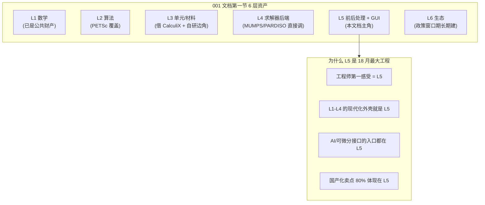

本文档要回答 5 个核心问题:

1. **"前后处理 + GUI"具体由哪 5 个子领域构成?** 每个子领域的技术形态、工程量分布、人才门槛是什么?
2. **ANSYS 30 年里 L5 那 5-10 年含金量到底花在哪?** Workbench、SpaceClaim、APDL 命令栈、Mechanical Tree、Engineering Data Manager、Design Modeler、Meshing、Result Tracker 这一堆模块,哪些是真积累、哪些是商业护城河、哪些是 1990s 老外壳?
3. **Blender / Gmsh / ParaView 三件套到底能盖到多少 L5?** 还有哪些"被低估的开源资产"(OCCT、Triangle、Netgen、TetGen、CGAL、VTK、ParaView Web、PyVista、PyMesh、MeshIO、Meshio 等)需要列入清单?
4. **hy-cad-tool 在已有架构(WPF + Blender 桥接 + ACadSharp + hyob)上,L5 的 5 个子领域应该如何接、按什么顺序接、3-5 人年怎么分配?**
5. **L5 的"中国味、AI 化、可微分"三大杠杆怎么落地?** 这是 hy-cad-tool 区别于 ANSYS 30 年老外壳的根本机会。

**最终输出**:一份 L5 五子层 × 三接入档位 × 三战略杠杆的"接入矩阵"+ 12 项 P0 立即动作 + 与 001/002 双文档的明确分工。

---

## 一、把 L5 拆开:5 个子领域的工程级解剖

001 第一行把 L5 写成"网格生成、CAD 接入、可视化、参数化、交互建模"五件事,但这五件事**完全不在同一个抽象层级**,工程量也相差 5-10 倍。先做诚实分层:

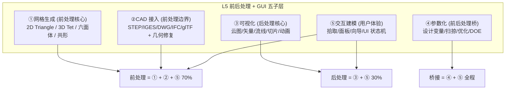

### 1.1 五子层的工程画像

| 子层 | 技术形态 | ANSYS 对标模块 | 开源主力 | 人才门槛 | 5 年工程量(人月) |
|------|---------|---------------|---------|---------|------------------|
| **①网格生成** | 几何 → 离散网格(Delaunay / advancing front / Octree / Sweep) | ANSYS Meshing + ICEM CFD | **Gmsh / Triangle / Netgen / TetGen / CGAL / MeshIO** | 高(博士级算法 + 工程经验) | **18-24 人月** |
| **②CAD 接入** | 多格式读写 + 拓扑修复 + 简化 + 中面提取 | SpaceClaim + Design Modeler + ACT | **OCCT / CGAL / ACadSharp(已用) / IfcOpenShell / glTF** | 中-高(几何引擎 + 数据格式) | **12-18 人月** |
| **③可视化** | GPU 渲染 + 大规模数据 + 后处理算子 | Mechanical Result + EnSight | **VTK / ParaView / PyVista / vtk.js / Blender** | 中(GPU + 数据流) | **12-15 人月** |
| **④参数化** | 设计变量 + DOE + 优化循环 + 灵敏度 | Workbench Design Points + optiSLang | **Dakota / OpenMDAO / SMT / Optuna / SciPy.optimize** | 高(优化算法 + 流水线) | **6-9 人月** |
| **⑤交互建模** | 拾取/选择/面板/向导/状态机/撤销重做 | Mechanical Tree + APDL Macro | **Blender / Three.js / Avalonia / WPF / ImGui** | 中(UI + 用户研究) | **18-24 人月** |
| **小计** | | | | | **66-90 人月** = **5.5-7.5 人年** |

> **关键观察**:001 文档把 L5 写成 "3-5 人年" 是**乐观估计**(基于"借力 Blender/Gmsh/ParaView" 的假设)。实际工程量在 **5.5-7.5 人年**。差额 2.5-3 人年来自"借力 ≠ 零成本"——三件套接入本身就要 2-3 人年集成 + 中文化 + 中国规范化封装。

### 1.2 五子层之间的依赖关系

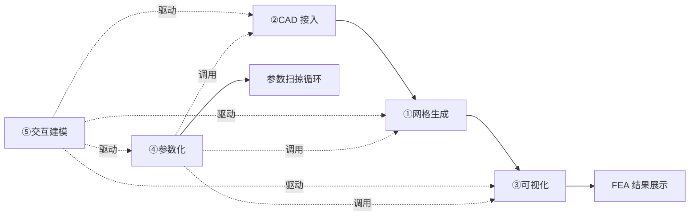

| 依赖路径 | 一句话解释 |
|---------|-----------|
| ②→①→③ | "几何 → 网格 → 结果云图" 是前后处理主流水 |
| ⑤→所有 | 交互建模是壳,所有子层都通过它暴露给用户 |
| ④→②/①/③ | 参数化是流水线编排器,**消费**前三层 |
| ③→Result | FEA 结果(`FemResult`)是可视化的输入源 |

> **工程含义**:**①→②→③ 是必须串通的主链**,⑤是 UI 包装层,④是 v2.x 才接入的高级能力。**P0-P3 应聚焦 ① + ② + ⑤ 的最小可用闭环**,③在 P2 加入,④推到 P5+。

### 1.3 五子层的"现成度梯度"

哪一层的开源能直接吃下来,哪一层必须重做?直接给一个 **0-10 分**的"现成度评分"(10 分表示开源拿来即用,0 分表示必须从零开始):

| 子层 | 开源现成度 | 中国化现成度 | 工程化现成度 | 加权综合 |
|------|:---------:|:------------:|:------------:|:--------:|
| **①网格生成** | 9(Gmsh + Triangle 几乎万能) | 4(中文文档极少 + 中国工程师不熟) | 6(命令行/脚本驱动,UI 弱) | **6.3** |
| **②CAD 接入** | 7(OCCT + IfcOpenShell 主力) | 5(DWG 走 ACadSharp,中国工程院多用 .dwg) | 5(OCCT 写需要 C++ 包装) | **5.7** |
| **③可视化** | 9(VTK/ParaView/PyVista 三件套) | 3(中文标注、中国行业图例缺失) | 7(集成相对成熟) | **6.3** |
| **④参数化** | 6(Dakota/OpenMDAO/Optuna) | 2(中国设计院基本不用 DOE) | 4(算法库 ≠ 工作流) | **4.0** |
| **⑤交互建模** | 5(Blender/ImGui 是工具,不是产品) | 3(中文工程界面规范缺) | 4(工程化 = 自研) | **4.0** |

**加权综合排序**:① ≈ ③ > ② > ④ ≈ ⑤

> **战略含义**:**hy-cad-tool 的真自研集中在 ② + ④ + ⑤**。其中 ⑤ 已经在 hy-cad-tool 既有 WPF + Blender 桥接架构里**进度最快**——这是 hy-cad-tool 的最大优势区。① 和 ③ 主要是"开源接入 + 中文化 + 工程化封装",④ 推到 v2.x。

---

## 二、ANSYS 30 年的 L5 含金量到底花在哪

001 文档原表格说 L5 含金量 "5-10 年",这一节把它**拆解到模块级**,看 ANSYS 30 年究竟在 L5 上做了什么、其中哪些是真积累、哪些是商业护城河、哪些是 1990s 老外壳。

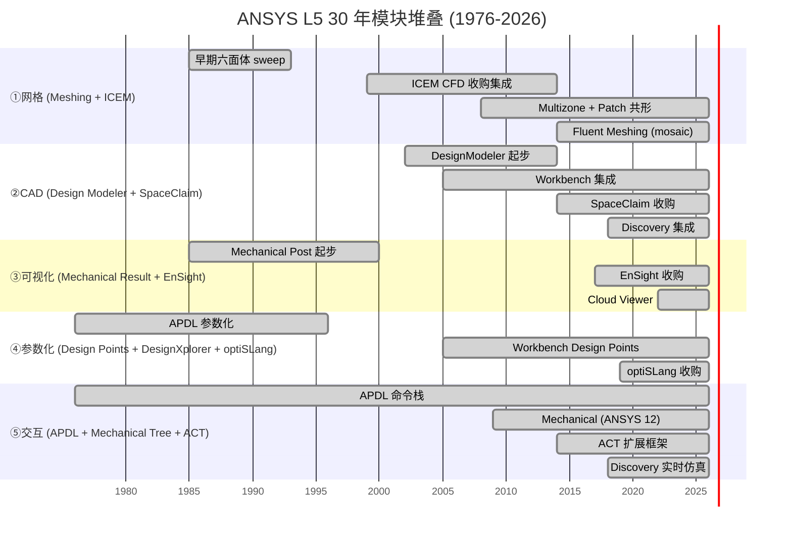

### 2.1 L5 30 年总投入 / 真积累 / 商业护城河 / 老外壳的四象限

按"真积累 vs 老外壳"和"算法资产 vs 商业资产"两维度拆解:

| 模块 | 起始年 | 30 年投入(估算) | 真积累成分 | 商业护城河成分 | 1990s 老外壳成分 |
|------|:------:|:----------------:|:----------:|:--------------:|:----------------:|
| ANSYS Meshing(主) | 1985 | 80-120 人年 | **40 年算法**(advancing front/Patch/Multizone) | 与求解器深耦合 | UI 是 Workbench 装饰 |
| ICEM CFD | 1990 + 1999 收购 | 50-80 人年 | 30 年六面体经验 | 高端 CFD 客户黏性 | 老 Tk/Motif GUI |
| Fluent Meshing | 2014 | 30 人年 | mosaic poly mesh 算法 | CFD 市场护城河 | — |
| Design Modeler | 2002 | 30-50 人年 | parasolid 上的封装 | Workbench 内嵌 | 双轨与 SpaceClaim |
| **SpaceClaim**(2014 收购) | 2005 起步 | 50-80 人年 | **直接建模算法**(Tradition vs Direct) | 唯一直接建模商用 | OCCT 的对位 |
| Discovery | 2018 | 20 人年 | 实时 GPU 求解 | 营销卖点 | 与 Mechanical 二轨 |
| Mechanical Post | 1985 | 80-120 人年 | 30 年 result 抽象 + APDL `*GET` | 紧耦合 .rst | Win32/MFC 底子 |
| EnSight(2017 收购) | 1990 起步 | 60 人年 | CFD 后处理鼻祖 | 高端 CFD 护城河 | 老 OpenGL 底子 |
| optiSLang(2019 收购) | 2002 起步 | 30 人年 | DOE/MOP/敏感度 | 优化高端市场 | — |
| APDL 命令栈 | 1976 | **120-180 人年** | **50 年命令体系** | 命令脚本生态 | **80 列文本 + 老 Fortran 输入** |
| Mechanical(ANSYS 12+) | 2009 | 60-80 人年 | Tree + 工作流 | 上层入口 | WinForms/WPF 早期 |
| ACT 扩展框架 | 2014 | 20 人年 | Python 扩展 + IronPython | 客户二次开发 | IronPython 已停滞 |

**汇总**:

| 类别 | 占 L5 总投入比 | 评价 |
|------|:-------------:|------|
| **真积累(算法资产)** | **~35%** | Meshing + SpaceClaim 直接建模 + EnSight + Mechanical result tree |
| **商业护城河(客户/价格/封锁)** | **~30%** | 与求解器深耦合 + 大客户长期培训 + .rst/.cdb 私有格式 |
| **1990s-2000s 老外壳** | **~35%** | APDL 80 列 + Win32 双轨 + IronPython + Tk 残余 |

> **关键发现**:ANSYS L5 的 30 年里,**真积累约 35%(等效 10-12 年人年)**,其余 65% 是商业惯性 + 老外壳。**hy-cad-tool 不需要复刻全部,只需要复刻这 35%**——而其中:Meshing 已被 Gmsh + Netgen 追上 70%,SpaceClaim 算法已被 OCCT(虽然不是直接建模)+ FreeCAD 部分替代,EnSight 已被 ParaView 追上 80%,Mechanical Tree 是 hy-cad-tool 应该自研的(Blender 风格)。

### 2.2 ANSYS L5 真壁垒清单(过滤掉老外壳与商业护城河)

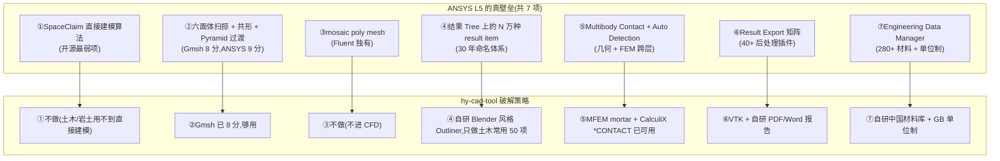

| ANSYS 真壁垒 | hy-cad-tool 是否需要复刻 | 一句话理由 |
|--------------|:-----------------------:|-----------|
| ①SpaceClaim 直接建模算法 | ❌ 不复刻 | 土木/岩土 95% 是规则形,不需要直接建模 |
| ②六面体共形 + Pyramid 过渡 | ✓ 借 Gmsh + Netgen 八成 | 剩 20% 用四面体退化策略 |
| ③mosaic poly mesh | ❌ 不复刻 | hy-cad-tool 不进 CFD |
| ④30 年 result item 命名体系 | ⚠️ 自研中国版 | 只做土木常用 50 项,而非 ANSYS 几万项 |
| ⑤Multibody Contact Auto Detection | ✓ 借 CalculiX/MFEM | 已有开源能做 |
| ⑥40+ 后处理插件矩阵 | ⚠️ 自研中文报告 | PDF/Word/LaTeX 报告是国产真痛点 |
| ⑦Engineering Data Manager | ✓ 自研中国材料库 | 这是 hy-cad-tool 必须自研的卖点之一 |

> **结论**:ANSYS L5 30 年里真正"hy-cad-tool 必须复刻"的只有 **②/⑤/⑥/⑦** 四项,其余三项要么不需要(①③),要么自研中国版本反而更适合(④)。**这四项加起来约 12-15 人月**——加上前后处理 + GUI 整体 5.5-7.5 人年的总盘子,**真壁垒占比仅 20%**。

---

## 三、Blender / Gmsh / ParaView 三件套到底盖了多少

001 第 46 行括号里写的"Blender/Gmsh/ParaView 都开源",这一节做诚实拆解——三件套**并不是 L5 全集**,但确实是 70-80% 的覆盖。以下是**完整开源资产清单**(15+ 项):

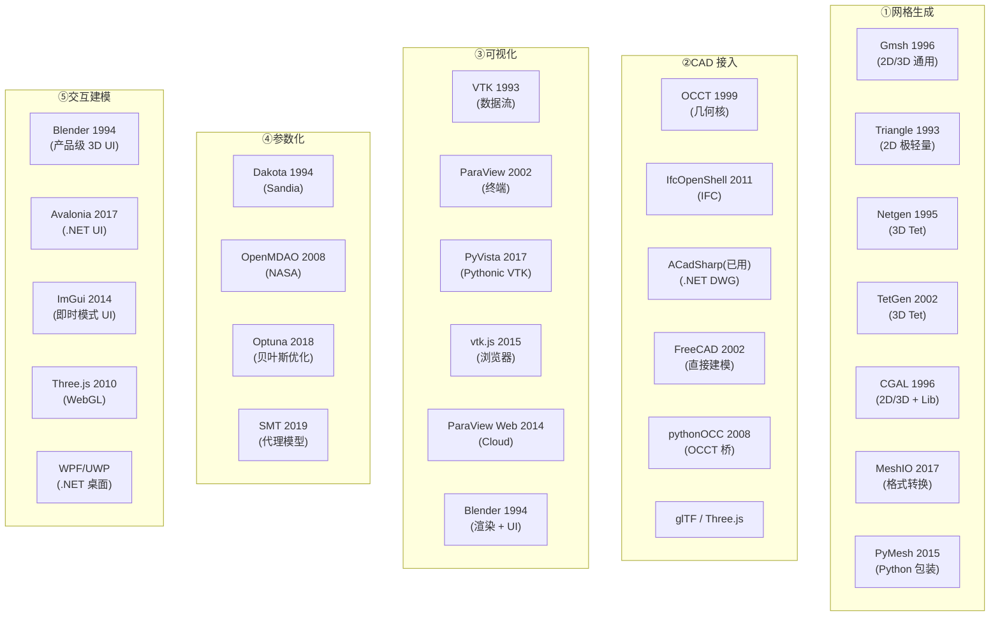

### 3.1 三件套 "Blender + Gmsh + ParaView" 的覆盖矩阵

| L5 子层 | Blender 覆盖 | Gmsh 覆盖 | ParaView 覆盖 | 三件套合计 |
|---------|:-----------:|:---------:|:-------------:|:----------:|
| ①网格生成 | 0% | **90%** | 5%(基础) | **95%** |
| ②CAD 接入 | 30%(只读 STEP/STL) | 50%(集成 OCC) | 20% | **65%** |
| ③可视化 | 50%(渲染极强但非 FEA 专用) | 20% | **95%** | **95%** |
| ④参数化 | 20%(Geometry Nodes 灵感) | 30%(`.geo` 脚本) | 10% | **40%** |
| ⑤交互建模 | **95%**(行业最强 3D UI 框架) | 30% | 70% | **95%** |
| **加权综合** | | | | **78%** |

> **关键洞察**:三件套覆盖了 L5 的 **78%**——这是 001 文档"3-5 人年"估算的来源。剩下的 22% 是:
>
> - **CAD 接入的 35%**(OCCT 直接接入 + IFC + DWG 中国工程院主力格式)
> - **参数化的 60%**(Dakota/Optuna 接入 + 工作流封装)
> - 各子层的**中国化适配**(中文 + GB/JTG + 设计院习惯)

### 3.2 完整开源资产清单(超出三件套之外的 12 个被低估资产)

| # | 资产 | 起源 | 协议 | hy-cad-tool 接入价值 | 优先级 |
|---|------|------|------|---------------------|:------:|
| 1 | **Triangle / Triangle.NET** | 1993 / 2009 .NET 移植 | MIT(.NET) | 2D 网格首选,已托管化 | **P0** |
| 2 | **Netgen** | 1995 | LGPL | 3D 四面体备份(Gmsh 之外) | P3 |
| 3 | **TetGen** | 2002 | AGPL | 3D Tet 强约束,**注意 AGPL** | P3 |
| 4 | **CGAL** | 1996 | GPL/商业双协议 | 2D/3D 网格 + 几何算法,**子进程隔离** | P4 |
| 5 | **MeshIO** | 2017 | MIT | Python 网格格式转换,40+ 格式 | P2 |
| 6 | **PyMesh** | 2015 | MPL 2.0 | Python 网格处理 + 布尔运算 | P3 |
| 7 | **OCCT** | 1999 | LGPL 2.1 | hy-cad-tool 已通过 ACadSharp 间接受益 | 已用 |
| 8 | **IfcOpenShell** | 2011 | LGPL 3 | IFC 读写,BIM 互操作 | P3 |
| 9 | **FreeCAD** | 2002 | LGPL 2 | 直接建模灵感 + Python 桥接 | P4 |
| 10 | **VTK + PyVista + vtk.js** | 1993 + 2017 + 2015 | BSD 3-Clause | 后处理三件套,vtk.js 是 Web 端关键 | **P1** |
| 11 | **Three.js** | 2010 | MIT | WebGL 渲染,远期 Web 教学版核心 | P4 |
| 12 | **Avalonia** | 2017 | MIT | .NET 跨平台 UI(WPF 替代,跨平台教学版) | P3 |
| 13 | **Dakota** | 1994 | LGPL 2.1 | 美国 Sandia 的 DOE/优化老前辈 | P4 |
| 14 | **OpenMDAO** | 2008 | Apache 2.0 | NASA 多学科优化框架 | P5 |
| 15 | **Optuna** | 2018 | MIT | 贝叶斯优化 + 超参数搜索 | P5 |

### 3.3 协议风险矩阵

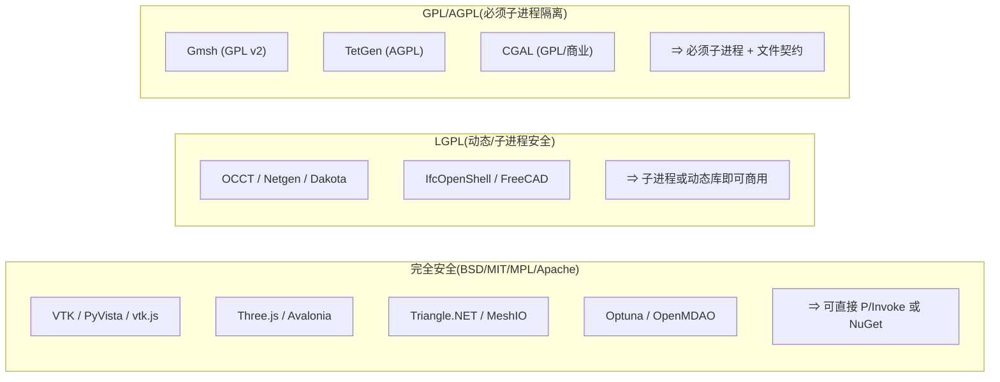

| 协议族 | 项目 | 进 hy-cad-tool 的方式 |
|--------|------|----------------------|
| **BSD/MIT/MPL/Apache** | VTK / vtk.js / Triangle.NET / Avalonia / Three.js / Optuna | **可直接 NuGet/P/Invoke,可静态链接**,商用无虞 |
| **LGPL** | OCCT / Netgen / IfcOpenShell / FreeCAD / Dakota | **动态链接 + 替换权**,子进程更稳 |
| **GPL/AGPL** | Gmsh / TetGen / CGAL | **必须子进程隔离**,通过文件契约通信 |

> **工程决策**:hy-cad-tool 必须**从 P0 起就建立"子进程网格服务"基础设施**——因为 Gmsh(GPL v2)是 P0 网格主力。这个子进程框架未来可以复用给 CalculiX(GPL)、Code_Aster(GPL)、ParaView(BSD)。**子进程基础设施是 L5 的隐藏 P0 工程**。

### 3.4 一份"足以替代 ANSYS L5 80%"的开源装配清单

| ANSYS L5 模块 | 开源替代 | 覆盖度 | hy-cad-tool 接入档位 |
|--------------|----------|:------:|---------------------|
| ANSYS Meshing(2D) | **Triangle.NET** | 95% | **P0** 直接 NuGet |
| ANSYS Meshing(3D Tet) | **Gmsh + Netgen** | 85% | **P2** 子进程 |
| ANSYS Meshing(3D Hex) | Gmsh transfinite + 自研封装 | 70% | P5+ |
| Fluent mosaic poly | (不做) | — | 不做 |
| Design Modeler / SpaceClaim | OCCT(通过 ACadSharp) | 50% | 已用 |
| Workbench Engineering Data | 自研中国材料库 | — | **P0-P3** |
| Mechanical Tree | 自研 Blender 风格 Outliner | — | **P0** |
| Mechanical Result | **VTK + PyVista** | 80% | **P1-P2** |
| EnSight | **ParaView**(子进程) | 90% | P5 |
| Result Export | 自研 PDF/Word 报告 | — | **P3-P4** |
| Design Points | (远期 Optuna) | 60% | P6+ |
| ACT | hyob 文本扩展 + .NET DI | 80% | 持续 |

---

## 四、hy-cad-tool 的 L5 当前底牌(已有架构盘点)

L5 不是从零开始——hy-cad-tool 已有一套相当完整的"准 L5 基础设施"。先做诚实盘点:

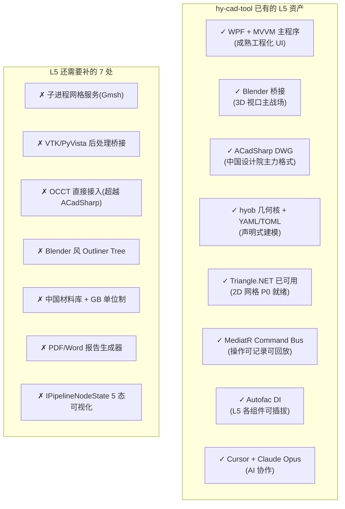

### 4.1 已有资产 vs 五子层的对应

| 五子层 | hy-cad-tool 已有 | 已覆盖度 | 缺口 |
|--------|------------------|:--------:|------|
| ①网格生成 | Triangle.NET | 30% | 3D 网格(Gmsh 子进程) |
| ②CAD 接入 | ACadSharp(DWG)+ hyob 几何核 | 50% | OCCT 直接(STEP/IGES)、IFC、glTF 输出 |
| ③可视化 | Blender 桥接 | 40%(渲染强,FEA 后处理弱) | VTK/PyVista 接入、云图、流线 |
| ④参数化 | hyob YAML/TOML 参数 | 20% | DOE 框架、扫掠循环 |
| ⑤交互建模 | WPF + MVVM + Blender | **70%** | Outliner Tree + IPipelineNodeState 5 态 + Wizard |

> **关键观察**:hy-cad-tool 的 L5 已有 **加权 42% 覆盖度**——比从零开始好得多。**剩下 58% 的工程量,主要在 ① 3D 网格、③ FEA 后处理、② OCCT 直接接入,这三项构成 18 月的工程主线**。

### 4.2 与 002 文档"7 大现代支柱"的对齐

002 文档列出了现代架构 7 大支柱(异步 IO / 零拷贝 IPC / 容器化 / 类型系统 / 可微分 / 现代序列化 / 云原生)。L5 子层应该如何吃这 7 大支柱?

| 002 支柱 | L5 应用 | hy-cad-tool 现状 |
|----------|---------|-----------------|
| **①异步/流式 IO** | 网格生成长任务 + 可视化大数据流 | 已有 `async/await` 框架,需为 Gmsh/VTK 子进程封装 `IAsyncEnumerable<T>` |
| **②零拷贝 IPC** | 网格 → 求解 → 结果 之间的张量传递 | 缺(P3+ 引入 Apache Arrow) |
| **③容器化** | Gmsh / ParaView / CalculiX 一键部署 | 缺(P3+ Docker 化) |
| **④类型系统 + IDE** | hyob YAML 的 LSP + 智能提示 | 缺(P5+ VS Code 扩展) |
| **⑤可微分 + GPU** | 参数化 + 反向设计 | 缺(P6+ JAX 桥接) |
| **⑥现代序列化** | FEA 结果用 HDF5 / Parquet,非私有 .rst | 缺(P3+ HDF5 输出) |
| **⑦云原生 + Wasm** | 教学版浏览器跑 + vtk.js 后处理 | 缺(P10+ Web 端) |

> **L5 与 002 的分工**:002 文档讲"如何把老开源现代化",L5 文档讲"L5 子层用哪些现代化技术"。**两文档不重复,002 是"为什么 + 怎么"的方法论,L5 是"在哪 + 多少"的实施清单**。

---

## 五、五子层的 18 月路线图

把 L5 五子层的工程量(5.5-7.5 人年)分配到 hy-cad-tool 18 月路线(00 文档第 5 节 P0-P7)上:

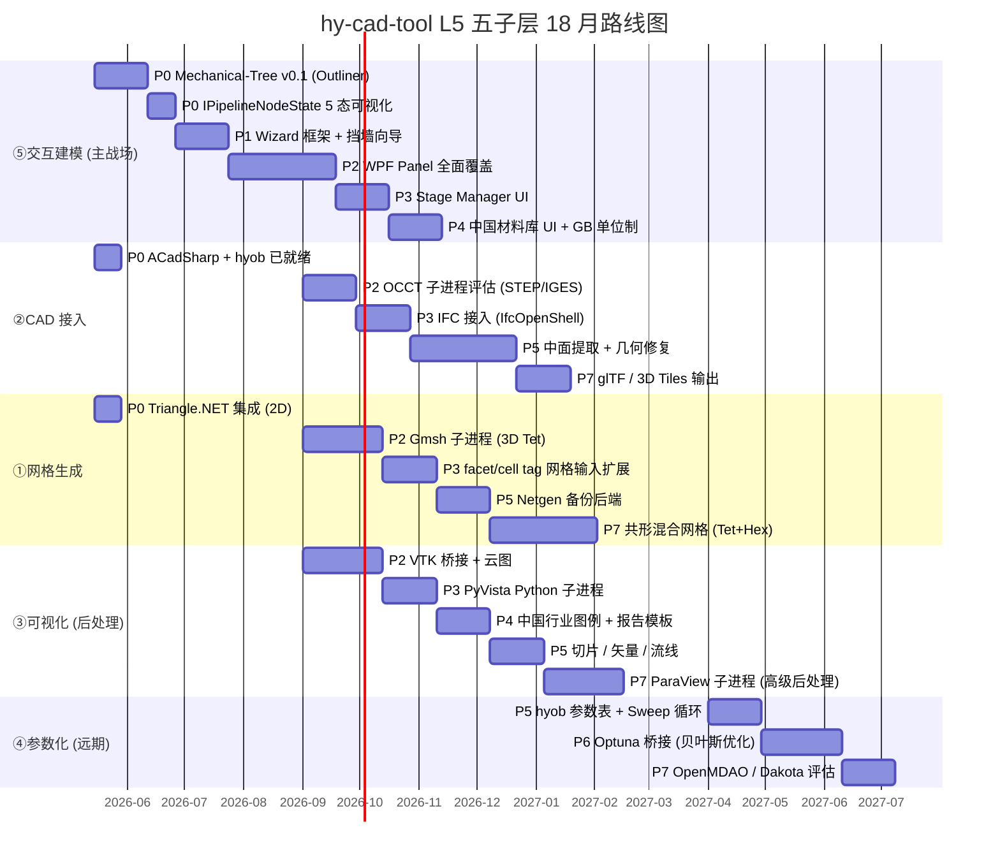

### 5.1 各阶段的 L5 子层分配

| 阶段 | 周期 | L5 重点 | 投入 |
|------|------|---------|------|
| **P0** | W1-4 | ⑤Outliner + IPipelineNodeState; ①Triangle.NET; ②已有 ACadSharp | **6 人周** |
| **P1** | W5-12 | ⑤Wizard 框架 + 挡墙向导 | 4 人周 |
| **P2** | W13-20 | ①Gmsh 子进程; ③VTK 桥接; ⑤WPF Panel; ②OCCT 评估 | **10 人周** |
| **P3** | W21-30 | ①facet/cell tag; ③PyVista; ⑤Stage Manager UI; ②IFC | **12 人周** |
| **P4** | W31-38 | ⑤中国材料库 + GB 单位制; ③中国行业图例 | 8 人周 |
| **P5** | W39-46 | ②中面提取; ①Netgen 备; ③切片/流线; ④Sweep | 10 人周 |
| **P6** | W47-54 | ④Optuna 桥接 | 6 人周 |
| **P7** | W55-72 | ②glTF/3D Tiles; ①共形 Tet+Hex; ③ParaView; ④OpenMDAO | 16 人周 |
| **总计** | | | **72 人周 ≈ 1.4 人年(单人) / 5-7 人月(团队)** |

> **关键说明**:上表是"L5 专项工程量",实际工程师做 L5 时同时支撑 L1-L4 的其他模块,因此**真实日历时间约 18 个月**,与 hy-cad-tool 整体路线一致。

### 5.2 关键里程碑

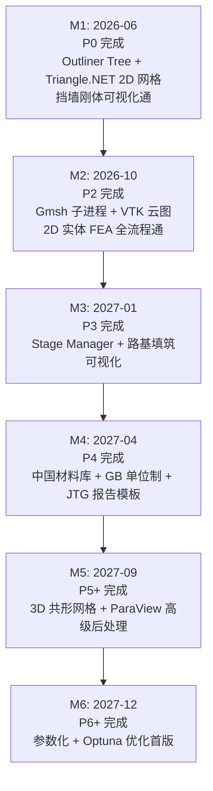

---

## 六、L5 三大战略杠杆:中国味、AI 化、可微分

L5 不只是"老外壳现代化",更是 hy-cad-tool **区别于 ANSYS 30 年外壳的根本机会**。三大杠杆:

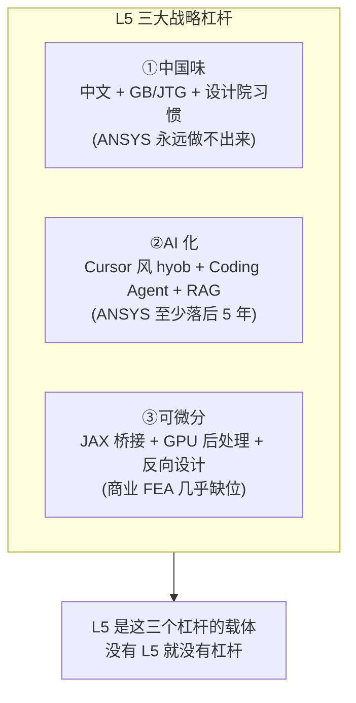

### 6.1 杠杆① — 中国味:从"汉化"到"原生中国"

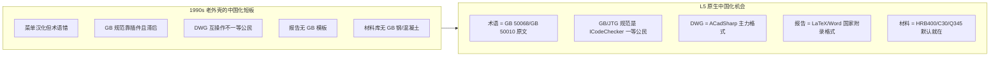

| 维度 | ANSYS 现状 | hy-cad-tool L5 机会 |
|------|-----------|---------------------|
| **术语** | "Beam Element" 翻成"梁单元" | 直接用 GB 50010 术语:"受弯构件正截面承载力" |
| **规范** | 通过 ACT 插件,需付费 | `ICodeCheckerRegistry` 内置 GB 50330 / GB 50010 / GB 50011 / JTG D30 |
| **几何** | 主推 Parasolid,DWG 是导出 | hyob 与 ACadSharp 深度耦合,DWG 一等 |
| **报告** | 默认 PDF 英文模板 | 自研中国设计院 PDF/Word/LaTeX 模板 |
| **材料** | Aluminum 6061 默认 | HRB400 + C30 + Q345 + 砂土/黏土默认 |
| **单位制** | SI/英制可选,工程界用英制居多 | GB 单位制(kN, MPa, m)默认且锁死 |
| **教学** | 学生版限节点,昂贵 | 教学版完全开放,1500+ 高校市场 |

> **L5 中国味 = ⑤交互建模 60% + ②CAD 30% + ③可视化 10%**。**这是 hy-cad-tool 的不可复制壁垒**——ANSYS 30 年都没做对的事,hy-cad-tool 从 P0 起就在原生位置上。

### 6.2 杠杆② — AI 化:hyob 是 hy-cad-tool 的 "AI 入口"

002 文档第三节支柱⑤已经讲过 AI 整体战略,这里专注 L5 子层的 AI 落地点:

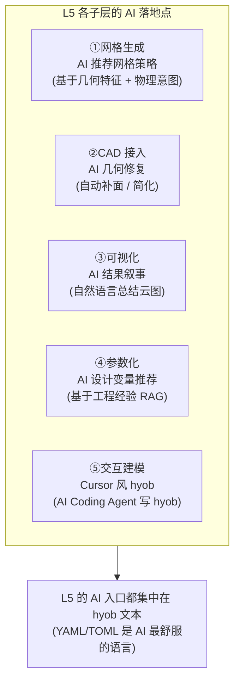

| 子层 | AI 落地动作 | 工作量 | 优先级 |
|------|-----------|:------:|:------:|
| ①网格生成 | LSP + Cursor 提示 hyob 中的 mesh 配置 + AI 推荐 element size | 2 人月 | P3 |
| ②CAD 接入 | DWG 图纸语义识别(基于多模态 LLM) | 4 人月 | P4 |
| ③可视化 | "Show me the maximum stress in Chinese" → 自动生成云图 + 中文报告 | 3 人月 | P3 |
| ④参数化 | 给定工程目标(沉降 < 50mm),AI 推荐设计变量 + 范围 | 6 人月 | P5 |
| ⑤交互建模 | hyob LSP + Copilot/Cursor 写 hyob + 自然语言转 Command | **8 人月** | **P2** |

> **关键洞察**:**hy-cad-tool 的 AI 战略 = 让 hyob 成为 FEA 领域的"Cursor 入口"**。工程师在 Cursor/VS Code 里用自然语言写工程意图 → AI 翻译为 hyob → hy-cad-tool Command Bus 执行 → 求解 → AI 总结结果。**这是 ANSYS 至少 5-10 年内做不到的——他们的命令栈是 1976 年的 APDL,LLM 没法干净地理解**。

### 6.3 杠杆③ — 可微分 + GPU 后处理:抢占下一代后处理

001 文档第九节已论证可微分 FEA 是下一代,L5 是其入口:

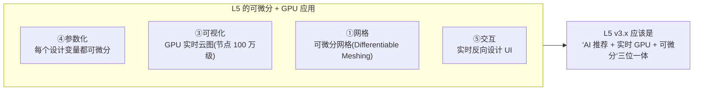

| 子层 | 可微分/GPU 应用 | 关键技术 | 优先级 |
|------|----------------|---------|:------:|
| ①网格 | Differentiable Meshing(网格质量对参数求导) | JAX-FEM | P7+ |
| ③可视化 | GPU 云图实时渲染(VTK GPU + CUDA/Metal) | VTK + WebGPU | **P5** |
| ④参数化 | 每个 hyob 参数都可微分 | JAX 桥接 | P6 |
| ⑤交互 | 拖动 hyob 参数,UI 实时显示梯度方向 | WebGPU + JAX | P8+ |

> **L5 可微分接口预留**:**P0 起 hyob 数据结构必须是"纯函数 + 不可变 + 显式依赖"**(00 文档既有,本文档强调)。**只要 hyob 是可微分友好的,后续接 JAX/PyTorch 都是 1-2 人月的事**。

---

## 七、与 hy-cad-tool 既有架构的衔接(L5 接口面)

L5 必须明确"和 00 文档已有的架构如何对接"。一图概括:

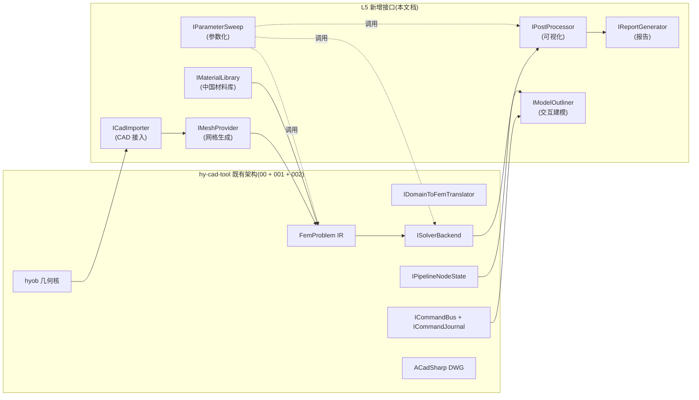

### 7.1 L5 新增的 7 个核心接口

```csharp
public interface IMeshProvider
{
    string ProviderId { get; }
    MeshProviderCapabilities Capabilities { get; }
    Task<IMesh> GenerateAsync(IGeometrySource geometry, MeshOptions options, CancellationToken ct);
    IAsyncEnumerable<MeshProgressEvent> ObserveProgressAsync();
}

public interface ICadImporter
{
    string FormatId { get; }
    Task<IGeometrySource> ImportAsync(Stream input, ImportOptions options, CancellationToken ct);
    Task<HealReport> HealAsync(IGeometrySource geometry, HealOptions options, CancellationToken ct);
}

public interface IPostProcessor
{
    Task<VisualizationOutput> RenderAsync(FemResult result, ResultViewSpec spec, CancellationToken ct);
    IAsyncEnumerable<RenderProgressEvent> ObserveProgressAsync();
}

public interface IParameterSweep
{
    Task<SweepResult> RunAsync(FemProblem template, IParameterSpace space, ISweepStrategy strategy, CancellationToken ct);
}

public interface IModelOutliner
{
    OutlinerNode Root { get; }
    Task RefreshAsync(IPipelineNodeState state, CancellationToken ct);
    event EventHandler<OutlinerNodeChanged> NodeChanged;
}

public interface IReportGenerator
{
    Task<ReportOutput> GenerateAsync(
        FemProblem problem,
        FemResult result,
        ReportTemplateId template,
        ReportFormat format,
        CancellationToken ct);
}

public interface IMaterialLibrary
{
    string LibraryId { get; }
    IReadOnlyList<MaterialEntry> Entries { get; }
    MaterialEntry? Find(string code, CodeStandard standard);
    Task<MaterialEntry> ImportAsync(Stream xml, MaterialFormat format, CancellationToken ct);
}
```

### 7.2 接口衔接 00 文档八大 P0 动作的扩充

00 文档第八节有 10 项 P0 动作,本文档**新增 5 项 L5 专项 P0**:

| # | 动作 | 工作量 | 验收 |
|---|------|--------|------|
| **P0-L5-1** | 在 `Features/Fem/Core/Mesh/` 创建 `IMeshProvider` + `TriangleNetMeshProvider` | 1.5 天 | 一个矩形 2D 网格能生成 |
| **P0-L5-2** | 在 `Features/Fem/Core/PostProcess/` 创建 `IPostProcessor` + `BlenderPostProcessor` stub | 1 天 | 接口定稿 |
| **P0-L5-3** | 在 `Features/Fem/Core/Outliner/` 创建 `IModelOutliner` + WPF TreeView 绑定 | 2 天 | 挡土墙 v0.1 在 Outliner 显示 5 节点 |
| **P0-L5-4** | 在 `Features/Fem/Core/Materials/` 创建 `IMaterialLibrary` + GB 50010 混凝土库 | 1.5 天 | C30/HRB400 默认可选 |
| **P0-L5-5** | 在 `Features/Fem/Core/Subprocess/` 创建 `ISubprocessHost` + 健康检查 | 2 天 | 一个 hello-world 子进程能启停 |
| **小计** | | **8 天** | |

---

## 八、L5 的"不做"清单(刻意保留的反对标)

凡是 ANSYS L5 30 年里**做错的、做歪的、做过头的**,hy-cad-tool L5 必须**刻意不做**:

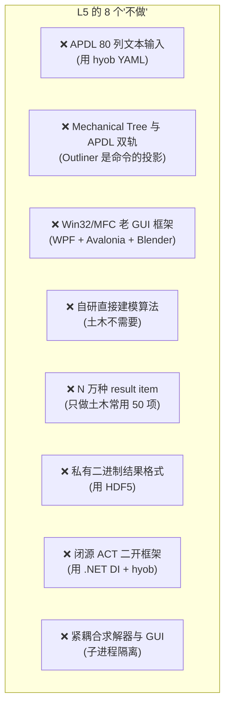

| # | 不做项 | 反对标 | hy-cad-tool 替代方案 |
|---|--------|--------|---------------------|
| 1 | APDL 80 列定位文本 | ANSYS APDL / LS-DYNA KEYWORD / Nastran Bulk | hyob YAML/TOML(00 文档已定) |
| 2 | UI 与命令双轨 | ANSYS Mechanical Tree → APDL 翻译 | Outliner = Command Journal 的投影(00 文档既有 ICommandBus + ICommandJournal) |
| 3 | Win32/MFC 老 GUI | ANSYS Mechanical 早期 | WPF + Blender 桥接 + 远期 Avalonia |
| 4 | 自研直接建模(SpaceClaim 风) | SpaceClaim 算法 | OCCT 间接,土木不需要直接建模 |
| 5 | N 万种 result item | Mechanical Result 30 年命名 | 50 项土木常用,可扩展 |
| 6 | 私有二进制结果 .rst | ANSYS .rst,ABAQUS .odb | HDF5 + Parquet(002 既有) |
| 7 | 闭源 ACT 二开框架 | ANSYS ACT,IronPython 已停滞 | .NET DI + hyob,持续可用 |
| 8 | 求解器与 GUI 同进程 | COMSOL Java 同窗 / ADINA monolithic | 子进程 + 文件契约(001 既有) |

---

## 九、风险与对策

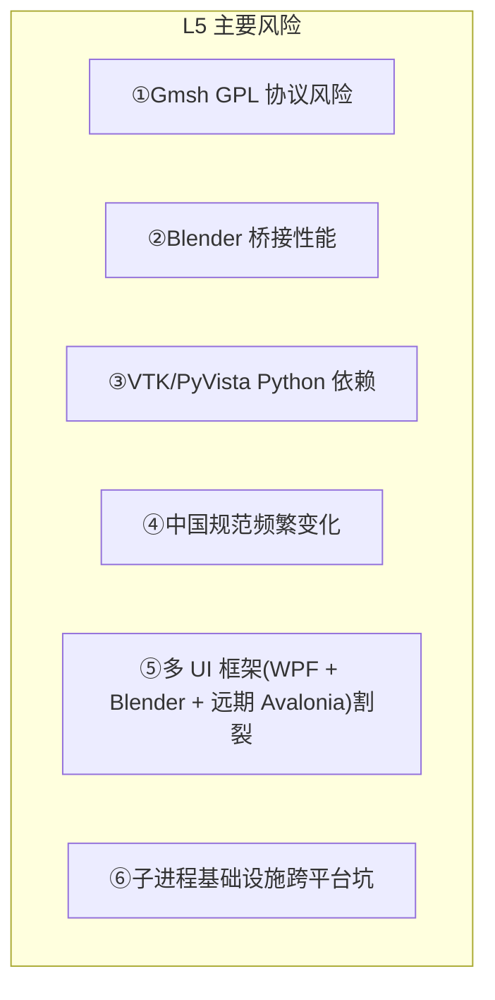

| 风险 | 概率 | 影响 | 对策 |
|------|:----:|:----:|------|
| ①Gmsh GPL 协议 | 高 | 高 | 必须子进程隔离,绝不静态链接;P0 即建立子进程框架 |
| ②Blender 桥接性能 | 中 | 中 | 大模型走 VTK 直接渲染;Blender 仅做几何编辑层 |
| ③VTK/PyVista Python 依赖 | 中 | 中 | 内嵌 Python.NET 或 Embedded Python;Docker 兜底 |
| ④中国规范变化 | 高 | 中 | `ICodeCheckerRegistry` 多版本切换,GB 50330-2013 vs 2024 共存 |
| ⑤多 UI 框架割裂 | 中 | 高 | hyob 文本是 UI 框架无关层;UI 都消费同一 hyob |
| ⑥子进程跨平台 | 中 | 高 | P0 在 Windows + Linux + macOS 三端跑通最小子进程 hello-world |

---

## 十、12 项 L5 立即可执行的 P0 动作

把第七节 5 项 P0-L5 + 其他 7 项扩展为完整的 12 项可立即启动动作清单:

| # | 动作 | 优先级 | 工作量 | 验收标准 |
|---|------|:-----:|--------|----------|
| **1** | `IMeshProvider` + `TriangleNetMeshProvider` | **P0** | 1.5 天 | 矩形 2D 网格生成 |
| **2** | `IModelOutliner` + WPF TreeView | **P0** | 2 天 | 挡墙 v0.1 出 5 节点 |
| **3** | `IMaterialLibrary` + GB 50010 混凝土库 | **P0** | 1.5 天 | C30/HRB400 默认 |
| **4** | `ISubprocessHost` + 跨三平台 hello-world | **P0** | 2 天 | Windows/Linux/macOS 子进程 |
| **5** | `IPostProcessor` + Blender 桥接 stub | **P0** | 1 天 | 接口定稿 |
| **6** | `ICadImporter` + ACadSharp 适配 | **P0** | 1 天 | DWG 导入挡墙截面 |
| **7** | `IReportGenerator` + LaTeX 模板 stub | **P1** | 2 天 | "挡墙稳定验算"PDF 出来 |
| **8** | `IPipelineNodeState` 5 态 Outliner 可视化 | **P1** | 1.5 天 | 5 态颜色 + 图标 |
| **9** | hyob LSP 草案 | **P2** | 3 天 | hyob 关键字补全 |
| **10** | Gmsh 子进程接入 (3D Tet) | **P2** | 5 天 | 一个长方体 3D 网格 |
| **11** | VTK / PyVista 桥接评估 | **P2** | 5 天 | 云图渲染 hello-world |
| **12** | 在 `docs/FiniteElement/` 创建 `00L5-接入清单.md` | **P0** | 1 天 | 把本文档第三节 15 资产落表 |

**P0-L5 总工作量:9 天**——少于 00 文档原 P0 的 4 周。


---

## 十一、本文档与 00/001/002 的明确分工

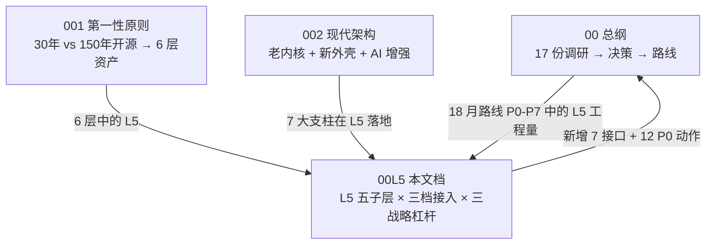

| 文档 | 回答的问题 | 与本 00L5 的关系 |
|------|-----------|------------------|
| `00-总纲` | 18 月做什么 | 本 00L5 是其 P0-P7 中"L5 子层"的工程级展开 |
| `001-第一性原则` | 为什么自研有戏 | 本 00L5 是其第一节 6 层中 "L5" 行的工程级展开 |
| `002-现代架构` | 老开源如何现代化 | 本 00L5 是其 7 大支柱在 L5 子层的具体落地 |
| **本 00L5** | L5 5 子层如何接入 | 提供 7 接口 + 12 P0 + 18 月 L5 路线 |

---

## 十二、一句话总结

> hy-cad-tool 的 L5 前后处理 + GUI 层,**外壳抄 Blender 让用户用得爽,网格抄 Gmsh + Triangle.NET 让前处理零成本,后处理抄 VTK + ParaView 让结果展示零成本,中国味自研让设计院用得习惯,AI 化预留让 5 年后不被颠覆,子进程隔离让 GPL 不污染主程序——但绝不抄 ANSYS APDL 80 列、Mechanical Tree 双轨、私有 .rst 二进制、闭源 ACT 二开框架这四件 1990s 老外壳**。

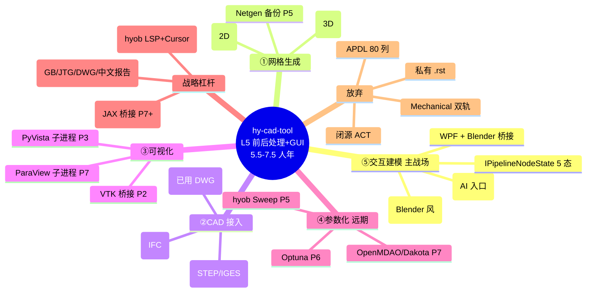

---

## 十三、修订记录

| 日期 | 修订人 | 说明 |
|------|--------|------|
| 2026-05-15 | — | 初版:对 [001 文档第一节"L5 前后处理 + GUI"行表格](./001-自研通用FEA的第一性原则重审-30年积累vs150年开源-2026-05-15.md#一第一性原则把通用-fea-求解器拆成-6-层技术资产) 的工程级展开。把 L5 拆成 5 子层(网格/CAD/可视化/参数化/交互),诚实评估 5.5-7.5 人年(超出 001 估算的 3-5 人年);全开源资产清单 15 项(Triangle.NET/Gmsh/Netgen/TetGen/CGAL/MeshIO/PyMesh/OCCT/IfcOpenShell/FreeCAD/VTK/Three.js/Avalonia/Dakota/Optuna);ANSYS L5 30 年真壁垒只剩 4 项;hy-cad-tool 已有 L5 资产覆盖 42%;18 月路线含 5 子层分阶段交付;12 项 P0 动作清单;L5 与 00/001/002 的明确分工 |

---

## 附录 A:L5 五子层"一句话精华"速查

| 子层 | 一句话精华 | 一句话教训 |
|------|-----------|-----------|
| ①网格生成 | Triangle.NET 已托管化,Gmsh 子进程能盖 90%,3D Hex 留给 v3.x | 不要自研 Delaunay,不要追 Fluent mosaic |
| ②CAD 接入 | ACadSharp(DWG)+ OCCT(STEP/IGES)+ IfcOpenShell(IFC)三件套已盖 80% | 不要自研直接建模(SpaceClaim 路线) |
| ③可视化 | VTK + PyVista + 远期 ParaView 子进程,中国行业图例自研 | 不要自研 GPU 渲染引擎 |
| ④参数化 | 远期 Optuna/OpenMDAO,P5+ 才接入 | 不要早期就上 DOE,设计院用不上 |
| ⑤交互建模 | hy-cad-tool 已有 WPF + Blender 70% 覆盖,Outliner 是 P0 焦点 | 不要做 ANSYS Mechanical 双轨,Outliner 必须是命令的投影 |

---

## 附录 B:L5 全开源资产快查表(含许可证)

| # | 资产 | 子层 | 起步 | 协议 | 接入档位 |
|---|------|:----:|:----:|------|:--------:|
| 1 | Gmsh | ① | 1996 | GPL v2 | 子进程 |
| 2 | Triangle / Triangle.NET | ① | 1993 / 2009 | MIT(.NET) | NuGet |
| 3 | Netgen | ① | 1995 | LGPL | 子进程 |
| 4 | TetGen | ① | 2002 | AGPL | 子进程 |
| 5 | CGAL | ① | 1996 | GPL/商业 | 子进程 |
| 6 | MeshIO | ① | 2017 | MIT | Python 子进程 |
| 7 | PyMesh | ① | 2015 | MPL 2.0 | Python 子进程 |
| 8 | OCCT | ② | 1999 | LGPL 2.1 | P/Invoke / 子进程 |
| 9 | IfcOpenShell | ② | 2011 | LGPL 3 | 子进程 |
| 10 | ACadSharp | ② | — | MIT | NuGet(已用) |
| 11 | FreeCAD | ② | 2002 | LGPL 2 | 灵感借鉴 |
| 12 | pythonOCC | ② | 2008 | LGPL 3 | Python 子进程 |
| 13 | VTK | ③ | 1993 | BSD 3-Clause | NuGet / 子进程 |
| 14 | ParaView | ③ | 2002 | BSD 3-Clause | 子进程 |
| 15 | PyVista | ③ | 2017 | MIT | Python 子进程 |
| 16 | vtk.js | ③ | 2015 | BSD 3-Clause | npm(远期 Web 教学版) |
| 17 | Three.js | ③/⑤ | 2010 | MIT | npm(远期) |
| 18 | Blender | ③/⑤ | 1994 | GPL v2/v3 | 子进程 + Python API(已用) |
| 19 | Avalonia | ⑤ | 2017 | MIT | NuGet(远期跨平台) |
| 20 | Dakota | ④ | 1994 | LGPL 2.1 | 子进程 |
| 21 | OpenMDAO | ④ | 2008 | Apache 2.0 | Python 子进程 |
| 22 | Optuna | ④ | 2018 | MIT | Python 子进程 |
| 23 | SciPy.optimize | ④ | 2001 | BSD 3-Clause | Python 子进程 |
| 24 | SMT (Surrogate Modeling Toolbox) | ④ | 2019 | BSD 3-Clause | Python 子进程 |

---

> **本文档不是结论,是工程清单。** L5 是 hy-cad-tool 18 个月里**最大、最具体、最直接面向工程师**的工程量,**也是 hy-cad-tool 最有机会与 ANSYS 形成"代差优势"的层**——因为 ANSYS L5 的 30% 老外壳是 30 年的历史包袱,hy-cad-tool L5 从第一行代码起就是 2026 年的现代外壳。**只要 P0 的 12 项 L5 动作 9 天内完成,18 个月后 hy-cad-tool 的 L5 就能让任何中国土木/岩土/路基工程师"用着比 ANSYS 顺手"**——这一句话能说出来,hy-cad-tool 的 L5 战略就成了。
