# ANSYS 有限元计算架构深度分析：Mechanical / Workbench / LS-DYNA

> 文档日期：2026-05-14
> 上承：[../01-全球三维有限元软件对标调研-2026-05-14](../01-全球三维有限元软件对标调研-2026-05-14.md)
> 并行：[../02-有限元通用底座架构-从挡土墙开始-2026-05-14](../02-有限元通用底座架构-从挡土墙开始-2026-05-14.md)
> 文档目的：
> 1. **不做功能罗列**，深入剖析 ANSYS 三大子系统（Mechanical 隐式求解核、Workbench 集成平台、LS-DYNA 显式求解核）的**内核架构、数据流、扩展机制**。
> 2. 抽取出可被 hy-cad-tool 借鉴的**架构模式**——以及必须警惕的**反模式**。
> 3. 对应到 hy-cad-tool 通用底座（文档 02）的具体接口、对 `IDomainToFemTranslator` / `ISolverBackend` / `AnalysisPipeline` 等抽象的影响。

---

## 一、为什么是这三个产品

ANSYS Inc.（2022 年起为 Synopsys 的目标，2024-2025 完成收购）旗下有 70+ 个产品线。把 **Mechanical、Workbench、LS-DYNA** 三者放在一起分析，是因为它们恰好覆盖了**一款现代 FEM 软件的全部架构层次**：

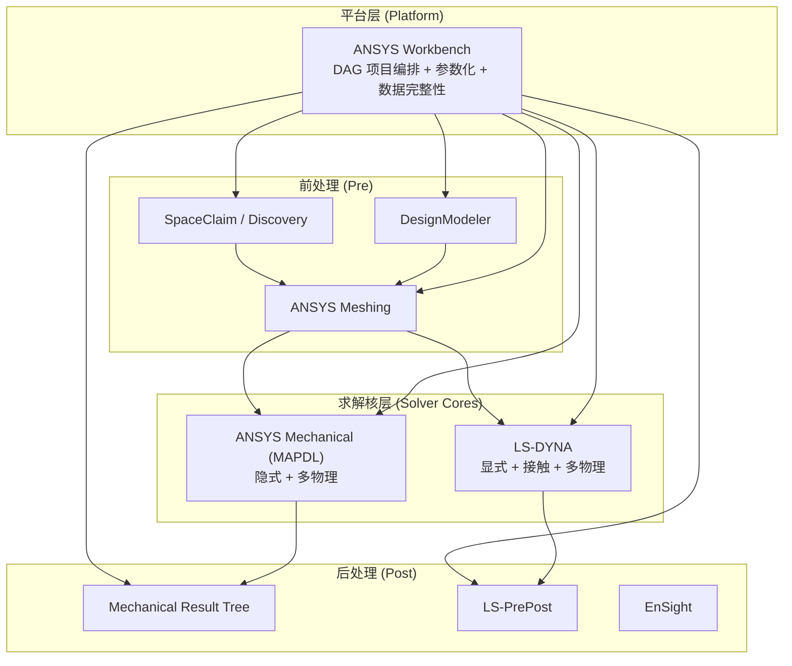

| 子系统 | 在架构上扮演的角色 | 对 hy-cad-tool 的对标价值 |
|--------|------------------|------------------------|
| **Mechanical (MAPDL)** | 30 年积累的**隐式求解核 + 命令解释器 + 数据库** | 单体内核 + 命令语言的**经典范式**，正反两面教材都齐 |
| **Workbench** | 把异构求解核包装成统一项目，**DAG 化、数据完整性、参数化** | 与 hy-cad-tool 的 `AnalysisPipeline` 直接对标 |
| **LS-DYNA** | 极端工况（碰撞、爆炸、跌落）的**显式求解核 + KEYWORD 文化** | 显示架构的极致优化路线，对 hy-cad-tool 的"输入解耦"是反向论证 |

> **关键问题**：三个产品看似都叫"ANSYS"，但实际是**三种迥异的设计哲学**被勉强缝合在一起。理解它们的接缝在哪里，比理解任何单个产品都更重要——hy-cad-tool 要做的就是**从一开始避免这些缝**。

---

## 二、ANSYS Mechanical / MAPDL 内核架构

### 2.1 起源与本质：MAPDL 是一个"命令解释器 + 内存数据库 + Fortran 求解核"

ANSYS Mechanical 的真正大脑是 **MAPDL（Mechanical APDL）**，1970 年 John Swanson 在卡内基梅隆做核电反应堆压力分析时写的代码。Workbench 的 Mechanical 应用只是**MAPDL 的 GUI 前端**——所有操作最终翻译为 APDL 命令送给 MAPDL 执行。

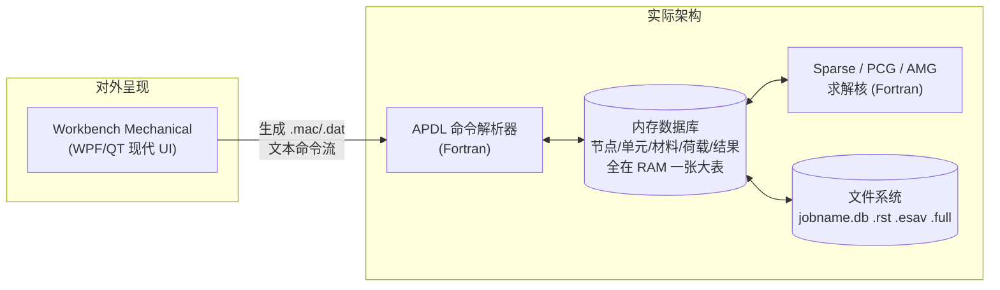

| 设计要素 | 实质 | 优 | 劣 |
|---------|------|----|----|
| **命令即接口** | 一切操作有对应 APDL，无"黑箱" UI 操作 | 可脚本、可批处理、可审计 | UI 与命令双轨，易漂移 |
| **DB-centric** | 节点/单元/材料/荷载全在一个内存数据库 | 任意时刻可 `*VWRITE` 导出 | 难分模块、并发困难 |
| **Fortran 单体** | 50 年代→90 年代演进的 fortran 77/90 | 数值稳定，编译器优化极致 | 增加单元/材料要进核心、编译 |
| **批/交互双模** | 同一引擎既能 `ansys -b` 批处理，也能交互 | 同一行为两种调用方式 | 模式切换成本高 |

### 2.2 APDL 语言：现代 FEM 的"COBOL"

APDL（ANSYS Parametric Design Language）有 5 类指令：

```ansys
! 1. PREP7 命令：建模与网格
/PREP7
ET, 1, SOLID186            ! 定义单元类型 1 为 20 节点六面体
MP, EX, 1, 2.1E11          ! 材料 1 弹性模量
N, 1, 0, 0, 0              ! 节点 1 坐标
EN, 1, 1, 2, 3, 4, 5, 6, 7, 8  ! 单元 1 拓扑

! 2. SOLUTION 命令：分析设置与求解
/SOLU
ANTYPE, STATIC
NLGEOM, ON                 ! 大变形
NSUBST, 10, 100, 5         ! 子步控制
SOLVE
FINISH

! 3. POST1 / POST26：后处理
/POST1
PLNSOL, U, SUM             ! 位移云图
*GET, MaxDisp, PLNSOL, 0, MAX  ! 提取最大值

! 4. 参数化与控制流
*DO, I, 1, 10
  E, NODE(I,0,0), NODE(I+1,0,0)
*ENDDO

! 5. 宏与函数库
*USE, MyMacro, ARG1, ARG2
```

**APDL 的关键架构含义**：

| 现象 | 架构含义 |
|------|---------|
| `/PREP7` `/SOLU` `/POST1` 之间状态切换需 `FINISH` | MAPDL 是**模式状态机**，不是 OOP 模型 |
| 所有变量隐式全局 `*GET MaxDisp, ...` | **全局状态污染**，宏复用必须用 `*ULIB`、命名前缀 |
| 命令位置敏感（`MP` 必须在 `ET` 后） | 命令的执行**依赖数据库当前状态**，没有显式依赖图 |
| 数组只到 4 维、字符串处理弱 | 1990 年代设计，**未为脚本时代准备** |

> **核心洞察**：APDL 是"过程式命令文化"的极端——**命令即模型**，但**命令的执行依赖运行时状态**。这意味着同样一段 APDL 在不同 DB 状态下结果不同，给版本管理、自动化测试带来巨大困难。

### 2.3 单元库：架构上的"200+ 单元类型"是怎么撑起来的

ANSYS 单元库有 **200+ 单元类型**（SOLID185、SHELL181、BEAM189、CONTA174…）。从软件架构看，每个单元在内部是一个 Fortran 模块，遵循统一接口：

```fortran
! ANSYS 单元在内核中的契约（伪 Fortran 描述）
SUBROUTINE ELxxx(ELEM, NODES, MAT, KEYOPT, ...,  &
                 K_LOCAL,        & ! 输出：局部刚阵
                 M_LOCAL,        & ! 输出：局部质量阵
                 F_LOCAL,        & ! 输出：等效荷载
                 STRESS,         & ! 输出：积分点应力
                 SVAR)             ! 状态变量（非线性）
```

每个单元负责：
1. 形函数与积分点
2. 局部刚阵/质量阵/荷载向量
3. 应力恢复（Stress Recovery）
4. 状态变量管理（塑性、损伤等）

**KEYOPT 机制**（KeyOption）：一个单元号可以通过 KEYOPT 切换"子行为"——例如 SHELL181 通过 KEYOPT(3)=0/2 切换"全积分/缩减积分"，KEYOPT(8)=0/2 切换"层合/层间分层应力"。

| 设计权衡 | 优 | 劣 |
|---------|----|----|
| **单元数多** | 用户能精细选择 | 用户**选错单元导致结果错误**是最常见 FEM 事故源 |
| **KEYOPT 复杂** | 一个单元覆盖多场景 | 文档负担重，新用户难定位 |
| **Fortran 单体** | 数值代码紧凑、编译优化好 | **新增单元需进核心**，不可外部插件 |

> **对 hy-cad-tool 的启示**：文档 02 中 `IElementFormulation` 接口 + `CellTopology ≠ Formulation` 的设计**已经修正了这个反模式**——单元公式是接口，可以由插件外部注入，不必触动内核。但要警惕另一个极端：接口太抽象导致**积分点优化不到位**（参考 8.1）。

### 2.4 求解器层：Sparse / PCG / ICCG / AMG / DDM

MAPDL 的求解器并非"一个",而是**一套带选择策略的求解器矩阵**：

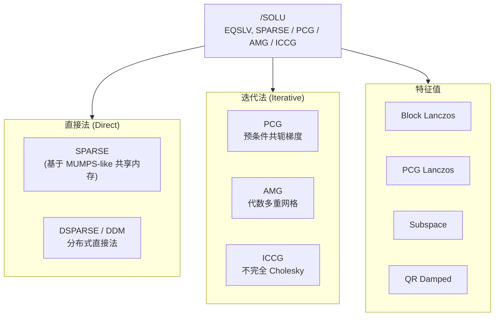

**选择逻辑**（默认 `EQSLV, SPARSE`）：

| 问题特征 | 推荐求解器 | 原因 |
|---------|-----------|------|
| < 5M 自由度、混合实体壳梁 | **SPARSE** | 多次右端项重用，鲁棒 |
| > 5M 自由度、纯实体、良态 | **PCG / AMG** | 内存友好 |
| 病态（接触、近不可压、薄壳） | **SPARSE** | 迭代不收敛 |
| 大规模特征值 | **Block Lanczos** | 数十~数百模态 |
| 接触状态变化大 | **SPARSE** + 多重启动 | 重分解代价低 |

**架构上最值得学习的一点**：MAPDL 的求解器层做了**显式的能力分级**——`EQSLV` 不是配置参数而是**一类命令**。用户/默认策略/HPC 管理员可以在不同粒度上覆盖默认值。这暗合 hy-cad-tool 文档 02 的 `ISolverBackend` 设计。

### 2.5 文件系统：内核数据持久化的"五件套"

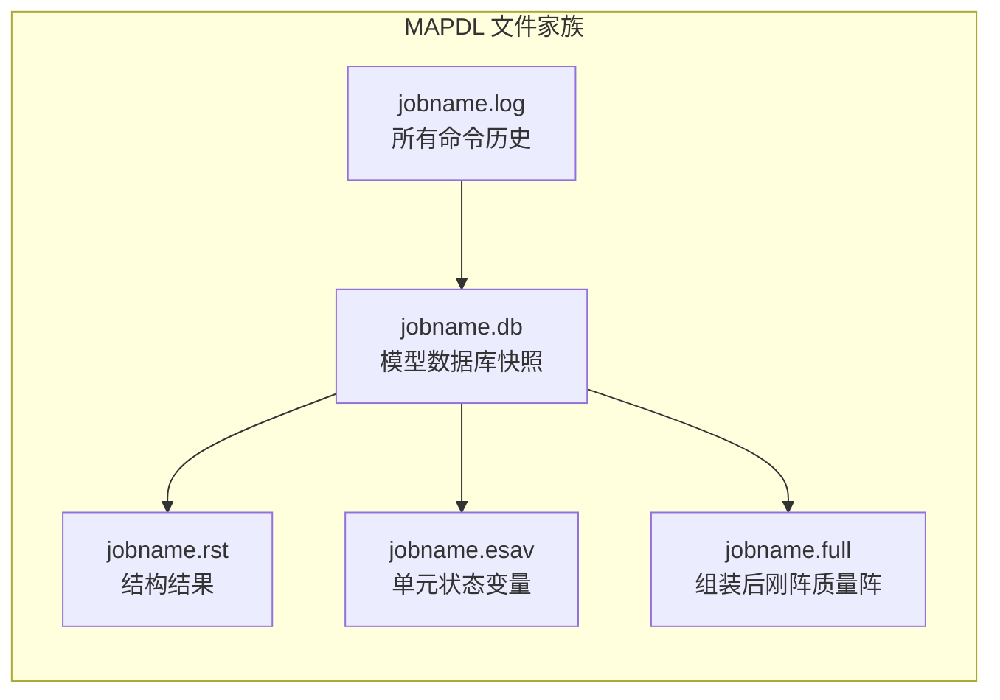

| 文件 | 内容 | 用途 |
|------|------|------|
| `.db` | 节点/单元/材料/边界全量二进制快照 | 可 `RESUME` 恢复任意时间点 |
| `.rst` | 节点位移、单元应力、反力等 | 后处理唯一数据源 |
| `.esav` | 单元状态变量（塑性、损伤、温度场） | 重启动必需 |
| `.full` | 装配后的 K、M、F 矩阵（稀疏） | 子结构、模态恢复 |
| `.log` | 文本，所有用户/Workbench 发出的 APDL | **唯一权威操作历史** |

> **架构洞察**：`.log` 文件是**唯一的事实来源（Single Source of Truth）**——只要回放 log，可以完全重现模型。这正是 hy-cad-tool 文档 02 "命令唯一原则"的最强论据。

### 2.6 扩展机制：UPF（User Programmable Features）

MAPDL 允许用户用 Fortran 写：

| UPF | 用途 | 编译方式 |
|-----|------|---------|
| `usermat.F` | 自定义材料本构 | 需重链接 ANSYS 可执行文件 |
| `userelem.F` | 自定义单元 | 需重链接 |
| `usercreep.F` | 自定义蠕变 | 需重链接 |
| `userhyper.F` | 自定义超弹 | 需重链接 |

**问题**：UPF 是**编译-链接级扩展**，不是插件。用户必须有 Fortran 编译器、ANSYS 内核源码授权（仅大客户）、重新 `ANS_ADMIN` 链接。这是**1990 年代 FEM 软件的标准做法**，但在现代软件工程视角下属于反模式。

> **对 hy-cad-tool 启示**：文档 02 的 `IMaterialModel` / `IElementFormulation` 通过 .NET DI 注册——**插件 = DLL**，不需重编译内核。这是相对 MAPDL UPF 的根本进步。

---

## 三、ANSYS Workbench：把异构内核缝成"DAG 工程"

### 3.1 Workbench 不是一个软件，而是一个"系统编排框架"

Workbench 出现于 2002 年，目的是**把 Mechanical、CFX、Fluent、HFSS、Maxwell、LS-DYNA、AUTODYN…等异构内核统一到一个项目里**。

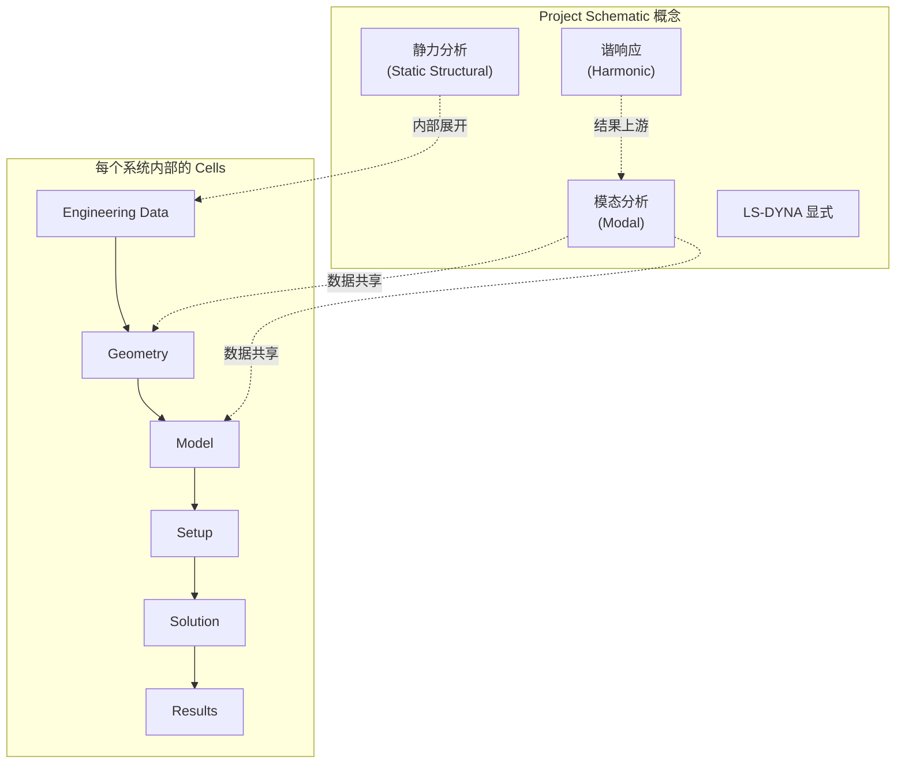

**Cell** 是 Workbench 的最小单元，每个 Cell 有：
- **类型**（Geometry / Model / Setup / Solution / Results / Engineering Data）
- **应用程序**（被双击打开的 GUI，如 SpaceClaim、Mechanical、CFD-Post）
- **数据**（指向具体文件，如 .agdb、.mechdb、.cas、.rst）
- **状态**（参考 3.3 数据完整性）

### 3.2 Workbench 的核心架构层

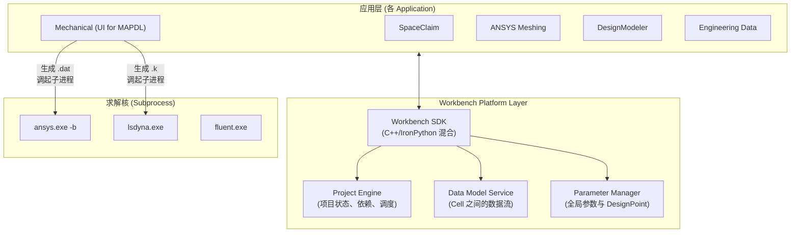

| 层 | 职责 | 实现 |
|----|------|------|
| **Project Engine** | 维护 Cell DAG、计算 Update 顺序 | C++ 内核 |
| **Data Model Service** | Cell 之间数据传递（几何 → 模型 → 设置 → 结果） | 文件 + 内存对象双轨 |
| **Parameter Manager** | 全局参数、Design Points、Sensitivity | IronPython 脚本 |
| **Application SDK** | 各应用与平台的契约（C# / IronPython） | 类似 COM 的接口 |

### 3.3 数据完整性：Workbench 最值得学习的架构

每个 Cell 的状态机：

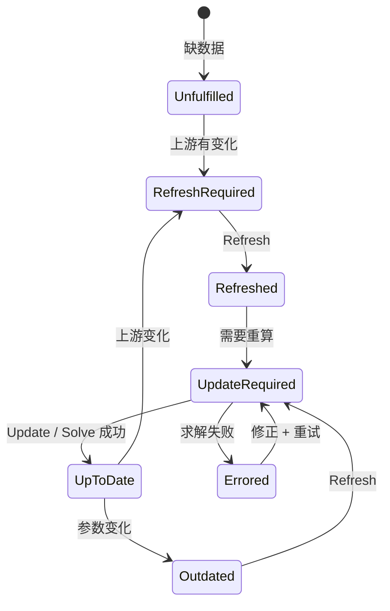

**关键状态**：

| 状态 | 含义 | UI 表现 |
|------|------|---------|
| **Up to Date** ✓ | Cell 数据与所有上游一致 | 绿色钩 |
| **Refresh Required** ↻ | 上游有变化但未传递 | 蓝色刷新图标 |
| **Update Required** ⚡ | 数据已传递但未重算 | 黄色闪电 |
| **Attention Required** ? | 缺设置 | 黄色问号 |
| **Errored** ✗ | 求解出错 | 红叉 |

**架构上**，Workbench 实现了：

1. **变更追踪**：每个 Cell 维护一个 `LastUpdateTimestamp` + `UpstreamHash`
2. **级联失效**：上游 `Geometry` 变了，`Model` 自动从 `Up to Date` → `Refresh Required`
3. **按需更新**：Update 只重新计算 `< Up to Date` 的 Cells，遵循 DAG 拓扑序
4. **断点恢复**：失败后只需重算失败 Cell 及其下游

> **对 hy-cad-tool 的启示**：这正是文档 02 中 `StaleTracker` 与 `AnalysisPipeline` 的灵感源头。**Cell 的状态机是 FEM 软件的"必修课"**——没有它，几何变了 FEM 不更新会得到错误结果（这种 bug 在 SAP2000/ETABS 中频繁出现）。

### 3.4 参数化与 Design Points

Workbench 区分两类参数：

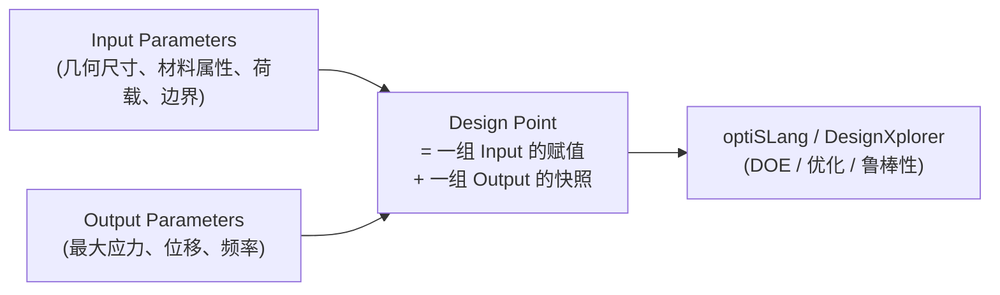

**Design Point** 的核心机制：

| 概念 | 实现 |
|------|------|
| 参数 ID | 命名为 `P1`, `P2`, …，全局唯一 |
| 参数源 | Cell 内部的"参数标记"（如几何尺寸右键 Tag As Parameter） |
| Design Point Table | Excel-like 表格，行=点，列=参数 |
| Update 策略 | 逐点 / 并行 / 远程 RSM (Remote Solve Manager) |
| 失败重试 | 单点失败不影响其余点 |

**架构启示**：Workbench 把"扫掠/优化/敏感性"做成了**与具体求解器无关的元层**——这是与文档 02 "AnalysisPipeline" 同构的概念，但 Workbench 比 hy-cad-tool 多了"参数化是一等公民"这一步。

### 3.5 Workbench 的"双轨"：APDL 与 Mechanical Tree

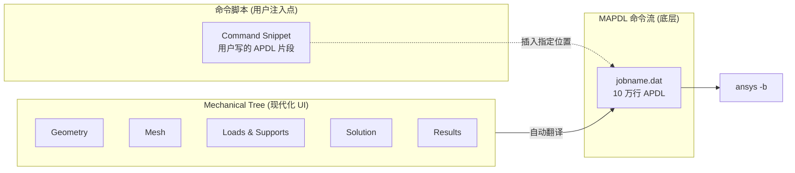

**Command Snippet** 是 Mechanical UI 上的"扩展点"——用户可以在指定的求解阶段（Pre / Solve / Post）插入手写 APDL。这是 Workbench 最强大也最危险的功能：

| 用法 | 优 | 劣 |
|------|----|----|
| 添加 UI 不支持的单元 KEYOPT | 灵活、立即可用 | 用户修改后 Mechanical Tree 不知情 |
| 自定义荷载步控制 | 比 UI 表单细 | 与 UI 设置冲突时谁优先？ |
| 提取额外结果 | 后处理免重启 | 维护成本高 |

> **架构反思**：双轨问题是 ANSYS 自己也没有完美解决的——Mechanical Tree 是"声明式 UI"，APDL 是"过程式命令"，两者通过"代码生成 + 文本注入"半同步。文档 02 的 "Command Bus 单一入口 + 数据不可变" 正是为了**从一开始就杜绝双轨**。

---

## 四、LS-DYNA：显式求解的"另一个宇宙"

### 4.1 显式时间积分对架构的强约束

LS-DYNA 由 Livermore Software（J. Hallquist 在 LLNL 开发的 DYNA3D 演化而来）发展，2018 年被 ANSYS 收购。它的内核**与 Mechanical 完全独立**——两者是"同公司不同基因"。

**显式中心差分时间积分**：

\[
\mathbf{M}\ddot{\mathbf{u}}^{n} = \mathbf{F}^{n}_{ext} - \mathbf{F}^{n}_{int}(\mathbf{u}^{n})
\]

\[
\ddot{\mathbf{u}}^{n} = \mathbf{M}^{-1}(\mathbf{F}^{n}_{ext} - \mathbf{F}^{n}_{int})
\]

\[
\dot{\mathbf{u}}^{n+1/2} = \dot{\mathbf{u}}^{n-1/2} + \Delta t \, \ddot{\mathbf{u}}^{n}
\]

\[
\mathbf{u}^{n+1} = \mathbf{u}^{n} + \Delta t \, \dot{\mathbf{u}}^{n+1/2}
\]

**为什么显式架构与隐式架构完全不同？**

| 维度 | 隐式 (Mechanical) | 显式 (LS-DYNA) |
|------|-------------------|----------------|
| **每步代价** | 解大型方程组 `K·u = F`（O(n^1.x) ~ O(n^2)） | 一次向量乘加（O(n)） |
| **稳定性** | 无条件稳定，Δt 任意 | 条件稳定，Δt ≤ Δx/c（CFL） |
| **典型 Δt** | 0.01s ~ 1s ~ 任意 | 10⁻⁶s ~ 10⁻⁸s |
| **典型步数** | 10 ~ 1000 | 10⁵ ~ 10⁸ |
| **质量矩阵** | 通常一致质量 | **必须**集中（对角）质量，否则丢失 O(n) 优势 |
| **非线性** | Newton 迭代 + 弧长 | 天然非线性（无平衡迭代） |
| **接触** | 接触状态需迭代 | 接触搜索每步做一次 |
| **架构核心** | **方程组求解器** | **向量化的单元循环 + 接触搜索** |
| **并行** | 矩阵分解的负载均衡难 | 单元/节点天然并行 |

> **决定性洞察**：**显式与隐式在架构上是两种语言**，不是"两个开关"。LS-DYNA 与 MAPDL 是两套独立的可执行文件、两套独立的数据库、两套独立的输入语法——硬接到一个 GUI（Workbench）只是表面统一。

### 4.2 KEYWORD 输入文件文化

LS-DYNA 输入文件 `*.k` / `*.key` 由"关键字段"组成：

```dyna
*KEYWORD
*TITLE
Bird Strike Simulation
*CONTROL_TERMINATION
$#  endtim  endcyc    dtmin   endeng   endmas
       0.02         0       0.0      0.0      0.0
*CONTROL_TIMESTEP
$#  dtinit   tssfac     isdo    tslim     dt2ms     lctm   erode    ms1st
       0.0       0.9        0       0.0       0.0        0        0        0
*PART
$#   pid     secid       mid     eosid      hgid      grav    adpopt      tmid
       1         1         1         0         0         0         0         0
*SECTION_SHELL
$#   secid    elform      shrf       nip     propt   qr/irid     icomp     setyp
       1         2       0.83         5         1         0         0         1
$# t1          t2          t3          t4         nloc     marea      idof   edgset
   2.0         2.0         2.0         2.0          0       0.0       0.0        0
*MAT_PIECEWISE_LINEAR_PLASTICITY
$#   mid        ro         e        pr      sigy      etan      fail      tdel
       1     7.85e-9    2.1e5      0.3     250.0    1000.0    0.3      0.0
*INITIAL_VELOCITY_NODE
$#   nid        vx        vy        vz       vxr       vyr       vzr     icid
       1     100.0       0.0       0.0       0.0       0.0       0.0        0
*END
```

**关键字文化的架构含义**：

| 特征 | 含义 |
|------|------|
| **平面文本**，可 grep/diff/git | 利于版本管理 |
| **列定位**（80 列定宽） | 1970s 卡片打孔时代的遗产 |
| **隐式数据库**：节点 / 单元 / 接触在一个文件 | 单文件易传输，但难分模块 |
| **关键字 = 类** | `*MAT_PIECEWISE_LINEAR_PLASTICITY` 是一种材料类型，等同于 OOP 中的 `class` |
| **`$#` 注释** + **`+` 续行** | 文本格式协议 |
| **无控制流** | 不像 APDL 那样有 `*DO`，`.k` 是纯声明式 |

> **对 hy-cad-tool 启示**：LS-DYNA 的 `.k` 文件其实是**最早期的"声明式 FEM 输入"**——比 APDL 更接近"配置即模型"。hy-cad-tool 的 `hyob` 应当借鉴这种**纯声明式**，但**用 YAML/TOML 摆脱列定位**。

### 4.3 单元与材料库

LS-DYNA 单元/材料命名风格：

```
*MAT_001 = *MAT_ELASTIC
*MAT_003 = *MAT_PLASTIC_KINEMATIC
*MAT_024 = *MAT_PIECEWISE_LINEAR_PLASTICITY
*MAT_054 = *MAT_ENHANCED_COMPOSITE_DAMAGE
*MAT_158 = *MAT_RATE_SENSITIVE_COMPOSITE_FABRIC
... 共 280+ 材料
```

| 类 | 数量 | 备注 |
|----|------|------|
| 单元 | ~80（实体、壳、梁、离散、ALE、SPH） | ELFORM 切换 |
| 材料 | 280+ | MID 命名密集 |
| 接触 | 50+ | 自动单/双面、tied、tiebreak |
| EOS | 30+ | 状态方程（爆炸、流体） |
| 沙漏控制 | 10+ | 关键的"数值病"修正 |

**架构关键点**：LS-DYNA 的"材料库"在内核中是 **MATxxx 子程序数组** + **dispatch 表**：

```fortran
! 伪代码：LS-DYNA 内核的材料 dispatch
SELECT CASE (MAT_TYPE)
  CASE (1);   CALL MAT001_ELASTIC(...)
  CASE (3);   CALL MAT003_PLAS_KIN(...)
  CASE (24);  CALL MAT024_PIECEWISE_LINEAR(...)
  CASE (158); CALL MAT158_FABRIC(...)
  ...
  CASE (UMAT_BASE:UMAT_MAX);
    CALL UMAT_USER(MAT_TYPE - UMAT_BASE, ...)
END SELECT
```

UMAT 通过预留的"用户材料编号区间" `*MAT_USER_DEFINED_MATERIAL_MODELS`（41-50）接入，与 ANSYS UPF 一样需要编译重链接。

### 4.4 接触算法：LS-DYNA 的"灵魂"

接触是 LS-DYNA 的核心竞争力。它在架构上由三部分组成：

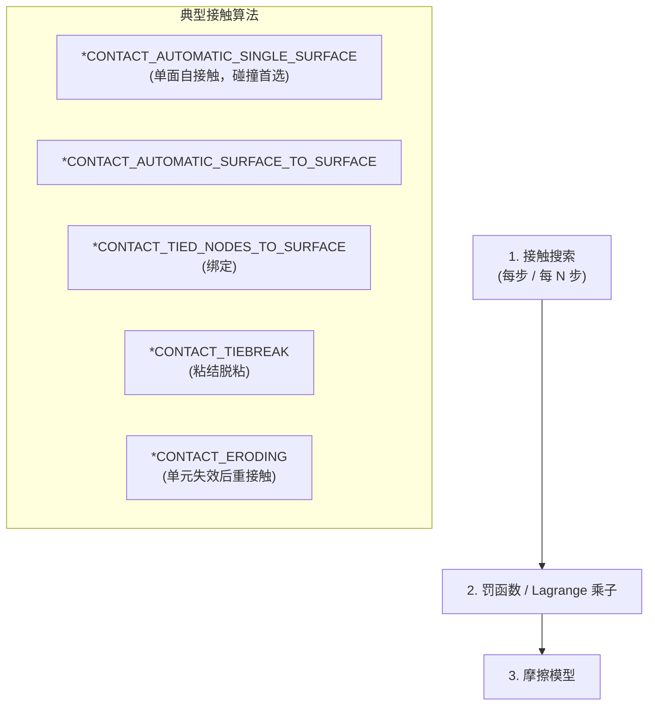

**接触搜索的数据结构**：LS-DYNA 使用 **bucket sort + binary tree** 做空间分区，每步对每个 slave 节点检查与最近 master segment 的距离。这是 LS-DYNA 的核心性能优化点。

> **对 hy-cad-tool 启示**：道路工程 95% 隐式静力（文档 01 8.5），暂不涉及显式接触，但**接触搜索的空间索引思路**对 hy-cad-tool 的几何相交查询（hyob 与 DWG 几何匹配）非常有借鉴价值。

### 4.5 沙漏（Hourglass）控制：架构上不可见但至关重要

显式 + 缩减积分（如 ELFORM=1 八节点实体的单积分点）会产生**零能模式（沙漏）**——这些模式刚阵贡献为 0，节点振荡发散。

LS-DYNA 提供 **HGID** 控制（IHQ=1~10 算法）注入"沙漏阻尼"：

```dyna
*HOURGLASS
$#  hgid     ihq        qm      ibq        q1        q2     qb/vdc        qw
       1       4       0.1        0       1.5      0.06     0.1         0.1
```

| HG 算法 | 类型 | 用途 |
|---------|------|------|
| IHQ=1 (Standard) | 粘性 | 默认，便宜 |
| IHQ=4 (Flanagan-Belytschko) | 刚性 | 大变形首选 |
| IHQ=6 (Belytschko-Bindeman) | 增强应变 | 弹塑性首选 |

**架构上**，沙漏控制是 LS-DYNA"每个单元每步都要算"的额外开销，但这是显式 + 缩减积分**绕不开的代价**。

> **对 hy-cad-tool 启示**：文档 02 的 `IElementFormulation.FormulationOptions` 应当能传递"是否启用沙漏控制 / 哪种算法"——这是单元公式的子参数，不是开关。

### 4.6 并行模式：SMP / MPP / Hybrid

LS-DYNA 的并行架构：

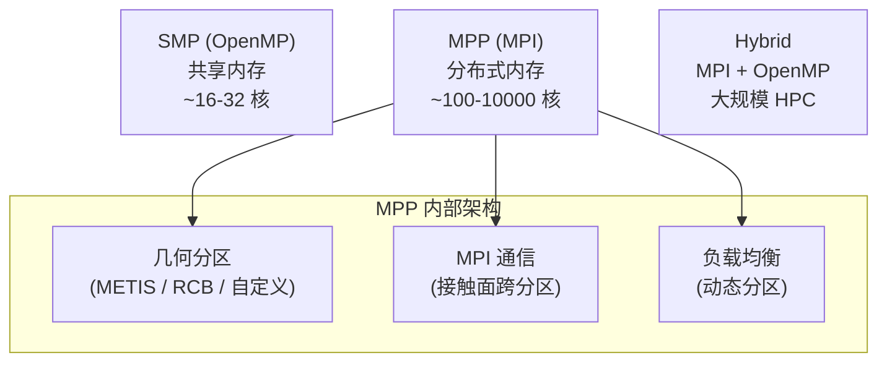

**关键架构选择**：

| 选择 | 影响 |
|------|------|
| **静态 vs 动态分区** | 接触集中的区域负载暴增，需动态再分区 |
| **接触跨分区** | MPI 通信量爆炸，分区算法必须考虑 contact |
| **结果文件聚合** | 各分区写 `d3plot.dxx`，后处理时合并 |

> **对 hy-cad-tool 启示**：hy-cad-tool 是单机桌面应用，并行只在求解器层（CalculiX MPI），但**架构上要预留"模型分区可序列化"**——这是远期 HPC 路线的入口。

### 4.7 Restart 机制

LS-DYNA 的 **`d3dump` / `runrsf`**（运行重启动文件）是工业级仿真的关键：

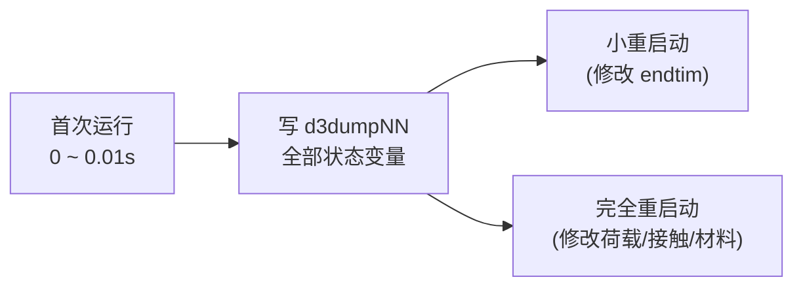

| 类型 | 可修改 |
|------|--------|
| **Small Restart** | endtim、dtmin、阻尼、删除接触 |
| **Full Restart** | + 新增/删除单元、新增荷载、新增接触 |

> **对 hy-cad-tool 启示**：道路工程的**施工阶段分析**本质就是"分阶段 Restart"——每阶段加层填筑后从上阶段的位移/应力状态继续算。文档 02 应增加 `IAnalysisStateSerializer` 接口，对标 LS-DYNA d3dump。

---

## 五、三者集成：Workbench 如何把 Mechanical 与 LS-DYNA 缝合

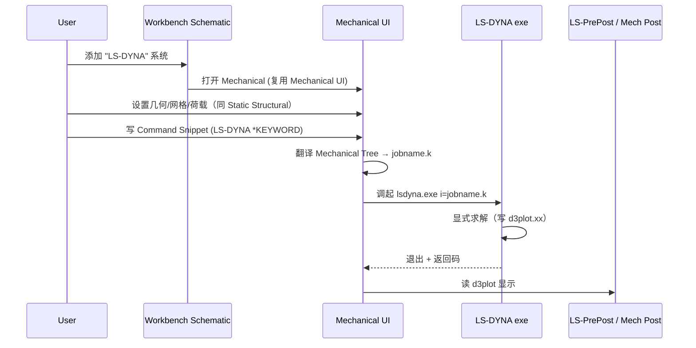

**接缝点**：

| 接缝 | 实现方式 | 风险 |
|------|---------|------|
| Mechanical Tree → `.k` | 代码生成器（C++/Python） | UI 表达力不足时需 snippet |
| 网格 → `.k` | 节点/单元直接序列化 | 几乎无损 |
| 材料 → `*MAT_xxx` | 1:1 映射 + KEYOPT 翻译 | LS-DYNA 材料 ID 与 Mechanical 不一一对应 |
| 接触 → `*CONTACT_*` | 类型映射表 | LS-DYNA 接触参数远多于 Mechanical UI 暴露 |
| 结果回读 | Mech 内置 d3plot 读取 | 部分 LS-DYNA 特有结果不显示 |

**架构启示**：Workbench + LS-DYNA 的集成证明了**"统一 GUI + 异构求解核"是可行的，但代价是 UI 必然成为最低分母**——若想用尽求解核能力，最终都要回到原生输入文件（这是 LS-PrePost 至今仍存在的根本原因）。

---

## 六、ANSYS 三大架构模式提炼

回到核心问题：从 ANSYS 三大子系统**抽取**出来的、**可被 hy-cad-tool 借鉴**的架构模式是什么？

### 6.1 模式 ①：命令是接口 (Command as Interface)

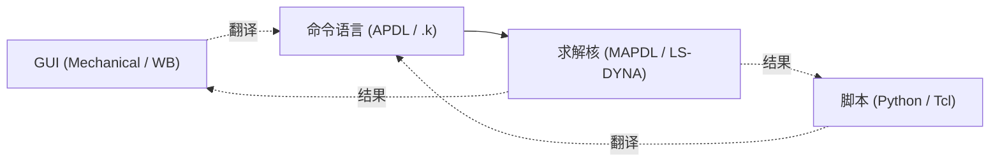

| 优点 | 缺点 |
|------|------|
| 一切操作可审计、可回放、可批处理 | 命令必须先行，UI 是其投影 |
| 测试用例 = 命令序列 | 命令格式僵化（APDL / KEYWORD 都是 1980s 设计） |

**hy-cad-tool 对应**：文档 02 的 **Command Bus 单一入口** + `hyob` 文本格式 = 现代版"命令即接口"。

### 6.2 模式 ②：内存数据库 + 文件持久化（Database-Centric）

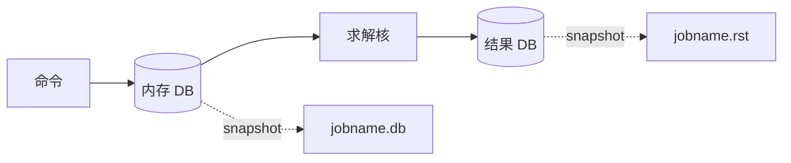

| 优点 | 缺点 |
|------|------|
| 所有操作有统一作用对象 | 并发难，多用户难 |
| 任意时刻可序列化 | 内存上限即模型上限 |
| 命令实现简单（操作 DB） | 数据耦合度高 |

**hy-cad-tool 对应**：文档 02 的 `FemProblem` IR + 不可变 record + `IrRevision` 版本号 = **现代化的数据库中心**——但用**不可变快照 + 版本号**替代"可变 DB"，规避并发难题。

### 6.3 模式 ③：DAG 项目模型（Workbench Schematic）

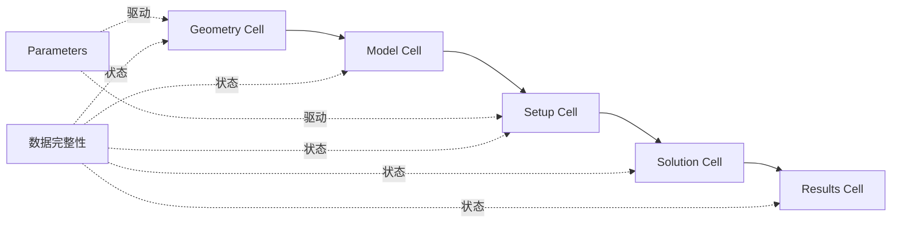

| 优点 | 缺点 |
|------|------|
| 用户看见全流程结构 | DAG 节点粒度难选 |
| 数据完整性自动追踪 | 用户难理解 "Refresh" vs "Update" |
| 参数化天然集成 | 实现复杂度高 |

**hy-cad-tool 对应**：文档 02 的 `AnalysisPipeline` + `StaleTracker` = Workbench DAG 的精神继承。

### 6.4 模式 ④：求解器作为子进程（Solver as Subprocess）

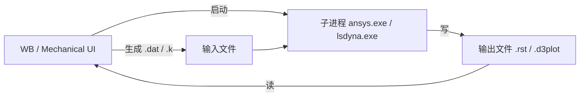

| 优点 | 缺点 |
|------|------|
| 求解器崩溃不连累 UI | 启动慢、状态难传递 |
| 求解器可远程 (RSM) | 长时仿真的实时反馈难 |
| 求解器可替换 | 文件协议成为事实接口 |

**hy-cad-tool 对应**：文档 02 的 `ISolverBackend` + "CalculiX 子进程"路线 = 直接复刻这个模式。

### 6.5 模式 ⑤：插件化（但 ANSYS 做得不够好）

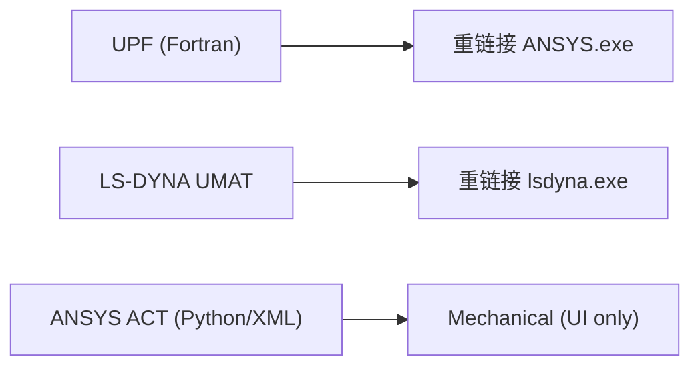

| 扩展类型 | 优点 | 缺点 |
|---------|------|------|
| UPF | 性能极致 | 需源码授权 + 重编译 |
| ACT | 不重编译 | 仅 UI 层，不触及求解核 |

**hy-cad-tool 对应**：文档 02 的 `IElementFormulation` / `IMaterialModel` / `ICodeChecker` = 通过 .NET DI 注册，**插件 = DLL，不需重编译**——这是相对 ANSYS UPF 的代际进步。

---

## 七、对 hy-cad-tool 通用底座的具体启示

把以上模式映射回文档 02 的五层架构：

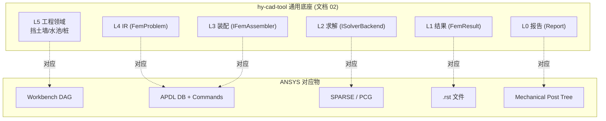

### 7.1 应吸收的设计

| ANSYS 做法 | hy-cad-tool 该如何吸收 | 新增/确认的接口 |
|-----------|---------------------|---------------|
| **`.log` 命令历史** = SoT | 所有命令必走 Command Bus 且持久化 `commands.jsonl` | `ICommandJournal` |
| **`.rst` 结果文件** | `FemResult` 应可序列化 + 版本化 | `IResultStore` |
| **Cell 状态机** | `AnalysisPipeline` 节点状态 + 上游 hash | `IPipelineNodeState` |
| **EQSLV 显式求解器选择** | `ISolverBackend` 有 Capability 枚举与策略选择 | `ISolverSelectionPolicy` |
| **Restart 文件** | 施工阶段分析必备 | `IAnalysisCheckpoint` |
| **Design Points** | 参数化驱动多次求解 | `IDesignPointSweep` |
| **Command Snippet 注入点** | 高级用户在 IR 翻译后期注入自定义片段 | `IIrPostProcessor` |
| **数据完整性级联失效** | 文档 02 已有 `IrRevision`，需扩展为整 Pipeline | `IStaleTracker` |
| **KEYWORD 纯声明式输入** | `hyob` 用 YAML/TOML，纯声明 | `hyob` 现有方案 |
| **MAT_USER 预留区段** | `IMaterialModel` 允许第三方注册新 ID | DI 注册 |

### 7.2 应避免的反模式

| ANSYS 反模式 | hy-cad-tool 反向选择 |
|-------------|--------------------|
| **APDL / Mechanical Tree 双轨漂移** | 单一 Command Bus，UI 仅是命令的投影 |
| **全局可变 DB（`*GET MaxDisp`）** | `FemProblem` / `FemResult` 全部 immutable record |
| **UPF 重编译扩展** | DI 注册插件 DLL |
| **APDL 状态机模式（`/PREP7` / `/SOLU`）** | 不引入模式切换，所有操作直接作用于不可变 IR |
| **隐式与显式两套独立内核** | 通过 `ISolverBackend` 抽象，隐式优先，显式仅作能力位 |
| **列定位文本格式（KEYWORD 80 列）** | `hyob` 用 YAML/TOML，零格式锁死 |
| **UI 是最低分母（功能必走 Snippet）** | 优先扩展 IR + 翻译器，避免给"自定义命令片段"留口子 |
| **求解器 ID 命名（MAT_024 / SHELL181）** | 用语义化 ID（`PlaneStressQ4`、`MohrCoulomb`），不用数字编号 |

### 7.3 三大架构原则的"硬"约束

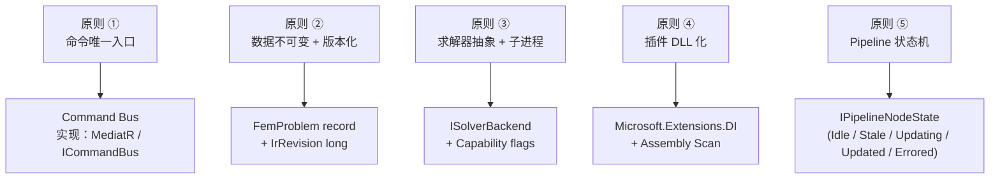

---

## 八、风险与陷阱（ANSYS 走过的坑）

### 8.1 抽象太薄 vs 抽象太厚

| 倾向 | ANSYS 案例 | 后果 |
|------|-----------|------|
| **抽象太薄** | APDL：单元、材料、求解器全是命令，没有 OOP 抽象 | 新增能力侵入核心 |
| **抽象太厚** | ACT (ANSYS Customization Toolkit)：XML + Python 描述 UI 扩展 | 只能扩展 UI，不能扩展计算 |

> **hy-cad-tool 平衡点**：`IElementFormulation` 抽象到"接口 + 局部刚阵"，**不要**抽象到"形函数模板类型"——后者会让积分点优化变难。

### 8.2 全局状态污染

APDL 的 `*GET` 抓取**当前 DB 状态**——这意味着同一段宏在不同上下文中行为不同。这是 ANSYS 用户报告"宏复用难"的根源。

> **hy-cad-tool 规避**：所有"提取"操作必须显式传入 `FemResult` 参数，不允许"隐式当前结果"。

### 8.3 显式与隐式架构不能强行统一

Workbench 的"Static Structural" 与 "LS-DYNA" 系统**共享 UI 但内核完全分离**——这是务实的妥协，但代价是用户切换时仍需重新设置接触、阻尼、时间步。

> **hy-cad-tool 建议**：道路工程 95% 隐式，**显式作为 v2.x 的能力位**，不强行统一 IR；显式 IR 应单独命名为 `ExplicitDynamicsProblem`。

### 8.4 参数化与多物理的组合爆炸

Workbench 允许"参数 × Design Points × 多物理耦合 × 多荷载工况"任意组合，但当组合数超过 1000 时调度极复杂。ANSYS 用 **Remote Solve Manager (RSM)** 单独承接。

> **hy-cad-tool 规避**：参数扫掠在 v1.x 限制为 ≤ 100 点，并行做单机 N 核；> 100 点路线推迟到 v3.x。

### 8.5 文件格式锁死

ANSYS `.db` / `.rst` 都是**未公开的二进制格式**——其他软件读它需要 ANSYS 提供的 reader DLL。这给互操作设置了门槛（既保护了 ANSYS，也限制了用户）。

> **hy-cad-tool 选择**：`hyob` 是 YAML/TOML 文本，`FemResult` 持久化考虑 **HDF5 + 公开 schema**（参考 VTK / XDMF），主动开放生态。

---

## 九、与 hy-cad-tool 现状的对照表

将本文档的架构洞察对照文档 02 已有的设计：

| 文档 02 既有设计 | ANSYS 对应物 | 已对齐？ | 待补充 |
|-----------------|-------------|---------|--------|
| `FemProblem` 不可变 record | APDL DB（可变）→ 不可变化 | ✓ 已超越 | — |
| `IElementFormulation` 接口 | UPF userelem.F | ✓ 已现代化 | — |
| `ISolverBackend` 抽象 | EQSLV 命令 | ✓ 已对齐 | 需补 `Capability` 标志枚举 |
| `IDomainToFemTranslator` | Mechanical Tree → .dat 翻译 | ✓ 已对齐 | 多 Translator 路由策略需明确 |
| `IrRevision` 版本号 | jobname.db 时间戳 | ✓ 已对齐 | — |
| Command Bus（隐含） | APDL `.log` 文件 | △ 部分 | 需显式 `ICommandJournal` |
| `AnalysisPipeline`（隐含） | Workbench Schematic | △ 部分 | 需补 `IPipelineNodeState` 状态机 |
| `IResultRecorder`（文档 01） | RST 文件 + Mechanical Post | △ 部分 | 需补持久化 schema |
| 施工阶段分析（隐含） | LS-DYNA Restart | × 缺失 | 新增 `IAnalysisCheckpoint` |
| 参数化扫掠 | Workbench Design Points | × 缺失 | 推迟 v2.x：`IDesignPointSweep` |
| 显式动力（道路工程暂不） | LS-DYNA | × 缺失 | v3.x 再议 |

---

## 十、立即可执行的对标动作

| 优先级 | 动作 | 对标对象 | 工作量 | 输出 |
|--------|------|---------|--------|------|
| **P0** | 在文档 02 中显式补充 `ICommandJournal` 接口 | APDL .log | 0.5 天 | docs/FiniteElement/02 补丁 |
| **P0** | 在文档 02 中显式补充 `IPipelineNodeState` 状态机 | Workbench Cell | 1 天 | docs/FiniteElement/02 补丁 |
| **P1** | 撰写"文档 02—施工阶段分析与 Checkpoint"专题 | LS-DYNA Restart | 2 天 | docs/FiniteElement/02-stage.md |
| **P1** | 起草 `ISolverBackend.Capability` 枚举 | EQSLV / NLGEOM / 接触能力 | 1 天 | 代码原型 |
| **P2** | 评估 CalculiX `.inp` 子集 vs hyob 翻译 | ABAQUS / CalculiX | 1 周 | 翻译器原型 |
| **P2** | 起草 `IDesignPointSweep` 接口（v2.x 预留） | Workbench DPs | 2 天 | 接口草案 |
| **P3** | 撰写"文档 03—隐式 vs 显式：何时引入显式" | LS-DYNA | 1 周 | docs/FiniteElement/03 |

---

## 十一、参考资料

- **ANSYS Mechanical**
  - *ANSYS Mechanical APDL Theory Reference*（理论手册，~2000 页）
  - *ANSYS Mechanical APDL Command Reference*（APDL 全集）
  - *ANSYS Mechanical APDL Programmer's Reference*（UPF/UEC）
  - Saeed Moaveni, *Finite Element Analysis: Theory and Application with ANSYS*, 4th ed.
- **ANSYS Workbench**
  - *ANSYS Workbench User's Guide*
  - *ANSYS Workbench Scripting Guide*（IronPython API）
  - *ACT Developer's Guide*
- **LS-DYNA**
  - J.O. Hallquist, *LS-DYNA Theory Manual*（理论手册，~900 页）
  - *LS-DYNA Keyword User's Manual Volume I/II/III*
  - T. Belytschko, W. Liu, B. Moran, *Nonlinear Finite Elements for Continua and Structures*
  - *LS-PrePost Online Documentation*
- **架构与设计哲学**
  - Bathe K.J., *Finite Element Procedures*（隐式 vs 显式的理论根基）
  - Hughes T.J.R., *The Finite Element Method: Linear Static and Dynamic FE Analysis*
  - ANSYS Innovation Conference 历年讲稿（架构演进证据）
- **对标方法论**
  - `docs/01-全球三维有限元软件对标调研-2026-05-14.md`（本系列上游）
  - `docs/02-有限元通用底座架构-从挡土墙开始-2026-05-14.md`（hy-cad-tool 目标架构）

---

## 修订记录

| 日期 | 修订人 | 说明 |
|------|--------|------|
| 2026-05-14 | — | 初版：Mechanical 内核架构 + Workbench DAG 平台 + LS-DYNA 显式架构三剖面 + 五大架构模式 + hy-cad-tool 11 项启示与 7 项立即行动 |
