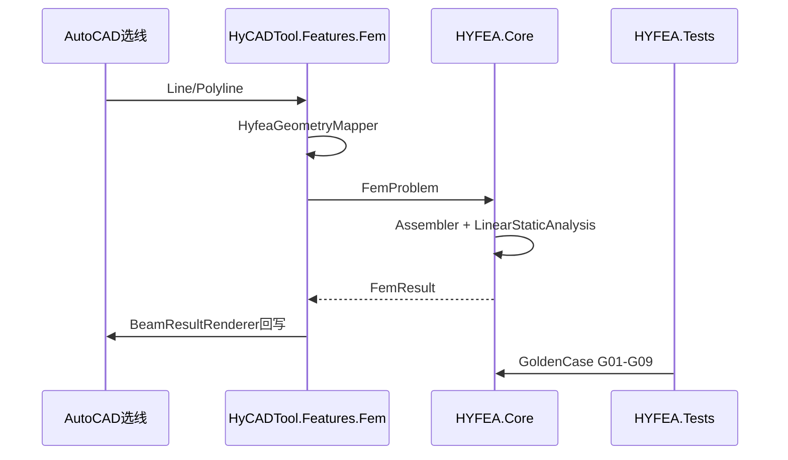

# 项目架构

## 项目目标

**HYFEA** 是 hy-cad-tool 的有限元计算内核，长期遵循「算法与外壳分离 + 算法模块化 + 双轨可替换」三大原则；短期目标是**挡墙单位宽度梁元 MVP + 金标准证明正确**。

> 高度抽象多年路线见 [Plan/00-HYFEA总体计划](Plan/00-HYFEA总体计划-高度抽象框架与多年路线-2026-05-17-150400.md)。

## 技术栈

##

| 层级       | 技术                                      | 说明                                                     |
| -------- | --------------------------------------- | ------------------------------------------------------ |
| 算法内核     | HYFEA.Core（netstandard2.0）              | 平台无关 FEM 求解                                            |
| 宿主抽象     | HYFEA.Hosting（netstandard2.0）           | IFemHostGeometry / IFemResultSink / BeamProblemFactory |
| 独立测试壳    | HYFEA.Shell（Avalonia / net8.0-windows）  | 脱离 AutoCAD 测交互（阶段 1.5）                                 |
| 结果可视化    | HYFEA.Viz + PyVista/trame 边车（vtk.js 兜底） | VTU 契约；变形叠加/探针/动画（008 V2）                              |
| 共用几何     | HyCAD.Geometry（netstandard2.0）          | 平面几何，内核与宿主共用                                           |
| 测试       | HYFEA.Tests（net48 + xUnit）              | 金标准算例与单元测试                                             |
| CAD 宿主外壳 | HyCADTool.Features.Fem                  | AutoCAD 命令、WPF 面板、几何桥接                                 |
| 热重载      | ReCall C2/C1                            | 开发联调，N7 → HyFeaBeamMvpCommand                          |

## 三大不可变原则

### ① 算法与外壳分离

`HYFEA.Core` 是纯算法内核，不依赖任何宿主。AutoCAD 适配、WPF 面板、报告生成、ReCall 热重载均属于外壳层，在 `HyCADTool` 侧实现。

**工程约束**：`HYFEA.Core` **永不可引用** `Autodesk.AutoCAD.*` / `System.Windows.*` / `HyCADTool.*` / `ReCall`。

**允许**：引用同仓库平台无关共用库（当前 `HyCAD.Geometry`）。

### ② 算法模块化

FEM 流程切成可独立替换的模块（模型 / 网格 / 单元 / 材料 / 装配 / 求解 / 分析 / 结果 / 验证）。每个模块输入输出有明确类型，可被符合契约的实现替换。

> 模块边界详见 [Plan/01-算法模块划分调研](Plan/01-算法模块划分调研-HYFEA内核与适配集成边界-2026-05-17-152100.md)。

### ③ 双轨可替换

每个模块同时支持两个轨道，共享同一份接口契约：

* **Track A**：开源装配（AI 推荐接入现成项目）

* **Track B**：平行自研（C# 重写，工程主权）

> 完整机制见 [Research/004-双轨可替换模块机制设计](Research/004-双轨可替换模块机制设计-MVP装配+平行自研+多标准评估自动晋升-2026-05-17.md)。

## 模块划分

```text
hy-cad-tool/
├── src/HyCAD.Geometry/                 # 共用平面几何
├── src/HYFEA/
│   ├── HYFEA.Core/                     # 算法主体
│   ├── HYFEA.Hosting/                  # 宿主抽象（CAD / Shell 共用）
│   ├── HYFEA.Viz/                      # ResultMesh + VTU（无 UI）
│   ├── HYFEA.Shell/                    # Avalonia 独立测试壳
│   ├── HYFEA.Tests/                    # 金标准与单元测试 |
│   ├── HYFEA.Examples/                 # 可执行示例
│   ├── HYFEA.Adapters.*/               # 预留：外部内核适配
│   └── HYFEA.Benchmarks/               # 预留：性能基准
└── src/HyCADTool/
    └── Features/Fem/                   # CAD 外壳层
        ├── Integration/                # AutoCAD ↔ HYFEA 桥接
        ├── Commands/                   # CAD 命令入口
        └── Views/                      # 面板与对话
```

## 数据流 / 交互



## 关键架构决策

##

| 决策      | 选择                              | 理由                              | 日期         |
| ------- | ------------------------------- | ------------------------------- | ---------- |
| 内核位置    | 同仓库 src/HYFEA/                  | 与 HyCADTool 同仓便于迭代，Core 仍平台无关   | 2026-05-17 |
| 几何共用    | HyCAD.Geometry 方案 A             | 避免内核重复实现平面几何                    | 2026-05-17 |
| 单元多态    | IElementContribution + Registry | 为 Track A 开源候选接入奠定契约            | 2026-07-10 |
| 独立测交互壳  | Avalonia + HYFEA.Hosting        | Research/006；同栈直连 Core，预留 CAD 桥 | 2026-07-11 |
| 结果云图 V0 | VTU 导出（HYFEA.Viz）               | Research/007 管道契约               | 2026-07-11 |
| 结果云图 V1 | Shell 内嵌 vtk.js（WebView2）       | 零 ParaView；BSD；现为兜底             | 2026-07-11 |
| 结果云图 V2 | PyVista + trame Python 边车       | Research/008；变形叠加/探针            | 2026-07-12 |
| 求解器首版   | 稠密全矩阵 + 列主元高斯                   | P0/P1 小规模够用，避免过早引入稀疏依赖          | 2026-05-17 |
| 金标准策略   | 解析解层强制，只增不删                     | 正确性可证明、可回归                      | 2026-05-17 |

## 目录映射

| 文档目录                      | 源码                                                   |
| ------------------------- | ---------------------------------------------------- |
| `HYFEA.Core/Model/`       | FemProblem、单元定义、单位制                                  |
| `HYFEA.Core/Elements/`    | Spring1D、Truss2D、EulerBeam2D Contribution            |
| `HYFEA.Core/Assembly/`    | Assembler、ElementContributionRegistry                |
| `HYFEA.Core/Analysis/`    | LinearStaticAnalysis                                 |
| `HYFEA.Core/Validation/`  | GoldenCase、G01-G09                                   |
| `HYFEA.Hosting/`          | IFemHostGeometry、BeamProblemFactory、BeamSolveSession |
| `HYFEA.Viz/`              | ResultMesh、VtuWriter（含向量 U）、ResultMeshJson           |
| `HYFEA.Viewer.Py/`        | PyVista/trame 边车视口                                   |
| `HYFEA.Shell/`            | Avalonia 壳 + ViewerSidecar + NativeWebView           |
| `HyCADTool/Features/Fem/` | 命令、面板、几何映射、结果渲染                                      |

***

**版本**：v1.4 | **更新**：2026-07-12
