# ABAQUS（Dassault SIMULIA）有限元计算架构深度解析

> 调研日期：2026-05-14
> 调研对象：ABAQUS Unified FEA Suite（Standard / Explicit / CFD / CAE），Dassault Systèmes SIMULIA 品牌
> 调研目的：把"非线性 FEA 标杆"的内部架构拆到 **hy-cad-tool 能够借鉴的颗粒度**——不是讲它能做什么，而是讲它**如何组织计算、如何让人扩展、如何抗住几十年工业演化**。
> 上游文档：`docs/01-全球三维有限元软件对标调研-2026-05-14.md` § 3.2 ABAQUS

---

## 一、为什么深挖 ABAQUS

ABAQUS 是少数同时满足三件事的 FEA：

1. **工业一线大规模使用**——汽车碰撞、橡胶轮胎、复合材料、地震结构、石油钻井。
2. **学术圈论文复现首选**——UMAT/UEL 生态使其成为本构开发的"事实标准平台"。
3. **架构经过 40 年（1978 至今）演化沉淀**——HKS → Abaqus Inc. → 2005 被 Dassault 收购 → 整合进 3DEXPERIENCE / SIMULIA。

它的架构里藏着许多**"踩过坑才会有"的设计**：作业目录、重启文件、增量控制、严格的输入解析、Python 编排核、共享 ODB 数据库……这些都是 hy-cad-tool 在做 `IAnalysisPipeline`、`IResultRecorder`、`ISolverBackend` 时需要直接对标的。

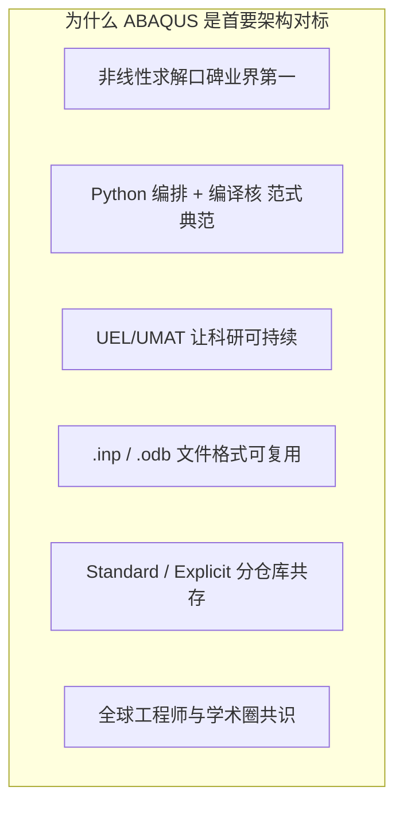

---

## 二、产品线全景与边界

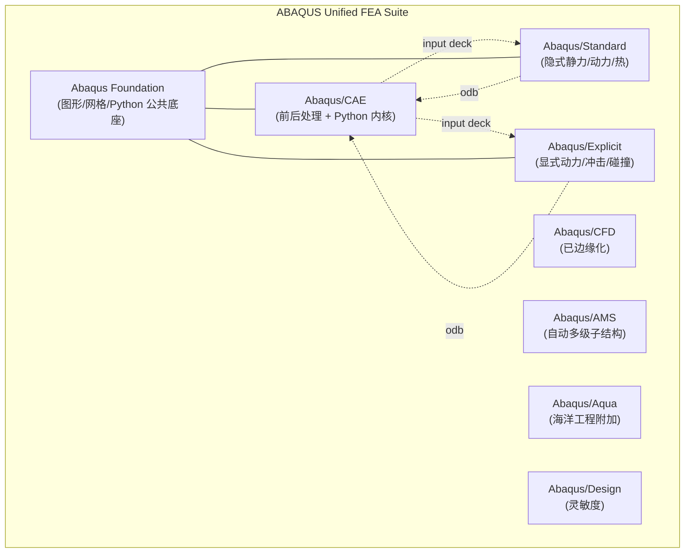

| 模块 | 角色 | 关键产物 |
|------|------|----------|
| **Abaqus/CAE** | 前处理建模 / 作业管理 / 后处理可视化；Python 二次开发宿主 | `.cae`（模型库）、`.inp`（输入卡）、`.odb`（结果） |
| **Abaqus/Standard** | 隐式求解器：Newton-Raphson、弧长法、稳态 / 瞬态、模态、复模态、热—力耦合 | `.odb`、`.fil`、`.dat`、`.msg`、`.sta`、`.res`、`.mdl`、`.stt`、`.prt`、`.com` |
| **Abaqus/Explicit** | 显式求解器：中心差分时间积分、自动稳定时间步、质量缩放、ALE | `.odb`、`.abq`（运行状态）、`.pac`、`.sel`、`.res` |
| **Abaqus/CFD** | 早期推进的不可压 CFD，在 2018 后基本由 XFlow / FluentSimulia 取代 | — |
| **Abaqus Foundation** | 网格、几何、Python、Tcl、并行运行时的公共底座 | — |

> **hy-cad-tool 启示 ①**：把"求解器内核"和"前后处理"放进**两个互不依赖的进程边界**，由 `.inp / .odb` 这种**纯文件**做契约——这正是 hy-cad-tool `ISolverBackend` 想要的隔离。

---

## 三、宏观三层架构

ABAQUS 是教科书级的"**前 / 解 / 后**"三层分离架构，但它真正高明的地方在于：**三层之间只通过文件耦合**，不共享内存、不共享对象、不共享进程。

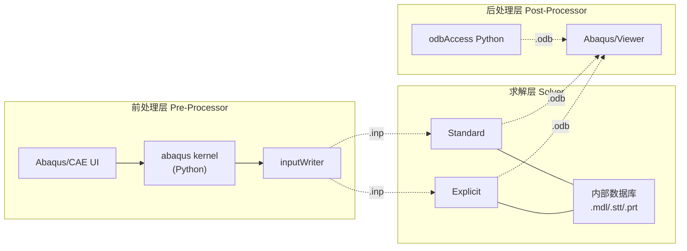

### 3.1 三层分离的好处（务必内化）

| 好处 | 说明 | 对 hy-cad-tool 的意义 |
|------|------|----------------------|
| **可独立部署** | Solver 可单独装在 HPC 集群，CAE 只在工作站 | `ISolverBackend` 必须能"远程化"，不能用引用传递 |
| **可独立崩溃** | Solver crash 不会拖垮 CAE；Viewer 重启不影响计算 | hy-cad-tool 求解必须是子进程/容器 |
| **可独立审计** | `.inp` 是纯文本，可 diff、可版本化、可 CI | `hyob` 也应有可审计的文本形态 |
| **可独立替换** | 用 CalculiX 顶替 Standard 不影响 CAE | hy-cad-tool 对接 CalculiX 走的就是这条路 |
| **可独立扩展** | UEL/UMAT 在 Solver 端编译，不污染 CAE | hy-cad-tool 插件粒度可参照 |

### 3.2 隐藏的"第四层"：Python 编排核

ABAQUS 真正的现代性在于：CAE 不是 C++ 图形界面，它的**模型对象、命令、菜单全部由 Python 驱动**（Abaqus Scripting Interface, 简称 ASI）。

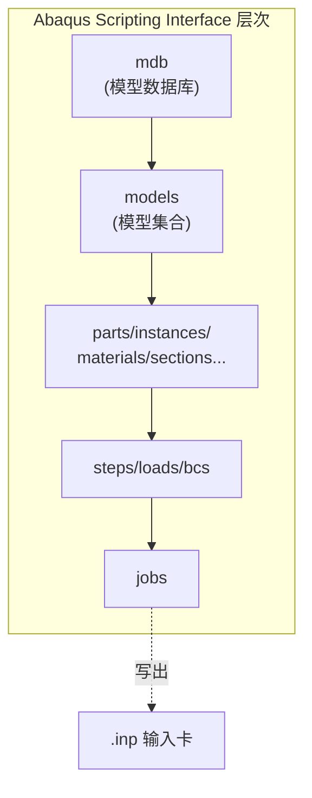

| 子模块 | 作用 |
|--------|------|
| `abaqus` Python 内核 | 解释 Python，所有 GUI 动作都翻译为 Python 命令 |
| `mdb` 树 | 模型数据库，Part / Material / Section / Assembly / Step / Load / BC / Interaction / Job 八大顶级集合 |
| `odbAccess` | 只读访问 `.odb`，支持创建第三方 odb |
| `kernel/customKernel` | 用户自定义模块、菜单、对话框 |
| `RSG` (Replay/Stack/Generator) | UI 操作录制 → Python 脚本回放 |

> **hy-cad-tool 启示 ②**："**GUI 是 Python 命令的子集**"——任何 UI 操作必须能通过命令重放。这正好对应 hy-cad-tool 的 **Command Bus** 设计思想：单一入口、可审计、可回放。

---

## 四、作业生命周期：一份 `.inp` 走完全程

一个 ABAQUS 计算任务的完整生命周期，对应 `hy-cad-tool.IAnalysisPipeline` 的状态机：

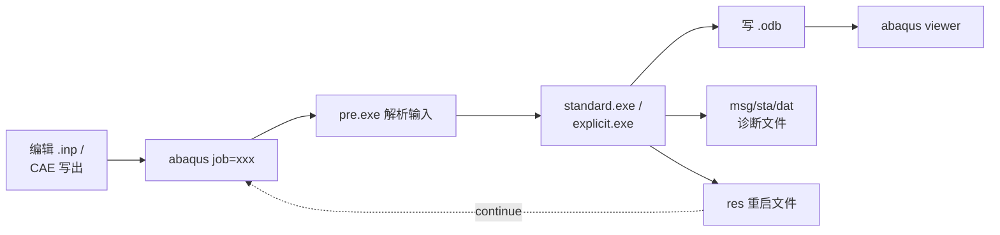

### 4.1 作业目录的文件家族

| 后缀 | 角色 | 大小级 | 可审计 | 说明 |
|------|------|--------|:------:|------|
| `.inp` | 输入卡（主） | KB~MB | ✓ | 文本，人类可读 |
| `.dat` | 解析结果与摘要 | MB | ✓ | 文本，节点/单元统计、错误回声 |
| `.msg` | 增量诊断 | MB~GB | ✓ | 文本，每个迭代的残差 |
| `.sta` | 状态摘要 | KB~MB | ✓ | 文本，可被监控系统 tail |
| `.odb` | 输出数据库 | MB~TB | ✗ | 二进制，结构化 |
| `.fil` | 老格式结果 | MB~GB | ✗ | 二进制，向后兼容 |
| `.res` | 重启文件 | MB~GB | ✗ | 二进制，可续算 |
| `.mdl/.stt/.prt` | 内部模型 / 状态 / 部件 | MB | ✗ | 增量重启依赖 |
| `.sim` | 模态/子结构数据库 | MB | ✗ | 模态分析复用 |
| `.com` | 启动配置 | KB | ✓ | Python，控制环境变量 |
| `.lck` | 锁文件 | <1KB | ✓ | 防止重入 |

> **hy-cad-tool 启示 ③**：作业产物**至少要有一份是文本**，便于 grep / tail / diff / CI。`hyob` 文本 + 二进制结果 odb-like 的双轨设计是合理的。

### 4.2 启动脚本：`abaqus` 命令的真相

`abaqus` 不是单一可执行文件，而是一段 **Python 启动器**（在 Windows 上是 `abaqus.bat` → `launcher.bat` → 调用 `abq2024.exe`）。它做三件事：

1. **环境解析**——从 `abaqus_v6.env` / `custom_v6.env` 读取 CPU 数、Memory、license 配置。
2. **子进程派发**——`abaqus job=xxx interactive` 实际派发到 `pre`、`standard`/`explicit`、`pack`、`make` 等独立 exe。
3. **License 占用与回收**——通过 FlexNet / DSLS 守护。

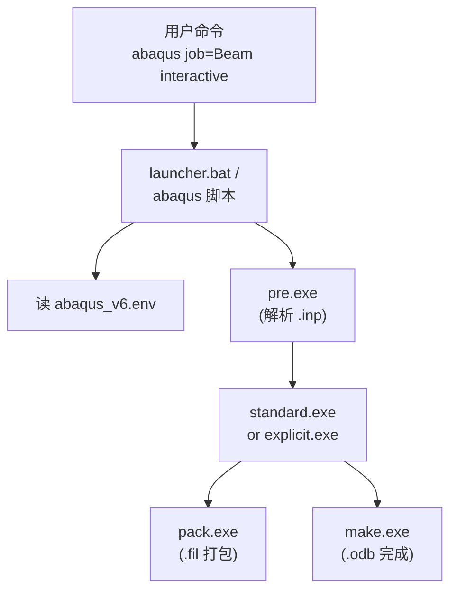

> **hy-cad-tool 启示 ④**：`hy-cad-tool` 的 SolverRunner 也可以是一个**轻量启动器**，它本身不做计算，只负责：环境/License/参数派发、子进程编排、日志聚合、超时/中断、Crash 还原。这就是 `IExternalAnalysisPort` 防腐层的真实样子。

---

## 五、输入卡 `.inp` 的层次结构

`.inp` 是 ABAQUS 最核心、也最被低估的资产——它是一种**关键字驱动、纯文本、可注释的 FEA DSL**，结构如下：

```
*HEADING
Beam under tip load
**
*PART, name=BeamPart
*NODE
  1, 0., 0., 0.
  2, 1., 0., 0.
  ...
*ELEMENT, type=C3D8R, elset=Body
  1, 1, 2, 3, 4, 5, 6, 7, 8
*SOLID SECTION, elset=Body, material=Steel
*END PART
**
*ASSEMBLY, name=Assembly
*INSTANCE, name=Beam-1, part=BeamPart
*END INSTANCE
*END ASSEMBLY
**
*MATERIAL, name=Steel
*ELASTIC
  210000.0, 0.3
**
*STEP, name=Loading, nlgeom=YES
*STATIC
  0.1, 1.0, 1e-5, 1.0
*BOUNDARY
  Beam-1.FIX, ENCASTRE
*CLOAD
  Beam-1.TIP, 2, -1000.0
*OUTPUT, FIELD
*ELEMENT OUTPUT
  S, E
*OUTPUT, HISTORY
*NODE OUTPUT, nset=Beam-1.TIP
  U
*END STEP
```

### 5.1 关键字驱动：以 `*` 开头的命令

`.inp` 由"模型块 (Model Data) + 历史块 (History Data)"组成：

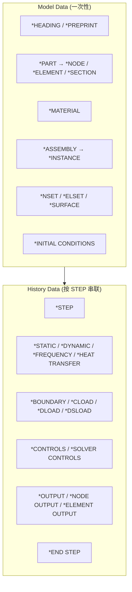

### 5.2 设计哲学：为什么 `.inp` 三十年不变

| 特征 | 价值 | 反例对照 |
|------|------|----------|
| **纯文本** | 可 diff / 可 CI / 可手改 | NX/CATIA 二进制 |
| **关键字 = 域语义** | `*STATIC` `*DYNAMIC` 直接表达"问题类型" | XML 标签字段化 |
| **逗号分隔自由列宽** | 不像 Nastran 8/16 列定位 | Nastran bulk data |
| **顺序敏感** | Model 块先于 History；STEP 顺序即时序 | JSON 失去顺序意义 |
| **支持注释 `**`** | 计算书与模型同居 | 大多数二进制格式 |
| **支持 *INCLUDE** | 模块化大模型 | — |
| **支持 *PARAMETER + Python**| 参数化扫描 | — |

> **hy-cad-tool 启示 ⑤**：`hyob` 文本形态应学习 `.inp` 的**关键字驱动 + 自由列宽 + 注释支持 + INCLUDE**，但用更现代的语法（YAML / TOML / 自定义 DSL，避免 1970s 列定位）。**顺序敏感**是表达"先建模后施加 → STEP 串联"的关键。

---

## 六、Abaqus/Standard 隐式求解器架构

Standard 是 ABAQUS 立足业界的核心，其架构是"**Step / Increment / Iteration**" 三级嵌套。

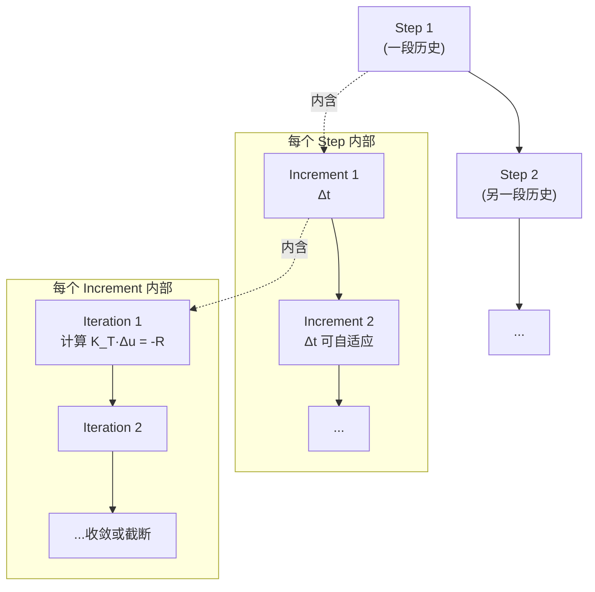

### 6.1 三级控制的职责

| 层级 | 由谁控制 | 关键参数 | 失败后果 |
|------|----------|----------|----------|
| **Step** | 用户在 `.inp` 显式声明 | `*STATIC`、`nlgeom`、time period | 必须重写 |
| **Increment** | 求解器自适应（也可固定） | `Δt0, Δtmin, Δtmax, max increments` | 切分时间步 |
| **Iteration** | Newton-Raphson 内部 | `tolerance, max iterations` | 抛出 cutback |

### 6.2 收敛算法谱系

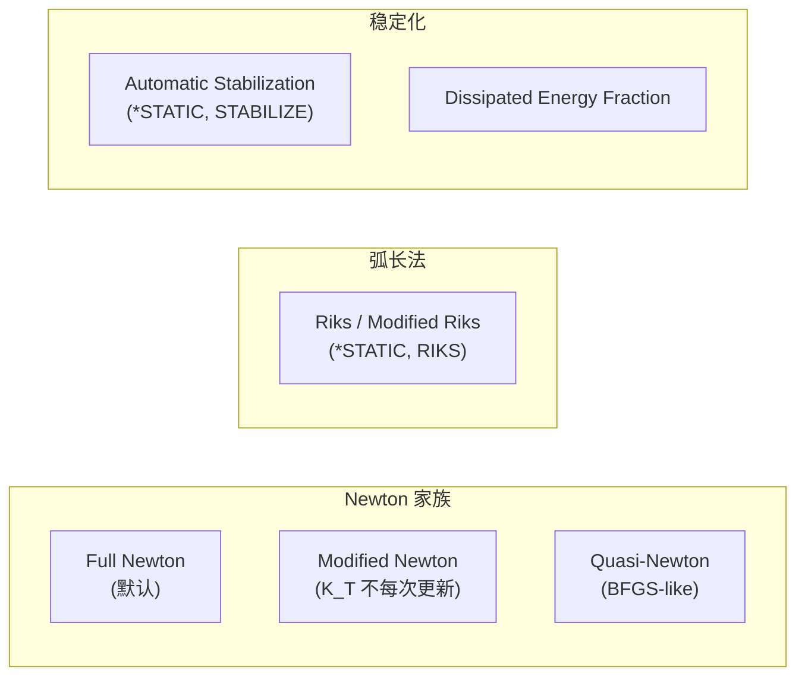

| 算法 | 适用场景 | hy-cad-tool 对照 |
|------|----------|------------------|
| Full Newton | 标准非线性，二阶收敛 | 默认实现 |
| Modified Newton | 切线刚度昂贵时（大模型软化材料） | 优化版 |
| Quasi-Newton | 极大模型 / 接触主导 | 长远目标 |
| Riks 弧长法 | 屈曲、Snap-through、Post-buckling | 必须支持的"难问题" |
| Automatic Stabilization | 局部不稳定（接触瞬间分离） | 自适应阻尼 |

### 6.3 收敛判据：双残差体系

ABAQUS 同时检查 **力残差 R** 和 **位移修正 Δu**：

```
||R||∞      ≤  R_tol × q_avg       (默认 R_tol = 5e-3)
||Δu||∞     ≤  C_n   × ||u_inc||∞   (默认 C_n  = 1e-2)
```

其中 `q_avg` 是当前时刻的**平均力流**（time-averaged flux），它是 ABAQUS 一个非常聪明的设计——避免了"刚开始 R=0 但其实没加载"的假收敛。

> **hy-cad-tool 启示 ⑥**：收敛判据不要拍脑袋写 `||R|| < 1e-6`。要参考 ABAQUS 用**时间平均力流**做归一化，否则不同量级问题（道路工程 MN vs 微机械 mN）会跨数量级失败。

### 6.4 Cutback 与 Restart：弹性面对失败

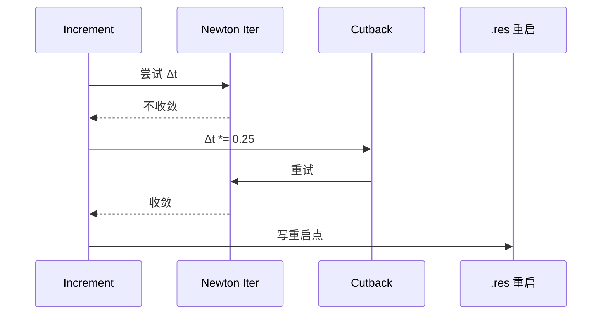

| 机制 | 价值 |
|------|------|
| **Cutback** | 局部小失败不退出，自动缩小步长重试 |
| **Restart** | 整体崩溃可从最近一步续算 |
| **Severe Discontinuity Iterations (SDI)** | 接触/塑性这种不光滑事件单独计数 |

> **hy-cad-tool 启示 ⑦**：`IAnalysisPipeline` 必须把**断点续算**当一等公民设计，而不是事后补救。每个 Step/Increment 写**幂等的检查点**，崩溃后能恢复到最近一个 Increment 的状态。

---

## 七、Abaqus/Explicit 显式求解器架构

Explicit 是另一种世界观：**没有迭代，只有时间步**。

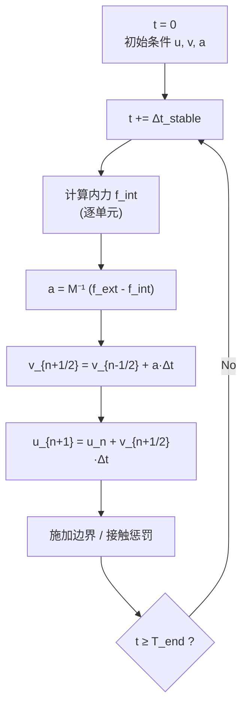

### 7.1 中心差分时间积分

```
v_{n+1/2} = v_{n-1/2} + Δt_n · M⁻¹ · (f_ext - f_int)_n
u_{n+1}   = u_n + Δt_{n+1/2} · v_{n+1/2}
```

**关键洞察**：质量矩阵 `M` 通常**集中（lumped）化**为对角阵，所以 `M⁻¹` 是一次性的 O(N) 操作——**没有线性方程组求解**。这就是 Explicit 能扩展到亿级单元的根本原因。

### 7.2 稳定时间步 (CFL 条件)

```
Δt_stable = min over elements ( L_e / c )
```

其中 `c = √(E/ρ)` 是弹性波速度，`L_e` 是单元最小特征长度。**稳定时间步是物理约束，不是数值参数**。

| 工程含义 | 数量级 | 应对策略 |
|----------|--------|----------|
| 1 mm 钢单元 | Δt ≈ 2e-7 s | 接受 |
| 1 mm 橡胶 (低 E 高 ρ) | Δt ≈ 1e-5 s | 利好 Explicit |
| 1 m 道路填土 | Δt ≈ 1e-3 s | 路桥 Explicit 可行 |
| 整体仿真 1s | 需要百万到千万步 | 必须并行 + GPU |

### 7.3 质量缩放：工程妥协

Explicit 用户的一句行话："**没有质量缩放跑不完一个真实模型**"。Mass scaling 通过**人为增加慢单元的密度** → 增大 Δt_stable → 减少总步数。

| 模式 | 触发 | 风险 |
|------|------|------|
| Fixed mass scaling | 用户指定缩放因子 | 改变动力响应 |
| Variable mass scaling | 目标 Δt 反推每个单元 | 仅准静态可接受 |
| Selective mass scaling | 仅对慢单元（小尺寸）缩放 | 平衡精度与速度 |

> **hy-cad-tool 启示 ⑧**：道路工程沉降是**准静态**问题，理论上应走 Standard 隐式；但若涉及**爆破开挖、车辆冲击**，需要 Explicit。`hy-cad-tool` 的 `ISolverBackend` 抽象必须能容纳**隐式 / 显式两种世界观**——参数完全不同，UI 提示也不同。

---

## 八、单元库与材料库内核

### 8.1 单元命名体系——一个被严重低估的设计

ABAQUS 单元命名形如 `C3D8R`、`S4R`、`B31`、`T3D2`：

```
C   3D   8     R
│   │    │     │
│   │    │     └─ R: Reduced Integration (减积分)
│   │    └─────── 节点数：8（六面体）
│   └──────────── 维度族：3D
└──────────────── 类别族：C=Continuum(实体), S=Shell, B=Beam, T=Truss, R=Rigid, M=Mass, ...
```

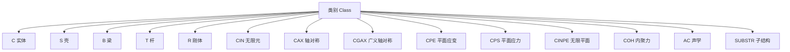

| 设计要点 | 价值 |
|----------|------|
| 类别族正交 | 同一类别的单元共享接口（assemble、output） |
| 阶数显式编码 | 8 / 10 / 20 一眼可读 |
| 积分方案后缀 (R / H / I) | 减积分、杂交、不协调 |
| 维度族 (3D / 2D / AX) | 自动选择本构降维 |

> **hy-cad-tool 启示 ⑨**：`IElementFormulationPlugin` 命名应学 ABAQUS——**类别 + 维度 + 节点数 + 修饰符**四元组，禁止"取个内部代号"的反模式。

### 8.2 几个值得专门学的单元

| 单元 | 用途 | 关键技术 |
|------|------|----------|
| **C3D8R** | 通用六面体减积分 | 沙漏控制（Hourglass control）必须配套 |
| **C3D8I** | 不协调模式六面体 | 弯曲性能接近 C3D20 但成本低 |
| **C3D10M** | 修改型四面体 | 接触表面可用，避免标准 C3D10 接触锁死 |
| **COH3D8** | 内聚力单元 | 用于分层与界面裂纹 |
| **CIN3D8** | 无限元 | 远场边界，岩土地震必备 |
| **SC8R** | 连续壳 | 厚壳/薄壳统一表达 |

### 8.3 材料库：本构 = 增量更新算法

ABAQUS 材料不只是"E、ν 表"，它是一个**增量本构积分算法**：

```
Input :  ε^(n+1) , Δε , state_vars^(n) , Δt , T^(n) , ...
Output:  σ^(n+1) , D^(elastoplastic) , state_vars^(n+1) , Δε^p , ...
```

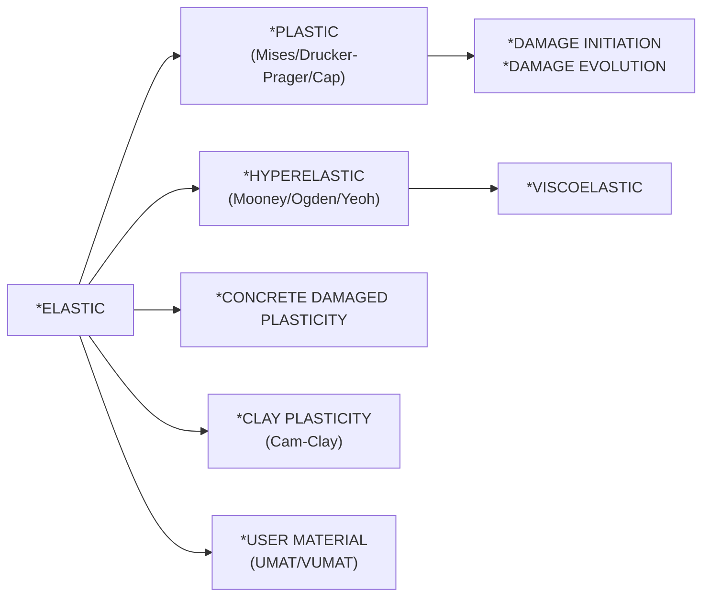

| 本构家族 | hy-cad-tool 道路场景对照 |
|----------|--------------------------|
| Mises + 各向同性硬化 | 钢筋、钢护栏 |
| Drucker-Prager / Cap | 路基填土、级配碎石 |
| Modified Cam-Clay | 软土地基 |
| Concrete Damaged Plasticity | 混凝土路面 / 桥梁 |
| Hyperelastic | 沥青（高温）— 但通常用粘弹性 |
| Viscoelastic / Viscoplastic | 沥青混合料 |

> **hy-cad-tool 启示 ⑩**：`IConstitutiveModel` 接口的签名**应该和 UMAT 一致**——`Update(ε, Δε, σ, Δσ, state, D, Δt)`，因为 30 年来全世界的本构研究者就是这样想的。强迫自己用别的形式将与学术界脱节。

---

## 九、接触算法架构

接触是 ABAQUS 的"皇冠"，也是非线性 FEA 最难的部分。

### 9.1 两条主线

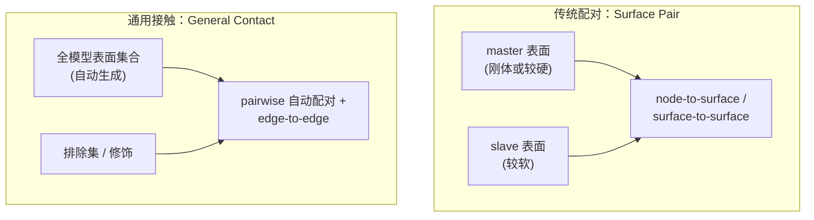

| 模式 | 优势 | 劣势 |
|------|------|------|
| Surface Pair | 精确控制、本构丰富 | 大模型工作量爆炸 |
| General Contact | 一次声明覆盖所有可能 | 调试难度高 |

### 9.2 法向 / 切向本构正交

接触不是单一"开/关"，而是**两个独立本构**：

| 方向 | 选项 |
|------|------|
| 法向 | Hard / Linear / Exponential / Tabular / Augmented Lagrange |
| 切向 | Frictionless / Penalty / Lagrange / Rough |

### 9.3 Standard vs Explicit 的接触差异

| 维度 | Standard | Explicit |
|------|----------|----------|
| 算法基础 | Lagrange 乘子 / Augmented | 罚函数 / 运动学预测—修正 |
| 时间步约束 | 几乎无 | 罚刚度影响 Δt_stable |
| 大滑移 | 支持但贵 | 天然擅长 |
| 自接触 | 单独 `*CONTACT, SELF` | General Contact 默认含 |
| 失效后处理 | 困难 | 单元删除天然支持 |

> **hy-cad-tool 启示 ⑪**：接触是 FEM 软件最大的复杂度黑洞。hy-cad-tool 早期**应抽象但不实现**——把接口预留给后端（CalculiX 的 face contact、OpenSees 的 zero-length），而不是自己写接触搜索。

---

## 十、并行架构：从工作站到 HPC

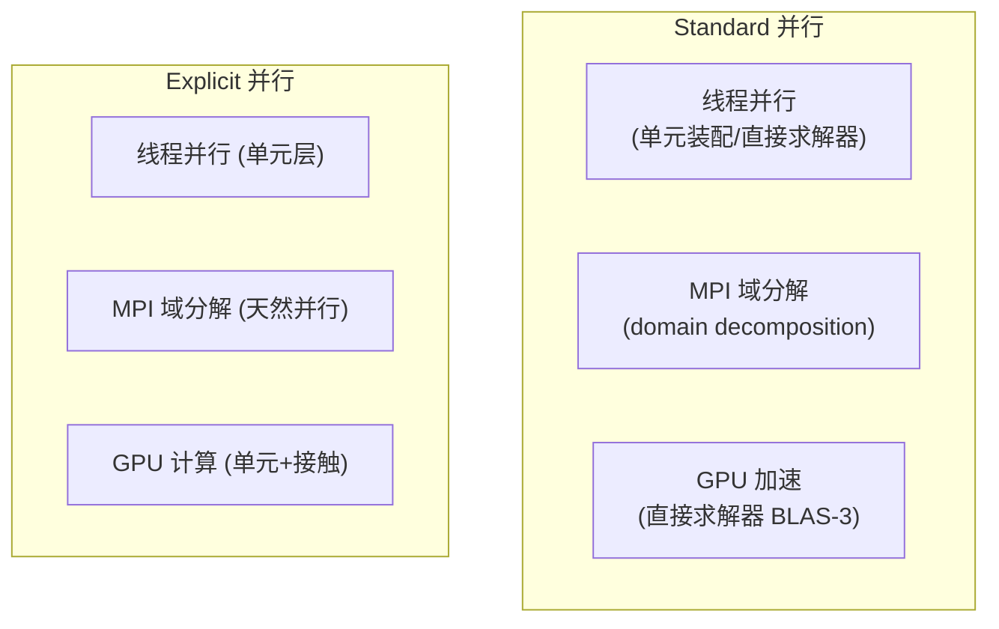

### 10.1 Standard 的并行三件套

| 模式 | 命令 | 适用 |
|------|------|------|
| **线程**（shared memory） | `cpus=N` | 单机多核，直接求解器 |
| **MPI 域分解**（DMP） | `cpus=N mp_mode=MPI` | 集群，迭代求解器 |
| **GPU 加速** | `gpus=K` | 大型直接求解器 |
| **混合** | 上述组合 | HPC |

### 10.2 Explicit 的天然并行性

Explicit 没有全局求解，单元更新天然并行。MPI 域分解的关键挑战是**接触跨域**——ABAQUS 用 graph partitioning（METIS）切分域，并对接触面做"重影区"（halo）通讯。

> **hy-cad-tool 启示 ⑫**：并行不是 hy-cad-tool 当前阶段的事，但 `ISolverBackend` 的接口必须能**透传并行参数**（`cpus`、`gpus`、`mp_mode`），不要把"并行"写死成内部细节。

---

## 十一、`.odb` 输出数据库：被低估的核心资产

ABAQUS 的 ODB 是工业 FEA 最成功的二进制结果格式之一，理由是：

1. **跨版本稳定**——20 年前的 ODB 仍能在新版打开（升级即可）。
2. **Python 可读写**——`odbAccess` 模块允许第三方写入。
3. **支持现场抽取**——大模型不必整模型加载，可按 Step/Frame/Region 流式读。

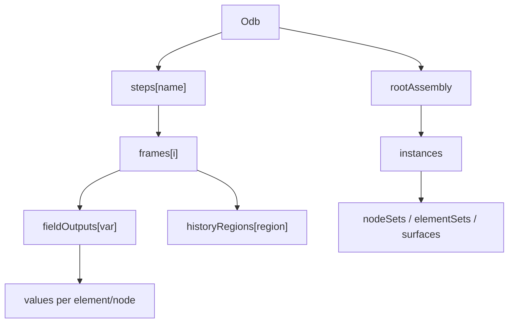

### 11.1 关键设计

| 设计 | 价值 |
|------|------|
| Step → Frame → Field/History 四层 | 时间—空间分离，按需加载 |
| FieldOutput 与 HistoryOutput 分仓 | 大场量 vs 关键点时程 |
| Region 抽象 | 节点集 / 单元集 / 表面统一编址 |
| 支持用户写入 | 二次开发可"反写"结果回 ODB |

> **hy-cad-tool 启示 ⑬**：`IResultRecorder` 应直接参考 ODB 的"Step / Frame / Field / History"四层：
> 1. **Step** 对应 hy-cad-tool 的 `AnalysisStep`（也是 OpenSees 的 Domain timestamp）。
> 2. **Frame** 是时间快照。
> 3. **FieldOutput** 是大场量（应力云图、位移场）。
> 4. **HistoryOutput** 是关键监测点时程（沉降观测点、桥梁挠度）。

---

## 十二、扩展机制：UEL / UMAT / Python 三层扩展

ABAQUS 是少数能让"二次开发者"长期生存的 FEA，因为它的扩展接口**层次分明**：

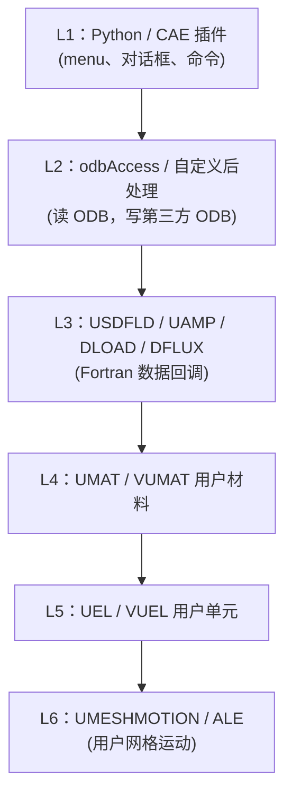

| 层 | 语言 | 部署 | 风险 |
|----|------|------|------|
| L1 Python CAE | Python | 即插即用 | UI 维护 |
| L2 odbAccess | Python | 即插即用 | 性能限制 |
| L3 数据回调 | Fortran/C++ | 编译 + license | 编译环境 |
| L4 UMAT/VUMAT | Fortran/C++ | 编译 + license | 数值稳定性 |
| L5 UEL/VUEL | Fortran/C++ | 编译 + license | 单元理论功底 |
| L6 UMESHMOTION | Fortran | 编译 + license | ALE 复杂性 |

### 12.1 UMAT 的签名为何成为业界共识

```fortran
SUBROUTINE UMAT(STRESS, STATEV, DDSDDE, SSE, SPD, SCD, ...
     1            STRAN, DSTRAN, TIME, DTIME, TEMP, DTEMP, ...
     2            PREDEF, DPRED, CMNAME, NDI, NSHR, NTENS, ...
     3            NSTATV, PROPS, NPROPS, COORDS, DROT, PNEWDT, ...
     4            CELENT, DFGRD0, DFGRD1, NOEL, NPT, LAYER, ...
     5            KSPT, JSTEP, KINC)
```

这套签名 30 年没变，是因为它**正好覆盖了本构模型所需的最小完备输入**：
- 当前应力、应变、应变增量
- 旋转增量（大变形）
- 状态变量、温度、时间、单元、积分点
- 时间步建议（PNEWDT）
- 切线模量输出（DDSDDE）

> **hy-cad-tool 启示 ⑭**：自研本构接口**抄 UMAT** —— 加上现代化包装（无可变长度参数、用结构体），但语义完全照搬。这样：① 文献复现零成本；② 学生上手零成本；③ 与 CalculiX UMAT 兼容。

---

## 十三、Abaqus/CAE 的前后处理设计

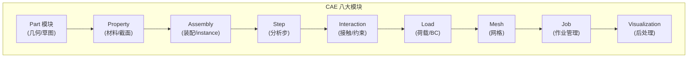

| 模块顺序 | 设计哲学 |
|----------|----------|
| Part → Property → Assembly | **几何归几何，物理归物理**，装配时再绑定 |
| Step | 时间历史是一等公民，不和静态模型混杂 |
| Interaction / Load | 都是历史型对象，可在 Step 内激活 / 失活 |
| Mesh | **网格在最后**——几何变了网格重生 |
| Job | 作业是产物，不是模型一部分 |

> **hy-cad-tool 启示 ⑮**：Blender UI 上的"模块化 tab" 应模仿 CAE 八模块，特别是 **Step 作为一等公民、Mesh 在最后**这两条。把 Mesh 当成"几何的衍生品"而不是用户直接构建的对象，正是 hy-cad-tool 几何为先路线的天然契合点。

---

## 十四、设计哲学的几条主线（深度提炼）

### 14.1 "Python 编排 + 编译核"——慢语言管快计算

ABAQUS 早在 1999 年就把 Python 嵌入 CAE，比同代产品早 10 年。这条路线的本质：

```mermaid
graph LR
    Slow["Python (慢)<br/>负责：编排、命令、UI、扩展"]
    Fast["Fortran/C++ (快)<br/>负责：单元、矩阵、求解"]
    Slow -.IO via .inp .-> Fast
    Fast -.IO via .odb .-> Slow
```

| 特征 | 价值 |
|------|------|
| Python 负责"决策" | 易扩展、易脚本、易交互 |
| Fortran 负责"计算" | 速度、稳定、可调优 |
| 隔离通讯 | 文件契约，互不污染 |

这与 hy-cad-tool 的 **C# 编排 + 可插拔 SolverBackend (CalculiX/OpenSees)** 是同一范式。

### 14.2 "Step is a first-class citizen"——历史型而非快照型

ABAQUS 把整个分析当成"**时间序列**"——Step 是一等公民。这点与 ETABS/PKPM 这种"快照型"完全不同。道路工程的**填筑—预压—固结—二次填筑**正是天生的 Step 序列。

### 14.3 "Geometry first, Mesh derived"——几何为先

CAE 的 Part / Assembly 都是几何，Mesh 是衍生。这正是 hy-cad-tool 的 `hyob` 路线。

### 14.4 "Solver = Subprocess"——求解就是子进程

求解器永远是独立可执行文件，永远通过 `.inp` / `.odb` 通讯。没有"嵌入式求解器"。

### 14.5 "Restart 不是 nice-to-have"——可续算是底线

ABAQUS 的所有非线性分析默认支持 restart。这是工业级 FEA 的底线，不是高级特性。

### 14.6 "Documentation as Code"——文档即代码

ABAQUS 手册（Analysis User's Guide / Theory Manual / Verification Manual / Keywords Reference）每个关键字都对应**一篇可单独索引的章节**，且与 `.inp` 关键字 1:1 映射。

---

## 十五、对 hy-cad-tool 的可执行启示清单

### 15.1 直接对标的架构映射

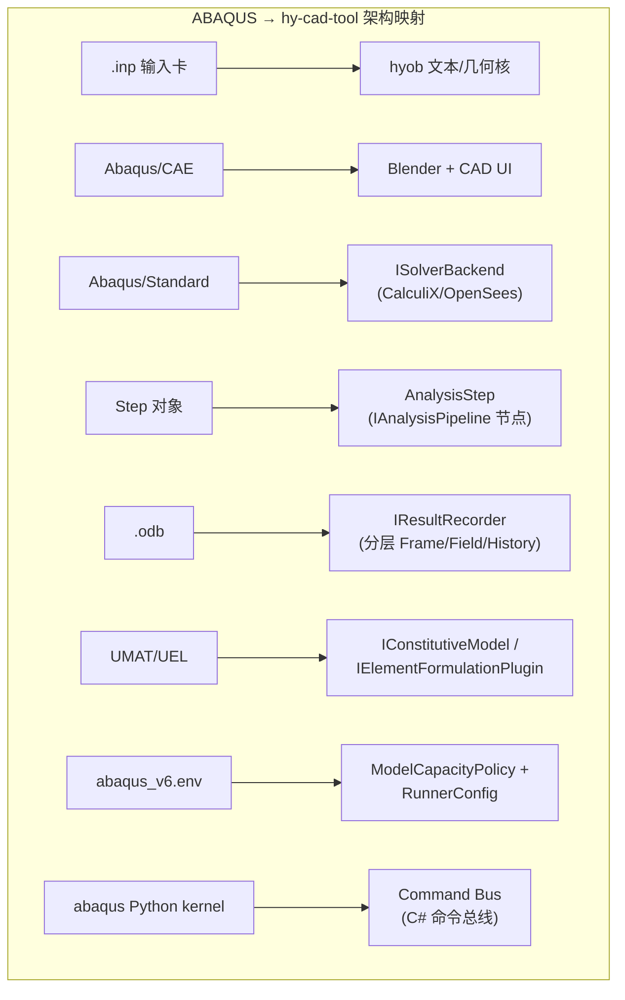

| ABAQUS 组件 | hy-cad-tool 对照 | 借鉴深度 |
|-------------|------------------|----------|
| `.inp` 关键字驱动 | `hyob` 文本形态 | ◎ 直接借鉴语义模型 |
| Step / Increment / Iteration 三级 | `AnalysisPipeline` 三级状态机 | ◎ 直接套用 |
| Abaqus/CAE 八模块 | Blender UI 八 tab | ○ 概念对照 |
| `.odb` Frame / Field / History | `IResultRecorder` 四层 | ◎ 直接对标 |
| UMAT 签名 | `IConstitutiveModel.Update(...)` | ◎ 完全照搬 |
| UEL 签名 | `IElementFormulationPlugin` | ○ 简化版 |
| `abaqus job=` 启动器 | `SolverRunner` 子进程编排 | ◎ 完全照搬 |
| `restart` 机制 | `ICheckpointStore` | ◎ 必备 |
| `.com` / `.env` 环境 | `RunnerConfig` | ○ 概念对照 |
| Python kernel | C# Command Bus + DSL | ○ 范式对照 |

### 15.2 应做（高 ROI）

1. **将 `hyob` 设计为 ABAQUS `.inp` 子集的"语义同构体"**——保证 hy-cad-tool 模型能 1:1 写出 `.inp`，给 CalculiX/ABAQUS 双后端调用。
2. **AnalysisStep 三级状态机**——`Step` 内含 `Increment` 内含 `Iteration`，每级有 cutback / restart 钩子。
3. **`IConstitutiveModel` 直接复用 UMAT 签名**（C# 包装）——文献复现零成本。
4. **`IResultRecorder` 四层结构**——Step / Frame / FieldOutput / HistoryOutput。
5. **Solver 强制走子进程**——`ISolverBackend` 接口不允许"嵌入式调用"，保证可远程化、可换后端。
6. **作业目录约定**——按 ABAQUS 习惯：`<job>.inp` `<job>.odb` `<job>.msg` `<job>.sta`，让 hy-cad-tool 用户能直接复用 ABAQUS 习惯的工具链（grep `.msg`、tail `.sta`）。
7. **Restart 作为底线**——每个 Increment 写检查点，Crash 后可续算。
8. **Step is first-class** —— 道路工程的施工阶段直接复用此抽象。

### 15.3 不应做（陷阱）

1. ❌ **不要发明新的本构接口** —— UMAT 是事实标准，不要"创新"。
2. ❌ **不要把求解器嵌进 hy-cad-tool 进程** —— ABAQUS 用 40 年证明：子进程隔离才是工业级。
3. ❌ **不要让 UI 直改模型** —— 走 Command Bus，模仿 ABAQUS "GUI = Python 命令子集"。
4. ❌ **不要二进制独此一家** —— `hyob` 必须有可审计文本形态，否则就是 PKPM 包袱。
5. ❌ **不要自己写接触搜索** —— 让 CalculiX/Code_Aster 处理，hy-cad-tool 只声明接触对。
6. ❌ **不要"Mesh 优先"** —— 几何为先，网格衍生，否则就跌回 Nastran 时代。

### 15.4 立即可执行的对标动作（4 周内）

| 优先级 | 动作 | 工作量 |
|--------|------|--------|
| **P0** | 抄 ABAQUS `.inp` 关键字清单，整理出 hy-cad-tool 必须支持的最小子集（约 30 个关键字） | 3 天 |
| **P0** | 起草 `IConstitutiveModel` C# 接口，参数对齐 UMAT | 2 天 |
| **P0** | 起草 `AnalysisStep` / `Increment` / `Iteration` C# 状态机 | 1 周 |
| **P1** | 起草 `IResultRecorder` 四层接口，与 ODB 对齐 | 3 天 |
| **P1** | 实现 `hyob → CalculiX .inp` 写出器（ABAQUS .inp 子集） | 2 周 |
| **P1** | 制定作业目录约定：`.inp/.msg/.sta/.odb-like` | 1 天 |
| **P2** | 起草 `ICheckpointStore`（restart 机制） | 1 周 |
| **P2** | 起草 `SolverRunner` 子进程编排 + 超时 / Crash 处理 | 1 周 |
| **P3** | 编写 hy-cad-tool 与 ABAQUS `.inp` 关键字的差异 / 兼容性手册 | 1 周 |

---

## 十六、参考与延伸阅读

> 以官方文档为准；本报告仅做架构提炼，不替代任何手册的具体细节。

- **Abaqus Analysis User's Guide**（核心：分析过程、单元、材料、接触章节）
- **Abaqus Theory Manual**（中心差分、Newton-Raphson、弧长、接触算法原理）
- **Abaqus Verification Manual**（验证案例集）
- **Abaqus Keywords Reference Guide**（`.inp` 关键字字典）
- **Abaqus User Subroutines Reference Guide**（UMAT / VUMAT / UEL / VUEL 等签名手册）
- **Abaqus Scripting User's Guide** + **Scripting Reference Guide**（Python ASI）
- **Abaqus CAE User's Guide**（CAE 八模块、Replay/Stack/Generator）
- **CalculiX CrunchiX User's Manual**（对标实现：哪些 ABAQUS 关键字可平替）
- **OpenSeesPy Documentation**（Step / Recorder 类比）
- 上游：`docs/01-全球三维有限元软件对标调研-2026-05-14.md` § 3.2 ABAQUS
- 关联：`docs/02-有限元通用的体系架构-从地基墙开始-2026-05-14.md`（待对接：Step 抽象、Recorder 分层）

---

## 修订记录

| 日期 | 修订人 | 说明 |
|------|--------|------|
| 2026-05-14 | — | 初版：ABAQUS 全产品线 + 三层架构 + Standard/Explicit 求解器内核 + 单元/材料/接触/并行 + ODB + UMAT/UEL 扩展 + 15 条 hy-cad-tool 对标启示与执行清单 |
