# MSC Nastran / Marc / Adams 有限元计算架构深挖

> 文档日期：2026-05-14
> 上承：
> - [01-全球三维有限元软件对标调研-2026-05-14](../01-全球三维有限元软件对标调研-2026-05-14.md)
> - [02-有限元通用底座架构-从挡土墙开始-2026-05-14](../02-有限元通用底座架构-从挡土墙开始-2026-05-14.md)
>
> 文档目的：
> 1. 在 01 调研报告"通用 FEA 阵营 A"中，MSC 三件套（Nastran/Marc/Adams）只用一节略带提及。本文把这个"老贵族"展开成**架构教科书**——尤其是 **Bulk Data Deck、SOL 求解序列、DMAP 元编程、Superelement、MNF（Modal Neutral File）** 等在工业界沉淀了半个世纪的设计。
> 2. 提炼 MSC 体系对 **hy-cad-tool 通用底座（文档 02）** 的可借鉴/可对标/可规避点，落到 IR、求解流程、子结构、多模块协同等具体设计上。
> 3. 给出"如果 hy-cad-tool 要在某些方向走得长远，哪些 MSC 的设计是绕不开的"的判断。

---

## 一、为什么要专门深挖 MSC 三件套

在 01 调研报告中，MSC Nastran/Marc/Adams 被归类为"航空航天起家的老贵族"，但它的真正价值是：**它是少数几个把"工程结构有限元—非线性—多体动力学"用一套数据范式串联起来的成熟体系**。

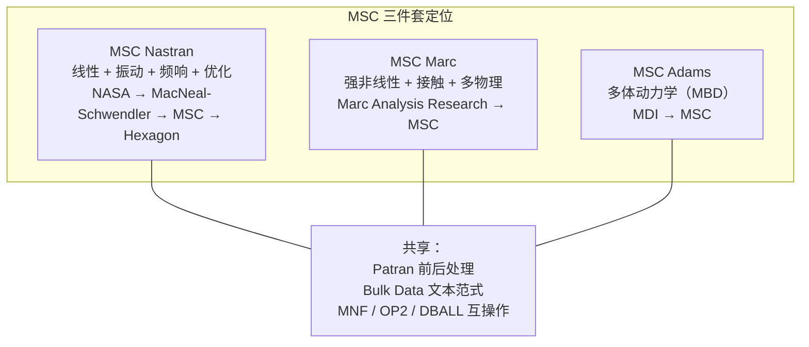

| 项 | MSC Nastran | MSC Marc | MSC Adams |
|----|-------------|----------|-----------|
| **诞生年份** | 1965 (NASA NASTRAN) | 1971 | 1977 |
| **数学核心** | 线性代数（K, M, C 矩阵） | 增量—迭代非线性 | 多体 DAE |
| **典型问题** | 飞机机翼模态、桥梁频响 | 橡胶大变形、金属成型、钢筋混凝土 | 汽车悬架、机械臂、卫星展开 |
| **求解器范式** | 隐式静/动力 | 隐式非线性 + 显式 | DAE 时域积分 |
| **可编程性** | DMAP / OpenFSI / PCL | User subroutine (Fortran) | ACF / Solver subroutine |
| **数据基石** | Bulk Data Deck（`.bdf/.nas`） | Marc input (`.dat`) | Adams dataset (`.adm`) |

> **关键判断**：从 hy-cad-tool（C# + Blender + Road 工程）的视角看，MSC 三件套**不是要原样照搬**，而是要**从它走过的 60 年弯路里提取"已经被证明正确"的几条架构原则**。本文目标就是把这些"原则"找出来。

---

## 二、整体架构鸟瞰：一套数据 + 三个求解 + N 个前处理

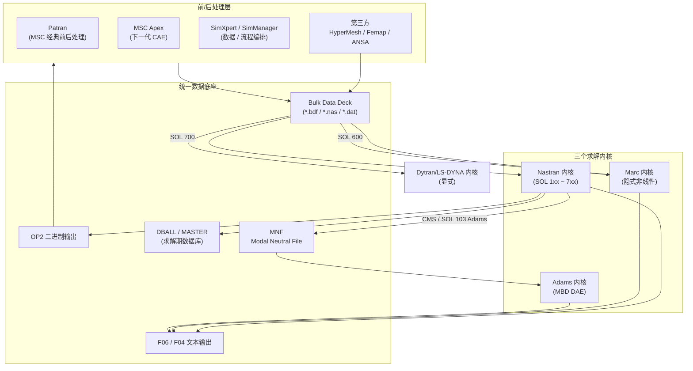

| 维度 | MSC 的做法 | 关键洞察 |
|------|-----------|----------|
| **数据范式** | 一份 Bulk Data Deck 文本走天下；二进制 OP2 仅作结果传递；DBALL 是求解期临时数据库 | "**输入文本化**"是工业 FEM 的最强护城河 |
| **求解多内核** | Nastran 不试图统一所有问题——非线性给 Marc、显式给 Dytran/LS-DYNA、多体给 Adams | "**单一求解器吃所有问题**"是错的；问题—求解器要双向匹配 |
| **跨求解协同** | Nastran → MNF → Adams（柔性多体）、SOL 600 直接把 Marc 作 Nastran 一个求解序列 | "**子结构是协同的钥匙**"——把局部模态打成包送给上层 |
| **前后处理解耦** | Patran/Apex 与求解器低耦合；HyperMesh/Femap 第三方完全可替代前处理 | 前处理是商品，求解器是核心；hy-cad-tool 可学这个边界 |

---

## 三、MSC Nastran 架构深挖

Nastran 是 MSC 体系的"心脏"。它的设计早于面向对象编程，**通篇 Fortran，但架构思想现代得令人吃惊**。

### 3.1 输入文件三段式：Executive / Case Control / Bulk Data

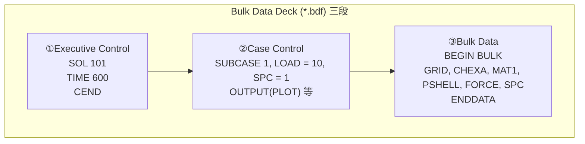

| 段 | 职责 | 类比 hy-cad-tool |
|----|------|------------------|
| **① Executive Control** | 选择求解序列 (SOL 101/103/...)、设置 DMAP、超时 | `AnalysisProcedure`（02 文档已设计） |
| **② Case Control** | 工况组合（SUBCASE）、输出选项、加载/边界关联 | `LoadCase / LoadCombination + OutputRequest` |
| **③ Bulk Data** | 节点 GRID、单元 CHEXA、材料 MAT1、属性 PSHELL、加载 FORCE/PLOAD4、约束 SPC/MPC | `FemProblem` 中性 IR |

#### 3.1.1 Bulk Data 的"列定位+续行"格式

经典 Nastran 卡（card）按 **8 字符固定列宽**：

```text
GRID    1               0.0     0.0     0.0
CHEXA   100     1       1       2       3       4       5       6+H1
+H1     7       8
```

| 设计选择 | 优点 | 缺点（对 hy-cad-tool 的警示） |
|----------|------|-----------------------------|
| 8 列定位 | 60 年代打孔卡兼容；diff 友好；无需解析器即可读 | 视觉对齐麻烦；浮点精度受限；现代仍存在的 free-field/long-field 是补丁 |
| 续行符 `+` | 单行不够时优雅延续 | 解析器复杂；状态机式读取 |
| 注释 `$` 开头 | 简单 | 不能在卡片内部嵌注释 |

> **hy-cad-tool 选择**：`hyob` 选 **YAML/TOML**——保留"文本可审计 + diff 友好"，但抛弃列定位的历史包袱。在导出兼容时，写一个 `hyob → Nastran bulk` 的格式化器即可。

### 3.2 SOL 求解序列：分类即架构

Nastran **最有架构洞察的部分**是 SOL 编号体系。每个 SOL 是一条完整的"问题—物理—算法"流水线：

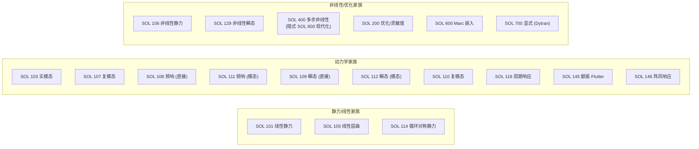

| SOL | 物理 | 数学 | 内核 |
|-----|------|------|------|
| 101 | 静力 | $\mathbf{K}\mathbf{u} = \mathbf{F}$ | 稀疏直接法 (BCSLIB-EXT) |
| 103 | 自由振动 | $(\mathbf{K} - \omega^2 \mathbf{M})\boldsymbol{\phi} = \mathbf{0}$ | Lanczos / Sparse Eigen |
| 108 | 谐响应 | $(\mathbf{K} - \omega^2 \mathbf{M} + j\omega \mathbf{C})\mathbf{u} = \mathbf{F}(\omega)$ | 复数直接法 |
| 109 | 瞬态 | $\mathbf{M}\ddot{\mathbf{u}} + \mathbf{C}\dot{\mathbf{u}} + \mathbf{K}\mathbf{u} = \mathbf{F}(t)$ | Newmark-β |
| 111 | 模态频响 | 模态叠加 | Lanczos + 模态截断 |
| 106 | 非线性静力 | Newton-Raphson | 弧长法可选 |
| 200 | 优化 | $\min f(\mathbf{x})$ s.t. $g_i(\mathbf{x}) \le 0$ | MMA / SLP / SQP |
| 400 | 多步非线性 | 隐式 + 接触 + 大变形 | 多步分析步范式 |
| 600 | Marc | 调用 Marc 内核 | 子进程 |
| 700 | 显式 | Central Difference | Dytran/LS-DYNA |

> **架构洞察**：
> SOL 编号不是"功能罗列"，而是"**问题分类的形状**"——一个 SOL 编号 = 一组 (Problem Type, Math, Algorithm, Output) 的稳定四元组。
> 对应 hy-cad-tool 02 文档的 `AnalysisProcedure`，应该走类似的"问题类型即一等公民"路线，而不是把所有非线性塞进一个开关。

### 3.3 DMAP：可编程的求解内核

Nastran 真正的"杀手锏"是 **DMAP (Direct Matrix Abstraction Program)**——一个**元编程语言**，让用户**重新定义求解流程**：

```text
$ 一个典型 DMAP ALTER（修改 SOL 103）
ALTER 'BEGIN MODAL ANALYSIS' $
MATPRN  KAA,MAA//   $ 打印 K 和 M
TYPE    PARM,,I,N,NMODES=10 $
ALTER 'END MODAL ANALYSIS' $
```

DMAP 把 Nastran 求解过程公开为可读、可改、可叠加的**矩阵操作 DSL**：


| 关键设计 | 含义 | hy-cad-tool 启示 |
|----------|------|------------------|
| **矩阵作为一等公民** | DMAP 用 `MATPRN`、`MPYAD`、`SOLVE` 直接操作矩阵块 | 02 文档的 `AssembledSystem` 是这个理念 |
| **模块可插拔** | EMG / EMA / SDR 都是独立模块，可被替换 | `IFemAssembler / IElementFormulationPlugin` |
| **ALTER 机制** | 用户在求解流水线上"插入" DMAP 代码块 | hy-cad-tool 的 `IPipelineInterceptor` 设计参考点 |
| **数据流即程序** | DMAP 程序就是 DAG 数据流 | ANSYS Workbench 的 DAG 把这一思想前端化 |

> **判断**：DMAP 是 Nastran **40 年来一直无可替代**的核心竞争力。它的等价物，hy-cad-tool 中应该是 **`IAnalysisPipeline + IPipelineInterceptor`**——允许在标准 SOL 流程中插入自定义节点（如自定义后处理、自定义输出、自定义阻尼模型）。

### 3.4 Set 体系：自由度的数学分类法

Nastran 用**集合（Set）**对全模型 DOF 做分类，这是其他 FEM 软件最缺的清晰抽象。

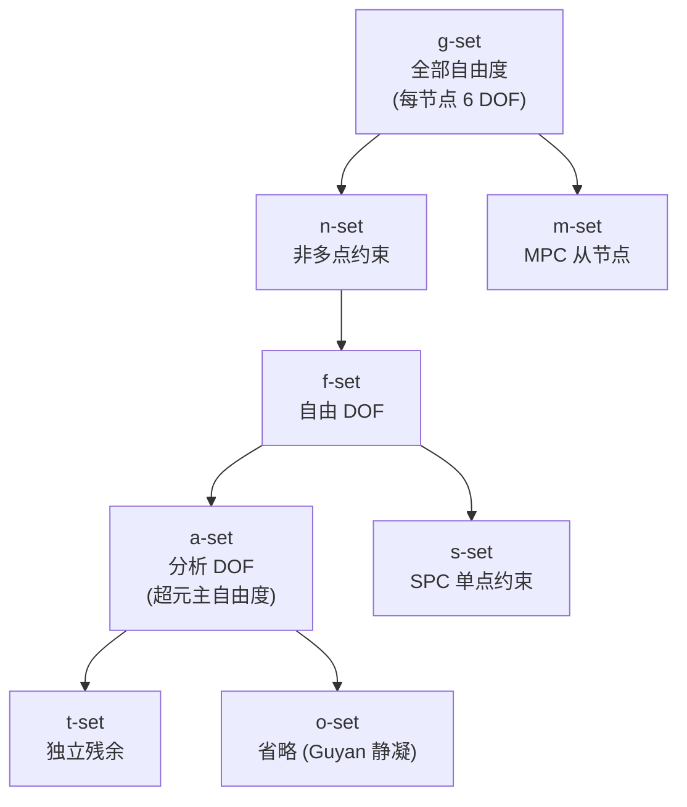

| 集合 | 含义 | 工程意义 |
|------|------|----------|
| `g` | global / 全部 | 6 DOF × 节点数 |
| `s` | SPC suppressed | 单点约束 |
| `m` | MPC dependent | 多点约束从属 |
| `f` | free = g − s − m | 主要分析对象 |
| `a` | analysis | 显式保留的主自由度（超元用） |
| `o` | omitted | 静凝缩消去的自由度 |

**重要程度**：当 hy-cad-tool 走到"子结构 / 模态综合 / 超元"阶段时，**没有这套 Set 抽象，子结构装配会一团乱**。

### 3.5 Superelement：60 年代就有的"微服务"

Nastran 的 **Superelement (SE)** 是工业 FEM 中最早的"组件化"思想：

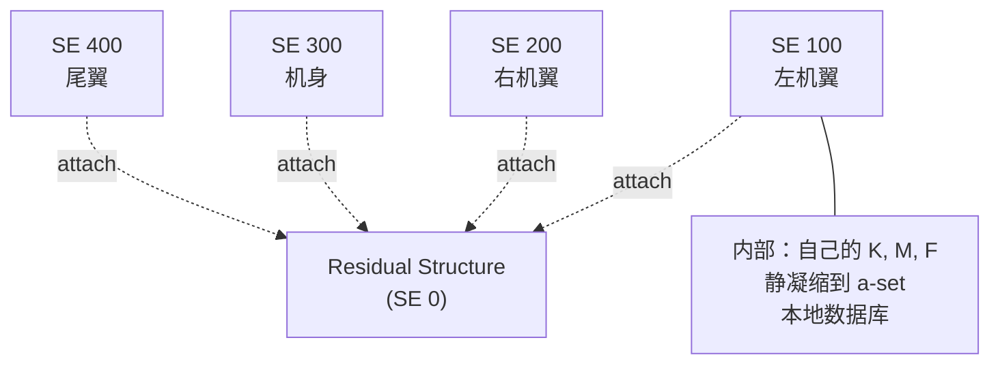

| 特性 | 说明 |
|------|------|
| **静态凝缩** | Guyan 缩减：$\mathbf{K}_{aa} = \mathbf{K}_{aa} - \mathbf{K}_{ao}\mathbf{K}_{oo}^{-1}\mathbf{K}_{oa}$ |
| **动态凝缩** | CMS (Component Mode Synthesis)：Craig-Bampton 法保留固定接口模态 + 静态约束模态 |
| **数据本地化** | 每个 SE 有自己的 DBALL 数据库（OUTPUT2 文件），可独立计算后并入主分析 |
| **并行分布** | 各 SE 可并行求解，节省内存 |

**这对 hy-cad-tool 的启示极其关键**——如果未来要做"全路线 1km × 50 个挡土墙 + 10 座桥 + 100 段填筑"的工程级模型，**绝对不能放在一个全局 K 矩阵里求解**。Superelement 思想需要在 02 文档的 `FemProblem` IR 中预留位置：

```csharp
public sealed record FemProblem
{
    public IReadOnlyList<SubstructureRef> Substructures { get; init; } = [];
    public RetainedDofPolicy DofRetention { get; init; } = default!;
}
```

### 3.6 求解器内核：稀疏直接法 + Lanczos + 共轭梯度

Nastran 历史上以 **BCSLIB-EXT（IBM 出身的稀疏直接法）** 闻名。近年来核心数值能力：

| 求解器 | 适用 | 备注 |
|--------|------|------|
| **BCSLIB-EXT 稀疏直接法** | 中小规模静力 | 多锋面法 (Multifrontal)，2~30 万 DOF |
| **MUMPS / PARDISO 风格** | 中等规模 | 现代版本提供 |
| **Lanczos 迭代** | 模态分析 | Block Lanczos，几百模态以下高效 |
| **PCG 预条件共轭梯度** | 大规模静力 | AMG 预条件 |
| **GDSWFE / FETI-DP** | 域分解并行 | HPC 路线 |

> **hy-cad-tool 启示**：02 文档已设计 `ISolverBackend`。可以**第一版只走内置 CSparse.NET**，但接口要为后续 P/Invoke 到 MUMPS/Eigen/PARDISO 留好类型边界（**绝不能在 `ISolverBackend` 里暴露 CSparse 特有类型**）。

### 3.7 输出体系：OP2 / F06 / PCH 三轨

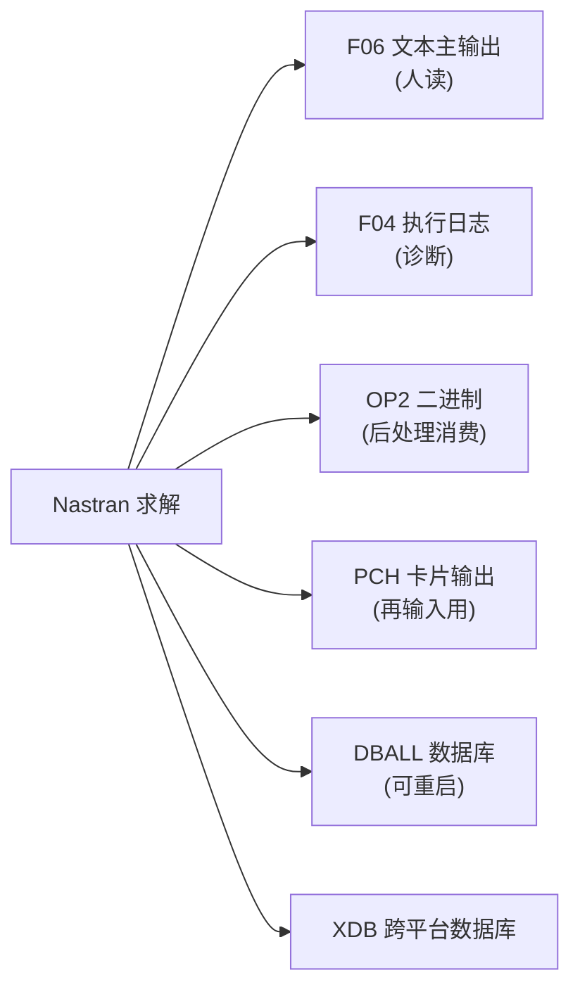

| 文件 | 用途 | 设计哲学 |
|------|------|----------|
| **F06** | 人读 ASCII 主报告，含模型回显、迭代日志、结果表 | 计算书的雏形 |
| **F04** | 求解时间、内存、I/O 统计 | DevOps 友好的执行可观测性 |
| **OP2** | 二进制结果文件，给 Patran/Femap 消费 | 大数据量结果传输 |
| **PCH** | "Punch" 输出，把结果当 Bulk Data 卡输出 | **结果回流作为下次输入**——超绝的设计 |
| **DBALL** | 求解期数据库，支持重启 | Restart 必备 |

**关键洞察 — PCH 的设计**：把"输出"和"输入"放在**同一种文本格式**中。这意味着上一次分析的位移可作为下一次分析的初始条件直接 INCLUDE。这对应 hy-cad-tool 的"**stage construction**"场景：上阶段结果直接成为下阶段初始场。

---

## 四、MSC Marc 架构深挖

Marc 是 MSC 体系中**强非线性**与**多物理场**的担当。和 Nastran 的"工业气派"不同，Marc 更像"实验室硬核"。

### 4.1 总体定位与求解流程

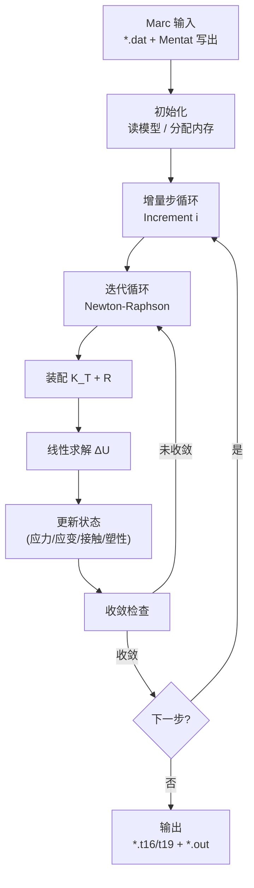

| 关键特性 | Marc 做法 | 工程意义 |
|----------|-----------|----------|
| **增量—迭代体系** | 时间/荷载分增量步；每步内 Newton-Raphson | 大变形、塑性、接触必备 |
| **自动步长** | AUTO STEP / AUTO INCREMENT，按收敛性调整 | 救命特性，工程师不用手调 |
| **AUTOCONTACT** | 接触自动探测 + 段对段算法 | Marc 的看家本领 |
| **重新划分网格** | 拉格朗日变形过大时 ALE / 全局重划分 | 金属成型、橡胶大变形 |
| **多物理场** | 热—结构、热—电、磁—力、流—固 | 内置耦合，无需外部协同求解器 |

### 4.2 非线性策略矩阵

Marc 是**非线性百科全书**：

| 非线性类型 | Marc 处理 | 算法关键词 |
|------------|-----------|------------|
| **几何非线性** | 大变形（Total/Updated Lagrangian） | TL / UL formulation |
| **材料非线性** | 塑性、蠕变、超弹、损伤、混凝土 | $J_2$ 流动、Mooney-Rivlin、Ogden、Drucker-Prager |
| **接触非线性** | 段对段 + 节点对段、自接触 | Coulomb 摩擦、glued、separation |
| **边界非线性** | 跟随力（Follower）、压力随面变 | Follower forces |
| **多物理耦合** | 热—结构 staggered / monolithic | 强/弱耦合 |

Marc 的**用户子程序（user subroutine）** 体系是其学术生命力的来源：

| 子程序 | 用途 | 类比 |
|--------|------|------|
| `HYPELA2` | 自定义大变形材料 | ABAQUS UMAT |
| `WKSLP` | 屈服面定义 | — |
| `UFORMS` | 自定义单元刚度 | ABAQUS UEL |
| `UFOUR` | 自定义傅立叶热源 | — |
| `FORCEM` | 自定义边界荷载 | ABAQUS DLOAD |
| `UFRIC` | 自定义摩擦 | — |
| `URPFLO` | 自定义渗流 | — |

> **hy-cad-tool 启示**：
> - Marc 的子程序文化告诉我们：**只要有 50+ 个清晰的扩展点，FEA 软件就可以"被研究者改造成新软件"**。这是 hy-cad-tool **PluginContract** 设计的目标——不是"几个大插件接口"，而是"几十个细粒度的扩展点"。
> - 但 Marc 的子程序是 Fortran，调试痛苦。hy-cad-tool 用 C# 的 plugin 应该至少做到"VS/Rider 直接断点 + 热加载"，这是 MSC 模式做不到的现代化提升。

### 4.3 接触算法：Marc 的"看家本领"

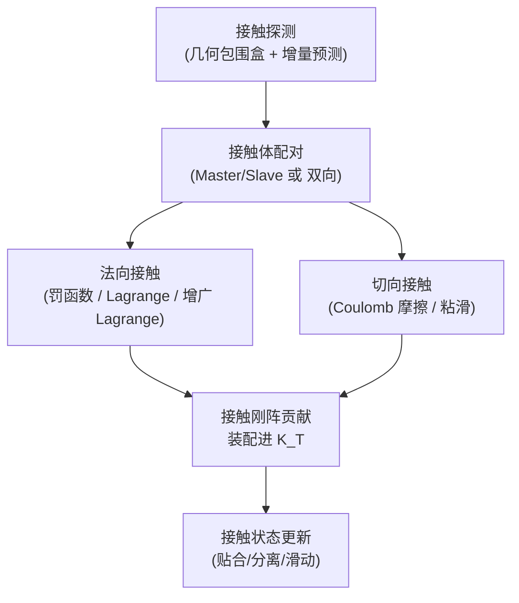

| 接触类型 | Marc 处理 |
|----------|----------|
| **Deformable-Deformable** | 双向接触 + AUTOCONTACT 自动发现 |
| **Deformable-Rigid** | 解析体（rigid body）边界 |
| **Glued / Permanent** | 刚性绑定，不脱离 |
| **Self-Contact** | 单体内部接触 |
| **Beam-to-Beam** | 梁单元接触 |

> 这是 hy-cad-tool 在**桩—土相互作用、挡墙—填土接触**时**必须**面对的问题，且不可能短期自研。对接 CalculiX/Code_Aster 的接触是更现实选择。

### 4.4 多物理场耦合

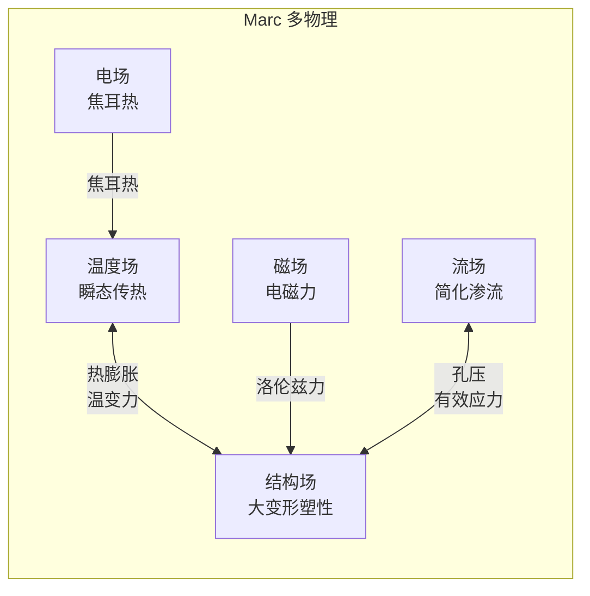

| 耦合策略 | 含义 | 算法 |
|----------|------|------|
| **Staggered** | 物理场分步求解，迭代收敛 | 弱耦合 |
| **Monolithic** | 物理场放入同一矩阵 | 强耦合，矩阵更大 |

> **hy-cad-tool 启示**：
> 道路工程中**最重要的多物理是"渗流—固结"**（路堤填筑、软土地基排水固结）。这是 Biot 理论，Marc 的 staggered 接近可参考。但 hy-cad-tool 短期内可暂以"分级加载 + 等效模量"的工程化简化对付，**不必上完整 Biot**。

---

## 五、MSC Adams 架构深挖

Adams 是 MSC 三件套中**与 FEM 范式最不同**的存在——它本质是 **多体动力学（MBD）**，但通过 **MNF（Modal Neutral File）** 与 FEM 世界优雅接驳。

### 5.1 多体动力学的数学基础

Adams 求解的是 **微分代数方程组（DAE）**：

```text
M(q) q̈ + C(q,q̇) + K q − Φ_q^T λ = F(q, q̇, t)    ← 动力学方程
Φ(q, t) = 0                                          ← 约束方程
```

其中：
- $q$：广义坐标（每刚体 6 DOF：3 平动 + 3 转动）
- $\Phi$：约束方程（铰、滑块、齿轮等）
- $\lambda$：拉格朗日乘子（约束力）
- $\Phi_q$：约束雅可比

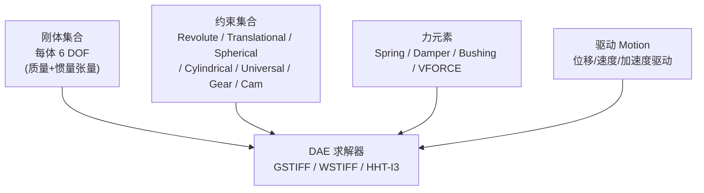

| 求解器 | 类型 | 适用 |
|--------|------|------|
| **GSTIFF I3** | 隐式 BDF，I3 索引 | 一般工业问题，最常用 |
| **WSTIFF** | 隐式，可变阶 | 振荡问题 |
| **HHT-I3** | Hilber-Hughes-Taylor | 高频耗散 |
| **ABAM** | 显式 Adams-Bashforth | 短瞬态 |

### 5.2 柔性多体：MNF 是关键


| 步骤 | 内容 |
|------|------|
| **1. FEM 建模** | 在 Nastran/Patran 中用实体/壳单元建柔性体 |
| **2. CMS 缩减** | 选 N 个固定接口模态 + 接口处的静约束模态 |
| **3. 导出 MNF** | 输出几何 + 模态 + 缩减后的 K, M |
| **4. Adams 装配** | 把 MNF 当作多体系统中的一个"柔性体"，附加其它刚体/铰/驱动 |
| **5. 求解** | DAE 求解器同时处理刚体与柔性体广义坐标 |
| **6. 应力恢复** | 用 Adams 给出的模态参与因子，回算柔性体上每个有限元节点的应力 |

> **这是 MSC 体系最优雅的设计之一**：FEM 与 MBD 不用合并矩阵、不用月级开发耦合求解器，**只通过一个 MNF 文件接口完成数据交换**。

**对 hy-cad-tool 的启示**——这是"**契约式互操作**"的教科书例子：
- 不试图把 Marc 和 Adams 编进一个进程
- 不试图共享内存数据结构
- 用一个**简单、文档化、二进制+元数据**的中间文件做桥

hy-cad-tool 的 `IExternalAnalysisPort` 应学这个模式：**通过文件契约对接，而不是 API 直连**。

### 5.3 Adams 模块化产品族

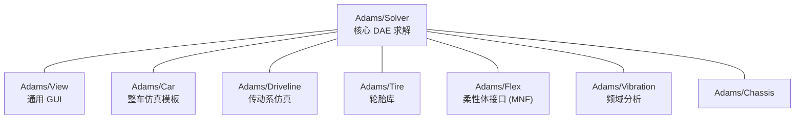

| 模块 | 价值 |
|------|------|
| **Adams/Car** | 把"悬架、转向、制动、底盘"做成模板，整车工程师不用从零搭模型 |
| **Adams/Tire** | Pacejka Magic Formula 等胎面模型 |
| **Adams/Flex** | 柔性体接口，吃 MNF |

> **hy-cad-tool 启示**：模块化要走"**领域模板**"路线——比如未来 hy-cad-tool 的 "Adams/Car" 类比是 "**hy-cad-tool/Road**"（公路模板）、"**hy-cad-tool/Bridge**"（桥梁模板），把领域专家的"组件库"做成商业化抽屉。

---

## 六、三件套的协同：MSC 真正的护城河

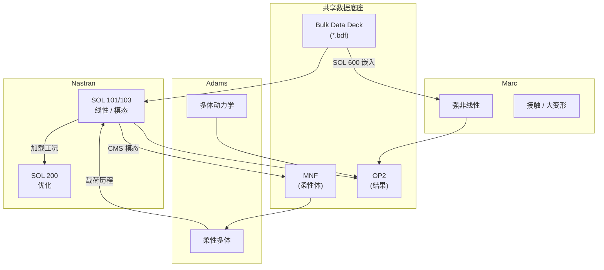

### 6.1 协同模式总结

| 模式 | 数据通道 | 例子 |
|------|----------|------|
| **同进程嵌入** | SOL 600 (Marc) / SOL 700 (Dytran) 直接由 Nastran 调起 | 用户在 BDF 内写非线性卡，Nastran 自动转 Marc |
| **文件契约** | MNF / OP2 / PCH | Nastran 算模态 → 给 Adams 做柔性多体 |
| **第三方编排** | SimManager / SimXpert / Patran | 多工况、多场景的批处理 |
| **DMAP 编排** | 在 Nastran 内部 ALTER 流水线 | 自定义求解流程 |

### 6.2 这给了 hy-cad-tool 什么？

| MSC 协同模式 | hy-cad-tool 对应 |
|--------------|------------------|
| 同进程嵌入 | C# 内部的 `ISolverBackend` plugin |
| 文件契约 | `hyob` ↔ `.inp` / `.bdf` 适配器 |
| 第三方编排 | `AnalysisPipeline`（02 已设计） |
| DMAP | `IPipelineInterceptor`（本文 3.3 节提出） |

---

## 七、MSC 体系的设计哲学：六条可提炼原则

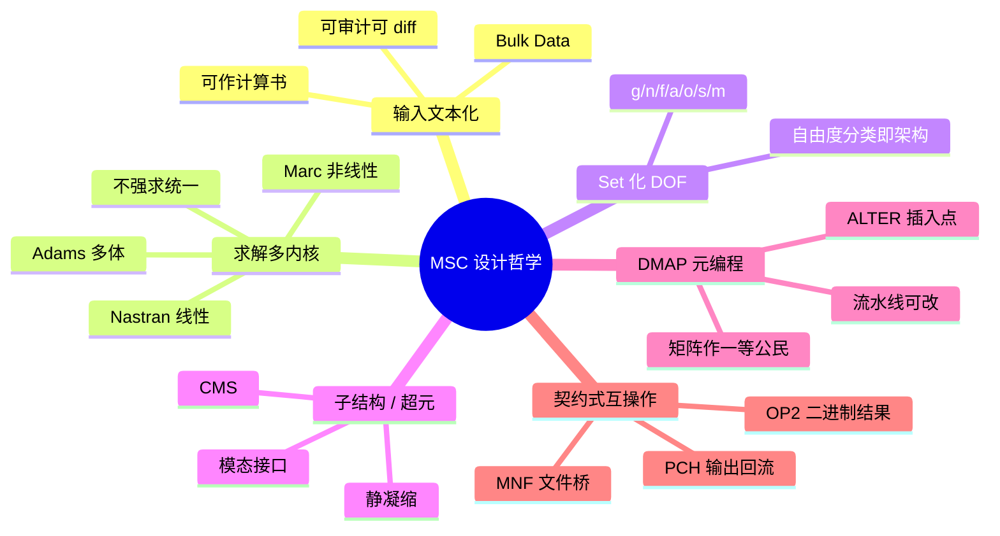

### 7.1 六条原则展开

#### 原则①：输入文本化、人可读、可作计算书

- Nastran Bulk Data 是 60 年来不变的 ASCII 格式
- 不依赖 GUI 也能完整描述一个分析
- 后果：可 git 管理、可批处理、可在服务器上无界面运行

> **hy-cad-tool**：`hyob` 走同样路线，但用 YAML/TOML 代替列定位。

#### 原则②：求解器多内核，不强求统一

- Nastran 不做非线性，丢给 Marc
- 不做显式，丢给 Dytran/LS-DYNA
- 不做多体，丢给 Adams

> **hy-cad-tool**：02 文档的 `ISolverBackend` 已支持多内核，但要把"**问题类型 → 推荐求解器**"做成显式映射，而不是用户自选。

#### 原则③：自由度集合化分类（Set 体系）

- `g/f/a/o/s/m` 是 50 年沉淀的 DOF 分类
- 后果：MPC、超元、模态综合都建立在同一抽象上

> **hy-cad-tool**：在 `FemProblem` IR 中预留 `DofSet` 抽象。第一版可以只有 `f-set / s-set`，但接口要为后续扩展留好。

#### 原则④：子结构 / 超元是组件化的祖先

- Static Condensation (Guyan)
- Component Mode Synthesis (Craig-Bampton)
- 每个 SE 自己一份数据库

> **hy-cad-tool**：这是**未来 1 ~ 2 年最重要的架构投资**——一旦项目模型超过 50 万 DOF，没有 SE 不可能算。02 文档的 `FemProblem` 应预留 `Substructures` 字段。

#### 原则⑤：DMAP 式可编程内核

- 求解流水线可被用户改写
- 矩阵作为一等公民
- ALTER 在固定锚点上插入代码

> **hy-cad-tool**：02 文档的 `AnalysisPipeline` 是个 DAG。在 DAG 节点之间应该有命名锚点（`BeforeAssembly` / `BeforeSolve` / `AfterSolve` / `BeforeOutput`），允许 plugin 注入。这就是 hy-cad-tool 的"DMAP"。

#### 原则⑥：契约式跨求解互操作

- 不通过 API 直连
- 通过格式化文件（MNF / OP2 / PCH）传递
- 后果：跨进程、跨语言、跨版本

> **hy-cad-tool**：对接 CalculiX / Code_Aster / OpenSees 必走此路。`IExternalAnalysisPort` 内部应该是**格式化 + 子进程**，而不是 P/Invoke API。

---

## 八、对 hy-cad-tool 通用底座的具体增补建议

下面把 02 文档已有的设计与本文新提取的 MSC 原则**对齐**，给出**具体增补**。

### 8.1 增补 `FemProblem` IR

```csharp
public sealed record FemProblem
{
    public ProblemMetadata Metadata { get; init; } = new();
    public IMesh Mesh { get; init; } = default!;
    public IReadOnlyList<FieldDefinition> Fields { get; init; } = [];
    public IReadOnlyList<RegionAssignment> Materials { get; init; } = [];
    public IReadOnlyList<RegionAssignment> Formulations { get; init; } = [];
    public IReadOnlyList<LoadCase> LoadCases { get; init; } = [];
    public IReadOnlyList<LoadCombination> Combinations { get; init; } = [];
    public IReadOnlyList<BoundaryCondition> BoundaryConditions { get; init; } = [];
    public AnalysisProcedure Procedure { get; init; } = default!;

    // —— 03 文档新增 —— //
    public DofSetConfiguration DofSets { get; init; } = DofSetConfiguration.Default;
    public IReadOnlyList<SubstructureSpec> Substructures { get; init; } = [];
    public IReadOnlyList<OutputRequest> Outputs { get; init; } = [];
    public RestartPolicy Restart { get; init; } = RestartPolicy.None;

    public long IrRevision { get; init; }
}

public sealed record DofSetConfiguration
{
    public IReadOnlyList<DofSetMember> SpcSet { get; init; } = [];
    public IReadOnlyList<DofSetMember> MpcSet { get; init; } = [];
    public IReadOnlyList<DofSetMember> AnalysisSet { get; init; } = [];
    public IReadOnlyList<DofSetMember> OmittedSet { get; init; } = [];
    public static DofSetConfiguration Default { get; } = new();
}

public sealed record SubstructureSpec(
    string Name,
    SubstructureKind Kind,             // Guyan / CMS-CB / CMS-MacNeal
    IReadOnlyList<NodeId> InterfaceNodes,
    int RetainedModeCount,
    string LocalDatabasePath
);

public enum SubstructureKind
{
    StaticCondensation,
    CraigBampton,
    MacNealRubin,
    Adams_MNF
}

public sealed record OutputRequest(
    string Name,
    OutputKind Kind,                   // Displacement / Stress / Reaction / Energy
    OutputFormat Format,               // Op2 / Csv / Vtk / Hyob
    string? Selection                  // Set 名称
);
```

### 8.2 增补 `AnalysisPipeline` 锚点机制

```csharp
public interface IAnalysisPipeline
{
    Task<FemResult> RunAsync(FemProblem problem, CancellationToken ct);
    IPipelineInterceptorRegistry Interceptors { get; }
}

public enum PipelineAnchor
{
    BeforeMeshValidation,
    AfterMeshValidation,
    BeforeAssembly,
    AfterAssembly,
    BeforeSolve,
    AfterSolve,
    BeforeOutput,
    AfterOutput
}

public interface IPipelineInterceptor
{
    PipelineAnchor Anchor { get; }
    Task InterceptAsync(PipelineContext ctx, CancellationToken ct);
}

public sealed class PipelineContext
{
    public FemProblem Problem { get; init; } = default!;
    public AssembledSystem? Assembled { get; set; }
    public RawSolution? Solution { get; set; }
    public IDictionary<string, object> Slot { get; } = new Dictionary<string, object>();
}
```

> 这就是 hy-cad-tool 的"DMAP ALTER"——任何插件都可以在 8 个固定锚点之一插入逻辑。

### 8.3 增补 `IExternalAnalysisPort` 契约式互操作

```csharp
public interface IExternalAnalysisPort
{
    string Backend { get; }                                 // "calculix" / "code_aster" / "opensees"
    Task<ExternalArtifact> ExportAsync(FemProblem p, string workDir, CancellationToken ct);
    Task<ExternalRunResult> RunAsync(ExternalArtifact a, CancellationToken ct);
    Task<FemResult> ImportAsync(ExternalRunResult r, FemProblem p, CancellationToken ct);
}

public sealed record ExternalArtifact(
    string Format,                                          // ".inp" / ".comm" / ".tcl"
    string MainFile,
    IReadOnlyList<string> AuxiliaryFiles
);

public sealed record ExternalRunResult(
    int ExitCode,
    string StdoutPath,
    string StderrPath,
    IReadOnlyList<string> ResultFiles                       // OP2/T16/RMED 等
);
```

**关键设计**：
- `Export → Run → Import` 三段式，严禁泄漏后端 SDK 类型
- 中间产物全是文件，方便重试与诊断
- 类比：MSC 的 BDF→F06/OP2→Patran 链路

### 8.4 增补 `SubstructureManager`

```csharp
public interface ISubstructureManager
{
    Task<SubstructureArtifact> ReduceAsync(
        FemProblem subProblem,
        SubstructureSpec spec,
        CancellationToken ct);

    Task<AssembledSystem> AssembleResidualAsync(
        FemProblem residualProblem,
        IReadOnlyList<SubstructureArtifact> children,
        CancellationToken ct);
}

public sealed record SubstructureArtifact(
    string Name,
    SparseMatrix ReducedK,
    SparseMatrix ReducedM,
    double[] ReducedF,
    IReadOnlyList<NodeId> InterfaceNodes,
    IReadOnlyList<double[]> RetainedModes,
    string LocalDbPath
);
```

> **路线判断**：这一块**不进 v0.1**，但接口要在 v0.1 就放进 IR 与 Manager 抽象——否则将来想加入子结构必须大改 IR。

### 8.5 增补 `IOutputWriter` 三轨输出

参考 Nastran F06 / OP2 / PCH 的三轨：

| hy-cad-tool 输出 | 对应 Nastran | 用途 |
|-----------------|--------------|------|
| `report.md` | F06 | 计算书的"人读主报告" |
| `result.hyob` | OP2 / PCH | 结构化结果 + 可作下次输入 |
| `diagnostics.json` | F04 | 执行时间、迭代次数、收敛历史 |

```csharp
public interface IOutputWriter
{
    Task WriteReportAsync(FemResult r, string path);              // 人读
    Task WriteHyobAsync(FemResult r, string path);                // 机读
    Task WriteDiagnosticsAsync(SolverDiagnostics d, string path); // 诊断
}
```

---

## 九、应做、应警惕、应直接放弃

### 9.1 应做（高 ROI）

| 优先级 | 动作 | 对标点 |
|--------|------|--------|
| **P0** | 在 `FemProblem` IR 加 `DofSetConfiguration`、`SubstructureSpec` 字段（仅占位） | Nastran g/f/a/o set + Superelement |
| **P0** | 在 `AnalysisPipeline` 引入 8 个 `PipelineAnchor` 锚点 | DMAP ALTER |
| **P0** | 设计 `IExternalAnalysisPort` 三段式（Export/Run/Import）契约 | MSC 的 BDF/OP2 链路 |
| **P1** | 在 `IOutputWriter` 走"人读 + 机读 + 诊断"三轨 | F06 / OP2 / F04 |
| **P1** | 在 02 文档"挡土墙"算例上演示 `IPipelineInterceptor` 注入自定义输出 | DMAP ALTER 用例 |
| **P2** | 写一个 `hyob → Nastran bulk` 的格式化器 | 与 MSC 工业生态互操作 |
| **P3** | 调研 MNF 文件格式，看 hy-cad-tool 能否走"柔性体输出给 Adams"路线（极远期） | Adams/Flex |

### 9.2 应警惕（陷阱）

| 陷阱 | 警示 |
|------|------|
| ❌ **不要把 Nastran 的 60 年遗产照搬** | Bulk Data 列定位、Set 命名都是历史包袱；学思想，不学语法 |
| ❌ **不要自研非线性求解器** | Marc 用了 50 年才把接触做稳；hy-cad-tool 应对接 CalculiX/Code_Aster |
| ❌ **不要在 v0.1 就上 Superelement** | 接口要预留，实现可推迟 |
| ❌ **不要做 DMAP 那种"半图灵完备" DSL** | 太重；hy-cad-tool 的 `IPipelineInterceptor` 是 C# 代码即可 |
| ❌ **不要试图把多体动力学（Adams 类）放进底座** | 那是另一个数学世界，DAE 求解器与 FEM 不同；做也是 v3.0 以后 |

### 9.3 应直接放弃（伪需求）

| 放弃 | 原因 |
|------|------|
| 🚫 显式动力学（Dytran/LS-DYNA 类） | 道路工程极少需要；显式求解器是巨大工程 |
| 🚫 气弹耦合（SOL 145 颤振） | 飞机问题，与 hy-cad-tool 领域无关 |
| 🚫 完整 DMAP 兼容 | 60 年文化，无法在 5 年内复刻 |
| 🚫 与 MSC SimManager 协议级互通 | 商业封闭格式，逆向成本远大于收益 |

---

## 十、一张关系图：MSC 三件套 → hy-cad-tool 底座

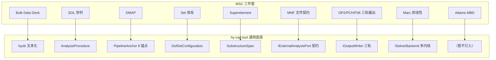

---

## 十一、收束：一句话总结

> **MSC 体系给 hy-cad-tool 的最大启示，不是"功能要做多全"，而是"接口要划多准"。**
>
> Bulk Data 把模型语义与求解算法分开
> SOL 编号把问题类型作为一等公民
> DMAP 把求解流水线开放给用户
> Set 体系把自由度分类作为架构而非命名
> Superelement 把模型组件化早于面向对象
> MNF 把跨求解器协同做成文件契约
>
> 这六条边界，是 hy-cad-tool 通用底座（02 文档）从"能用"走向"专业级"的六块基石——
> **早期不必实现，但绝不能在 IR 与接口形状上留死**。

---

## 参考与延伸阅读

- **MSC Nastran**：
  - *MSC Nastran Quick Reference Guide* — Bulk Data 卡片词典
  - *MSC Nastran DMAP Programmer's Guide* — DMAP 语言与 ALTER
  - *MSC Nastran Superelement User's Guide* — 超元与 CMS
  - *MSC Nastran Numerical Methods User's Guide* — Lanczos / BCSLIB
- **MSC Marc**：
  - *Marc Volume A: Theory and User Information*
  - *Marc Volume D: User Subroutines*
  - *Marc Volume C: Program Input*
- **MSC Adams**：
  - *Adams/Solver Reference Manual*
  - *Adams/Flex User's Guide* — MNF 接口
  - *Adams Theoretical Foundations* — DAE 与 GSTIFF
- **跨求解协同**：
  - *MSC One Integrated Solutions* 白皮书
  - *SOL 600 / SOL 700 Integration Guide*
- **本项目内部参考**：
  - [01-全球三维有限元软件对标调研-2026-05-14](../01-全球三维有限元软件对标调研-2026-05-14.md)
  - [02-有限元通用底座架构-从挡土墙开始-2026-05-14](../02-有限元通用底座架构-从挡土墙开始-2026-05-14.md)

---

## 修订记录

| 日期 | 修订人 | 说明 |
|------|--------|------|
| 2026-05-14 | — | 初版：MSC Nastran/Marc/Adams 架构深挖 + 六大设计原则 + 对 hy-cad-tool 底座的具体增补建议 |
