# Altair 有限元计算架构深度解析（OptiStruct + RADIOSS + HyperWorks）

> 文档日期：2026-05-14
> 系列定位：FEM 软件架构深度解析 · 第 05 篇
> 上承：
> - [01-全球三维有限元软件对标调研-2026-05-14](../01-全球三维有限元软件对标调研-2026-05-14.md)
> - [02-有限元通用底座架构-从挡土墙开始-2026-05-14](../02-有限元通用底座架构-从挡土墙开始-2026-05-14.md)
> 同系列（计划）：
> - 03 ANSYS Workbench + Mechanical APDL + LS-DYNA 架构
> - 04 ABAQUS Standard/Explicit + CAE Python 架构
> - **05 Altair OptiStruct + RADIOSS + HyperWorks 架构（本文）**
>
> 文档目的：
> 1. 拆解 Altair 三套核心引擎（OptiStruct 隐式 + RADIOSS 显式 + HyperWorks 平台）的**内部架构、数据流、关键抽象**；
> 2. 提炼出对 `hy-cad-tool` 有限元底座**真正可借鉴**的设计模式；
> 3. 厘清 Altair 在"优化驱动设计（Simulation-Driven Design）"、"求解器中性前处理"、"许可单位（Altair Units）"三件事上的独特价值。

---

## 一、Altair 全景：不是单产品，是"四引擎平台"

> 多数中文资料把 Altair 写成"OptiStruct 公司"，这是误解。Altair 的真正壁垒是 **HyperWorks 平台**——一个让"求解器、优化、前后处理、流程自动化"四种能力共生的工程仿真操作系统。

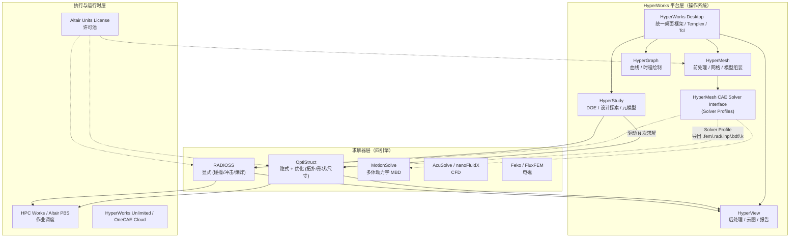

### Altair 的"四象限"产品定位

| 象限 | 维度 | 代表产品 | 战略含义 |
|------|------|----------|----------|
| **隐式 + 优化** | 静力/模态/频响 + 拓扑/形状/尺寸 | **OptiStruct** | "Simulation-Driven Design" 旗舰，**优化是一等公民** |
| **显式 + 大变形** | 碰撞/冲击/爆炸/成形 | **RADIOSS**（2022 开源 → **OpenRadioss**） | 对抗 LS-DYNA 的差异化武器 |
| **前后处理 + 流程** | 网格/可视化/自动化 | **HyperMesh / HyperView / HyperStudy** | **求解器中性**——可用于 Nastran/ABAQUS/LS-DYNA |
| **多体 + 多物理** | MBD/CFD/EMAG | MotionSolve / AcuSolve / Feko | 平台护城河，避免被某条线击穿 |

> **核心战略观察**：Altair 不是"求解器公司"，而是"**让用户在一个壳里跑遍所有求解器**的平台公司"。这是它与 ANSYS（自家求解器封闭生态）、Dassault SIMULIA（与 CATIA 深度绑死）的根本区别。

---

## 二、HyperWorks 平台架构：求解器中性前处理的精髓

### 2.1 三层架构：模型 / 配置 / 求解

HyperMesh 的"求解器中性（Solver-Neutral）"不是营销话术，而是一套实打实的**三层数据模型**：

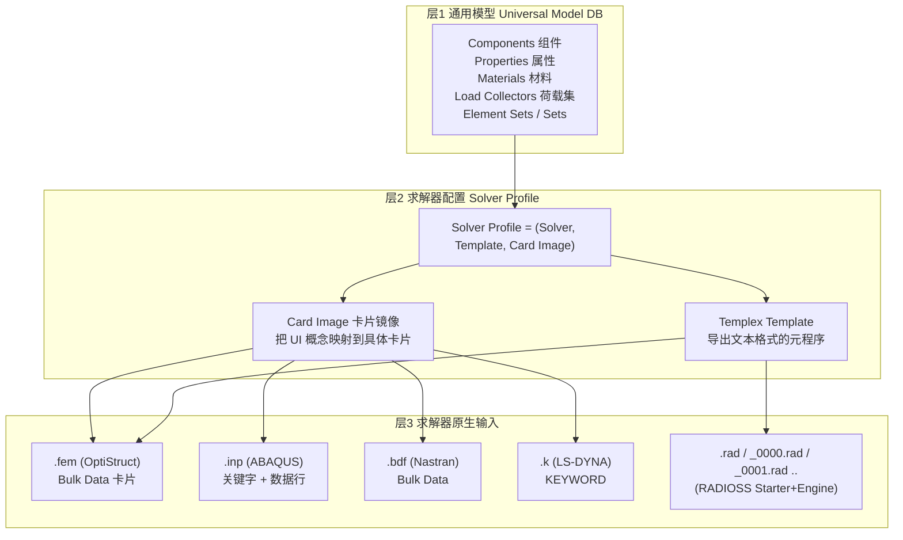

| 层 | 实体 | 关键设计 |
|----|------|----------|
| **L1 通用模型** | 节点、单元、组件、属性、材料、荷载、约束、集合 | 与任何具体求解器**无关**，是 hy-cad-tool 应该重点对标的层 |
| **L2 求解器配置** | Solver Profile（如 "Optistruct"、"Abaqus"、"LS-DYNA"） | 通过**Card Image** 把 UI 中的"梁单元"映射到 OptiStruct 的 `CBAR` 或 ABAQUS 的 `*ELEMENT, TYPE=B31` |
| **L3 求解器原生输入** | `.fem` / `.inp` / `.bdf` / `.k` / `.rad` | 文本文件，由 **Templex 模板引擎**写出 |

### 2.2 Card Image：求解器中性的灵魂

HyperMesh 的每一个领域实体（如"实体单元属性"）都不是一个简单的对象，而是一个 **Card Image 引用**：

```text
Property "P_steel_solid"
  ├─ Card Image: PSOLID (OptiStruct/Nastran)         ← 切换 Profile 时变
  ├─ Material ref: M_steel
  ├─ Card fields:
  │    PID=1, MID=10, CORDM=0, INTEG=DEFAULT, ...
  └─ Solver-specific extensions:
       OptiStruct: ISOP, FCTN
       Nastran:    STRESS, COURLOC
```

**当用户切换求解器 Profile 时**：

1. HyperMesh 检查源 Card Image 与目标 Card Image 的**字段映射表**；
2. 共有字段直接迁移（PID、MID 等）；
3. 独有字段进入"未映射区"，由用户决策保留 / 删除 / 用默认值填充；
4. 切换是**有损但可审计**的操作。

> **hy-cad-tool 启示**：在 `IElementFormulationPlugin` 设计中，引入 **CardImage 概念**——领域单元（如"挡土墙截面"）保留一份与求解器无关的描述，同时维护一套到具体后端（CalculiX `*SECTION`、自研 `BeamSection`、OpenSees `section`）的映射表。

### 2.3 Templex：模板化的元编程层

Templex 是 HyperWorks 自有的**文本模板语言**（类 Python+m4 风格），它是连接"通用模型"与"求解器原生输入"的桥梁：

```text
*setvalue(comps=1,name="frame")
{
*comps()
*if(option,"PBAR")
PBAR    {pid},{mid},{a:f8.4},{i1:f8.4},{i2:f8.4}
*else
PBARL   {pid},{mid},{group}
*endif
*end
}
```

| 角色 | 等价 | 价值 |
|------|------|------|
| **Templex** | C# 的 T4 Template / Jinja2 / Razor | 把"模型 → 文本"做成**用户可编辑、可热更新**的资源 |
| **Solver Deck Templates** | hy-cad-tool 应建的 `templates/solver-decks/*.tpl` | 不写死在 C# 代码中 |

> **hy-cad-tool 启示**：写出 CalculiX `.inp` 或 OpenSees `.tcl` 时，**不要在 C# 代码里拼字符串**——这是 PKPM/YJK 历史包袱的根源。建立一个 `IDeckTemplateEngine`，模板独立成文件，求解器适配器只负责"把领域数据塞进上下文"。

---

## 三、OptiStruct 架构深度解析：优化是一等公民

### 3.1 OptiStruct 的双重身份

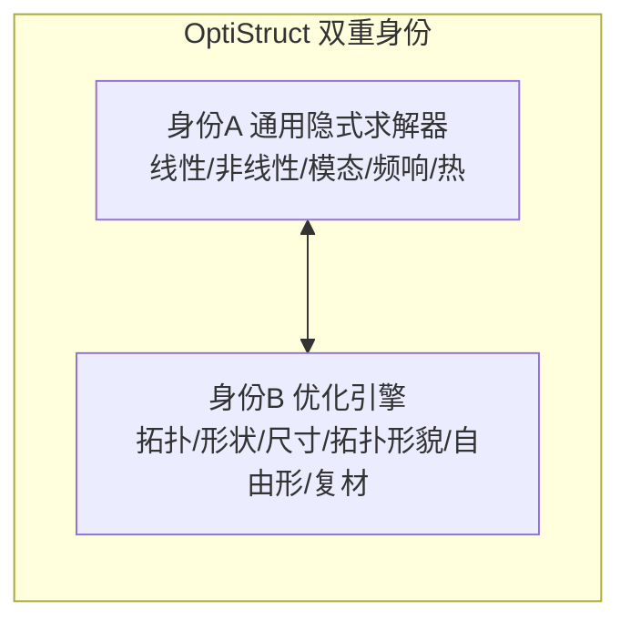

OptiStruct 历史上**先有优化，后有求解器**：

- 1994：Altair 推出 OptiStruct 1.0，**纯拓扑优化前端**，求解走 Nastran；
- 2000+：自研求解器集成，逐步覆盖 SOL 101 / 103 / 108 / 111 / 112 / 200 等求解流程；
- 2010+：补齐非线性（NLSTAT / NLTRAN）、热（TEMP）、显式接口（与 RADIOSS 联合）；
- 今天：**90% 的工业用户买 OptiStruct 是为了拓扑优化**——这决定了它的全部架构。

### 3.2 OptiStruct 的求解器架构

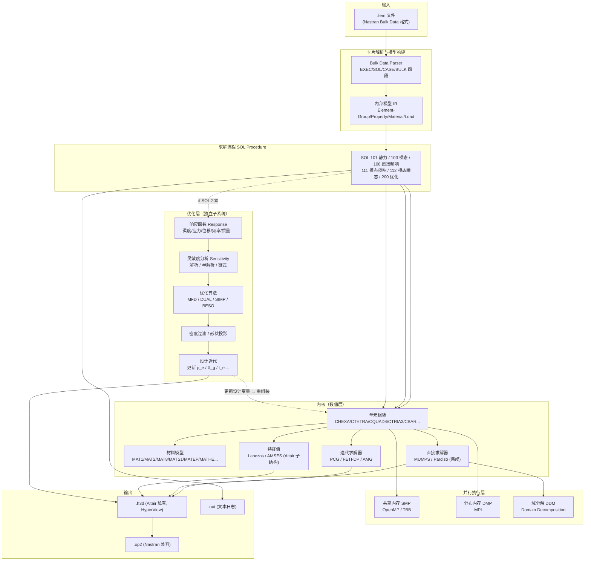

### 3.3 关键架构决策（与 ANSYS/ABAQUS 的差异点）

| 决策 | OptiStruct | ANSYS Mechanical | ABAQUS | 评价 |
|------|------------|------------------|--------|------|
| **输入格式** | Nastran Bulk Data (`.fem`) | APDL (`.cdb` + 命令) | 关键字驱动 (`.inp`) | OptiStruct 拥抱**事实标准**，互操作最强 |
| **优化集成** | **求解器内置 SOL 200**，与静力同核 | Optimization 是 Workbench 编排上层 | TOSCA 是独立产品 | OptiStruct 灵敏度走"解析 + 链式"，效率远超外层包装 |
| **特征值求解** | **AMSES**（Altair 自家子结构 Lanczos）+ Lanczos | Block Lanczos + Subspace | Lanczos + AMS | AMSES 在 10M DOF 模态上业界领先 |
| **稀疏直接求解** | MUMPS / Pardiso（许可商业版） | 自家 SPARSE / DSPARSE | 自家 + MUMPS | OptiStruct 不为重复造轮子付出代价 |
| **迭代法** | PCG（默认）+ FETI-DP（DMP） | PCG / JCG / ICCG | 较少使用 | FETI-DP 是 DMP 大模型主力 |
| **后处理格式** | `.h3d` (Altair 二进制) | `.rst` | `.odb` | h3d 体积小、读写快，但绑死 HyperView |

### 3.4 优化求解器的核心：SOL 200 的"内循环—外循环"

OptiStruct 的优化效率秘密，在于把**灵敏度分析与单元组装共用同一份单元代码**：

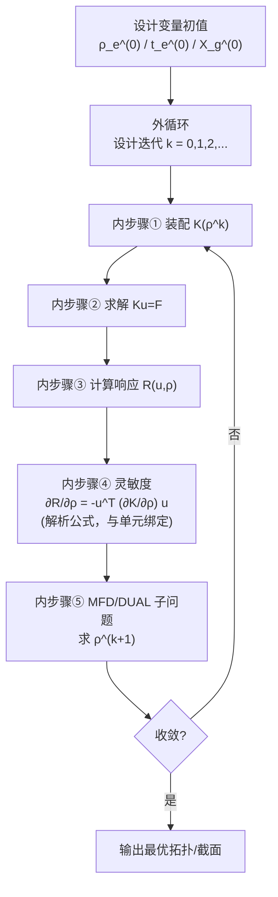

| 关键 | 说明 |
|------|------|
| **灵敏度解析公式与单元同源** | 每个单元类型（CHEXA、CQUAD4...）的子程序里同时写了 `BuildK` 和 `BuildDKDrho` |
| **MFD（Method of Feasible Directions）** | 主算法，几千万设计变量可解 |
| **DUAL（对偶法）** | 约束多时切换，与 MFD 自动切换 |
| **SIMP 惩罚** | ρ → ρ^p（p=3 默认），抑制中间密度 |
| **OC（Optimality Criteria）** | 单约束特例，超快但限制大 |

> **hy-cad-tool 启示**：如果未来 hy-cad-tool 引入"配筋优化、桩位优化、挡墙断面优化"，**不要把优化做成外循环脚本调用求解器**——那是性能灾难。正确做法：在 `IFemAssembler` 接口里同时暴露 `BuildSystem(model)` 和 `BuildSensitivity(model, designVars)`，让优化引擎拿到解析灵敏度。

### 3.5 SOL Sequence：求解流程的"类型枚举"哲学

OptiStruct（继承自 Nastran）把"分析类型"做成**枚举常数 + 求解流程**，而不是 ANSYS Workbench 的"几何积木式编排"：

| SOL 编号 | 名称 | 求解器路径 | 适用场景 |
|---------|------|-----------|----------|
| SOL 101 | 线性静力 | 直接/PCG | 多数工程问题 |
| SOL 103 | 实模态 | Lanczos/AMSES | 模态、振动 |
| SOL 105 | 屈曲 | Lanczos | 线性屈曲 |
| SOL 108 | 直接频响 | 复数稀疏 | 详细频响 |
| SOL 111 | 模态频响 | Lanczos + 模态叠加 | 大模型频响 |
| SOL 112 | 模态瞬态 | Lanczos + Newmark | 时程 |
| SOL 200 | **优化** | 上一节 | 拓扑/形状/尺寸 |
| SOL 400 | 非线性（NLSTAT/NLTRAN） | Newton-Raphson + 弧长 | 接触、塑性、几何非线性 |
| SOL 600 | 与 Marc 联合 | Marc 内核 | 极端非线性（已少用） |

> **hy-cad-tool 启示**：在 `IAnalysisProcedure` 接口里**显式枚举求解过程类型**（`LinearStatic`、`ModalEigen`、`NonlinearStatic`、`Optimization`...），不要走 Workbench 那种"任何积木都能拼"的路线——后者灵活但**容易出现物理上无意义的组合**。

---

## 四、RADIOSS 架构深度解析：Starter/Engine 分离的显式范式

### 4.1 RADIOSS 的两段式管线

RADIOSS 的最具辨识度的架构特征是 **Starter / Engine 二段式**：

```mermaid
graph LR
    subgraph user ["用户输入"]
        Input1["模型文件<br/>*_0000.rad<br/>(Starter 输入)"]
        Input2["运行控制文件<br/>*_0001.rad / *_0002.rad / ...<br/>(Engine 输入, 多段)"]
    end

    subgraph starter ["Starter 阶段 (单次)"]
        Init["1. 模型解析与验证"]
        Geom["2. 几何/单元初始化"]
        Mass["3. 质量/质点矩阵计算"]
        TimeStep["4. 临界时间步估算<br/>Δt = α · L/c"]
        Contact["5. 接触界面预处理<br/>(主从面识别、初始穿透)"]
        Restart1["6. 写出重启文件<br/>RUNNAME_0000.rst"]
    end

    subgraph engine ["Engine 阶段 (可分段)"]
        Loop["主循环<br/>for n in 1..N_steps:"]
        Force["计算节点力 F_int + F_ext"]
        Accel["a^n = M^-1 · (F_ext - F_int)"]
        Vel["v^(n+1/2) = v^(n-1/2) + a^n · Δt"]
        Disp["x^(n+1) = x^n + v^(n+1/2) · Δt"]
        Update["更新单元应变/应力<br/>本构积分"]
        ContactStep["接触检测与法向修正"]
        Output["输出快照（.h3d / .a01 / .out）"]
    end

    subgraph restart ["分段重启"]
        Restart2["写新 .rst<br/>等待 *_0002.rad 续算"]
    end

    Input1 --> Init --> Geom --> Mass --> TimeStep --> Contact --> Restart1
    Input2 --> Loop
    Restart1 --> Loop
    Loop --> Force --> Accel --> Vel --> Disp --> Update --> ContactStep --> Output --> Loop
    Output --> Restart2
```

| 阶段 | 输入 | 输出 | 设计意图 |
|------|------|------|----------|
| **Starter** | `*_0000.rad`（模型） | `*_0000.rst`（重启文件） | 一次性昂贵预处理，与时间步求解解耦 |
| **Engine 第1段** | `*_0001.rad`（运行控制） + 上一段 `.rst` | 时程结果 + 新 `.rst` | 中断—续算、调参不必重新初始化 |
| **Engine 第N段** | `*_000N.rad` + 前段 `.rst` | 同上 | 允许"先粗算 1ms 看看，再决定是否细化" |

### 4.2 为什么 Starter / Engine 分离？四个工程动因

| 动因 | 详细说明 | 对比 |
|------|----------|------|
| **碰撞模拟跑很久** | 汽车正面碰撞 100ms，单步 1μs → 10^5 步，墙钟数小时到数天 | 不能容忍"出错就从头开始" |
| **接触初始化贵** | 主从面、初始穿透、SHELL 法向、ALE 网格...初始化耗时占 20-50% | 重启场景下能跳过 |
| **调参成本敏感** | 用户经常想"换个材料常数再跑一遍后半段" | 改 Engine 输入即可，无需重 Starter |
| **HPC 作业窗口有限** | 集群作业一般 24h 上限，必须能"切片提交" | 多段 Engine 自然适配 PBS/SLURM 队列 |

> **hy-cad-tool 启示**：道路工程中的"**施工阶段分析（Staged Construction）**"在结构上**完全等价于 RADIOSS 的 Engine 分段**——每个施工阶段就是一段 Engine 输入。`hy-cad-tool` 的 `StageDefinition` 应该设计成可重启、可中断、可重提的二段式（参考 `02-有限元通用底座架构` 中的 `IStagedProcedure`）。

### 4.3 RADIOSS 的核心数据结构

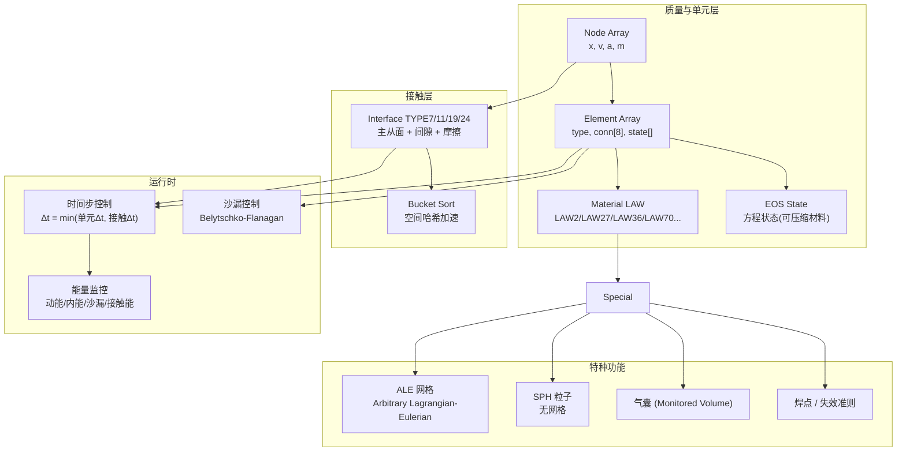

| 数据结构 | 价值观 | 对比 LS-DYNA |
|----------|--------|--------------|
| **LAW 编号系统** | 材料模型用 `LAW2` / `LAW27` 等编号，宏观可分类 | `MAT_*` 名称制，更人类可读但难以编程枚举 |
| **Interface TYPE 编号** | TYPE7（通用）、TYPE11（边对边）、TYPE24（重力）等 | LS-DYNA 用 `*CONTACT_*` 字符串 |
| **沙漏控制独立** | 显式六面体单元的沙漏抑制是独立模块（QEPH 是 Altair 招牌） | DYNA 也有，但 RADIOSS 的 QEPH 在精度—成本权衡上更优 |

### 4.4 OpenRadioss：开源化的战略意义（2022）

2022 年，Altair 把 RADIOSS 的求解核心（不含 Starter 中的部分专利模块）**以 AGPLv3 开源**为 OpenRadioss：

| 维度 | 闭源 RADIOSS | OpenRadioss（2022 起） |
|------|--------------|-----------------------|
| **代码** | Altair 私有 | GitHub openradioss/openradioss |
| **许可** | Altair Units | AGPLv3 |
| **可二次开发** | 通过 user subroutine | 直接改 Fortran 源码 |
| **学术生态** | 中等 | 显著增长 |

**战略动机**：
- 对抗 LS-DYNA（Ansys 子产品）的市场封锁；
- 学术机构低成本接入 → 培养下一代工程师默认选择；
- 形成"开源 RADIOSS + 商业 HyperWorks 平台"的双层货币化结构。

> **hy-cad-tool 启示**：这是**"开源底层 + 商业上层"**的教科书战略。`hy-cad-tool` 若未来发布求解后端，可考虑同样路径——开源 `hy-cad-tool.Solver.Native`（C# 简单线弹性核），商业 `hy-cad-tool.Engineering.*`（领域包：道路、岩土、配筋）。

---

## 五、HyperMesh + HyperView + HyperStudy：流程闭环

### 5.1 HyperMesh：业界第一网格器的内部架构

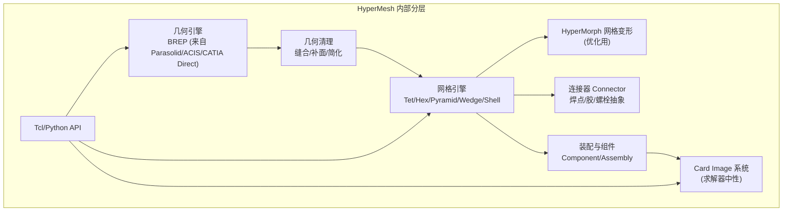

| 模块 | 业界地位 |
|------|----------|
| **CAD 几何兼容** | Parasolid/ACIS/CATIA/NX/Pro-E/STEP/IGES 直读 |
| **批处理网格** | BatchMesher 是工业标杆——大型车身白车身全自动 |
| **HyperMorph** | 让网格"几何参数化"——优化时直接变形而非重画 |
| **Connector** | 焊点/胶层用"逻辑实体"表达，导出时按求解器约定生成 |

### 5.2 HyperView：后处理的"模型—结果分离"

HyperView 的关键架构：**模型数据库（Model）与结果数据库（Result）解耦**：

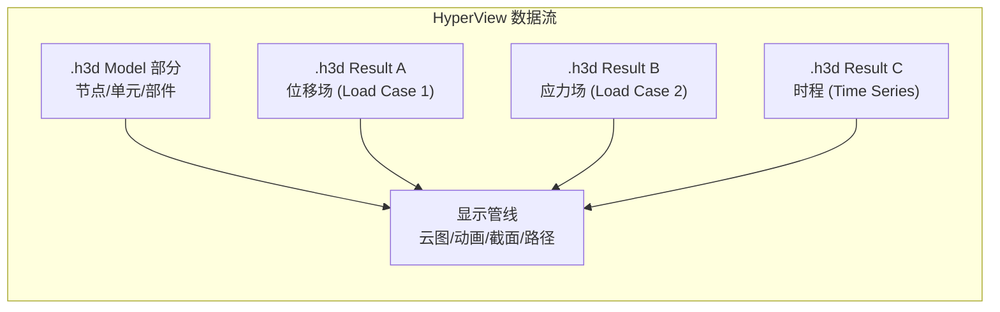

| 价值 | 说明 |
|------|------|
| **多结果同模型** | 一份模型可叠加多次分析结果（线性叠加、对比） |
| **跨求解器统一** | `.h3d` 可来自 OptiStruct、Nastran、ABAQUS（经转换）、RADIOSS |
| **派生量动态计算** | "von Mises 应力" 不是预先存的，而是用户取分量后实时算 |

### 5.3 HyperStudy：DOE 与优化的"外层包装"

HyperStudy 是**模型无关的优化驱动器**，把求解器当黑盒：

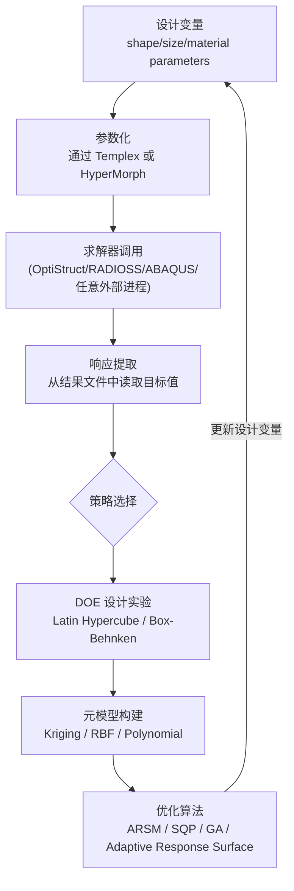

| HyperStudy vs OptiStruct SOL 200 | 区别 |
|----------------------------------|------|
| **HyperStudy** | **黑盒优化** —— 不要求灵敏度，可用于任何求解器 |
| **OptiStruct SOL 200** | **白盒优化** —— 解析灵敏度，仅限自家求解器，但效率高 10-100× |

> **hy-cad-tool 启示**：这是"**白盒优化 vs 黑盒优化**"两条路线的并存——`hy-cad-tool` 应**同时支持两者**：
> - **白盒**：当后端是 `hy-cad-tool` 自研求解器（如简单线弹性挡墙）时，提供解析灵敏度，效率优先；
> - **黑盒**：当后端是 CalculiX/OpenSees 外部进程时，走 HyperStudy 风格的 DOE+RSM 包装。

---

## 六、Altair 的商业架构创新：Altair Units

> 这一节看似不属于"技术架构"，但它**深刻影响了 Altair 软件的功能切分方式**，必须分析。

### 6.1 Altair Units 的本质

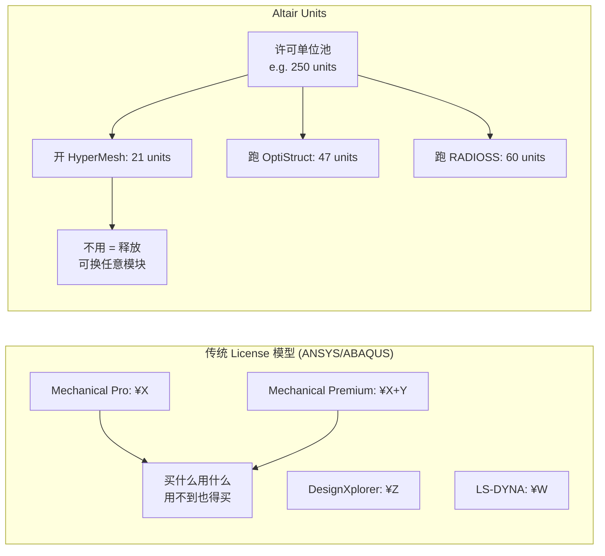

| 维度 | 传统模型 | Altair Units |
|------|----------|--------------|
| **粒度** | 模块绑定 License | 池化"许可货币" |
| **闲置** | 不用也算消耗 | 关闭即释放 |
| **混合使用** | 难（需多 License） | 天然支持 |
| **预算可预测性** | 高 | 中（需监控池子使用率） |

### 6.2 对软件架构的反向影响

Altair Units 让 Altair **不必为"每个模块独立可售"过度切分**——这反过来导致：

- **HyperMesh** 可以自由调用 **OptiStruct 求解器**，而无需做"OptiStruct Light"；
- **HyperStudy** 可以驱动任何 Altair 求解器，**无需考虑 license 互斥**；
- 新模块（如电池热失控仿真）可以**功能完整、按 unit 计费**，无需做阉割版。

> **hy-cad-tool 启示**：商业模型决定架构。`hy-cad-tool` 若未来商业化，**避免"功能模块切片售卖"的诱惑**——切片越细，模块边界越僵化，越难重构。可考虑"用量计费"或"年订阅 + 全功能"模式。

---

## 七、Altair 架构的五条"反直觉"设计哲学

| 反直觉点 | 解释 | 对手做法 |
|----------|------|----------|
| **①不自研网格几何内核** | HyperMesh 直接用 Parasolid / ACIS（付费）+ Open Cascade（部分），不自研 BREP | ANSYS 有 SpaceClaim/DM 自研 |
| **②求解器中性优于求解器自家性** | 优先做 HyperMesh 跨平台，而非"OptiStruct 独享前处理" | ABAQUS/CAE 高度专有 |
| **③优化是求解的内层，不是外层** | SOL 200 与 SOL 101 共用单元代码 | ABAQUS TOSCA 外挂式 |
| **④显式与隐式不强求统一** | OptiStruct 和 RADIOSS 完全独立，不假装"一个求解器搞定所有" | ANSYS Mechanical 内嵌 LS-DYNA、ABAQUS Standard/Explicit 在 CAE 切换 |
| **⑤开源 RADIOSS 反哺平台** | 用开源换学术与新生代忠诚度 | LS-DYNA 仍闭源 |

---

## 八、对 hy-cad-tool 的具体启示（与 02 文档底座架构对照）

### 8.1 hy-cad-tool 应直接借鉴的 7 项 Altair 设计

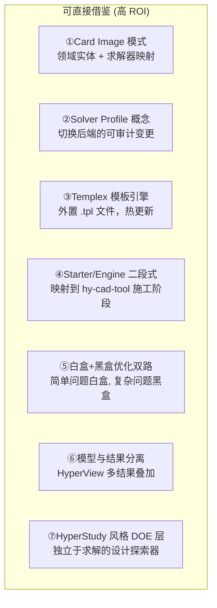

| 编号 | 借鉴点 | hy-cad-tool 落地位置 |
|------|--------|----------------------|
| ① | Card Image | `IElementCardImage` 接口；领域单元持有 CardImage 引用 |
| ② | Solver Profile | `ISolverBackendProfile`：CalculiX / OpenSees / hy-native 三档 |
| ③ | Templex 模板 | `templates/solver-decks/calculix-static.inp.tpl` 等独立资源 |
| ④ | Starter/Engine | `IStagedProcedure.Starter()` + `IStagedProcedure.RunStage(n)` |
| ⑤ | 白盒/黑盒优化 | `IOptimizationDriver` + `ISensitivityProvider` 双接口 |
| ⑥ | 模型—结果分离 | `FemResult` 不冗余存模型；通过引用 `FemProblem` 解码场量 |
| ⑦ | DOE 独立层 | `IDesignExplorer`：独立于求解器，支持 LHS/Box-Behnken |

### 8.2 hy-cad-tool 应避免照搬的 Altair 设计

| 避免点 | 原因 |
|--------|------|
| **❌ 不要照搬 Templex 自创语言** | C# 生态有 Razor/Scriban/Liquid 现成模板引擎，自创语言是 1990s 的奢侈 |
| **❌ 不要照搬 SOL 编号体系** | 数字魔法常量对现代开发是诅咒；用 `enum AnalysisType` 即可 |
| **❌ 不要照搬 `.h3d` 私有二进制** | hy-cad-tool 应坚持**开放结果格式**（VTU/XDMF/Parquet+JSON 元数据） |
| **❌ 不要照搬 Altair Units 模型** | 个人/小团队工具不需要 license 池化复杂度 |
| **❌ 不要把"优化"做成单独产品线** | 应内置为分析流程类型之一，避免 ABAQUS+TOSCA 的割裂 |

### 8.3 把 Altair 架构映射到 02 文档五层底座

> 对应 `02-有限元通用底座架构-从挡土墙开始-2026-05-14.md` 中提出的五层底座。

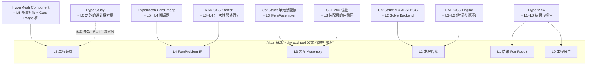

| Altair 概念 | hy-cad-tool 五层底座 |
|-------------|---------------------|
| HyperMesh Card Image | L5 → L4 翻译器（`IDomainToFemTranslator`） |
| OptiStruct 单元代码 + 灵敏度 | L3 装配（`IFemAssembler` + 灵敏度方法） |
| OptiStruct MUMPS/PCG | L2 求解后端（`ISolverBackend`） |
| RADIOSS Starter/Engine | L4+L3+L2 的"分段式"流程封装 |
| OptiStruct SOL 200 | L3 内嵌"白盒优化循环" |
| HyperView | L1 + L0（结果场 + 报告） |
| HyperStudy | L5 之上的"实验设计驱动器"（新增层 L-1） |

---

## 九、行动清单（与 01 文档启示节段对齐）

| 优先级 | 动作 | 对标 | 工作量 |
|--------|------|------|--------|
| P0 | 起草 `IElementCardImage` 接口，落地 1 种单元（线弹性梁）| HyperMesh Card Image | 3 天 |
| P0 | 起草 `ISolverBackendProfile` 接口，先实现 hy-native（C#）| HyperMesh Solver Profile | 3 天 |
| P1 | 把当前 CalculiX `.inp` 生成代码外置为 Scriban 模板文件 | Templex 模板 | 2 天 |
| P1 | 在 `IStagedProcedure` 中引入"Starter / Stage(n)"语义 | RADIOSS Starter/Engine | 1 周 |
| P1 | 起草 `ISensitivityProvider` 接口（梁单元解析灵敏度作首例）| OptiStruct SOL 200 | 1 周 |
| P2 | 起草 `IDesignExplorer` 接口（LHS + RBF 元模型）| HyperStudy | 2 周 |
| P2 | `FemResult` 多结果叠加 API（多工况一份模型）| HyperView | 1 周 |
| P3 | 评估 OpenRadioss 是否可作为 hy-cad-tool 显式后端（道路冲击场景）| OpenRadioss GitHub | 探索性 |

---

## 十、参考与延伸阅读

> 本文为架构层面分析，不替代 Altair 官方功能手册。

- **OptiStruct**：*OptiStruct 2024 User Guide*、*Reference Guide*、*OptiStruct Optimization Tutorials*
- **RADIOSS**：*RADIOSS Theory Manual*、*Starter & Engine Input Reference*；**OpenRadioss** GitHub: <https://github.com/openradioss/openradioss>
- **HyperMesh**：*HyperMesh User's Guide*、*HMASCII Format Reference*、Templex 模板手册
- **HyperView**：*HyperView User's Guide*、*.h3d Format Specification（部分公开）*
- **HyperStudy**：*HyperStudy User's Guide*、*ARSM 算法白皮书*
- **Altair Units**：Altair Licensing Whitepaper（公开）
- **学术回顾**：
  - Bendsøe & Sigmund, *Topology Optimization: Theory, Methods, and Applications*（OptiStruct 算法理论基础）
  - Belytschko, Liu, Moran, *Nonlinear Finite Elements for Continua and Structures*（RADIOSS 显式算法基础）
- **同系列文档**：
  - [01-全球三维有限元软件对标调研](../01-全球三维有限元软件对标调研-2026-05-14.md)
  - [02-有限元通用底座架构-从挡土墙开始](../02-有限元通用底座架构-从挡土墙开始-2026-05-14.md)

---

## 修订记录

| 日期 | 修订人 | 说明 |
|------|--------|------|
| 2026-05-14 | — | 初版：Altair 四引擎平台架构 + OptiStruct 求解 + RADIOSS 显式 + HyperWorks 流程 + 对 hy-cad-tool 五层底座的映射与行动清单 |
