# CSI 三剑客有限元计算架构深度分析：SAP2000 / ETABS / CSiBridge

> 文档日期：2026-05-14
> 上承：
> - [01-全球三维有限元软件对标调研-2026-05-14](../01-全球三维有限元软件对标调研-2026-05-14.md)
> - [02-有限元通用底座架构-从挡土墙开始-2026-05-14](../02-有限元通用底座架构-从挡土墙开始-2026-05-14.md)
> 文档目的：
> 1. 把"CSI 三剑客"这一阵营 B 的代表产品**拆到求解器层级**，看清楚它们的有限元计算架构究竟长什么样。
> 2. 区分三款产品**共享的内核（SAPFire Analysis Engine）**与**各自的领域包装层**，避免被 UI 表象迷惑。
> 3. 提炼可被 hy-cad-tool 借鉴的设计权衡（IR 分层、单元公式、约束体系、FNA、施工阶段、OAPI），并指出**绝不应抄**的地方。

---

## 一、调研口径与三款产品的关系

CSI（Computers and Structures, Inc.，Berkeley，由 Edward L. Wilson 学派创立）旗下三剑客的关系**不是三个独立软件**，而是**同一个计算内核 + 三个领域外壳**：

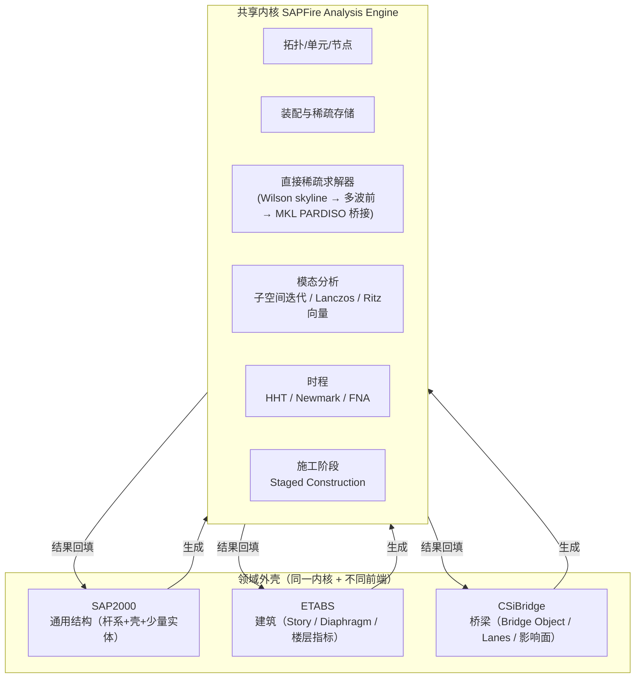

| 产品 | 定位 | 模型术语 | 主用规范 | 典型场景 |
|------|------|----------|----------|----------|
| **SAP2000** | 通用三维结构 | Joint / Frame / Area / Solid / Link | AISC / ACI / EN / GB | 工业厂房、塔架、空间结构、教学 |
| **ETABS** | 建筑专用 | Story / Pier / Spandrel / Diaphragm / Beam / Column / Wall | AISC/ACI/EN/GB/IS | 高层建筑、剪力墙、抗震设计 |
| **CSiBridge** | 桥梁专用 | Bridge Object / Layout Line / Lanes / Bearings / Tendons | AASHTO/EN1992-2/JTG | 简支/连续/斜拉/悬索/曲梁、移动荷载 |

> **关键事实**：CSiBridge 与 ETABS 都是**在 SAP2000 之上做的领域定制**。三者输出的 `*.sdb / *.edb / *.bdb` 数据库结构虽不同，但**编入求解器之前都被翻译成同一份"Analysis Model"**——这就是 SAPFire 的内部 IR。

---

## 二、整体架构：四层 + 一总线

CSI 三剑客的计算架构可整理为如下四层：

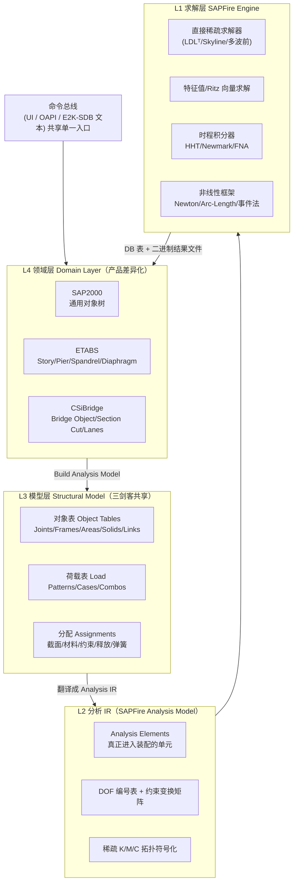

层间契约要点：

| 层 | 职责 | 数据载体 | 不可逾越的边界 |
|----|------|----------|----------------|
| L4 领域 | 工程师术语 + 规范设计 | DB 数据库表 / E2K-EDB-BDB 文本 | **不直接构造单元矩阵** |
| L3 模型 | 对象→单元映射、自动剖分 | 内存表 + 临时文件 | 不感知特定积分器 |
| L2 分析 IR | DOF 编号 / 约束消元 / 主从映射 | 稀疏拓扑结构 | **不持有领域语义** |
| L1 求解 | 数值计算与积分 | 二进制 results 文件 | 不感知"墙/柱/梁"概念 |

这一分层与 hy-cad-tool 在 `02-有限元通用底座架构` 中提出的五层（领域 / IR / 装配 / 求解后端 / 结果）几乎同构——**CSI 的 IR 概念，本质上就是 SAPFire 的 Analysis Model**。

---

## 三、SAPFire Analysis Engine：共享内核拆解

> "SAPFire" 是 CSI 自 2000 年起重写的下一代分析内核（在 Wilson 系 SAP 系列的 skyline 求解器基础上现代化）。SAP2000、ETABS、CSiBridge **都使用 SAPFire**，差异只在前端与设计模块。

### 3.1 内核能力清单

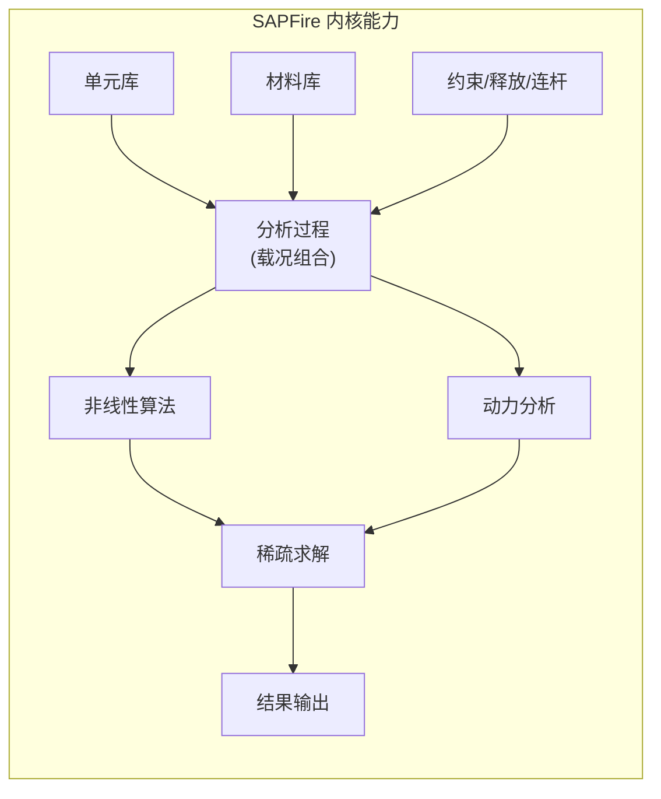

| 模块 | 关键能力 | 实现特点 |
|------|----------|----------|
| 单元库 | Frame / Cable / Tendon / Shell / Plane / Asolid / Solid / Link / Joint mass | 总计 ~12 类、~30 个公式变体 |
| 材料 | 各向同性/正交/各向异性、Nonlinear（Mander 混凝土、Park 钢、Takeda、Pivot） | 与 hinge / fiber section 解耦 |
| 约束 | Body / Diaphragm / Plate / Beam / Rod / Weld / Equal / Local / Line | 通过**变换矩阵**做静态凝聚 |
| 分析过程 | 线性静力 / 模态 / 反应谱 / 时程 / 屈曲 / P-Delta / 静力推覆 / 移动荷载 / 施工阶段 / 稳态 / 功率谱 | DAG 形式的 Case Tree（Initial Conditions 链） |
| 非线性 | Material / Geometric (P-Delta / Large Disp) / Link (Gap/Hook/Friction/Plasticity) / Hinge (P-M-M) / Tension-only | Newton / Modified Newton / Arc-length / Event-to-event |
| 动力 | 模态叠加 / 直接积分 HHT / Newmark / **FNA（Fast Nonlinear Analysis）** | FNA 是 CSI 招牌：仅在 Link 非线性而结构其余线性时近 100× 提速 |
| 求解 | 直接稀疏（LDLᵀ）+ 模式重排 + 多波前 / 桥接 Intel MKL PARDISO | 64-bit 全面化（2010 后），早期为 skyline |
| 结果 | 节点位移 / 反力 / 内力 / 应力 / 模态 / 历史 / 包络 / 设计 ratio | 二进制 `.LOG/.OUT/.BIN` + DB 表 |

### 3.2 内部数据流

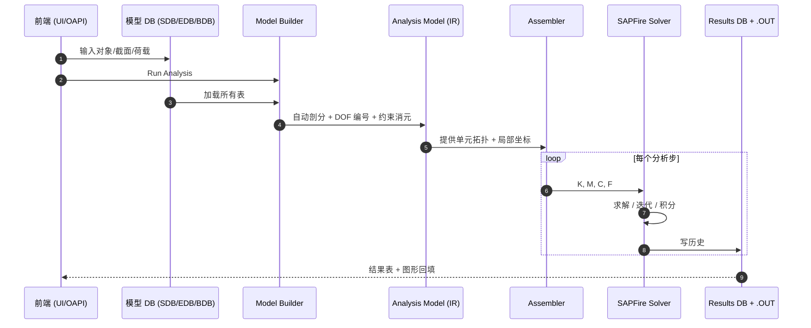

**注意三件事**：

1. **"Run Analysis"是一次性事件**：用户改一根梁，结构模型变脏，下一次 Run 时整模型重新 Build Analysis Model。**没有增量装配**。这是 CSI 工程化的取舍：稳定 >> 速度。
2. **DB 与 IR 严格分离**：用户在 UI 看到的"Frame 1"在 IR 中可能是 1 个或 4 个 `Analysis Element`（自动剖分了）。
3. **结果文件是二进制 + DB 双轨**：图形显示读二进制（快），表格/Excel 读 DB（兼容）。

---

## 四、单元库与公式

CSI 的单元库**不大但很精**——每个单元都是"工程友好型"，背后的公式经历了 30 年验证。

### 4.1 单元家族总览

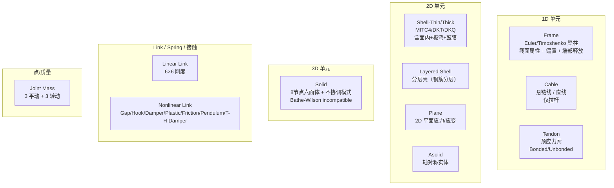

### 4.2 关键单元的实现要点

#### Frame（杆系主力）

- **几何**：直梁或带曲线 insertion point；端部 12 自由度（含扭、双弯、轴）。
- **公式**：标准 Timoshenko 梁，含**剪切变形**（可关），**Property Modifiers** 直接乘到 EA/EI/GJ/GAs 上（CSI 招牌——快速做开裂/有效刚度）。
- **特色**：
  - **Frame Hinges**（P-M2-M3 集中塑性铰）：用 lumped plasticity，**事件法 Event-to-event** 求解，是 Pushover 的核心。
  - **Insertion Point + Joint Offset**：偏置由刚臂或局部约束实现，不影响截面属性。
  - **Releases**：以**端部刚度调整**而非真正凝聚实现（避免破坏稀疏性）。
- **非线性**：P-Δ 通过几何刚度 `Kg = N/L · diag` 叠加；Large Displacement 用 corotational 公式。

#### Shell（壳元主力）

- **Shell-Thin**：DKT/DKQ + 面内 4 节点 isoparametric。
- **Shell-Thick**：MITC4（Bathe-Dvorkin）抑制剪切锁定。
- **Layered Shell**：每层独立厚度/材料/角度，支持非线性混凝土 + 钢筋——ETABS 抗震墙的核心。

#### Solid（少用但关键）

- 8 节点六面体 + Wilson **不协调模式**（incompatible modes）抑制剪切锁定。
- 仅做线性 + 几何非线性，**不做塑性**——这是 CSI 把"3D 实体大模型非线性"留给 ABAQUS/ANSYS 的明确边界。

#### Link/NLLink（CSI 的真正杀手锏）

| 类型 | 物理意义 | 数值实现 |
|------|----------|----------|
| Linear | 6×6 弹簧 | K = diag(kx,ky,kz,kxx,kyy,kzz) |
| Gap | 单边间隙 | 分段线性 / 接触力 |
| Hook | 单边受拉 | 同上 |
| Damper | 黏滞阻尼 c·v^α | 速度幂律 |
| Plastic Wen | 双线性塑性 | Bouc-Wen 单变量 |
| Friction Isolator | 滑动摩擦支座 | 速度相关 μ + 摆面恢复 |
| Pendulum | 摩擦摆 | 双摆面 |
| MultiLinear Elastic / Plastic | 自定义曲线 | 分段线性 |
| T/C Friction | 各向独立 | 矩阵分块 |

**FNA 仅对 Link 单元识别非线性**，这是 CSI 把"非线性"约束到点对点连接的设计哲学：**绝大多数实际抗震/隔震/连廊问题都可建模为"线性主体 + 非线性连接"**。

### 4.3 单元与领域对象的映射

| 领域对象（ETABS/CSiBridge 视角）| 实际生成的 Analysis Element |
|--------------------------------|-----------------------------|
| Beam / Column | Frame |
| Wall（剪力墙） | Shell-Thin 或 Layered Shell（按 ETABS 设置） |
| Slab（楼板） | Shell + Diaphragm 约束 |
| Bracing | Frame |
| Pier / Spandrel | **逻辑分组**，不是单元——只是用于结果切割的"截面组" |
| Bridge Deck（CSiBridge） | 自动剖分为 Frame Spine 或 Shell Areas（取决于 Update 选项） |
| Bearing（支座） | Link（线性或 Nonlinear） |
| Foundation Spring | Joint Spring 或 Link |
| Tendon（预应力） | Tendon 单元（嵌入 Frame/Shell/Solid） |

> 这张表说明一个 CSI 的核心隐喻：**Domain Object ≠ Element**。Pier/Spandrel 这种"组合体"完全是为结果切割与设计验算服务的虚拟实体——而这正是 hy-cad-tool 中**"墙/桩/路基"等领域对象应当采用的设计**：它们不是单元，而是**单元的逻辑视图 + 设计语义载体**。

---

## 五、约束与自由度体系

CSI 用一套**约束-变换矩阵-DOF 编号**体系把"工程师的直觉"高效压进求解器：

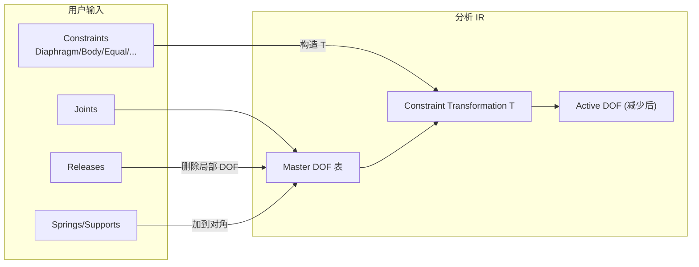

### 5.1 约束类型与数值含义

| 约束 | 几何含义 | 实现 |
|------|----------|------|
| **Body** | 多节点完全刚性连接 | 主从消元，所有 6 DOF 跟主节点 |
| **Diaphragm** | 平面内刚性（楼板假设） | 平面内 3 DOF（ux, uy, rz）跟主，板外保留 |
| **Plate** | 平面外刚性 | 与 Diaphragm 互补 |
| **Beam** | 沿轴向刚性（拉压） | 1 个轴向 DOF |
| **Rod** | 沿连线刚性 | 1 个法向 DOF |
| **Equal** | 选定 DOF 强制相等 | 主从一一对应 |
| **Local** | 在局部坐标系下做 Equal | 同上 + 旋转矩阵 |
| **Weld** | 重合节点焊接 | 几何邻近自动 Body |
| **Line** | 沿线的 Diaphragm | 一维版 |

**核心数学**：所有约束统一成线性变换 `u_full = T · u_active`，组装时 `K_active = Tᵀ K_full T`，`F_active = Tᵀ F_full`。这就是教科书上的**静态凝聚**，但 CSI 做到了**全模型一次性变换**而非逐单元，效率极高。

### 5.2 Diaphragm 的工程哲学

ETABS 的 Rigid Diaphragm 几乎是其市场护城河之一：

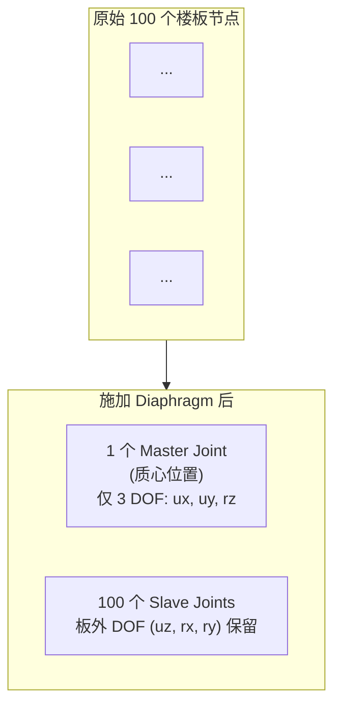

| 效果 | 数值意义 |
|------|----------|
| DOF 数减少 ~70% | 求解 K = LDLᵀ 时间 ↓ |
| 楼层抗扭、楼层位移直接来自 master | 设计/规范验算可直接读取 |
| 振型质量分布集中于楼层 | 模态结果更符合工程师直觉 |

**hy-cad-tool 启示**：对于 hy-cad-tool 涉及的**路面整体板、桥梁横隔板、挡墙顶部冠梁、桩承台**等场景，应当设计相同形态的"行业级约束"——把工程师的"假设"（如某截面刚性、某线段共平面）直接编码为可注入 IR 的 `Constraint`，而不是逼工程师手动建一堆主从节点。

### 5.3 DOF 编号策略

SAPFire 内部 DOF 编号采用：
1. **Cuthill-McKee** 或 AMD（近似最小度）做带宽/填充重排；
2. 约束消元后 active DOF 重新连号；
3. 节点的 6 个 DOF 默认全开，**显式约束/释放/弹簧**才打掉。

**对照 OpenSees**：OpenSees 让用户**手动**指定 ndf（每节点 DOF 数）和 ndm（维度）；CSI 全自动且统一 6。**易用性差距由此而生**——但代价是 CSI 对"特殊问题"（如壳-实体过渡的 6→3 DOF 切换）不灵活。

---

## 六、分析过程与载况体系

CSI 把"分析"组织成一个 DAG（有向无环图）形式的 **Case Tree**，每个 Load Case 可以指定 **Initial Conditions** 来源于另一个 Case。

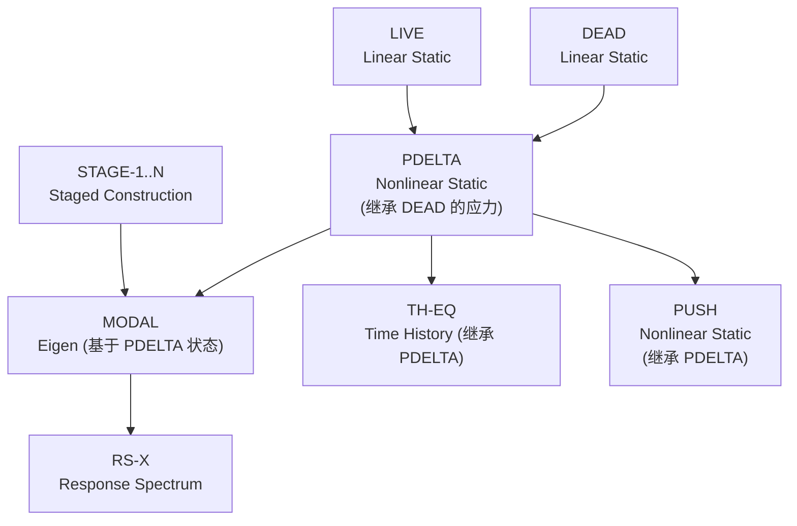

### 6.1 载况类型一览

| 类型 | 数学 | 备注 |
|------|------|------|
| Linear Static | K u = F | 最基本 |
| Modal Eigen | (K − λ M) φ = 0 | Subspace Iteration |
| Modal Ritz | 给定荷载向量空间投影 | **Ritz 向量** = CSI 推荐，质量参与更高 |
| Response Spectrum | CQC/SRSS 组合 | 含双向耦合 |
| Time History (Modal) | 模态叠加 | 仅线性 |
| Time History (Direct) | HHT/Newmark 直接积分 | 含几何非线性 |
| **FNA** | 模态空间 + Link 非线性 | CSI 招牌 |
| Nonlinear Static | Newton/Arc-length | Pushover 主用 |
| Buckling | (K + λ Kg) φ = 0 | 线性屈曲 |
| Moving Load | 影响面 × Vehicle Class | CSiBridge 招牌 |
| Steady-State / Power Spectral | 频域响应 | 振动疲劳 |
| Staged Construction | 序列化 N 个阶段 | 施工阶段必备 |

### 6.2 模态分析：Eigen vs Ritz

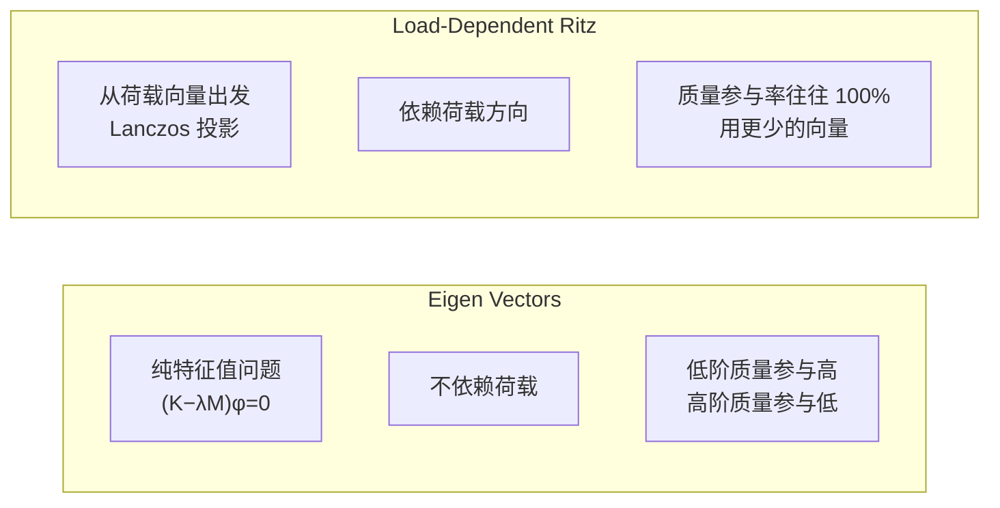

**CSI 官方推荐**：做反应谱与时程时**用 Ritz 向量**——因为 Ritz 向量天生与荷载方向对齐，**少数向量就能覆盖 99%+ 质量参与**，求解效率与精度都更好。

> 这是 SAP2000 / ETABS / CSiBridge 区别于 OpenSees 的一个"工程友好"细节：用户**不必**指定"取 50 阶模态"，软件会自动用 Ritz 向量法在用户给定的截止频率/精度内挑足够多的向量。

### 6.3 FNA（Fast Nonlinear Analysis）：CSI 的核心招牌

FNA 是 Wilson 1989 年提出的方法，CSI 把它工程化：

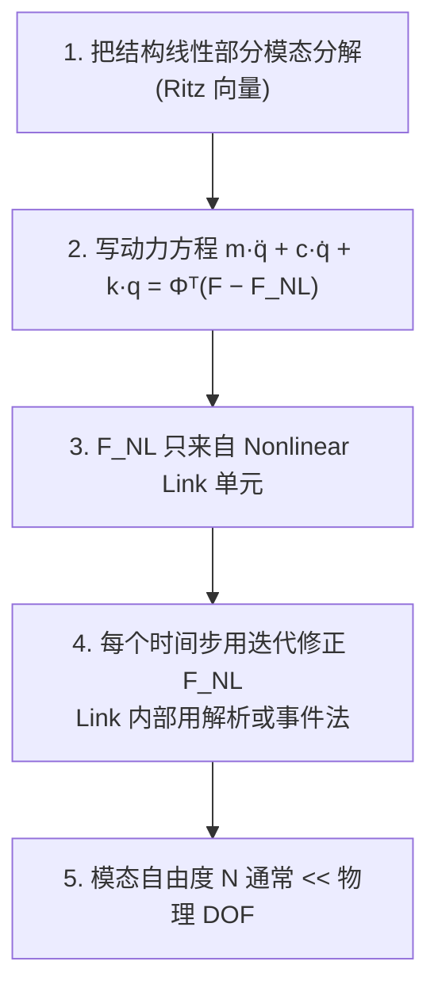

| FNA 适用 | 不适用 |
|---------|--------|
| 隔震/消能/连廊 | 整体材料非线性 |
| 间隙、单边支撑 | 大变形 |
| 黏滞阻尼器、摩擦摆 | 非线性混凝土楼板 |
| 大量线性结构 + 少数非线性连接 | 严重 P-Δ |

**性能数据**：CSI 文档中典型加速比为 **20× ~ 100×** 相对于直接积分（Direct Integration）的同等精度时程分析。

**核心洞察**：FNA 把"非线性"作为**局部修正项**而非"整体非线性方程"，避免了每步重组 K。这一思想可推广到任何"主体线性 + 局部非线性"的问题，是 hy-cad-tool 涉及隔震桥、阻尼器消能墙时**强烈应当对标**的算法。

### 6.4 Nonlinear Static（Pushover）：Event-to-Event

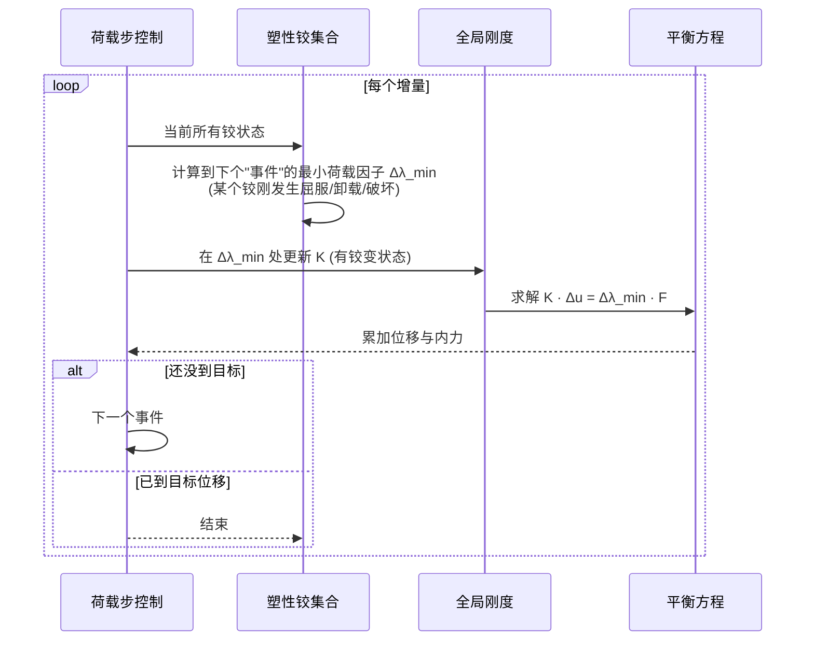

**事件法 vs 牛顿法**：事件法的优势是**可证明的收敛性**——任何时刻 K 都是分段线性段内的精确切线刚度，不会出现震荡；劣势是事件数过多时慢。CSI 给用户提供**事件法 + 牛顿法的混合**（Event Driven with Constant Stiffness Iteration），实际工程友好。

### 6.5 Staged Construction（施工阶段）

CSI 把施工阶段定义为**一系列 Nonlinear Static 阶段**，每个阶段包含：
- 增加/移除单元组（Element Groups）
- 改变截面/材料
- 施加荷载
- 自重激活时间
- 时变收缩、徐变（混凝土）
- 时变松弛（预应力）

| 关键设计 | CSI 实现 |
|----------|----------|
| 单元 Group | 每个 Frame/Area/Solid/Link 可属一个或多个 Group |
| 自重激活 | "Add to Structure"时按未变形几何加自重 |
| 几何冻结 | 新加入单元继承当前节点位移作为零位移参考 |
| 徐变模型 | CEB-FIP / ACI209 / Eurocode 2 内置 |
| 预应力时序 | Tendon 按时间张拉 + 时变松弛 |

**对照 hy-cad-tool 路线**：道路、挡墙、桩基、桥涵——几乎所有工程都需要施工阶段。CSI 的这套抽象（Group + Activation + Time-Dependent）应当**直接对标**，且优于 Plaxis 3D 的"线性阶段链"模式，因为它允许阶段之间的**非线性继承**（位移、塑性、徐变状态全部冻结传递）。

---

## 七、求解器层

### 7.1 演进史

| 时期 | 求解器 | 特点 |
|------|--------|------|
| 1970s-1990s（SAP IV/V/SAP90） | **Wilson skyline LDLᵀ** | 一维存储，按列高度划分；带宽优化 |
| 2000s（SAP2000 v8+） | 改进 skyline + 多块 | 64-bit、磁盘外存 |
| 2010s（SAPFire 64-bit）| 稀疏直接法（CSI 自研 + Intel MKL PARDISO 桥接） | 模式重排（AMD/METIS）、内存/磁盘混合 |
| 现代 | 直接稀疏 LDLᵀ + 并行 + 64-bit | 大模型 1000 万 DOF 可行（需充分内存） |

### 7.2 仍以"直接法"为主的理由

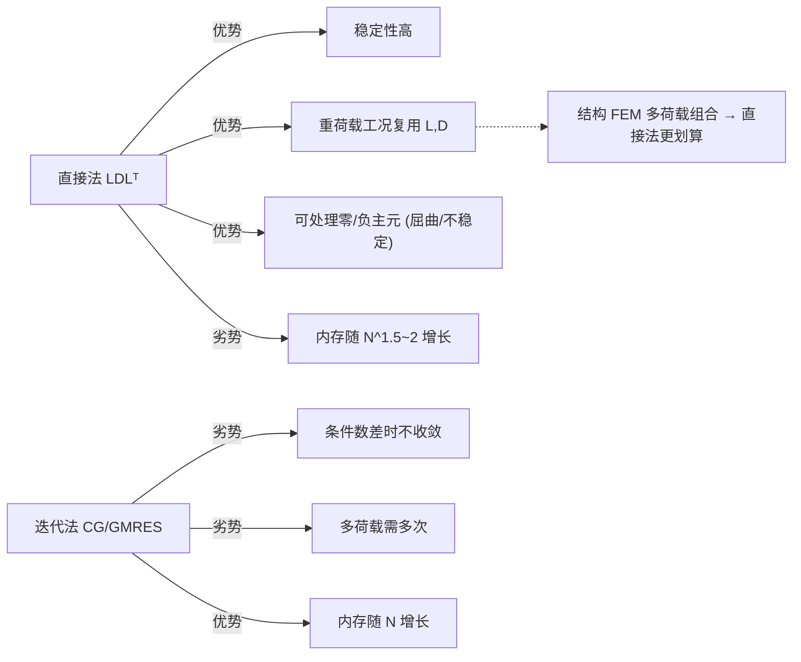

**结构工程的特殊性**：模型多荷载工况（dead, live, wind, seismic-X, seismic-Y, ...）；非线性时多步重用因子分解（如果 K 未变）。直接法的 `LDLᵀ` 一次分解后求解新右端只要 O(N) 回代，所以**多 RHS 友好**——这是 CSI 选择直接法、不上 AMG 迭代的核心原因。

> 大模型对照：ANSYS Mechanical 默认 sparse direct，也有 PCG；ABAQUS Standard 默认 sparse direct；只有 LS-DYNA/RADIOSS 等显式才走显式向量化路线。CSI 与主流隐式 FEA **同一阵营**。

### 7.3 收敛与不稳定处理

| 现象 | CSI 处理 |
|------|----------|
| 零主元 | 报告"Instability detected at DOF #"，并允许继续输出（用户决断） |
| 负特征值（屈曲） | Buckling Analysis 单独路径，使用 inverse iteration / Lanczos |
| 非线性不收敛 | 自动减小步长、切换 Newton/Modified Newton、event step |
| 模态发散 | Ritz 重启动 / Lanczos restart |

**工程友好特性**：CSI 不在中途崩溃，而是把不收敛/不稳定**作为结果回报**给用户。这与"博士级"的 ABAQUS（直接抛 Standard exception，要求手工调参）形成鲜明对比，也是其市场护城河之一。

---

## 八、产品级差异化：ETABS / CSiBridge 的额外架构

### 8.1 ETABS 专属层

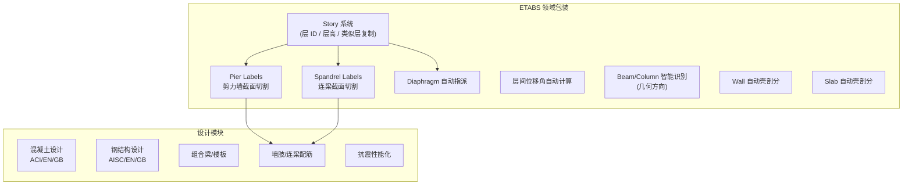

**关键设计哲学**：
- **Story = First-class Citizen**：所有数据按层组织，复制层、修改层、设计输出按层归纳；
- **Pier/Spandrel = 设计虚拟体**：不影响有限元结果，**只影响后处理切割**与配筋；
- **Diaphragm 自动化**：导入 Revit 楼板自动加 Diaphragm，**这是 ETABS 与 SAP2000 的核心差异**。

> hy-cad-tool 启示：道路工程的"路段 / 桥墩 / 桥跨"完全可对照 Story 系统建立**RoadSegment / Pier / Span** 这类一等公民对象，让设计模块按段输出。

### 8.2 CSiBridge 专属层：Bridge Object

CSiBridge 最具差异化的设计是 **Bridge Object**——一个**参数化的桥梁建模对象**，由它一键生成所有梁/壳/索/支座等单元。

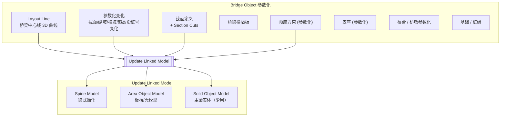

**意义**：CSiBridge 把"桥梁"作为一种**领域级建模实体**，工程师改一个参数（跨径、截面、纵坡），整个有限元模型自动重生成。这是**几何为先、有限元为衍生**思想的完整商用实现。

| 设计要点 | 实现 |
|----------|------|
| **Layout Line** | 沿桩号的 3D 曲线，定义所有元素的坐标 |
| **Parametric Variation** | 任意属性沿桩号可线性/二次/分段变化 |
| **Section Cuts** | 后处理时定义沿桥的内力切片 |
| **Discretization 选项** | Spine / Area / Solid 一键切换 |
| **Lanes 与 Vehicles** | 移动荷载，使用**影响面**（influence surface） |
| **Update Linked Model** | 一键重新生成所有单元，但保留荷载/约束分配 |

### 8.3 移动荷载：影响面方法

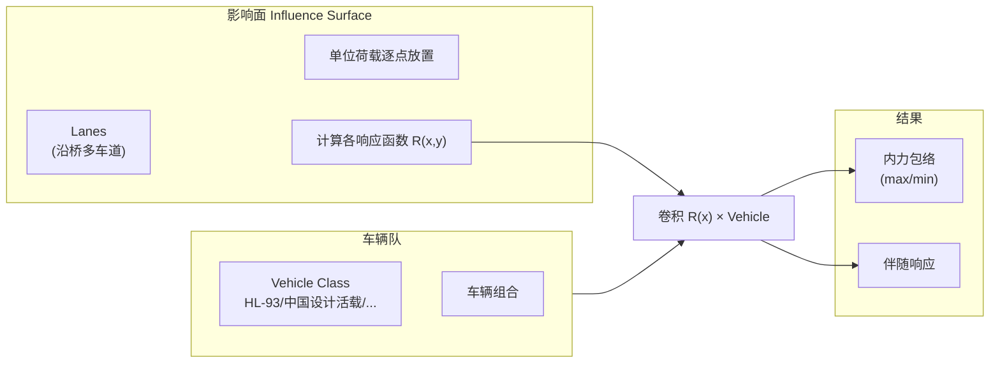

**关键点**：CSiBridge 把活载分析做成**线性叠加**——影响面只需算一次，无穷多车辆组合都是后处理。这是把"非线性问题降维为线性问题"的经典工程化决策。

**对 hy-cad-tool 的启示**：路面荷载、车轮荷载、临时施工荷载等"沿线移动"的工况，都应该首选**影响面+线性叠加**的方案，而非每个工况都重新计算。

---

## 九、文本输入与互操作

### 9.1 三种文本格式

| 格式 | 用途 | 谁能用 | 可审计 |
|------|------|--------|--------|
| `.s2k`（SAP2000） | 制表符分隔表格，可导入/导出全模型 | 工程师手工编辑罕见 | ◎ |
| `.$2k / .$et / .$bz`（CSI Console） | XML 风格，OAPI 内部使用 | 程序生成 | ◎ |
| `.e2k`（ETABS） | 类似 `.s2k` 的文本表 | ETABS 早期重要 | ◎ |
| `.b2k / .bdb`（CSiBridge） | 桥梁版 | — | ○ |
| `.sdb / .edb / .bdb`（DB） | 二进制 SQLite 风格数据库 | 默认存储 | × |

**STAAD.Pro 风格 vs CSI 风格**：STAAD 把 `.std` 作为**人类编辑首选**；CSI 把 `.s2k/.e2k` 作为**导入/导出格式**，但 UI 才是首选。这是两种文化的取舍——CSI 更工程师友好，STAAD 更可审计。

### 9.2 OAPI（Open API）

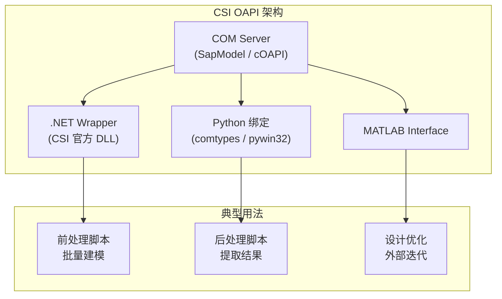

| OAPI 设计权衡 | CSI 选择 | 评价 |
|--------------|----------|------|
| 是否在 UI 进程中运行？ | **可以选**：Attach/Open New Instance | ◎ |
| 是否事务化？ | 单线程；用户需手动 `RefreshView` / `Analyze.RunAnalysis` | △ |
| 是否能直接读 IR？ | **不能**——只能读对象表 + 结果 | × |
| 是否能改求解器？ | × | 不可 |
| 是否能写自定义单元？ | × | 不可 |

**OAPI 的边界**：它是"领域层 + 结果层"的 API，**完全不暴露内核**——这是 CSI 商业策略的核心。SAPFire 内核对外永远是黑盒，**这也是 CSI 与开源 OpenSees 的本质鸿沟**。

> hy-cad-tool 对应启示：API 应该**至少暴露到 L2 IR 层**，允许第三方查询/订阅 Analysis Model 与 Result，否则就是另一个封闭的 CSI；但又**不必暴露到求解器内部**，避免维护负担。

---

## 十、性能、规模与限制

### 10.1 实测规模

| 指标 | SAP2000 64-bit | ETABS 64-bit | CSiBridge 64-bit |
|------|---------------|--------------|------------------|
| 节点上限（官方推荐） | ~ 100万 | ~ 50万 | ~ 50万 |
| 实际舒适规模 | 10万节点 | 5万节点 | 5万节点 |
| 单元类型并行 | 装配并行（OpenMP） | 同 | 同 |
| 求解器并行 | MKL PARDISO 多线程 | 同 | 同 |
| GPU 加速 | × | × | × |

**经验法则**：
- 5 万节点以下：流畅；
- 10 万节点：可用但 Run Analysis 数分钟；
- 30 万节点以上：内存吃紧，常崩溃；
- 50 万节点以上：建议拆模型或换 ABAQUS。

### 10.2 已知架构性限制

| 限制 | 根因 | 影响 |
|------|------|------|
| 3D 实体非线性能力弱 | Solid 单元仅做线性 + 几何 | 不适合岩土、大变形 |
| 无单元级 UEL/UMAT 扩展 | 封闭核心 | 用户自定材料只能在 Link 内做 |
| 接触能力简单 | 仅 Link + Gap/Hook | 不适合复杂接触 |
| 无自适应网格 | 自动剖分仅做一次 | 无 h/p 适应性 |
| 大模型崩溃 | 直接法内存压力 | 限制规模 |
| UI 与 OAPI 同步问题 | 命令双轨 | 偶发 |

---

## 十一、设计权衡的关键洞察

把以上分析浓缩为 CSI 三剑客的**架构哲学**：

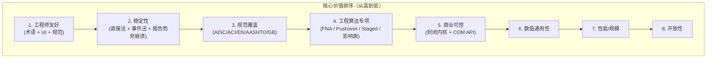

| 维度 | CSI 取舍 | 评价 |
|------|----------|------|
| **专注 vs 通用** | 专注结构工程，主动放弃实体非线性、CFD、显式 | ◎（边界清晰） |
| **黑盒 vs 透明** | 求解器封闭、OAPI 仅到对象层 | △（商业上正确，技术上可惜） |
| **直接 vs 迭代** | 直接法 + 多 RHS 复用 | ◎ |
| **事件 vs 牛顿** | Pushover 用事件，时程用 Newton | ◎ |
| **整体非线性 vs 局部 FNA** | 推 FNA 把非线性局部化 | ◎（极致工程化） |
| **几何为先 vs 单元为先** | CSiBridge Bridge Object 前者；其他后者 | ◎/△ 不一致 |
| **UI vs 文本** | UI 优先，文本作为导入导出 | △（不如 STAAD 可审计） |

---

## 十二、对 hy-cad-tool 的可借鉴/不可借鉴清单

### 12.1 应当借鉴（直接对标）

| # | 借鉴点 | 对应 hy-cad-tool 组件 | 优先级 |
|---|--------|----------------------|--------|
| 1 | **领域对象 ≠ 单元** 的两层映射（Pier/Spandrel/Bridge Object 是切割视图） | `DomainObject` / `AnalysisElement` 分离 | P0 |
| 2 | **Analysis Model IR** 介于领域与求解之间 | `FemProblem` IR 层 | P0 |
| 3 | **约束-变换矩阵-DOF 编号**统一管道 | `IConstraintCompiler` + `IDofRenumberer` | P0 |
| 4 | **行业级约束**（Diaphragm/Body/Equal）作为一等公民 | 路面整体板、冠梁、桩承台等专用约束 | P0 |
| 5 | **Ritz 向量**作为模态默认选项 | `IModalSolver` 默认走 Load-Dependent Ritz | P1 |
| 6 | **FNA**：主体线性 + 非线性 Link 的快速时程 | 隔震桥/消能墙的算法接入 | P1 |
| 7 | **事件法 Pushover** | 桥墩/支座等非线性静力分析 | P1 |
| 8 | **Staged Construction** 含位移/塑性/徐变继承 | 路基填筑、桩基张拉、桥梁施工阶段 | P0 |
| 9 | **Case Tree + Initial Conditions** 的 DAG 分析流 | `AnalysisPipeline` 的核心抽象 | P0 |
| 10 | **影响面 + 移动荷载叠加** | 路面车辆、临时荷载、施工机械 | P1 |
| 11 | **Property Modifiers** 直接乘 EA/EI（开裂刚度等） | 截面属性修正机制 | P2 |
| 12 | **Object-Element 自动剖分**且**结果可回填到对象** | 几何对象的 mesh ↔ result 双向追踪 | P0 |
| 13 | **Bridge Object 参数化**思路推广到道路、挡墙、桩组 | `ParametricLinearObject` 抽象 | P1 |
| 14 | **稳定胜过速度**：报告不稳定而非崩溃 | 求解失败转化为结果异常报告 | P0 |
| 15 | **二进制 + DB 双结果**：图形快读 + 表格兼容 | Result 存储双层策略 | P2 |

### 12.2 应当反向警惕（CSI 的反面教材）

| # | 反面案例 | hy-cad-tool 的反向决策 |
|---|---------|------------------------|
| 1 | **求解器内核完全封闭** | hy-cad-tool 至少要把 IR 与求解结果以可订阅事件 + 文本可审计形式开放 |
| 2 | **OAPI 单线程同步、状态机式** | hy-cad-tool 用 Command Bus + 不可变模型 + 事件驱动 |
| 3 | **UI 与文本格式割裂、文本不可读** | `hyob` 文本格式必须人类可读、可 diff、可作计算书 |
| 4 | **不支持 UEL/UMAT** | hy-cad-tool 必须把单元公式与材料本构都做成插件 |
| 5 | **大模型崩溃而非降级** | hy-cad-tool 应有 `ModelCapacityPolicy` 显式预警 + 可降级到外部 backend（CalculiX/Code_Aster） |
| 6 | **3D 实体能力弱却不明说** | hy-cad-tool 应明确**自己不做的事**——通过 `IExternalAnalysisPort` 转给 ABAQUS/Plaxis |
| 7 | **OAPI 改 UI 不刷新** | hy-cad-tool 用单向数据流 + 订阅式 ViewModel，从架构上消除"刷新漏更新" |
| 8 | **领域规范设计与有限元强耦合** | hy-cad-tool 用 `ICodeCheckerRegistry` 把规范作为后处理插件，**规范不能进求解器** |

### 12.3 hy-cad-tool 对应组件设计（CSI 映射版）

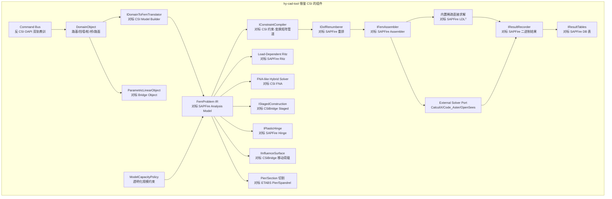

---

## 十三、立即可执行的对标动作（建议）

| 优先级 | 动作 | 对标对象 | 工作量 |
|--------|------|----------|--------|
| P0 | 在 `FemProblem` IR 中明确建模 **Constraint Transformation T**，并支持 Diaphragm 类约束消元 | SAPFire 约束体系 | 1 周 |
| P0 | 在 `AnalysisPipeline` 中实现 **Case Tree + Initial Conditions** DAG | CSI Load Case Tree | 1 周 |
| P0 | 设计 **Domain Object ↔ Mesh ↔ Result 三向追踪**机制 | ETABS Pier/Spandrel + CSiBridge Section Cuts | 2 周 |
| P0 | 起草 **IStagedConstruction** 接口，明确"位移/塑性/徐变"继承语义 | SAPFire Staged Construction | 1 周 |
| P1 | 在 `IModalSolver` 中实现 **Load-Dependent Ritz** | SAPFire Ritz | 1 周 |
| P1 | 起草 **FNA-like Hybrid Solver** 原型（线性主体 + 非线性 Link） | CSI FNA | 2-4 周 |
| P1 | 设计 **IInfluenceSurface** + 移动荷载叠加 | CSiBridge Lanes | 2 周 |
| P1 | 设计 **ParametricLinearObject**：沿曲线参数化的桥/挡墙/路基 | CSiBridge Bridge Object | 2-4 周 |
| P2 | 设计 **Property Modifiers** 截面修正机制 | SAPFire | 3 天 |
| P2 | 在 OAPI 设计中**故意暴露 IR 与 Result 订阅接口**，弥补 CSI 黑盒缺陷 | 反 CSI 设计 | 1 周 |

---

## 十四、结语：从 CSI 三剑客学到的核心一句话

> **"先把工程师的术语建模到一等公民，再让有限元做被驱动的衍生品；非线性局部化、约束变换统一化、施工阶段链路化——这是 CSI 三十年沉淀的真正护城河。"**

CSI 的技术债（黑盒、双轨、规模上限、3D 实体弱）是它**主动选择**的代价，因为它优先保护**工程师友好性与规范覆盖**。对 hy-cad-tool 而言：

- **借鉴它的工程化哲学**（领域优先、约束一等公民、稳定胜速度、非线性局部化、施工阶段链路）；
- **避开它的封闭技术债**（开放 IR、Command Bus 单入口、文本可审计、外接求解器、规范作为后处理插件）；
- **超越它的力所未及**（3D 实体、岩土非线性、可插拔单元/材料、CalculiX/Plaxis 后端、AI/MCP 接入）。

这条路径在 [02-有限元通用底座架构](../02-有限元通用底座架构-从挡土墙开始-2026-05-14.md) 中已有总体规划，本文为其中**"CSI 三剑客"对标条目**提供深度技术细节。

---

## 参考与延伸阅读

- *SAP2000 Analysis Reference Manual*（CSI 官方）
- *ETABS Analysis Reference Manual*（CSI 官方）
- *CSiBridge Analysis Reference Manual*（CSI 官方）
- *CSI Open Application Programming Interface (OAPI) Documentation*
- E. L. Wilson, *Three-Dimensional Static and Dynamic Analysis of Structures*（CSI 创始人著作）
- E. L. Wilson, *A New Method of Dynamic Analysis for Linear and Nonlinear Systems*（FNA 原文，1989）
- K.-J. Bathe, *Finite Element Procedures*（MITC 系列单元、不协调模式）
- A. Ibrahimbegovic, *Nonlinear Solid Mechanics*（事件法 Pushover 理论）
- M. Papadrakakis, *Solving Large-Scale Problems in Mechanics*（稀疏直接法演进）
- 配套文档：
  - [01-全球三维有限元软件对标调研-2026-05-14](../01-全球三维有限元软件对标调研-2026-05-14.md)
  - [02-有限元通用底座架构-从挡土墙开始-2026-05-14](../02-有限元通用底座架构-从挡土墙开始-2026-05-14.md)

---

## 修订记录

| 日期 | 修订人 | 说明 |
|------|--------|------|
| 2026-05-14 | — | 初版：CSI 三剑客有限元计算架构深度分析（共享内核 SAPFire 拆解 + 单元/约束/分析/求解/产品差异化 + 对 hy-cad-tool 的对标启示） |
