# MIDAS 系列有限元计算架构深度解析（Gen / Civil / FX+ / GTS NX）

> 文档日期：2026-05-14
> 上承：
> - [01-全球三维有限元软件对标调研-2026-05-14](../01-全球三维有限元软件对标调研-2026-05-14.md)
> - [02-有限元通用底座架构-从挡土墙开始-2026-05-14](../02-有限元通用底座架构-从挡土墙开始-2026-05-14.md)
>
> 文档目的：
> 1. 把"MIDAS 系列"作为一个**完整的产品族**来剖析其有限元计算架构——不是简单复述功能，而是回答"它为什么这么设计、它的内核是什么、它的边界在哪"。
> 2. 为 hy-cad-tool **有限元通用底座**（见 02）提供一个**最贴近的对标参考**——MIDAS 是亚洲市场覆盖建筑/桥梁/通用/岩土最完整的一线产品，其架构选择对国产自研工具最具参照价值。
>
> 信息来源：公开技术白皮书 / 各产品 Analysis & Algorithm Reference Manual / Construction Stage Manual / API 文档（MIDAS Gen API、Civil API、CIM、GTS NX Python interface）/ 韩国 KSCE / KGS 学术论文 / 行业实测使用经验。
> 写作约定：不引述未公开的内部实现细节，所有"内核结构"为基于公开输出格式、求解日志、文件格式与 API 反推得到的**架构层级**结论。

---

## 一、产品族总览：一棵共享内核长出的四枝

MIDAS IT（韩国迈达斯，1989 年 POSCO 内部诞生，2000 年独立公司化）的核心技术资产其实是**一颗 FEA 内核**。Gen / Civil / FX+ / GTS NX 是同一个内核针对不同行业的"前端 + 单元/材料子集 + 规范检算 + 工况向导"组合。

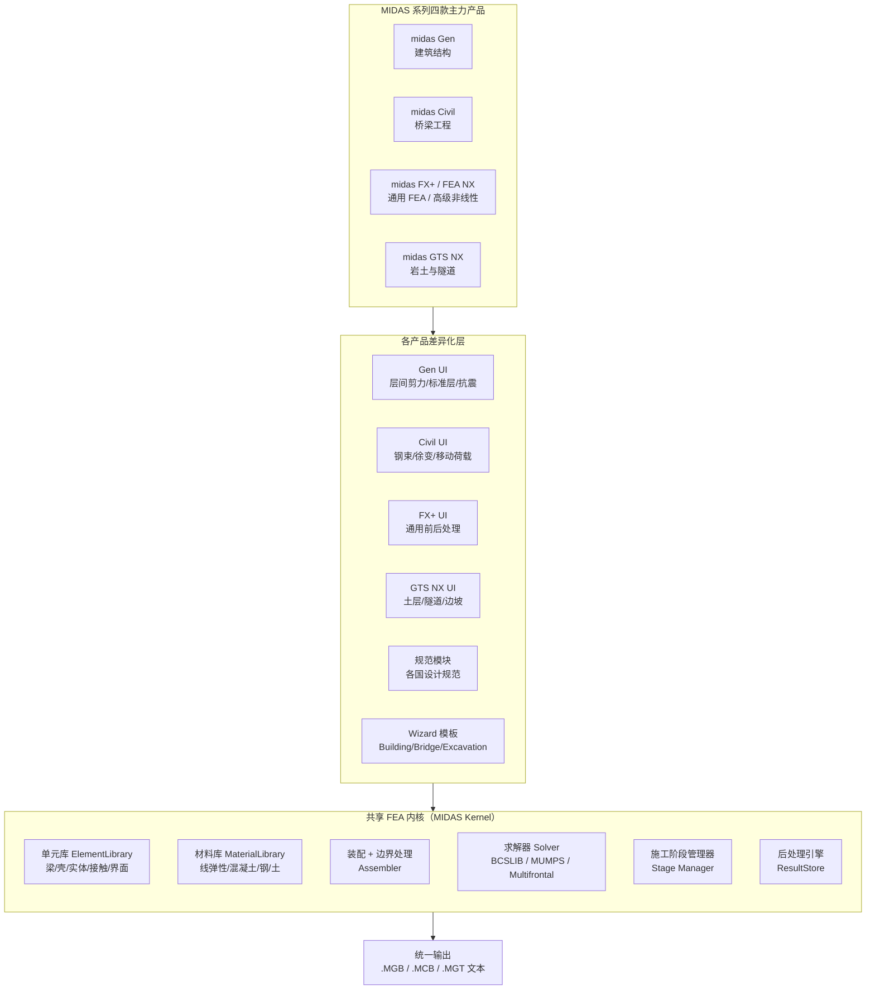

| 产品 | 全称 / 内核代号 | 主战场 | 独家武器 | 与共享内核的关系 |
|------|----------------|--------|----------|------------------|
| **midas Gen** | General Structure | 建筑、超限高层、抗震设计 | 弹塑性时程、性能化设计、施工模拟（建筑） | 内核 + 建筑单元子集（梁/壳/弹簧/隔震）+ GB/IBC/EC 检算 |
| **midas Civil** | Civil Structure | 桥梁、斜拉/悬索、隧道顶模 | 移动荷载、钢束/徐变/收缩、施工阶段、TDV（时间依赖材料） | 内核 + 桥梁单元（钢束/复合截面）+ JTG/AASHTO 检算 |
| **midas FX+ / FEA NX** | Advanced Nonlinear | 通用 3D 实体、高级非线性、研究 | 全 3D 实体、复杂接触、显式动力（FEA NX）、CFD 桥接 | 内核 + 实体单元强化 + UMAT 风格自定义材料（FEA NX 才开放） |
| **midas GTS NX** | Geo-Technical | 岩土、基坑、隧道、边坡 | 渗流-应力耦合、固结、动力液化、Mohr-Coulomb/MCC/HSS 等土本构 | 内核 + 土体本构库 + 施工阶段（开挖/支护/降水）+ 岩土规范 |

> **关键洞察**：MIDAS 的产品策略 = **一个内核 × N 个行业前端**。这与 hy-cad-tool 02 文档提出的"L4 IR 之上挂多种领域 L5"的设计**惊人一致**——这不是巧合，而是 FEA 产品架构在 30 年内自然收敛出的最优形态。

---

## 二、计算架构的四层视图

把 MIDAS 拆开看，从用户点鼠标到拿到结果，存在四个清晰的层次。这四层在不同 MIDAS 产品里**完全同构**，只是 L4 表现各异。

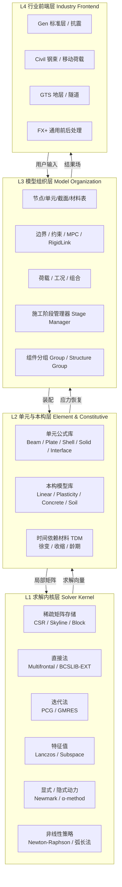

| 层次 | 知道什么 | 不知道什么 | 在 MIDAS 中的具体载体 |
|------|----------|------------|----------------------|
| **L1 求解内核** | 线性代数、稀疏矩阵 | 这是哪种工程 | `*.LCT` 求解日志中可见的 BCSLIB / Multifrontal 模块 |
| **L2 单元与本构** | 单元公式、积分点、刚度阵生成 | 模型怎么组织 | `Element Library` + `Material Library`（API 中可见 `ELEM_TYPE`、`MATL_TYPE` 枚举） |
| **L3 模型组织** | 节点表、施工阶段、组合 | UI 怎么呈现 | `.MGB/.MCB` 二进制中的核心数据；`.MGT` 文本是其完整序列化 |
| **L4 行业前端** | "标准层、钢束、隧道开挖" | 求解器如何工作 | Gen/Civil/GTS 各自的窗口/向导/规范模块 |

---

## 三、共享内核（Solver Kernel）的关键设计

### 3.1 求解器矩阵——按问题类型自动选择

MIDAS 的求解日志会显示这样的字样（来自实测）：

```
Equation solver        : Multi-Frontal Sparse Solver (BCSLIB-EXT)
Number of equations    : XXXX
Maximum bandwidth      : XXXX
Memory used (MB)       : XXXX
```

这暴露了关键信息：**MIDAS 的内核求解器主线是 Multifrontal（多波前）+ BCSLIB-EXT**。BCSLIB-EXT 是 Boeing 数学库（后被 Siemens 收购）的工业级稀疏直接法，被 NX Nastran 等也广泛使用。

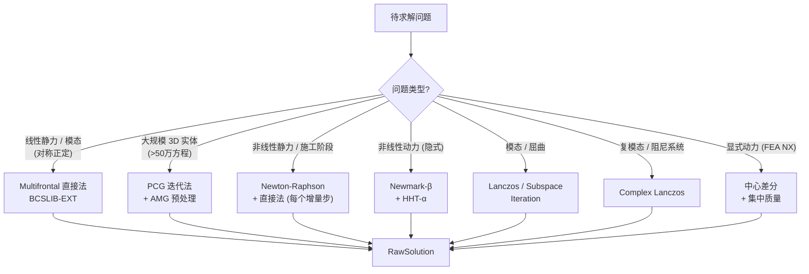

| 求解器 | 适用 | 关键参数 | 工程行为特点 |
|--------|------|----------|--------------|
| **Multifrontal (BCSLIB-EXT)** | 中等规模 (<50万方程)，线性、模态 | 重排序 (METIS/MMD)、超节点合并 | 默认选择；3D 实体超过 50 万自由度时内存会爆炸 |
| **PCG (Preconditioned CG)** | 大规模对称正定 | 预处理类型 (Jacobi/ILU/AMG) | GTS NX 大型岩土模型常用；收敛性受网格质量影响 |
| **Lanczos** | 模态分析、屈曲 | 块大小、收敛容差、特征值上下限 | Gen 抗震分析必用；Sturm 检查避免漏根 |
| **Newton-Raphson** | 非线性 | 初始/切线刚度切换、自动子步、线性搜索 | 非线性问题主力；不收敛时回退弧长法 |
| **Arc-Length (Crisfield/Riks)** | 失稳后路径、岩土塑性流动 | 弧长增量、约束方程 | GTS NX 边坡稳定常用；强度折减法核心 |
| **Newmark-β / HHT-α** | 隐式动力 | β、γ、α 参数；Rayleigh 阻尼 | Gen 时程分析、Civil 车桥耦合 |
| **中心差分（仅 FEA NX）** | 显式冲击 | 时间步 ≤ 最小单元 CFL | FEA NX 才有，标准 Gen/Civil/GTS NX 没有 |

> **设计权衡**：MIDAS 没有像 ANSYS 那样开放数十种求解器选项；它**默认隐藏求解器选择**，仅在高级选项中给用户开。这是结构工程专用软件的常见取舍——**用确定性换取易用性**。对 hy-cad-tool 的启示：`ISolverBackend` 应该对外暴露**"工程问题类型"**而不是"线性代数算法"。

### 3.2 矩阵存储与重排序

| 设施 | 实现选择 | 证据 / 推断 |
|------|---------|-------------|
| **稀疏存储格式** | CSR（行压缩）+ Skyline 兼容 | 早期 MIDAS 输出文件残留 Skyline 风格；现代版本走 CSR |
| **重排序** | METIS（多级嵌套切分）+ MMD（最小度） | BCSLIB-EXT 默认配套 METIS |
| **超节点合并** | Supernodal / Multifrontal | BCSLIB-EXT 标志特征 |
| **块化** | 每节点 DOF 块（梁 6, 实体 3） | 显著加速消元 |
| **内存模式** | In-core / Out-of-core 切换 | `.LCT` 日志中明示 `Out-of-Core Mode Activated`，大模型时自动启用 |
| **数值精度** | Double precision (64-bit) | 默认；不向用户开放降级 |

### 3.3 并行策略：MIDAS 的瓶颈与现状

| 并行维度 | MIDAS 现状 | 与 ANSYS/ABAQUS 差距 |
|----------|-----------|----------------------|
| **共享内存 (OpenMP)** | 求解器层支持 4~16 线程；装配层部分并行 | 中等；不及 ANSYS 自适应负载均衡 |
| **分布式 (MPI)** | **不支持**（核心限制） | 显著落后——ANSYS HPC Pack 可 32+ 节点 |
| **GPU** | 部分子模块尝试（如 GTS NX 大模型 PCG），整体未深入 | 显著落后 |
| **多工况并行** | Civil 移动荷载 / 包络组合走批处理多工况 | 较弱 |

> **现实评价**：MIDAS 内核单机性能与 SAP2000、RFEM 同档；但**没有像样的 MPI 分布式**，这是它在 3D 大模型场景（>200 万自由度）落后于 ANSYS 的根本原因。
>
> **对 hy-cad-tool 的启示**：道路工程的目标模型规模通常在 10~50 万自由度内，**单机 OpenMP + 直接法**就完全够用；MPI 是过度工程化，不必上。

---

## 四、单元与本构库（L2）

MIDAS 内核暴露的单元/材料 ID 是其**最稳定的对外契约**——`.MGT` 文本格式、Python API、Open API 都用同一套 ID。

### 4.1 单元类型库

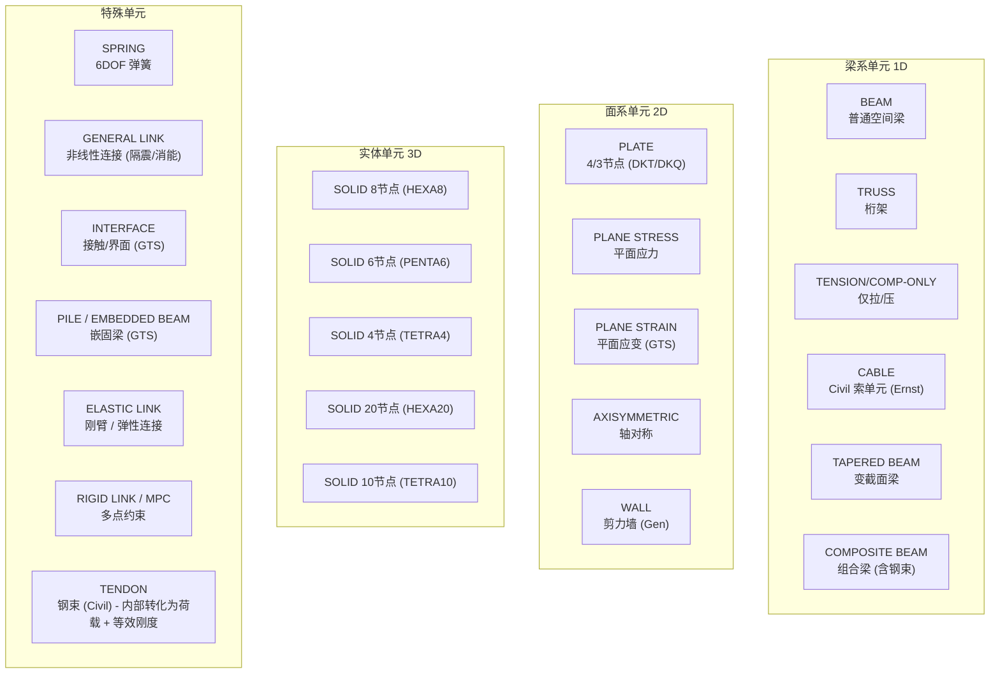

| 单元家族 | 公式 | 积分点 | 工程应用 |
|----------|------|--------|----------|
| **BEAM** | Timoshenko / Bernoulli 可切换 | 2~5 高斯点（沿长度），截面纤维分割 | 框架、桥墩、梁 |
| **TAPERED BEAM** | 变截面 Hermite + 数值积分 | 数值积分（沿长度变化） | 变截面桥梁主梁 |
| **CABLE** | Ernst 等效弹性模量 + 几何刚度 | 大变形迭代 | 斜拉桥/悬索桥 |
| **PLATE (DKT/DKQ)** | Discrete Kirchhoff / Mindlin | 2×2 或单点 + 沙漏控制 | 板、剪力墙、楼板 |
| **WALL** | 特殊 5DOF 壳元 + 平面外刚度 | Gen 专属优化 | 高层剪力墙 |
| **SOLID HEXA8** | 8 节点等参 + B-bar / 缩减积分 | 2×2×2 高斯 | 实体构件、岩土 |
| **INTERFACE** | Goodman 节理 / Coulomb 摩擦 | 2D 4节点 / 3D 6/8 节点 | GTS：土-结构界面、节理 |
| **EMBEDDED BEAM** | 嵌入实体的梁 + 摩擦传递 | 内部约束方程 | GTS：桩 / 锚杆 / 锚索 |
| **GENERAL LINK** | 时不变 / 时变非线性力-位移 | 集成显式本构 | 隔震支座、消能器、摩擦摆 |
| **TENDON** | **非显式单元** — 等效为预应力荷载 + 截面刚度修正 | — | Civil 钢束 |

> **关键设计取舍**：TENDON（钢束）在 MIDAS Civil 中**不是真正的有限元单元**，而是通过"等效荷载 + 截面性质修正"的方式融入梁元。这是预应力混凝土桥梁分析的"工业标准做法"——比真正建模钢束实体快几个数量级，精度足够。
>
> **对 hy-cad-tool 的启示**：道路工程中的"路基-面层分层"、"加筋土"、"格栅"等也可借鉴此思路——**不一定每个领域概念都对应一种单元，可以用"荷载/约束/等效刚度"的组合实现**。

### 4.2 材料 / 本构模型库

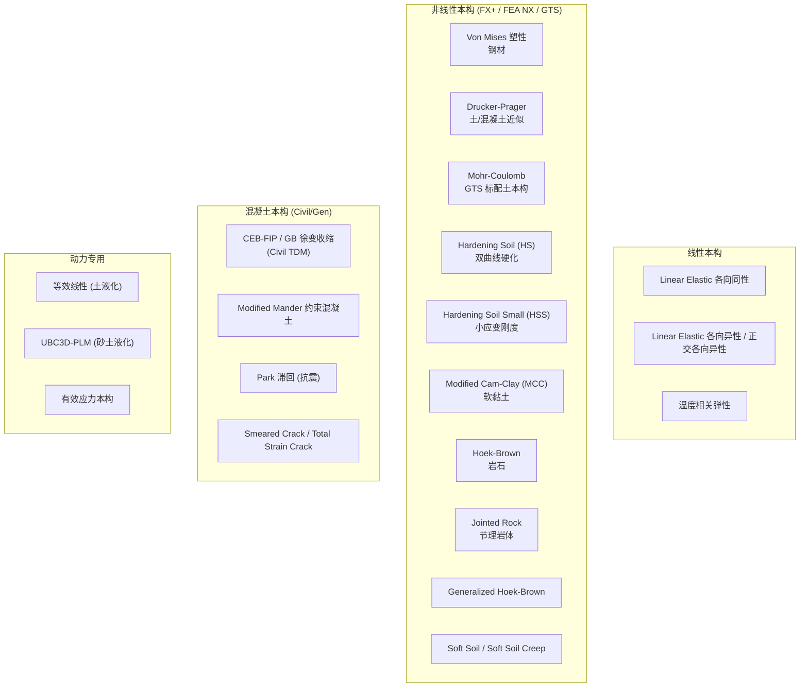

| 本构模型 | 关键参数 | 物理意义 | 典型软件归属 |
|----------|---------|---------|--------------|
| **Mohr-Coulomb** | c, φ, ψ, E, ν | 经典塑性，岩土工程默认 | GTS NX 必备 |
| **Hardening Soil (HS)** | E₅₀, Eᵤᵣ, m, c, φ | 双曲线硬化，区分卸载 | GTS NX 高级土本构 |
| **HS-Small (HSS)** | HS + γ₀.₇, G₀ | 小应变刚度衰减 | GTS NX 基坑变形预测金标准 |
| **Modified Cam-Clay** | λ, κ, M, p_c0 | 临界状态土力学 | GTS NX 软黏土 |
| **CEB-FIP 徐变** | f_cm, 龄期, RH | 时间依赖徐变 | Civil TDM |
| **General Link 非线性** | 用户定义力-位移曲线 | 隔震支座、消能器 | Gen 抗震 |

> **观察**：MIDAS 的本构库**深度而非广度**——它没有 ABAQUS UMAT 那种"任何人可写"的开放性（FEA NX 才部分开放），但把工程界最重要的 20 个本构做到了"参数有规范默认值 + 工程师可信"的程度。这是结构工程软件 vs 通用 FEA 的另一个分水岭。

---

## 五、施工阶段管理器（Stage Manager）—— MIDAS 真正的护城河

如果说 MIDAS 内核与 SAP2000 同档，那么 **Stage Construction Analysis** 是它**唯一显著领先**的能力。这套机制不是简单的"工况累加"，而是一个**带状态机的时间线求解器**。

### 5.1 概念模型

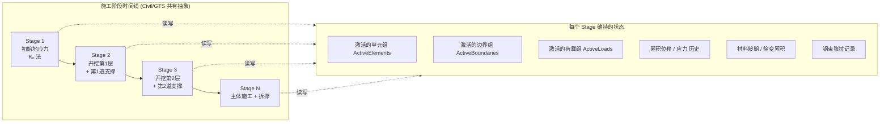

### 5.2 Stage Manager 的算法核心

MIDAS Civil/GTS 的施工阶段不是简单的"几个工况叠加"，而是**带状态延续的有限元再求解**：

| 步骤 | 算法行为 | 工程含义 |
|------|---------|----------|
| **1. Activate Element Group** | 新激活单元的初始应力由"自重补偿"或"接力前阶段位置"决定 | 后浇构件"不参与"之前的变形 |
| **2. Deactivate Element Group** | 拆除单元，但其内力转换为**等效节点荷载**逐步释放 | 模拟"拆撑、爆破开挖"过程平滑过渡 |
| **3. Update Boundary** | 边界激活/释放 | 临时支撑安装、拆除 |
| **4. Update Load** | 荷载激活/失活 | 阶段自重、阶段活载 |
| **5. Tendon Stressing** | 钢束张拉：施加预应力 + 等效荷载 + 更新截面 | Civil 预应力桥梁 |
| **6. Time Step (TDM)** | 推进时间，触发徐变/收缩本构积分 | Civil 长期效应 |
| **7. Consolidation Step (GTS)** | 渗流-应力耦合方程组求解 | GTS 软土固结 |
| **8. Equilibrium Check** | 在新构型下重新建立平衡 | 防止"突然激活"造成应力跳变 |

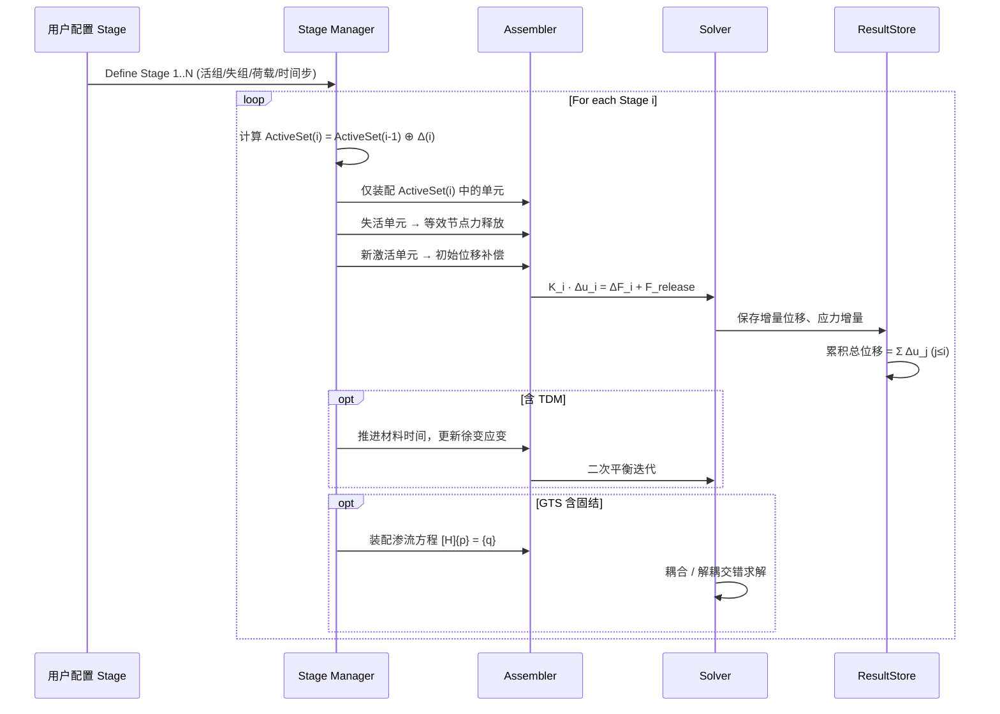

### 5.3 为什么 Stage Construction 是护城河

1. **每个阶段都是独立平衡问题**，但状态在阶段间继承——这要求模型 IR 不仅记录"当前快照"，还要记录"激活历史 + 累积应变 + 材料龄期"。
2. **失活单元的应力释放算法**有数十年工程经验沉淀（一次性释放会造成数值振荡，必须分子步逐步释放）。
3. **与时间依赖材料（TDM）耦合**才是真正复杂的——徐变收缩在"暂时不存在"的单元上不应推进，激活后从龄期 0 开始计算。

> **对 hy-cad-tool 的启示**：02 文档提到的 `FemProblem` IR **必须从一开始就预留 Stage 字段**——`FemProblem` 不是单个快照，而是 `(BaseModel, StageSequence, TimeAxis)` 的元组。否则一年后做"路基填筑分阶段沉降"时需要回头重构 IR，代价极高。

### 5.4 三个产品的 Stage 差异

| 产品 | Stage 特色 | 不支持 |
|------|-----------|--------|
| **Gen** | 建筑施工模拟（结构自重逐层施加，避免一次性自重的"虚假位移"） | 钢束 / 固结 |
| **Civil** | 钢束张拉 + 徐变收缩 + 移动支座 + 调索（合龙阶段） | 渗流 |
| **GTS NX** | 开挖 / 支护 / 降水 / 渗流-应力耦合 / 强度折减法 | 钢束（不需要） |
| **FX+ / FEA NX** | 通用施工阶段，作为非线性求解的子集 | 行业特化的便利 |

---

## 六、非线性求解架构

MIDAS 非线性求解的核心思想：**几何 + 材料 + 接触三类非线性可独立开关，统一在 Newton-Raphson 主框架下迭代**。

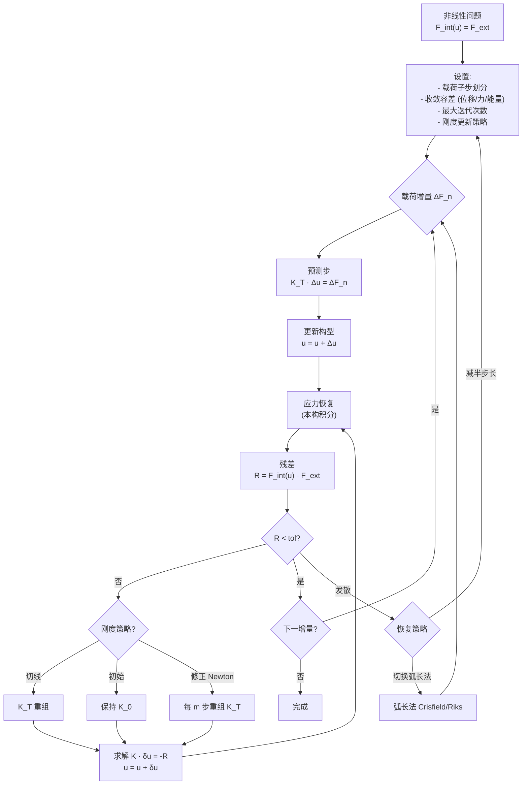

### 6.1 收敛准则——MIDAS 的 3 条标准

| 准则 | 公式 | 默认容差 | 说明 |
|------|------|----------|------|
| **位移准则** | ‖Δuₙ‖ / ‖uₙ‖ < tol_d | 0.001 | 适用大变形 |
| **力准则** | ‖Rₙ‖ / ‖F_ext‖ < tol_f | 0.001 | 适用准静力 |
| **能量准则** | ΔuₙᵀRₙ / Δu₁ᵀR₁ < tol_e | 1e-6 | 综合判据 |

MIDAS 默认要求 **三个准则同时满足或用户指定的某一组**——这种保守策略避免了"假收敛"，但牺牲了速度，是结构工程软件普遍特征。

### 6.2 几个独家工程化技巧

| 技巧 | 实现 | 用途 |
|------|------|------|
| **Automatic Time Stepping** | 不收敛自动减半 ΔF，收敛快则倍增 | 复杂非线性默认开启 |
| **Line Search** | 沿牛顿方向做一维最优 | 强非线性、塑性 |
| **Stress Smoothing** | 高斯点应力外推到节点 + 多元素平均 | 后处理云图平滑 |
| **强度折减法 SRM (GTS)** | 自动循环：c → c/F, tan φ → tan φ/F，直到不收敛 | 边坡安全系数计算的工业标准 |

---

## 七、模型组织层（L3）—— 三大数据载体

理解 MIDAS 的数据组织，最佳路径是研究它的**三种文件格式**：

| 文件 | 性质 | 用途 | 可读性 |
|------|------|------|--------|
| **`.MGB / .MCB / .GTS` 等** | 二进制 | 工作文件，含完整模型 + 结果 | 不可读 |
| **`.MGT`** | 文本 | 命令式文本输入，类似 STAAD `.std` 或 ABAQUS `.inp` | 完全可读 / 可 diff |
| **`.LCT / .OUT`** | 文本 | 求解日志、收敛历史 | 可读 |

### 7.1 `.MGT` 文本格式——MIDAS 隐藏的 DSL

`.MGT` 是 MIDAS 的命令式文本输入文件。它的语法非常 STAAD 风格：

```
*VERSION
   8.0.0

*UNIT
   N, mm, KJ, C

*NODE
   1, 0, 0, 0
   2, 5000, 0, 0
   3, 5000, 0, 3000

*ELEMENT
   1, BEAM, 1, 1, 1, 2, 0, 0
   2, BEAM, 1, 1, 2, 3, 0, 0

*MATERIAL
   1, CONC, C30, ...

*SECTION
   1, SB, GirderA, ...

*CONSTRAINT
   1, 111111

*STLDCASE
   DL, D, ...

*USE-STLD, DL
*BEAMLOAD
   2, BEAM, GLOBAL, UNILOAD, NO, NO, ...
```

| 段标记 | 含义 |
|-------|------|
| `*VERSION` | MGT 版本 |
| `*UNIT` | 单位制 |
| `*NODE` | 节点坐标 |
| `*ELEMENT` | 单元（类型 + 截面 + 材料 + 节点列表） |
| `*MATERIAL` | 材料定义 |
| `*SECTION` | 截面定义 |
| `*CONSTRAINT` | 约束 |
| `*STLDCASE` | 静力工况 |
| `*USE-STLD` + `*BEAMLOAD` 等 | 进入某工况后加荷载 |
| `*LOADCOMB` | 组合 |
| `*STAGE-CTRL` + `*GROUP` 等 | 施工阶段定义 |

> **设计观察**：`.MGT` 的存在表明 MIDAS 内部**实际上是命令驱动**的——GUI 操作最终都翻译为 `.MGT` 段，然后由内核解析。这与 ANSYS APDL 的角色完全相同，但 MIDAS 没有大力宣传这一点（结构工程师不爱看脚本，所以厂商隐藏）。
>
> **对 hy-cad-tool 的启示**：`hyob` 应当对标 `.MGT`——**人类可读 + 可 diff + 可 CI**，但语法用现代化的 YAML/TOML 而不是 1970 风格的列定位与 `*`-section。

### 7.2 模型组织的核心实体

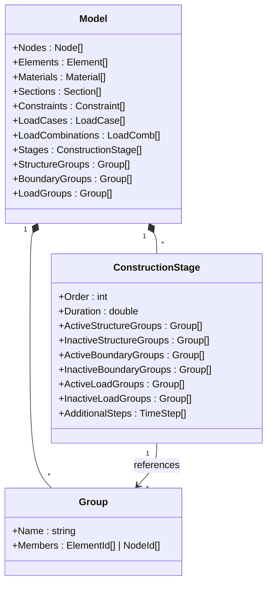

> **关键设计模式**：MIDAS 把"激活/失活"实现为 **Group 引用**而非"单元自带 stage 字段"。这是一个典型的**多对多关系的反范式建模**——同一个单元可以属于多个 Group，而 Group 可以被多个 Stage 引用。这给出了惊人的组合自由度（用户可以做"先建模 → 后期增加阶段方案"），但代价是模型校验非常复杂。
>
> **对 hy-cad-tool 的启示**：Group 抽象**强烈推荐照搬**——它已被 30 年工程实践验证，是结构工程师真实的"逻辑分层"思维方式。

---

## 八、行业前端层（L4）—— 四款产品的差异化设计

### 8.1 Gen——建筑结构前端

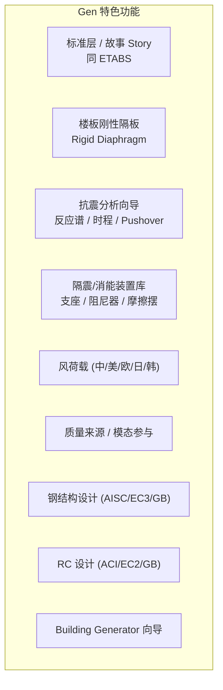

**核心理念**：以"故事 + 标准层 + 楼板隔板"为一等公民——这是亚洲高层建筑设计的真实思维。Gen 把"建筑工程师不需要懂 FEM"这句承诺做到了极致。

### 8.2 Civil——桥梁前端

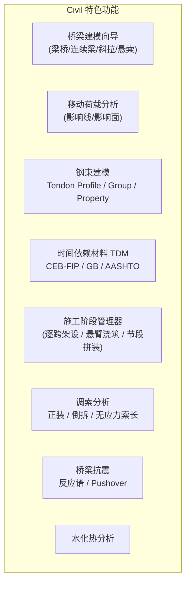

**核心理念**：桥梁 = 钢束 + 徐变收缩 + 施工阶段 + 移动荷载的组合。Civil 把这四个维度做成了"建模时分别配置、求解时联合考虑"的正交体系。

### 8.3 GTS NX——岩土前端

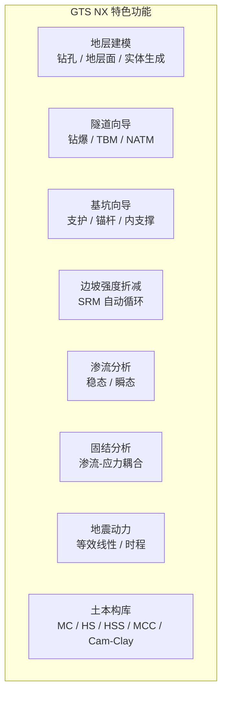

**核心理念**：岩土 = 三维地层几何 + 施工阶段 + 土本构 + 渗流耦合。GTS NX 是亚洲市场**唯一可以独立挑战 Plaxis 3D 的产品**。

### 8.4 FX+ / FEA NX——通用前端

| 项 | 说明 |
|----|------|
| **FX+** | 老一代通用 FEA 前后处理，定位为"做 Gen/Civil/GTS 之外的怪问题" |
| **FEA NX** | 新一代高级非线性平台，整合了 FX+ 与原 SoilWorks，开放 UMAT 自定义材料 |
| **共同特色** | 完整的 3D 实体单元 + 接触 + 显式动力（FEA NX）+ Python API |
| **市场地位** | 在国内不如 Gen/Civil/GTS 流行，但研究人员喜欢 |

---

## 九、可编程性与互操作性

### 9.1 API 矩阵

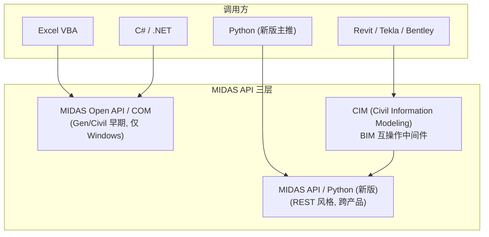

| API | 协议 | 能力 | 限制 |
|-----|------|------|------|
| **MIDAS COM (Gen API / Civil API)** | COM / Win32 | 读写 `.MGB`、创建节点/单元/工况、读取结果 | 仅 Windows、对象模型庞大、文档稀缺 |
| **MIDAS API (新版 Python)** | HTTPS 本地服务（MAPI 启动 localhost 服务） | 同上 + 跨平台、JSON、文档化 | 仍较年轻、覆盖度不及老 API |
| **CIM (Civil Information Modeling)** | 文件/中间件 | Revit/Tekla/Allplan ↔ MIDAS | 双向互导但偏心/组合常丢失 |

> **观察**：MIDAS 在 2023 后大力转向 **Python REST 风格 API**，这与全球 FEA 软件（ABAQUS、ANSYS、OpenSees）的潮流一致。这种"**外部进程通过 HTTP/JSON 调内部服务**"的范式，对 hy-cad-tool 是一个直接可用的参考——**hy-cad-tool 可以把求解器进程通过本地 HTTP/IPC 暴露给 Blender 端 / CAD 端 / MCP 端**。

### 9.2 互操作格式

| 方向 | 格式 | 状态 |
|------|------|------|
| **CAD 几何** | DXF / DWG / IGES / STEP / Parasolid | 双向但仅几何，无属性 |
| **BIM** | IFC / Revit / Tekla / Allplan | 通过 CIM；偏心、组合常丢 |
| **FEA 互导** | Nastran bulk / Patran neutral / DXF / SAP2000 / STAAD | 单向导入为主 |
| **结果交换** | OpenFOAM (风荷载)、自定义 CSV | 弱 |
| **自家文本** | `.MGT` | 最佳——完全文档化、可 diff |

---

## 十、与同类产品的架构差异（横向对比）

| 维度 | MIDAS | SAP2000/ETABS | STAAD.Pro | RFEM | Plaxis 3D | OpenSees |
|------|-------|---------------|-----------|------|-----------|----------|
| **内核求解器** | BCSLIB-EXT Multifrontal | 自研 SAPfire | Bentley 自研 | 自研 + Intel MKL | 自研 + Intel MKL | UMFPACK/SuperLU |
| **3D 实体能力** | 中-强 (FX+/GTS) | 弱 | 弱 | 强 | 强 (岩土) | 弱 |
| **施工阶段** | **最强** | 中 | 弱 | 中 | 强 | 弱 |
| **非线性** | 中-强 | 中 | 弱 | 中 | 强 | 强 |
| **API 现代化** | 中（Python 主推中） | OAPI 成熟 | 较弱 | RESTful 强 | Python 强 | OpenSeesPy 最强 |
| **MPI/HPC** | 无 | 无 | 无 | 部分 | 部分 | 部分 |
| **本构开放性** | 仅 FEA NX 部分开放 | 闭 | 闭 | 闭 | 闭 | 完全开放 |
| **规范本地化** | 强（含 GB / JTG） | 美标主、GB 补 | 全球 | 欧标主 | 岩土通用 | 无 |
| **文本输入** | `.MGT` 完整 | `.s2k` 弱 | `.std` 强 | 表格 | 弱 | Tcl/Python 强 |
| **价格 (RMB/年)** | 8-20 万 | 5-12 万 | 5-10 万 | 5-12 万 | 8-15 万 | 0 |

> **结论**：MIDAS 的架构定位是"**结构工程专用，但内核能力接近通用**"——比 SAP2000/STAAD 强一档（特别是 3D 实体 + 非线性 + 阶段），比 ANSYS/ABAQUS 弱一档（无 MPI、无 UMAT 开放、无显式核心）。这个位置正是 hy-cad-tool **最值得对标**的——既不像 ANSYS 那么遥不可及，也不像 SAP2000 那么单薄。

---

## 十一、设计哲学的深层洞察

剥开功能层，MIDAS 在四个**架构决策点**上的选择特别值得分析：

### 11.1 决策点 ①：内核共享 vs 产品独立

- **MIDAS 选择**：内核共享，前端独立。
- **代价**：版本同步压力（一个 bug 影响四个产品）、单元/材料库要照顾所有领域。
- **收益**：研发资源 4x 复用、行业横跨时学习成本低。
- **反例**：Autodesk Robot 与 RSA 走独立产品线，结果两边都半死不活。

> **对 hy-cad-tool 启示**：02 文档中的"L4 IR + L5 多领域"正是这个选择——**坚持共享内核，禁止为某个领域在 L1-L4 开后门**。

### 11.2 决策点 ②：求解器自研 vs 商用库

- **MIDAS 选择**：嵌入 BCSLIB-EXT（商用库，付授权）。
- **代价**：受制于供应商、不能在 BCSLIB 上做深度优化。
- **收益**：30 年成熟工业代码、稳定性远超自研。

> **对 hy-cad-tool 启示**：道路工程规模下 **CSparse.NET / MUMPS / SuiteSparse** 任一开源直接法都够用——不要自研 LU 分解，不要走 BCSLIB 的商用付费路径。

### 11.3 决策点 ③：UI 工程师友好 vs 命令文化

- **MIDAS 选择**：UI 优先（隐藏 `.MGT`），但保留 `.MGT` 作为"逃生通道"。
- **代价**：脚本党不爽，自动化能力比 OpenSees/ABAQUS 弱。
- **收益**：结构工程师上手 1 周即可，市场扩张快。

> **对 hy-cad-tool 启示**：hy-cad-tool 的目标用户是道路工程师——必须像 MIDAS 一样"**UI 默认优先，但提供 hyob 文本通道**"，而不是像 OpenSees 强迫人写代码。

### 11.4 决策点 ④：单元中心 vs Group 中心

- **MIDAS 选择**：Group 中心——施工阶段、荷载、边界都以 Group 为单位组织。
- **代价**：模型校验复杂（Group 重叠、空 Group 等）。
- **收益**：所有"批量操作"天然支持，工程师思维匹配。

> **对 hy-cad-tool 启示**：`hyob` 的 Group/Tag 系统应当**先于**节点/单元之前设计——是组织层而非装饰层。

---

## 十二、对 hy-cad-tool 通用底座的具体启示

将 MIDAS 架构的洞察具体映射到 02 文档定义的 hy-cad-tool 通用底座：

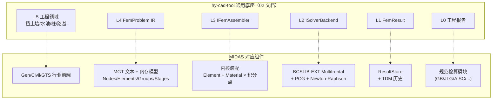

### 12.1 强烈推荐照搬的设计

| 设计 | MIDAS 来源 | hy-cad-tool 落地点 |
|------|-----------|-------------------|
| **`Group` 多对多激活模型** | MIDAS Group + StageStructureGroup 引用 | `FemProblem.Groups` + `StageDefinition.ActiveGroups` |
| **`Stage` 状态延续机制** | Civil/GTS 阶段管理器 | `IStageManager` 接口 + 累积位移/应力字段 |
| **`Tendon` 转化为荷载 + 截面修正** | MIDAS Civil 钢束 | hy-cad-tool 的"加筋""预应力"特征 |
| **`.MGT` 文本作为完整序列化** | MIDAS MGT | `hyob` 应是 `FemProblem` 的完整可逆序列化 |
| **求解器抽象 = "问题类型"而非"算法"** | MIDAS 隐藏求解器选项 | `ISolverBackend.Solve(ProblemKind kind)` |
| **本构库以"工程师熟悉名称 + 规范默认值"打包** | MIDAS Mohr-Coulomb 等带规范参考值 | `MaterialFactory.MohrCoulomb_GB50007()` |
| **Group 校验作为独立 Phase** | MIDAS 的模型检查器 | `FemProblemValidator` 独立 pass |

### 12.2 应避开的 MIDAS 弱点

| MIDAS 弱点 | 教训 | hy-cad-tool 对策 |
|-----------|------|-----------------|
| **无 MPI 并行** | 内核架构早期没设计 DD（域分解），后续上不去 | 短期不需要，但 `ISolverBackend.Solve` 应允许传 `DomainDecomposition` 拓扑 |
| **本构不开放** | 仅 FEA NX 才有 UMAT，研究价值受限 | 一开始就提供 `IMaterialPlugin` 接口（即使第一版只内置 5 个） |
| **API 双轨（COM + Python）** | 老用户被 COM 锁死，迁移痛苦 | 一开始就走单一 IPC（如本地 gRPC 或 HTTP+JSON） |
| **MGT 语法陈旧（`*`-section + 列定位）** | 1990 年代风格 | `hyob` 用 YAML/TOML，但保留"段化"的清晰结构 |
| **Civil/Gen 中钢束、施工阶段等是"功能堆叠"** | 长期演进后耦合严重 | 一开始就把 Stage 作为 IR 的根字段 |
| **国产支持靠"翻译规范"** | 中国规范模块翻译式接入，更新滞后 | hy-cad-tool 直接用中文术语 + 中国规范为根 |

### 12.3 立即可执行的对标动作

| 优先级 | 动作 | 对标对象 | 工作量 |
|--------|------|----------|--------|
| **P0** | 起草 `IGroup` + `IStageDefinition` 接口，写入 02 文档的 `FemProblem` IR | MIDAS Group + Stage | 0.5 周 |
| **P0** | 用 `hyob` 写一个"激活/失活组"的最小示例，证明 IR 支持 Stage | MIDAS Civil 简化版 | 1 周 |
| **P1** | 调研 BCSLIB-EXT 的开源替代（MUMPS / Pardiso 社区版 / SuiteSparse）并选定 | MIDAS BCSLIB | 1 周 |
| **P1** | 整理 MIDAS Gen API / Python API 的最小调用样例，对比与 hy-cad-tool MCP 接口的差距 | MIDAS API | 3 天 |
| **P2** | 起草 `IMaterialPlugin` 的 Mohr-Coulomb / Hardening Soil 实现 | GTS NX 本构 | 2 周 |
| **P2** | 用一个挡土墙模型分别在 hy-cad-tool 与 MIDAS GTS NX 上跑一遍，对比位移/应力 | MIDAS GTS | 1 周 |
| **P3** | 把 MIDAS `.MGT` 解析出来，验证是否可作为 hy-cad-tool 的中转格式 | MIDAS MGT | 2 周 |

---

## 十三、总结：MIDAS 给 hy-cad-tool 的三句话

1. **共享内核 + 多行业前端是 FEA 产品架构的最优解** —— hy-cad-tool 02 文档的"L4 IR + 多领域 L5"路线方向完全正确，但 Stage 与 Group 必须**从 IR 层**就存在，不能事后补。

2. **施工阶段管理器（Stage Manager）是 hy-cad-tool 最重要的"非求解器价值"** —— 道路工程的路基填筑、桥梁顶推、隧道开挖都需要它。这不是"功能"，而是 **IR 的结构字段**。如果一年后才加，会被迫重构 IR。

3. **求解器对外暴露"问题类型"而非"算法"** —— MIDAS 用户从不需要知道 BCSLIB 还是 PCG；hy-cad-tool 也应如此。`ISolverBackend.Solve(StaticLinear)`、`Solve(StageSequence)`、`Solve(Modal)` 是正确的接口边界，而不是 `Solve(MultifrontalLU)`。

---

## 修订记录

| 日期 | 修订人 | 说明 |
|------|--------|------|
| 2026-05-14 | — | 初版：MIDAS Gen/Civil/FX+/GTS NX 四款产品的有限元计算架构深度解析；产品族总览、四层架构、共享内核、单元/本构、施工阶段管理器、非线性求解、模型组织、行业前端差异、API/互操作、对 hy-cad-tool 的具体启示 |
