# SCIA Engineer（比利时 Nemetschek）有限元计算架构深度解析

> 调研日期：2026-05-14
> 调研对象：SCIA Engineer（前身 ESA-PT / Nemetschek Scia / SCIA / Allplan Engineering 体系内 FEA 旗舰）
> 调研目的：把"一体化、单窗口、.NET 开放 API、IFC 双向、Grasshopper 直连"这套**最贴近 hy-cad-tool（C# 项目）技术栈**的 FEA 软件**架构拆到可借鉴的颗粒度**——不是讲它能算什么，而是讲它**如何在一个窗口里完成建模—分析—设计—出图、如何把 .NET 开放给外部、如何让组合工况爆炸不爆机**。
> 上游文档：`docs/01-全球三维有限元软件对标调研-2026-05-14.md` § 4.6 SCIA Engineer
> 同系列：`docs/FiniteElement/02-ABAQUS-Dassault-SIMULIA-有限元计算架构深度解析-2026-05-14.md`

---

## 一、为什么深挖 SCIA Engineer

在全球 FEA 货架上，SCIA Engineer 的独特性可以用"四个唯一"概括：

1. **唯一以 .NET 为一等公民的工业 FEA**——Open API 是托管 DLL，hy-cad-tool 作为 C# 项目几乎可以**逐方法对照学习**。
2. **唯一坚持"单窗口完成全部流程"的主流软件**——建模、荷载、网格、计算、设计、报告全部在同一窗口（Service Tree）里完成，不像 ANSYS Workbench 那样跨多个独立 App。
3. **唯一把"组合工况爆炸"做成产品哲学**——独创 **Result Class（结果类）** 抽象，把 Eurocode 数百条组合规则自动展开为成千上万条线性组合并做内部包络，用户只声明"高级组合"不写"线性组合"。
4. **唯一以 EsaXML 作为公开通信契约的商用 FEA**——`.esa` 是二进制项目文件，但模型 / 荷载 / 截面 / 结果可经 EsaXML 双向往返，构成"私有内核 + 公开总线"的范式。

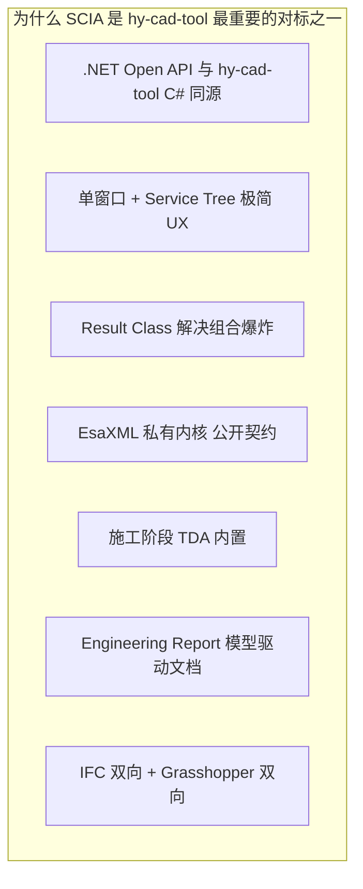

> **核心命题**：如果说 ABAQUS 教 hy-cad-tool"求解器怎么独立成进程"，那么 SCIA 教 hy-cad-tool **"在 C# 世界里如何把建模—分析—设计—出图变成一个内聚整体而不变成 OOP 大泥球"**。

---

## 二、产品线全景与边界

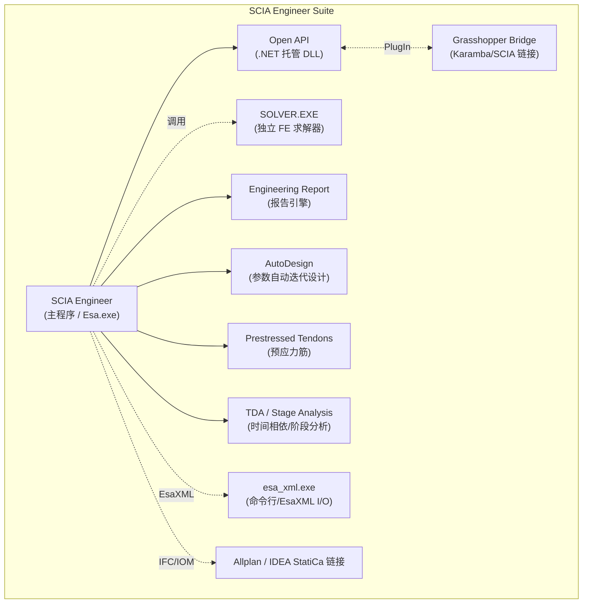

| 组件 | 角色 | 关键产物 |
|------|------|----------|
| **SCIA Engineer 主程序 (`Esa.exe`)** | 单一图形宿主：建模、荷载、网格、计算调度、设计、出图 | `.esa`（项目）、`.esax`（备份）、`.eswad`（自定义库） |
| **SOLVER.EXE** | 独立有限元求解器子进程，所有计算（线性 / 非线性 / 模态 / 稳定 / 动力 / TDA）的承担者 | `.dat / .ces / .ces2 / .l01..lNN`（中间矩阵）、`.rs?`（结果数据库） |
| **Open API（.NET）** | 托管 DLL（`SCIA.OpenAPI.*`）+ PlugIn 框架，让 C# / IronPython 进入模型、荷载、结果对象 | 第三方 DLL 插件 |
| **esa_xml.exe** | 批处理 CLI：把 `.esa` 与 `EsaXML` 互转、批量计算、批量出报告、CI 入口 | `*.xml`（EsaXML 文档）、`*.esa` |
| **Engineering Report** | 报告引擎：实时绑定模型/结果/校核，输出富文档 | `.docx / .pdf / .rtf / .ezr` |
| **AutoDesign** | 迭代式自动选型（截面 / 配筋 / 厚度），调用 SOLVER + Design 反复 | — |
| **TDA / Stage Analysis** | 施工阶段、徐变、收缩、混凝土龄期、张拉序列、复合梁 | `.tda` 阶段表 |
| **Grasshopper Bridge** | Rhinoceros 7+ 内置组件，通过 EsaXML/OpenAPI 双向同步几何与结果 | `.gh / .esa` |

> **hy-cad-tool 启示 ①**：SCIA 把"求解器 / 报告引擎 / CLI / 主程序 / API"**严格切成可独立替换的进程或 DLL**。这正好是 hy-cad-tool 想要的：UI 不知道求解器是谁、求解器不知道报告引擎是谁、CLI 不需要 GUI 也能跑完整链路。

---

## 三、宏观分层架构

SCIA 不是经典"前/解/后"三段式，而是**"一体化窗口 + 服务化工作流 + 独立求解 + 公开契约"** 的四层结构：

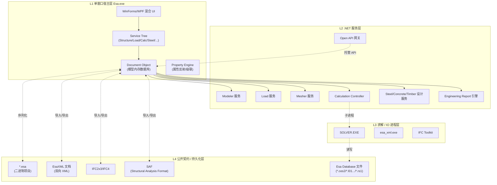

### 3.1 关键的"四层契约边界"

| 边界 | 通信形式 | 谁可以越界 |
|------|----------|------------|
| **UI ↔ 服务层** | C# 方法调用（同进程） | SCIA 内部 |
| **服务层 ↔ 求解进程** | 文件 + IPC（`.dat`、`.ces2`、`.rs?`） | SCIA + 高级用户 |
| **服务层 ↔ Open API** | 托管对象（`Project`, `Member1D`, `LoadCase`, `Result`） | 第三方插件 |
| **任意层 ↔ 公开契约** | EsaXML / IFC / SAF / SAF Excel 模板 | 任意第三方 |

> **hy-cad-tool 启示 ②**：hy-cad-tool 的服务边界要复刻 SCIA 的"**同进程 → 子进程 → 托管 API → 文件契约**"四圈套娃，最里圈快但封闭，最外圈慢但开放，禁止跨圈直连。这能避免"插件直改内存模型"导致的崩溃噩梦。

### 3.2 与 ABAQUS 的范式差异

| 维度 | ABAQUS | SCIA Engineer |
|------|--------|---------------|
| 主线哲学 | 文本输入卡 → 子进程求解 → 二进制 ODB | 单窗口 GUI → Document → 子进程求解 → 结果 DB |
| 主用户语言 | Python（CAE 内嵌） | .NET（Open API） + IronPython |
| 模型形态 | `.inp` 文本卡为权威 | `.esa` 二进制 + EsaXML 旁路 |
| 求解器边界 | `.inp` / `.odb` 文件契约 | DB 文件 + IPC，**对外封闭** |
| 设计模块 | 无（仅分析） | 钢/混/木/铝/复合一体内置 |
| 出图/报告 | 第三方 | **内置 Engineering Report** |
| UX 范式 | 多 App 工作流 | 单窗口 Service Tree |
| 二开门槛 | UMAT/UEL 高 | C# Open API 低 |

> SCIA 是 **"开发者友好+工程师友好"双高分**的典型，而 ABAQUS 是 **"开发者友好+工程师专业型"** 的代表。hy-cad-tool 应在 **道路 / 岩土 / 桥梁** 这条窄路上取 SCIA 的双友好范式。

---

## 四、单窗口 + Service Tree：UX 与体系架构同构

### 4.1 Service Tree：UX 即工作流

SCIA Engineer 打开后，主窗口左侧永远是一棵"服务树"。这棵树**不是菜单，而是工作流状态机**：

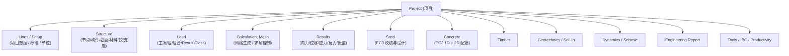

| 设计要点 | 价值 |
|----------|------|
| **每个服务 = 一个工作阶段** | 用户不必学菜单层级，按树往下走即可 |
| **服务内 = 命令族** | 服务展开后是一组命令（"New", "Modify", "Check"...） |
| **服务可重入** | 任何时刻可回到"Structure"修改，再次"Calculation"自动重算 |
| **服务带状态** | "未计算 / 已计算 / 已校核" 在树上有图标显示 |
| **服务可由 OpenAPI 触发** | 插件可以"打开 Steel 服务并触发校核" |

> **hy-cad-tool 启示 ③**：Blender 风的 hy-cad-tool UI 完全可以把"道路设计 / 边坡 / 挡墙 / 沉降 / 地基"做成一棵 Service Tree——**树即工作流**。把"建模 → 网格 → 求解 → 结果 → 设计 → 报告" 六阶段固化在树上，命令只在所属服务激活时显示。这能让初学者用"按树往下走"代替"翻菜单"。

### 4.2 属性引擎：单一面板搞定所有对象

SCIA 的另一个 UX 杀手锏是**右侧 Property Pane**：所有对象（构件、荷载、截面、组合……）共用同一个属性面板，依靠 Property Engine（反射 + 元数据驱动）自动生成。


| 元数据特征 | 价值 |
|------------|------|
| `[Group("Geometry")]` | 折叠分组 |
| `[VisibleIf("Type=Beam")]` | 条件可见性 |
| `[Unit("m")]` | 单位换算自动化 |
| `[ListSource("Materials")]` | 下拉来源动态绑定 |
| `[Cascade("CrossSection")]` | 属性互锁 |

> **hy-cad-tool 启示 ④**：hy-cad-tool 各类几何对象 / 注释符号 / 道路实体应共用 **一个属性面板 + 元数据驱动**。这避免了"每加一种对象写一个对话框"的反模式，也让 OpenAPI 插件的新对象**自动获得属性 UI**——这正是 SCIA 让插件零 UI 成本扩展的奥秘。

---

## 五、Document 模型：内存中的"项目数据库"

`Document` 是 SCIA 的中央对象，它是一个**面向对象、带版本、带事务、带事件**的内存数据库。所有 UI / 服务 / OpenAPI / 持久化都围绕它运转。

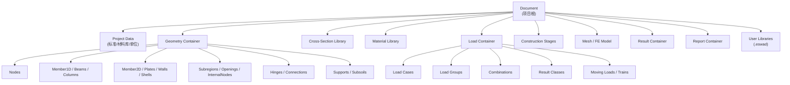

### 5.1 Document 的四个工程性能特征

| 特征 | 实现方式 | 价值 |
|------|----------|------|
| **事件驱动脏标记** | `INotifyPropertyChanged` + 中央 `DirtyTracker` | UI 自动刷新 / 报告自动重算 |
| **撤销/重做** | Command Pattern + Memento | OpenAPI 的修改也走撤销栈 |
| **跨服务一致性** | 任意服务修改后广播 `ModelChanged` | 计算与设计自动失效 |
| **延迟序列化** | 二进制流分块（geometry / loads / results） | 大模型打开秒级响应，结果按需加载 |

> **hy-cad-tool 启示 ⑤**：`hyob` 几何核已实现"几何 + 元数据"的内存形态，但目前缺**事件总线 + 脏标记 + Undo 栈**。SCIA 在这三件套上的成熟度是 hy-cad-tool 应直接抄过来的关键基建——不抄会在多服务集成时翻车。

### 5.2 对象寻址：永久 ID 与命名混合

SCIA 每个对象都带：
- **GUID**（OpenAPI 永久键，对外暴露）
- **可读名称**（`B1, B2, S1`，用户改名后 GUID 不变）
- **类型 + 索引**（内部高速查找）

这让 **EsaXML 跨版本稳定、OpenAPI 引用稳定、用户重命名不破坏脚本**，三件事同时成立。

> **hy-cad-tool 启示 ⑥**：`hyob` 对象的 `id` 字段必须是 GUID（已实现），但**显示名**也必须独立存在，避免脚本/报告引用断裂。

---

## 六、几何 / 单元 / 截面 / 材料体系

### 6.1 物理模型 vs 分析模型双层

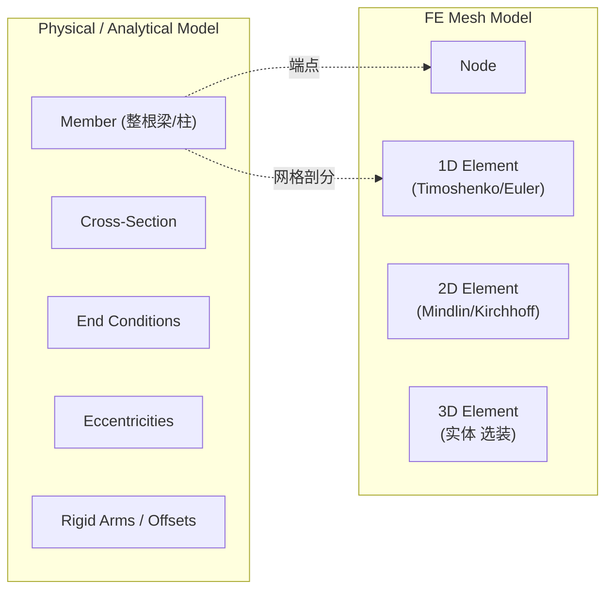

| 设计点 | 价值 |
|--------|------|
| **构件先于单元** | 用户操作的是"梁柱板"，不是节点和单元 |
| **网格在最后** | 改截面 / 改约束不破坏几何 |
| **铰、偏心、刚臂作为构件属性** | 不引入"附加节点 + 短刚性单元"的脏招 |
| **FE 单元由 Mesher 自动生成** | 用户基本不关心 |

> **hy-cad-tool 启示 ⑦**：SCIA 这条"物理模型为权威，FE 模型是衍生物"路线和 ABAQUS CAE 的"Mesh 在最后"完全一致。这对道路 / 桥梁 / 挡墙这种"构件语义为先"的领域是**唯一正确路线**。

### 6.2 1D 单元家族

| 类型 | 用途 | 公式 |
|------|------|------|
| Beam | 通用梁柱 | Timoshenko（默认）/ Euler-Bernoulli |
| Truss | 仅轴向 | 拉压 |
| Cable | 仅受拉 | 几何非线性 |
| Press-only | 仅受压 | 几何非线性 |
| Rigid Arm | 刚臂 | 主从约束 |
| Beam on Foundation | 弹性地基梁 | Winkler 子土 |

### 6.3 2D 单元家族（SCIA 的强项）

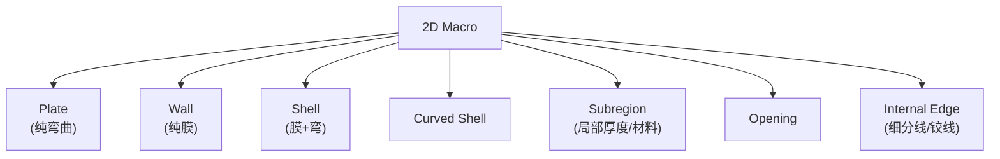

| 细节 | 价值 |
|------|------|
| Plate / Wall / Shell 类型显式 | 自动选择 6 自由度还是 5 自由度 |
| Subregion（子域） | 同一板上局部加厚不必拆板 |
| Internal Edges | 在板内部强制网格断开（用于支座线、铰线） |
| Eccentric 2D | 板偏心于参考面（楼板与梁顶对齐） |

> **hy-cad-tool 启示 ⑧**：道路工程的挡墙、桥墩、桥面板都是 2D macro 思维。hy-cad-tool 必须有 `Subregion`、`InternalEdge`、`Opening` 三个抽象，不能让用户"切板做子区域"。

### 6.4 截面与材料库

| 子库 | 内容 |
|------|------|
| **Profile Library** | EU / US / 中国 / 俄罗斯型钢库；冷弯薄壁；铝；木；自定义参数化（I/T/L/C/Box/Pipe...） |
| **Cross-Section Editor** | 任意多边形 + 钢筋 + 钻孔 + 内空，自动计算 A/Iy/Iz/It/Iw/重心/塑性模量 |
| **Material Library** | 按 EC2/EC3/EC5/EC9 + 国家附件；自定义 |
| **Subsoil Library** | Winkler C1/C2 / Soilin（基于土层钻孔自动反算 C） |

> **hy-cad-tool 启示 ⑨**：截面计算（A、I、J、扭转刚度、塑性矩 …）是工程师天天用的"看不见的计算"。hy-cad-tool 即使一开始不做钢混设计，也要早建 `ISectionPropertyCalculator`，否则 1D 梁刚度无从谈起。

---

## 七、荷载体系：SCIA 最有原创性的部分

SCIA 在荷载/组合上的设计**领先于大多数 FEA**，是其差异化护城河。

### 7.1 五层抽象

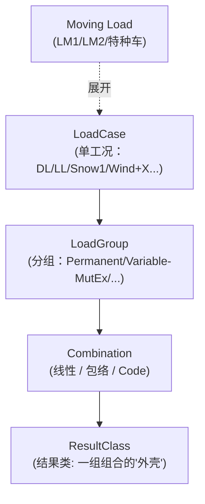

| 层 | 责任 | 用户工作量 |
|----|------|------------|
| LoadCase | 一个独立的荷载状态（带荷载类型 / 持续时间 / 重要性） | 每个工况都建 |
| LoadGroup | 工况之间的关系：永久 / 可变 / 互斥 / 同时 | 少量声明 |
| Combination | "Linear / Envelope / Code-EN / Code-NA-..." 四种 | 选择 Code 类型 |
| **ResultClass** | 一组组合的命名包，结果查看时一次性展示 | 1~5 个就够全工程 |
| Moving Load | 沿规定路径自动生成 N 个 LoadCase | 1 次声明 → 自动展开 |

### 7.2 Code Combinations：自动展开 Eurocode 数千条线性组合

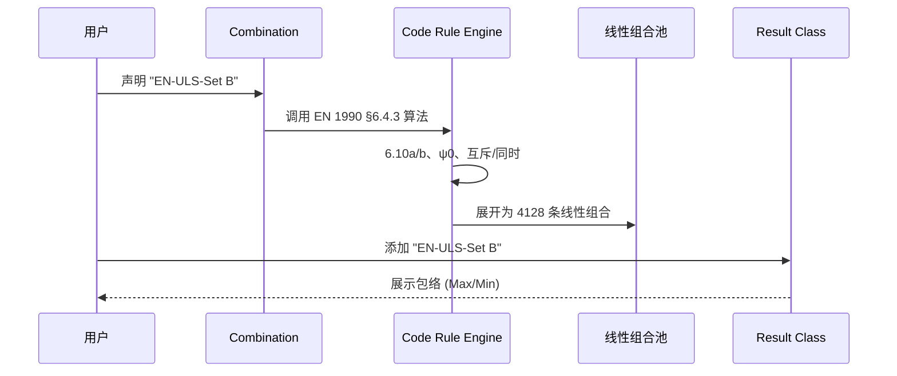

| 特征 | 价值 |
|------|------|
| 用户**不再手写线性组合** | 几十条规则代替几千条加法 |
| 国家附件可换 | 同一模型一键切 NA(DE) / NA(NL) / NA(CZ) |
| **包络在 SOLVER 内部算** | 不在 UI 后处理算，性能能撑住大模型 |
| **ResultClass 是查看入口** | 用户只面对"4 个 ResultClass"，而不是"4128 条组合" |

> **hy-cad-tool 启示 ⑩**：道路 / 岩土 / 桥梁的规范（公路-级、铁路-级、TB10092、TB10093 等）同样是"几条规则展开成几千条组合"。hy-cad-tool 必须**从第一天起就引入 ResultClass 抽象**，而不是等"用户太累了"才补救。否则一旦数据结构落地为"LoadCombination 单层列表"，再升级就要砸界面。

### 7.3 Moving Load / Trains：车辆荷载机器

| 元素 | 说明 |
|------|------|
| Train | 一组沿路径运动的"车厢"（轴重 + 间距） |
| Path | 模型上的运动轨迹（边/线/链） |
| Step | 沿路径离散为 N 步 → 自动生成 N 个 LoadCase |
| Envelope | 自动产出包络结果（最大弯矩、剪力、反力 …） |

> **hy-cad-tool 启示 ⑪**：道路工程的"汽车荷载横向布置"本质就是 SCIA Moving Load 的二维退化。hy-cad-tool 应在 `IAnalysisPipeline` 上预留 `IMovingLoadGenerator` 接口，**生成的是 LoadCase 序列**（而不是直接施加结果），保持与 ResultClass 的解耦。

---

## 八、网格（Mesher）

### 8.1 网格服务的输入与输出

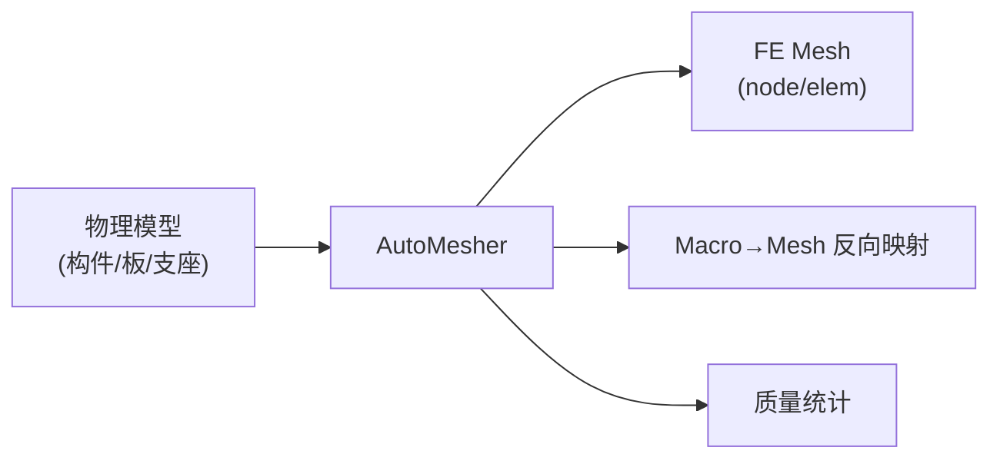

| 设计点 | 价值 |
|--------|------|
| **物理 → 网格映射可逆** | 结果可以回到"梁/板"级别显示 |
| **Mesh Refinement** 局部加密 | 在节点/线/区域上声明，不破坏几何 |
| **2D 网格质量保护** | 三角/四边角度、长宽比、扭曲度阈值 |
| **网格在每次"计算"前自动再生** | 用户不必显式触发 |

### 8.2 1D 网格生成

- 沿构件中线划分单元，节点处对齐；
- 支持沿构件长度方向插入"分析节点"以放置点荷载、铰、子土变厚等；
- 高阶单元（用户可选）。

### 8.3 2D 网格生成

- 主流为 **Delaunay 三角化 + 四边对生成 + 平滑**；
- 边界 / 内部线 / 开洞 / 子区域作为约束；
- 与 1D 自动相交（楼板与梁连接）。

> **hy-cad-tool 启示 ⑫**：hy-cad-tool 早期 Mesher 不必自研，可直接桥接 Gmsh / Triangle / Netgen，但**接口要按 SCIA 模式设计**：输入物理模型，输出"网格 + 反向映射"。反向映射是后处理回到构件级显示的关键，不可省。

---

## 九、求解器架构

### 9.1 求解器是独立子进程

SCIA Engineer 的 Esa.exe 自身不做有限元运算。每次"Calculation"都派发到独立的 **SOLVER.EXE**：

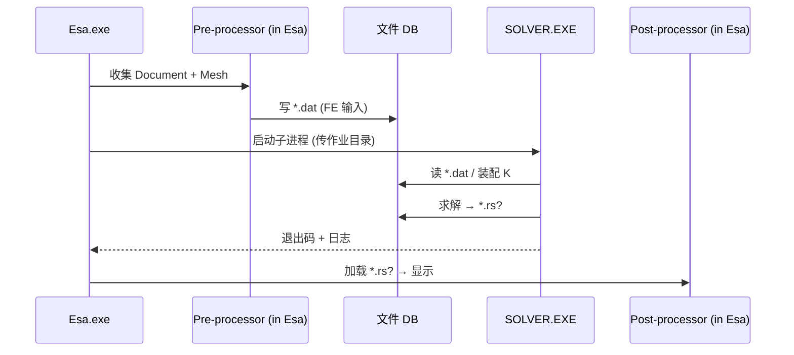

| 设计点 | 价值 |
|--------|------|
| **子进程边界** | UI 不会被计算阻塞 / 崩溃 |
| **多 SOLVER.EXE 可并行** | 多工况 / 多设计迭代可并发 |
| **作业目录约定** | 易于 CI、易于备份、易于回放 |
| **退出码 + 日志** | UI 可统一处理"成功 / 不收敛 / 超内存" |

### 9.2 求解类型谱系

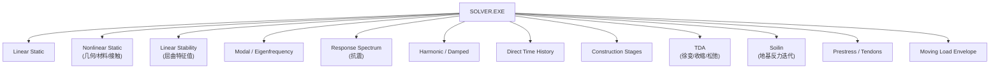

| 类型 | 关键算法 |
|------|----------|
| Linear Static | 直接稀疏求解（MUMPS 风格） |
| Nonlinear Static | Newton-Raphson + 弧长（Riks） |
| Stability | Lanczos / Subspace 特征值 |
| Modal | Lanczos / Subspace |
| RSA | 振型叠加（CQC / SRSS） |
| Direct TH | Newmark-β |
| TDA | 增量步 + 龄期分层 + 徐变模型（EC2 Annex B） |
| Soilin | 与 FE 内部迭代 C1/C2 直至收敛 |
| Press | 预应力筋几何 + 摩擦损失 + 锚具损失 + 长期损失 |

### 9.3 非线性策略与 ABAQUS 对照

| 项 | ABAQUS Standard | SCIA Engineer |
|----|-----------------|---------------|
| 迭代法 | Full / Modified / Quasi Newton | Newton-Raphson / Picard / Timoshenko |
| 弧长 | Riks / Modified Riks | Modified Newton with Line Search / Riks |
| 步长 | 自动 Cutback | 用户/自动增量 + 阶段细分 |
| 不收敛策略 | Restart + Cutback | 续算 + 上次迭代点恢复 |
| 大变形 | NLGEOM | 几何非线性开关 + Π-Δ |

> **hy-cad-tool 启示 ⑬**：SCIA 的非线性深度不及 ABAQUS，但**对工程师够用**。这给 hy-cad-tool 一个**清晰的"够用边界"**：不要花精力做 ABAQUS 级非线性，瞄准 SCIA 级（Newton + Riks + 几何非线性 + Π-Δ）即可覆盖 95% 道路结构需求。

### 9.4 阶段分析（Construction Stages）与时间相依（TDA）

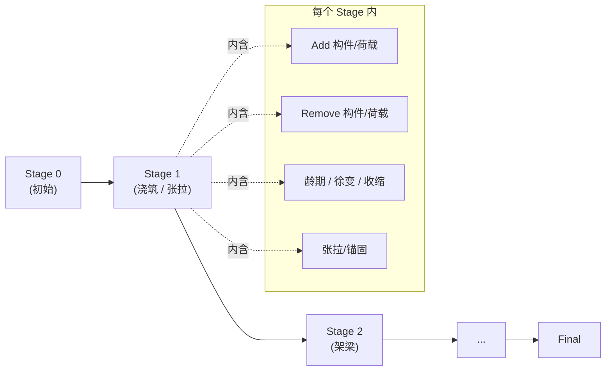

| 设计 | 价值 |
|------|------|
| 每个 Stage 是 **加/减 子模型 + 时间步** | 桥梁、复合梁、施工模拟天然适用 |
| 每个 Stage 都能拿到独立结果 | 满足"阶段强度复核" |
| TDA 内含徐变/收缩/松弛模型 | 长期变形可信 |
| 求解器内部增量步 + 反复积分 | 用户只声明阶段，不写积分 |

> **hy-cad-tool 启示 ⑭**：道路工程的**填筑—预压—固结—二次填筑**正是阶段分析。`AnalysisPipeline` 的 Step 抽象应**直接对齐 SCIA 阶段语义**：每个 Stage 是 (加/减子模型, 时间长度, 模型参数演化, 子分析类型)。这与 ABAQUS 的 Step 是同构的，但 SCIA 加了"加/减子模型"，比 ABAQUS 更适合工程结构。

---

## 十、设计模块：建模—分析—设计在同一窗口

### 10.1 一体化设计是 SCIA 的护城河

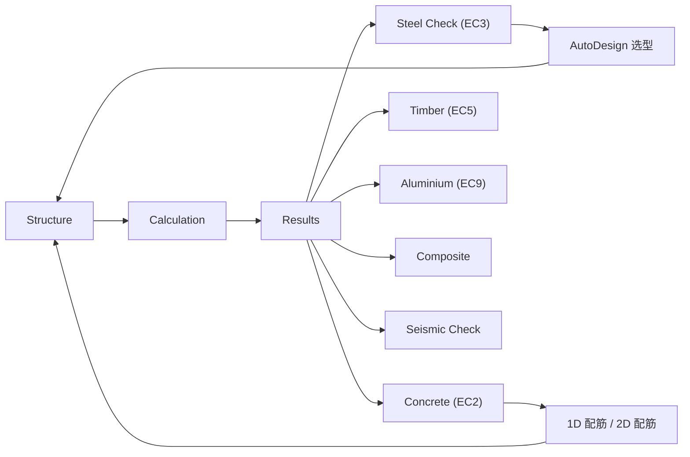

| 模块 | 输入 | 输出 |
|------|------|------|
| Steel | 截面 + 内力 + EC3/NA | 利用率、构件级整体检查、连接（与 IDEA StatiCa 联动） |
| Concrete | 截面 + 钢筋 + 内力 + EC2/NA | 1D 配筋面积、2D 钢筋网、裂缝、挠度 |
| Timber | 截面 + 内力 + EC5 | 利用率 |
| Aluminium | 同上 + EC9 | 利用率 |
| Composite | 钢-混 + EC4 | 抗弯/抗剪/受力组合 |
| Geotechnics / Soilin | 子土 C1/C2 与 FE 迭代 | 反力 / 沉降 |
| Seismic | 振型 / RSA / 等效横向力 | 谱组合 / 不规则性 |

### 10.2 AutoDesign：分析与设计的闭环

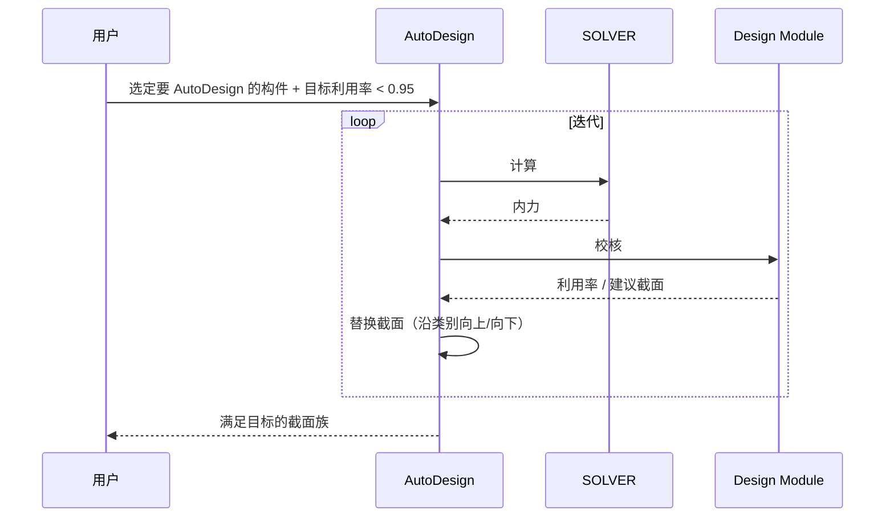

> **hy-cad-tool 启示 ⑮**：道路工程"挡墙厚度自动配筋""桥墩配筋迭代"完全可以套 AutoDesign 模式。关键是 `IAnalysisPipeline + IDesignChecker + IObjectMutator` 三件套配齐，让"分析 → 校核 → 改模型 → 再分析" 形成自动回路。

---

## 十一、Open API（.NET）——hy-cad-tool 的直接对标

这是本调研对 hy-cad-tool 最重要的一章。SCIA Engineer Open API 几乎是 hy-cad-tool 想要的 OpenAPI 的"参考实现"。

### 11.1 整体结构

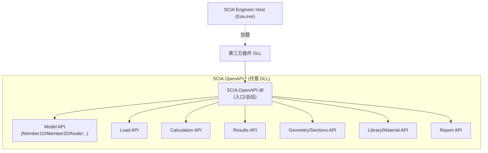

| 子 API | 关键类 |
|---------|--------|
| Session | `Environment`、`Project`、`OpenAPI` | 创建/打开/保存 |
| Model | `Member1D`、`Member2D`、`Node`、`Hinge`、`Eccentricity` | 创建/修改/删除 |
| Loads | `LoadCase`、`LoadGroup`、`Combination`、`ResultClass`、`PointForce`、`LineForce`、`SurfaceForce`、`MovingLoad` | 全套 |
| Calc | `CalculationStarter` | 触发 / 等待 / 拉日志 |
| Results | `ResultRequest`、`Result1D`、`Result2D`、`InternalForces`、`Displacements` | 按构件 / 截面 / 单元 / 节点 |
| Sections | `CrossSection`、`CSSLibrary` | 截面读写 |
| Libraries | `MaterialLibrary`、`SubsoilLibrary` | 读写 |
| Reports | `Report`、`Template`、`Section` | 构建 / 输出 |

### 11.2 三种使用模式

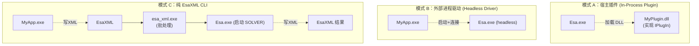

| 模式 | 适用 | 性能 | 部署难度 |
|------|------|------|----------|
| A 插件 | 交互式扩展 / UI 增强 | 高 | 低 |
| B Headless | 服务器批量 / Web 后端 | 中 | 中（需 SCIA 安装） |
| C EsaXML CLI | CI、设计循环、第三方桥 | 低（含 XML 序列化） | 中（含 license） |

> **hy-cad-tool 启示 ⑯**：hy-cad-tool 至少要做到 SCIA 的"**模式 A + 模式 C**"——
> - 模式 A：插件 DLL 在主进程内运行，依赖宿主对象（hyob、Recorder、CommandBus）。
> - 模式 C：完全离线，通过 hyob 文本 + JSON/YAML 配置驱动求解链路，**用于 CI 与服务器化**。
> 这是 hy-cad-tool 跨过"工具脚本"门槛走向"工程平台"的必经之路。

### 11.3 EsaXML：开放契约的样板

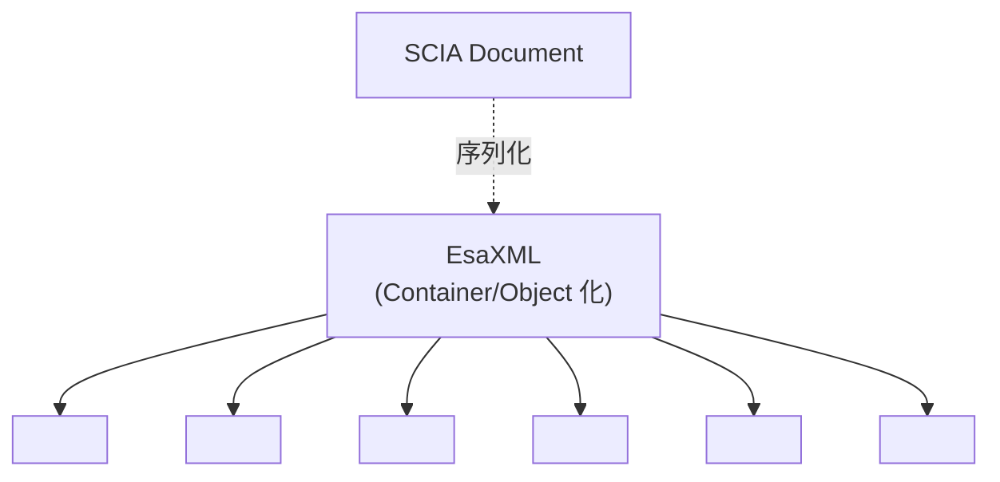

| 设计 | 价值 |
|------|------|
| **Container + Object + Property** 三级标签 | 简单到可手写 |
| **TypeID + Class 名双标识** | 跨版本可读 |
| **完全覆盖 Document 元素** | 模型可双向往返 |
| **可仅传子集** | 增量更新支持 |

> **hy-cad-tool 启示 ⑰**：`hyob` 的对外文本格式（YAML 或 JSON）应学 EsaXML 的"**Container/Object/Property + 类型 ID**"三级结构。**避免一开始用扁平 schema**，否则将来扩展会污染老格式。

---

## 十二、Engineering Report：模型驱动文档

SCIA 真正区别于 STAAD / Robot / ETABS 的是**报告引擎**。Engineering Report 不是"导出 Word"，而是一种**带模板的活文档**：

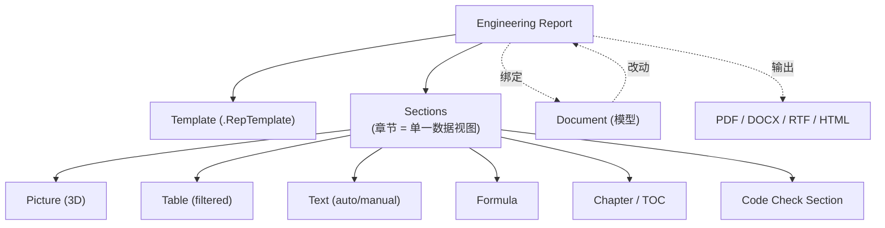

| 特征 | 价值 |
|------|------|
| **章节绑定模型对象** | 改截面后报告中所有相关图、表、公式自动重算 |
| **过滤器是一等公民** | "只显示利用率 > 0.8 的构件" |
| **模板可复用** | 公司模板库 |
| **CLI 可批量生成** | `esa_xml.exe` 可一键出报告 |
| **多种导出** | 适配业主格式要求 |

> **hy-cad-tool 启示 ⑱**：道路 / 桥梁 / 挡墙的计算书是工程交付物的**最终形态**。hy-cad-tool 必须在第一年内做出"Engineering Report 雏形"——哪怕只是 Markdown + Mermaid + 表格的最简单形态。**计算书与模型绑定**是 SCIA 给出的最重要工程指引。

---

## 十三、BIM 互操作：IFC / SAF / Grasshopper

```mermaid
graph TB
    SCIA["SCIA Engineer"]
    SCIA <-.IFC2x3/IFC4.-> Allplan["Allplan / Revit / Tekla"]
    SCIA <-.SAF (Excel).-> ETABS["ETABS / Robot / RSTAB"]
    SCIA <-.EsaXML.-> ThirdParty["第三方"]
    SCIA <-.IOM.-> IdeaConn["IDEA StatiCa Connection"]
    SCIA <-.OpenAPI.-> GH["Grasshopper"]
    SCIA <-.OpenAPI.-> Karamba["Karamba3D"]
```

| 通道 | 用途 |
|------|------|
| **IFC 双向** | 建筑模型互通；分析模型走 `IfcStructuralAnalysisModel` |
| **SAF（Structural Analysis Format）** | NemetschekGroup 推动的开放结构分析 Excel 模板；行业级中立 |
| **EsaXML** | SCIA 自家强 |
| **IOM** | IDEA StatiCa 节点设计专用 |
| **Grasshopper** | 通过 SCIA Grasshopper 组件，调用 OpenAPI 同步几何 |

> **hy-cad-tool 启示 ⑲**：道路工程的 BIM 互通弱于建筑，但 **IFC4 + LandXML + OpenDRIVE** 是必然方向。hy-cad-tool 应建 `IBimInteropPort` 防腐层，**至少一通一去**（导出 IFC，导入 LandXML）。SCIA 的"一中心 + 多接口"模型可直接借鉴：**核心模型只一个，接口插件每种格式一个**。

---

## 十四、错误与诊断：用户能"看见错误"

SCIA 把"诊断"做得很产品化，有几个值得借鉴的细节：

```mermaid
graph TB
    Solv["SOLVER 计算"]
    Solv -- 成功 --> Ok["✅ 计算成功"]
    Solv -- 警告 --> Warn["⚠ 警告<br/>(机制不影响结果)"]
    Solv -- 错误 --> Err["❌ 错误"]
    Err --> Loc["定位:<br/>哪个节点/构件/工况"]
    Err --> Cause["原因分类:<br/>机制/奇异/不收敛/超内存"]
    Err --> Fix["建议修复:<br/>加约束/改步长/拆工况"]
```

| 设计 | 价值 |
|------|------|
| 错误定位到具体对象 | 用户一键跳转到模型 |
| 错误分类有限 | 不堆栈、不抛异常字符串 |
| 建议修复 | "你应该 X" 而不是"内部错 0x80004003" |
| 警告与错误分离 | 警告允许继续 |

> **hy-cad-tool 启示 ⑳**：hy-cad-tool 的求解器异常**必须落到"对象 + 原因 + 建议"三元组**，对应到 hyob 对象的 GUID。这是工程软件易用性的关键分水岭——抛"NullReferenceException"是工具，抛"节点 N123 在工况 LC4 下出现奇异：建议加 Z 向约束"才是产品。

---

## 十五、设计哲学的几条主线

### 15.1 "Single Window, Service Tree, One Document"——一体化是 UX 的底层
所有工作流元素同居一个窗口，依靠 Service Tree 引导，文档对象贯穿。**用户没有"切换 App"的负担**。

### 15.2 ".NET as First-Class Citizen"——C# 是头等公民
Open API 是托管 DLL，与 IronPython 并列。这让 SCIA 在 .NET 工程团队中**采纳成本最低**。这也是 hy-cad-tool 应**坚守 C# 单语种栈**的强论据。

### 15.3 "Document is the Truth"——内存数据库是真理
所有计算、设计、报告都基于同一 Document，文件只是序列化形态。**多视图自动同步**的根基。

### 15.4 "Result Class > Combination"——抽象层级上移
比"线性组合"再上一层抽象（ResultClass）：用户的"心智单位"是包络，不是组合。

### 15.5 "Code is Plugable"——规范是插件
EC2/EC3/EC5/EC9 + 国家附件全部插件化。可换可加可叠。这是 hy-cad-tool 道路 / 公路规范要走的路。

### 15.6 "Solver is a Subprocess"——求解就是子进程
与 ABAQUS 一致。SCIA 的实践证明：**这不是高级架构，是必选项**。

### 15.7 "Report is Live"——报告活着
报告不是一次性导出，是绑定模型的实时视图。

### 15.8 "Stage is First-Class"——阶段是一等公民
TDA / Construction Stage 自始内置，不是"扩展模块"。

---

## 十六、对 hy-cad-tool 的可执行启示清单

### 16.1 直接对标的架构映射

```mermaid
graph TB
    subgraph map ["SCIA Engineer → hy-cad-tool 架构映射"]
        Doc1["SCIA Document"]
        Hyob1["hyob 内存模型 + 事件总线"]
        Tree1["Service Tree"]
        UI1["Blender 风 Service Tab"]
        Prop1["Property Engine"]
        Prop2["元数据驱动属性面板"]
        Lc1["LoadCase / Group / Combination / ResultClass"]
        Lc2["LoadCase / LoadCombination / ResultClass<br/>(直接照搬命名)"]
        Stage1["Construction Stage / TDA"]
        Stage2["AnalysisStage / TimeDependentParams"]
        Solv1["SOLVER.EXE"]
        Solv2["ISolverBackend<br/>(子进程 + 文件契约)"]
        Oapi1["SCIA.OpenAPI .NET DLL"]
        Oapi2["HyCAD.OpenAPI .NET DLL"]
        Xml1["EsaXML"]
        Xml2["hyob YAML/JSON 公开格式"]
        Rep1["Engineering Report"]
        Rep2["HyCAD Report (Markdown + 模板)"]
        Ad1["AutoDesign"]
        Ad2["IDesignLoop"]
    end
    Doc1 --> Hyob1
    Tree1 --> UI1
    Prop1 --> Prop2
    Lc1 --> Lc2
    Stage1 --> Stage2
    Solv1 --> Solv2
    Oapi1 --> Oapi2
    Xml1 --> Xml2
    Rep1 --> Rep2
    Ad1 --> Ad2
```

| SCIA 组件 | hy-cad-tool 对照 | 借鉴深度 |
|-----------|------------------|----------|
| Document + Event Bus + Undo | `hyob` + `ModelChangeBus` + `UndoStack` | ◎ 直接套用 |
| Service Tree | Service Tab（道路 / 边坡 / 挡墙 / 沉降 / 报告） | ◎ UX 范式照搬 |
| Property Engine | 元数据驱动统一属性面板 | ◎ 强烈推荐 |
| LoadCase / Group / Combination / **ResultClass** | 同名抽象，**ResultClass 第一天就要有** | ◎ 命名直接照搬 |
| Construction Stage / TDA | `AnalysisStage` + 加/减子模型 + 时间演化 | ◎ 直接套用 |
| SOLVER.EXE 子进程 | `ISolverBackend` 子进程编排 | ◎ 完全照搬 |
| Open API (.NET) | `HyCAD.OpenAPI.*` 托管 DLL | ◎ 范式照搬 |
| EsaXML | `hyob` YAML/JSON 公开格式 | ◎ 三级结构照搬 |
| Engineering Report | Markdown 模板 + 模型绑定 | ◎ 工程交付物根基 |
| AutoDesign | `IDesignLoop` 分析—校核—改模型闭环 | ○ 中长期目标 |
| Code Plugin | `ICodeCheckerRegistry` (公路 / 铁路 / 公铁两用) | ○ 二开心脏 |
| IFC / SAF / GH | `IBimInteropPort` + IFC / LandXML / OpenDRIVE | △ 优先 LandXML |

### 16.2 应做（高 ROI）

1. **Service Tree 化 UI**：把"道路 / 边坡 / 挡墙 / 沉降 / 出图"等做成一棵树，每个节点 = 一个工作流阶段。
2. **统一 Property Engine**：所有对象共用一个元数据驱动属性面板，杜绝"一对象一对话框"。
3. **ResultClass 抽象 Day 1 引入**：不要落到"LoadCombination 单层列表"陷阱。
4. **AnalysisStage = SCIA Construction Stage**：每阶段含"加/减子模型 + 时间长度 + 参数演化 + 子分析类型"。
5. **SOLVER 强制子进程**：与 ABAQUS 启示一致；SCIA 二次佐证。
6. **HyCAD.OpenAPI (.NET DLL)**：与 SCIA OpenAPI 同结构（Session / Model / Loads / Calc / Results / Report 六大子 API）。
7. **hyob 三级文本格式 + 类型 ID**：学 EsaXML"Container / Object / Property"。
8. **Engineering Report 雏形**：哪怕 Markdown，也要做到"改模型 → 报告变化"。
9. **错误三元组（对象 / 原因 / 建议）**：取代异常字符串。
10. **CLI 模式 (`hycad-xml.exe`)**：批处理、CI、服务器化的入口，参照 `esa_xml.exe`。

### 16.3 不应做（陷阱）

1. ❌ **不要把 LoadCombination 做成扁平列表**——一定要有 ResultClass。
2. ❌ **不要让插件直改 hyob 内存**——必须走 Command Bus + OpenAPI 托管对象。
3. ❌ **不要把"求解"嵌进 UI 进程**——子进程是底线。
4. ❌ **不要发明"私有 Excel 格式"**——直接对接 SAF / LandXML / EsaXML 等开放契约。
5. ❌ **不要把"网格" 当用户对象**——网格是几何衍生物，物理模型才是真理。
6. ❌ **不要让设计模块"复制"分析结果**——设计共享 Document，否则两套数据漂移。
7. ❌ **不要追求 ABAQUS 级非线性**——SCIA 级（Newton+Riks+Π-Δ）已覆盖 95% 道路场景。

### 16.4 立即可执行的对标动作（6 周内）

| 优先级 | 动作 | 工作量 |
|--------|------|--------|
| **P0** | 起草 `IServiceNode` + `ServiceTree` 架构（UI 层 + 工作流层） | 1 周 |
| **P0** | 起草 `IPropertyEngine`（元数据 + 反射 + 双向绑定 + 级联可见性） | 1 周 |
| **P0** | 定义 `LoadCase / LoadGroup / LoadCombination / ResultClass` 四级抽象 + C# 类型 | 3 天 |
| **P0** | 起草 `AnalysisStage`（加/减子模型 + 时间长度 + 参数演化） | 3 天 |
| **P1** | 起草 `HyCAD.OpenAPI.dll` 公开 API 雏形（Session / Model / Loads / Calc / Results 五个 namespace 的接口签名） | 1.5 周 |
| **P1** | 起草 `hyob` 三级文本格式规范（Container / Object / Property + 类型 ID） | 1 周 |
| **P1** | 实现 `hycad-xml.exe` CLI（最小可用：打开 hyob、跑 CalculiX、出结果摘要） | 1.5 周 |
| **P2** | 起草 `Report` 章节绑定模型对象（Markdown + 过滤器） | 1 周 |
| **P2** | 起草 `ICodeCheckerRegistry` 与"公路-级"插件雏形 | 1 周 |
| **P3** | 写 hy-cad-tool 与 SCIA OpenAPI 命名映射表（用于将来插件移植） | 3 天 |

---

## 十七、与同系列文档的关系

| 维度 | ABAQUS（02 号） | SCIA Engineer（本文 14 号） |
|------|-----------------|----------------------------|
| 求解器抽象 | 提供"子进程 + .inp/.odb 文件契约"范式 | 验证"子进程 + 二进制 DB"亦可，但**对外补 EsaXML** |
| 模型权威 | `.inp` 文本卡 | 内存 Document（`.esa` 序列化） |
| 用户语言 | Python | .NET / IronPython |
| Step 抽象 | Step / Increment / Iteration 三级 | Construction Stage（加/减子模型 + 时间演化） |
| 扩展模式 | UMAT / UEL / Python | OpenAPI + EsaXML |
| 报告/出图 | 第三方 | 内置 Engineering Report |
| 对 hy-cad-tool | 求解器内部架构的"标尺" | 一体化产品形态的"模板" |

**两份文档配套阅读，互补不冲突：**
- ABAQUS 教 hy-cad-tool **"内核 / 子进程 / 文本契约 / 本构扩展"** 的工业级范式。
- SCIA 教 hy-cad-tool **".NET API / 单窗口 UX / 一体化设计 / 报告引擎 / 阶段分析"** 的产品级范式。
- hy-cad-tool 的最终形态 ≈ **ABAQUS 内核范式 + SCIA 外壳范式 + 道路领域专长**。

---

## 十八、参考与延伸阅读

> 以 SCIA / Nemetschek 官方文档为准；本报告仅做架构提炼，不替代任何手册细节。

- **SCIA Engineer Help / User Reference**（主程序、Service Tree、Properties）
- **SCIA Engineer Open API Reference**（.NET DLL 类与方法签名）
- **SCIA Engineer Open API Tutorial / Samples**（C# / IronPython 示例）
- **EsaXML 文档**（Container / Object / Property 规范）
- **SCIA Engineer Engineering Report Manual**
- **TDA / Construction Stages Manual**
- **Moving Load Manual**
- **SAF（Structural Analysis Format）规范**（Nemetschek Group 推动）
- **Soilin Manual**（地基反力 C1/C2 迭代）
- **SCIA-IDEA StatiCa IOM 文档**
- 上游：`docs/01-全球三维有限元软件对标调研-2026-05-14.md` § 4.6 SCIA Engineer
- 配套：`docs/FiniteElement/02-ABAQUS-Dassault-SIMULIA-有限元计算架构深度解析-2026-05-14.md`
- 关联：`docs/02-有限元通用底座架构-从挡土墙开始-2026-05-14.md`（待对接：Service Tree、Property Engine、ResultClass、AnalysisStage）

---

## 修订记录

| 日期 | 修订人 | 说明 |
|------|--------|------|
| 2026-05-14 | — | 初版：SCIA Engineer 产品线 + 单窗口/Service Tree UX + Document 内存数据库 + 物理模型与 FE 双层 + 五层荷载体系（含 ResultClass）+ 网格 + SOLVER 子进程 + 阶段/TDA + 一体化设计 + Open API/.NET + EsaXML + Engineering Report + BIM 互通 + 20 条 hy-cad-tool 对标启示与 6 周执行清单 |
