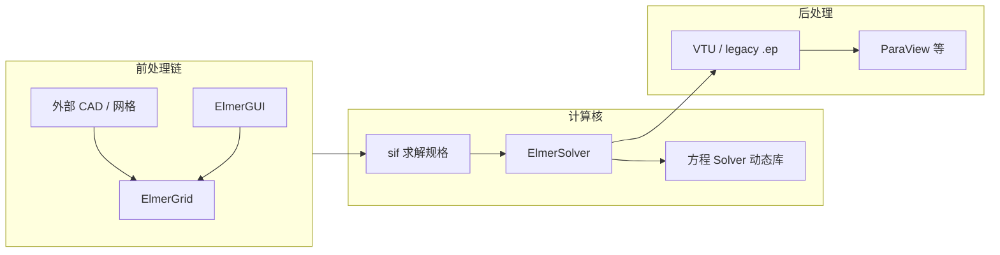

# Elmer FEM 有限元计算架构深度解析（CSC · 芬兰）

> 文档日期：2026-05-14  
> 上承：[../01-全球三维有限元软件对标调研-2026-05-14](../01-全球三维有限元软件对标调研-2026-05-14.md)  
> 并行：[../02-有限元通用底座架构-从挡土墙开始-2026-05-14](../02-有限元通用底座架构-从挡土墙开始-2026-05-14.md)  
> 文档目的：  
> 1. 从**软件架构与求解流水线**角度解析 **Elmer FEM**（芬兰 **CSC — IT Center for Science**，芬兰科学计算中心）——区别于「功能手册式罗列」，聚焦 **多物理场耦合策略、求解器模块化、sif 声明式模型、并行与线性代数分层**。  
> 2. 明确其与 **单体商业 CAE（Workbench / Abaqus CAE）** 的差异：Elmer 核心是 **Fortran 主导的 ElmerSolver + 外围工具链（网格 / GUI / 后处理）**，GUI 与求解核成熟度可能不同步（官方 Overview 亦提及）。  
> 3. 抽取对自研通用 FEM 底座（如 **中性域模型 · 多场编排 · `ISolverBackend` · 材料–场变量依赖**）可借鉴或需警惕的模式。

**主要依据**：CSC《Elmer FEM — Overview》（2023-04-06）、CSC《ElmerSolver Manual》（对应软件版本 **26.1**，2026-01-20）；源码托管 [ElmerCSC/elmerfem](https://github.com/ElmerCSC/elmerfem)。

---

## 一、总览与产品定位

### 1.1 一句话心智模型

Elmer 是面向 **偏微分方程（PDE, Partial Differential Equation）** 的 **开源多物理场有限元软件包**：在弱形式离散基础上，以 **隐式时间推进 + 非线性迭代 +（通常迭代的）线性代数求解** 为主线；设计上强调 **方程求解器的模块化与可扩展**，通过 **声明式求解器输入文件（sif, solver input file）** 把几何体、材料、方程组、边界条件与数值控制参数编织成可执行的仿真规格。

### 1.2 历史与许可边界（架构语境）

- **起源**：1995 年始于芬兰国家级 CFD 技术计划（Tekes 资助），初期联合体含 CSC、赫尔辛基理工大学（HUT）、VTT、于韦斯屈莱大学等；而后 **主要由 CSC 持续推进**（Overview）。  
- **开源**：2005 年 9 月起以 **GNU GPL** 发布；CSC 保留版权并可在 GPL 之外提供其他许可选项——对「能否闭源二次分发」需单独谈判，而非「公有领域」。  
- **用户心智**：科研 / 多物理场原型 / 需要审查或改写离散与求解流程的场景；单一场深耕工业认证链条时，Overview 亦坦诚 **某些单科能力与成熟商用单科代码相比可能不足**。

### 1.3 与对标文档中「阵营 C · 学术开源」的契合点

在全球三维 FEM 对标框架中，Elmer 落在 **开源多物理场求解器** 象限：强项是 **多场灵活耦合 + 用户可改求解过程 + HPC 并行**；弱项常体现为 **复杂 CAD 几何–网格闭环薄弱**（依赖外部网格）、**文档 / GUI 与求解核功能演进不同步**。

---

## 二、可执行文件拓扑：预处理 · 求解 · 后处理

Elmer 采用 **多可执行文件 + 库** 的经典 CAE 拆分（Overview），彼此可独立调用：

| 组件 | 角色 | 架构备注 |
|------|------|----------|
| **ElmerGUI** | 基于 **Qt** 的图形前处理；内嵌 **ElmerGrid**，可选 **tetlib / nglib**、**OpenCASCADE（CAD 导入）** | **不含原生几何建模**；复杂几何依赖外部 CAD→网格 |
| **ElmerSolver** | **求解主程序**，开发与文档投入的重心 | **各 PDE 求解器多以动态库形态存在**，标准接口按需链接 |
| **ElmerGrid** | 结构化网格生成、变换、**并行分区**、第三方网格导入 | C 实现，集成 **Metis** 图分割 |
| **ElmerPost** | 传统后处理器（Mesa + Tcl/Tk） | Overview 标明 **不再积极开发**；当前推荐 **VTU + ParaView** |
| **Mesh2D** | Delaunay 三角剖分，可被 ElmerFront / 自适应调用 | |
| **ViewFactors** | 辐射视角因子计算 | 多数情况下由 ElmerSolver **内部自动调用** |



**架构启示**：「**求解规格（sif）与网格文件分离**」天然对应自研里的 **AnalysisRecipe / CaseDescriptor**；GUI 只做生成与校验，**不把业务语义绑死在按钮事件里**。

---

## 三、源码模块依赖（GitHub 树）

Overview 给出的模块分工（编译维度）：

| 目录 / 模块 | 语言 | 职责 |
|-------------|------|------|
| **fem** | 主要为 **Fortran 90** | **ElmerSolver** 主体：单元库、组装、各方程 Solver |
| **elmergrid** | **C**（含 **Metis**） | 网格与分区 |
| **hutiter** | **Fortran 90** | **迭代线性代数求解器**，由 ElmerSolver 调用 |
| **matc** | **C** | **表达式解释器**：sif 中的数学表达式、ElmerPost 命令窗 |
| **eio** | **C++** | **Elmer I/O 库**，服务求解器部分读写 |
| **mathlibs** | 混合 | Lapack、Blas、Arpack、Parpack 等底层数学库封装 |
| **post** | **C** | ElmerPost（遗留） |
| **ElmerGUI** | C++/Qt | 新一代前处理 |

**结论**：Elmer 是 **Fortran 数值核 + C/C++ 胶水与 I/O + Qt GUI** 的典型 HPC FEM 栈；扩展方程时，心智应落在 **「新增 Solver 模块 + sif 关键字 +（可选）用户 Fortran」**，而非单一单体 EXE。

---

## 四、多物理场求解架构：松散耦合为主、紧耦合为补丁增强

ElmerSolver Manual 第一章把数学骨架交代得很清楚：

### 4.1 单场：\(F(u)=0\) 与非线性牛顿步

- **稳态或演化**：演化情形在时间层 \(t=t_k\) 上重复求解形如 \(F(u)=0\) 的问题。  
- **线性情形**：\(F(u)=b-Ku\)。  
- **非线性**：常用 **Newton 迭代**——每步解 Jacobian 方程 \(DF(u^{(m)})[\delta^{(m)}]=-F(u^{(m)})\)，再 \(u^{(m+1)}=u^{(m)}+\delta^{(m)}\)；亦支持 **滞后线性化（lagged-value）** 与 **松弛（relaxation）** 以改善收敛。

### 4.2 多场：默认 **非线性 Gauss–Seidel 块迭代**

设有 \(N\) 个场分量 \(u_1,\ldots,u_N\)，离散耦合方程为：

\[
F_i(u_1,\ldots,u_N)=0,\quad i=1,\ldots,N .
\]

原则上可做 **整体 Newton 或整体线性解**，但 Elmer **通常**采用 **非线性 Gauss–Seidel**：第 \(j\) 轮耦合迭代中，依次更新每个场，其余场 **冻结为上一步或本轮已更新值**，从而：

- **复用单场 Solver 与线性代数栈**；  
- **耦合 Jacobian 不必一次性装配为巨型稀疏块**（除非走紧耦合路径）；  
- 代价是：**强物理耦合**时可能收敛变差——Manual 明确提示此类情况更适合 **同时处理所有 constituent models**；部分物理模型已实现 **紧耦合策略**，但 **「通用紧耦合迭代框架」相对不成熟**。

Manual 给出的外层伪代码结构可概括为：

```text
for each time step k:
  initialize coupled guess u^(0)
  for coupling iteration j:
    for each field i = 1..N:
      solve F_i(..., u_i, ...) = 0  with other fields fixed / relaxed
```

**架构标签**：这是典型的 **分区求解（partitioned coupling）** ——与 **MONOLITHIC 单矩阵** 相对；适合 **插件化多场**，但要储备 **耦合发散时的退回策略**（阻尼、伪时间步、改为主求解块矩阵等）。

### 4.3 多场网格：一致网格 vs 多场独立网格 + 数据传递

- **默认**：各场共享 **同一套 Lagrange 型单元基**。  
- **进阶**：每个 Solver 可绑定 **独立网格**；松散耦合迭代时通过 **场数据传递（solution data transfer）** 交换信息，**非匹配网格亦可**，但 Manual 提醒：**高分辨率细节在向粗网格代表时会不可避免的损耗**。

对 hy-cad-tool：**网格中立 + Field Mapper（Mortar / L2 projection / 最近点插值）** 可作为独立 **Infrastructure**  capability，与具体本构解耦。

---

## 五、sif：声明式「仿真程序」——章节结构与执行语义

ElmerSolver Manual 第二章定义 **sif** 为求解器的精确规格语言，核心 **Section** 包括：

- **Header**（如 `Mesh DB`）  
- **Simulation**（坐标系、稳态/瞬态、输出文件名、`Post File = "case.vtu"` 等——Manual 指明 **VTU + ParaView** 为当前首选可视化路径）  
- **Constants**  
- **Body n / Material n / Body Force n / Equation n / Solver n / Boundary Condition n / Initial Condition n / Component n**

**Body–Equation–Solver 三层绑定**（Manual 叙述精髓）：

- **Body**：几何区域 → 关联 **方程组编号**、材料、体积力、初值。  
- **Equation**：列出作用于该 Body 的 **Solver ID 列表**。  
- **Solver**：给出具体方程离散、线性/非线性求解器关键字、收敛容差等。

**架构启示**：这是一个 **外置 DSL**：  

- 新增物理 = **新 Solver 段模板 + Models Manual 关键字**；  
- 业务编排 = **Equation 块组合**，而非硬编码 `switch(physics)`。

---

## 六、Solver 模块契约（插件边界）

Manual §1.3 将「Solver」定义为 Elmer 中负责：

1. **建立离散模型**（单元组装）；  
2. **单场非线性迭代逻辑**（若需要）；  
3. **调用标准线性求解接口**完成每次校正步。

由于接口统一，**引入新物理**的路径是：

> **新增独立软件模块（动态库） + 在耦合迭代中作为新的一环挂载** ——与 OpenSees 的「命令注册表 + Element/Material 子类」、MFEM 的「Operator + Solver」同属 **框架派** 而非 **封闭产品派**。

---

## 七、有限元离散层：从传统 Galerkin 到 hp、DG、边元与稳定化

Overview / Manual 综述层给出的「离散全家桶」特征：

| 方向 | Elmer 要点 |
|------|------------|
| **Lagrange 单元** | 1D/2D 多项式次数 \(p\le 3\)，3D 常用 \(p\le 2\)（Overview）；高阶 curved mapping 支持 |
| **hp-FEM** | 基于 **背景网格 + 单元级升阶 / 细化**，内置连续性协调机制（Manual §1.3.3）；复杂曲面几何与高阶元的通用适配仍有限 |
| **稳定化** | **残差自由气泡（RFB）**、**SUPG** 等；与子尺度 / bubble 增强相关 |
| **DG** | **间断 Galerkin** 路径存在 |
| **H(curl) / H(div)** | **棱边元（edge）**、**面元（face）** ——附录 F 给出构造要点；支撑电磁矢量方程等 |
| **Mortar** | 非匹配界面弱约束；动机之一是 **旋转电机定转子**（Manual §9） |

**架构启示**：Elmer 把「**单元工厂 + 形式弱语句 + 稳定项开关**」做成 **Solver 内部策略组合**，而不是把每种 stabilize 方案复制成独立程序——对应自研中的 **`IWeakFormBuilder` + stabilizer 策略注入**。

---

## 八、线性代数与预处理：三层迭代外壳

实际求解中，Manual 指出：**Newton / 耦合外层之内，还有线性 Krylov 迭代层** ——呈现 **三层迭代**（耦合 → 非线性 → 线性）的常见 HPC FEM 结构。

Elmer 提供的线性解法类别（Overview / Manual 目录）：

- **直接法**：LAPACK、**UMFPACK**（GPL 版源码亦打包）  
- **Krylov + ILU** 等代数预处理  
- **代数多重网格（AMG）与几何多重网格（GMG）** ——适用于部分基础方程  
- **特征值**：Arpack / Parpack 路径  
- **可选外部并行稀疏直接解算器**：**Mumps、SuperLU、Pardiso** ——Manual 说明 **许可限制导致官方二进制未必内置**，需用户自行编译链接  

近年强调：**由纯代数预处理走向-block / physics-based splitting** 类预处理（Manual §1.3.5 语气）。

另：**块矩阵构造以组装紧耦合模型**（Manual 第 14 章标题）——与 §4.2「松散耦合为主」形成 **双轨**：  

- 松散：**多块迭代 + 较小线性系统**；  
- 紧密：**单一大块（或块预处理）线性系统** ——实现与建模复杂度更高。

---

## 九、边界与约束：周期 · Mortar · 线性约束

Manual 第 8–11 章体现 Elmer 在 **约束处理** 上的工程完整度：

- **Dirichlet / soft limiter**：后者通过迭代激活「接触集」式约束，带有 **Limiter Load Tolerance** 等数值开关 ——体现 **非线性互补问题（NCP）** 风格的近似处理。  
- **周期边界**：隐式（消元）vs 显式（需迭代）；支持平移 / 旋转 / 缩放映射与 **反周期**。  
- **Mortar**：弱形式匹配 \( \int (u_1-u_2)\phi\,d\Gamma\)；离散得 \(Mu_1=Nu_2\) 型耦合；**动态 mortar** 服务于滑动界面。  
- **并行注意事项**：Mortar 界面分区归属需仔细规划，否则并行组装受限（Manual 并行章节提示）。

---

## 十、并行计算：域分解 + 分区网格 + 通信光晕

Manual §17：Elmer 并行基于 **domain decomposition（区域分解）**。

- **预处理**：用 **ElmerGrid** 将网格划分为与进程数一致的 **partition**，生成 `partitioning.N` 子目录及 **`part.k.shared`** 等辅助文件；规则结构化网格可用 `-partition nx ny nz`，一般图分割可调 **Metis（PartGraphKway / PartGraphRecursive）**。  
- **分布式数据**：分区边界存在 **halo / ghost** 单元副本以服务特定离散（如 DG）。  
- **计算**：与 **MPI** 模型一致（Overview 亦列 MPI / OpenMP）。

**架构启示**：并行 **落在网格分区与组装通讯模式**，而非要求用户改写 PDE 声明；自研若采用 **分布式稀疏矩阵**，需在 **中性网格** 层暴露 **partition metadata + halo DOF 映射**。

---

## 十一、用户扩展：MATC · Fortran User Function · User Solver

Manual 强调三类扩展：

1. **MATC**：解释型表达式 ——适合 **参数表驱动、材料系数依赖场变量** 的快速原型，无需单独编译。  
2. **Fortran 90 函数**：与 MATC 关键字并行存在，用于性能敏感或复杂逻辑。  
3. **User Solver / User Function**：Manual 第 19 章给出 **编译、链接动态库** 的流程 ——Elmer 的开源价值不止「免许可」，而是 **可插入离散与求解循环**。

这与 ABAQUS UMAT / COMSOL 插件方程形成对标：**声明（sif） + 编译扩展（Fortran）** 双入口。

---

## 十二、优势、边界与对 hy-cad-tool 的映射

### 12.1 Elmer 的架构强项

- **多场耦合的一哲学**：默认分区迭代，易于横向加方程；必要时块矩阵紧耦合。  
- **离散方法覆盖面广**：同一求解器框架内集成稳定化、DG、边元、Mortar、自适应（2D 为主）。  
- **HPC 基因**：从源码分层（hutiter / Metis / 可选 Mumps）到文档化的并行网格前置流程。  
- **开源可审计**：GPL + GitHub，利于对照离散实现。

### 12.2 典型短板（官方亦承认）

- **CAD–网格–求解闭环**：复杂几何仍依赖外部工具链。  
- **GUI 与 Solver 功能错位**：Overview 明确提示二者成熟度可能不一致。  
- **通用紧耦合 Newton / 全自动块预处理** 相对「单场商用标杆」仍在演进。

### 12.3 对自研有限元底座的映射（概念层）

| Elmer 概念 | 可映射的自研抽象 |
|------------|------------------|
| sif Sections | **Case YAML / JSON Schema** 或 **`SimulationManifest`** |
| Body–Equation–Solver | **`PhysicalDomain` → `EquationSystemRef` → `SolverRecipe`** |
| 松散耦合 Gauss–Seidel | **`CouplingOrchestrator`**（外迭代）+ 单场 `ISolverBackend` |
| 块矩阵紧耦合 | **`MonolithicSystemAssembler` 或 Schur 补预处理管线** |
| MATC | **安全沙箱表达式引擎**（字段只读、 Deterministic） |
| Fortran User Solver | **原生 DLL / 托管回调** 插件契约（需 ABI 稳定） |
| ElmerGrid + Metis | **`IMeshPartitioner` + halo 生成器** |

---

## 十三、参考与延伸阅读

1. CSC — *Elmer FEM — Overview of Elmer*（Peter Raback, Mika Malinen，2023-04）——产品与模块总览。  
2. CSC — *ElmerSolver Manual*（Ruokolainen 等，对应 Elmer **26.1**，2026-01）——多场框架、sif 结构、线性/非线性/时间积分/并行/用户编程。  
3. 源码仓库：<https://github.com/ElmerCSC/elmerfem>  
4. CSC 应用文档入口（集群与应用说明）：<https://docs.csc.fi/apps/elmer/>  
5. 物理方程关键字细则：*Elmer Models Manual*（与 Solver Manual 分工：前者偏 **PDE 模型与材料**，后者偏 **通用求解控制**）。

---

*本文档为架构解读笔记，具体关键字默认值与版本差异以对应版本的 CSC 官方 PDF / 发行说明为准。*
