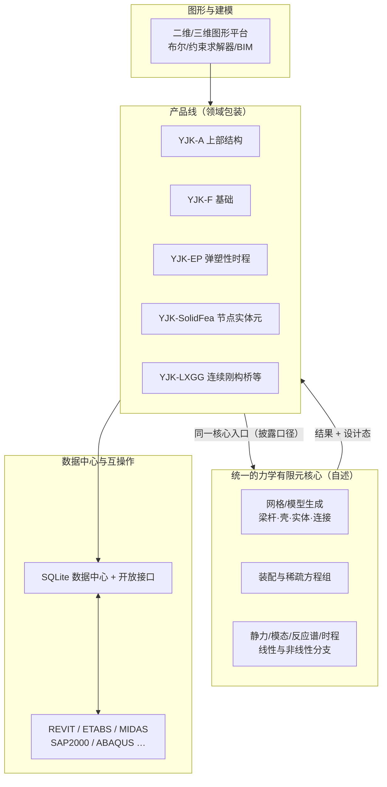
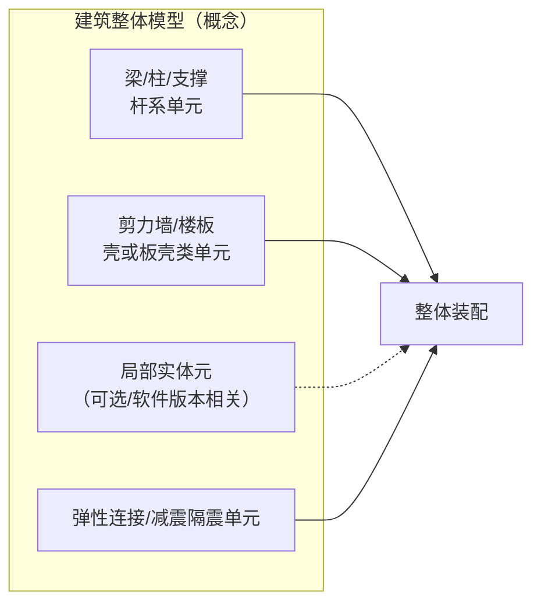

# 盈建科 YJK 有限元计算架构深度分析

> 文档日期：2026-05-14  
> 上承：
> - [01-全球三维有限元软件对标调研-2026-05-14](../01-全球三维有限元软件对标调研-2026-05-14.md)
> - [02-有限元通用底座架构-从挡土墙开始-2026-05-14](../02-有限元通用底座架构-从挡土墙开始-2026-05-14.md)
> 文档目的：
> 1. 在**不依赖逆向或未公开源代码**的前提下，依据上市公司披露、产品白皮书类公开材料，把 YJK 的有限元计算体系拆到**「统一内核—产品线—接口—典型算法」**四层，便于与 PKPM/SATWE、CSI、MIDAS 等对标。
> 2. 明确 YJK 在**建筑结构一体化设计**语境下的 FEM 边界：哪些是「单一通用核心」、哪些是「领域模块包装」、哪些是「外挂精细分析/外部求解器」。
> 3. 提炼对 hy-cad-tool 可借鉴的架构决策（统一 IR、协同迭代、弹塑性隐式路线、数据中心互操作），并标出**不可机械照搬**之处（闭源黑箱、规范强绑定）。

---

## 一、调研口径与信息来源

| 项 | 说明 |
|----|------|
| **分析对象** | 北京盈建科软件股份有限公司「YJK 建筑结构设计软件系统」及其子模块（上部结构、基础、弹塑性、节点实体元、桥梁等）中的**力学计算路径** |
| **主要信源** | 公司首次公开发行股票并在创业板上市**招股说明书（申报稿）**等公开披露中关于产品与核心技术的自述；辅以官网产品介绍、业界对产品与学术渊源的综述性描述 |
| **刻意不做** | 对 YJK 可执行文件/私有格式的反编译、对未公开 API 的猜测性「还原实现」 |
| **结论性质** | 下文中的模块划分、算法名称（如 FNA、Newmark-β、纤维束/分层壳）来自**公司自述**；稀疏矩阵存储格式、具体预条件子、第三方 BLAS 版本等**实现级细节**在公开材料中通常不可见，文中以「推断层」单独标注 |

> **与 01 号总调研的关系**：YJK 落在「阵营 D 国产」中与 PKPM 并列，但产品哲学更接近 **CSI 系「建筑/桥梁场景 + 强规范设计闭环」**，而非通用多物理场 CAE。

---

## 二、总览：「统一有限元核心 + 多业务流水」

YJK 在公开材料中反复强调的第一条架构事实是：**上部结构、基础、复杂楼板、预应力、桥梁等模块的力学计算，统一走同一套有限元核心**（而非每类产品挂一个独立求解器 EXE 的「烟囱式」堆叠）。在此之上，再叠合自主二维/三维图形平台、规范自动化、施工图与数据中心。

| 架构要点 | 公开材料中的依据 | 对架构分析的含义 |
|----------|------------------|------------------|
| **统一 FEM 核心** | 招股说明书：各主要计算模块「均采用统一的有限元核心进行分析计算」 | 类似 CSI「SAPFire 单内核、多前端」——**有利于维护一条 IR/装配/求解主干**，产品线差异主要在荷载、组合、规范与施工图 |
| **64 位 + 多核并行** | 自述在计算软件、弹塑性等产品中强调 64 位环境、并行、部分场景 GPU | 属于**工程规模与交付体验**层面的架构决策，与「数学内核是否自研」正交，但影响部署与许可叙事 |
| **图形平台自研** | 披露三角面容量、布尔、多文档、类族约束求解等 | **几何—网格—分析**链路在厂商内部可深度定制；与依赖 Parasolid/ACIS 的通用 CAE 路线不同 |

---

## 三、产品线视角：谁在用 FEM、用到哪一层

### 3.1 核心计算类模块（强依赖统一 FEM）

| 模块（公开简称） | 典型 FEM 场景 | 披露中可见的算法/单元关键词 |
|------------------|---------------|------------------------------|
| **YJK-A**（建筑结构计算） | 常规与复杂高层建筑整体分析；弹性时程；隔震减震构件非线性时程与整体分析接力 | 「快速求解器」；弹性/非线性时程；**FNA 法**与**非线性直接积分法**并提；多种弹性连接；实体单元自动划分 |
| **YJK-F**（基础） | 筏板/桩筏等有限元分析；沉降与协同 | 以「**有限元位移值与沉降值一致**」为收敛准则的**迭代**；桩土拉压刚度不同的**非线性迭代** |
| **YJK-EP**（弹塑性时程） | 大震动力弹塑性 | 梁、柱、斜撑：**柔度法纤维束**；墙、板：**非线性分层壳**；**Newmark-β 隐式直接积分**；多核并行；**塑性铰模型**与纤维束并提 |
| **YJK-SolidFea** | 复杂节点**脱离**整体模型的实体精细分析 | 4/6/8 节点实体元与**变节点实体元**；强调从整模**抽取**节点与荷载 |
| **YJK-LXGG**（连续刚构桥等） | 桥梁整体与构件 | **实体元 + 壳元**；非线性杆元模拟预应力钢束；自动剖分 |

### 3.2 规范与专项分析中的「FEM 作为工具箱」

| 场景 | 说明 |
|------|------|
| **YJK-M（砌体等）** | 披露中称可采用**有限元法**计算抗震墙片的剪力分配系数、底框层刚度等——属于在**整体设计流程**中调用 FEM 子问题的模式 |
| **工业类（石化设备框架、筒仓、水池、管廊、地铁车站）** | 公开材料多次出现「壳元划分风荷载」「整体有限元计算」「上下部与基础协同建模」等表述——说明 **FEM 核心被复用到工业与市政模板化建模管线** |

### 3.3 外部 CAE：互操作而非替代内核

| 接口 | 角色 |
|------|------|
| **YJK → ABAQUS** | 将模型导入 ABAQUS，利用其**更丰富的单元与本构**做非线性求解；结果回读 |
| **YJK ↔ SAP2000 / MIDAS / ETABS / REVIT** | 数据转换与协同设计（披露中列为接口软件与数据中心能力） |

**架构解读**：YJK 的「统一核心」定位于**建筑结构设计与国内规范闭环**；当用户需要材料/接触/细节本构极致扩展时，走 **ABAQUS 外挂路径**——这与 ANSYS 用户偶发「本地粗算 + 外包精细算」的分工类似。

---

## 四、力学模型层：单元、连接与多尺度

### 4.1 建筑整体分析：杆系 + 壳 +（可选）实体

从披露与行业常识综合（行业常识部分在图中用虚线表示推断）：

| 主题 | 公开信息能支撑的结论 |
|------|----------------------|
| **壳元自由度与工程折减** | 官网技术文章可见对**壳元面内/面外/横向剪切等刚度系数**的放开或折减类参数——属于**面向设计调参的壳理论开关**，不是通用 CAE 的「纯材料点积分」路径 |
| **弹塑性构件层次** | **纤维束（柔度法）**与**分层壳**被明确写进 YJK-EP 技术描述；并强调与**滞回、损伤指标、性能设计**输出联动 |
| **节点精细分析** | SolidFea 强调**全协调网格**、变节点实体元——典型 **Global–Local** 二阶段：整体线弹性或简化的非线性 + 局部实体塑性/应力集中 |

### 4.2 桥梁（YJK-LXGG）

披露强调相对梁理论（欧拉/铁木辛柯）更细的**实体+壳**模型、预应力钢束的**非线性杆元**，以及自动网格——架构上仍是**同一套核心上的「桥梁前处理模板」**，而不是独立的第三方内核。

---

## 五、求解与动力分析架构

### 5.1 静力与特征值

公开材料对**具体特征值算法（子空间迭代/Lanczos）**几乎未点名，仅在产品功能层描述「周期、振型」等。架构上可合理推断：

- 存在**线性化整体刚度、质量矩阵**；
- 与**反应谱、振型分解法**等规范流程对接；
- 与 CSI「SAPFire 模态子系统」类似，属于 L1 求解层的**黑盒能力**。

### 5.2 时程：FNA 与直接积分并列

YJK-A 披露中明确：**时程分析提供 FNA 法与非线性直接积分法**，以支持隔震减震等需求。

| 方法 | 典型用途（建筑软件语境） |
|------|---------------------------|
| **FNA（Fast Nonlinear Analysis）** | 将非线性限于**连接/隔震支座等少量自由度**，主体保持弹性模态叠加，追求**效率与工程可接受精度** |
| **非线性直接积分** | 主体构件也进入非线性（YJK-EP），配合 Newmark-β **隐式**积分 |

### 5.3 弹塑性：隐式路线 + 并行

公司在披露中强调：解决**大震隐式算法迭代收敛**难题，以隐式替代「易发散的显式」路线（为其市场叙事服务，细节未公开）。同时写明 **Newmark-β**、**多核 CPU 近满载**、部分 **GPU 加速**。

**对架构文档的提醒**：  
「隐式优于显式」在**建筑结构滞回、大规模自由度、慢动力**语境下是常见产品选择，但并非普适真理（冲击、碰撞仍以显式为主）。对标时应把 YJK-EP 定位成**建筑抗震弹塑性专用引擎**，而非通用冲击动力学内核。

---

## 六、基础与土—结构耦合：一条「外层迭代 + 内层 FEM」链路

YJK-F 的披露给出了非常明确的**架构语义**：

1. **上部—基础—地基协同**：迭代使**有限元位移与沉降口径一致**，作为收敛判据——这是典型的**多场耦合外层迭代**，内层仍是结构 FEM + 地基反力模型。  
2. **抗浮、人防、拉压差异**：采用**模拟拉压刚度不同**的非线性迭代——说明在基础产品中，**非线性被刻意限制在可控的弹簧/地基分支**，以保证设计流程稳定。

这与 hy-cad-tool `02` 文档中的 **Layer 5 领域 / Layer 4 IR** 划分一致：**「协同迭代」属于领域编排，不应与稀疏求解器内核搅在一起**。

---

## 七、数据与互操作架构

### 7.1 SQLite 数据中心

披露称以 **SQLite** 为基础抽象结构工程数据，形成**文档 + 数据定义 + API** 的交换规范，并支撑与 Revit、ETABS、MIDAS、ABAQUS、SAP2000 等互导。

**架构含义**：

- **项目级单一事实源（SSOT）** 倾向明显，利于多模块接力（建模 → 计算 → 施工图 → 鉴定加固）。  
- 对第三方而言，互操作主战场在**数据模式与版本兼容**，而非公开「单元刚度公式」。

### 7.2 与 SAP2000 / ETABS 生态的「弱对称」关系

市面资料常把 YJK 与 SAP2000 接口、操作习惯对标。架构上更准确的说法是：

- **计算内核：** 两边**独立**；接口传递的是**模型与工况语义**，不是共享同一个 `Analysis.dll`。  
- **方法论：** YJK 团队公开叙述与北大力学 lineage、SAP84 一脉的学术语境有交集（常见于行业综述）；**具体到版权与代码归属**，以厂商披露为准，本文不引申为源代码等级结论。

---

## 八、与 PKPM（SATWE）及 CSI（ETABS）的对比轴

下表仅对比**架构角色**，不做「精度谁高」裁决（精度依赖闭源实现与题库）。

| 对比轴 | YJK（据披露） | PKPM/SATWE（行业共识画像） | CSI ETABS/SAPFire |
|--------|----------------|----------------------------|-------------------|
| **核心数量** | 强调**单一通用 FEM 核心**垂直到多模块 | 历史包袱下多程序整合，SATWE/PMSAP 等与系列模块并存 | **SAPFire 单内核**多前端 |
| **弹塑性** | 自有 YJK-EP，**隐式 + 纤维束/分层壳** | 系列内多引擎/多版本并存（随构力产品线演进） | 非线性能力在 SAPFire 内持续扩展；建筑弹塑性亦常见 |
| **规范与设计闭环** | 与国内规范、审图、施工图深度绑定 | 同理，生态更老、教材与图集惯性大 | 美标/欧标等强，国内规范需本地适配 |
| **开源/可编程** | 以数据中心与接口为主，**非用户可扩展 UEL 生态** | 同理 | OAPI 成熟；研究型用户友好度更高 |
| **精细化出路** | **SolidFea + ABAQUS 导出** | 亦有类似「专项模块/外部软件」路径 | 自身实体与非线性较全，较少依赖 ABAQUS |

---

## 九、对 hy-cad-tool 的启示（可执行的设计要点）

| 启示 | 说明 |
|------|------|
| **统一 `FemProblem` IR** | YJK 披露口径支持「**一条主干核心、多业务前端**」——与 `02` 中 Layer 4/3/2 划分一致；避免为每个专业重写装配器。 |
| **领域迭代与求解器解耦** | 基础沉降、抗浮等用**外层迭代**包装内层线性/弱非线性 FEM，而不是把「迭代」藏进求解器内部。 |
| **双轨动力：模态简化 + 全步隐式** | FNA 类与全量非线性积分并存，对应不同**成本/精度/规范场景**；接口上应显式暴露 `Procedure`（反应谱/FNA/DirectIntegration）。 |
| **Global–Local 产品化** | SolidFea 路线说明：局部实体精细分析应是**第二次提交**，从整模**抽取 BC 与荷载**，而不是强行全楼实体。 |
| **数据中心优先于「文件拼图」** | SQLite + 明确数据定义适合作为 **BIM/ CAD / 分析** 的中枢；与 `hyob`、DWG 双轨可思考「分析视图 vs 图纸视图」分离。 |
| **慎防过度对标** | YJK 的成功绑定在**规范库、施工图、国内交付链**；hy-cad-tool 若走「岩土/通用几何」路线，不应复制其全部产品厚度，只取**计算架构层**经验。 |

---

## 十、已知边界与后续若需加强的方向

1. **实现级空白**：稀疏格式、预条件、并行分区策略、线性方程直接法/迭代法选型比例等，公开材料未系统披露。  
2. **版本演进**：V3.x 起披露称「有限元核心计算」有幅度提升——具体变更需逐版 Release Note 跟踪。  
3. **若需工程级验证**：宜以**同一算例**在 YJK-EP 与 CSI/ABAQUS 之间做**指标层对比**（层间位移角、基底剪力、构件耗能），而非猜测矩阵装配细节。

---

## 十一、参考与引用说明

- 北京盈建科软件股份有限公司首次公开发行股票并在创业板上市**招股说明书（申报稿）**中关于产品介绍、核心技术、软件著作权列表等章节（公开网络转载文本，节选整理于 2026-05-14 对标研究）。  
- 盈建科官网技术文章（壳元刚度系数、复杂功能介绍等）。  
- 行业综述中对 **SAP84 学术渊源、建筑软件竞争格局** 的描述（非厂商官方汇编时，结论仅作背景，不作为实现证据）。

---

**文档版本**：1.0 | **编号**：42 | **路径**：`docs/FiniteElement/42-盈建科YJK有限元计算架构深度分析-2026-05-14.md`
